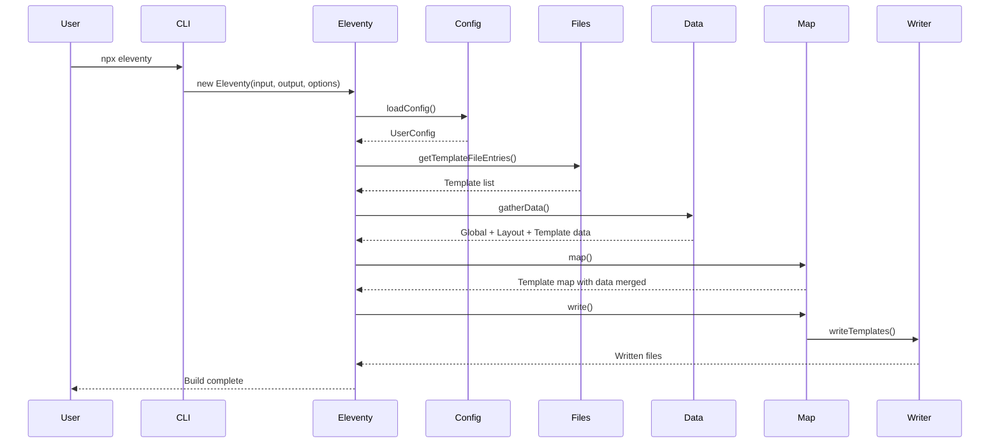
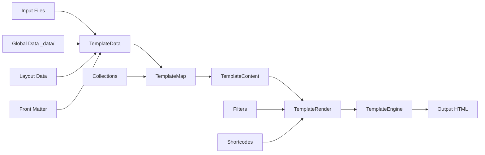

# Project Exploration: 11ty (Eleventy)

## Overview

11ty (Eleventy) is a simpler static site generator (SSG) that serves as an alternative to Jekyll. Written in JavaScript, it transforms a directory of templates (of varying types) into HTML. The 11ty ecosystem includes multiple packages beyond the core generator, including WebC (single-file web components), is-land (progressive enhancement islands), and various plugins.

**Core Philosophy:**
- **Simpler by default** - No build process required, works with raw HTML, Markdown, and JavaScript
- **Template engine agnostic** - Supports HTML, Markdown, JavaScript, Liquid, Nunjucks, with addons for WebC, Sass, Vue, Svelte, TypeScript, JSX
- **Progressive enhancement** - Islands architecture via is-land for partial hydration
- **Single-file components** - WebC provides a framework-agnostic component model

## Repository Structure

The 11ty source in this collection includes multiple related projects:

```
src.11ty/
├── eleventy/                          # Core SSG (v3.0.0-beta.1)
│   ├── src/
│   │   ├── Eleventy.js               # Main entry point and API
│   │   ├── EleventyServe.js          # Development server
│   │   ├── EleventyWatch.js          # File watching
│   │   ├── EleventyFiles.js          # File discovery and management
│   │   ├── TemplateConfig.js         # Configuration handling
│   │   ├── TemplateContent.js        # Template content processing
│   │   ├── Template.js               # Individual template handling
│   │   ├── TemplateCollection.js     # Template collection management
│   │   ├── TemplateLayout.js         # Layout inheritance
│   │   ├── TemplateMap.js            # Template dependency mapping
│   │   ├── TemplateWriter.js         # Output file writing
│   │   ├── TemplateRender.js         # Template rendering engine
│   │   ├── TemplatePermalink.js      # Permalink handling
│   │   ├── TemplatePassthrough.js    # Passthrough copy files
│   │   ├── TemplatePassthroughManager.js
│   │   ├── EleventyExtensionMap.js   # File extension mappings
│   │   ├── UserConfig.js             # User configuration API
│   │   ├── GlobalDependencyMap.js    # Dependency tracking
│   │   ├── FileSystemSearch.js       # File system search
│   │   ├── defaultConfig.js          # Default configuration
│   │   ├── cmd.cjs                   # CLI entry point
│   │   ├── Data/                     # Data file handling
│   │   │   ├── TemplateData.js
│   │   │   ├── GlobalDataMap.js
│   │   │   ├── TemplateDataFileMap.js
│   │   │   └── DataSchema.js
│   │   ├── Engines/                  # Template engines
│   │   │   ├── JavaScript.js
│   │   │   ├── Liquid.js
│   │   │   ├── Markdown.js
│   │   │   ├── Nunjucks.js
│   │   │   ├── Html.js
│   │   │   ├── Passthrough.js
│   │   │   ├── TemplateEngine.js     # Base class
│   │   │   └── *.js (Vue, Svelte, MDX, etc.)
│   │   ├── Errors/                   # Error handling
│   │   │   ├── EleventyBaseError.js
│   │   │   ├── EleventyErrorHandler.js
│   │   │   ├── EleventyConfigError.js
│   │   │   └── EleventyCompileError.js
│   │   ├── Filters/                  # Built-in filters
│   │   │   ├── Url.js
│   │   │   ├── Date.js
│   │   │   └── *.js
│   │   ├── Plugins/                  # Built-in plugins
│   │   │   ├── RenderPlugin.js       # Render templates in JS
│   │   │   ├── I18nPlugin.js         # Internationalization
│   │   │   ├── HtmlBasePlugin.js     # <base> element support
│   │   │   ├── InputPathToUrl.js     # Input path to URL transform
│   │   │   └── IdAttributePlugin.js  # ID attribute handling
│   │   └── Util/                     # Utilities
│   │       ├── ConsoleLogger.js
│   │       ├── PathPrefixer.js
│   │       ├── PathNormalizer.js
│   │       ├── ProjectDirectories.js
│   │       ├── TemplateCache.js
│   │       ├── TemplateFileSlug.js
│   │       ├── TemplateGlob.js
│   │       └── *.js
│   ├── test/                          # Test suite (AVA)
│   ├── test_node/                     # Node.js test runner tests
│   ├── docs/                          # Documentation source
│   └── package.json
│
├── webc/                              # WebC components (v0.11.4)
│   ├── webc.js                        # Main entry point
│   ├── test/                          # Tests
│   └── package.json
│
├── is-land/                           # Islands architecture (v4.0.0)
│   ├── is-land.js                     # Main component
│   ├── eleventy.cjs                   # Demo site config
│   └── package.json
│
├── eleventy-img/                      # Image optimization
├── eleventy-plugin-syntaxhighlight/   # Syntax highlighting
├── eleventy-plugin-rss/               # RSS feed generation
├── enhance-element/                   # Enhanced custom elements
├── enhance-ssr/                       # Server-side rendering
├── enhance-styles/                    # Styling utilities
└── api-screenshot/                    # Screenshot API
```

## Architecture

### High-Level Diagram

```mermaid
graph TB
    CLI[CLI / Programmatic API] --> Eleventy[Eleventy Class]

    subgraph Init["Initialization Phase"]
        Eleventy --> Config[TemplateConfig]
        Eleventy --> Directories[ProjectDirectories]
        Eleventy --> Files[EleventyFiles]
    end

    subgraph Discover["Discovery Phase"]
        Files --> Globber[TemplateGlob]
        Files --> ExtensionMap[EleventyExtensionMap]
        Globber --> Templates[Template Collection]
    end

    subgraph Data["Data Phase"]
        Templates --> TemplateData[TemplateData]
        TemplateData --> GlobalData[GlobalDataMap]
        TemplateData --> LayoutData[Layout Data]
        TemplateData --> TemplateDataLocal[Template Data]
    end

    subgraph Compile["Compile Phase"]
        Templates --> TemplateMap[TemplateMap]
        TemplateMap --> DependencyMap[GlobalDependencyMap]
        TemplateMap --> Layout[TemplateLayout]
        Layout --> Engines[Template Engines]
    end

    subgraph Render["Render Phase"]
        TemplateMap --> TemplateContent[TemplateContent]
        TemplateContent --> Render[TemplateRender]
        Render --> Engines
    end

    subgraph Write["Write Phase"]
        TemplateContent --> Writer[TemplateWriter]
        Writer --> Output[Output Files]
    end

    Engines --> Liquid[Liquid Engine]
    Engines --> Nunjucks[Nunjucks Engine]
    Engines --> Markdown[Markdown Engine]
    Engines --> JS[JavaScript Engine]
    Engines --> WebC[WebC Engine]
    Engines --> Vue[Vue Engine]
    Engines --> Svelte[Svelte Engine]

    style Eleventy fill:#bbf,stroke:#333
    style TemplateMap fill:#fbf,stroke:#333
    style TemplateContent fill:#bfb,stroke:#333
```

### Build Process Flow



## Core Components

### Eleventy Class (`src/Eleventy.js`)

The main programmatic API for Eleventy. This 700+ line class handles:

**Key Responsibilities:**
- Configuration loading and validation
- Template file discovery
- Data cascade management
- Build orchestration
- Watch mode and dev server
- Plugin registration

**Main Methods:**
```javascript
class Eleventy {
  // Initialize configuration and directories
  async init() {}

  // Set verbose mode
  setVerboseMode(bool) {}

  // Execute the build
  async execute() {}

  // Build all templates
  async toJSON() {}
  async write() {}

  // Watch mode
  async watch() {}

  // Development server
  async serve() {}

  // Stop all processes
  async stop() {}
}
```

### Template Engine Architecture

Each template engine extends a base `TemplateEngine` class:

```javascript
// src/Engines/TemplateEngine.js
class TemplateEngine {
  constructor(name, directories, config) {
    this.name = name;
    this.config = config;
  }

  // Compile template source
  async compile(str, inputPath) {}

  // Render with data
  async render(data) {}

  // Get render function
  getRenderFunction() {}
}
```

**Supported Engines:**
| Engine | File Extension | Package |
|--------|---------------|---------|
| HTML | `.html` | Built-in |
| Markdown | `.md` | `markdown-it` |
| Liquid | `.liquid` | `liquidjs` |
| Nunjucks | `.njk` | `nunjucks` |
| JavaScript | `.js` | Native ESM |
| WebC | `.webc` | `@11ty/webc` |
| Vue | `.vue` | `vue` |
| Svelte | `.svelte` | `svelte` |
| MDX | `.mdx` | `@mdx-js/node-loader` |
| TypeScript | `.ts` | `tsx` |

### Data Cascade

Eleventy uses a sophisticated data cascade system:

```
1. Package.json data (lowest priority)
2. Global data (from _data/)
3. Layout data
4. Directory data (from folder _data/)
5. Template data (front matter)
6. Permalink data
7. Global override data (highest priority)
```

**Data File Formats Supported:**
- JSON (`.json`)
- JavaScript (`.js`, `.mjs`, `.cjs`)
- YAML (`.yaml`, `.yml`)
- TOML (`.toml`)

### Template Layouts

Layouts use a chain of inheritance:

```markdown
---
# post.md
layout: base.njk
title: My Post
---
# Content
```

```nunjucks
{# base.njk #}
---
layout: null
---
<!DOCTYPE html>
<html>
  <head><title>{{ title }}</title></head>
  <body>{{ content | safe }}</body>
</html>
```

## WebC (Single File Web Components)

WebC is a framework-independent web components system that bundles HTML, CSS, and JavaScript in a single file.

**Key Features:**
- No build step required
- Automatic CSS bundling
- Component dependency resolution
- SSR-first with progressive enhancement
- `<style>` scoped by default

**Example WebC Component:**
```webc
<!-- components/card.webc -->
<template>
  <article class="card">
    <h2>{{title}}</h2>
    <slot></slot>
  </article>
</template>

<style>
  .card {
    border: 1px solid #ccc;
    padding: 1rem;
    border-radius: 8px;
  }
</style>
```

**Usage in templates:**
```webc
<!DOCTYPE html>
<html>
  <head></head>
  <body>
    <import components="/components/*.webc">
    <card title="Hello">Content here</card>
  </body>
</html>
```

## Islands Architecture (is-land)

`is-land` is a framework-agnostic partial hydration implementation.

**Key Features:**
- Framework independent (works with Vue, React, Svelte, Preact, etc.)
- Progressive enhancement
- Multiple loading strategies (idle, visible, media query)
- Tiny footprint (< 1KB)

**Usage:**
```html
<script type="module" src="is-land/is-land.js"></script>

<is-land when-visible>
  <heavy-component>
    <p>SSR content visible immediately</p>
  </heavy-component>

  <template data-onload>
    <script type="module" src="/components/heavy-component.js"></script>
  </template>
</is-land>
```

**Loading Strategies:**
- `when-idle` - Load when browser is idle
- `when-visible` - Load when element is in viewport
- `when-media="(min-width: 768px)"` - Load on media query match
- `data-load` - Manual trigger
- `data-onload` - Load immediately

## Plugins

### Built-in Plugins

**1. Render Plugin**
```javascript
import { renderFile } from "@11ty/eleventy";
let result = await renderFile("template.njk", { name: "Zach" });
```

**2. I18n Plugin**
- Multi-language support
- Locale-specific templates
- URL localization

**3. HTML Base Plugin**
- `<base>` element for relative URLs
- Path prefix handling

**4. InputPathToUrl Plugin**
- Transform input paths to URLs

### Official Plugins

| Plugin | Purpose |
|--------|---------|
| `@11ty/eleventy-plugin-rss` | RSS/Atom feed generation |
| `@11ty/eleventy-plugin-syntaxhighlight` | Syntax highlighting |
| `@11ty/eleventy-img` | Responsive image generation |
| `@11ty/eleventy-plugin-bundle` | CSS/JS bundling |

## Configuration

### Basic Configuration

```javascript
// eleventy.config.js
export default function(eleventyConfig) {
  // Passthrough file copy
  eleventyConfig.addPassthroughCopy("css");
  eleventyConfig.addPassthroughCopy("img");

  // Collections
  eleventyConfig.addCollection("posts", function(collection) {
    return collection.getFilteredByGlob("posts/*.md");
  });

  // Filters
  eleventyConfig.addFilter("date", function(date) {
    return new Date(date).toISOString();
  });

  // Shortcodes
  eleventyConfig.addShortcode("year", function() {
    return new Date().getFullYear();
  });

  // Components
  eleventyConfig.addJavaScriptFunction("myFunc", function() {
    return "Hello";
  });

  // Layout aliases
  eleventyConfig.addLayoutAlias("post", "layouts/post.njk");

  // Watch targets
  eleventyConfig.addWatchTarget("src/scss/");

  return {
    dir: {
      input: "src",
      output: "_site",
      includes: "_includes",
      data: "_data"
    },
    templateFormats: ["md", "njk", "html", "liquid"],
    htmlTemplateEngine: "njk",
    markdownTemplateEngine: "njk",
    pathPrefix: "/blog/"
  };
};
```

## Dependencies

### Core Dependencies (eleventy v3.0.0-beta.1)

| Dependency | Purpose |
|------------|---------|
| `liquidjs` | Liquid template engine |
| `nunjucks` | Nunjucks template engine |
| `markdown-it` | Markdown parsing |
| `gray-matter` | Front matter parsing |
| `chokidar` | File watching |
| `fast-glob` | File globbing |
| `posthtml` | HTML post-processing |
| `posthtml-urls` | URL transformation |
| `@11ty/eleventy-utils` | Shared utilities |
| `@11ty/dependency-tree` | Dependency tracking |
| `@11ty/recursive-copy` | Directory copying |
| `luxon` | Date/time handling |
| `kleur` | Terminal colors |
| `debug` | Debug logging |
| `filesize` | File size formatting |

## Data Flow



## Key Insights

1. **No Build Required** - Unlike other SSGs, Eleventy can work directly with HTML and Markdown without compilation.

2. **Template Engine Agnostic** - Supports multiple template engines simultaneously in the same project.

3. **Data Cascade** - Sophisticated data merging from multiple sources with clear priority order.

4. **Composable Architecture** - Small, focused modules that compose together (Template -> TemplateContent -> TemplateRender).

5. **Plugin System** - Extensible via configuration functions, custom tags, filters, shortcodes, and plugins.

6. **Watch Mode** - Efficient incremental builds with file watching and dependency tracking.

7. **WebC Innovation** - Single-file components without framework lock-in.

8. **Islands Architecture** - Progressive enhancement via is-land works with any framework.

9. **Convention over Configuration** - Sensible defaults but fully configurable.

10. **TypeScript Support** - Via `tsx` for configuration and JavaScript templates.

## Testing

**Test Structure:**
- AVA test runner for most tests
- Node.js built-in test runner for some tests
- Tests run from source (no build required)

```javascript
// test/TemplateTest.js
import test from "ava";
import Template from "../src/Template.js";

test("Create a Template", async (t) => {
  let tmpl = new Template("test/stubs/template-test.njk");
  t.truthy(tmpl);
});
```

## Performance Considerations

1. **Dependency Tracking** - `GlobalDependencyMap` tracks which templates depend on which data files for incremental builds.

2. **Template Caching** - `TemplateCache` caches compiled templates.

3. **Passthrough Copy** - Files that don't need processing are copied directly.

4. **Parallel Processing** - Some operations can be parallelized.

## Open Considerations

1. **v3 Changes** - This is v3.0.0-beta.1, what changed from v2?

2. **WebC Deep Dive** - How does the component dependency resolution work?

3. **Incremental Builds** - How does the incremental build system work in detail?

4. **Dev Server** - How does the development server handle HMR?

5. **Internationalization** - How does the i18n plugin handle translations?

6. **Bundling** - How does the bundle plugin work for CSS/JS?

7. **Image Optimization** - How does eleventy-img optimize images?

8. **Deployment** - What are the recommended deployment strategies?
