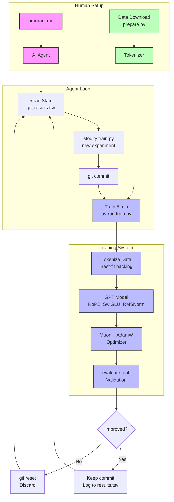
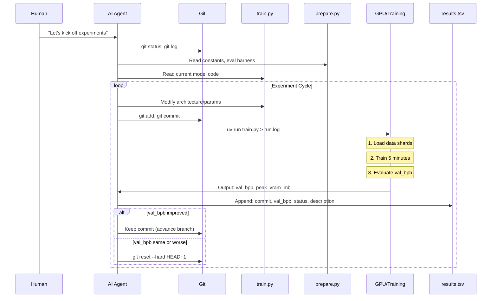

# Project Exploration: autoresearch

## Overview

autoresearch is an autonomous AI research framework that enables LLM agents to conduct self-directed machine learning experiments. The core idea is radical in its simplicity: give an AI agent a working LLM training setup and let it experiment autonomously by modifying code, training for a fixed 5-minute budget, checking if results improved, and keeping or discarding changes before repeating the cycle.

The project represents a paradigm shift from human-in-the-loop research to fully autonomous experimentation. As described in the README's karpathy quote from "March 2026": *"One day, frontier AI research used to be done by meat computers in between eating, sleeping, having other fun, and synchronizing once in a while using sound wave interconnect in the ritual of 'group meeting'. That era is long gone."*

The system is intentionally minimal - only three core files matter:
- `prepare.py` - Fixed data preparation and evaluation utilities (read-only)
- `train.py` - The single file the agent edits (model, optimizer, training loop)
- `program.md` - Instructions/prompt for the AI agent

Training runs for exactly 5 minutes wall-clock time, with the metric being **val_bpb** (validation bits per byte) - lower is better and vocab-size-independent for fair architectural comparisons.

## Repository

- **Location:** `/home/darkvoid/Boxxed/@formulas/src.rust/src.llamacpp/src.AIResearch/autoresearch`
- **Remote:** N/A (local exploration)
- **Primary Language:** Python 3.10+
- **License:** MIT

## Directory Structure

```
autoresearch/
├── .git/                       # Git repository
├── .gitignore                  # Python/UV ignore patterns
├── .python-version             # Python version pin (3.10+)
├── pyproject.toml              # Dependencies (uv project manager)
├── uv.lock                     # Locked dependency versions
├── README.md                   # Project overview and usage guide
├── program.md                  # Agent instructions (the "skill" prompt)
├── prepare.py                  # Data prep, tokenizer, dataloader, evaluation (DO NOT MODIFY)
├── train.py                    # Model, optimizer, training loop (AGENT MODIFIES THIS)
├── results.tsv                 # Experiment results log (tab-separated, untracked)
├── run.log                     # Latest experiment output log
├── progress.png                # Visualization of experiment progress
├── analysis.ipynb              # Jupyter notebook for analyzing results
├── .venv/                      # Virtual environment (generated)
├── results/                    # Experiment outputs (generated)
├── queue/                      # Experiment queue (generated)
└── dev/                        # Experimental code/artifacts (generated)
```

## Architecture

### High-Level Diagram



### Data Flow



## Component Breakdown

### prepare.py - Data Preparation & Evaluation Harness

**Location:** `prepare.py` (390 lines)

**Purpose:** Fixed constants, data preparation, tokenizer training, dataloader, and evaluation. This file is **read-only** for the agent - it defines the immutable evaluation harness.

**Key Components:**

| Component | Lines | Purpose |
|-----------|-------|---------|
| Constants | 26-52 | `MAX_SEQ_LEN=2048`, `TIME_BUDGET=300`, `VOCAB_SIZE=8192`, `SPLIT_PATTERN` |
| Data Download | 57-113 | Parallel shard downloader with retries from HuggingFace |
| Tokenizer Training | 119-203 | BPE tokenizer via `rustbpe`, saved as tiktoken pickle |
| Tokenizer Class | 209-245 | Minimal wrapper for encode/decode operations |
| DataLoader | 254-337 | BOS-aligned, best-fit document packing, 100% utilization |
| Evaluation | 343-365 | `evaluate_bpb()` - bits per byte metric |

**Critical Design Choices:**

1. **Bits Per Byte (BPB) Metric** (lines 343-365):
   - Vocab-size-independent evaluation
   - Sums per-token cross-entropy in nats
   - Divides by total bytes (excluding special tokens)
   - Converts nats/byte to bits/byte via `log(2)`

2. **Best-Fit Packing DataLoader** (lines 276-337):
   - Every row starts with BOS token
   - Documents packed using best-fit algorithm
   - When no doc fits remaining space, crops shortest doc
   - 100% utilization - no padding waste
   - Uses `buffer_size=1000` for doc selection

3. **Tokenizer Split Pattern** (line 48):
   ```python
   SPLIT_PATTERN = r"""'(?i:[sdmt]|ll|ve|re)|[^\r\n\p{L}\p{N}]?+\p{L}+|\p{N}{1,2}| ?[^\s\p{L}\p{N}]++[\r\n]*|\s*[\r\n]|\s+(?!\S)|\s+"""
   ```
   - GPT-4 style pattern
   - `\p{N}{1,2}` instead of `{1,3}` for number handling
   - Handles contractions, letters, numbers, whitespace

### train.py - Model and Training Loop

**Location:** `train.py` (631 lines)

**Purpose:** The **only file the agent modifies**. Contains the complete GPT model architecture, optimizer implementation, and training loop.

**Key Sections:**

| Section | Lines | Description |
|---------|-------|-------------|
| Imports & Setup | 7-26 | PyTorch, kernels (Flash Attention 3), config import |
| GPTConfig | 32-41 | Model hyperparameters dataclass |
| norm() | 43-44 | RMSNorm wrapper |
| has_ve() | 47-49 | Value Embedding layer selector |
| apply_rotary_emb() | 52-58 | RoPE implementation |
| CausalSelfAttention | 61-96 | Multi-head attention with VE |
| MLP | 99-109 | SwiGLU-style feedforward |
| Block | 112-121 | Transformer block with residual |
| GPT | 124-291 | Full model with init, forward, optimizer |
| MuonAdamW | 356-426 | Combined optimizer |
| Hyperparameters | 432-451 | Editable constants |
| Setup | 454-515 | Model instantiation, optimizer, dataloader |
| Training Loop | 538-604 | Main 5-minute training cycle |
| Final Eval | 606-630 | Validation and metrics |

**Architecture Deep Dive:**

1. **GPT Model Structure** (lines 124-291):
   ```
   GPT
   ├── transformer.wte (vocab_size × n_embd)
   ├── transformer.h[n_layer] (Block list)
   │   ├── attn (CausalSelfAttention)
   │   │   ├── c_q, c_k, c_v (linear projections)
   │   │   ├── ve_gate (Value Embedding gate, alternating layers)
   │   │   └── c_proj (output projection)
   │   └── mlp (MLP)
   │       ├── c_fc (expansion to 4×n_embd)
   │       └── c_proj (projection back)
   ├── value_embeds (per-layer, alternating)
   ├── lm_head (n_embd → vocab_size)
   ├── resid_lambdas (per-layer residual scaling)
   └── x0_lambdas (per-layer x0 mixing)
   ```

2. **Value Embedding (ResFormer)** (lines 75-87, 136-142):
   - Added to alternating layers + last layer always
   - Gate mechanism: `2 * sigmoid(gate(x[:32]))` per head
   - Allows mixing learned value embeddings with standard attention values

3. **Rotary Embeddings** (lines 52-58, 144-147, 183-193):
   - Precomputed up to `seq_len × 10`
   - Applied to queries and keys
   - Stored as bf16 buffers

4. **Window Attention Pattern** (lines 195-206, 35):
   - Pattern string: `"SSSL"` (default)
   - `S` = short window (seq_len / 2)
   - `L` = long window (full seq_len)
   - Last layer always full attention
   - Pattern cycles: layer `i` uses `pattern[i % len(pattern)]`

5. **MuonAdamW Optimizer** (lines 297-426):
   - **Muon** for 2D matrix parameters (transformer weights)
   - **AdamW** for embeddings, scalars, lm_head
   - Polar Express orthogonalization (lines 297-303, 323-335)
   - NorMuon variance reduction (lines 337-347)
   - Cautious weight decay (line 352)

6. **Hyperparameters** (lines 432-451):
   ```python
   ASPECT_RATIO = 64       # model_dim = depth × ASPECT_RATIO
   HEAD_DIM = 128          # Attention head dimension
   WINDOW_PATTERN = "SSSL" # Sliding window pattern
   TOTAL_BATCH_SIZE = 2**19 # ~524K tokens/step
   EMBEDDING_LR = 0.6
   UNEMBEDDING_LR = 0.004
   MATRIX_LR = 0.04        # Muon LR
   SCALAR_LR = 0.5
   WEIGHT_DECAY = 0.2
   DEPTH = 8               # Transformer layers
   DEVICE_BATCH_SIZE = 128
   ```

### program.md - Agent Instructions

**Location:** `program.md` (115 lines)

**Purpose:** The "skill" prompt that instructs the AI agent on how to conduct autonomous research.

**Structure:**

| Section | Lines | Content |
|---------|-------|---------|
| Setup | 5-18 | Branch creation, context gathering, verification |
| Experimentation | 21-38 | Rules, constraints, goal, simplicity criterion |
| Output Format | 41-58 | Expected training output format |
| Logging Results | 64-88 | TSV format and examples |
| Experiment Loop | 90-115 | The infinite loop logic |

**Key Rules for Agent:**

**CAN do:**
- Modify `train.py` - anything fair game (architecture, optimizer, hyperparameters)

**CANNOT do:**
- Modify `prepare.py` - read-only evaluation harness
- Install new packages - use only what's in `pyproject.toml`
- Modify evaluation - `evaluate_bpb` is ground truth

**Goal:** Minimize `val_bpb`

**Constraints:**
- Fixed 5-minute training budget
- VRAM is soft constraint (some increase acceptable)
- Simplicity: small improvements shouldn't add ugly complexity

### analysis.ipynb - Results Analysis

**Location:** `analysis.ipynb` (Jupyter notebook)

**Purpose:** Analyze experiment results from `results.tsv`

**Cells:**

1. **Data Loading:** Read TSV, parse numeric columns
2. **Status Counts:** KEEP/DISCARD/CRASH breakdown, keep rate
3. **Kept Experiments:** List all successful experiments
4. **Progress Visualization:** Val BPB over time scatter plot with running minimum
5. **Summary Statistics:** Baseline vs best, improvement percentage
6. **Top Hits:** Ranked by delta improvement per experiment

### README.md - Project Documentation

**Location:** `README.md` (92 lines)

**Purpose:** User-facing documentation with setup instructions, design rationale, and platform guidance.

**Key Sections:**
- Quick start with uv setup
- How the agent loop works
- Platform support (NVIDIA GPU required)
- Recommendations for smaller compute (Macbook, CPU)
- Links to notable forks

### pyproject.toml - Dependencies

**Location:** `pyproject.toml` (27 lines)

**Dependencies:**
```toml
kernels>=0.11.7        # Kernel fusion, Flash Attention 3
matplotlib>=3.10.8     # Plotting
numpy>=2.2.6           # Numerical ops
pandas>=2.3.3          # Data analysis
pyarrow>=21.0.0        # Parquet file handling
requests>=2.32.0       # HTTP downloads
rustbpe>=0.1.0         # BPE tokenizer training
tiktoken>=0.11.0       # Tokenizer format
torch==2.9.1           # PyTorch (CUDA 12.8)
```

**PyTorch Index:** `https://download.pytorch.org/whl/cu128` (CUDA 12.8)

## Entry Points

### prepare.py - Data Preparation

**Invocation:** `uv run prepare.py`

**Execution Flow:**
1. Parse arguments (`--num-shards`, `--download-workers`)
2. `download_data()` - Download parquet shards in parallel
3. `train_tokenizer()` - Train BPE tokenizer on downloaded data
4. Save tokenizer as pickle + token_bytes lookup tensor

**Output:**
- `~/.cache/autoresearch/data/*.parquet` - Training shards
- `~/.cache/autoresearch/tokenizer/tokenizer.pkl` - Trained tokenizer
- `~/.cache/autoresearch/tokenizer/token_bytes.pt` - Byte length lookup

### train.py - Training Experiment

**Invocation:** `uv run train.py`

**Execution Flow:**
1. **Setup** (lines 457-515):
   - Set seeds, device, autocast context
   - Load tokenizer
   - Build model config (depth × ASPECT_RATIO → model_dim)
   - Instantiate model on meta device, move to GPU
   - Initialize weights
   - Create optimizer with parameter groups
   - Compile model with `torch.compile`
   - Create dataloader, prefetch first batch

2. **Training Loop** (lines 543-604):
   - `while True` infinite loop
   - Gradient accumulation over `grad_accum_steps`
   - Forward → loss → backward → dataloader advance
   - Schedule updates (LR, momentum, weight decay)
   - Optimizer step
   - Logging with progress bar (`\r` carriage return)
   - GC management (freeze after step 0, periodic collect)
   - Break when `total_training_time >= TIME_BUDGET`

3. **Final Evaluation** (lines 610-630):
   - `model.eval()` mode
   - `evaluate_bpb()` on validation set
   - Print summary metrics

## External Dependencies

| Dependency | Purpose |
|------------|---------|
| `torch` (2.9.1) | Core deep learning framework |
| `kernels` | Flash Attention 3 via `kernels-community/flash-attn3` |
| `rustbpe` | Fast BPE tokenizer training (Rust backend) |
| `tiktoken` | Tokenizer serialization format |
| `pyarrow` | Parquet file reading for data shards |
| `requests` | HTTP downloads from HuggingFace |
| `numpy` | Numerical operations |
| `pandas` | Results analysis (notebook) |
| `matplotlib` | Progress visualization |

## Configuration

### Environment Variables

```bash
PYTORCH_ALLOC_CONF=expandable_segments:True  # Memory efficiency
HF_HUB_DISABLE_PROGRESS_BARS=1               # Quiet downloads
```

### Cache Directory

All data and tokenizers stored in: `~/.cache/autoresearch/`

```
~/.cache/autoresearch/
├── data/
│   ├── shard_00000.parquet
│   ├── shard_00001.parquet
│   └── ...
└── tokenizer/
    ├── tokenizer.pkl
    └── token_bytes.pt
```

### Hyperparameter Tuning (for smaller compute)

From README (lines 71-81), recommendations for Macbook/CPU:

1. **Dataset:** Use TinyStories (lower entropy, smaller models work)
2. **vocab_size:** Reduce from 8192 → 4092/2048/1024/256
3. **MAX_SEQ_LEN:** Reduce from 2048 → 256 or lower
4. **DEVICE_BATCH_SIZE:** Compensate when reducing seq len
5. **DEPTH:** Reduce from 8 → 4 or lower
6. **WINDOW_PATTERN:** Use just `"L"` (no alternating attention)
7. **TOTAL_BATCH_SIZE:** Reduce from 2^19 → 2^14 (~16K)

## Testing

No formal test suite exists. The evaluation harness (`evaluate_bpb`) serves as the ground truth metric. Experiments are validated by:

1. **Crash detection:** Empty grep output = crash
2. **Loss sanity:** `NaN` or `>100` = fail fast (line 570-572)
3. **Timeout detection:** >10 minutes = discard (line 108)
4. **Improvement check:** Lower `val_bpb` = keep, else discard

## Training Output Format

```
---
val_bpb:          0.997900
training_seconds: 300.1
total_seconds:    325.9
peak_vram_mb:     45060.2
mfu_percent:      39.80
total_tokens_M:   499.6
num_steps:        953
num_params_M:     50.3
depth:            8
```

### results.tsv Format

Tab-separated with 5 columns:

```tsv
commit	val_bpb	memory_gb	status	description
a1b2c3d	0.997900	44.0	keep	baseline
b2c3d4e	0.993200	44.2	keep	increase LR to 0.04
c3d4e5f	1.005000	44.0	discard	switch to GeLU activation
d4e5f6g	0.000000	0.0	crash	double model width (OOM)
```

## Key Insights

1. **Fixed Time Budget Design:** All experiments run exactly 5 minutes, making them directly comparable regardless of architectural changes. This means the agent optimizes for "best model in 5 minutes" rather than "best model eventually."

2. **Single-File Modification:** By restricting the agent to only `train.py`, the scope remains manageable and diffs are reviewable. This is a crucial design constraint that prevents runaway complexity.

3. **Value Embedding (ResFormer):** The architecture includes value embeddings on alternating layers with a learned gate. This is a recent research addition that the agent might discover and tune.

4. **Muon Optimizer:** The custom MuonAdamW optimizer uses Polar Express orthogonalization and NorMuon variance reduction. The agent can tune momentum schedules and learning rates per parameter type.

5. **Window Attention Patterns:** The `"SSSL"` pattern allows experimentation with sliding window attention. The agent might discover better patterns (e.g., `"LLLL"`, `"SSSS"`, `"LSSL"`).

6. **Best-Fit Packing:** The dataloader achieves 100% utilization by using best-fit document packing and cropping the shortest document when no perfect fit exists.

7. **Simplicity Criterion:** The agent is explicitly instructed to prefer simplicity - a 0.001 val_bpb improvement from deleting code is worth it, but a 0.001 improvement requiring 20 lines of hacky code is not.

8. **Never Stop Philosophy:** The agent is instructed to NEVER ask "should I keep going?" - it runs indefinitely until manually stopped, enabling overnight experimentation (approx 12 experiments/hour = ~100 experiments per 8-hour sleep).

9. **Branch-Based Experimentation:** All experiments run on a dedicated branch (`autoresearch/<tag>`). Improvements advance the branch, failures get reset. This keeps the experiment history clean and auditable.

10. **VRAM as Soft Constraint:** Some VRAM increase is acceptable for meaningful val_bpb gains, but it "should not blow up dramatically." This allows the agent to explore larger models if they fit.

## Open Questions

1. **How does the agent handle catastrophic forgetting?** Since each experiment starts from the previous kept state, could the agent discover curriculum-like strategies?

2. **What's the theoretical limit?** Given the fixed 5-minute budget and specific dataset (ClimbMix-400B), what's the achievable val_bpb floor?

3. **How transferable are discoveries?** Do hyperparameters/architectures discovered on H100 transfer to smaller GPUs or different datasets?

4. **What's in nanochat?** The code is "cherry-picked from nanochat" - what features were excluded that might be worth adding back?

5. **Flash Attention 3 integration:** The code uses `kernels-community/flash-attn3` for non-Hopper GPUs and `varunneal/flash-attention-3` for H100. How does the kernel selection affect performance portability?

6. **Polar Express coefficients:** The orthogonalization uses 5 precomputed coefficient tuples (lines 297-303). Where do these come from and could they be tuned?

7. **ResFormer gate channels:** Why 32 channels specifically (line 74)? Could this be a tuning knob for the agent?

8. **Warmup/Warmdown ratios:** Default is `WARMUP_RATIO=0.0`, `WARMDOWN_RATIO=0.5`. What experiments might explore different schedules?

## Appendix: Model Architecture Details

### GPTConfig Fields

```python
@dataclass
class GPTConfig:
    sequence_len: int = 2048      # Context window
    vocab_size: int = 32768       # BPE vocab (actual: 8192)
    n_layer: int = 12             # Depth (actual: 8)
    n_head: int = 6               # Attention heads
    n_kv_head: int = 6            # KV heads (GQA, default = n_head)
    n_embd: int = 768             # Embedding dim
    window_pattern: str = "SSSL"  # Attention pattern
```

### Model Dimension Calculation

```python
# From train.py lines 469-477
def build_model_config(depth):
    base_dim = depth * ASPECT_RATIO        # 8 × 64 = 512
    model_dim = ((base_dim + HEAD_DIM - 1) // HEAD_DIM) * HEAD_DIM
    # = ((512 + 128 - 1) // 128) × 128
    # = (639 // 128) × 128 = 4 × 128 = 512
    num_heads = model_dim // HEAD_DIM      # 512 // 128 = 4
```

### Parameter Count Formula

```python
# From train.py lines 224-234
def num_scaling_params(self):
    wte = vocab_size × n_embd
    value_embeds = sum of alternating layers
    lm_head = n_embd × vocab_size
    transformer_matrices = all Block parameters
    scalars = n_layer (resid_lambdas) + n_layer (x0_lambdas)
```

### MFU (Model FLOPs Utilization)

```python
# From train.py lines 587, 618
mfu = 100 × num_flops_per_token × TOTAL_BATCH_SIZE / dt / H100_BF16_PEAK_FLOPS
# H100_BF16_PEAK_FLOPS = 989.5e12 (989.5 TFLOPs)
```

### Estimated FLOPs per Token

```python
# From train.py lines 208-222
def estimate_flops(self):
    # 6 × (non-embedding params) + attention FLOPs
    # Attention FLOPs = 12 × n_head × head_dim × effective_seq_len
    # (varies per layer based on window pattern)
```
