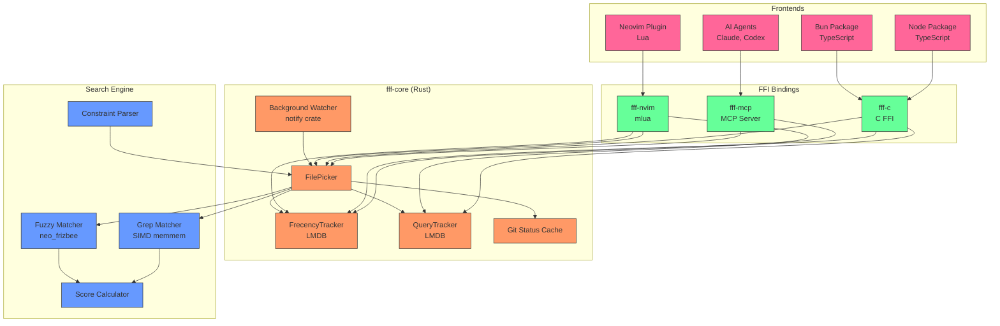
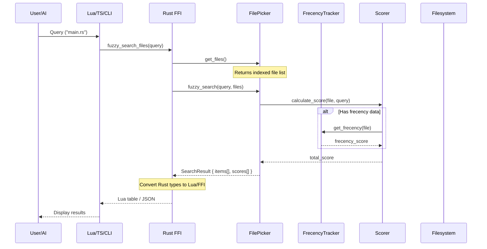
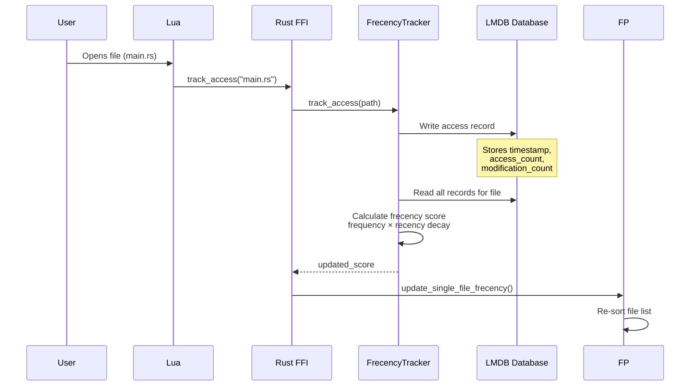

# Project Exploration: fff.nvim

## Overview

**fff.nvim** (Freakin Fast Fuzzy File Finder) is a high-performance file search tool designed for both Neovim users and AI code assistants. The project provides blazing-fast fuzzy file matching, grep search, and content-aware file ranking through a combination of Rust-based search engines and Lua/TypeScript bindings.

The core value proposition is **speed + intelligence**:
- **Speed**: Rust-native search with SIMD-accelerated pattern matching, parallel execution via rayon, and mmap-backed file content caching
- **Intelligence**: Frecency (frequency + recency) ranking, git status awareness, combo-boost scoring for repeated queries, and constraint-based filtering

The project uniquely serves **two audiences**:
1. **Neovim users**: A plugin providing interactive file picker and live grep with preview
2. **AI agents (MCP)**: A Model Context Protocol server that replaces generic Glob/Grep tools with smarter, faster file discovery

As stated in the README: *"For humans - provides an unbelievable typo-resistant experience, for AI agents - implements the fastest file search with additional free memory suggesting the best search results based on various factors like frecency, git status, file size, definition matches, and more."*

## Repository

- **Location:** `/home/darkvoid/Boxxed/@formulas/src.rust/src.llamacpp/src.ClaudOpen/fff.nvim`
- **Remote:** N/A (local exploration)
- **Primary Languages:** Rust (core), Lua (Neovim plugin), TypeScript (Bun/Node packages)
- **License:** MIT (inferred from typical dmtrKovalenko projects)

## Directory Structure

```
fff.nvim/
├── .git/                       # Git repository
├── .github/                    # GitHub workflows
├── .cargo/                     # Cargo configuration
├── crates/                     # Rust workspace crates
│   ├── fff-c/                  # C FFI bindings (for Bun, Node.js, Python, Ruby)
│   │   ├── src/
│   │   │   ├── ffi_types.rs    # C-compatible result types
│   │   │   └── lib.rs          # FFI exports (fff_search, fff_live_grep, etc.)
│   │   ├── cbindgen.toml       # C header generation config
│   │   └── include/            # Generated fff.h header
│   ├── fff-core/               # Core search engine (shared library)
│   │   ├── src/
│   │   │   ├── background_watcher.rs  # Filesystem watching
│   │   │   ├── case_insensitive_memmem.rs  # SIMD case-insensitive search
│   │   │   ├── constraints.rs          # Query constraint parsing
│   │   │   ├── db_healthcheck.rs       # LMDB health checks
│   │   │   ├── error.rs                # Error types
│   │   │   ├── file_picker.rs          # Main entry point
│   │   │   ├── frecency.rs             # LMDB-backed frecency tracking
│   │   │   ├── git.rs                  # Git status caching
│   │   │   ├── grep.rs                 # Grep search implementation
│   │   │   ├── lib.rs                  # Crate root + documentation
│   │   │   ├── log.rs                  # Tracing initialization
│   │   │   ├── path_utils.rs           # Path canonicalization
│   │   │   ├── query_tracker.rs        # Query history for combo boost
│   │   │   ├── score.rs                # Scoring algorithms
│   │   │   ├── shared.rs               # Arc<RwLock<Option<T>>> wrappers
│   │   │   ├── sort_buffer.rs          # Buffered sorting optimization
│   │   │   └── types.rs                # Core data types
│   │   ├── benches/                    # Criterion benchmarks
│   │   │   ├── bigram_bench.rs         # Bigram overlay benchmarks
│   │   │   ├── memmem_bench.rs         # Memory search benchmarks
│   │   │   └── parse_bench.rs          # Query parsing benchmarks
│   │   ├── build.rs                    # Build script
│   │   └── tests/                      # Integration tests
│   ├── fff-grep/               # Grep-specific search logic
│   │   ├── src/
│   │   │   ├── lib.rs
│   │   │   ├── lines.rs              # Line extraction
│   │   │   ├── matcher.rs            # Match classification
│   │   │   ├── searcher/             # Search backends
│   │   │   │   ├── core.rs
│   │   │   │   ├── glue.rs
│   │   │   │   └── mod.rs
│   │   │   └── sink.rs               # Result collection
│   ├── fff-mcp/                # MCP server for AI agents
│   │   ├── src/
│   │   │   ├── main.rs             # Entry point + CLI
│   │   │   ├── cursor.rs           # Cursor-style output formatting
│   │   │   ├── healthcheck.rs      # Health check command
│   │   │   ├── output.rs           # MCP output formatting
│   │   │   ├── server.rs           # MCP tool handlers
│   │   │   └── update_check.rs     # Version update checking
│   │   └── build.rs                # Build script (git hash)
│   ├── fff-nvim/               # Neovim FFI bindings (mlua)
│   │   ├── src/
│   │   │   ├── lib.rs              # MLua module exports
│   │   │   ├── bin/                # Profiling/benchmark binaries
│   │   │   │   ├── bench_grep_query.rs
│   │   │   │   ├── grep_vs_rg.rs
│   │   │   │   ├── search_profiler.rs
│   │   │   │   └── ...
│   │   │   └── bin/
│   │   ├── benches/
│   │   │   ├── indexing_and_search.rs
│   │   │   └── query_tracker_bench.rs
│   │   └── Cargo.toml
│   └── fff-query-parser/       # Query syntax parsing
│   ├── fff.lua                 # Plugin entry point
├── lua/fff/                    # Lua plugin source
│   ├── combo_renderer.lua      # Constraint combo header rendering
│   ├── conf.lua                # Configuration defaults
│   ├── core.lua                # Core plugin logic
│   ├── download.lua            # Prebuilt binary downloader
│   ├── file_renderer.lua       # File list rendering
│   ├── file_picker/            # File picker submodules
│   │   ├── preview.lua         # File preview implementation
│   │   └── ...
│   ├── fuzzy.lua               # Fuzzy matching utilities
│   ├── git_utils.lua           # Git integration helpers
│   ├── grep/                   # Grep mode submodules
│   │   └── grep_renderer.lua   # Grep result rendering
│   ├── health.lua              # Health check implementation
│   ├── list_renderer.lua       # Generic list rendering
│   ├── location_utils.lua      # Location/jump utilities
│   ├── main.lua                # Main plugin API
│   ├── picker_ui.lua           # UI implementation (96KB - largest file)
│   ├── rust/                   # Rust module loader
│   ├── scrollbar.lua           # Scrollbar rendering
│   ├── treesitter_hl.lua       # Treesitter highlight integration
│   ├── utils/                  # Utility submodules
│   └── utils.lua               # General utilities
├── packages/                   # JavaScript/TypeScript packages
│   ├── fff-bun/                # Bun runtime package
│   │   ├── src/
│   │   └── package.json
│   └── fff-node/               # Node.js runtime package
│       ├── src/
│       ├── test/
│       └── package.json
├── plugin/                     # Neovim plugin directory
│   └── fff.lua                 # Plugin load entry
├── doc/                        # Neovim documentation
│   └── fff.nvim.txt            # Vim help file
├── scripts/                    # Utility scripts
├── tests/                      # Test files
│   ├── minimal_init.lua        # Minimal test initialization
│   └── ...
├── .gitignore
├── .luacheckrc                 # Lua linter config
├── .luarc.json                 # Lua language server config
├── .stylua.toml                # Lua formatter config
├── biome.json                  # TypeScript formatter config
├── bun.lock                    # Bun lockfile
├── Cargo.toml                  # Rust workspace definition
├── Cargo.lock                  # Rust dependency lock
├── flake.nix                   # Nix flake for reproducible builds
├── flake.lock                  # Nix lockfile
├── install-mcp.sh              # MCP server installation script
├── LICENSE
├── Makefile                    # Build/test automation
├── package.json                # TypeScript workspace
├── package-lock.json
├── pyproject.toml              # (if Python bindings exist)
├── README.md                   # User documentation
├── chart.png                   # Performance comparison chart
├── empty_config.lua            # Minimal configuration example
├── rust-toolchain.toml         # Rust version pin
├── .mcp.json                   # MCP configuration
├── .nixignore                  # Nix build ignore patterns
└── _typos.toml                 # Typos linter config
```

## Architecture

### High-Level System Diagram



### Data Flow - Search Request



### Frecency Tracking Flow



## Component Breakdown

### fff-core (Core Search Engine)

**Location:** `crates/fff-core/`

**Purpose:** The heart of fff - provides filesystem indexing, fuzzy matching, grep search, frecency ranking, and git integration.

**Key Modules:**

| Module | Purpose |
|--------|---------|
| `file_picker.rs` | Main entry point - indexes directory tree, maintains sorted file list, performs fuzzy search |
| `frecency.rs` | LMDB-backed database tracking file access/modification patterns |
| `query_tracker.rs` | Query history for "combo boost" scoring (repeated queries boost previously selected files) |
| `grep.rs` | Live grep with regex/plain/fuzzy modes, constraint filtering |
| `git.rs` | Git status caching and repository detection |
| `background_watcher.rs` | Filesystem watching via `notify` crate for real-time index updates |
| `score.rs` | Scoring algorithm combining fuzzy match score, frecency, git status, distance penalties |
| `constraints.rs` | Query constraint parsing (`*.rs`, `src/`, `!test/`, globs) |
| `case_insensitive_memmem.rs` | SIMD-accelerated case-insensitive substring search |
| `sort_buffer.rs` | Buffered sorting optimization for large result sets |

**Shared State Pattern:**

The crate uses `SharedPicker`, `SharedFrecency`, `SharedQueryTracker` - newtype wrappers around `Arc<RwLock<Option<T>>>`:

```rust
// From shared.rs
pub struct SharedPicker(Arc<RwLock<Option<FilePicker>>>);
pub struct SharedFrecency(Arc<RwLock<Option<FrecencyTracker>>>);
pub struct SharedQueryTracker(Arc<RwLock<Option<QueryTracker>>>);
```

This allows thread-safe shared access between background watchers, search threads, and FFI callers.

### fff-nvim (Neovim Bindings)

**Location:** `crates/fff-nvim/`

**Purpose:** MLua-based FFI bindings exposing fff-core functionality to Neovim Lua.

**Key Functions:**

| Function | Purpose |
|----------|---------|
| `init_db()` | Initialize frecency and query tracker LMDB databases |
| `init_file_picker(base_path)` | Create FilePicker instance, spawn background scan + watcher |
| `fuzzy_search_files()` | Perform fuzzy search with pagination, combo boost |
| `live_grep()` | Grep search with regex/plain/fuzzy modes |
| `track_access()` | Record file access for frecency |
| `track_query_completion()` | Record query→file selection for combo boost |
| `refresh_git_status()` | Update git status cache |
| `health_check()` | Return version, git2 status, database health |
| `wait_for_initial_scan()` | Block until initial indexing completes |

**Memory Management:**

Uses `mimalloc` as global allocator for performance. The module is marked `#[mlua::lua_module(skip_memory_check)]` to avoid Lua's memory check overhead.

### fff-c (C FFI)

**Location:** `crates/fff-c/`

**Purpose:** C-compatible FFI for any language with C bindings (Bun, Node.js, Python, Ruby).

**Instance-Based API:**

```c
// Create instance (owns all state)
FffInstance* instance = fff_create_instance(
    "/path/to/project",    // base_path
    "/path/to/frecency",   // frecency_db_path
    "/path/to/history",    // history_db_path
    false,                 // use_unsafe_no_lock
    true,                  // warmup_mmap_cache
    false                  // ai_mode
);

// Search
FffSearchResult* results = fff_search(
    instance,
    "main.rs",             // query
    "/current/file.rs",    // current_file (for deprioritization)
    0,                     // max_threads (0 = auto)
    0,                     // page_index
    50,                    // page_size
    100,                   // combo_boost_multiplier
    3                      // min_combo_count
);

// Cleanup
fff_free_search_result(results);
fff_destroy(instance);
```

**Memory Convention:**
- Every `fff_*` returning `*mut FffResult` requires `fff_free_result()`
- Instance must be freed with `fff_destroy`
- Strings freed with `fff_free_string`

### fff-mcp (MCP Server)

**Location:** `crates/fff-mcp/`

**Purpose:** Model Context Protocol server for AI code assistants (Claude Code, Codex, etc.)

**Tools Exposed:**

| Tool | Purpose |
|------|---------|
| `find_files` | Fuzzy file search for exploration |
| `grep` | Content search (plain/regex/fuzzy) |
| `multi_grep` | OR-search across multiple patterns (Aho-Corasick) |
| `healthcheck` | Diagnostic information |

**AI-Specific Optimizations** (from `MCP_INSTRUCTIONS`):

1. **Search BARE IDENTIFIERS only** - grep single names, not complex patterns
2. **NEVER use regex unless alternation needed** - plain text is faster
3. **Stop after 2 greps - READ the code** - more greps ≠ better understanding
4. **Use multi_grep for multiple identifiers** - one call instead of sequential greps

**Workflow guidance:**
- Have specific name → `grep` bare identifier
- Need multiple variants → `multi_grep(['ActorAuth', 'actor_auth'])`
- Exploring topic → `find_files`
- Got results → Read top file, don't grep again

### Lua Plugin (Neovim Frontend)

**Location:** `lua/fff/`

**Purpose:** Interactive UI for Neovim users - file picker, live grep, preview.

**Key Files:**

| File | Purpose |
|------|---------|
| `main.lua` | Plugin API entry point (`find_files()`, `live_grep()`, `setup()`) |
| `picker_ui.lua` | UI implementation (96KB - largest file) - renders picker, handles input |
| `conf.lua` | Configuration defaults |
| `file_renderer.lua` | File list rendering with highlights |
| `grep/grep_renderer.lua` | Grep result rendering with match highlights |
| `combo_renderer.lua` | Constraint combo header rendering |
| `file_picker/preview.lua` | File preview with syntax highlighting |
| `git_utils.lua` | Git status detection and highlighting |
| `download.lua` | Prebuilt binary downloader |
| `health.lua` | `:FFFHealth` implementation |

**Keybindings (defaults):**

| Key | Action |
|-----|--------|
| `<Esc>` | Close |
| `<CR>` | Select |
| `<C-s>` / `<C-v>` / `<C-t>` | Split / Vsplit / Tab |
| `<Up>` / `<Down>` | Navigate |
| `<C-u>` / `<C-d>` | Preview scroll |
| `<Tab>` | Toggle multi-select |
| `<C-q>` | Send to quickfix |
| `<F2>` | Toggle debug scores |
| `<S-Tab>` | Cycle grep modes (plain/regex/fuzzy) |

### Query Parser

**Location:** `crates/fff-query-parser/`

**Purpose:** Parse query syntax into structured constraints + search terms.

**Constraint Syntax:**

```
*.rs                    # Extension filter
src/                    # Directory filter
!test/                  # Exclude directory
!**/*.spec.ts           # Exclude pattern
main.rs                 # Specific file
git:modified            # Git status filter
user controller         # Fuzzy search terms (AND)
```

**Query Structure:**

```rust
pub struct ParsedQuery {
    pub fuzzy_query: FuzzyQuery,      // Text to fuzzy match
    pub constraints: Vec<Constraint>, // File filters
    pub location: Option<Location>,   // :line:col jumps
}
```

## Entry Points

### Neovim Plugin

**Invocation:** `:lua require('fff').find_files()` or keybinding `<leader>ff`

**Execution Flow:**

1. `main.lua:setup(config)` → Store config in `vim.g.fff`
2. `main.lua:find_files()` → `picker_ui.open()`
3. `picker_ui.open()` → Check if Rust module initialized
4. If not initialized:
   - `rust.init()` → Load FFI module
   - `init_db()` → Initialize LMDB databases
   - `init_file_picker()` → Spawn background scan
   - `wait_for_initial_scan()` → Block until scan complete
5. Render UI with results
6. On file selection: `track_access()` + `track_query_completion()`

### MCP Server

**Invocation:** `fff-mcp` or via installation script

**Execution Flow:**

1. Parse CLI args (`base_path`, `--frecency-db`, `--log-file`, etc.)
2. Resolve default paths (use Neovim paths if available)
3. Initialize tracing (log file)
4. Discover git root (or use current directory)
5. Initialize `FrecencyTracker` with LMDB
6. Initialize `FilePicker` → spawns background scan + watcher
7. Spawn update check task
8. Start MCP server over stdio
9. Wait for initial scan (async, non-blocking)
10. Handle tool calls: `find_files`, `grep`, `multi_grep`

### C FFI (Bun/Node.js)

**Invocation:** Via TypeScript wrapper calling `libfff_c.dylib` / `libfff_c.so`

**Execution Flow:**

1. `fff_create_instance()` → Initialize all shared state
2. `fff_search()` or `fff_live_grep()` → Perform search
3. Process results (convert FFI structs to JS objects)
4. `fff_destroy()` → Cleanup

## External Dependencies

### Rust (Workspace)

| Dependency | Purpose |
|------------|---------|
| `mlua` | Lua FFI for Neovim |
| `git2` | Git status, repository discovery |
| `heed` | LMDB bindings for frecency/history |
| `notify` + `notify-debouncer-full` | Filesystem watching |
| `rayon` | Parallel search execution |
| `neo_frizbee` | Fuzzy matching (Smith-Waterman) |
| `ignore` | `.gitignore` handling |
| `globset` | Glob pattern matching |
| `zlob` | Fast globbing (custom crate) |
| `mimalloc` | Memory allocator |
| `blake3` | Fast hashing for file fingerprints |
| `chrono` | Timestamp handling |
| `smallvec` | Stack-allocated small vectors |
| `thiserror` | Error handling |
| `tracing` | Logging |
| `serde` + `serde_json` | Serialization |
| `smartstring` | Optimized string storage |
| `glidesort` | Fast sorting |
| `tokio` | Async runtime (MCP) |
| `rmcp` | MCP framework |
| `clap` | CLI parsing |

### Lua

| Dependency | Purpose |
|------------|---------|
| `plenary.nvim` | Test framework, utilities |
| Treesitter | Syntax highlighting in preview |

### TypeScript

| Dependency | Purpose |
|------------|---------|
| `biome` | Linting/formatting |

## Configuration

### Neovim Configuration

```lua
require('fff').setup({
    base_path = vim.fn.getcwd(),
    prompt = '🪿 ',
    title = 'FFFiles',
    max_results = 100,
    max_threads = 4,
    lazy_sync = true,  -- Start indexing only when picker opened
    
    layout = {
        height = 0.8,
        width = 0.8,
        prompt_position = 'bottom',
        preview_position = 'right',
        preview_size = 0.5,
        flex = {
            size = 130,  -- Column threshold for flex layout
            wrap = 'top',
        },
        path_shorten_strategy = 'middle_number',  -- 'middle' or 'end'
    },
    
    preview = {
        enabled = true,
        max_size = 10 * 1024 * 1024,
        chunk_size = 8192,
        line_numbers = false,
        wrap_lines = false,
    },
    
    frecency = {
        enabled = true,
        db_path = vim.fn.stdpath('cache') .. '/fff_nvim',
    },
    
    history = {
        enabled = true,
        db_path = vim.fn.stdpath('data') .. '/fff_queries',
        min_combo_count = 3,
        combo_boost_score_multiplier = 100,
    },
    
    grep = {
        max_file_size = 10 * 1024 * 1024,
        max_matches_per_file = 100,
        smart_case = true,
        time_budget_ms = 150,
        modes = { 'plain', 'regex', 'fuzzy' },
    },
})
```

### MCP Server CLI

```bash
fff-mcp [OPTIONS] [PATH]

Arguments:
  [PATH]  Base directory to index (default: current directory)

Options:
  --frecency-db <PATH>      Frecency database path
  --history-db <PATH>       Query history database path
  --log-file <PATH>         Log file path
  --log-level <LEVEL>       Log level (trace/debug/info/warn/error)
  --no-update-check         Disable automatic update checks
  --no-warmup               Disable eager mmap warmup
  --max-cached-files <N>    Max files in persistent memory cache
  --healthcheck             Run health check and exit
```

## Scoring Algorithm

The scoring system combines multiple factors:

```rust
// From score.rs
pub struct Score {
    pub total: i64,
    pub base_score: i64,           // Fuzzy match score from neo_frizbee
    pub filename_bonus: i64,       // Bonus for filename matches
    pub special_filename_bonus: i64,  // Extra for exact filename match
    pub frecency_boost: i64,       // Frecency-based boost
    pub git_status_boost: i64,     // Boost for modified/staged files
    pub distance_penalty: i64,     // Penalty for deep paths
    pub current_file_penalty: i64, // Deprioritize current file
    pub combo_match_boost: i64,    // Boost for previously selected files
}
```

**Score Calculation:**

1. **Base Score**: Smith-Waterman alignment score from `neo_frizbee`
2. **Filename Bonus**: Multiplier if query matches filename (not just path)
3. **Special Filename Bonus**: Extra boost for exact filename match
4. **Frecency Boost**: Based on access frequency and recency decay
5. **Git Status Boost**: Modified/staged files ranked higher
6. **Distance Penalty**: Files farther from base_path penalized
7. **Current File Penalty**: Currently open file deprioritized
8. **Combo Match Boost**: Files previously selected for same query boosted

**Combo Boost Formula:**

```rust
// From query_tracker.rs
if combo_count >= min_combo_count {
    combo_boost = base_score * combo_boost_score_multiplier * combo_count
}
```

## Key Insights

1. **Two-Mode Architecture**: The project serves both interactive Neovim users and AI agents through MCP, with mode-specific optimizations (`FFFMode::Neovim` vs `FFFMode::Ai`).

2. **Frecency as Memory**: The LMDB-backed frecency system acts as "memory" for the AI agent, remembering frequently/recently accessed files and boosting them in future searches.

3. **Zero-Copy Design**: Heavy use of `mmap` for file content access, with configurable persistent caching for hot files. This avoids loading entire files into memory while maintaining fast access.

4. **Constraint Overlay**: Queries can combine multiple constraints (`*.rs src/ !test/ git:modified`) that are evaluated as a filter before the actual search, reducing the search space.

5. **Combo Boost Intelligence**: The query tracker learns from user behavior - files repeatedly selected for similar queries get boosted, creating personalized ranking over time.

6. **Instance-Based FFI**: The C FFI uses instance handles (`FffInstance*`) rather than global state, allowing multiple independent searchers in the same process.

7. **Background Watcher**: The filesystem watcher runs continuously, updating the index on file changes without requiring manual refresh.

8. **SIMD Optimization**: Custom `case_insensitive_memmem` implementation uses SIMD for faster substring matching in plain-text grep mode.

9. **Pagination by Design**: All search functions support pagination (`page_index`, `page_size`), enabling efficient streaming of large result sets.

10. **MCP Instructions as Prompt Engineering**: The `MCP_INSTRUCTIONS` constant embeds prompt engineering directly into the server, guiding AI agents toward effective usage patterns.

## Open Questions

1. **How does the bigram overlay work?** The benches include `bigram_bench.rs` - what's the bigram overlay technique mentioned?

2. **What's the content cache budget formula?** `ContentCacheBudget::new_for_repo` - how does it determine optimal cache size based on repo characteristics?

3. **How does git status boosting work in AI mode?** The `refresh_git_status` function updates caches, but what's the exact boost formula for dirty files?

4. **What's the Polar Express connection?** The name appears in fff-core... is this a reference to the orthogonalization algorithm?

5. **How does the constraint parser handle edge cases?** Glob patterns with special characters, overlapping exclusions, etc.?

6. **What's the LMDB GC strategy?** The frecency tracker has `spawn_gc` - what's the purge policy?

7. **How does the MCP server handle concurrent requests?** Multiple AI agents hitting the same instance - is there request queuing?

8. **What benchmarks exist for grep vs ripgrep?** The `grep_vs_rg.rs` binary suggests direct comparison - what are the results?

## Appendix: File Picker States

```rust
// From file_picker.rs
pub struct FilePicker {
    base_path: PathBuf,
    files: Vec<FileInfo>,           // Indexed files (sorted)
    git_status: GitStatusCache,     // Cached git status
    content_cache: ContentCache,    // mmap'd file content
    scan_signal: Arc<AtomicBool>,   // Scan completion signal
    background_watcher: Option<Watcher>,
    mode: FFFMode,                  // Neovim or AI
}

pub struct FileInfo {
    path: PathBuf,
    relative_path: String,
    size: u64,
    modified: u64,
    git_status: String,  // "", "M", "A", "D", "R", "U", "I"
    frecency_score: i32,
}
```

## Appendix: LMDB Schema

### Frecency Database

```
Database: access_log
Key: file_path (canonical)
Value: AccessRecord {
    timestamps: Vec<u64>,      // Last N access timestamps
    access_count: u32,
    last_access: u64,
}

Database: modification_log
Key: file_path (canonical)
Value: ModificationRecord {
    timestamps: Vec<u64>,
    modification_count: u32,
    last_modification: u64,
}
```

### Query Tracker Database

```
Database: query_history
Key: project_path + query
Value: Vec<SelectedFile> {
    file_path: String,
    timestamp: u64,
}

Database: grep_history
Key: project_path
Value: Vec<(query, timestamp)>
```

## Appendix: MCP Tool Schemas

```typescript
// find_files
{
  name: "find_files",
  description: "Fuzzy search for files by name",
  inputSchema: {
    type: "object",
    properties: {
      query: { type: "string" },
      constraints: { type: "array", items: { type: "string" } },
    },
    required: ["query"],
  },
}

// grep
{
  name: "grep",
  description: "Search file contents",
  inputSchema: {
    type: "object",
    properties: {
      query: { type: "string" },  // Constraints inline: "*.rs function_name"
      mode: { type: "string", enum: ["plain", "regex", "fuzzy"] },
    },
    required: ["query"],
  },
}

// multi_grep
{
  name: "multi_grep",
  description: "OR search across multiple patterns",
  inputSchema: {
    type: "object",
    properties: {
      patterns: { type: "array", items: { type: "string" } },
      constraints: { type: "array", items: { type: "string" } },
    },
    required: ["patterns"],
  },
}
```
