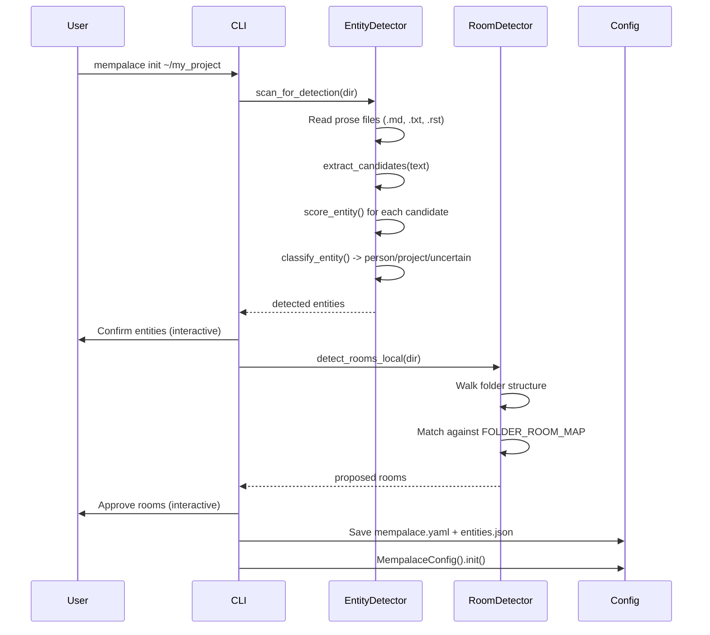
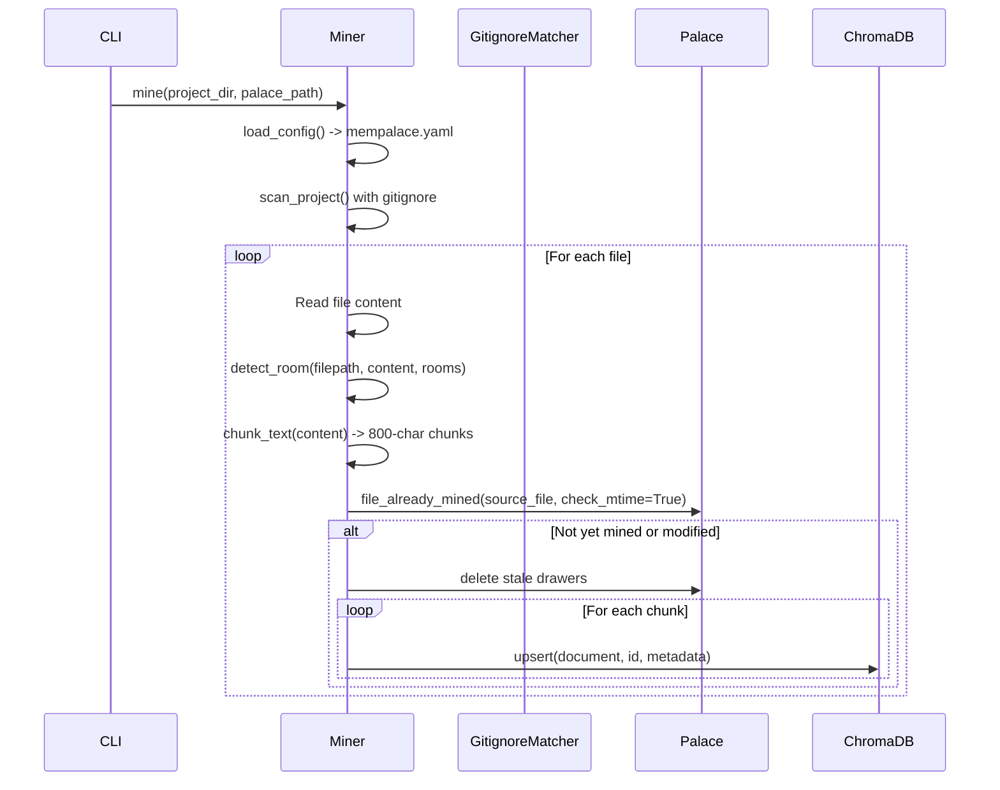
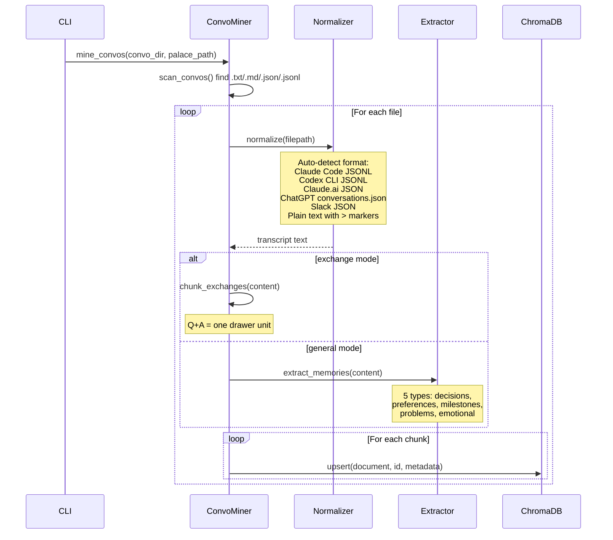
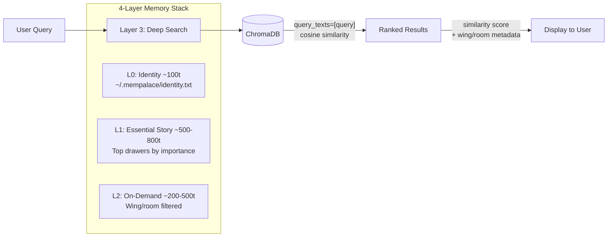
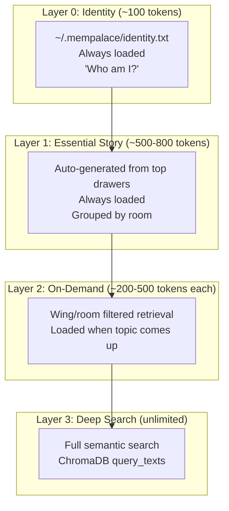
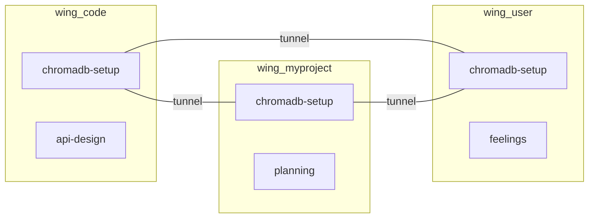

# MemPalace -- Comprehensive Exploration

## Executive Summary

MemPalace is the highest-scoring AI memory system ever benchmarked, achieving 96.6% LongMemEval R@5 (Recall at rank 5). It gives AI assistants persistent memory by storing raw, verbatim conversation content in ChromaDB -- a local vector database -- without any summarization. The system uses a spatial metaphor borrowed from the ancient memory palace mnemonic technique: **wings** (people or projects), **halls** (memory types like facts, events, discoveries), and **rooms** (specific ideas or topics).

The system is Python-based (v3.1.0), runs entirely locally with zero external API dependencies, and integrates with AI tools via the Model Context Protocol (MCP). It supports CLI operation, hooks for session management, entity detection, a temporal knowledge graph in SQLite, and an experimental compression dialect called AAAK.

## Architecture Overview

```mermaid
graph TB
    subgraph "User Interface Layer"
        CLI[CLI - cli.py]
        MCP[MCP Server - mcp_server.py]
        HOOKS[Hooks - hooks_cli.py]
    end

    subgraph "Ingest Layer"
        MINER[Project Miner - miner.py]
        CONVO[Convo Miner - convo_miner.py]
        NORM[Normalizer - normalize.py]
        SPLIT[Mega-File Splitter - split_mega_files.py]
        GENEX[General Extractor - general_extractor.py]
    end

    subgraph "Detection & Classification"
        EDET[Entity Detector - entity_detector.py]
        EREG[Entity Registry - entity_registry.py]
        RDET[Room Detector - room_detector_local.py]
        SPELL[Spellcheck - spellcheck.py]
    end

    subgraph "Storage Layer"
        PALACE[Palace Operations - palace.py]
        CHROMA[(ChromaDB - Vector Store)]
        KG[Knowledge Graph - knowledge_graph.py]
        SQLITE[(SQLite - KG Store)]
    end

    subgraph "Retrieval Layer"
        SEARCH[Searcher - searcher.py]
        LAYERS[4-Layer Memory Stack - layers.py]
        PGRAPH[Palace Graph - palace_graph.py]
    end

    subgraph "Compression Layer"
        DIALECT[AAAK Dialect - dialect.py]
        DEDUP[Deduplicator - dedup.py]
    end

    subgraph "Maintenance"
        REPAIR[Repair - repair.py]
        MIGRATE[Migrate - migrate.py]
        ONBOARD[Onboarding - onboarding.py]
    end

    CLI --> MINER
    CLI --> CONVO
    CLI --> SEARCH
    CLI --> LAYERS
    CLI --> DIALECT
    CLI --> SPLIT
    CLI --> MIGRATE

    MCP --> SEARCH
    MCP --> PALACE
    MCP --> KG
    MCP --> PGRAPH

    CONVO --> NORM
    CONVO --> GENEX
    NORM --> SPELL

    MINER --> PALACE
    CONVO --> PALACE
    PALACE --> CHROMA
    KG --> SQLITE

    SEARCH --> CHROMA
    LAYERS --> CHROMA
    PGRAPH --> CHROMA

    EDET --> EREG
    RDET --> MINER

    HOOKS --> MINER
```



## The Palace Metaphor

MemPalace organizes memory using a spatial metaphor inspired by the ancient Greek/Roman **method of loci** (memory palace technique):

```
Palace (the whole system)
  +-- Wing: my_project              (a project or person)
  |     +-- Hall: hall_facts         (type of memory)
  |     |     +-- Room: database     (specific topic)
  |     |     |     +-- Drawer 1     (verbatim text chunk)
  |     |     |     +-- Drawer 2
  |     |     +-- Room: api-design
  |     +-- Hall: hall_decisions
  |           +-- Room: graphql-switch
  +-- Wing: family
  |     +-- Hall: hall_events
  |           +-- Room: riley-school
  +-- Wing: wing_agent
        +-- Room: diary              (agent's personal journal)
```

- **Wings**: Top-level organizational unit. One per project, person, or domain.
- **Halls**: Corridors within wings that group by memory type (facts, events, discoveries, preferences, advice).
- **Rooms**: Named ideas within halls. A room is a specific topic cluster.
- **Drawers**: The atomic unit of storage. Each drawer contains a verbatim text chunk (typically ~800 characters) with metadata.
- **Tunnels**: Connections between rooms across wings, discovered through shared room names.

## File Structure

```
mempalace/
  __init__.py              # Package init, ChromaDB telemetry silencing, CoreML workaround
  __main__.py              # python -m mempalace entry point
  version.py               # Single source of truth: v3.1.0
  cli.py                   # Argparse CLI with 12 subcommands
  config.py                # Config manager (env > config file > defaults)
  palace.py                # Shared ChromaDB access patterns
  miner.py                 # Project file miner with gitignore support
  convo_miner.py           # Conversation transcript miner
  normalize.py             # Multi-format chat normalizer (Claude, ChatGPT, Slack, Codex)
  general_extractor.py     # 5-type memory extractor (decisions, preferences, milestones, problems, emotional)
  searcher.py              # Semantic search against palace
  layers.py                # 4-layer memory stack (L0-L3)
  dialect.py               # AAAK compression dialect
  entity_detector.py       # Auto-detect people and projects from text
  entity_registry.py       # Persistent entity registry with disambiguation
  knowledge_graph.py       # Temporal entity-relationship graph in SQLite
  palace_graph.py          # Graph traversal layer (rooms as nodes, tunnels as edges)
  room_detector_local.py   # Room detection from folder structure
  hooks_cli.py             # Session hooks (session-start, stop, precompact)
  instructions_cli.py      # Instruction text output
  onboarding.py            # First-run setup wizard
  dedup.py                 # Near-duplicate drawer detection and removal
  spellcheck.py            # Spell-correction for user messages
  split_mega_files.py      # Split concatenated transcripts into per-session files
  repair.py                # Scan, prune, and rebuild HNSW index
  migrate.py               # Cross-version ChromaDB migration
  instructions/            # Markdown instruction files (init, search, mine, help, status)

benchmarks/
  longmemeval_bench.py     # The benchmark that achieved 96.6% R@5
  locomo_bench.py          # LoCoMo benchmark
  convomem_bench.py        # ConvoMem benchmark
  membench_bench.py        # MemBench benchmark
  BENCHMARKS.md            # Full benchmark results
  HYBRID_MODE.md           # Hybrid mode analysis

docs/
  schema.sql               # Knowledge graph SQLite schema

examples/
  basic_mining.py           # Basic mining example
  convo_import.py           # Conversation import example
  gemini_cli_setup.md       # Gemini CLI integration
  HOOKS_TUTORIAL.md         # Hooks tutorial
  mcp_setup.md              # MCP setup guide

hooks/
  mempal_save_hook.sh       # Shell-based save hook
  mempal_precompact_hook.sh # Shell-based precompact hook

.claude-plugin/             # Claude Code plugin manifest
.codex-plugin/              # OpenAI Codex CLI plugin manifest
integrations/openclaw/      # OpenClaw integration
```

## Core Data Flow

### 1. Initialization (`mempalace init`)



### 2. Mining (`mempalace mine`)



### 3. Conversation Mining (`mempalace mine --mode convos`)



### 4. Search & Retrieval



## Key Components Deep Dive

### Configuration System (`config.py`)

Priority chain: Environment variables > `~/.mempalace/config.json` > defaults.

Key configuration:
- `palace_path`: Where ChromaDB stores data (default: `~/.mempalace/palace`)
- `collection_name`: ChromaDB collection (default: `mempalace_drawers`)
- `people_map`: Name variant -> canonical name mapping
- `topic_wings`: Default topic categories (emotions, consciousness, memory, technical, identity, family, creative)
- `hall_keywords`: Keyword lists for routing content to halls

Security features:
- Name sanitization with regex validation (`^[a-zA-Z0-9][a-zA-Z0-9_ .'-]{0,126}[a-zA-Z0-9]?$`)
- Path traversal blocking (`..`, `/`, `\`)
- Null byte blocking
- Content length limits (100K characters)
- File permissions set to owner-only (0o700 for dirs, 0o600 for files)

### Chunking Strategy (`miner.py`)

The miner splits files into "drawers" with configurable parameters:
- **CHUNK_SIZE**: 800 characters per drawer
- **CHUNK_OVERLAP**: 100 characters overlap between chunks
- **MIN_CHUNK_SIZE**: 50 characters minimum
- **MAX_FILE_SIZE**: 10 MB maximum

Chunking prefers paragraph boundaries (`\n\n`) over arbitrary character splits. When no paragraph break exists, it falls back to line breaks (`\n`), then hard character limit.

### Drawer ID Generation

Each drawer gets a deterministic ID: `drawer_{wing}_{room}_{sha256(source_file + chunk_index)[:24]}`

This ensures:
- Idempotent re-mining (same file produces same IDs)
- No collisions across wings/rooms
- Efficient deduplication

### Gitignore Implementation (`miner.py`)

MemPalace implements a full `.gitignore` parser:
- Supports negation (`!`), anchored patterns (`/`), directory-only patterns (`/`), and `**` globs
- Caches matchers per directory
- Respects nested `.gitignore` files with proper precedence (last match wins)
- Supports `--include-ignored` for force-including specific paths

### Entity Detection (`entity_detector.py`)

Two-pass entity detection:
1. **Extract**: Find all capitalized proper nouns appearing 3+ times, filter against 300+ stopwords
2. **Score & Classify**: Apply signal patterns to classify as person vs. project

Person signals (weighted):
- Dialogue markers (`> Name:`, `[Name]`) -- weight 3x
- Person verbs (`Name said/asked/told/felt`) -- weight 2x
- Pronoun proximity (she/he/they within 3 lines) -- weight 2x
- Direct address (`hey Name`, `thanks Name`) -- weight 4x

Project signals (weighted):
- Project verbs (`building Name`, `deploy Name`) -- weight 2x
- Versioned references (`Name v2`, `Name-core`) -- weight 3x
- Code file references (`Name.py`, `Name.js`) -- weight 3x

Classification requires **two different signal categories** for confident person classification, preventing false positives from single recurring syntactic patterns.

### Entity Registry (`entity_registry.py`)

Persistent registry at `~/.mempalace/entity_registry.json` with three data sources:
1. **Onboarding**: User-provided ground truth (confidence: 1.0)
2. **Learned**: Inferred from session history (confidence: 0.75+)
3. **Researched**: Wikipedia API lookups for unknown words

Key feature: **Ambiguity disambiguation**. Words like "Grace", "Will", "May" that are both names and common English words get context-based disambiguation using pattern matching (`Name said` -> person, `have you ever` -> concept).

### Knowledge Graph (`knowledge_graph.py`)

Temporal entity-relationship graph stored in SQLite:

```sql
entities(id, name, type, properties, created_at)
triples(id, subject, predicate, object, valid_from, valid_to, confidence, source_closet, source_file, extracted_at)
```

Key capabilities:
- **Temporal validity**: Facts have `valid_from` and `valid_to` dates
- **Time-filtered queries**: "What was true about Max in January 2026?"
- **Invalidation**: Mark facts as no longer true without deleting
- **Bidirectional traversal**: Query outgoing, incoming, or both directions

Uses WAL journaling mode for concurrent access safety.

### 4-Layer Memory Stack (`layers.py`)



Wake-up cost is ~600-900 tokens (L0+L1), leaving 95%+ of context window free.

Layer 1 generation:
1. Fetch all drawers in batches of 500
2. Score by importance metadata (falls back to 3 if no importance field)
3. Sort descending, take top 15
4. Group by room for readability
5. Truncate each snippet to 200 chars
6. Hard cap at 3200 characters total

### Palace Graph (`palace_graph.py`)

Builds a navigable graph from ChromaDB metadata:
- **Nodes**: Rooms (named ideas)
- **Edges**: Rooms that appear in multiple wings (tunnels)
- **Traversal**: BFS from a starting room, finding connected rooms through shared wings



### MCP Server (`mcp_server.py`)

JSON-RPC 2.0 server implementing the Model Context Protocol. Supports protocol versions from 2024-11-05 through 2025-11-25.

**Read Tools** (7):
- `mempalace_status` -- Palace overview
- `mempalace_list_wings` -- Wing listing
- `mempalace_list_rooms` -- Room listing
- `mempalace_get_taxonomy` -- Full wing->room->count tree
- `mempalace_search` -- Semantic search
- `mempalace_check_duplicate` -- Duplicate detection
- `mempalace_get_aaak_spec` -- AAAK dialect specification

**Write Tools** (2):
- `mempalace_add_drawer` -- File content into palace
- `mempalace_delete_drawer` -- Remove drawer by ID

**Knowledge Graph Tools** (5):
- `mempalace_kg_query` -- Query entity relationships
- `mempalace_kg_add` -- Add relationship triple
- `mempalace_kg_invalidate` -- Mark fact as expired
- `mempalace_kg_timeline` -- Chronological fact timeline
- `mempalace_kg_stats` -- Graph statistics

**Graph Tools** (3):
- `mempalace_traverse` -- Walk palace graph from room
- `mempalace_find_tunnels` -- Find cross-wing connections
- `mempalace_graph_stats` -- Graph overview

**Diary Tools** (2):
- `mempalace_diary_write` -- Agent personal journal
- `mempalace_diary_read` -- Read agent diary entries

**Write-Ahead Log**: Every write operation is logged to `~/.mempalace/wal/write_log.jsonl` before execution, providing an audit trail for detecting memory poisoning and enabling rollback.

### Hooks System (`hooks_cli.py`)

Three hooks for AI session lifecycle management:
1. **session-start**: Initialize tracking state
2. **stop**: Every 15 human messages, block to force memory save
3. **precompact**: Before context compaction, block to force comprehensive save

Reads JSON from stdin, outputs JSON to stdout. Supports `claude-code` and `codex` harnesses.

### Normalizer (`normalize.py`)

Supports six chat export formats:
1. Plain text with `>` markers (pass through)
2. Claude Code JSONL sessions
3. OpenAI Codex CLI JSONL
4. Claude.ai JSON export (flat messages or privacy export)
5. ChatGPT `conversations.json` (with tree-structured mapping)
6. Slack JSON export (handles multi-person channels)

All formats are converted to a unified transcript format: `> user message\nassistant response\n`

### General Extractor (`general_extractor.py`)

Extracts 5 types of memories using pure keyword/pattern heuristics (no LLM):
1. **Decisions**: "we went with X because Y"
2. **Preferences**: "always use X", "never do Y"
3. **Milestones**: breakthroughs, things that finally worked
4. **Problems**: what broke, root causes, fixes
5. **Emotional**: feelings, vulnerability, relationships

Each paragraph is scored against regex marker sets, disambiguated using sentiment analysis (positive/negative word sets), and classified with a confidence threshold.

### Deduplication (`dedup.py`)

Greedy deduplication within source-file groups:
1. Group drawers by `source_file` metadata
2. Sort by document length (longest first)
3. For each drawer, query ChromaDB for cosine similarity against kept drawers
4. If cosine distance < threshold (default 0.15 = ~85% similarity), mark as duplicate
5. Delete duplicates in batches of 500

### Repair System (`repair.py`)

Three operations for fixing corrupted palaces:
1. **Scan**: Probe all IDs in batches of 100, identify unfetchable/corrupt entries
2. **Prune**: Delete only corrupt IDs (surgical)
3. **Rebuild**: Extract all drawers, delete collection, recreate with `hnsw:space=cosine`, upsert everything back

The rebuild backs up only `chroma.sqlite3` (source of truth), not bloated HNSW files.

### Migration (`migrate.py`)

Handles ChromaDB version mismatches by:
1. Reading documents and metadata directly from SQLite (bypassing ChromaDB API)
2. Creating a fresh palace in a temp directory
3. Re-importing everything using the current ChromaDB version
4. Swapping old palace for migrated version

## Dependencies

```toml
[project]
dependencies = [
    "chromadb>=0.5.0,<0.7",    # Vector database
    "pyyaml>=6.0,<7",           # Config file parsing
]

[project.optional-dependencies]
dev = ["pytest>=7.0", "pytest-cov>=4.0", "ruff>=0.4.0", "psutil>=5.9"]
spellcheck = ["autocorrect>=2.0"]
```

Minimal dependency footprint: only ChromaDB and PyYAML are required. Autocorrect is optional.

## Security Considerations

1. **Input sanitization**: All wing/room/entity names validated against safe character regex
2. **Path traversal prevention**: `..`, `/`, `\` blocked in names
3. **File permission hardening**: Config dirs 0o700, config files 0o600
4. **Write-ahead log**: All MCP write operations logged for audit
5. **Symlink protection**: Symlinks skipped during scanning to prevent following links to sensitive files
6. **File size limits**: 10MB per file, 500MB for transcript splitting
7. **Content length limits**: 100K character maximum for drawer content
8. **Null byte blocking**: Prevents injection attacks

## Related Deep-Dive Documents

- [Palace Architecture Deep Dive](./palace-architecture-deep-dive.md) -- Wings, halls, rooms, tunnels
- [AAAK Dialect Deep Dive](./aaak-dialect-deep-dive.md) -- Compression algorithms and format
- [Vector Search Deep Dive](./vector-search-deep-dive.md) -- ChromaDB, embeddings, semantic search
- [Knowledge Graph Deep Dive](./knowledge-graph-deep-dive.md) -- Entity detection, temporal KG
- [Storage Deep Dive](./storage-deep-dive.md) -- Resilient storage for beginners
- [Networking & Security Deep Dive](./networking-security-deep-dive.md) -- Cross-platform agents, certificates
- [Production-Grade Deep Dive](./production-grade-deep-dive.md) -- What production looks like
- [Rust Revision](./rust-revision.md) -- Full Rust translation plan
