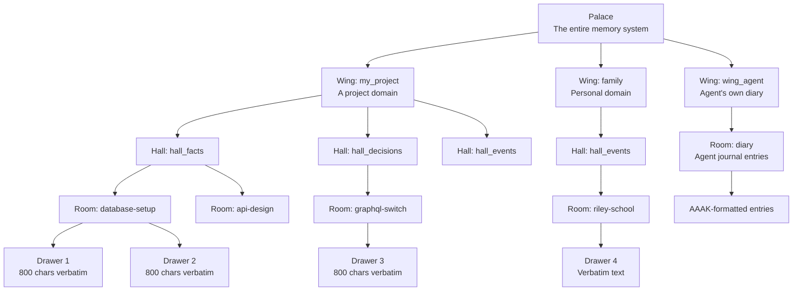
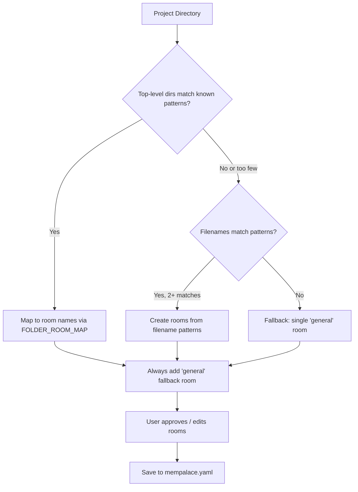
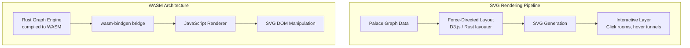

# Palace Architecture Deep Dive

## The Memory Palace Metaphor

The "method of loci" (memory palace) is a 2,500-year-old mnemonic technique attributed to the Greek poet Simonides of Ceos. The practitioner imagines a familiar physical space -- a house, a palace, a route through a city -- and places memories at specific locations within it. To recall, they mentally walk through the space, visiting each location.

MemPalace translates this into software architecture. Instead of imagining a physical building, the system creates a **hierarchical spatial data structure** that organizes memories by context (wings), type (halls), topic (rooms), and content (drawers).

## Hierarchy



### Wings

Wings are the top-level organizational unit. Each wing represents a distinct domain -- a project, a person, or a category of life.

**Implementation**: Wings are stored as metadata on each ChromaDB drawer document:
```python
metadata = {
    "wing": "my_project",     # The wing name
    "room": "database-setup",  # The room within the wing
    "source_file": "/path/to/file.py",
    "chunk_index": 0,
    "added_by": "mempalace",
    "filed_at": "2026-04-11T10:30:00",
}
```

Wing names come from:
- The project directory name (auto-detected during `mempalace init`)
- User override via `--wing` flag
- The `mempalace.yaml` config file

Default topic wings for conversation mining: emotions, consciousness, memory, technical, identity, family, creative.

**What this looks like in Rust**:
```rust
/// A wing is a top-level organizational domain.
#[derive(Debug, Clone, Serialize, Deserialize)]
pub struct Wing {
    pub name: String,
    pub rooms: Vec<Room>,
}

impl Wing {
    pub fn new(name: impl Into<String>) -> Self {
        Self {
            name: name.into(),
            rooms: Vec::new(),
        }
    }

    /// Validate wing name against safe character set.
    pub fn validate_name(name: &str) -> Result<&str, ValidationError> {
        static RE: Lazy<Regex> = Lazy::new(|| {
            Regex::new(r"^[a-zA-Z0-9][a-zA-Z0-9_ .'-]{0,126}[a-zA-Z0-9]?$").unwrap()
        });
        if name.is_empty() {
            return Err(ValidationError::Empty("wing name"));
        }
        if name.len() > 128 {
            return Err(ValidationError::TooLong("wing name", 128));
        }
        if name.contains("..") || name.contains('/') || name.contains('\\') {
            return Err(ValidationError::PathTraversal("wing name"));
        }
        if !RE.is_match(name) {
            return Err(ValidationError::InvalidChars("wing name"));
        }
        Ok(name)
    }
}
```

### Halls

Halls are corridors within wings that categorize memory by type. They answer "what kind of memory is this?"

The five default hall types:
1. **hall_facts** -- Factual information, specifications, measurements
2. **hall_events** -- Things that happened, timelines, milestones
3. **hall_discoveries** -- Insights, breakthroughs, learned lessons
4. **hall_preferences** -- Opinions, style preferences, "always do X"
5. **hall_advice** -- Recommendations, best practices, warnings

Halls are determined by keyword matching in `config.py`:
```python
DEFAULT_HALL_KEYWORDS = {
    "emotions": ["scared", "afraid", "worried", "happy", "sad", "love", ...],
    "consciousness": ["consciousness", "conscious", "aware", "real", ...],
    "memory": ["memory", "remember", "forget", "recall", ...],
    "technical": ["code", "python", "script", "bug", "error", ...],
    "identity": ["identity", "name", "who am i", "persona", ...],
    "family": ["family", "kids", "children", "daughter", ...],
    "creative": ["game", "gameplay", "player", "app", "design", ...],
}
```

**What this looks like in Rust**:
```rust
/// Hall types categorize the nature of a memory.
#[derive(Debug, Clone, Copy, PartialEq, Eq, Hash, Serialize, Deserialize)]
pub enum HallType {
    Facts,
    Events,
    Discoveries,
    Preferences,
    Advice,
    Custom(String),
}

impl HallType {
    /// Score text against hall keyword sets.
    pub fn detect(content: &str) -> Self {
        let lower = content.to_lowercase();
        let mut scores: HashMap<HallType, usize> = HashMap::new();

        for (hall, keywords) in HALL_KEYWORDS.iter() {
            let score: usize = keywords.iter()
                .filter(|kw| lower.contains(*kw))
                .count();
            if score > 0 {
                scores.insert(*hall, score);
            }
        }

        scores.into_iter()
            .max_by_key(|&(_, score)| score)
            .map(|(hall, _)| hall)
            .unwrap_or(HallType::Facts)
    }
}
```

### Rooms

Rooms are the topic-level organization within halls. A room is a named idea -- "database-setup", "api-design", "riley-school". Rooms are detected automatically from folder structure or content keywords.

**Room Detection** (`room_detector_local.py`):

Two strategies, tried in order:
1. **Folder structure**: Match directory names against `FOLDER_ROOM_MAP` (95 entries mapping folder names like "frontend", "backend", "docs", "tests" to room names)
2. **Filename patterns**: Scan file names for recurring keywords



**Content-based routing** (`miner.py: detect_room()`):

When a file is mined, it's routed to a room using a three-priority system:
1. **Folder path match**: If the file lives in a folder that matches a room name
2. **Filename match**: If the file's stem matches a room name
3. **Keyword scoring**: Count room keyword occurrences in the first 2000 chars of content

```python
def detect_room(filepath, content, rooms, project_path):
    relative = str(filepath.relative_to(project_path)).lower()
    path_parts = relative.split("/")

    # Priority 1: folder path matches room
    for part in path_parts[:-1]:
        for room in rooms:
            candidates = [room["name"].lower()] + [k.lower() for k in room.get("keywords", [])]
            if any(part == c or c in part or part in c for c in candidates):
                return room["name"]

    # Priority 2: filename matches room
    # Priority 3: keyword scoring
    # Fallback: "general"
```

**What this looks like in Rust**:
```rust
/// A room is a named topic cluster within a hall.
#[derive(Debug, Clone, Serialize, Deserialize)]
pub struct Room {
    pub name: String,
    pub description: String,
    pub keywords: Vec<String>,
}

impl Room {
    /// Route a file to the best matching room.
    pub fn detect(
        filepath: &Path,
        content: &str,
        rooms: &[Room],
        project_path: &Path,
    ) -> String {
        let relative = filepath.strip_prefix(project_path)
            .unwrap_or(filepath)
            .to_string_lossy()
            .to_lowercase();

        // Priority 1: folder path match
        let path_parts: Vec<&str> = relative.split('/').collect();
        for part in &path_parts[..path_parts.len().saturating_sub(1)] {
            for room in rooms {
                let candidates: Vec<String> = std::iter::once(room.name.to_lowercase())
                    .chain(room.keywords.iter().map(|k| k.to_lowercase()))
                    .collect();
                if candidates.iter().any(|c| part == c || c.contains(part) || part.contains(c.as_str())) {
                    return room.name.clone();
                }
            }
        }

        // Priority 2: filename match
        let stem = filepath.file_stem()
            .and_then(|s| s.to_str())
            .unwrap_or("")
            .to_lowercase();

        for room in rooms {
            if room.name.to_lowercase().contains(&stem) || stem.contains(&room.name.to_lowercase()) {
                return room.name.clone();
            }
        }

        // Priority 3: keyword scoring
        let content_lower = &content[..content.len().min(2000)].to_lowercase();
        let mut best_room = "general".to_string();
        let mut best_score = 0usize;

        for room in rooms {
            let score: usize = room.keywords.iter()
                .chain(std::iter::once(&room.name))
                .map(|kw| content_lower.matches(&kw.to_lowercase()).count())
                .sum();
            if score > best_score {
                best_score = score;
                best_room = room.name.clone();
            }
        }

        best_room
    }
}
```

### Drawers

Drawers are the atomic storage unit. Each drawer contains:
- **document**: Verbatim text chunk (~800 characters)
- **id**: Deterministic hash-based ID
- **metadata**: wing, room, source_file, chunk_index, added_by, filed_at, source_mtime

The verbatim storage philosophy is central to MemPalace's design: **no summarization, no paraphrasing, no lossy transformation**. The text is stored exactly as it appeared in the source. This is what achieves the 96.6% benchmark score -- the AI can retrieve the actual words, not a compressed interpretation.

**Chunking algorithm**:
```
Input: "This is paragraph one.\n\nThis is paragraph two.\n\nThis is a very long..."
                                                                          |
                                                                     800 char mark

Step 1: Try to break at paragraph boundary (\n\n) in second half of chunk
Step 2: If no paragraph, try line break (\n) in second half
Step 3: If nothing, hard cut at 800 characters
Step 4: Next chunk starts at (cut_point - 100) for 100-char overlap
```

The 100-character overlap ensures that sentences or ideas split across chunk boundaries remain retrievable from either chunk.

**What this looks like in Rust**:
```rust
/// A drawer is the atomic unit of stored memory.
#[derive(Debug, Clone, Serialize, Deserialize)]
pub struct Drawer {
    pub id: String,
    pub content: String,
    pub metadata: DrawerMetadata,
}

#[derive(Debug, Clone, Serialize, Deserialize)]
pub struct DrawerMetadata {
    pub wing: String,
    pub room: String,
    pub source_file: String,
    pub chunk_index: u32,
    pub added_by: String,
    pub filed_at: DateTime<Utc>,
    pub source_mtime: Option<f64>,
}

impl Drawer {
    /// Generate deterministic drawer ID.
    pub fn generate_id(wing: &str, room: &str, source_file: &str, chunk_index: u32) -> String {
        use sha2::{Sha256, Digest};
        let mut hasher = Sha256::new();
        hasher.update(format!("{}{}", source_file, chunk_index));
        let hash = hex::encode(hasher.finalize());
        format!("drawer_{}_{}_{}", wing, room, &hash[..24])
    }
}

/// Split content into drawer-sized chunks.
pub fn chunk_text(content: &str, _source_file: &str) -> Vec<Chunk> {
    const CHUNK_SIZE: usize = 800;
    const CHUNK_OVERLAP: usize = 100;
    const MIN_CHUNK_SIZE: usize = 50;

    let content = content.trim();
    if content.is_empty() {
        return Vec::new();
    }

    let mut chunks = Vec::new();
    let mut start = 0;
    let mut chunk_index = 0u32;

    while start < content.len() {
        let mut end = (start + CHUNK_SIZE).min(content.len());

        // Try to break at paragraph boundary
        if end < content.len() {
            if let Some(pos) = content[start..end].rfind("\n\n") {
                let absolute = start + pos;
                if absolute > start + CHUNK_SIZE / 2 {
                    end = absolute;
                }
            } else if let Some(pos) = content[start..end].rfind('\n') {
                let absolute = start + pos;
                if absolute > start + CHUNK_SIZE / 2 {
                    end = absolute;
                }
            }
        }

        let chunk = content[start..end].trim();
        if chunk.len() >= MIN_CHUNK_SIZE {
            chunks.push(Chunk {
                content: chunk.to_string(),
                chunk_index,
            });
            chunk_index += 1;
        }

        start = if end < content.len() {
            end.saturating_sub(CHUNK_OVERLAP)
        } else {
            end
        };
    }

    chunks
}
```

### Tunnels

Tunnels are emergent connections between rooms that span multiple wings. When the same room name appears in different wings, it creates a "tunnel" -- a conceptual bridge between domains.

For example, if both `wing_code` and `wing_myproject` have a room called `chromadb-setup`, that room is a tunnel connecting the code domain to the project domain.

**Building the graph** (`palace_graph.py`):
1. Scan all drawers, collecting rooms with their wings
2. Rooms appearing in 2+ wings become tunnel nodes
3. Each pair of wings sharing a room creates an edge

**Traversal**:
BFS from a starting room, finding connected rooms through shared wings. Each hop follows the wing connections:
- Start at `chromadb-setup` in `wing_code`
- Discover it also exists in `wing_myproject` (hop 1)
- From `wing_myproject`, discover other rooms like `planning`, `costs` (hop 2)

This enables questions like "What connects my code work to my project planning?"

**What this looks like in Rust**:
```rust
use std::collections::{HashMap, HashSet, VecDeque};

#[derive(Debug, Clone)]
pub struct PalaceGraph {
    pub nodes: HashMap<String, RoomNode>,
    pub edges: Vec<TunnelEdge>,
}

#[derive(Debug, Clone)]
pub struct RoomNode {
    pub wings: HashSet<String>,
    pub halls: HashSet<String>,
    pub count: usize,
}

#[derive(Debug, Clone)]
pub struct TunnelEdge {
    pub room: String,
    pub wing_a: String,
    pub wing_b: String,
    pub hall: String,
    pub count: usize,
}

impl PalaceGraph {
    /// BFS traversal from a starting room.
    pub fn traverse(&self, start_room: &str, max_hops: usize) -> Vec<TraversalResult> {
        let Some(start) = self.nodes.get(start_room) else {
            return vec![];
        };

        let mut visited = HashSet::new();
        visited.insert(start_room.to_string());

        let mut results = vec![TraversalResult {
            room: start_room.to_string(),
            wings: start.wings.iter().cloned().collect(),
            hop: 0,
            connected_via: vec![],
        }];

        let mut frontier: VecDeque<(String, usize)> = VecDeque::new();
        frontier.push_back((start_room.to_string(), 0));

        while let Some((current_room, depth)) = frontier.pop_front() {
            if depth >= max_hops {
                continue;
            }

            let current_wings: HashSet<_> = self.nodes
                .get(&current_room)
                .map(|n| n.wings.clone())
                .unwrap_or_default();

            for (room, data) in &self.nodes {
                if visited.contains(room) {
                    continue;
                }

                let shared: Vec<_> = current_wings.intersection(&data.wings).cloned().collect();
                if !shared.is_empty() {
                    visited.insert(room.clone());
                    results.push(TraversalResult {
                        room: room.clone(),
                        wings: data.wings.iter().cloned().collect(),
                        hop: depth + 1,
                        connected_via: shared,
                    });
                    if depth + 1 < max_hops {
                        frontier.push_back((room.clone(), depth + 1));
                    }
                }
            }
        }

        results.sort_by(|a, b| a.hop.cmp(&b.hop));
        results.truncate(50);
        results
    }
}
```

## The mempalace.yaml Config File

Generated by `mempalace init`, this file defines the wing name and room taxonomy for a project:

```yaml
wing: my_project
rooms:
  - name: frontend
    description: Files from frontend/
    keywords: [frontend, client]
  - name: backend
    description: Files from backend/
    keywords: [backend, server, api]
  - name: documentation
    description: Files from docs/
    keywords: [documentation, docs]
  - name: general
    description: Files that don't fit other rooms
    keywords: []
```

## What a Production-Grade Version Looks Like

A production palace architecture would add:

1. **Hierarchical namespacing**: Palace -> Organization -> User -> Wings, enabling multi-tenant deployments
2. **Room versioning**: Track how room membership changes over time
3. **Drawer provenance**: Full chain of custody -- who created, who modified, from which session
4. **Cross-palace federation**: Share rooms/tunnels across separate palace instances
5. **Access control**: Read/write permissions per wing, per room
6. **Room capacity management**: Auto-split rooms that grow too large
7. **Tunnel strength metrics**: Weight tunnel connections by how many drawers share the link
8. **Temporal room evolution**: Track how a room's content evolves over time

## How WASM Web Rendering Works (for Palace Visualization)

The palace metaphor lends itself naturally to visual representation. A WASM-based web UI could render the palace as an interactive 3D or 2D floor plan.

### SVG-based 2D Palace Map



Key algorithms for palace visualization:

**Force-directed graph layout** (Fruchterman-Reingold):
- Nodes (rooms) repel each other like charged particles
- Edges (tunnels) attract connected nodes like springs
- Iterate until positions stabilize
- Wings are clustered using gravitational pull toward wing centroids

**Voronoi diagram** for wing boundaries:
- Compute Voronoi cells from wing centroid positions
- Wing boundaries are the cell edges
- Rooms within a wing cluster inside their Voronoi cell

**SVG path generation** for tunnels:
- Cubic Bezier curves between rooms across wings
- Control points offset perpendicular to the direct line
- Tunnel width proportional to connection strength

```rust
/// Generate SVG path for a tunnel between two rooms.
pub fn tunnel_svg_path(
    from: Point2D,
    to: Point2D,
    strength: f64,
) -> String {
    let mid_x = (from.x + to.x) / 2.0;
    let mid_y = (from.y + to.y) / 2.0;

    // Perpendicular offset for curve control point
    let dx = to.x - from.x;
    let dy = to.y - from.y;
    let offset = strength * 20.0; // Scale by connection strength
    let ctrl_x = mid_x - dy * 0.3;
    let ctrl_y = mid_y + dx * 0.3;

    format!(
        "M {},{} Q {},{} {},{}",
        from.x, from.y,
        ctrl_x, ctrl_y,
        to.x, to.y
    )
}
```

The WASM module would expose these functions to JavaScript, which handles DOM manipulation and user interaction. The Rust side handles all graph computation, layout, and SVG path generation for maximum performance.
