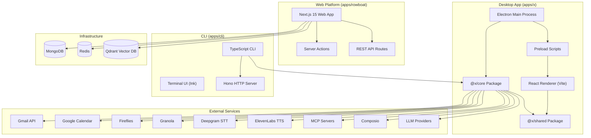
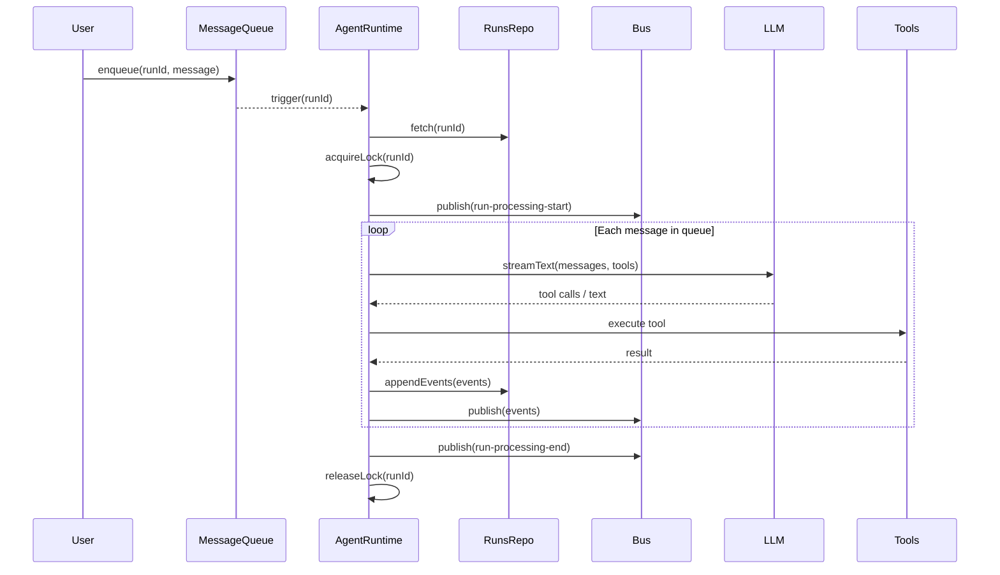
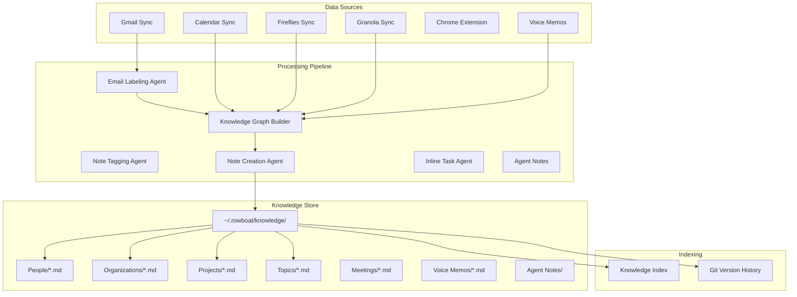
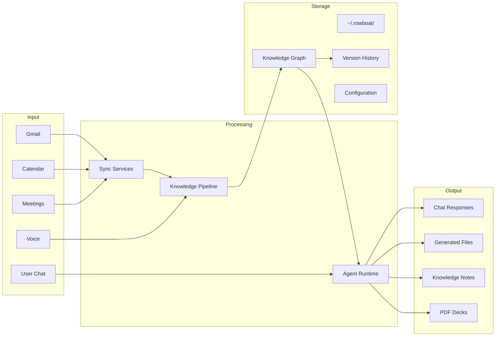

# Rowboat -- Comprehensive Exploration

## Project Overview

Rowboat is an open-source, local-first AI coworker that connects to your email, calendar, and meeting notes, builds a persistent knowledge graph from those sources, and uses that accumulated context to help users get work done. Unlike typical AI assistants that reconstruct context on every query, Rowboat maintains a long-lived, user-editable knowledge graph stored as plain Markdown files with Obsidian-compatible backlinks.

Key capabilities include:
- **Knowledge graph construction** from Gmail, Google Calendar, Fireflies, Granola meeting notes, Chrome extensions, and voice memos
- **Artifact generation**: PDF slide decks, meeting briefs, email drafts, documents
- **Voice input/output**: Deepgram for STT, ElevenLabs for TTS
- **MCP (Model Context Protocol)** tool integration for extensibility
- **Multi-model support**: OpenAI, Anthropic, Google, Ollama, OpenRouter, OpenAI-compatible providers
- **Composio integration** for third-party service connections (Slack, GitHub, Linear, etc.)
- **Version history** via isomorphic-git for knowledge files
- **Cross-platform desktop app** via Electron (Mac/Windows/Linux)

## Architecture Overview



## Monorepo Structure

```
rowboat/
  apps/
    x/                          # Electron desktop app (primary interface)
      apps/
        main/                   # Electron main process
        renderer/               # React UI (Vite-built)
        preload/                # contextBridge preload scripts
      packages/
        shared/                 # @x/shared -- types, validators, schemas
        core/                   # @x/core -- ALL business logic
    cli/                        # TypeScript CLI (Hono server + Ink TUI)
    rowboat/                    # Next.js web dashboard (legacy/cloud)
    rowboatx/                   # Next.js secondary web app
    python-sdk/                 # Python SDK for Rowboat API
    docs/                       # Documentation site (MkDocs-style)
    experimental/               # Chat widget, simulation runner, tools webhook
  docker-compose.yml            # Orchestration for web stack
  Dockerfile.qdrant             # Custom Qdrant image
  build-electron.sh             # Electron build script
```

## Core Architecture (`apps/x/packages/core`)

The `@x/core` package is the heart of Rowboat. It contains ~107 TypeScript files organized into the following subsystems:

### Dependency Injection Container

Rowboat uses **Awilix** for dependency injection with proxy-based injection mode. The container is defined in `core/src/di/container.ts`:

```mermaid
graph LR
    subgraph "DI Container (Awilix)"
        IdGen["IdGen (Monotonic)"]
        MsgQueue["InMemoryMessageQueue"]
        Bus["InMemoryBus"]
        RunsLock["InMemoryRunsLock"]
        AbortRegistry["InMemoryAbortRegistry"]
        AgentRuntime["AgentRuntime"]
        MCPRepo["FSMcpConfigRepo"]
        ModelRepo["FSModelConfigRepo"]
        AgentsRepo["FSAgentsRepo"]
        RunsRepo["FSRunsRepo"]
        OAuthRepo["FSOAuthRepo"]
        ClientRegRepo["FSClientRegistrationRepo"]
        GranolaRepo["FSGranolaConfigRepo"]
        ScheduleRepo["FSAgentScheduleRepo"]
        SlackRepo["FSSlackConfigRepo"]
    end
```



All repositories use the filesystem (`~/.rowboat/`) as their storage backend -- there is no database for the desktop app. This is key: Rowboat is fundamentally a filesystem-first application.

### Agent Runtime System

The `AgentRuntime` class (`core/src/agents/runtime.ts`) is the execution engine for AI agent runs:



Key design decisions:
- **Run-level locking**: Only one execution can process a run at a time (`InMemoryRunsLock`)
- **Abort support**: Two-phase abort -- graceful (SIGTERM + AbortSignal) then force (SIGKILL + MCP close)
- **Event bus**: In-memory pub/sub for real-time UI updates
- **Message queue**: In-memory, enqueues user messages and triggers runtime processing
- **Tool permission system**: Commands can be blocked, approved per-invocation, or approved "always" (persisted to security config)

### Knowledge Graph Pipeline

The knowledge graph is Rowboat's defining feature. It transforms raw data (emails, meetings, voice memos) into structured, interlinked Markdown notes.



**Knowledge Index** (`knowledge_index.ts`): Scans all Markdown files in `~/.rowboat/knowledge/` and extracts structured metadata (names, emails, aliases, organizations, roles, keywords) from each note by parsing Markdown headers and bold-field patterns. This index is injected into agent prompts so the LLM knows what entities already exist before creating new ones.

**Graph State** (`graph_state.ts`): Tracks which files have been processed using a hybrid mtime+SHA-256 hash approach. On each sync cycle (every 15 seconds), only new or changed files are sent through the pipeline.

**Batch Processing**: Files are processed in batches of 10, with the knowledge index rebuilt before each batch to incorporate notes created by previous batches. State is saved after each successful batch for crash resilience.

**Version History** (`version_history.ts`): Uses `isomorphic-git` to maintain a local git repository inside `~/.rowboat/knowledge/`. Every knowledge update and user edit is committed, enabling full file history, diffs, and restoration.

### Workspace System

The workspace module (`core/src/workspace/workspace.ts`) provides a sandboxed filesystem abstraction:

- **Path safety**: All paths are validated against traversal attacks (`..`, absolute paths)
- **Atomic writes**: Default write mode uses temp file + rename for crash safety
- **ETag-based conflict detection**: Writes can specify an expected ETag to prevent lost updates
- **Trash-based deletion**: Files are moved to `.trash/` by default, not permanently deleted
- **Wiki-link rewriting**: When knowledge files are renamed, all backlinks across the vault are updated
- **Debounced commits**: User edits to knowledge files trigger version history commits with a 3-minute debounce

### Model Provider System

Rowboat supports multiple LLM providers through the Vercel AI SDK:

| Flavor | Implementation |
|--------|---------------|
| `openai` | `@ai-sdk/openai` |
| `anthropic` | `@ai-sdk/anthropic` |
| `google` | `@ai-sdk/google` |
| `ollama` | `ollama-ai-provider-v2` |
| `openrouter` | `@openrouter/ai-sdk-provider` |
| `openai-compatible` | `@ai-sdk/openai-compatible` |
| `aigateway` | `ai` createGateway |

Configuration is stored in `~/.rowboat/config/models.json`. The model catalog (`models.dev`) provides discovery for supported models from known providers.

### MCP Integration

Rowboat supports all three MCP transport types:

1. **Stdio**: Local process spawned with `command`, `args`, `env`
2. **StreamableHTTP**: HTTP-based transport (tried first for URL configs)
3. **SSE**: Server-Sent Events fallback for URL configs

MCP clients are lazily connected and cached. The `forceCloseAllMcpClients()` function supports aggressive cleanup during force-abort scenarios.

### OAuth and Authentication

The auth system (`core/src/auth/`) implements:

- **OIDC Discovery**: Automatic authorization server metadata discovery
- **Dynamic Client Registration (RFC 7591)**: For MCP OAuth flows
- **PKCE flow**: S256 code challenge for all authorization code grants
- **Token refresh**: Automatic refresh with scope/token preservation
- **Static configuration**: For providers without discovery endpoints
- **Filesystem persistence**: OAuth tokens and client registrations stored on disk

### Composio Integration

Composio provides a curated toolkit of third-party integrations. Rowboat supports:
- Connecting accounts via OAuth2
- Executing Composio actions as tool calls
- Searching available tools dynamically
- A curated subset of toolkits surfaced in the UI

### Builtin Tools

The builtin tools system (`core/src/application/lib/builtin-tools.ts`) exposes ~30+ tools to the AI agent:

- **Workspace tools**: readFile, writeFile, readdir, rename, remove, edit, grep, stat, exists
- **System tools**: exec (command execution with security allowlist), parseFile (PDF/DOCX/etc)
- **MCP tools**: listServers, listTools, executeTool, addServer
- **Composio tools**: searchTools, executeAction, connectAccount
- **Skill system**: loadSkill for dynamic capability loading
- **Presentation tools**: createPresentation (generates PDF slide decks)

### Skills System

Skills (`core/src/application/assistant/skills/`) are dynamically loadable capability modules:

- `app-navigation`: UI navigation commands
- `background-agents`: Scheduled/background agent execution
- `builtin-tools`: Core filesystem and system tools
- `composio-integration`: Third-party service integration
- `create-presentations`: PDF deck generation
- `deletion-guardrails`: Safe deletion policies
- `doc-collab`: Document collaboration
- `draft-emails`: Email composition
- `mcp-integration`: MCP server management
- `meeting-prep`: Meeting preparation briefings
- `organize-files`: File organization
- `slack`: Slack integration
- `web-search`: Exa-powered web search

### Security Model

The security allowlist (`core/src/config/security.ts`) controls which commands the AI can execute without user approval. Default allowed commands include read-only utilities (cat, grep, ls, find, etc.). When a user approves a command with "always" scope, it is persisted to `~/.rowboat/config/security.json`.

## Electron App (`apps/x`)

### Build System

- **Package manager**: pnpm with workspace protocol
- **Main process bundler**: esbuild (single CJS output to handle pnpm symlinks)
- **Renderer bundler**: Vite 7
- **Packaging**: Electron Forge
- **TypeScript**: ES2022 target, TypeScript 5.9

Build order: `shared` -> `core` -> `preload` -> `renderer`/`main`

### Main Process (`apps/x/apps/main/src/main.ts`)

On startup, the main process:
1. Fixes PATH for packaged apps (spawns user's login shell to get full env)
2. Registers custom `app://` protocol for SPA routing
3. Initializes configs, sets up IPC handlers
4. Starts background services in parallel:
   - Gmail sync (5-min interval)
   - Calendar sync
   - Fireflies sync
   - Granola sync
   - Chrome extension sync
   - Knowledge graph builder (15-sec interval)
   - Email labeling
   - Note tagging
   - Inline tasks
   - Agent scheduler
   - Agent notes

### IPC Layer

Electron IPC handles communication between main process and renderer via `contextBridge`:
- Run management (create, delete, list, fetch, stop)
- Message sending (text, voice input, voice output)
- Workspace operations (file I/O)
- MCP server management
- Model configuration
- OAuth flows
- Composio operations

### Renderer (`apps/x/apps/renderer`)

The React UI includes:
- **Chat interface**: Message display, prompt input, suggestions, reasoning display
- **Markdown editor**: Full editor with frontmatter properties, toolbar, wiki-link support
- **Graph view**: Interactive SVG-based force-directed knowledge graph visualization
- **Settings**: Model configuration, connected accounts, security settings
- **Onboarding**: LLM setup, account connection, welcome flow
- **Extensions**: Calendar blocks, chart blocks, email blocks, embeds, images, tables, tasks, transcripts, wiki-links
- **Version history**: File diff viewer with restoration

## Web App (`apps/rowboat`)

The Next.js 15 web app provides a cloud/self-hosted dashboard with:

### Dependencies
- MongoDB for document storage
- Redis for caching and pub/sub
- Qdrant for vector search (RAG)
- Auth0 for authentication
- Composio for tool integrations
- Twilio for voice calls

### Server Actions
- `conversation.actions.ts`: Chat management
- `copilot.actions.ts`: AI copilot streaming
- `data-source.actions.ts`: RAG data source management
- `job.actions.ts`: Background job management
- `project.actions.ts`: Project CRUD
- `billing.actions.ts`: Subscription management

### API Routes
- `/api/v1/[projectId]/chat`: Chat API endpoint
- `/api/stream-response/[streamId]`: SSE streaming
- `/api/widget/v1/*`: Embeddable chat widget API
- `/api/composio/webhook`: Composio event webhooks
- `/api/twilio/*`: Voice call handling

### RAG System
- Document upload with S3 or local storage
- File parsing with Gemini or local parsers
- Text splitting via LangChain
- Embedding via OpenAI or custom providers
- Vector storage in Qdrant

## CLI App (`apps/cli`)

The CLI provides a terminal-based interface with:
- **Hono HTTP server**: REST API for programmatic access
- **Ink TUI**: Rich terminal UI with React components
- **Agent system**: Same runtime as desktop, different I/O
- **MCP support**: Same MCP integration
- **Yargs**: Command-line argument parsing

## Python SDK (`apps/python-sdk`)

A lightweight Python client wrapping the REST API:
- `requests` for HTTP
- `pydantic` for data validation
- Published as `rowboat` package on PyPI

## Data Flow



## Key Design Patterns

1. **Filesystem as database**: The desktop app stores everything in `~/.rowboat/` as plain files. No SQLite, no embedded DB. This makes data portable, inspectable, and editable by any tool.

2. **Agent-per-task**: Different LLM agents handle different tasks (email labeling, note creation, note tagging, inline tasks, user chat). Each has specialized system prompts.

3. **Hybrid change detection**: File processing uses mtime for fast screening, then SHA-256 hash for accuracy. Processed state is tracked in JSON.

4. **Event-driven architecture**: The in-memory bus enables real-time UI updates. Events flow from AgentRuntime -> Bus -> IPC -> Renderer.

5. **Progressive trust**: Command execution starts blocked, users approve per-command, then can grant "always" permission. The allowlist is persisted.

6. **Idempotent processing**: Knowledge graph rebuilds process only new/changed files. Each batch is independently recoverable.

## Deep Dives

For detailed analysis of specific subsystems, see:

- [Knowledge Graph Deep Dive](./knowledge-graph-deep-dive.md)
- [Networking & Security Deep Dive](./networking-security-deep-dive.md)
- [Storage Deep Dive](./storage-deep-dive.md)
- [WASM & Rendering Deep Dive](./wasm-rendering-deep-dive.md)
- [Algorithms Deep Dive](./algorithms-deep-dive.md)
- [Production Grade Deep Dive](./production-grade-deep-dive.md)
- [Rust Revision](./rust-revision.md)
