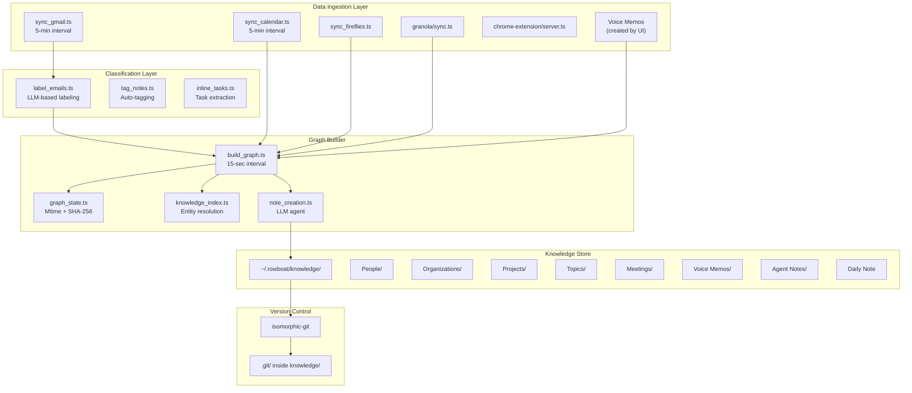
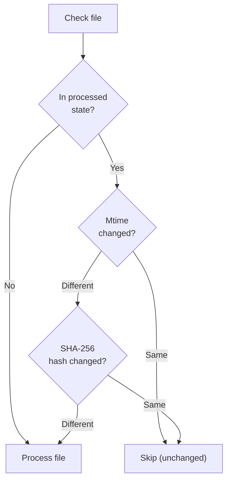
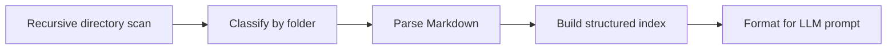
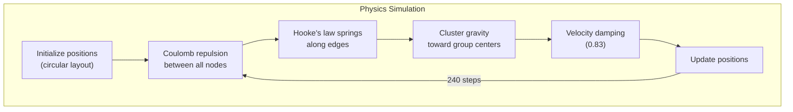
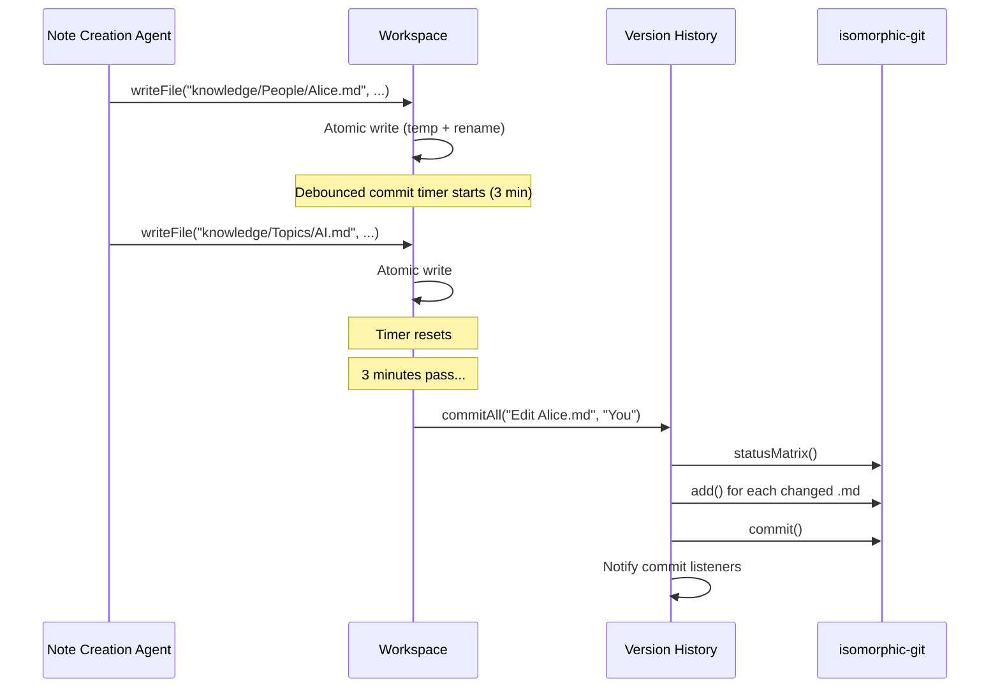

# Knowledge Graph Deep Dive

## What is a Knowledge Graph?

A knowledge graph is a data structure that represents information as a network of entities (nodes) and relationships (edges). Unlike a flat database, a knowledge graph captures the web of connections between things -- people know other people, people work at organizations, projects involve topics, meetings connect multiple people, etc.

Rowboat's knowledge graph is unusual because it is stored as **plain Markdown files** with **wiki-style backlinks** (`[[Person Name]]`). This makes the graph:
- Human-readable and editable
- Compatible with Obsidian and similar tools
- Versionable with git
- Portable across machines

## Architecture



## Data Ingestion

### Gmail Sync (`sync_gmail.ts`)

The Gmail sync runs every 5 minutes and:

1. **Authenticates** via OAuth2 (Google or Composio)
2. **Fetches new messages** using the Gmail API
3. **Converts HTML to Markdown** using `node-html-markdown`
4. **Strips quoted text** (lines starting with `>`)
5. **Writes to `~/.rowboat/gmail_sync/`** as individual `.md` files with YAML frontmatter:
   ```markdown
   ---
   from: alice@example.com
   to: bob@example.com
   subject: Q1 Roadmap Discussion
   date: 2026-04-10T14:30:00Z
   filter: []
   ---
   
   Body of the email...
   ```
6. **Supports wake signals**: Other parts of the system can call `triggerSync()` to immediately wake the sync loop rather than waiting for the next interval.

The `interruptibleSleep` pattern is notable:
```typescript
function interruptibleSleep(ms: number): Promise<void> {
    return new Promise(resolve => {
        const timeout = setTimeout(() => {
            wakeResolve = null;
            resolve();
        }, ms);
        wakeResolve = () => {
            clearTimeout(timeout);
            resolve();
        };
    });
}
```
This allows the sync loop to be woken up early when data is needed.

### Calendar Sync (`sync_calendar.ts`)

Syncs Google Calendar events to Markdown files with attendee lists, times, and descriptions.

### Fireflies Sync (`sync_fireflies.ts`)

Pulls meeting transcripts from Fireflies.ai, converts them to Markdown, and stores them in `knowledge/Meetings/fireflies/`.

### Granola Sync (`granola/sync.ts`)

Syncs meeting notes from Granola, an AI meeting note-taker. Stored in `knowledge/Meetings/granola/`.

### Voice Memos

Voice memos are created directly by the UI in `knowledge/Voice Memos/<date>/voice-memo-<id>.md`. The graph builder detects them by:
1. Scanning date-organized subdirectories
2. Checking for the `voice-memo-` prefix
3. Skipping files that are still recording (`*Recording in progress...*`) or transcribing (`*Transcribing...*`)
4. Only processing files with completed transcriptions

## Email Classification

### Labeling Agent (`labeling_agent.ts`, `label_emails.ts`)

Before emails enter the knowledge graph, they pass through a classification stage:

1. **Tag definitions** are configured in `tag_system.ts` -- each tag has a `type` field (`noise`, `important`, etc.)
2. The labeling agent (an LLM) reads each email and assigns tags to the frontmatter `filter` field
3. Emails tagged with `noise` type tags are **skipped** by the graph builder:

```typescript
function hasNoiseLabels(content: string): boolean {
    // Parse YAML frontmatter
    // Check if any assigned filter tags match noise-type tag definitions
    // Return true if email should be skipped
}
```

This prevents spam, newsletters, and automated notifications from polluting the knowledge graph.

## Graph State Management

### Change Detection (`graph_state.ts`)

The graph state tracker uses a hybrid approach for detecting file changes:



**Why this hybrid approach?**
- **Mtime check is O(1)**: Just a stat() call, no reading file contents
- **Hash check handles false positives**: Editors that save without changes, sync tools that update mtime, etc.
- **State persistence**: The full state (`processedFiles` map with mtime, hash, lastProcessed timestamps) is saved to `knowledge_graph_state.json` after each successful batch

### State Schema

```typescript
interface FileState {
    mtime: string;        // ISO timestamp of last modification
    hash: string;         // SHA-256 content hash
    lastProcessed: string; // ISO timestamp of processing
}

interface GraphState {
    processedFiles: Record<string, FileState>;
    lastBuildTime: string;
}
```

## Knowledge Index

### Building the Index (`knowledge_index.ts`)

Before the note creation agent runs, Rowboat builds a complete index of existing knowledge by scanning `~/.rowboat/knowledge/` recursively:



The index is organized by **folder-based classification**:
- `People/` -> `PersonEntry` (name, email, aliases, organization, role)
- `Organizations/` -> `OrganizationEntry` (name, domain, aliases)
- `Projects/` -> `ProjectEntry` (name, status, aliases)
- `Topics/` -> `TopicEntry` (name, keywords, aliases)
- Everything else -> `OtherEntry` (name, folder, aliases)

### Field Extraction

The parser extracts metadata from Markdown content using pattern matching:

```typescript
// Matches: **Field:** value
// Also handles: **Field:** [[Link]]
function extractField(content: string, fieldName: string): string | undefined {
    const pattern = new RegExp(`\\*\\*${fieldName}:\\*\\*\\s*(.+?)(?:\\n|$)`, 'i');
    // ...
}
```

### Index Format for LLM

The index is formatted as Markdown tables injected into the agent prompt:

```markdown
# Existing Knowledge Base Index

## People
| File | Name | Email | Organization | Aliases |
|------|------|-------|--------------|---------|
| People/Alice.md | Alice | alice@co.com | Acme | Alice Smith |

## Organizations
| File | Name | Domain | Aliases |
|------|------|--------|---------|
| Organizations/Acme.md | Acme | acme.com | Acme Corp |
```

This enables the LLM to **deduplicate entities** -- if "Alice" is mentioned in a new email, the agent knows to update `People/Alice.md` rather than creating a duplicate.

## Note Creation Pipeline

### Batch Processing (`build_graph.ts`)

The graph builder orchestrates note creation:

1. **Load state**: Read `knowledge_graph_state.json`
2. **Detect changes**: Scan source directories for new/modified files
3. **Filter**: Skip noise-labeled emails
4. **Batch**: Group files into batches of 10
5. **For each batch**:
   a. Build fresh knowledge index (incorporates notes from previous batches)
   b. Create an agent run with the index + file contents as the prompt
   c. Wait for the agent to complete (creates/updates notes via workspace tools)
   d. Track which notes were created vs modified
   e. Save state (crash recovery point)
   f. Commit to version history

### Note Creation Agent

The note creation agent is an LLM agent that:
1. Receives the knowledge index + batch of source files
2. Extracts entities (people, organizations, projects, topics)
3. Resolves entities against the index to prevent duplicates
4. Creates new notes or updates existing ones using workspace tools
5. Uses Obsidian-compatible Markdown with:
   - YAML frontmatter for metadata
   - `[[wiki-links]]` for backlinks
   - Bold-field patterns (`**Field:** value`) for structured data
   - H1 title as the entity name

### Note Templates

Each entity type follows a template:

```markdown
# Alice Smith

**Email:** alice@example.com
**Organization:** [[Acme Corp]]
**Role:** VP of Engineering
**Aliases:** Alice, AS

## Key Points
- Led Q1 roadmap planning
- Owns the infrastructure modernization project

## References
- [[Q1 Roadmap]] meeting on 2026-03-15
- Email thread about [[Infrastructure Migration]]
```

## Graph Visualization

### Force-Directed Layout (`graph-view.tsx`)

The graph is rendered as an interactive SVG with a custom force-directed layout simulation:



**Simulation parameters:**
| Parameter | Value | Purpose |
|-----------|-------|---------|
| `SIMULATION_STEPS` | 240 | Total physics iterations |
| `SPRING_LENGTH` | 80px | Rest length of edge springs |
| `SPRING_STRENGTH` | 0.0038 | How strongly edges pull nodes together |
| `REPULSION` | 5800 | Electrostatic repulsion constant |
| `DAMPING` | 0.83 | Energy dissipation per step |
| `MIN_DISTANCE` | 34px | Prevents division by zero in repulsion |
| `CLUSTER_STRENGTH` | 0.0018 | How strongly nodes gravitate to group centers |

**Floating animation**: After the simulation settles, nodes gently float using deterministic sinusoidal motion seeded by a hash of the node ID. This creates a living, organic feel without randomness.

**Interaction**:
- Pan: pointer drag on background
- Zoom: mouse wheel (cursor-centered)
- Drag node: pointer drag on node
- Click node: fires `onSelectNode` callback
- Hover: highlights connected subgraph, dims unconnected nodes
- Search: text filter with connected-neighbor expansion
- Group filter: click legend items to isolate groups

**SVG rendering features**:
- Curved edges using SVG arc paths (`A` command)
- Gaussian blur glow filter on active/hovered nodes
- Group-based color coding
- Opacity transitions for focus/search states

## Version History

### Git-Based Versioning (`version_history.ts`)

Every knowledge change is tracked in a git repository:



**Concurrency protection**: A promise-based mutex serializes commits:
```typescript
let commitLock: Promise<void> = Promise.resolve();

export async function commitAll(message: string, authorName: string): Promise<void> {
    const prev = commitLock;
    let resolve: () => void;
    commitLock = new Promise(r => { resolve = r; });
    await prev;
    try {
        await commitAllInner(message, authorName);
    } finally {
        resolve!();
    }
}
```

**File history**: The `getFileHistory()` function walks the commit log and compares blob OIDs between consecutive commits to find commits where a specific file changed. Capped at 50 entries.

**Restoration**: Users can restore any file to any previous version via `restoreFile()`, which reads the blob at the target commit and writes it back, then commits the restoration.

## What This Looks Like in Rust

### Knowledge Index in Rust

```rust
use serde::{Deserialize, Serialize};
use std::collections::HashMap;
use std::path::{Path, PathBuf};
use walkdir::WalkDir;
use regex::Regex;

#[derive(Debug, Serialize, Deserialize)]
pub struct PersonEntry {
    pub file: String,
    pub name: String,
    pub email: Option<String>,
    pub aliases: Vec<String>,
    pub organization: Option<String>,
    pub role: Option<String>,
}

#[derive(Debug, Serialize, Deserialize)]
pub struct KnowledgeIndex {
    pub people: Vec<PersonEntry>,
    pub organizations: Vec<OrganizationEntry>,
    pub projects: Vec<ProjectEntry>,
    pub topics: Vec<TopicEntry>,
    pub other: Vec<OtherEntry>,
    pub build_time: chrono::DateTime<chrono::Utc>,
}

impl KnowledgeIndex {
    pub fn build(knowledge_dir: &Path) -> Self {
        let mut index = Self::default();
        
        for entry in WalkDir::new(knowledge_dir)
            .into_iter()
            .filter_entry(|e| !e.file_name().to_str().map_or(false, |s| s.starts_with('.')))
            .filter_map(|e| e.ok())
            .filter(|e| e.path().extension().map_or(false, |ext| ext == "md"))
        {
            let content = match std::fs::read_to_string(entry.path()) {
                Ok(c) => c,
                Err(_) => continue,
            };
            
            let rel_path = entry.path().strip_prefix(knowledge_dir).unwrap();
            let folder = rel_path.components().next()
                .and_then(|c| c.as_os_str().to_str())
                .unwrap_or("root");
            
            match folder {
                "People" => index.people.push(parse_person(rel_path, &content)),
                "Organizations" => index.organizations.push(parse_org(rel_path, &content)),
                "Projects" => index.projects.push(parse_project(rel_path, &content)),
                "Topics" => index.topics.push(parse_topic(rel_path, &content)),
                _ => index.other.push(parse_other(rel_path, &content, folder)),
            }
        }
        
        index
    }
}

fn extract_field(content: &str, field_name: &str) -> Option<String> {
    let pattern = format!(r"\*\*{}:\*\*\s*(.+?)(?:\n|$)", regex::escape(field_name));
    let re = Regex::new(&pattern).ok()?;
    re.captures(content)
        .and_then(|caps| caps.get(1))
        .map(|m| {
            let value = m.as_str().trim();
            // Extract from [[link]] if present
            let link_re = Regex::new(r"\[\[(?:[^\]|]+\|)?([^\]]+)\]\]").unwrap();
            link_re.captures(value)
                .and_then(|c| c.get(1))
                .map_or_else(|| value.to_string(), |m| m.as_str().to_string())
        })
}
```

### Graph State in Rust

```rust
use sha2::{Sha256, Digest};
use std::collections::HashMap;
use std::time::SystemTime;

#[derive(Debug, Serialize, Deserialize)]
pub struct FileState {
    pub mtime: String,
    pub hash: String,
    pub last_processed: String,
}

#[derive(Debug, Serialize, Deserialize)]
pub struct GraphState {
    pub processed_files: HashMap<String, FileState>,
    pub last_build_time: String,
}

impl GraphState {
    pub fn has_file_changed(&self, path: &Path) -> bool {
        let metadata = match std::fs::metadata(path) {
            Ok(m) => m,
            Err(_) => return true,
        };
        
        let state = match self.processed_files.get(&path.to_string_lossy().to_string()) {
            Some(s) => s,
            None => return true, // New file
        };
        
        let current_mtime = metadata.modified()
            .unwrap_or(SystemTime::UNIX_EPOCH)
            .duration_since(SystemTime::UNIX_EPOCH)
            .unwrap()
            .as_millis()
            .to_string();
        
        if current_mtime == state.mtime {
            return false; // Mtime unchanged -- definitely not modified
        }
        
        // Mtime changed -- verify with hash
        let content = std::fs::read(path).unwrap_or_default();
        let hash = format!("{:x}", Sha256::digest(&content));
        hash != state.hash
    }
}
```

### Force-Directed Layout in Rust

```rust
pub struct ForceLayout {
    positions: HashMap<String, Vec2>,
    velocities: HashMap<String, Vec2>,
}

impl ForceLayout {
    pub fn step(&mut self, nodes: &[Node], edges: &[Edge]) {
        let mut forces: HashMap<String, Vec2> = nodes.iter()
            .map(|n| (n.id.clone(), Vec2::ZERO))
            .collect();
        
        // Repulsion (Coulomb's law)
        for i in 0..nodes.len() {
            for j in (i+1)..nodes.len() {
                let pos_a = self.positions[&nodes[i].id];
                let pos_b = self.positions[&nodes[j].id];
                let delta = pos_b - pos_a;
                let dist = delta.length().max(MIN_DISTANCE);
                let force = REPULSION / (dist * dist);
                let f = delta.normalize() * force;
                *forces.get_mut(&nodes[i].id).unwrap() -= f;
                *forces.get_mut(&nodes[j].id).unwrap() += f;
            }
        }
        
        // Spring forces (Hooke's law)
        for edge in edges {
            let pos_a = self.positions[&edge.source];
            let pos_b = self.positions[&edge.target];
            let delta = pos_b - pos_a;
            let dist = delta.length().max(20.0);
            let displacement = dist - SPRING_LENGTH;
            let force = displacement * SPRING_STRENGTH;
            let f = delta.normalize() * force;
            *forces.get_mut(&edge.source).unwrap() += f;
            *forces.get_mut(&edge.target).unwrap() -= f;
        }
        
        // Apply forces with damping
        for node in nodes {
            let vel = self.velocities.get_mut(&node.id).unwrap();
            let force = forces[&node.id];
            *vel = (*vel + force) * DAMPING;
            let pos = self.positions.get_mut(&node.id).unwrap();
            *pos += *vel;
        }
    }
}
```

## What a Production Grade Version Looks Like

### Scalability

1. **Incremental indexing**: Instead of full-scan index rebuilds, maintain a persistent index that updates on file change events via `inotify`/`FSEvents`/`ReadDirectoryChangesW`.

2. **Parallel batch processing**: Current sequential batch processing limits throughput. A production system would use a work-stealing thread pool with per-entity locking (not per-batch).

3. **Structured storage**: While Markdown files are great for user inspection, a production system would maintain a parallel structured store (SQLite or DuckDB) for fast querying, with bidirectional sync.

4. **Embedding-based deduplication**: Beyond string matching, use vector embeddings to detect semantically similar entities ("J. Smith" and "John Smith" and "Smith, John").

### Reliability

1. **WAL for state**: Replace JSON state file with a write-ahead log for crash recovery mid-batch.

2. **Checksummed writes**: Use CRC32 or similar to detect truncated/corrupted state files.

3. **Retry with backoff**: LLM calls during note creation should use exponential backoff with jitter.

4. **Dead letter queue**: Files that repeatedly fail processing should be quarantined with error details.

### Monitoring

1. **Metrics**: Processing latency per batch, entity counts, deduplication hit rates, error rates.

2. **Audit log**: Every entity creation/modification with before/after diffs.

3. **Health checks**: Detect when sync services stall, when the knowledge graph grows abnormally, when processing backlogs form.

## Fundamental Concepts

### Entity Resolution

Entity resolution is the process of determining whether two references point to the same real-world entity. Rowboat currently does this by:
1. Maintaining an index of known entities with aliases
2. Passing the index to the LLM agent with each batch
3. Relying on the LLM to match new references against known entities

A more robust approach would combine:
- **Exact match**: Name, email, domain
- **Fuzzy match**: Edit distance, phonetic matching (Soundex/Metaphone)
- **Contextual match**: Co-occurrence patterns (entities mentioned together are more likely the same)
- **Embedding match**: Semantic similarity of entity descriptions

### Backlink Resolution

Wiki-links (`[[Entity Name]]`) create bidirectional relationships in the graph. When a file is renamed, all backlinks must be updated. Rowboat handles this in `wiki-link-rewrite.ts`:

1. Detect the rename (old path -> new path)
2. Scan all Markdown files in the knowledge directory
3. Replace `[[Old Name]]` with `[[New Name]]` wherever found
4. This creates the "edges" in the knowledge graph

### Force-Directed Graph Layout

The physics simulation uses three forces:

1. **Repulsion** (Coulomb's law): Every node repels every other node. Force = k / d^2. This prevents overlap and spreads the graph out.

2. **Attraction** (Hooke's law): Connected nodes attract each other via spring forces. Force = k * (d - rest_length). This pulls connected nodes closer.

3. **Cluster gravity**: Nodes are pulled toward their group center. This groups related nodes visually.

The simulation runs for 240 steps with damping (0.83 multiplier per step), which dissipates energy and causes the layout to converge to a stable state.
