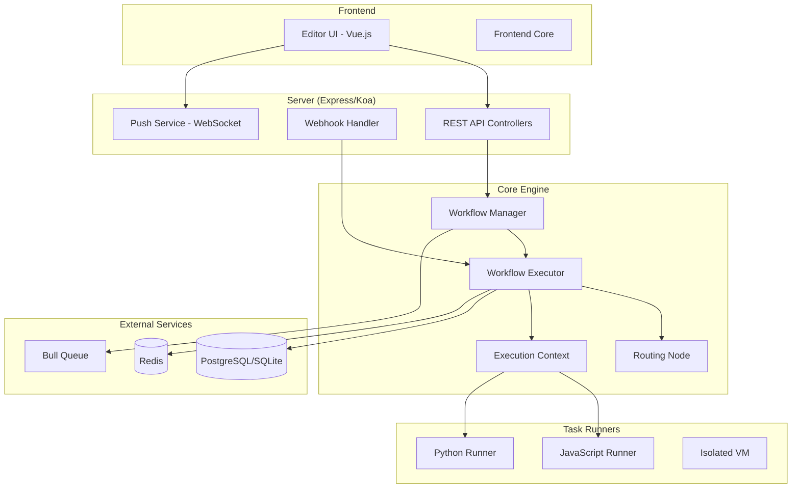
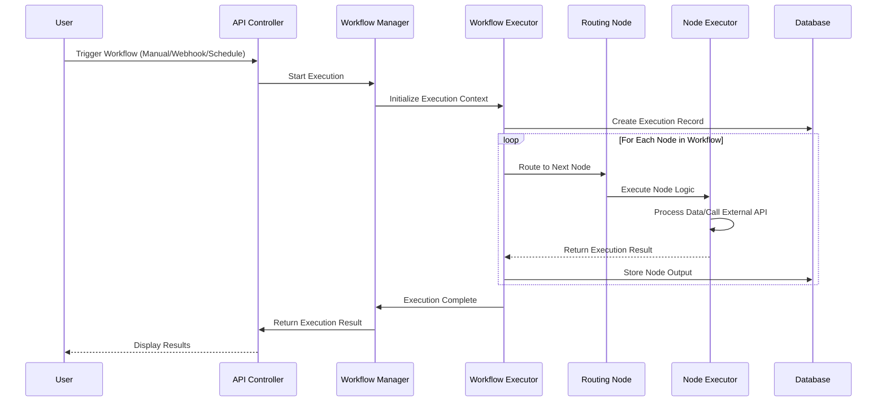
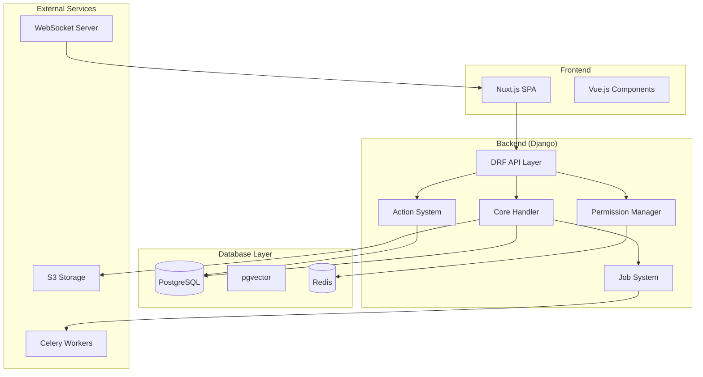
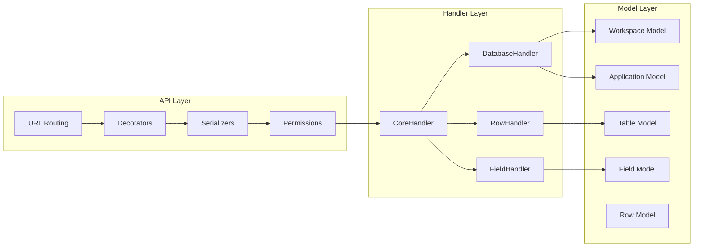
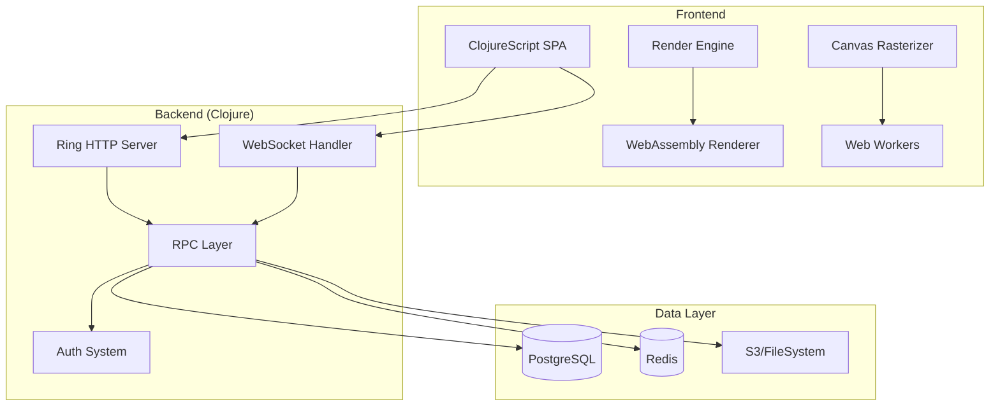
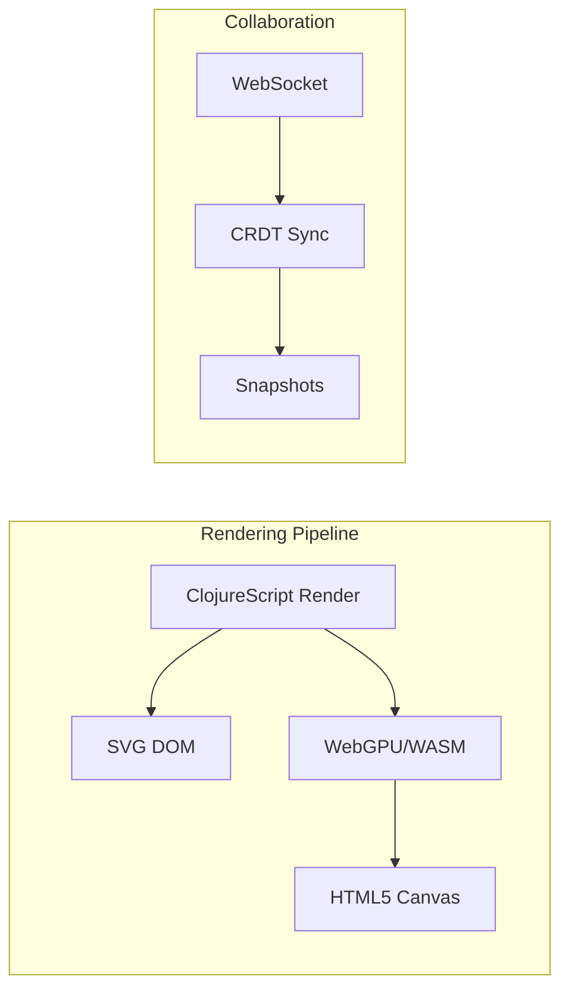
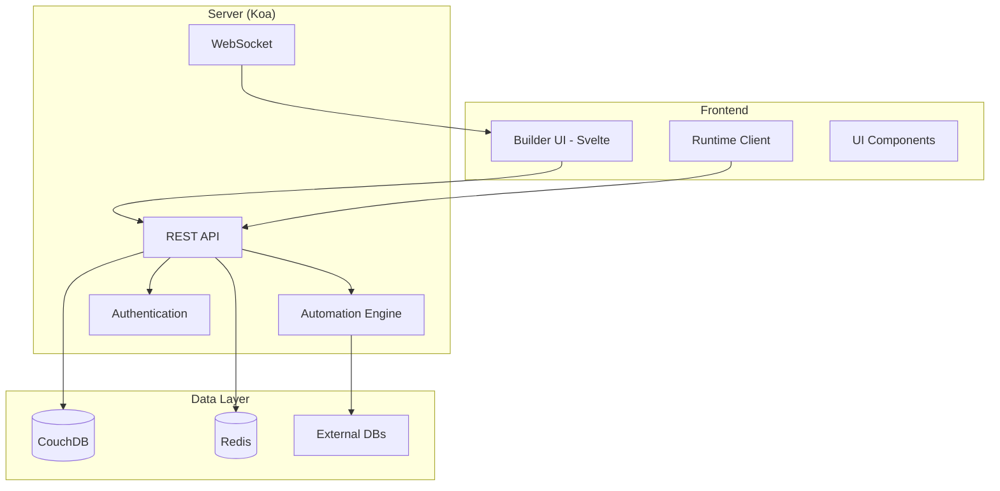
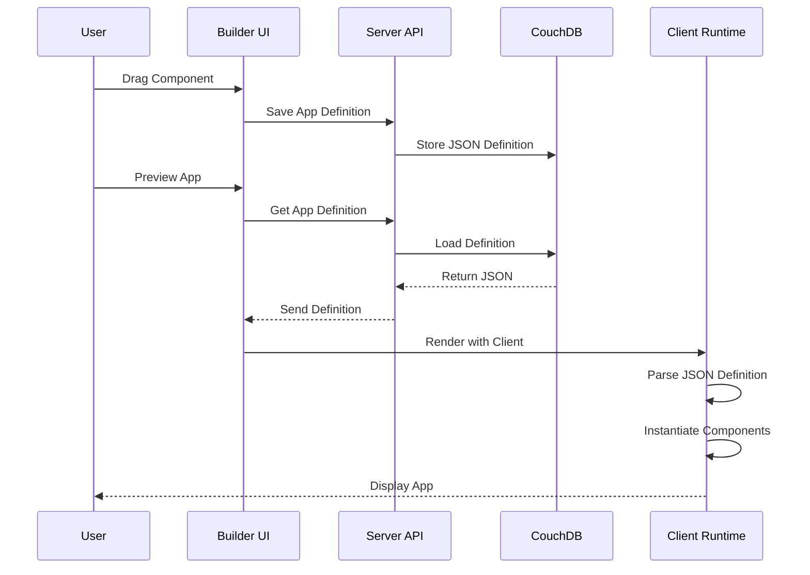
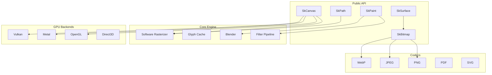
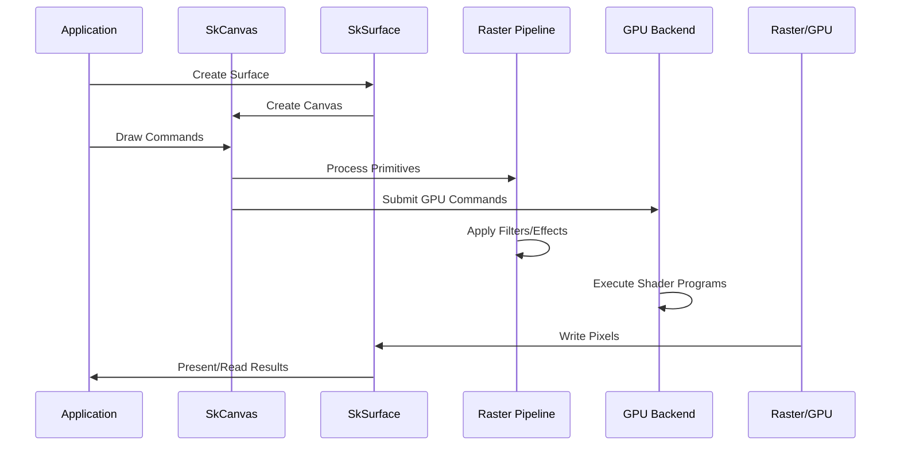

# AppOSS Project Exploration

## Overview

This exploration covers 24+ open-source applications in the `/home/darkvoid/Boxxed/@formulas/src.AppOSS/` directory. These projects span multiple categories including workflow automation, no-code databases, design platforms, low-code development, AI/ML tools, and graphics libraries.

The focus of this deep-dive is on five major projects:
- **n8n** - Workflow automation platform
- **baserow** - No-code database platform
- **Penpot** - Open-source design and prototyping platform
- **Budibase** - Low-code application builder
- **Skia** - Google's 2D graphics library

---

## Related Documents

This exploration is part of a comprehensive documentation set:

| Document | Description |
|----------|-------------|
| [`00-zero-to-apposs.md`](./00-zero-to-apposs.md) | Beginner's guide from zero to understanding AppOSS projects |
| [`exploration.md`](./exploration.md) | This file - main exploration document |
| [`rust-revision.md`](./rust-revision.md) | Complete Rust translation guide |
| [`production-grade.md`](./production-grade.md) | Production readiness and scaling guide |

### Deep Dive Documents

| Document | Description |
|----------|-------------|
| [`deep-dives/graphics-rendering-deep-dive.md`](./deep-dives/graphics-rendering-deep-dive.md) | Vector rendering, GPU pipeline, rasterization |
| [`deep-dives/wasm-web-rendering-deep-dive.md`](./deep-dives/wasm-web-rendering-deep-dive.md) | WASM architecture, JavaScript bindings, CanvasKit |
| [`deep-dives/vector-graphics-algorithms.md`](./deep-dives/vector-graphics-algorithms.md) | Path tessellation, curve rendering, anti-aliasing |

### Examples

| Document | Description |
|----------|-------------|
| [`examples/vector-graphics-examples.md`](./examples/vector-graphics-examples.md) | Practical code examples for vector graphics |

---

## Repository Summary

| Project | Location | Remote | Primary Language |
|---------|----------|--------|------------------|
| n8n | `n8n/` | git@github.com:n8n-io/n8n.git | TypeScript |
| baserow | `baserow/` | git@github.com:baserow/baserow.git | Python/Django |
| penpot | `src.penpot/penpot/` | N/A (submodules) | Clojure/ClojureScript |
| budibase | `budibase/` | git@github.com:Budibase/budibase.git | TypeScript |
| skia | `skia/` | git@github.com:open-pencil/skia.git | C++ |
| automatisch | `automatisch/` | N/A | JavaScript |
| open-webui | `src.open-webui/` | N/A | Python/TypeScript |
| src.bentoml | `src.bentoml/` | N/A | Python |

---

## Table of Contents

1. [n8n - Workflow Automation Platform](#n8n---workflow-automation-platform)
2. [baserow - No-Code Database](#baserow---no-code-database)
3. [Penpot - Design Platform](#penpot---design-platform)
4. [Budibase - Low-Code Platform](#budibase---low-code-platform)
5. [Skia - Graphics Library](#skia---graphics-library)
6. [Other Projects Overview](#other-projects-overview)
7. [Architecture Comparisons](#architecture-comparisons)

---

## n8n - Workflow Automation Platform

### Overview

n8n is a workflow automation platform that combines the flexibility of code with the speed of no-code. With 400+ integrations and native AI capabilities based on LangChain, n8n allows users to build complex automation workflows visually or programmatically.

**Key Features:**
- Node-based visual workflow editor
- 400+ pre-built integrations (nodes)
- AI/LangChain integration for LLM workflows
- Self-hostable with fair-code license
- JavaScript/Python code execution within workflows

### Repository

- **Location:** `/home/darkvoid/Boxxed/@formulas/src.AppOSS/n8n/`
- **Remote:** git@github.com:n8n-io/n8n.git
- **Primary Language:** TypeScript
- **License:** Sustainable Use License (fair-code) / Enterprise License
- **Version:** 2.11.0

### Directory Structure

```
n8n/
├── packages/                          # Monorepo packages
│   ├── cli/                           # Main CLI and server application
│   │   ├── src/
│   │   │   ├── server.ts              # Express-based HTTP server
│   │   │   ├── abstract-server.ts     # Server base class
│   │   │   ├── active-workflow-manager.ts  # Active workflow orchestration
│   │   │   ├── workflow-execute-additional-data.ts
│   │   │   ├── workflow-runner.ts     # Workflow execution engine
│   │   │   ├── controller.registry.ts # API controller registry
│   │   │   ├── controllers/           # REST API controllers
│   │   │   │   ├── workflows.controller.ts
│   │   │   │   ├── executions.controller.ts
│   │   │   │   ├── node-types.controller.ts
│   │   │   │   ├── credentials.controller.ts
│   │   │   │   ├── webhooks.controller.ts
│   │   │   │   └── auth.controller.ts
│   │   │   ├── services/              # Core services
│   │   │   ├── task-runners/          # Isolated code execution
│   │   │   ├── webhooks/              # Webhook handling
│   │   │   ├── executions/            # Execution storage/retrieval
│   │   │   └── collaboration/         # Real-time collaboration
│   │   └── package.json
│   │
│   ├── core/                          # Core execution engine
│   │   ├── src/
│   │   │   ├── execution-engine/
│   │   │   │   ├── workflow-execute.ts    # Main workflow executor (86K lines)
│   │   │   │   ├── active-workflows.ts    # Active workflow tracking
│   │   │   │   ├── routing-node.ts        # Conditional routing logic
│   │   │   │   ├── execution-context.ts   # Node execution context
│   │   │   │   ├── node-execution-context/
│   │   │   │   └── partial-execution-utils/ # Partial re-execution
│   │   │   ├── binary-data/           # Binary data handling
│   │   │   ├── credentials/           # Credential encryption/storage
│   │   │   └── nodes-loader/          # Dynamic node loading
│   │   └── package.json
│   │
│   ├── nodes-base/                    # Base nodes and integrations
│   │   ├── nodes/                     # 400+ integration nodes
│   │   ├── credentials/               # Credential type definitions
│   │   ├── utils/                     # Shared utilities
│   │   └── test/                      # Node tests
│   │
│   ├── @n8n/                          # Shared packages
│   │   ├── workflow-sdk/              # Programmatic workflow builder
│   │   ├── api-types/                 # Shared API type definitions
│   │   ├── backend-common/            # Backend shared utilities
│   │   ├── db/                        # Database abstractions
│   │   ├── config/                    # Configuration management
│   │   ├── constants/                 # Shared constants
│   │   ├── di/                        # Dependency injection
│   │   ├── errors/                    # Error handling
│   │   ├── expression-runtime/        # Expression evaluation
│   │   └── nodes-langchain/           # AI/LangChain nodes
│   │
│   ├── editor-ui/                     # Vue.js frontend editor
│   └── frontend/                      # Frontend components
│
├── package.json                       # Root monorepo config (pnpm + turbo)
├── pnpm-workspace.yaml                # pnpm workspace config
├── turbo.json                         # Turborepo build config
└── scripts/                           # Build and deployment scripts
```

### Architecture

#### High-Level Architecture Diagram



#### Workflow Execution Engine



### Component Breakdown

#### Workflow Executor (`packages/core/src/execution-engine/workflow-execute.ts`)

- **Location:** `n8n/packages/core/src/execution-engine/workflow-execute.ts`
- **Purpose:** Core workflow execution engine that processes nodes in order
- **Key Features:**
  - PCancelable execution for interruptible workflows
  - Partial re-execution support for debugging
  - Cycle detection and handling
  - Pin data support for testing
  - Execution data tracking and pausing

#### Active Workflow Manager (`packages/cli/src/active-workflow-manager.ts`)

- **Location:** `n8n/packages/cli/src/active-workflow-manager.ts`
- **Purpose:** Manages active workflows, triggers, and polling
- **Dependencies:** Workflow repository, trigger registry, queue system
- **Key Features:**
  - Workflow activation/deactivation
  - Trigger registration (webhooks, schedules, polling)
  - Queue-based execution for scaling

#### Node Execution Context (`packages/core/src/execution-engine/execution-context.ts`)

- **Location:** `n8n/packages/core/src/execution-engine/execution-context.ts`
- **Purpose:** Provides isolated context for each node execution
- **Features:**
  - Credential injection
  - Expression evaluation
  - Binary data handling
  - HTTP request helpers
  - Pagination helpers

#### Routing Node (`packages/core/src/execution-engine/routing-node.ts`)

- **Location:** `n8n/packages/core/src/execution-engine/routing-node.ts`
- **Purpose:** Handles conditional logic (If, Switch, Merge nodes)
- **Features:**
  - Expression-based routing
  - Cycle detection
  - Multi-input handling

### Entry Points

#### Main Server (`packages/cli/src/server.ts`)

- **File:** `n8n/packages/cli/src/server.ts`
- **Description:** Express-based HTTP server initialization
- **Flow:**
  1. Initialize Express app with middleware (helmet, cookie-parser, cors)
  2. Register controllers via ControllerRegistry
  3. Setup WebSocket push handler
  4. Initialize collaboration service
  5. Start listening on configured port

#### CLI Entry Point (`packages/cli/bin/n8n`)

- **File:** `n8n/packages/cli/bin/n8n`
- **Description:** Command-line interface entry point
- **Commands:**
  - `n8n start` - Start web server
  - `n8n worker` - Start queue worker
  - `n8n webhook` - Start webhook-only server
  - `n8n execute` - Execute workflow from CLI

### External Dependencies

| Dependency | Purpose |
|------------|---------|
| express | HTTP server framework |
| pnpm | Package management (monorepo) |
| turbo | Build system orchestration |
| bull | Redis-based job queue |
| ioredis | Redis client |
| typeorm | ORM for database access |
| postgres | Primary database |
| sqlite | Alternative database |
| jsonschema | Workflow validation |
| axios | HTTP client |
| vm2 | Isolated JavaScript execution |
| @n8n/di | Dependency injection |

### Configuration

**Key Environment Variables:**
- `N8N_HOST` - Server hostname
- `N8N_PORT` - Server port (default: 5678)
- `N8N_PROTOCOL` - http/https
- `DB_TYPE` - postgresdb/sqlite/mysql
- `DB_POSTGRESDB_HOST` - PostgreSQL host
- `DB_SQLITE_PATH` - SQLite file path
- `N8N_ENCRYPTION_KEY` - Credential encryption key
- `N8N_PUSH_BACKEND` - WebSocket backend mode

**Configuration File:** `packages/@n8n/config/`
- Uses decorators for type-safe config
- Supports environment variable overrides
- Modular configuration sections

### Testing

- **Framework:** Jest + Vitest
- **Test Types:**
  - Unit tests for nodes and utilities
  - Integration tests for workflows
  - E2E tests with Playwright (`packages/@n8n/playwright/`)
  - Container tests for Docker images

**Running Tests:**
```bash
pnpm test                       # Run all tests
pnpm test:ci:backend            # Backend tests in CI
pnpm test:ci:frontend          # Frontend tests in CI
pnpm test:with:docker          # E2E container tests
```

### Key Insights

1. **Monorepo Architecture:** Uses pnpm workspaces with Turborepo for efficient builds across 50+ packages
2. **Cancelable Executions:** Uses PCancelable for interruptible workflow runs - critical for long-running automations
3. **Isolated Code Execution:** Task runners provide sandboxed JavaScript/Python execution for security
4. **Partial Re-execution:** Smart execution tracking allows re-running from specific nodes
5. **Bidirectional Communication:** WebSocket push enables real-time UI updates during execution
6. **Credential Encryption:** All credentials are encrypted at rest using AES-256

### Open Questions

1. How does the scaling mode work with multiple main/worker processes?
2. What is the exact mechanism for workflow versioning and history?
3. How are circular dependencies in workflows detected and prevented?

---

## baserow - No-Code Database

### Overview

baserow is an open-source, no-code database platform that combines the simplicity of spreadsheets with the power of relational databases. It provides Airtable-like functionality with full data ownership and API-first architecture.

**Key Features:**
- Spreadsheet-database hybrid interface
- No-code application builder
- REST API for all operations
- Automations and workflows
- AI assistant (Kuma) for natural language database creation
- GDPR, HIPAA, SOC 2 Type II compliant
- Self-hostable with MIT license (core features)

### Repository

- **Location:** `/home/darkvoid/Boxxed/@formulas/src.AppOSS/baserow/`
- **Remote:** git@github.com:baserow/baserow.git
- **Primary Language:** Python (Django), JavaScript (Vue.js/Nuxt)
- **License:** MIT (core) / Commercial (premium features)
- **Version:** 2.1.3

### Directory Structure

```
baserow/
├── backend/                           # Django backend application
│   ├── src/
│   │   ├── baserow/                   # Main application
│   │   │   ├── core/                  # Core functionality
│   │   │   │   ├── models.py          # Core models (Workspace, Application, etc.)
│   │   │   │   ├── handler.py         # Core business logic (41K lines)
│   │   │   │   ├── actions.py         # Action system (41K lines)
│   │   │   │   ├── registries.py      # Plugin registries (49K lines)
│   │   │   │   ├── permission_manager.py
│   │   │   │   ├── action/            # Action system
│   │   │   │   │   ├── models.py
│   │   │   │   │   ├── handler.py
│   │   │   │   │   └── registries.py
│   │   │   │   ├── admin/             # Admin dashboard
│   │   │   │   ├── auth_provider/     # Authentication providers
│   │   │   │   ├── app_auth_providers/ # App-level auth
│   │   │   │   ├── generative_ai/     # AI features
│   │   │   │   ├── integrations/      # External integrations
│   │   │   │   ├── jobs/              # Background job system
│   │   │   │   ├── mcp/               # Model Context Protocol
│   │   │   │   ├── notifications/     # Notification system
│   │   │   │   ├── search/            # Search functionality
│   │   │   │   ├── services/          # External services
│   │   │   │   ├── snapshots/         # Snapshot system
│   │   │   │   ├── trash/             # Soft delete/trash
│   │   │   │   ├── two_factor_auth/   # 2FA
│   │   │   │   ├── user/              # User management
│   │   │   │   ├── user_files/        # File storage
│   │   │   │   ├── user_sources/      # Data sources
│   │   │   │   ├── workflow_actions/  # Automation workflows
│   │   │   │   └── workspaces/        # Workspace management
│   │   │   │
│   │   │   ├── api/                   # REST API layer
│   │   │   │   ├── urls.py            # URL routing
│   │   │   │   ├── authentication.py  # Auth backends
│   │   │   │   ├── decorators.py      # API decorators
│   │   │   │   ├── errors.py          # Error handling
│   │   │   │   ├── exceptions.py      # Custom exceptions
│   │   │   │   ├── extensions.py      # API extensions
│   │   │   │   ├── mixins.py          # API mixins
│   │   │   │   ├── pagination.py      # Pagination
│   │   │   │   ├── polymorphic.py     # Polymorphic serializers
│   │   │   │   ├── serializers.py     # DRF serializers
│   │   │   │   ├── sessions.py        # Session management
│   │   │   │   ├── utils.py           # API utilities
│   │   │   │   ├── actions/           # Action endpoints
│   │   │   │   ├── applications/      # Application endpoints
│   │   │   │   ├── auth_provider/     # Auth endpoints
│   │   │   │   ├── generative_ai/     # AI endpoints
│   │   │   │   ├── health/            # Health checks
│   │   │   │   ├── import_export/     # Import/export
│   │   │   │   ├── integrations/      # Integration endpoints
│   │   │   │   ├── jobs/              # Job endpoints
│   │   │   │   ├── mcp/               # MCP endpoints
│   │   │   │   ├── notifications/     # Notification endpoints
│   │   │   │   ├── search/            # Search endpoints
│   │   │   │   ├── services/          # Service endpoints
│   │   │   │   ├── settings/          # Settings endpoints
│   │   │   │   ├── snapshots/         # Snapshot endpoints
│   │   │   │   ├── templates/         # Template endpoints
│   │   │   │   ├── trash/             # Trash endpoints
│   │   │   │   ├── user/              # User endpoints
│   │   │   │   ├── user_files/        # File endpoints
│   │   │   │   ├── user_sources/      # Source endpoints
│   │   │   │   ├── workspaces/        # Workspace endpoints
│   │   │   │   └── workflow_actions/  # Workflow endpoints
│   │   │   │
│   │   │   ├── contrib/               # Contrib modules
│   │   │   │   └── database/          # Database module
│   │   │   │       ├── models.py      # Database models
│   │   │   │       ├── rows/          # Row operations
│   │   │   │       ├── fields/        # Field types
│   │   │   │       ├── tables/        # Table management
│   │   │   │       └── views/         # View types (Grid, Kanban, etc.)
│   │   │   │
│   │   │   ├── config/                # Django settings
│   │   │   ├── migrations/            # Database migrations
│   │   │   └── locale/                # Translations
│   │   │
│   │   └── advocate/                  # Internal HTTP client
│   │
│   ├── tests/                         # Test suite
│   ├── templates/                     # Email templates
│   ├── manage.py                      # Django management
│   └── justfile                       # Just command definitions
│
├── web-frontend/                      # Nuxt.js frontend
│   ├── modules/                       # Nuxt modules
│   ├── stories/                       # Storybook stories
│   ├── locales/                       # Translations
│   ├── config/                        # Configuration
│   ├── Dockerfile                     # Frontend container
│   ├── nuxt.config.ts                 # Nuxt configuration
│   ├── package.json
│   └── yarn.lock
│
├── integrations/                      # External integrations
├── embeds/                            # Embeddable components
├── docker-compose.yml                 # Development docker
├── docker-compose.dev.yml             # Development config
└── docs/                              # Documentation
```

### Architecture

#### High-Level Architecture



#### Database and API Layer



### Component Breakdown

#### Core Handler (`backend/src/baserow/core/handler.py`)

- **Location:** `baserow/backend/src/baserow/core/handler.py`
- **Purpose:** Central business logic orchestrator
- **Size:** 41,119 lines
- **Key Methods:**
  - `get_settings()` - Application settings
  - `update_settings()` - Admin settings management
  - `create_workspace()` - Workspace creation
  - `update_workspace()` - Workspace updates
  - `delete_workspace()` - Workspace deletion
  - Permission checking and validation

#### Action System (`backend/src/baserow/core/actions.py`)

- **Location:** `baserow/backend/src/baserow/core/actions.py`
- **Purpose:** Undo/redo action tracking system
- **Features:**
  - Action history for undo/redo
  - Batch action grouping
  - WebSocket notifications for action events
  - Integration with all data modifications

#### Permission Manager (`backend/src/baserow/core/permission_manager.py`)

- **Location:** `baserow/backend/src/baserow/core/permission_manager.py`
- **Purpose:** Fine-grained access control
- **Features:**
  - Role-based permissions (Admin, Member, Editor, Viewer)
  - Object-level permissions
  - Permission inheritance
  - Custom permission scopes

#### Job System (`backend/src/baserow/core/jobs/`)

- **Location:** `baserow/backend/src/baserow/core/jobs/`
- **Purpose:** Background job processing
- **Features:**
  - Celery-based async execution
  - Job progress tracking
  - WebSocket updates for job status
  - Job types: Import, Export, Duplicate, Sync

### Entry Points

#### Django Application (`backend/src/baserow/manage.py`)

- **File:** `baserow/backend/src/baserow/manage.py`
- **Description:** Django WSGI application entry
- **Flow:**
  1. Load Django settings from `baserow.config.settings`
  2. Initialize Django application
  3. Start WSGI server (Gunicorn in production)
  4. Handle HTTP requests through URL routing

#### Celery Worker (`backend/src/baserow/config/celery.py`)

- **File:** `baserow/backend/src/baserow/config/celery.py`
- **Description:** Background job processor
- **Features:**
  - Redis message broker
  - Task retry and error handling
  - Scheduled tasks (beat)

### External Dependencies

| Dependency | Version | Purpose |
|------------|---------|---------|
| Django | 4.x | Web framework |
| Django REST Framework | 3.x | API framework |
| Celery | 5.x | Task queue |
| Redis | - | Cache and message broker |
| PostgreSQL | 14+ | Primary database |
| pgvector | - | Vector embeddings for AI |
| Nuxt.js | 3.x | Frontend framework |
| Vue.js | 3.x | UI framework |
| SQLAlchemy | - | Async database operations |
| Pydantic | - | Data validation |

### Configuration

**Key Environment Variables:**
- `DATABASE_URL` - PostgreSQL connection string
- `REDIS_URL` - Redis connection string
- `SECRET_KEY` - Django secret key
- `DEBUG` - Debug mode
- `ALLOWED_HOSTS` - Allowed hostnames
- `AWS_STORAGE_BUCKET_NAME` - S3 bucket for files
- `CELERY_BROKER_URL` - Celery broker URL

### Testing

- **Framework:** pytest
- **Test Structure:**
  - `backend/tests/baserow/` - Core tests
  - `backend/tests/airtable_responses/` - Integration tests
  - E2E tests with Playwright
- **Running Tests:**
  ```bash
  just test                          # Run all tests
  just dc-dev build --parallel       # Build dev environment
  pytest backend/tests/ -v           # Run pytest
  ```

### Key Insights

1. **Monolithic Django Architecture:** Single Django app with modular structure via `contrib/` pattern
2. **Action-Based Architecture:** All mutations go through action system for undo/redo support
3. **Polymorphic Models:** Applications, Fields, Views use Django polymorphic models for extensibility
4. **Real-time Updates:** WebSocket integration for live collaboration and job progress
5. **Plugin System:** Registry pattern allows adding new field types, actions, and integrations
6. **AI Integration:** pgvector for embedding-based AI features in Kuma assistant

### Open Questions

1. How does the snapshot system work for version history?
2. What is the mechanism for formula field evaluation?
3. How are concurrent edits handled in collaborative mode?

---

## Penpot - Design Platform

### Overview

Penpot is the first open-source design and prototyping platform built for design-code collaboration. It uses open standards (SVG, CSS, HTML) and provides Figma-like capabilities with a focus on developer handoff.

**Key Features:**
- Vector design tools
- Interactive prototyping
- Design tokens system
- Components and variants
- CSS Grid Layout support
- Real-time collaboration
- Plugin system
- Self-hostable (MPL-2.0 license)

### Repository

- **Location:** `/home/darkvoid/Boxxed/@formulas/src.AppOSS/src.penpot/penpot/`
- **Remote:** Multiple submodules (penpot, penpot-files, etc.)
- **Primary Language:** Clojure (backend), ClojureScript (frontend)
- **License:** MPL-2.0
- **Recent:** Version 2.0 major release with new component system

### Directory Structure

```
src.penpot/penpot/
├── backend/                         # Clojure backend
│   ├── src/
│   │   └── app/
│   │       ├── main.clj             # Application entry point
│   │       ├── config.clj           # Configuration
│   │       ├── db.clj               # Database layer (PostgreSQL)
│   │       ├── http.clj             # HTTP server (Ring/Compojure)
│   │       ├── rpc/                 # RPC API layer
│   │       │   ├── climit.clj       # Concurrency limiting
│   │       │   ├── rlimit.clj       # Rate limiting
│   │       │   ├── doc.clj          # RPC documentation
│   │       │   ├── permissions.clj  # Permission system
│   │       │   └── commands/        # RPC commands
│   │       │       ├── access_token.clj
│   │       │       ├── auth.clj
│   │       │       ├── binfile.clj  # Binary file storage
│   │       │       ├── comments.clj
│   │       │       ├── files.clj
│   │       │       ├── files_create.clj
│   │       │       ├── files_update.clj
│   │       │       ├── files_share.clj
│   │       │       ├── files_snapshot.clj
│   │       │       ├── media.clj
│   │       │       ├── profile.clj
│   │       │       ├── projects.clj
│   │       │       ├── teams.clj
│   │       │       └── websocket.clj
│   │       ├── auth/                # Authentication
│   │       │   ├── ldap.clj
│   │       │   └── oidc.clj
│   │       ├── email/               # Email service
│   │       ├── worker/              # Background workers
│   │       ├── storage/             # File storage
│   │       │   ├── fs.clj           # Filesystem storage
│   │       │   └── s3.clj           # S3 storage
│   │       ├── features/            # Feature modules
│   │       │   ├── fdata.clj        # File data
│   │       │   ├── file_snapshots.clj
│   │       │   └── logical_deletion.clj
│   │       └── migrations/          # Database migrations
│   │
│   ├── resources/                   # Resources and templates
│   ├── scripts/                     # Build scripts
│   └── build.clj                    # Build configuration
│
├── frontend/                        # ClojureScript frontend
│   ├── src/
│   │   └── app/
│   │       ├── main.cljs            # Frontend entry point
│   │       ├── config.cljs          # Configuration
│   │       ├── render.cljs          # SVG rendering engine
│   │       ├── rasterizer.cljs      # Canvas rasterization
│   │       ├── render_wasm.cljs     # WebAssembly rendering
│   │       ├── worker.cljs          # Web workers
│   │       ├── plugins/             # Plugin system
│   │       └── util/                # Utilities
│   │
│   ├── deps.edn                     # Clojure deps
│   ├── package.json
│   ├── shadow-cljs.edn              # Shadow-cljs config
│   └── playwright/                  # E2E tests
│
├── common/                          # Shared code
│   └── src/app/                     # Common utilities
│
├── docker/                          # Docker configurations
│   ├── devenv/                      # Development environment
│   └── images/                      # Production images
│
├── docs/                            # Documentation site
├── render-wasm/                     # WebAssembly renderer
└── libraries/                       # Design libraries
```

### Architecture

#### High-Level Architecture



#### Rendering and Collaboration System



### Component Breakdown

#### RPC Layer (`backend/src/app/rpc/`)

- **Location:** `src.penpot/penpot/backend/src/app/rpc/`
- **Purpose:** Remote Procedure Call API layer
- **Features:**
  - Concurrency limiting (climit)
  - Rate limiting (rlimit)
  - Permission checking
  - WebSocket transport
  - Auto-generated documentation

#### Render Engine (`frontend/src/app/render.cljs`)

- **Location:** `src.penpot/penpot/frontend/src/app/render.cljs`
- **Purpose:** SVG and Canvas rendering engine
- **Features:**
  - SVG-based vector rendering
  - CSS Grid Layout support
  - Component instantiation
  - Design token resolution

#### File Data System (`backend/src/app/features/fdata.clj`)

- **Location:** `src.penpot/penpot/backend/src/app/features/fdata.clj`
- **Purpose:** File data storage and retrieval
- **Features:**
  - Snapshot-based versioning
  - Binary file storage
  - Logical deletion support

### Entry Points

#### Backend Main (`backend/src/app/main.clj`)

- **File:** `src.penpot/penpot/backend/src/app/main.clj`
- **Description:** Clojure application entry point using Integrant
- **Flow:**
  1. Load configuration from `config.clj`
  2. Initialize Integrant components
  3. Start HTTP server (Jetty/Immutant)
  4. Initialize database connection
  5. Start WebSocket handler
  6. Begin worker processes

#### Frontend Main (`frontend/src/app/main.cljs`)

- **File:** `src.penpot/penpot/frontend/src/app/main.cljs`
- **Description:** ClojureScript SPA initialization
- **Flow:**
  1. Initialize application state
  2. Setup routing (bidi/prism)
  3. Mount React components (Reagent)
  4. Initialize WebSocket connection
  5. Start render loop

### External Dependencies

| Dependency | Purpose |
|------------|---------|
| Clojure | Backend language |
| ClojureScript | Frontend language |
| Ring | HTTP server abstraction |
| Integrant | Component lifecycle |
| PostgreSQL | Primary database |
| Redis | Cache and pub/sub |
| Shadow-cljs | ClojureScript build tool |
| Reagent | React wrapper |
| Skia | Graphics rendering (via WASM) |

### Configuration

**Key Environment Variables:**
- `PENPOT_DATABASE_URI` - PostgreSQL connection
- `PENPOT_REDIS_URI` - Redis connection
- `PENPOT_DEFAULT_STORAGE` - Storage backend (fs/s3)
- `PENPOT_HTTP_SERVER_PORT` - Server port (default: 6060)
- `PENPOT_REGISTRATION_ENABLED` - User registration
- `PENPOT_LDAP_*` - LDAP configuration
- `PENPOT_OIDC_*` - OIDC configuration

### Testing

- **Framework:** Clojure test + Playwright
- **E2E:** Playwright tests in `frontend/playwright/`
- **Running Tests:**
  ```bash
  just test                           # Run backend tests
  just frontend-test                  # Run frontend tests
  just e2e-test                       # Run Playwright tests
  ```

### Key Insights

1. **Functional Architecture:** Pure functional programming with immutable data throughout
2. **RPC over REST:** Custom RPC layer instead of REST for better real-time support
3. **WebAssembly Rendering:** Skia via WebAssembly for high-performance rendering
4. **Snapshot-based Versioning:** File snapshots for version history and collaboration
5. **Open Standards:** SVG, CSS, HTML output for developer handoff
6. **Integrant Pattern:** Component-based architecture with explicit dependencies

### Open Questions

1. How does the CRDT system work for real-time collaboration?
2. What is the mechanism for plugin sandboxing?
3. How are design tokens synchronized between frontend and backend?

---

## Budibase - Low-Code Platform

### Overview

Budibase is an open-source low-code platform for building internal tools, forms, portals, and approval apps. It allows developers to build applications quickly with pre-made components while maintaining extensibility through code.

**Key Features:**
- Drag-and-drop app builder
- Data source integrations (SQL, NoSQL, REST, CSV)
- Pre-built UI components
- Automation workflows
- Self-hostable (GPL v3)
- Responsive single-page applications

### Repository

- **Location:** `/home/darkvoid/Boxxed/@formulas/src.AppOSS/budibase/`
- **Remote:** git@github.com:Budibase/budibase.git
- **Primary Language:** TypeScript, Svelte
- **License:** GPL v3 (app), MPL (client library)

### Directory Structure

```
budibase/
├── packages/                        # Monorepo packages
│   ├── server/                      # Koa-based backend server
│   │   ├── src/
│   │   │   ├── index.ts             # Server entry point
│   │   │   ├── app.ts               # Koa application setup
│   │   │   ├── koa.ts               # Koa configuration
│   │   │   ├── environment.ts       # Environment config
│   │   │   ├── api/                 # REST API routes
│   │   │   ├── automations/         # Automation engine
│   │   │   ├── db/                  # Database layer (CouchDB)
│   │   │   ├── integrations/        # External integrations
│   │   │   ├── middleware/          # Koa middleware
│   │   │   ├── websockets/          # WebSocket handlers
│   │   │   └── services/            # Business logic services
│   │   └── package.json
│   │
│   ├── backend-core/                # Shared backend utilities
│   │   ├── src/
│   │   │   ├── environment.ts
│   │   │   ├── helpers.ts
│   │   │   └── installation.ts
│   │   └── package.json
│   │
│   ├── builder/                     # Svelte app builder UI
│   │   ├── src/
│   │   │   ├── main.js              # Builder entry
│   │   │   ├── App.svelte           # Main component
│   │   │   ├── api.ts               # API client
│   │   │   ├── dataBinding.js       # Data binding logic
│   │   │   ├── components/          # Builder components
│   │   │   ├── helpers/             # UI helpers
│   │   │   ├── pages/               # Builder pages
│   │   │   ├── stores/              # Svelte stores
│   │   │   └── templates/           # App templates
│   │   └── package.json
│   │
│   ├── client/                      # Runtime client library
│   │   ├── src/
│   │   │   ├── index.ts             # Client entry
│   │   │   └── components/          # UI components
│   │   └── package.json
│   │
│   ├── frontend-core/               # Shared frontend utilities
│   └── pro/                         # Premium features
│
├── charts/                          # Helm charts
├── hosting/                         # Hosting configurations
│   ├── couchdb/                     # CouchDB setup
│   ├── proxy/                       # Reverse proxy
│   ├── scripts/                     # Deployment scripts
│   └── single/                      # Single server setup
├── docs/                            # Documentation
└── packages/sdk/                    # SDK for extensions
```

### Architecture

#### High-Level Architecture



#### App Building Pipeline



### Component Breakdown

#### Server (`packages/server/src/`)

- **Location:** `budibase/packages/server/src/`
- **Purpose:** Koa-based API server
- **Features:**
  - RESTful API for all operations
  - CouchDB database abstraction
  - Automation execution engine
  - WebSocket real-time updates
  - External data source connectors

#### Builder (`packages/builder/src/`)

- **Location:** `budibase/packages/builder/src/`
- **Purpose:** Svelte-based visual app builder
- **Features:**
  - Drag-and-drop interface
  - Component property editor
  - Data binding configuration
  - App preview and testing

#### Client (`packages/client/src/`)

- **Location:** `budibase/packages/client/src/`
- **Purpose:** Runtime client for rendered apps
- **Features:**
  - JSON definition parser
  - Dynamic component instantiation
  - Data fetching and binding
  - Event handling

### Entry Points

#### Server Entry (`packages/server/src/index.ts`)

- **File:** `budibase/packages/server/src/index.ts`
- **Description:** Koa server initialization
- **Flow:**
  1. Load environment configuration
  2. Initialize Koa application
  3. Register middleware (cors, body-parser, auth)
  4. Mount API routes
  5. Setup WebSocket server
  6. Start HTTP listener

### External Dependencies

| Dependency | Purpose |
|------------|---------|
| Koa | Web framework |
| CouchDB | Primary database |
| Redis | Cache and sessions |
| Svelte | Frontend framework |
| Lerna | Monorepo management |
| Sequelize | SQL database ORM |
| mongoose | MongoDB ODM |

### Configuration

**Key Environment Variables:**
- `PORT` - Server port
- `COUCH_DB_URL` - CouchDB connection
- `REDIS_URL` - Redis connection
- `JWT_SECRET` - JWT signing secret
- `APP_PORT` - Application port
- `DEPLOYMENT_ENVIRONMENT` - cloud/self-hosted

### Key Insights

1. **JSON-Driven UI:** Apps are JSON definitions interpreted at runtime
2. **CouchDB-Centric:** All data stored in CouchDB for flexibility
3. **Component Architecture:** Reusable components with configurable properties
4. **Data Binding:** Automatic data binding between UI and data sources
5. **Monorepo Structure:** Lerna-managed monorepo with shared packages

---

## Skia - Graphics Library

### Overview

Skia is Google's open-source 2D graphics library, providing comprehensive APIs for drawing text, geometries, and images. It powers Chromium, Flutter, Android, and many other projects.

**Key Features:**
- Cross-platform (Windows, macOS, Linux, Android, iOS, Web)
- GPU-accelerated rendering (OpenGL, Vulkan, Metal, Direct3D)
- PDF, SVG, WebP encoding/decoding
- Text shaping and font rendering
- Path operations and effects
- Image filtering and manipulation

### Repository

- **Location:** `/home/darkvoid/Boxxed/@formulas/src.AppOSS/skia/`
- **Remote:** git@github.com:open-pencil/skia.git
- **Primary Language:** C++
- **License:** BSD-style
- **Build System:** Bazel, GN

### Directory Structure

```
skia/
├── src/                           # Core source code
│   ├── core/                      # Core graphics engine (100+ files)
│   │   ├── SkCanvas.cpp           # Main drawing surface
│   │   ├── SkBitmap.cpp           # Bitmap handling
│   │   ├── SkPath.cpp             # Path operations
│   │   ├── SkPaint.cpp            # Paint/stroke styling
│   │   ├── SkImageFilter*.cpp     # Image filters
│   │   ├── SkMaskFilter*.cpp      # Mask filters
│   │   ├── SkColorFilter*.cpp     # Color filters
│   │   ├── SkShader*.cpp          # Shaders
│   │   ├── SkRuntimeEffect*.cpp   # GPU shaders
│   │   ├── SkRasterPipeline*.cpp  # Software rasterizer
│   │   ├── SkBlur*.cpp            # Blur operations
│   │   ├── SkTextBlob*.cpp        # Text rendering
│   │   ├── SkFont*.cpp            # Font handling
│   │   ├── SkTypeface*.cpp        # Typeface management
│   │   ├── SkPicture*.cpp         # Recording/drawing
│   │   ├── SkSurface*.cpp         # Surface abstraction
│   │   └── ... (200+ source files)
│   │
│   ├── gpu/                       # GPU backend implementations
│   │   ├── GrContext.cpp          # GPU context
│   │   ├── GrSurface*.cpp         # GPU surfaces
│   │   ├── vulkan/                # Vulkan backend
│   │   ├── metal/                 # Metal backend
│   │   ├── gl/                    # OpenGL backend
│   │   └── dali/                  # Direct3D backend
│   │
│   ├── text/                      # Text shaping
│   ├── pdf/                       # PDF generation
│   ├── svg/                       # SVG parsing/generation
│   ├── codec/                     # Image codecs
│   │   ├── webp/                  # WebP support
│   │   ├── jpeg/                  # JPEG support
│   │   └── png/                   # PNG support
│   │
│   ├── effects/                   # Visual effects
│   ├── image/                     # Image handling
│   ├── pathops/                   # Path operations
│   ├── ports/                     # Platform-specific implementations
│   ├── utils/                     # Utilities
│   └── opts/                      # Optimized routines (SIMD)
│
├── include/                       # Public headers
│   ├── core/                      # Core API
│   ├── gpu/                       # GPU API
│   ├── text/                      # Text API
│   └── utils/                     # Utility API
│
├── tests/                         # Test suite
├── dm/                            # Device-independent testing
├── gm/                            # Graphical tests ("good morning")
├── tools/                         # Build and test tools
├── bazel/                         # Bazel build configuration
├── gn/                            # GN build files
└── example/                       # Example code
```

### Architecture

#### High-Level Architecture



#### Rendering Pipeline



### Component Breakdown

#### SkCanvas (`src/core/SkCanvas.cpp`)

- **Location:** `skia/src/core/SkCanvas.cpp`
- **Purpose:** Main drawing surface abstraction
- **Features:**
  - Draw primitives (lines, rects, circles, paths)
  - Draw text (with fonts and shaping)
  - Draw images and bitmaps
  - Transform stack (translate, scale, rotate)
  - Clip stack
  - Layer management (save/restore)

#### SkRasterPipeline (`src/core/SkRasterPipeline*.cpp`)

- **Location:** `skia/src/core/SkRasterPipeline*.cpp`
- **Purpose:** Software rendering pipeline
- **Features:**
  - SIMD-optimized routines (SSSE3, AVX, LASX)
  - Programmable pipeline stages
  - Color space transformations
  - Blending modes

#### GPU Context (`src/gpu/GrContext.cpp`)

- **Location:** `skia/src/gpu/GrContext.cpp`
- **Purpose:** GPU context management
- **Features:**
  - Resource caching
  - Shader compilation
  - Draw command batching
  - Sync and flush

### External Dependencies

| Dependency | Purpose |
|------------|---------|
| freetype | Font rasterization |
| harfbuzz | Text shaping |
| libpng | PNG encoding/decoding |
| libjpeg | JPEG encoding/decoding |
| libwebp | WebP encoding/decoding |
| vulkan-headers | Vulkan API |
| spirv-cross | SPIR-V shader translation |
| wuffs | Safe image decoding |

### Build System

- **Primary:** Bazel (MODULE.bazel)
- **Secondary:** GN (BUILD.gn)
- **Platform-specific:** GYP (deprecated), CMake (limited)

**Building:**
```bash
bazel build //:skia          # Build library
bazel test //:tests          # Run tests
bazel run //:dm              # Run device tests
```

### Key Insights

1. **Backend Agnostic:** Same API works across software and all GPU backends
2. **SIMD Optimization:** Hand-written SIMD for common operations
3. **Record-and-Replay:** SkPicture allows recording and replaying draw commands
4. **Shader Compilation:** Runtime shader compilation via SkSL
5. **Font Integration:** Deep integration with FreeType and HarfBuzz
6. **Safe Defaults:** Extensive use of SkASSERT and bounds checking

### Open Questions

1. How does the Vulkan memory management work?
2. What is the exact mechanism for GPU resource caching?
3. How are complex paths tessellated for GPU rendering?

---

## Other Projects Overview

### AI/ML Projects

| Project | Description | Language |
|---------|-------------|----------|
| src.open-webui | Web UI for LLM interfaces | Python/TS |
| src.bentoml | ML model serving platform | Python |
| src.OpenUI | Open-source UI generation | TypeScript |
| src.BrowserAI | Browser-based AI | JavaScript |
| src.Evals | AI evaluation tools | Python |

### Automation & Workflow

| Project | Description | Language |
|---------|-------------|----------|
| automatisch | Zapier alternative | JavaScript |

### Design & Creative

| Project | Description | Language |
|---------|-------------|----------|
| open-pencil | Drawing/illustration | TypeScript |
| opcode | Music/audio production | JavaScript |
| varnam-editor | Indian language editor | JavaScript |
| wowfe | Web design tool | TypeScript |

### Infrastructure

| Project | Description | Language |
|---------|-------------|----------|
| canvaskit-webgpu | WebGPU bindings for Skia | TypeScript |
| layrr | Layered application runtime | Java |
| slate | Rich text editor framework | JavaScript |

---

## Architecture Comparisons

### Workflow Automation

| Feature | n8n | automatisch | Budibase |
|---------|-----|-------------|----------|
| Language | TypeScript | JavaScript | TypeScript |
| Execution Model | Node-based graph | Event-driven | Action-based |
| Backend | Express | NestJS | Koa |
| Database | PostgreSQL/SQLite | PostgreSQL | CouchDB |
| Code Execution | Isolated VM | Node.js | Isolated VM |
| AI Integration | LangChain native | Limited | Via integrations |

### No-Code/Low-Code Databases

| Feature | baserow | Budibase |
|---------|---------|----------|
| Primary Use | Database + Apps | App Builder |
| Backend | Django (Python) | Koa (TypeScript) |
| Database | PostgreSQL | CouchDB |
| Frontend | Nuxt.js (Vue) | Svelte |
| Data Model | Relational tables | Document-based |
| API | REST + WebSocket | REST |

### Design Platforms

| Feature | Penpot | open-pencil |
|---------|--------|-------------|
| Language | Clojure(Script) | TypeScript |
| Rendering | SVG + WASM (Skia) | Canvas/SVG |
| Collaboration | Real-time (WebSocket) | Limited |
| Output | SVG/CSS/HTML | PNG/SVG |
| License | MPL-2.0 | MIT |

### Graphics Libraries

| Feature | Skia | canvaskit-webgpu |
|---------|------|------------------|
| Language | C++ | TypeScript |
| Backend | Multiple (GPU/CPU) | WebGPU only |
| Platform | Cross-platform | Web only |
| Use Case | General 2D | Web graphics |

---

## Key Takeaways for Engineers

1. **Monorepo Patterns:**
   - n8n and Budibase use pnpm/Lerna workspaces
   - Shared packages for common types and utilities
   - Turborepo/Lerna for orchestrated builds

2. **Execution Isolation:**
   - n8n: Task runners with isolated VM
   - Budibase: Isolated VM for user code
   - Critical for security in multi-tenant environments

3. **Real-time Collaboration:**
   - Penpot: WebSocket + snapshots
   - n8n: WebSocket push for execution updates
   - baserow: WebSocket for job progress

4. **Data Modeling:**
   - baserow: Polymorphic Django models for extensibility
   - Budibase: Document-based (CouchDB) for flexibility
   - n8n: Relational with JSON fields for workflow definitions

5. **Rendering Architectures:**
   - Penpot: ClojureScript + WASM for performance
   - Skia: C++ with GPU abstraction layer
   - Multiple backends for different platforms

6. **API Design:**
   - REST for CRUD operations (all projects)
   - RPC for real-time (Penpot)
   - WebSocket for push notifications

7. **Configuration Management:**
   - Environment variables for deployment config
   - Type-safe configuration objects
   - Modular configuration sections

---

## Open Questions

1. **Cross-Project Patterns:**
   - How do authentication patterns compare across projects?
   - What caching strategies are common?
   - How is multi-tenancy handled?

2. **Performance:**
   - What are the bottlenecks in workflow execution (n8n)?
   - How does baserow handle large datasets?
   - What optimization techniques does Skia use for mobile?

3. **Scalability:**
   - How do these projects handle horizontal scaling?
   - What are the clustering mechanisms?
   - How is state managed across instances?

4. **Security:**
   - How are credentials encrypted and stored?
   - What sandboxing mechanisms are used for code execution?
   - How is input validation handled?
