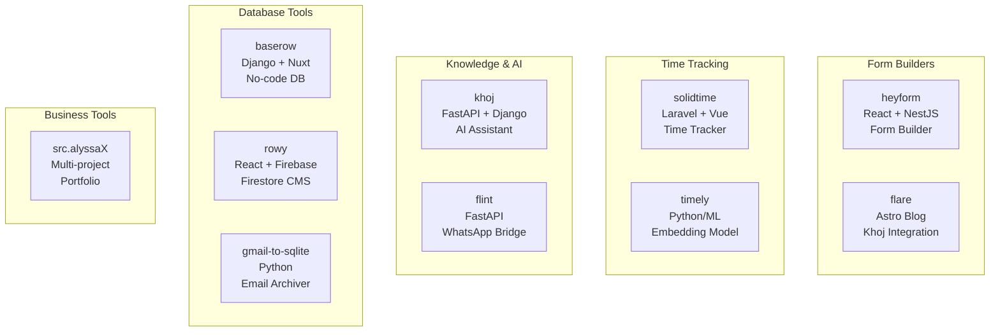
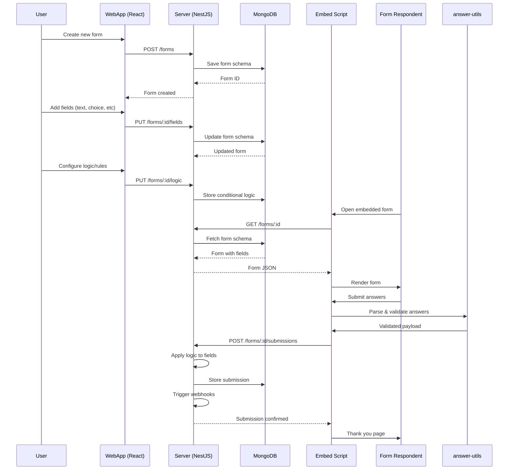
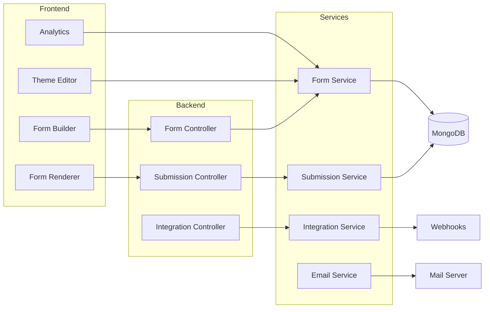
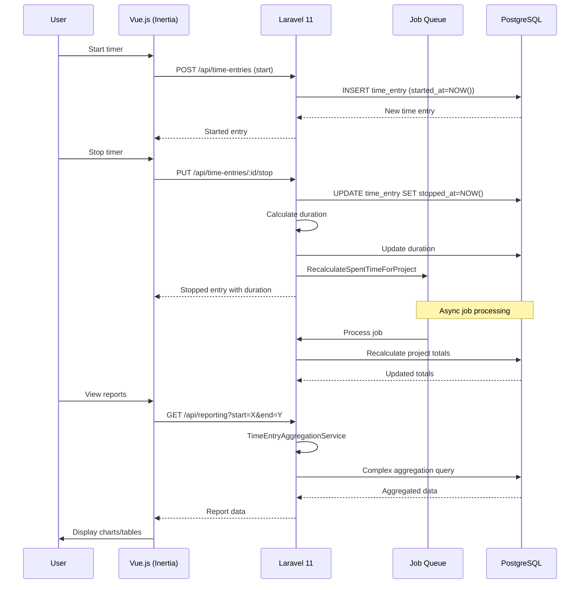
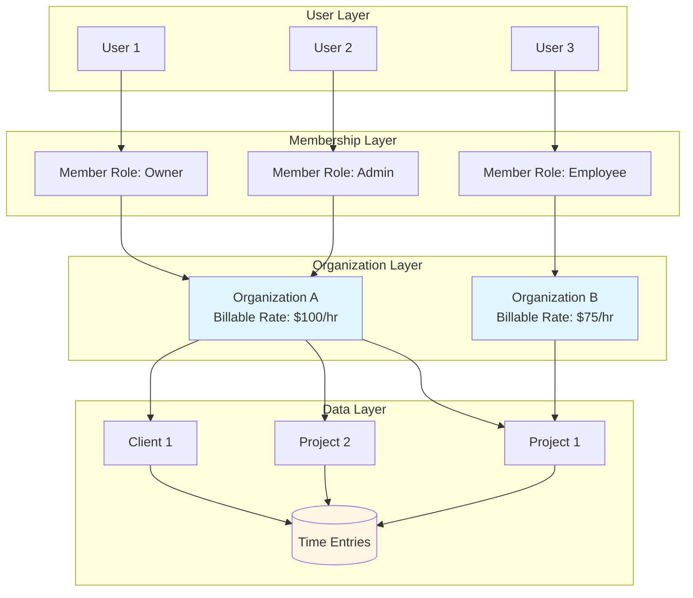
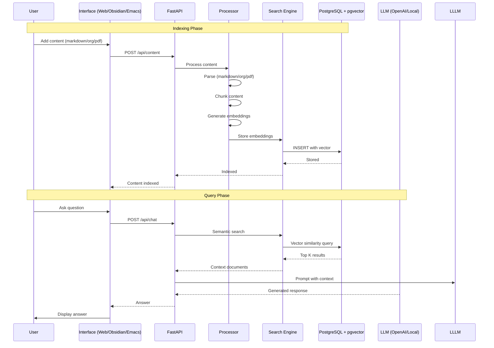
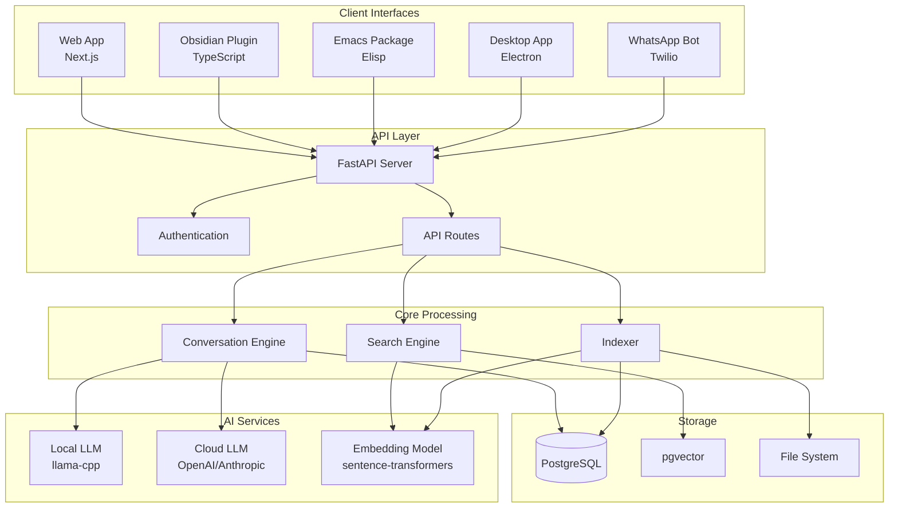

# Project Exploration: Apps Collection

## Overview

This directory contains 13 open-source applications spanning multiple categories: form builders, time tracking tools, AI/knowledge assistants, database utilities, and business platforms. The collection represents a curated set of production-ready applications that could serve as references for architecture patterns, integration strategies, and full-stack development approaches.

The three most complex and notable projects are:
- **heyform** - A full-featured conversational form builder (React + TypeScript + NestJS)
- **solidtime** - Modern time tracking application (Laravel 11 + PHP 8.3 + Inertia/Vue)
- **khoj** - AI personal knowledge assistant with multi-platform support (Python + FastAPI + Django)

## Repository Summary

| Project | Location | Primary Language | License |
|---------|----------|------------------|---------|
| heyform | `heyform/` | TypeScript | AGPL-3.0 |
| solidtime | `solidtime/` | PHP (Laravel) | AGPL-3.0 |
| khoj | `khoj/` | Python | AGPL-3.0 |
| timely | `timely/` | Python | N/A |
| flare | `flare/` | TypeScript (Astro) | N/A |
| flint | `flint/` | Python | AGPL-3.0 |
| gmail-to-sqlite | `gmail-to-sqlite/` | Python | N/A |
| src.baserow | `src.baserow/` | Python/JavaScript | Apache-2.0 |
| src.rowyio | `src.rowyio/` | TypeScript | Apache-2.0 |
| src.alyssaX | `src.alyssaX/` | JavaScript/PHP | MIT |

---

## Directory Structure

### heyform/ - Conversational Form Builder

```
heyform/
├── assets/                          # Static assets (logo, screenshots)
├── Dockerfile                       # Container build instructions
├── LICENSE                          # AGPL-3.0 License
├── package.json                     # Root workspace config
├── pnpm-lock.yaml                   # PNPM lockfile
├── pnpm-workspace.yaml              # Monorepo workspace definition
├── README.md                        # Project documentation
└── packages/                        # Core packages (monorepo structure)
    ├── answer-utils/                # Form submission processing
    │   ├── src/
    │   │   ├── answer-parser.ts          # Parse form answers
    │   │   ├── answer-to-api-object.ts   # Transform to API format
    │   │   ├── answer-to-html.ts         # HTML rendering
    │   │   ├── answer-to-json.ts         # JSON serialization
    │   │   ├── answer-to-plain.ts        # Plain text export
    │   │   ├── apply-logic-to-fields.ts  # Conditional logic
    │   │   ├── calculate-action.ts       # Action computation
    │   │   ├── validate-condition.ts     # Logic validation
    │   │   └── validate-payload.ts       # Input validation
    │   ├── test/                    # Unit tests with fixtures
    │   ├── package.json
    │   └── tsconfig.json
    │
    ├── embed/                       # JavaScript embed library
    │   ├── src/
    │   │   ├── utils/
    │   │   │   ├── common.ts             # Shared utilities
    │   │   │   └── dom.ts                # DOM manipulation
    │   │   ├── config.ts                 # Configuration
    │   │   ├── full-page.ts              # Full-page embed mode
    │   │   ├── index.ts                  # Main entry point
    │   │   └── modal.ts                  # Modal embed mode
    │   ├── example/                 # Example integration page
    │   ├── rollup.config.mjs        # Bundle configuration
    │   └── package.json
    │
    ├── form-renderer/               # React form rendering engine
    │   ├── src/
    │   │   ├── components/               # Form field components
    │   │   ├── hooks/                    # Custom React hooks
    │   │   ├── utils/                    # Rendering utilities
    │   │   └── index.ts                  # Public API
    │   ├── tailwind.config.js
    │   └── package.json
    │
    ├── server/                      # NestJS backend server
    │   ├── src/
    │   │   ├── app.module.ts               # Root module
    │   │   ├── main.ts                     # Server entry point
    │   │   ├── config/                     # Configuration
    │   │   ├── controller/                 # API controllers
    │   │   │   ├── form/                   # Form CRUD operations
    │   │   │   ├── submission/             # Submission handling
    │   │   │   ├── user/                   # User management
    │   │   │   └── integration/            # Third-party integrations
    │   │   ├── model/                      # Mongoose schemas
    │   │   │   ├── form/                   # Form document models
    │   │   │   ├── submission/             # Submission models
    │   │   │   └── user/                   # User models
    │   │   ├── resolver/                   # GraphQL resolvers
    │   │   ├── service/                    # Business logic
    │   │   │   ├── form.service.ts         # Form operations
    │   │   │   ├── submission.service.ts   # Submission processing
    │   │   │   ├── email.service.ts        # Notification emails
    │   │   │   └── integration.service.ts  # Webhook/Zapier
    │   │   ├── queue/                      # Job queue handlers
    │   │   └── utils/                      # Shared utilities
    │   ├── resources/                 # Email templates, static files
    │   ├── view/                      # Server-rendered views
    │   ├── nest-cli.json
    │   └── package.json
    │
    ├── shared-types-enums/          # Shared TypeScript types
    │   ├── src/
    │   │   ├── form.types.ts             # Form field types
    │   │   ├── submission.types.ts       # Submission shapes
    │   │   ├── user.types.ts             # User/role types
    │   │   └── enums.ts                  # Shared enumerations
    │   └── package.json
    │
    ├── utils/                       # Shared utility functions
    │   ├── src/
    │   │   ├── date.utils.ts             # Date formatting
    │   │   ├── string.utils.ts           # String helpers
    │   │   ├── validation.utils.ts       # Validation logic
    │   │   └── index.ts
    │   ├── test/
    │   └── package.json
    │
    └── webapp/                      # React frontend application
        ├── src/
        │   ├── main.tsx                    # App entry point
        │   ├── components/                 # UI components
        │   │   ├── form/                   # Form builder UI
        │   │   ├── field/                  # Field editor components
        │   │   ├── logic/                  # Conditional logic editor
        │   │   ├── theme/                  # Theme customizer
        │   │   └── analytics/              # Analytics dashboard
        │   ├── models/                     # Frontend data models
        │   ├── pages/                      # Route pages
        │   │   ├── form-builder.page.tsx   # Main builder interface
        │   │   ├── submissions.page.tsx    # Response viewer
        │   │   ├── analytics.page.tsx      # Statistics view
        │   │   └── settings.page.tsx       # Form settings
        │   ├── service/                    # API client services
        │   │   ├── form.api.ts             # Form API calls
        │   │   ├── submission.api.ts       # Submission API
        │   │   └── user.api.ts             # User management API
        │   ├── store/                      # State management
        │   │   ├── form.store.ts           # Form state
        │   │   ├── user.store.ts           # Auth state
        │   │   └── ui.store.ts             # UI state
        │   ├── router/                     # React Router config
        │   ├── styles/                     # Global styles
        │   ├── consts/                     # Constants
        │   ├── locales/                    # i18n translations
        │   └── utils/                      # Frontend utilities
        ├── public/                     # Static assets
        ├── index.html                  # HTML template
        ├── vite.config.ts              # Vite build config
        ├── tailwind.config.js          # Tailwind CSS config
        └── package.json
```

---

### solidtime/ - Time Tracking Application

```
solidtime/
├── app/                             # Laravel application code
│   ├── Actions/                     # Action classes (commands)
│   │   ├── Fortify/                 # User authentication actions
│   │   │   ├── CreateNewUser.php
│   │   │   ├── ResetUserPassword.php
│   │   │   ├── UpdateUserPassword.php
│   │   │   └── UpdateUserProfileInformation.php
│   │   └── Jetstream/               # Team/org management actions
│   │       ├── CreateOrganization.php
│   │       ├── DeleteOrganization.php
│   │       ├── DeleteUser.php
│   │       ├── InviteOrganizationMember.php
│   │       ├── AddOrganizationMember.php
│   │       ├── RemoveOrganizationMember.php
│   │       ├── UpdateOrganization.php
│   │       └── UpdateMemberRole.php
│   │
│   ├── Console/                     # Artisan CLI
│   │   ├── Commands/
│   │   │   ├── Admin/               # Admin utilities
│   │   │   │   ├── OrganizationDeleteCommand.php
│   │   │   │   └── UserVerifyCommand.php
│   │   │   ├── SelfHost/            # Self-hosting utilities
│   │   │   │   ├── SelfHostCheckForUpdateCommand.php
│   │   │   │   ├── SelfHostGenerateKeysCommand.php
│   │   │   │   └── SelfHostTelemetryCommand.php
│   │   │   ├── Test/                # Development testing commands
│   │   │   └── TimeEntry/           # Time entry commands
│   │   │       └── TimeEntrySendStillRunningMailsCommand.php
│   │   └── Kernel.php               # Command scheduler
│   │
│   ├── Enums/                       # PHP Enumerations
│   │   ├── ExportFormat.php         # CSV/XLSX export types
│   │   ├── Role.php                 # User roles (owner/admin/member)
│   │   ├── TimeEntryAggregationType.php
│   │   ├── TimeEntryAggregationTypeInterval.php
│   │   └── Weekday.php              # Week start day preference
│   │
│   ├── Events/                      # Domain events
│   │   ├── AfterCreateOrganization.php
│   │   ├── BeforeOrganizationDeletion.php
│   │   ├── MemberMadeToPlaceholder.php
│   │   ├── MemberRemoved.php
│   │   └── NewsletterRegistered.php
│   │
│   ├── Exceptions/                  # Custom exceptions
│   │   ├── Api/                     # API-specific exceptions
│   │   │   ├── ApiException.php
│   │   │   ├── CanNotDeleteUserWhoIsOwnerOfOrganizationWithMultipleMembers.php
│   │   │   ├── CanNotRemoveOwnerFromOrganization.php
│   │   │   ├── OrganizationHasNoSubscriptionButMultipleMembersException.php
│   │   │   ├── PdfRendererIsNotConfiguredException.php
│   │   │   ├── TimeEntryCanNotBeRestartedApiException.php
│   │   │   └── TimeEntryStillRunningApiException.php
│   │   └── Handler.php              # Exception handler
│   │
│   ├── Extensions/                  # Package extensions
│   │   ├── Auditing/                # Audit trail customization
│   │   ├── Fortify/                 # Auth customization
│   │   └── Scramble/                # OpenAPI documentation
│   │
│   ├── Filament/                    # Admin panel (Filament PHP)
│   │   ├── Resources/               # Admin CRUD resources
│   │   └── Widgets/                 # Dashboard widgets
│   │
│   ├── Http/                        # HTTP layer
│   │   ├── Controllers/             # Request handlers
│   │   ├── Kernel.php               # HTTP kernel
│   │   ├── Middleware/              # Request middleware
│   │   ├── Requests/                # Form request validation
│   │   └── Resources/               # API resources (JSON transformation)
│   │
│   ├── Jobs/                        # Queue jobs
│   │   ├── RecalculateSpentTimeForProject.php
│   │   ├── RecalculateSpentTimeForTask.php
│   │   └── Test/                    # Test jobs
│   │
│   ├── Listeners/                   # Event listeners
│   │   └── RemovePlaceholder.php
│   │
│   ├── Mail/                        # Mail classes
│   │   ├── OrganizationInvitationMail.php
│   │   └── TimeEntryStillRunningMail.php
│   │
│   ├── Models/                      # Eloquent models
│   │   ├── Audit.php                # Audit log entries
│   │   ├── Client.php               # Client entities
│   │   ├── Concerns/                # Model traits
│   │   ├── FailedJob.php
│   │   ├── Member.php               # Organization membership
│   │   ├── Organization.php         # Multi-tenant orgs
│   │   ├── OrganizationInvitation.php
│   │   ├── Project.php              # Projects
│   │   ├── ProjectMember.php        # Project assignments
│   │   ├── Tag.php                  # Time entry tags
│   │   ├── Task.php                 # Tasks
│   │   ├── TimeEntry.php            # Core time tracking
│   │   └── User.php                 # Users
│   │
│   ├── Policies/                    # Authorization policies
│   │   └── OrganizationPolicy.php
│   │
│   ├── Providers/                   # Service providers
│   │   ├── AppServiceProvider.php
│   │   ├── AuthServiceProvider.php
│   │   ├── EventServiceProvider.php
│   │   ├── Filament/AdminPanelProvider.php
│   │   ├── FortifyServiceProvider.php
│   │   ├── JetstreamServiceProvider.php
│   │   ├── RouteServiceProvider.php
│   │   └── TelescopeServiceProvider.php
│   │
│   ├── Rules/                       # Validation rules
│   │   ├── ColorRule.php            # Hex color validation
│   │   └── CurrencyRule.php         # Currency code validation
│   │
│   └── Service/                     # Business logic services
│       ├── ApiService.php           # API abstraction
│       ├── BillableRateService.php  # Rate calculations
│       ├── BillingContract.php      # Billing interface
│       ├── ColorService.php         # Color utilities
│       ├── DashboardService.php     # Dashboard data
│       ├── DeletionService.php      # Cascade deletions
│       ├── Export/                  # Data export (CSV/XLSX)
│       ├── Import/                  # Data import (Toggl/Clockify)
│       ├── IntervalService.php      # Time interval math
│       ├── InvitationService.php    # Org invitations
│       ├── IpLookup/                # Geolocation
│       ├── MemberService.php        # Membership operations
│       ├── PermissionStore.php      # Permission caching
│       ├── ReportExport/            # PDF report generation
│       ├── TimeEntryAggregationService.php  # Reporting aggregation
│       ├── TimeEntryFilter.php      # Time entry filtering
│       ├── TimezoneService.php      # Timezone handling
│       └── UserService.php          # User operations
│
├── bootstrap/                       # Laravel bootstrap
│   ├── app.php                      # Application bootstrap
│   └── cache/                       # Compiled services
│
├── config/                          # Configuration files
│   ├── app.php                      # Application config
│   ├── auth.php                     # Authentication config
│   ├── database.php                 # Database config
│   ├── filament.php                 # Admin panel config
│   ├── fortify.php                  # Fortify auth config
│   ├── jetstream.php                # Jetstream team config
│   ├── mail.php                     # Mail configuration
│   ├── octane.php                   # Laravel Octane config
│   ├── passport.php                 # OAuth Passport config
│   ├── queue.php                    # Queue configuration
│   ├── telescope.php                # Debug toolbar config
│   └── scrambling.php               # OpenAPI docs config
│
├── database/                        # Database layer
│   ├── factories/                   # Model factories for testing
│   │   ├── ClientFactory.php
│   │   ├── OrganizationFactory.php
│   │   ├── ProjectFactory.php
│   │   ├── TimeEntryFactory.php
│   │   └── UserFactory.php
│   ├── migrations/                  # Database migrations
│   │   ├── 2014_10_12_000000_create_users_table.php
│   │   ├── 2020_05_21_100000_create_organizations_table.php
│   │   ├── 2024_01_20_110837_create_time_entries_table.php
│   │   └── ... (30+ migrations)
│   ├── schema/                      # Schema dumps
│   └── seeders/                     # Database seeders
│
├── docker/                          # Docker configurations
│   ├── local/                       # Local development containers
│   └── prod/                        # Production container
│
├── e2e/                             # End-to-end tests (Playwright)
│   ├── auth.spec.ts
│   ├── projects.spec.ts
│   ├── reporting.spec.ts
│   ├── time.spec.ts
│   └── utils/
│
├── extensions/                      # Laravel package extensions
│   └── extensions_autoload.php
│
├── lang/                            # Localization files
│   └── en/
│       ├── exceptions.php
│       ├── importer.php
│       └── validation.php
│
├── playwright/                      # Playwright config
│   ├── config.ts
│   └── fixtures.ts
│
├── public/                          # Public assets
│   ├── fonts/                       # Outfit font family
│   ├── images/                      # Branding assets
│   ├── favicons/                    # Favicon sets
│   ├── desktop-version/             # Electron desktop builds
│   └── index.php                    # HTTP entry point
│
├── resources/                       # Application resources
│   ├── css/
│   │   └── app.css                  # Compiled styles
│   ├── js/                          # Inertia/Vue frontend
│   │   ├── app.ts                   # Frontend entry
│   │   ├── Components/              # Vue components
│   │   ├── Layouts/                 # Layout components
│   │   ├── Pages/                   # Page components (Inertia)
│   │   │   ├── Welcome.vue          # Landing dashboard
│   │   │   ├── Time.vue             # Time tracker
│   │   │   ├── Projects.vue         # Projects list
│   │   │   ├── ProjectShow.vue      # Project detail
│   │   │   ├── Clients.vue          # Client management
│   │   │   ├── Reporting.vue        # Reports overview
│   │   │   ├── ReportingDetailed.vue# Detailed analytics
│   │   │   ├── Members.vue          # Team members
│   │   │   ├── Tags.vue             # Tag management
│   │   │   ├── Import.vue           # Data import
│   │   │   ├── Profile/             # User profile pages
│   │   │   ├── Teams/               # Organization management
│   │   │   └── Auth/                # Auth pages
│   │   ├── packages/                # Internal packages
│   │   ├── types/                   # TypeScript types
│   │   ├── utils/                   # JavaScript utilities
│   │   └── ziggy.js                 # Route helper
│   ├── markdown/                    # Markdown content
│   ├── testfiles/                   # Test fixtures
│   │   ├── toggl_time_entries_import_test_1.csv
│   │   ├── clockify_time_entries_import_test_1.csv
│   │   └── solidtime_import_test_1/
│   └── views/                       # Blade templates
│       ├── app.blade.php            # Root template
│       ├── emails/                  # Email templates
│       └── reports/                 # PDF report templates
│
├── routes/                          # Route definitions
│   ├── api.php                      # API routes
│   └── web.php                      # Web routes
│
├── storage/                         # Storage directory
│   ├── app/                         # Application storage
│   ├── framework/                   # Framework cache/sessions
│   └── logs/                        # Application logs
│
├── tests/                           # Test suite
│   ├── Feature/                     # Feature tests
│   │   ├── AuthenticationTest.php
│   │   ├── CreateOrganizationTest.php
│   │   ├── DeleteAccountTest.php
│   │   └── UpdateTeamTest.php
│   ├── Unit/                        # Unit tests
│   │   ├── Console/
│   │   ├── Middleware/
│   │   ├── Model/
│   │   └── Service/
│   ├── CreatesApplication.php
│   ├── TestCase.php
│   └── TestCaseWithDatabase.php
│
├── artisan                          # Laravel CLI
├── composer.json                    # PHP dependencies
├── composer.lock                    # Locked dependencies
├── docker-compose.yml               # Docker services
├── openapi.json                     # API documentation
├── package.json                     # Node dependencies
├── phpunit.xml                      # PHPUnit config
├── playwright.config.ts             # Playwright config
├── postcss.config.js                # PostCSS config
├── tailwind.config.js               # Tailwind config
├── tsconfig.json                    # TypeScript config
├── vite.config.js                   # Vite bundler config
└── vite-module-loader.js            # Vite module loader
```

---

### khoj/ - AI Personal Knowledge Assistant

```
khoj/
├── documentation/                   # Docusaurus documentation site
│   ├── docs/
│   │   ├── advanced/                # Advanced configuration
│   │   ├── clients/                 # Client app docs
│   │   ├── contributing/            # Contribution guide
│   │   ├── data-sources/            # Data source integrations
│   │   ├── features/                # Feature documentation
│   │   ├── get-started/             # Getting started guides
│   │   └── miscellaneous/           # Additional documentation
│   ├── src/
│   │   ├── components/              # Custom React components
│   │   └── css/                     # Documentation styles
│   ├── babel.config.js
│   ├── docusaurus.config.js
│   ├── package.json
│   └── sidebars.js
│
├── scripts/                         # Development scripts
│   ├── bump_version.sh              # Version management
│   └── dev_setup.sh                 # Development environment setup
│
├── src/                             # Main source directory
│   ├── interface/                   # Client interfaces
│   │   ├── desktop/                 # Electron desktop app
│   │   │   ├── package.json
│   │   │   ├── todesktop.json       # ToDesktop config
│   │   │   └── src/
│   │   ├── emacs/                   # Emacs package
│   │   │   ├── khoj.el              # Emacs Lisp package
│   │   │   └── tests/
│   │   ├── obsidian/                # Obsidian plugin
│   │   │   ├── manifest.json
│   │   │   ├── package.json
│   │   │   ├── src/
│   │   │   │   ├── main.ts          # Plugin entry
│   │   │   │   ├── chat_view.ts     # Chat interface
│   │   │   │   ├── pane_view.ts     # Side pane
│   │   │   │   └── search_modal.ts  # Search UI
│   │   │   └── styles.css
│   │   └── web/                     # Web application
│   │       ├── app/
│   │       │   ├── common/
│   │       │   │   ├── auth.ts      # Authentication
│   │       │   │   ├── chatFunctions.ts  # Chat utilities
│   │       │   │   └── utils.ts
│   │       │   └── components/
│   │       │       ├── chat/        # Chat components
│   │       │       ├── search/      # Search components
│   │       │       ├── settings/    # Settings UI
│   │       │       └── suggestions/ # Query suggestions
│   │       ├── components/          # Shared UI components
│   │       ├── layouts/             # Page layouts
│   │       ├── pages/               # Next.js pages
│   │       ├── lib/                 # Utility libraries
│   │       └── package.json
│   │
│   └── khoj/                        # Python backend
│       ├── app/                     # Django application
│       │   ├── __init__.py
│       │   ├── asgi.py              # ASGI entry
│       │   ├── settings.py          # Django settings
│       │   └── urls.py              # URL routing
│       │
│       ├── database/                # Database layer
│       │   ├── adapters/            # Database adapters
│       │   │   └── __init__.py      # CRUD operations
│       │   ├── management/          # Django management commands
│       │   │   └── commands/
│       │   │       ├── change_default_model.py
│       │   │       └── convert_images_png_to_webp.py
│       │   ├── migrations/          # Django migrations
│       │   │   ├── 0001_khojuser.py
│       │   │   ├── 0003_vector_extension.py
│       │   │   ├── 0004_content_types_and_more.py
│       │   │   └── ... (20+ migrations)
│       │   ├── models.py            # ORM models
│       │   └── tables.py            # Table definitions
│       │
│       ├── processor/               # AI/ML processing
│       │   ├── conversation/        # Conversation handling
│       │   │   ├── actor.py         # LLM interaction
│       │   │   ├── director.py      # Conversation flow
│       │   │   └── utils.py         # Conversation utilities
│       │   ├── text/                # Text processing
│       │   │   ├── embed.py         # Text embedding
│       │   │   └── split.py         # Text chunking
│       │   ├── image/               # Image processing
│       │   │   ├── convert.py       # Image format conversion
│       │   │   └── generate.py      # Image generation
│       │   ├── audio/               # Audio processing
│       │   │   └── transcribe.py    # Speech-to-text
│       │   └── helpers.py           # Processing utilities
│       │
│       ├── routers/                 # FastAPI routers
│       │   ├── api/                 # API endpoints
│       │   │   ├── v1/              # API version 1
│       │   │   │   ├── chat.py      # Chat endpoints
│       │   │   │   ├── search.py    # Search endpoints
│       │   │   │   ├── content.py   # Content management
│       │   │   │   ├── agent.py     # Agent configuration
│       │   │   │   └── client.py    # Client config
│       │   │   └── v2/              # API version 2
│       │   ├── auth/                # Authentication endpoints
│       │   └── helpers.py           # Router utilities
│       │
│       ├── search_type/             # Search implementations
│       │   ├── text_search.py       # Semantic text search
│       │   ├── image_search.py      # Image similarity search
│       │   ├── pdf_search.py        # PDF content search
│       │   └── online_search.py     # Web search integration
│       │
│       ├── search_filter/           # Search filters
│       │   ├── file_filter.py       # File-based filtering
│       │   ├── date_filter.py       # Date range filtering
│       │   └── word_filter.py       # Keyword filtering
│       │
│       ├── utils/                   # Utilities
│       │   ├── config.py            # Configuration parser
│       │   ├── helpers.py           # Helper functions
│       │   ├── constants.py         # Constants
│       │   ├── state.py             # Global state
│       │   ├── cli.py               # CLI argument parsing
│       │   ├── initialization.py    # Startup initialization
│       │   └── shared.py            # Shared utilities
│       │
│       ├── configure.py             # Server configuration
│       ├── main.py                  # Main entry point
│       ├── manage.py                # Django management
│       └── __init__.py
│
├── tests/                           # Test suite
│   ├── conftest.py                  # Pytest fixtures
│   ├── helpers.py                   # Test helpers
│   ├── eval_frames.py               # Evaluation framework
│   ├── test_agents.py               # Agent tests
│   ├── test_client.py               # Client tests
│   ├── test_cli.py                  # CLI tests
│   ├── test_conversation_utils.py   # Conversation tests
│   ├── test_date_filter.py          # Date filter tests
│   ├── test_db_lock.py              # Database lock tests
│   ├── test_offline_chat_actors.py  # Local LLM tests
│   ├── test_openai_chat_actors.py   # OpenAI tests
│   ├── test_text_search.py          # Search tests
│   ├── test_markdown_to_entries.py  # Markdown parser tests
│   ├── test_org_to_entries.py       # Org-mode parser tests
│   ├── test_pdf_to_entries.py       # PDF parser tests
│   └── test_plaintext_to_entries.py # Plain text tests
│
├── docker-compose.yml               # Docker services
├── Dockerfile                       # Base container
├── prod.Dockerfile                  # Production container
├── gunicorn-config.py               # Gunicorn configuration
├── pyproject.toml                   # Python project config
├── pytest.ini                       # Pytest configuration
├── manifest.json                    # App manifest
└── versions.json                    # Version information
```

---

### timely/ - Temporal Embedding Model

```
timely/
├── csv/                             # Training data CSVs
│   ├── bulk.csv                     # Bulk training data
│   ├── dates.csv                    # Date format examples
│   ├── holidays.csv                 # Holiday references
│   ├── lastx.csv                    # Relative date patterns
│   ├── months.csv                   # Month name variations
│   ├── seasons.csv                  # Seasonal references
│   └── xtimeago.csv                 # "X time ago" patterns
│
├── notebooks/                       # Jupyter notebooks
│   ├── testing.ipynb                # Benchmark testing
│   └── training.ipynb               # Model training
│
├── debug/                           # Debug utilities
│   ├── opsetbuilder.py
│   ├── setbuilder.py
│   └── test_nomic.py
│
├── *.py                             # Python scripts (20+ files)
│   ├── appendwiki.py                # Wikipedia data appending
│   ├── benchmarkgen.py              # Benchmark generation
│   ├── benchmarkgen2.py
│   ├── benchpairgen.py              # Benchmark pair generation
│   ├── datasetgen.py                # Main dataset generation
│   ├── datasetgen2.py
│   ├── dataset_linter.py            # Data quality validation
│   ├── date_to_date.py              # Date format conversion
│   ├── dateformatsgen.py            # Date format generation
│   ├── graddatasetgen.py            # Gradual dataset generation
│   ├── gradientgen.py               # Gradient generation
│   ├── holidaygen.py                # Holiday data generation
│   ├── lastxgen.py                  # "Last X" pattern generation
│   ├── merger.py                    # Data merging
│   ├── monthgen.py                  # Month data generation
│   ├── natural_to_date.py           # Natural language parsing
│   ├── natural_tuples.py            # Natural language tuple gen
│   ├── relativedategen.py           # Relative date generation
│   └── seasonsgen.py                # Seasonal data generation
│
├── PM.png                           # Project management diagram
├── timelychart3.png                 # Performance chart
├── timelyprogression1.png           # Training progression chart
└── scratchpad.md                    # Development notes
```

---

### flint/ - WhatsApp AI Bridge

```
flint/
├── src/flint/
│   ├── main.py                      # FastAPI application
│   ├── configure.py                 # Configuration setup
│   ├── constants.py                 # Constants
│   ├── helpers.py                   # Helper functions
│   └── routers/
│       └── chat.py                  # WhatsApp chat endpoint
│
├── tests/
│   └── __init__.py
│
├── assets/                          # Static assets
├── docker-compose.yml               # Docker services
├── Dockerfile                       # Container definition
├── dev.Dockerfile                   # Development container
├── pyproject.toml                   # Python dependencies
└── LICENSE
```

---

### gmail-to-sqlite/ - Gmail Archiver

```
gmail-to-sqlite/
├── main.py                          # CLI entry point
├── auth.py                          # OAuth authentication
├── db.py                            # SQLite operations
├── message.py                       # Email message handling
├── sync.py                          # Sync logic
├── requirements.txt                 # Python dependencies
├── LICENSE
└── README.md
```

---

### src.alyssaX/ - Portfolio of Projects

A collection of 15+ smaller open-source projects:

| Project | Description | Tech Stack |
|---------|-------------|------------|
| **screenity** | Screen recording extension | React, Fabric.js, Chrome Extension |
| **flowy** | Flowchart builder | Vanilla JS, CSS |
| **carden** | Spaced repetition flashcards | PHP, MySQL, Chrome Extension |
| **ecosnap** | Plastic waste identification | Next.js, TensorFlow, Firebase |
| **motionity** | Motion graphics editor | Vanilla JS, Web Components |
| **mapus** | Collaborative map maker | Leaflet.js, WebSockets |
| **omni** | New tab productivity | Chrome Extension API |
| **jumpskip** | Video skipper | Chrome Extension |
| **slashy** | Screenshot annotation | Chrome Extension |
| **animockup** | Mockup generator | Vanilla JS, HTML5 Canvas |
| **figma-platformer-engine** | Game engine for Figma | JavaScript |
| **producthunt-preview** | Product Hunt viewer | React |

---

### src.baserow/ - No-Code Database

Baserow is an open-source no-code database tool (alternative to Airtable). The mirrored repository includes:

```
src.baserow/
├── baserow/                         # Main application
│   ├── backend/                     # Django backend
│   │   ├── baserow/                 # Core application
│   │   ├── src/                     # Source modules
│   │   ├── templates/               # Email templates
│   │   └── tests/                   # Backend tests
│   ├── web-frontend/                # Nuxt.js frontend
│   │   ├── modules/                 # Vue modules
│   │   ├── locales/                 # i18n translations
│   │   └── test/                    # Frontend tests
│   ├── changelog/                   # Changelog generator
│   ├── deploy/                      # Deployment configs
│   ├── docs/                        # Documentation
│   └── e2e-tests/                   # Playwright e2e tests
├── immerhin/                        # State management library
├── react-router/                    # React Router fork
└── webstudio/                       # Web studio platform
```

**Key Technologies:**
- Backend: Django (Python)
- Frontend: Nuxt.js (Vue 3)
- Database: PostgreSQL
- Real-time: Django Channels

---

### src.rowyio/ - Firestore CMS

Rowy is an Airtable-like CMS for Google Cloud Firestore:

```
src.rowyio/
├── rowy/                            # Main application
│   ├── src/
│   │   ├── components/              # React components
│   │   ├── atoms/                   # Reconciliation atoms
│   │   ├── contexts/                # React contexts
│   │   ├── hooks/                   # Custom hooks
│   │   ├── pages/                   # App pages
│   │   └── utils/                   # Utilities
│   ├── firebase.json                # Firebase config
│   ├── firestore.rules              # Security rules
│   └── package.json
├── backend/                         # Node.js backend
│   ├── src/
│   │   ├── firestore/               # Firestore operations
│   │   ├── connectTable/            # External DB connectors
│   │   ├── functionBuilder/         # Cloud Function builder
│   │   ├── userManagement/          # User auth
│   │   └── types/                   # TypeScript types
│   └── package.json
├── buildship/                       # Workflow automation
└── LLM-Web-Crawler/                 # Web scraping utility
```

**Key Technologies:**
- Frontend: React, Firebase
- Backend: Node.js, TypeScript
- Database: Google Cloud Firestore
- Deployment: Firebase Cloud Functions

---

## Architecture

### High-Level System Diagram



---

### heyform Architecture

#### Form Building and Response Collection Flow



#### Component Architecture



---

### solidtime Architecture

#### Time Tracking Data Flow



#### Multi-Tenancy Model



---

### khoj Architecture

#### Knowledge Graph and RAG Pipeline



#### Multi-Interface Architecture



---

## Component Breakdown

### heyform Components

#### Form Builder (Frontend)
- **Location:** `packages/webapp/src/components/form/`
- **Purpose:** Drag-and-drop form builder interface
- **Dependencies:** React, dnd-kit (drag-drop), shared-types-enums
- **Dependents:** webapp pages, form rendering

#### Answer Utils (Shared)
- **Location:** `packages/answer-utils/src/`
- **Purpose:** Form submission parsing, validation, and transformation
- **Key Functions:**
  - `answer-parser.ts` - Parse submitted answers
  - `validate-condition.ts` - Evaluate conditional logic
  - `apply-logic-to-fields.ts` - Apply branching rules
  - `answer-to-html.ts` - Generate HTML exports
- **Dependencies:** None (pure TypeScript)
- **Dependents:** server, webapp, embed

#### Form Server (Backend)
- **Location:** `packages/server/src/`
- **Purpose:** API server, form storage, submission handling
- **Dependencies:** NestJS, MongoDB, Mongoose, Bull (queues)
- **Dependents:** webapp, embed, integrations

---

### solidtime Components

#### Time Entry Model
- **Location:** `app/Models/TimeEntry.php`
- **Purpose:** Core time tracking data structure
- **Fields:** id, member_id, project_id, task_id, started_at, stopped_at, duration, description, is_billable
- **Relationships:** belongsTo(Member), belongsTo(Project), belongsTo(Task)
- **Dependents:** TimeEntryAggregationService, ReportExport, DashboardService

#### TimeEntryAggregationService
- **Location:** `app/Service/TimeEntryAggregationService.php`
- **Purpose:** Aggregate time entries for reporting
- **Dependencies:** TimeEntry model, PostgreSQL advanced queries
- **Dependents:** ReportingController, DashboardService

#### Import Service
- **Location:** `app/Service/Import/`
- **Purpose:** Import data from Toggl, Clockify, CSV
- **Supported Formats:**
  - Toggl time entries CSV
  - Clockify time entries CSV
  - Solidtime JSON export
- **Dependencies:** Laravel Excel, League CSV

---

### khoj Components

#### Conversation Director
- **Location:** `src/khoj/processor/conversation/director.py`
- **Purpose:** Orchestrate multi-turn conversations
- **Dependencies:** Conversation Actor, Search Type, Database
- **Key Functions:**
  - `extract_query` - Parse user query
  - `retrieve_context` - Fetch relevant documents
  - `generate_response` - Create LLM response
  - `store_conversation` - Persist conversation history

#### Text Search Engine
- **Location:** `src/khoj/search_type/text_search.py`
- **Purpose:** Semantic search using vector embeddings
- **Dependencies:** sentence-transformers, pgvector
- **Key Functions:**
  - `query` - Search for similar documents
  - `index` - Add documents to index
  - `delete` - Remove documents from index

#### Content Router
- **Location:** `src/khoj/routers/api/v1/content.py`
- **Purpose:** Manage content indexing
- **Endpoints:**
  - `POST /api/content` - Index new content
  - `DELETE /api/content` - Remove content
  - `GET /api/content/types` - List content types

---

## Entry Points

### heyform

#### Server Entry Point
- **File:** `packages/server/src/main.ts`
- **Description:** NestJS application bootstrap
- **Flow:**
  1. Load environment configuration
  2. Initialize MongoDB connection
  3. Register modules (Form, Submission, User, Integration)
  4. Setup GraphQL subscriptions for real-time updates
  5. Start HTTP server on configured port

#### Webapp Entry Point
- **File:** `packages/webapp/src/main.tsx`
- **Description:** React application root
- **Flow:**
  1. Render root component
  2. Initialize React Router
  3. Setup state stores (form, user, ui)
  4. Load initial data from API
  5. Mount to DOM

---

### solidtime

#### HTTP Entry Point
- **File:** `public/index.php`
- **Description:** Laravel HTTP kernel bootstrap
- **Flow:**
  1. Load Composer autoloader
  2. Bootstrap Laravel application
  3. Handle HTTP request
  4. Return Inertia response

#### Frontend Entry Point
- **File:** `resources/js/app.ts`
- **Description:** Inertia/Vue application root
- **Flow:**
  1. Create Vue application
  2. Configure Inertia
  3. Register components
  4. Initialize from server-rendered page

---

### khoj

#### Main Entry Point
- **File:** `src/khoj/main.py`
- **Description:** FastAPI + Django application server
- **Flow:**
  1. Parse CLI arguments
  2. Initialize Django (migrations, static files)
  3. Setup background scheduler (APScheduler)
  4. Configure FastAPI routes
  5. Start Uvicorn server

```python
def run(should_start_server=True):
    # Initialize Django
    django.setup()
    call_command("migrate", "--noinput")

    # Setup scheduler
    state.scheduler = BackgroundScheduler()
    state.scheduler.start()

    # Configure routes
    configure_routes(app)
    app.mount("/server", django_app)

    # Start server
    uvicorn.run(app, host=host, port=port)
```

---

## External Dependencies

### heyform Dependencies

| Dependency | Version | Purpose |
|------------|---------|---------|
| React | ^18.x | UI framework |
| NestJS | ^10.x | Backend framework |
| MongoDB | N/A | Primary database |
| Mongoose | ^7.x | MongoDB ODM |
| GraphQL | N/A | API layer |
| Bull | ^4.x | Job queues |
| TailwindCSS | ^3.x | Styling |
| Vite | ^5.x | Frontend bundling |

---

### solidtime Dependencies

| Dependency | Version | Purpose |
|------------|---------|---------|
| Laravel | ^11.x | Backend framework |
| PHP | 8.3.* | Runtime |
| Inertia.js | ^1.x | SSR bridge |
| Vue.js | ^3.x | Frontend framework |
| PostgreSQL | N/A | Primary database |
| Laravel Octane | ^2.x | High-performance server |
| Laravel Passport | ^12.x | OAuth authentication |
| Filament | ^3.x | Admin panel |
| TailwindCSS | ^3.x | Styling |
| Playwright | N/A | E2E testing |

---

### khoj Dependencies

| Dependency | Version | Purpose |
|------------|---------|---------|
| FastAPI | >=0.110.0 | API framework |
| Django | 5.0.9 | ORM and admin |
| sentence-transformers | 3.0.1 | Text embeddings |
| llama-cpp-python | 0.2.88 | Local LLM |
| openai | >=1.0.0 | OpenAI API |
| anthropic | 0.26.1 | Anthropic API |
| pgvector | 0.2.4 | Vector search |
| psycopg2-binary | 2.9.9 | PostgreSQL driver |
| pymupdf | 1.24.11 | PDF parsing |
| langchain | 0.2.5 | RAG utilities |
| torch | 2.2.2 | ML framework |
| transformers | >=4.28.0 | HuggingFace models |

---

## Configuration

### heyform Configuration

- **Environment Variables:**
  - `MONGODB_URI` - Database connection string
  - `JWT_SECRET` - Authentication secret
  - `PORT` - Server port (default: 3000)
  - `CORS_ORIGINS` - Allowed origins

- **Configuration Files:**
  - `pnpm-workspace.yaml` - Monorepo package linking
  - `nest-cli.json` - NestJS build options
  - `vite.config.ts` - Frontend bundling

---

### solidtime Configuration

- **Environment Variables:**
  - `APP_ENV` - Application environment (local/production)
  - `APP_URL` - Application base URL
  - `DB_CONNECTION` - Database driver (pgsql)
  - `DB_HOST`, `DB_PORT`, `DB_DATABASE`, `DB_USERNAME`, `DB_PASSWORD`
  - `PASSPORT_CLIENT_ID`, `PASSPORT_CLIENT_SECRET` - OAuth credentials
  - `OCTANE_SERVER` - Server type (swoole/roadrunner)

- **Configuration Files:**
  - `config/database.php` - Database settings
  - `config/auth.php` - Authentication settings
  - `config/jetstream.php` - Team/organization settings
  - `docker-compose.yml` - Local development services

---

### khoj Configuration

- **Environment Variables:**
  - `KHOJ_DOMAIN` - Application domain
  - `KHOJ_NO_HTTPS` - Disable HTTPS redirect
  - `OPENAI_API_KEY` - OpenAI API authentication
  - `ANTHROPIC_API_KEY` - Anthropic API authentication
  - `DATABASE_URL` - PostgreSQL connection string

- **Configuration File:** `config.yml`
```yaml
content-type:
  org:
    compressed-jsonl: .content/org.jsonl
    input-files: ~/org/*.org
  markdown:
    compressed-jsonl: .content/markdown.jsonl
    input-files: ~/notes/*.md
search-type:
  asymmetric:
    encoder: sentence-transformers/msmarco-MiniLM-L-6-v3
    cross-encoder: cross-encoder/ms-marco-MiniLM-L-6-v2
processor:
  conversation:
    openai-api-key: <key>
    model: gpt-4
```

---

## Testing

### heyform Testing Strategy

- **Unit Tests:** Jest tests for answer-utils, shared types
- **Integration Tests:** Supertest for API endpoints
- **E2E Tests:** Not included (would use Cypress/Playwright)
- **Test Commands:**
  ```bash
  pnpm test                    # Run all tests
  pnpm --filter answer-utils test  # Package-specific tests
  ```

---

### solidtime Testing Strategy

- **Unit Tests:** PHPUnit for PHP classes
- **Feature Tests:** Laravel HTTP tests
- **E2E Tests:** Playwright for browser automation
- **Static Analysis:** PHPStan level 7
- **Code Style:** Laravel Pint
- **Test Commands:**
  ```bash
  composer test               # Run PHPUnit
  composer ptest              # Parallel tests
  composer analyse            # PHPStan analysis
  ```

---

### khoj Testing Strategy

- **Unit Tests:** Pytest for Python modules
- **Integration Tests:** Test with actual LLM APIs
- **Eval Tests:** `eval_frames.py` for quality benchmarking
- **Test Commands:**
  ```bash
  pytest                      # Run all tests
  pytest -m chatquality       # Chat quality evaluation
  ```

---

## Key Insights

### Architecture Patterns

1. **Monorepo Structure (heyform):** heyform uses PNPM workspaces to share types and utilities across server, webapp, and embed packages. This ensures type safety and reduces duplication.

2. **Multi-Tenancy (solidtime):** solidtime implements organization-based multi-tenancy with granular permissions (Owner/Admin/Member/Placeholder). All data is scoped to organizations.

3. **Hybrid Framework (khoj):** khoj combines FastAPI (async API) with Django (ORM, admin, migrations) - leveraging the strengths of both frameworks.

4. **RAG Pipeline (khoj):** khoj implements a Retrieval-Augmented Generation pipeline: query → semantic search → context retrieval → LLM response → conversation storage.

5. **Inertia.js SSR (solidtime):** solidtime uses Inertia.js to build a SPA-like experience with server-side rendering, eliminating the need for a separate API layer.

6. **Embed Strategy (heyform):** heyform provides a lightweight embed script that loads forms in modals or full-page overlays, with seamless theme customization.

### Technology Choices

1. **PostgreSQL + pgvector (khoj, solidtime):** Both khoj and solidtime leverage PostgreSQL for primary data, with khoj using pgvector for semantic search.

2. **Vue 3 + Inertia (solidtime):** Modern Vue 3 with Composition API, using Inertia for seamless server-client communication without building a separate API.

3. **NestJS + GraphQL (heyform):** heyform uses NestJS for a structured backend with GraphQL for real-time form updates.

4. **Laravel 11 (solidtime):** solidtime uses the latest Laravel with Octane for high-performance request handling.

### Deployment Strategies

1. **Docker-First:** All major projects provide Docker configurations for local development and production deployment.

2. **One-Click Deploy:** heyform supports Railway, Zeabur, and Sealos one-click deployments.

3. **Self-Hosting Focus:** All projects emphasize self-hosting capabilities with detailed documentation.

---

## Open Questions

1. **heyform:**
   - How does the form renderer handle complex conditional logic with multiple conditions?
   - What is the rate limiting strategy for form submissions?
   - How are large file uploads handled and stored?

2. **solidtime:**
   - How does the billable rate calculation handle conflicts between project, member, and organization rates?
   - What is the strategy for handling time zones in distributed teams?
   - How does the import service handle duplicate entries?

3. **khoj:**
   - How does the conversation director handle context window limits for long conversations?
   - What is the strategy for updating embeddings when source content changes?
   - How does the WhatsApp integration (flint) handle message threading?

4. **General:**
   - What is the update strategy when upstream repositories change?
   - Are there any modifications made to these mirrored repositories?
   - How are security patches applied across all projects?

---

## Appendix: Additional Project Summaries

### flare/
- **Purpose:** Blog/documentation site for khoj.ai team
- **Tech:** Astro, TailwindCSS
- **Content:** Technical posts about timely embedding model, khoj features

### gmail-to-sqlite/
- **Purpose:** Download Gmail to SQLite for analysis
- **Tech:** Python, Gmail API, SQLite
- **Schema:** messages table with sender, recipients, labels, body, timestamps

### src.alyssaX/
- **Purpose:** Portfolio of 15+ open-source projects
- **Notable:** screenity (screen recorder), flowy (flowcharts), ecosnap (ML waste classifier)
- **Tech:** Varied (Chrome Extensions, React, PHP, Swift)

---

*Generated following exploration agent format from `/home/darkvoid/Boxxed/@dev/repo-expolorations/.agents/exploration-agent.md`*
