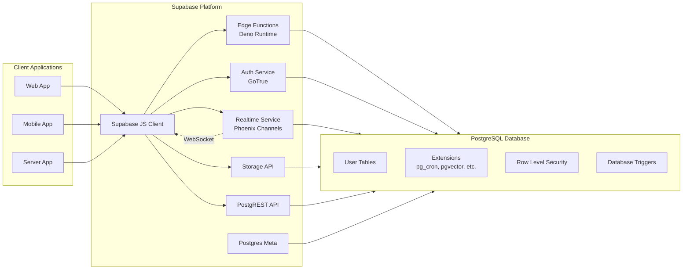
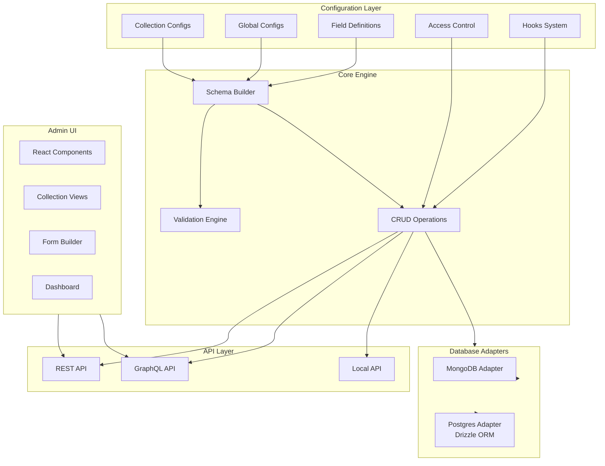
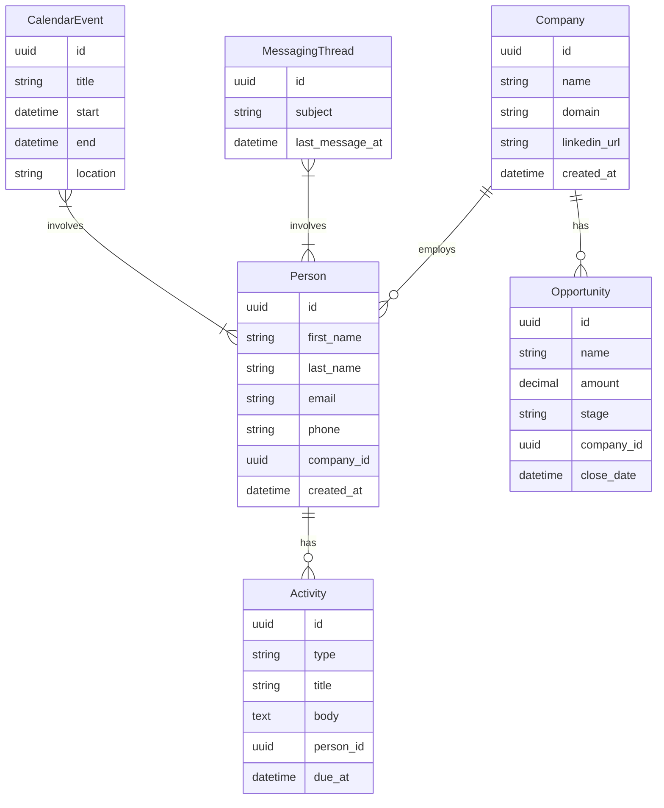
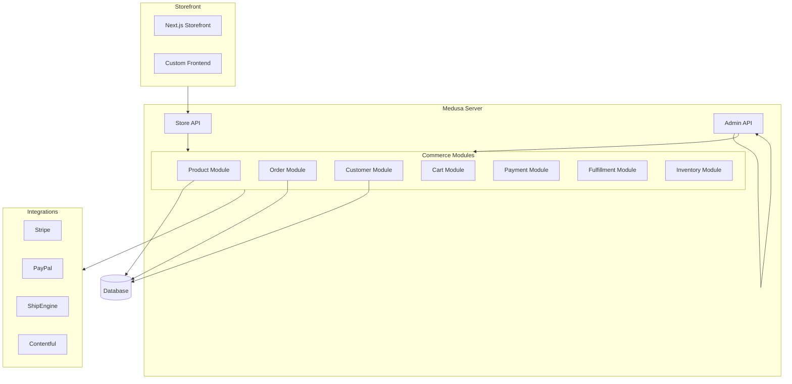
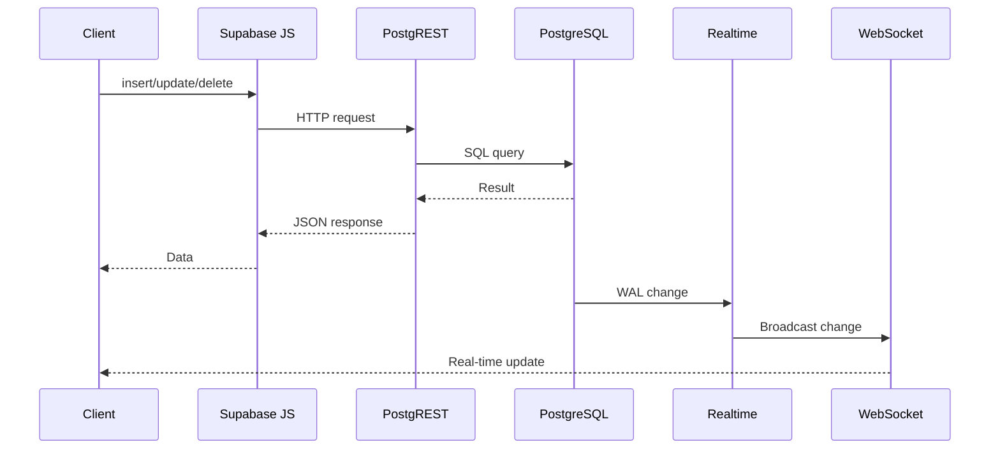
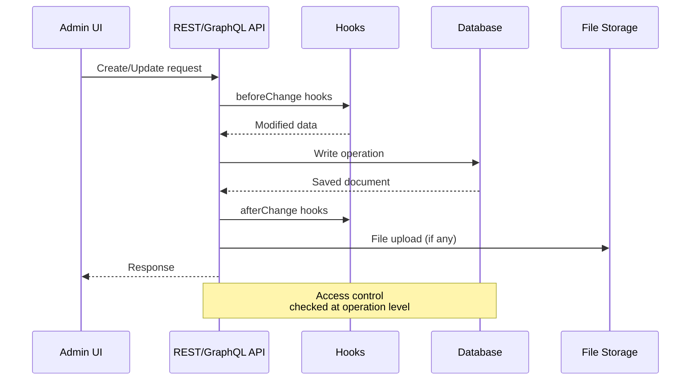
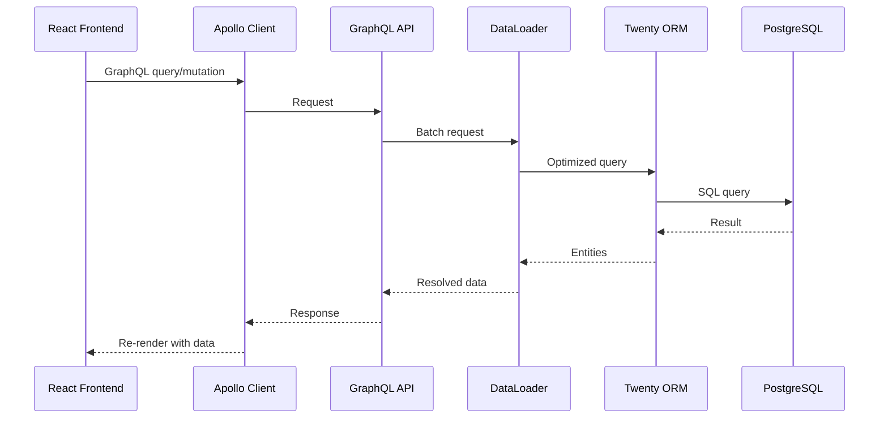

# CMS Platforms Exploration

## Overview

This exploration covers 6 CMS and backend platforms located in `/home/darkvoid/Boxxed/@formulas/Others/src.CMS/`. The directory contains a diverse set of content management and backend solutions ranging from headless CMS platforms to full backend-as-a-service solutions.

**Projects Explored:**

| Project | Type | Primary Language | Description |
|---------|------|------------------|-------------|
| Supabase | Backend-as-a-Service | TypeScript, Elixir, Rust | Open-source Firebase alternative with PostgreSQL, real-time, auth, and storage |
| PayloadCMS | Headless CMS | TypeScript | Developer-first CMS with React admin panel and GraphQL/REST APIs |
| Twenty | CRM | TypeScript | Open-source CRM alternative to Salesforce |
| MedusaJS | E-commerce Platform | TypeScript | Headless commerce platform with modular architecture |
| APITable | Collaborative Database | TypeScript, Rust | Airtable-like spreadsheet-database hybrid |
| Docsify | Documentation CMS | JavaScript | Markdown-based documentation generator |

---

## Repository Information

### Supabase
- **Location:** `/home/darkvoid/Boxxed/@formulas/Others/src.CMS/src.supabase/`
- **Remote:** https://github.com/supabase/supabase.git
- **License:** Apache 2.0
- **Package Manager:** npm/yarn with Turbo monorepo

### PayloadCMS
- **Location:** `/home/darkvoid/Boxxed/@formulas/Others/src.CMS/src.payloadcms/`
- **Remote:** https://github.com/payloadcms/payload.git
- **License:** MIT
- **Package Manager:** pnpm with Turbo monorepo

### Twenty
- **Location:** `/home/darkvoid/Boxxed/@formulas/Others/src.CMS/twenty/`
- **Remote:** https://github.com/twentyhq/twenty.git
- **License:** AGPL-3.0
- **Package Manager:** Yarn 4.0.2 with Nx monorepo

### MedusaJS
- **Location:** `/home/darkvoid/Boxxed/@formulas/Others/src.CMS/src.medusajs/`
- **Remote:** https://github.com/medusajs/medusa.git
- **License:** MIT
- **Package Manager:** Yarn 3.2.1 with Turbo monorepo

---

## Directory Structures

### Supabase Architecture

```
src.supabase/
├── supabase/                    # Main monorepo (Next.js + React)
│   ├── apps/
│   │   ├── studio/              # Database management UI (Next.js)
│   │   ├── docs/                # Documentation site
│   │   ├── www/                 # Marketing website
│   │   └── database-new/        # Database design tool
│   ├── packages/                # Shared packages
│   │   ├── pg-meta/             # PostgreSQL metadata API
│   │   ├── shared-types/        # Shared TypeScript types
│   │   └── ui/                  # Shared UI components
│   ├── playwright-tests/        # E2E tests
│   └── docker/                  # Docker configurations
├── postgres/                    # PostgreSQL distribution
│   ├── docker/
│   ├── migrations/              # Database migrations
│   ├── rfcs/                    # Request for comments
│   └── testinfra/               # Infrastructure tests
├── realtime/                    # Real-time server (Elixir/Phoenix)
│   ├── lib/                     # Elixir source code
│   ├── test/
│   └── rel/                     # Release configuration
├── realtime-js/                 # Real-time JavaScript client
│   └── src/
├── edge-runtime/                # Edge Functions runtime (Rust/Deno)
│   ├── crates/                  # Rust crates
│   ├── examples/                # Example edge functions
│   └── scripts/
└── tests/                       # Integration tests
```

**Key Annotations:**
- `supabase/studio/` - The database management UI built with Next.js, React, and MobX
- `postgres/` - Custom PostgreSQL distribution with extensions
- `realtime/` - Elixir-based Phoenix server handling WebSocket connections for real-time subscriptions
- `edge-runtime/` - Rust-based Deno runtime for edge functions

### PayloadCMS Architecture

```
src.payloadcms/
├── payload/                     # Main monorepo
│   ├── packages/
│   │   ├── payload/             # Core Payload CMS
│   │   │   ├── src/
│   │   │   │   ├── admin/       # React admin panel
│   │   │   │   ├── auth/        # Authentication system
│   │   │   │   ├── collections/ # Collection operations
│   │   │   │   ├── config/      # Configuration system
│   │   │   │   ├── database/    # Database adapters
│   │   │   │   ├── email/       # Email functionality
│   │   │   │   ├── express/     # Express middleware
│   │   │   │   ├── fields/      # Field types
│   │   │   │   ├── globals/     # Global configuration
│   │   │   │   ├── graphql/     # GraphQL schema generation
│   │   │   │   ├── initHTTP/    # HTTP initialization
│   │   │   │   ├── local-api/   # Local API for serverless
│   │   │   │   ├── uploads/     # File upload handling
│   │   │   │   ├── utilities/   # Utility functions
│   │   │   │   └── versions/    # Versioning system
│   │   │   └── test/            # Test suite
│   │   ├── db-mongodb/          # MongoDB adapter
│   │   ├── db-postgres/         # PostgreSQL adapter (Drizzle ORM)
│   │   ├── richtext-lexical/    # Lexical rich text editor
│   │   ├── richtext-slate/      # Slate rich text editor
│   │   ├── plugin-cloud/        # Cloud hosting plugin
│   │   ├── plugin-cloud-storage/# Cloud storage plugin
│   │   ├── plugin-form-builder/ # Form builder plugin
│   │   ├── plugin-seo/          # SEO plugin
│   │   ├── plugin-stripe/       # Stripe integration
│   │   ├── plugin-search/       # Search plugin
│   │   └── live-preview/        # Live preview hooks
│   ├── examples/                # Example implementations
│   └── templates/               # Project templates
├── payload-3.0-demo/            # Demo application for v3.0
├── website/                     # Payload marketing site
└── website-cms/                 # Website CMS instance
```

**Key Annotations:**
- `payload/packages/payload/src/` - Core CMS functionality
- `payload/packages/db-postgres/` - PostgreSQL adapter using Drizzle ORM
- `payload/packages/richtext-lexical/` - Modern Lexical-based rich text editor
- `payload/packages/plugin-*` - Extensible plugin system

### Twenty CRM Architecture

```
twenty/
├── packages/
│   ├── twenty-server/           # Backend server (NestJS)
│   │   ├── src/
│   │   │   ├── command/         # CLI commands
│   │   │   ├── database/        # Database layer (TypeORM)
│   │   │   ├── engine/          # Core engine
│   │   │   │   ├── api/         # API layer (GraphQL)
│   │   │   │   ├── constants/
│   │   │   │   ├── core-modules/# Core business modules
│   │   │   │   ├── dataloaders/ # GraphQL dataloaders
│   │   │   │   ├── decorators/
│   │   │   │   ├── guards/      # Authentication guards
│   │   │   │   ├── integrations/# External integrations
│   │   │   │   ├── metadata-modules/
│   │   │   │   ├── middlewares/
│   │   │   │   ├── strategies/  # Authentication strategies
│   │   │   │   ├── twenty-orm/  # Custom ORM layer
│   │   │   │   ├── workspace-datasource/
│   │   │   │   └── workspace-manager/
│   │   │   ├── modules/         # Feature modules
│   │   │   │   ├── activity/
│   │   │   │   ├── api-key/
│   │   │   │   ├── attachment/
│   │   │   │   ├── calendar/
│   │   │   │   ├── company/
│   │   │   │   ├── messaging/
│   │   │   │   ├── opportunity/
│   │   │   │   ├── person/
│   │   │   │   └── webhook/
│   │   │   └── queue-worker/    # Background job processor
│   │   └── test/
│   ├── twenty-front/            # Frontend (React)
│   │   ├── src/
│   │   │   ├── config/          # Configuration
│   │   │   ├── generated/       # Generated GraphQL types
│   │   │   ├── hooks/           # React hooks
│   │   │   ├── modules/         # Feature modules
│   │   │   │   ├── accounts/
│   │   │   │   ├── activities/
│   │   │   │   ├── analytics/
│   │   │   │   ├── apollo/      # Apollo GraphQL client
│   │   │   │   ├── attachments/
│   │   │   │   ├── auth/
│   │   │   │   ├── client-config/
│   │   │   │   └── ...
│   │   │   └── generated-metadata/
│   │   └── public/
│   ├── twenty-ui/               # Shared UI components
│   ├── twenty-emails/           # Email templates
│   ├── twenty-docs/             # Documentation (Docusaurus)
│   ├── twenty-website/          # Marketing website
│   ├── twenty-chrome-extension/ # Browser extension
│   ├── twenty-zapier/           # Zapier integration
│   └── twenty-postgres/         # PostgreSQL distribution
└── tools/
    └── eslint-rules/            # Custom ESLint rules
```

### MedusaJS Architecture

```
src.medusajs/
├── medusa/                      # Main monorepo
│   ├── packages/
│   │   ├── medusa/              # Core Medusa backend
│   │   ├── medusa-js/           # JavaScript client
│   │   ├── medusa-react/        # React hooks library
│   │   ├── generated/           # Generated types
│   │   └── oas/                 # OpenAPI specifications
│   ├── integration-tests/       # Integration test suites
│   ├── docs-util/               # Documentation utilities
│   ├── www/                     # Documentation site
│   └── scripts/
├── ui/                          # UI component library
├── product-module-demo/         # Product module demonstration
└── vercel-commerce/             # Vercel commerce template
```

### Docsify Architecture

```
src.docsify/
├── docsify/                     # Core documentation generator
│   ├── src/
│   │   ├── core/
│   │   │   ├── event/           # Event system
│   │   │   ├── fetch/           # Markdown fetching
│   │   │   ├── init/            # Initialization
│   │   │   ├── render/          # Markdown rendering
│   │   │   ├── router/          # Client-side routing
│   │   │   ├── util/            # Utilities
│   │   │   └── virtual-routes/  # Virtual routing
│   │   ├── plugins/
│   │   │   ├── front-matter/    # Front matter parsing
│   │   │   └── search/          # Search functionality
│   │   └── themes/
│   │       ├── addons/          # Theme addons
│   │       └── shared/          # Shared theme styles
│   ├── test/
│   └── docs/
├── docsify-cli/                 # CLI tool
└── docsify-template/            # Template projects
```

---

## Architecture

### High-Level System Diagram

```mermaid
graph TB
    subgraph Supabase["Supabase - Backend as a Service"]
        S_Studio[Studio UI<br/>Next.js]
        S_Edge[Edge Runtime<br/>Rust/Deno]
        S_Realtime[Realtime Server<br/>Elixir/Phoenix]
        S_Postgres[PostgreSQL<br/>with extensions]
        S_Meta[PG Meta API<br/>PostgreSQL metadata]
    end

    subgraph PayloadCMS["PayloadCMS - Headless CMS"]
        P_Admin[React Admin Panel]
        P_Core[Core CMS Engine]
        P_GraphQL[GraphQL API]
        P_REST[REST API]
        P_Local[Local API]
        P_DB[(Database<br/>MongoDB/Postgres)]
    end

    subgraph Twenty["Twenty - Open Source CRM"]
        T_Front[React Frontend]
        T_NestJS[NestJS Backend]
        T_GraphQL[GraphQL API]
        T_ORM[Custom ORM Layer]
        T_Modules[CRM Modules]
        T_Postgres[(PostgreSQL)]
    end

    subgraph Medusa["MedusaJS - Headless Commerce"]
        M_Core[Core Commerce Engine]
        M_Modules[Commerce Modules]
        M_Admin[Admin Dashboard]
        M_Store[Store API]
        M_Postgres[(PostgreSQL)]
    end

    S_Studio --> S_Meta
    S_Meta --> S_Postgres
    S_Edge --> S_Postgres
    S_Realtime --> S_Postgres

    P_Admin --> P_Core
    P_Core --> P_GraphQL
    P_Core --> P_REST
    P_Core --> P_Local
    P_Core --> P_DB

    T_Front --> T_GraphQL
    T_GraphQL --> T_NestJS
    T_NestJS --> T_ORM
    T_ORM --> T_Modules
    T_Modules --> T_Postgres

    M_Core --> M_Modules
    M_Core --> M_Admin
    M_Core --> M_Store
    M_Store --> M_Postgres
```



### Supabase Architecture Deep Dive



**Key Components:**

1. **PostgreSQL Core** - Custom PostgreSQL distribution with extensions like pg_cron, pgvector, wal2json
2. **PostgREST** - Auto-generates REST API from database schema
3. **Realtime** - Elixir-based Phoenix server for WebSocket subscriptions to database changes
4. **GoTrue** - Authentication service with JWT-based auth
5. **Storage API** - S3-compatible object storage with database integration
6. **Edge Runtime** - Deno-based serverless functions runtime
7. **Studio** - Next.js-based database management UI

### PayloadCMS Content Modeling Architecture



**Content Modeling Flow:**

1. Developer defines collections with fields in TypeScript config
2. Payload builds database schema automatically
3. GraphQL schema auto-generated from collection definitions
4. REST endpoints created for each collection
5. Admin UI panels generated based on field types
6. Access control rules applied at operation level
7. Hooks execute before/after database operations

### Twenty CRM Data Model



### MedusaJS E-commerce Architecture



---

## Component Breakdown

### Supabase Components

#### Supabase Studio
- **Location:** `src.supabase/supabase/apps/studio/`
- **Purpose:** Database management interface
- **Technology:** Next.js, React, MobX, Monaco Editor
- **Dependencies:**
  - `@supabase/pg-meta` - PostgreSQL metadata API client
  - `@graphiql/react` - GraphQL IDE integration
  - `@monaco-editor/react` - SQL editor
  - `react-data-grid` - Data table viewer

#### Supabase Realtime
- **Location:** `src.supabase/realtime/`
- **Purpose:** WebSocket server for real-time database subscriptions
- **Technology:** Elixir, Phoenix Framework
- **Key Dependencies:**
  - `phoenix` v1.7.0 - Web framework
  - `phoenix_live_view` v0.18.3 - Real-time views
  - `postgrex` - PostgreSQL driver
  - `joken` - JWT handling
  - `syn` - Cluster process registry

#### Edge Runtime
- **Location:** `src.supabase/edge-runtime/`
- **Purpose:** Serverless functions runtime
- **Technology:** Rust, Deno
- **Architecture:**
  - Uses Deno's V8 isolate for function execution
  - Rust crates for performance-critical operations
  - Support for npm packages via import maps

### PayloadCMS Components

#### Core CMS Engine
- **Location:** `src.payloadcms/payload/packages/payload/src/`
- **Purpose:** Main CMS functionality
- **Key Modules:**
  - `config/` - Configuration parsing and validation
  - `collections/` - Collection CRUD operations
  - `globals/` - Global document handling
  - `auth/` - Authentication system
  - `fields/` - Field type definitions
  - `graphql/` - GraphQL schema generation
  - `admin/` - React admin panel

#### Database Adapters
- **Location:** `src.payloadcms/payload/packages/db-mongodb/` and `db-postgres/`
- **Purpose:** Database abstraction layer
- **PostgreSQL Adapter:**
  - Uses Drizzle ORM for type-safe queries
  - Automatic schema migration
  - Support for relationships and joins

#### Plugin System
- **Location:** `src.payloadcms/payload/packages/plugin-*/`
- **Available Plugins:**
  - `plugin-cloud` - Cloud hosting
  - `plugin-seo` - SEO meta tags
  - `plugin-form-builder` - Form building
  - `plugin-stripe` - Stripe integration
  - `plugin-search` - Full-text search

### Twenty Components

#### Server (NestJS)
- **Location:** `twenty/packages/twenty-server/src/`
- **Purpose:** Backend API server
- **Architecture:**
  - NestJS framework with GraphQL
  - Custom ORM layer on top of TypeORM
  - Workspace-based multi-tenancy
  - Module-based feature organization

#### Frontend (React)
- **Location:** `twenty/packages/twenty-front/src/`
- **Purpose:** CRM user interface
- **Technology:**
  - React with Recoil state management
  - Apollo GraphQL client
  - Custom UI component library
  - Module-based architecture matching backend

#### Core Modules
- **Location:** `twenty/packages/twenty-server/src/modules/`
- **Modules:**
  - `activity/` - Activity tracking
  - `company/` - Company management
  - `person/` - Contact management
  - `opportunity/` - Deal tracking
  - `calendar/` - Calendar integration
  - `messaging/` - Email integration

### MedusaJS Components

#### Core Commerce Engine
- **Location:** `src.medusajs/medusa/packages/medusa/`
- **Purpose:** E-commerce backend
- **Key Features:**
  - Modular service architecture
  - Event-driven design
  - Plugin system for extensions

---

## Entry Points

### Supabase Entry Points

#### Studio (Next.js App)
- **File:** `src.supabase/supabase/apps/studio/pages/_app.tsx`
- **Execution:**
  1. Next.js initializes React app
  2. Authentication check via Supabase client
  3. Load project list and settings
  4. Render main layout with navigation

#### Realtime Server
- **File:** `src.supabase/realtime/lib/realtime.ex`
- **Execution:**
  1. Phoenix application starts
  2. Connects to PostgreSQL via Replication slot
  3. Listens for WAL changes
  4. Broadcasts changes to subscribed WebSocket clients

#### Edge Runtime
- **File:** `src.supabase/edge-runtime/crates/sb_worker_context/mod.rs`
- **Execution:**
  1. HTTP request received
  2. Isolate created for function execution
  3. User code loaded and executed
  4. Response returned

### PayloadCMS Entry Points

#### Main Payload Class
- **File:** `src.payloadcms/payload/packages/payload/src/index.ts`
- **Entry Point:** `Payload.init()`
- **Execution Flow:**
  1. Load configuration file
  2. Initialize database adapter
  3. Build collections and globals
  4. Generate GraphQL schema
  5. Register REST routes
  6. Execute `onInit` callback
  7. Return initialized payload instance

#### Express Server Integration
- **File:** `src.payloadcms/payload/packages/payload/src/initHTTP.ts`
- **Execution:**
  1. Create Express app (if not provided)
  2. Mount Payload routes
  3. Setup admin UI static files
  4. Initialize GraphQL endpoint
  5. Start server

### Twenty Entry Points

#### Server (NestJS)
- **File:** `twenty/packages/twenty-server/src/main.ts`
- **Execution:**
  1. Create NestJS application
  2. Initialize TypeORM connections
  3. Load all modules dynamically
  4. Start GraphQL server
  5. Start queue workers
  6. Run health checks

#### Frontend (React)
- **File:** `twenty/packages/twenty-front/src/index.tsx`
- **Execution:**
  1. Initialize Apollo client
  2. Setup Recoil state
  3. Render root component
  4. Load user preferences
  5. Fetch initial data

### MedusaJS Entry Points

#### Core Server
- **File:** `src.medusajs/medusa/packages/medusa/src/index.ts`
- **Execution:**
  1. Load medusa config
  2. Initialize all modules
  3. Register event subscribers
  4. Start Express server
  5. Load plugins

---

## Data Flow

### Supabase Data Flow



### PayloadCMS Data Flow



### Twenty CRM Data Flow



---

## External Dependencies

### Supabase Dependencies

| Dependency | Version | Purpose |
|------------|---------|---------|
| next | ^14.1.4 | React framework for Studio |
| phoenix | ~1.7.0 | Elixir web framework (Realtime) |
| deno_core | 0.256.0 | JavaScript runtime for Edge Functions |
| postgrex | ~0.16.3 | PostgreSQL driver for Elixir |
| mobx | ^6.10.2 | State management for Studio |
| @monaco-editor/react | ^4.6.0 | Code editor component |
| react-data-grid | 7.0.0-beta.41 | Data table component |

### PayloadCMS Dependencies

| Dependency | Version | Purpose |
|------------|---------|---------|
| express | 4.18.2 | Web server framework |
| graphql | 16.8.0 | GraphQL implementation |
| drizzle-orm | 0.29.3 | PostgreSQL ORM |
| mongoose | Latest | MongoDB ODM |
| react | 18.2.0 | Admin UI framework |
| slate | 0.91.4 | Rich text editor |
| lexical | 0.13.1 | Alternative rich text editor |
| ts-node | 10.9.2 | TypeScript execution |

### Twenty Dependencies

| Dependency | Version | Purpose |
|------------|---------|---------|
| @nestjs/core | ^9.0.0 | Backend framework |
| @nestjs/graphql | ^11.0.5 | GraphQL integration |
| typeorm | 0.3.17 | Database ORM |
| apollo/client | ^3.7.17 | GraphQL client |
| react | ^18.2.0 | Frontend framework |
| recoil | ^0.7.7 | State management |
| framer-motion | ^10.12.17 | Animations |
| @tabler/icons-react | ^2.44.0 | Icon library |

### MedusaJS Dependencies

| Dependency | Version | Purpose |
|------------|---------|---------|
| express | ^4.17.1 | Web server |
| typeorm | ^0.3.16 | Database ORM |
| ioredis | ^5.2.4 | Redis client |
| @medusajs/modules | Various | Commerce modules |
| ulid | ^2.3.0 | ID generation |
| medusa-react | Latest | React hooks library |

---

## Configuration

### Supabase Configuration

**Environment Variables:**
- `POSTGRES_PASSWORD` - Database password
- `JWT_SECRET` - Secret for JWT tokens
- `ANON_KEY` - Anonymous API key
- `SERVICE_ROLE_KEY` - Service role API key
- `SITE_URL` - Studio URL

**Configuration Files:**
- `supabase/config.toml` - Supabase project configuration
- `docker/docker-compose.yml` - Local development setup
- `turbo.json` - Monorepo build configuration

### PayloadCMS Configuration

**Configuration File (payload.config.ts):**
```typescript
import { buildConfig } from 'payload/config'

export default buildConfig({
  serverURL: process.env.PAYLOAD_PUBLIC_SERVER_URL,
  collections: [/* collection definitions */],
  globals: [/* global definitions */],
  admin: {
    user: 'users',
    meta: { /* meta tags */ },
  },
  typescript: {
    outputFile: 'src/payload-types.ts',
  },
})
```

**Environment Variables:**
- `PAYLOAD_SECRET` - Encryption secret
- `MONGODB_URI` or `DATABASE_URI` - Database connection
- `PAYLOAD_PUBLIC_SERVER_URL` - Public server URL

### Twenty Configuration

**Configuration Files:**
- `nx.json` - Nx monorepo configuration
- `twenty-server/.env` - Server environment
- `twenty-front/.env` - Frontend environment

**Environment Variables:**
- `DATABASE_URL` - PostgreSQL connection string
- `REDIS_URL` - Redis connection for caching
- `JWT_SECRET` - JWT signing secret
- `SERVER_URL` - Backend API URL
- `FRONT_URL` - Frontend URL

---

## Testing Strategies

### Supabase Testing

- **Unit Tests:** Jest for TypeScript code, ExUnit for Elixir
- **Integration Tests:** Playwright for E2E testing
- **Infrastructure Tests:** Python-based testinfra
- **Performance Tests:** Apache Bench (`ab`) for load testing

**Test Commands:**
```bash
npm run test:studio     # Studio tests
npm run test:playwright # E2E tests
npm run perf:kong       # API performance tests
```

### PayloadCMS Testing

- **Unit Tests:** Jest for core functionality
- **Component Tests:** React Testing Library
- **E2E Tests:** Playwright
- **Database Tests:** MongoDB Memory Server for isolation

**Test Commands:**
```bash
pnpm test              # Run all tests
pnpm test:int          # Integration tests
pnpm test:components   # Component tests
pnpm test:e2e          # E2E tests
```

### Twenty Testing

- **Unit Tests:** Jest with ts-jest
- **Component Tests:** Storybook with testing addons
- **E2E Tests:** Playwright
- **Visual Tests:** Chromatic for visual regression

**Test Commands:**
```bash
yarn nx test twenty-server
yarn nx test twenty-front
yarn nx run twenty-front:test:e2e
```

### MedusaJS Testing

- **Integration Tests:** Jest with TypeORM test utils
- **API Tests:** Supertest for HTTP endpoints
- **Module Tests:** Isolated module testing

**Test Commands:**
```bash
yarn test                          # All tests
yarn test:integration:packages     # Package integration tests
yarn test:integration:api          # API integration tests
```

---

## Key Insights

### Architecture Patterns

1. **Monorepo Pattern** - All projects use monorepo structure (Turbo or Nx) for code sharing and version management

2. **Plugin Architecture** - PayloadCMS and MedusaJS both use plugin systems for extensibility

3. **Type Safety** - Heavy use of TypeScript with generated types from schemas (GraphQL, database)

4. **Multi-language Systems** - Supabase uses TypeScript, Elixir, and Rust for different concerns

5. **API-First Design** - All platforms expose GraphQL and/or REST APIs as primary interface

6. **Multi-tenancy** - Twenty implements workspace-based multi-tenancy at the data layer

7. **Real-time by Default** - Supabase realtime uses PostgreSQL replication for instant updates

### Technology Choices

1. **Next.js** - Chosen for Supabase Studio and many demo apps (SSR, API routes)

2. **NestJS** - Twenty's choice for structured, Angular-like backend architecture

3. **GraphQL** - Universal choice for API layer across all platforms

4. **TypeORM/Drizzle** - ORMs chosen for type-safe database access

5. **Phoenix/Elixir** - Supabase realtime leverages Erlang VM for concurrency

6. **Deno** - Supabase edge functions use Deno for secure sandboxing

### Performance Considerations

1. **DataLoader Pattern** - Twenty uses DataLoader for N+1 query prevention

2. **Connection Pooling** - All platforms implement database connection pooling

3. **Caching** - Redis used for caching in Twenty and session management

4. **Isolate-based Execution** - Supabase edge functions use V8 isolates for cold start optimization

### Developer Experience

1. **Auto-generated Types** - All platforms generate TypeScript types from schemas

2. **Hot Reloading** - Development servers support hot module replacement

3. **Local Development** - Docker Compose setups for local testing

4. **CLI Tools** - Each platform provides CLI for common operations

---

## Open Questions

1. **Supabase Multi-region** - How does Supabase handle multi-region deployments and data residency requirements?

2. **PayloadCMS Scalability** - What are the recommended scaling patterns for high-traffic PayloadCMS deployments?

3. **Twenty Migration Path** - What is the migration strategy from existing CRM systems (Salesforce, HubSpot)?

4. **Medusa Module Communication** - How do Medusa modules communicate in distributed deployments?

5. **Real-time Scaling** - How does Supabase realtime handle connection scaling beyond single-node limits?

6. **Plugin Compatibility** - How are plugin version compatibilities managed across PayloadCMS major versions?

7. **Data Export** - What are the data portability options for each platform?

8. **Security Auditing** - What security audit mechanisms are built into each platform?

9. **Custom Authentication** - How extensible is the authentication system in each platform?

10. **Edge Function Limits** - What are the resource limits and timeout configurations for Supabase edge functions?

---

## Comparison Summary

| Feature | Supabase | PayloadCMS | Twenty | MedusaJS |
|---------|----------|------------|--------|----------|
| Primary Use | BaaS | Headless CMS | CRM | E-commerce |
| Database | PostgreSQL | MongoDB/Postgres | PostgreSQL | PostgreSQL |
| Real-time | Yes (built-in) | Via webhooks | Via GraphQL subscriptions | Via events |
| Auth | Built-in | Plugin | Built-in | Plugin |
| File Storage | Built-in | Built-in/Plugin | Plugin | Plugin |
| Admin UI | Database-focused | Content-focused | CRM-focused | Commerce-focused |
| Self-hosted | Yes | Yes | Yes | Yes |
| Cloud Option | Yes (supabase.com) | Yes (payloadcms.com) | Yes (twenty.com) | Yes (medusajs.com) |

---

This exploration provides a foundation for understanding the architecture, components, and relationships within these CMS and backend platforms. Each platform offers unique strengths: Supabase for full-stack backend services, PayloadCMS for developer-first content management, Twenty for CRM functionality, and MedusaJS for headless commerce.
