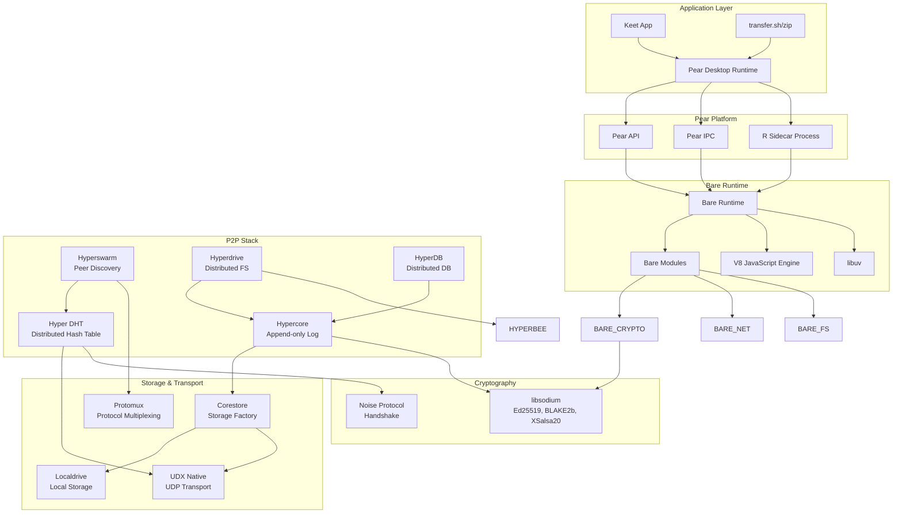
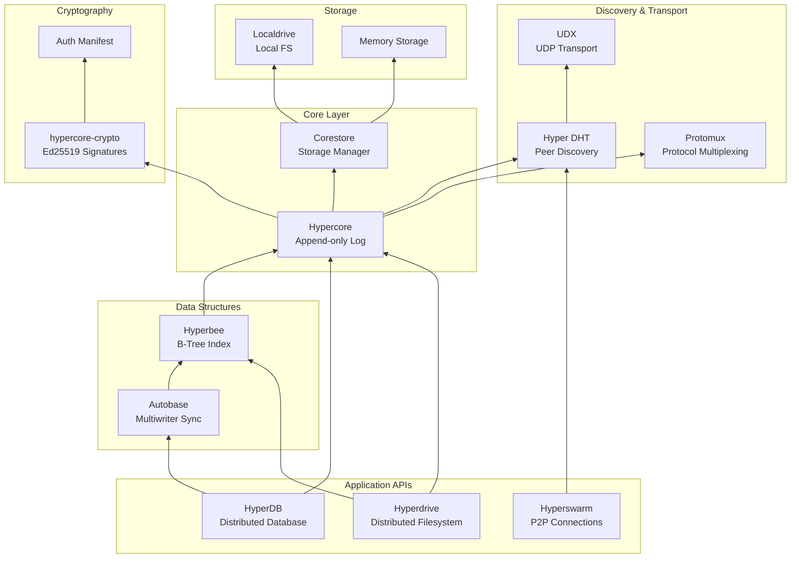
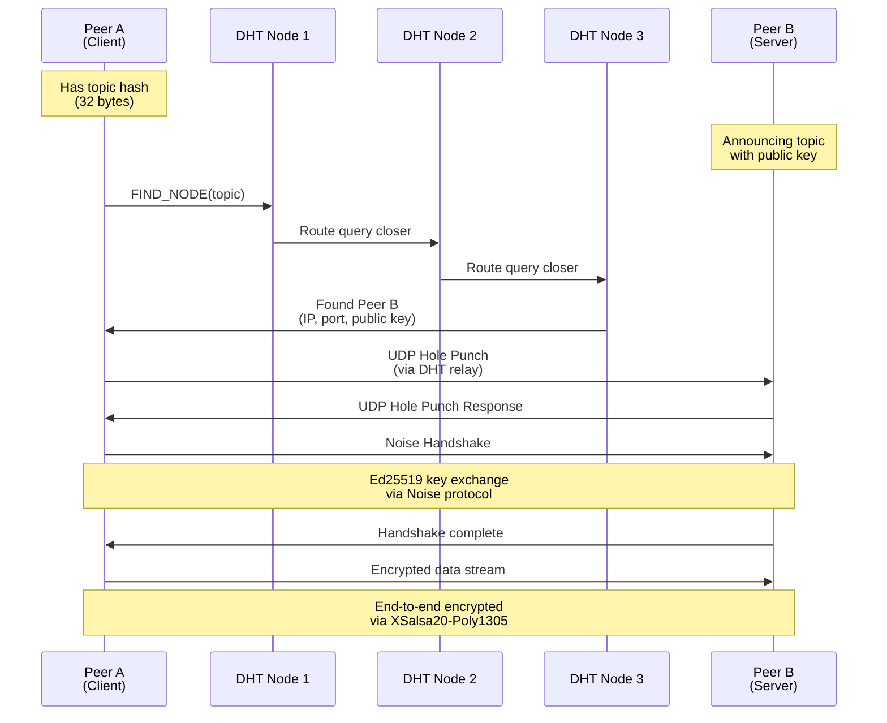
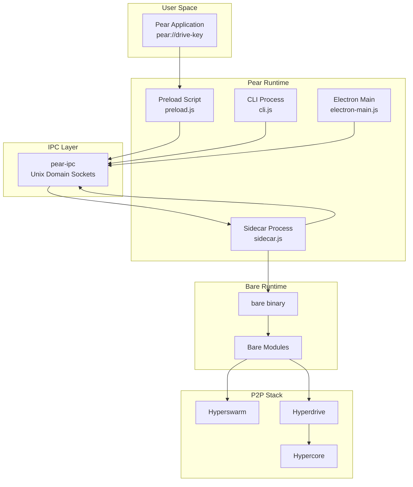
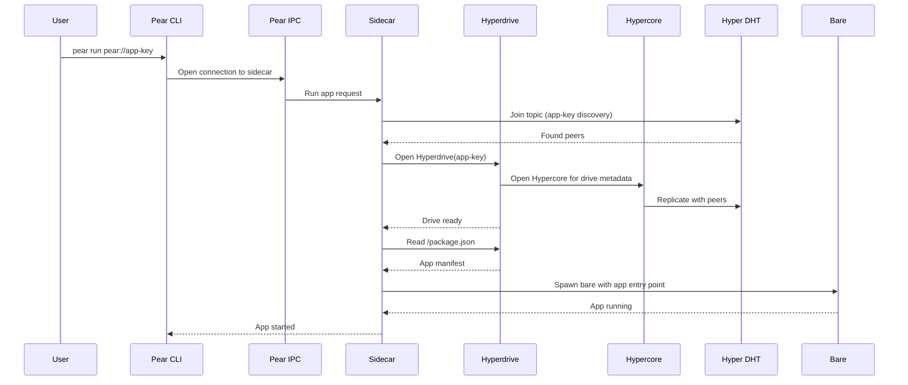

# CloudHosting Exploration: Hypercore/Pear/Bare Ecosystem

## Overview

This directory contains 67+ projects from the **Holepunch** (formerly Hypercore/Protocol Labs) ecosystem - a comprehensive peer-to-peer (P2P) stack enabling decentralized applications. The ecosystem is built around three pillars:

1. **Hypercore Stack** - The foundational P2P data layer providing cryptographically signed, append-only logs that replicate across peers without requiring trust in any single node.

2. **Bare Runtime** - A minimal, embeddable JavaScript runtime built on V8 and libuv, designed for cross-platform deployment including mobile (iOS/Android), desktop (Windows/macOS/Linux), and embedded systems.

3. **Pear Platform** - A desktop application platform and runtime built on top of Bare, providing APIs for building and distributing decentralized applications with automatic updates, secure IPC, and built-in P2P capabilities.

The cryptographic authenticity model is central to this stack: every Hypercore is identified by a public key (derived from an Ed25519 keypair), and every block of data is signed with the corresponding secret key. Peers can verify the integrity of any data they receive without trusting the source. Peer discovery happens via a distributed hash table (DHT) where peers announce their presence using topic hashes, enabling serverless connectivity even behind NATs via UDP holepunching.

## Repository

- **Location:** `/home/darkvoid/Boxxed/@formulas/src.CloudHosting`
- **Remote:** N/A - Local filesystem mirror (not a git repository)
- **Primary Language:** JavaScript (ES5/ES6), with C/C++ native bindings and some Rust components
- **License:** MIT (Hypercore modules), Apache-2.0 (Pear, Bare)

## Directory Structure

```
/home/darkvoid/Boxxed/@formulas/src.CloudHosting/
├── # Core P2P Stack (Hypercore Protocol)
├── hypercore/                    # Append-only log with cryptographic authenticity [CORE]
│   ├── index.js                  # Main Hypercore class
│   ├── lib/
│   │   ├── core.js               # Core storage abstraction
│   │   ├── merkle-tree.js        # Merkle tree for integrity verification
│   │   ├── verifier.js           # Signature verification using Ed25519
│   │   ├── replicator.js         # Block replication logic
│   │   └── streams.js            # Read/Write stream implementations
│   ├── test/
│   └── package.json              # Dependencies: hypercore-crypto, hyperdht, protomux
│
├── hyperdb/                      # Distributed database on hypercore (multiwriter)
│   ├── index.js
│   └── package.json
│
├── hyperdrive/                   # Distributed filesystem on hypercore [CORE]
│   ├── index.js                  # Hyperdrive class - file operations
│   ├── lib/
│   └── package.json              # Dependencies: hyperbee, hyperblobs, hypercore
│
├── hyperswarm/                   # P2P connection layer for finding peers [CORE]
│   ├── index.js                  # Hyperswarm class - topic-based discovery
│   ├── lib/
│   │   ├── peer-discovery.js     # Manages topic announcements
│   │   ├── peer-info.js          # Peer metadata and connection state
│   │   └── connection-set.js     # Active connection management
│   └── package.json              # Dependencies: hyperdht, shuffled-priority-queue
│
├── hyperdht/                     # Distributed Hash Table for peer discovery [CORE]
│   ├── index.js                  # DHT node implementation
│   ├── lib/
│   ├── bin.js                    # CLI for DHT operations
│   ├── testnet.js                # Local testnet for development
│   └── package.json              # Dependencies: dht-rpc, noise-handshake, noise-curve-ed
│
├── hyperbee/                     # Append-only B-tree on hypercore (key-value store)
│   ├── index.js
│   ├── iterators/
│   └── package.json
│
├── autobase/                     # Multiwriter database with conflict resolution
│   ├── index.js
│   ├── DESIGN.md                 # Architecture documentation
│   ├── lib/
│   └── package.json              # Dependencies: hyperbee, hypercore
│
├── corestore/                    # Storage layer factory for managing multiple hypercores
│   ├── index.js
│   ├── lib/
│   └── package.json              # Dependencies: hypercore, hypercore-crypto
│
├── localdrive/                   # Local filesystem storage driver
│   └── index.js
│
├── mirror-drive/                 # Drive synchronization utilities
│   └── index.js
│
├── # Pear Runtime (Desktop Application Platform)
├── pear/                         # Main Pear runtime and CLI [CORE]
│   ├── boot.js                   # Bootstrapper - routes to sidecar/cli/electron
│   ├── cli.js                    # CLI entry point
│   ├── sidecar.js                # Background process manager
│   ├── electron-main.js          # Electron main process
│   ├── preload.js                # Electron preload script
│   ├── run.js                    # Application runner
│   ├── index.js                  # Main entry point
│   ├── cmd/                      # CLI commands (create, run, seed, etc.)
│   ├── lib/
│   │   ├── crasher.js            # Crash reporting and recovery
│   │   ├── tryboot.js            # Runtime bootstrapping logic
│   │   └── parse-link.js         # pear:// URL parser
│   ├── constants.js              # Platform paths and configuration
│   ├── ARCHITECTURE.md           # Runtime architecture documentation
│   └── package.json              # 60+ dependencies including all core stack
│
├── pear-api/                     # Pear API definitions and interfaces
│   └── index.js
│
├── pear-desktop/                 # Desktop application shell
│   └── (Electron-based UI)
│
├── pear-ipc/                     # Inter-process communication library
│   └── index.js                  # IPC client/server over Unix sockets
│
├── pear-runtime-bare/            # Runtime configuration for bare systems
│   └── (Configuration and build scripts)
│
├── libpear/                      # Core Pear library (C/C++ bindings)
│   ├── src/
│   ├── include/
│   └── CMakeLists.txt
│
├── # Bare Runtime (Minimal JavaScript Runtime)
├── bare/                         # Main Bare runtime [CORE]
│   ├── src/
│   │   ├── bare.c                # Main runtime C code
│   │   ├── runtime.c             # V8 runtime integration
│   │   ├── addon.c               # Native addon loading
│   │   ├── thread.c              # Lightweight thread support
│   │   └── *.h                   # Header files
│   ├── include/bare.h            # C API header
│   ├── CMakeLists.txt            # Build configuration
│   ├── package.json              # NPM wrapper for native binary
│   └── README.md                 # Comprehensive documentation
│
├── bare-runtime/                 # Core runtime components
│   └── (Runtime shared libraries)
│
├── bare-node/                    # Node.js compatibility layer
│   └── (Shims for Node.js APIs)
│
├── bare-* Modules (40+ modules):
│   ├── bare-async-hooks/         # Async lifecycle hooks
│   ├── bare-buffer/              # Buffer implementation
│   ├── bare-console/             # Console API
│   ├── bare-crypto/              # Cryptographic primitives (libsodium)
│   ├── bare-events/              # Event emitter
│   ├── bare-fetch/               # Fetch API
│   ├── bare-fs/                  # Filesystem access
│   ├── bare-http1/               # HTTP/1.1 server/client
│   ├── bare-https/               # HTTPS support
│   ├── bare-inspect/             # Object inspection
│   ├── bare-ipc/                 # IPC primitives
│   ├── bare-module/              # Module loading (CJS/ESM)
│   ├── bare-module-lexer/        # ESM lexer (Rust)
│   ├── bare-net/                 # TCP/IPC networking
│   ├── bare-os/                  # OS utilities
│   ├── bare-path/                # Path utilities
│   ├── bare-pipe/                # Pipe I/O
│   ├── bare-readline/            # Line editing for CLI
│   ├── bare-signals/             # Signal handling
│   ├── bare-stream/              # Stream primitives
│   ├── bare-subprocess/          # Child process spawning
│   ├── bare-tcp/                 # TCP sockets
│   ├── bare-timers/              # Timer functions
│   ├── bare-tls/                 # TLS streams
│   ├── bare-tty/                 # TTY handling
│   ├── bare-url/                 # URL parsing
│   ├── bare-vm/                  # Isolated JavaScript contexts
│   └── bare-zlib/                # Compression
│
├── # Supporting Infrastructure
├── hrpc/                         # RPC framework
│   └── index.js
│
├── libjs/                        # JavaScript engine (V8) bindings
│   └── (C/C++ V8 integration)
│
├── libudx/                       # UDX (UDP-based reliable transport)
│   └── (Native transport layer)
│
├── udx-native/                   # UDX Node.js/Bare bindings
│   └── index.js
│
├── # Applications
├── bare-expo/                    # Bare example Expo app (mobile)
│   └── app/
│
├── transfer.sh/                  # File sharing service
│   └── (P2P file transfer implementation)
│
├── transfer.zip/                 # Compressed file sharing
│   ├── transfer.zip-node/
│   └── transfer.zip-web/
│
├── # Utilities and Examples
├── brittle/                      # Test runner (like tape/tap)
│   └── index.js
│
├── iambus/                       # Event bus implementation
│   └── index.js
│
├── suspendify/                   # Suspension handling
│   └── index.js
│
├── task-backoff/                 # Backoff algorithm
│   └── index.js
│
└── # Additional Libraries
    ├── bare-addon-rust/          # Rust native addon example
    ├── bare-kit/                 # Development kit
    ├── bare-ffmpeg/              # FFmpeg bindings
    ├── bare-link/                # Linking utilities
    ├── bare-pack/                # Packaging tools
    ├── bip39-mnemonic/           # Mnemonic phrase utilities
    ├── hyperbeam/                # Streaming media
    ├── hyperdb-workshop/         # Educational materials
    ├── keet-mobile-releases/     # Keet mobile app builds
    ├── libappling/               # Application utilities
    ├── pear-bridge/              # Bridge components
    ├── pear-distributable-bootstrap/
    ├── pear-docs/
    ├── pear-electron/
    ├── pear-link/
    └── protomux-rpc-client/
```

## Architecture

### High-Level Stack Diagram



### Hypercore Stack Layers



### Peer Discovery Flow (DHT)



### Pear Runtime Architecture



## Component Breakdown

### Hypercore

- **Location:** `/home/darkvoid/Boxxed/@formulas/src.CloudHosting/hypercore`
- **Purpose:** Secure, distributed append-only log with cryptographic authenticity. Each Hypercore is identified by an Ed25519 public key, and every block is signed with the corresponding secret key.
- **Dependencies:** hypercore-crypto, hyperdht, protomux, streamx, sodium-universal, compact-encoding
- **Dependents:** Hyperdrive, HyperDB, Autobase, Corestore

**Key Properties:**
- **Cryptographic Authenticity:** Every block contains a Merkle tree hash and Ed25519 signature. Peers verify integrity without trusting sources.
- **Sparse Replication:** Download only blocks you need; Hypercore tracks which blocks are available locally vs. remotely.
- **Real-time Sync:** Get notified immediately when new blocks are appended by any writer.
- **Fork Detection:** If two writers append to the same key, forks are detected and tracked.
- **Block Encryption:** Optional per-block encryption using XSalsa20-Poly1305.

**Core API:**
```javascript
const core = new Hypercore(storage, key, options)
await core.append(Buffer.from('data'))  // Sign and append
const block = await core.get(index)      // Get and verify
const stream = core.replicate(isInitiator)  // P2P replication
```

### Hyperdrive

- **Location:** `/home/darkvoid/Boxxed/@formulas/src.CloudHosting/hyperdrive`
- **Purpose:** Distributed filesystem built on Hypercore. Provides POSIX-like file operations with versioning and sparse downloading.
- **Dependencies:** hyperbee (B-tree index), hyperblobs (large file storage), hypercore
- **Dependents:** Pear platform, transfer.sh applications

**Key Properties:**
- **File Versioning:** Every file change is tracked; can checkout any historical version.
- **Sparse Downloads:** Download only the files/directories you need, not the entire drive.
- **Atomic Updates:** Filesystem state is always consistent; partial writes are not visible.
- **Content-Addressed:** Files are identified by their Merkle tree root hash.

### Hyperswarm

- **Location:** `/home/darkvoid/Boxxed/@formulas/src.CloudHosting/hyperswarm`
- **Purpose:** High-level P2P connection management. Manages topic-based peer discovery and encrypted connections.
- **Dependencies:** hyperdht, shuffled-priority-queue, safety-catch
- **Dependents:** Pear, Hyperdrive replication, custom P2P apps

**Key API:**
```javascript
const swarm = new Hyperswarm({ keyPair })
swarm.on('connection', (socket, peerInfo) => {
  // E2E encrypted duplex stream
  socket.pipe(otherSocket).pipe(socket)
})
const discovery = swarm.join(topic, { server: true, client: true })
await discovery.flushed()  // Fully announced to DHT
```

### Hyper DHT

- **Location:** `/home/darkvoid/Boxxed/@formulas/src.CloudHosting/hyperdht`
- **Purpose:** Kademlia-like distributed hash table with UDP holepunching for NAT traversal.
- **Dependencies:** dht-rpc, noise-handshake, noise-curve-ed, bogon (IP validation)
- **Dependents:** Hyperswarm, direct DHT usage for custom discovery

**Key Properties:**
- **UDP Holepunching:** Establishes direct connections between peers behind NATs.
- **Noise Protocol:** End-to-end encrypted handshakes using Ed25519 keys.
- **Peer Routing:** Kademlia-style iterative routing to find nodes closest to a target hash.
- **Announce/Lookup:** Servers announce their public key at a topic hash; clients look up and connect.

### Bare Runtime

- **Location:** `/home/darkvoid/Boxxed/@formulas/src.CloudHosting/bare`
- **Purpose:** Minimal JavaScript runtime for cross-platform deployment. Smaller and more embeddable than Node.js.
- **Dependencies:** libjs (V8 bindings), libuv, cmake-bare build system
- **Dependents:** All Pear applications, bare-* modules

**Architecture:**
- **V8 Engine:** JavaScript execution via libjs (engine-agnostic V8 wrapper)
- **libuv:** Async I/O event loop (same as Node.js)
- **Module System:** CJS and ESM support with bidirectional interoperability
- **Native Addons:** C/C++ addons via CMake, Rust addons via CXX
- **Threads:** Lightweight threads with shared ArrayBuffers

### Bare Module System

The bare-* modules provide Node.js-like APIs:

| Module | Purpose | Native Bindings |
|--------|---------|-----------------|
| bare-buffer | Buffer implementation | None |
| bare-crypto | Cryptography | libsodium |
| bare-fs | Filesystem | POSIX/Win32 API |
| bare-net | TCP/IPC servers | libuv |
| bare-tcp | TCP sockets | libuv |
| bare-tls | TLS streams | OpenSSL/BoringSSL |
| bare-http1 | HTTP/1.1 | Custom C++ |
| bare-subprocess | Child processes | POSIX/Win32 |
| bare-inspector | V8 inspector | V8 API |

## Entry Points

### Pear CLI

- **File:** `pear/boot.js` -> `pear/cli.js`
- **Description:** Main CLI entry point for pear commands
- **Flow:**
  1. `boot.js` detects boot type (CLI, sidecar, electron)
  2. For CLI: creates IPC client, connects to sidecar
  3. Routes to command handler (`pear create`, `pear run`, `pear seed`)
  4. Commands interact with platform via IPC

### Pear Sidecar

- **File:** `pear/sidecar.js`
- **Description:** Background process that manages platform state, updates, and app lifecycle
- **Flow:**
  1. Initializes corestore for platform drives
  2. Bootstraps from bootstrap drive (hyperdrive key)
  3. Handles IPC from CLI and apps
  4. Manages app installation, updates, and execution

### Bare Runtime

- **File:** `bare/src/bare.c` (C entry point), `bare/src/runtime.c` (V8 integration)
- **Description:** Native binary that embeds V8 and runs JavaScript
- **Flow:**
  1. `bare_setup()` initializes V8, libuv, and runtime
  2. `bare_load()` loads and parses JavaScript module
  3. `bare_run()` enters event loop
  4. `bare_teardown()` cleans up on exit

### Hypercore Replication

- **File:** `hypercore/index.js` -> `hypercore/lib/replicator.js`
- **Description:** P2P data synchronization between peers
- **Flow:**
  1. Create replication stream via `core.replicate(isInitiator)`
  2. Exchange bitfields showing which blocks each peer has
  3. Request missing blocks from remote peer
  4. Verify block signatures and Merkle proofs
  5. Store verified blocks locally

## Data Flow

### Writing and Reading Data in Hypercore

```mermaid
sequenceDiagram
    participant App as Application
    participant HC as Hypercore
    signer as Signer Module
    MT as Merkle Tree
    Store as Storage Layer

    App->>HC: append(data)
    HC->>MT: Get current tree state
    MT-->>HC: Root hash, length
    HC->>signer: Sign block with secret key
    signer-->>HC: Ed25519 signature
    HC->>MT: Append block + signature
    MT-->>HC: New root hash
    HC->>Store: Write block to disk
    Store-->>HC: Write complete
    HC-->>App: { length, byteLength }

    App->>HC: get(index)
    HC->>Store: Read block
    Store-->>HC: Block data
    HC->>MT: Verify Merkle proof
    MT-->>HC: Valid
    HC->>signer: Verify signature
    signer-->>HC: Valid
    HC-->>App: Block data (verified)
```

### Application Loading in Pear



## External Dependencies

| Dependency | Version | Purpose |
|------------|---------|---------|
| sodium-universal / sodium-native | ^5.0.0 | libsodium bindings for Ed25519, BLAKE2b, XSalsa20 |
| hypercore-crypto | ^3.4.0 | Key generation, signing, verification utilities |
| noise-handshake | ^4.0.0 | Noise Protocol handshakes for encrypted connections |
| noise-curve-ed | ^2.0.0 | Elliptic curve operations for Noise |
| dht-rpc | ^6.15.1 | Kademlia DHT implementation |
| protomux | ^3.10.1 | Protocol multiplexing over streams |
| streamx | ^2.22.0 | Streaming primitives (alternative to Node streams) |
| compact-encoding | ^2.16.0 | Binary encoding/decoding (protocol buffers-like) |
| b4a | ^1.6.7 | Buffer utilities for bare/node compatibility |
| bare-events | ^2.5.4 | Event emitter for Bare runtime |
| hypercore-id-encoding | ^1.3.0 | z-base-32 encoding for hypercore keys |
| z32 | ^1.1.0 | z-base-32 encoding implementation |
| fast-fifo | ^1.3.0 | Efficient queue for block scheduling |
| big-sparse-array | ^1.0.3 | Sparse array for block bitfields |
| flat-tree | ^1.9.0 | Merkle tree indexing algorithm |
| mutexify | ^1.4.0 | Async mutex for concurrent access |
| ready-resource | ^1.1.2 | Resource lifecycle management |
| safety-catch | ^1.0.2 | Safe error handling wrapper |

## Configuration

### Platform Paths (from `pear/ARCHITECTURE.md`)

| Platform | Application Data | Platform Directory |
|----------|-----------------|-------------------|
| macOS | `~/Library/Application Support/pear` | - |
| Linux | `~/.config/pear` | - |
| Windows | `~\AppData\Roaming\pear` | - |

### Environment Variables

- `BARE_ENV_*` - Passed through to Bare runtime
- `PEAR_*` - Pear platform configuration
- `DEBUG` - Enable debug logging in various modules

### Runtime Configuration

Pear stores configuration in:
- Platform drives under `/by-dkey/[platform-dkey]/`
- Swap directories for atomic updates (`/swap/0`, `/swap/1`, etc.)
- Symlinks: `current` -> active version, `next` -> pending update (Windows)

## Testing

### Test Frameworks

- **brittle:** Tape-like test runner used across most modules
- **standard:** ESLint configuration for code style

### Running Tests

```bash
# Most modules use similar patterns
npm test           # Run linter + tests (Node.js)
npm run test:bare  # Run tests under Bare runtime
```

### Test Structure

Tests are typically in `test/` directories with files like:
- `test/basic.js` - Basic functionality
- `test/replication.js` - P2P replication tests
- `test/helpers/` - Test utilities

### Coverage Areas

- **Hypercore:** Append/get, replication, encryption, forks, sessions
- **Hyperswarm:** Peer discovery, connection management, firewall
- **Hyperdrive:** File operations, checkout, sparse downloads
- **Bare:** Module loading, native addons, threads, lifecycle

## Key Insights

### Cryptographic Authenticity Model

1. **Key Pairs:** Every Hypercore is identified by an Ed25519 keypair. The public key is the "address" of the data; the secret key signs writes.

2. **Auth Manifest:** Hypercore 11 introduces an auth manifest that describes who can write to the core (single writer, multiwriter with signatures, etc.).

3. **Merkle Trees:** Every block is hashed with BLAKE2b, and hashes are combined up a binary tree. The root hash uniquely identifies the entire log state.

4. **Signature Verification:** Each block includes an Ed25519 signature of its Merkle hash. Any peer can verify authenticity without trusting the source.

5. **Discovery Keys:** Derived from public keys via hashing, discovery keys can be shared publicly for peer discovery without revealing the actual data key.

### P2P Discovery via DHT

1. **Topic Hashes:** Applications define 32-byte topic hashes (often derived from app names or keys).

2. **Server Announcement:** Servers call `swarm.join(topic, { server: true })` which:
   - Announces their public key to DHT nodes near the topic hash
   - Opens a server accepting connections

3. **Client Lookup:** Clients call `swarm.join(topic, { client: true })` which:
   - Queries DHT for servers at the topic hash
   - Initiates connections to discovered peers

4. **Holepunching:** When both peers are behind NATs:
   - DHT nodes act as relays for initial UDP packets
   - Peers send simultaneous UDP punches to each other's public IPs
   - NAT tables create bidirectional mappings
   - Direct connection established without relay

5. **Noise Handshake:** Once connected, peers perform Noise protocol handshake:
   - Exchange Ed25519 public keys
   - Derive shared secret via ECDH
   - Establish XSalsa20-Poly1305 encrypted channel

### Bare Runtime Design

1. **Minimalism:** Bare provides only `Bare` namespace with platform info, lifecycle, and threading. Everything else is modules.

2. **Embeddability:** Designed for mobile embedding (iOS/Android) with strict lifecycle (suspend/resume).

3. **Compatibility:** Provides Node.js-like APIs via bare-* modules but reimplemented from scratch for size and control.

4. **Build System:** Uses `bare-make` with CMake for cross-compilation to multiple targets.

### Pear Platform Innovations

1. **pear:// URLs:** Applications are identified by hyperdrive keys, enabling decentralized distribution.

2. **Atomic Updates:** Platform updates use swap directories and symlinks for atomic cutover.

3. **Sidecar Architecture:** Separate process manages platform state, allowing CLI and apps to communicate via IPC.

4. **Bootstrap Drive:** Platform bootstraps from a known hyperdrive containing the runtime binaries.

## Open Questions

1. **Keet Integration:** How does Keet (the P2P communication app) use this stack? The `bare-expo` and `bare-ffmpeg` modules suggest media streaming capabilities.

2. **Transfer.sh Architecture:** How are the file transfer services implemented? Likely uses Hyperdrive for storage and Hyperswarm for peer discovery.

3. **Multisig Support:** Hypercore mentions multisig in `lib/multisig.js` - what are the use cases for multi-signer cores?

4. **Autobase Conflict Resolution:** How does Autobase handle concurrent writes and causal ordering across multiple writers?

5. **Pear IPC Protocol:** What is the exact protocol structure for IPC between sidecar and applications?

6. **Update Mechanism:** How exactly does the atomic swap work for platform updates? The `next` symlink suggests Windows-specific handling.

7. **Bare Module Resolution:** How does `bare-module` resolve dependencies across CJS and ESM? The `bare-module-lexer` Rust module suggests static analysis.

8. **Encryption at Rest:** Hypercore supports per-block encryption - how is key management handled for encrypted drives?

9. **Mobile Deployment:** How are Bare-based apps deployed to iOS/Android? The `bare-kit` and `bare-expo` suggest Expo integration.

10. **Holepunch Success Rate:** What percentage of NAT traversal attempts succeed without relay fallback? What are the failure modes?

---

*This exploration covers the core architecture of the Hypercore/Pear/Bare ecosystem. For deeper dives into specific subsystems (cryptographic protocols, DHT routing algorithms, or Pear's update mechanism), separate deep-dive documents should be created.*
