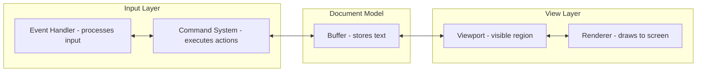
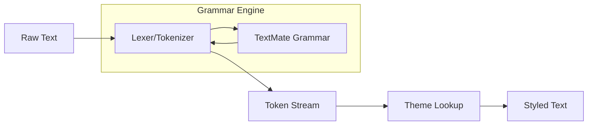

# Zero to Editor Engineer: Text Editor Fundamentals

## Introduction

This guide takes you from zero knowledge about text editors to understanding how to build a production-grade editor like Fresh. We'll cover every fundamental concept from first principles.

---

## Part 1: What Is a Text Editor?

### The Core Problem

At its essence, a text editor solves a deceptively simple problem:

> **Store, display, and modify a sequence of characters**

But this simple statement hides enormous complexity:
- How do you efficiently store gigabytes of text?
- How do you instantly jump to line 50,000?
- How do you undo/redo changes efficiently?
- How do you render only what's visible on screen?
- How do you handle 100 different character encodings?

### The Three Core Components

Every text editor has three fundamental components:



1. **Document Model (Buffer)**: Stores the actual text content
2. **View Layer**: Manages what portion of the text is visible and renders it
3. **Input Layer**: Handles keyboard/mouse events and translates them into actions

---

## Part 2: Buffers - Storing Text

### Naive Approach: Single String

The simplest approach is storing the entire file as one string:

```rust
struct NaiveBuffer {
    content: String,
}

impl NaiveBuffer {
    fn insert(&mut self, pos: usize, text: &str) {
        self.content.insert_str(pos, text);  // O(n) - must shift all bytes after pos
    }

    fn delete(&mut self, start: usize, end: usize) {
        self.content.replace_range(start..end, "");  // O(n) - must shift
    }
}
```

**Problem**: Every insert/delete requires shifting all subsequent bytes. For a 1GB file, inserting at position 0 means moving 1 billion bytes.

### Better Approach: Gap Buffer

A gap buffer maintains a "gap" at the cursor position for efficient local edits:

```
Before: "Hello|world"  (cursor at |)
Gap:    "Hello_____world"  (gap of 5 underscores at cursor)

Insert "Beautiful ":
"HelloBeautiful _____world"  (just fill the gap, no shifting!)

Move cursor right 3 positions:
"HelloBea_____utiful world"  (shift gap, not content)
```

```rust
struct GapBuffer {
    data: Vec<char>,
    gap_start: usize,
    gap_end: usize,
}

impl GapBuffer {
    fn insert(&mut self, ch: char) {
        if self.gap_start == self.gap_end {
            self.expand_gap();  // Grow the gap when needed
        }
        self.data[self.gap_start] = ch;
        self.gap_start += 1;
    }
}
```

**Limitation**: Gap buffers don't scale well for multiple cursors or very large files.

### Production Approach: Piece Table

Fresh uses a **piece table** (also called piece tree), which separates:
1. **What** the text is (the content in buffers)
2. **How** it's organized (the pieces that reference the content)

```
Original file: "Hello World\nThis is a test"
                |_______|   |____________|
                     |              |
                Stored Buffer (immutable original)

User adds "Beautiful " after "Hello ":

Pieces: [Stored: 0-6] [Added: 0-10] [Stored: 6-end]
        "Hello "     "Beautiful "   "World\n..."
```

```rust
// Simplified piece table
struct PieceTable {
    original: String,      // Original file content (immutable after load)
    added: String,         // All additions appended here
    pieces: Vec<Piece>,    // Sequence of pieces
}

struct Piece {
    buffer: BufferType,    // Original or Added
    offset: usize,         // Where in that buffer
    length: usize,         // How many characters
}
```

**Advantages**:
- O(1) to insert (just add to `added` buffer and update pieces)
- O(log n) navigation with a balanced tree
- Efficient undo/redo (just restore old piece tree)
- Multiple cursors work naturally

### Fresh's Innovation: Integrated Line Tracking

Fresh enhances the piece table by storing line feed counts in each node:

```rust
pub enum PieceTreeNode {
    Leaf {
        location: BufferLocation,
        offset: usize,
        bytes: usize,
        line_feed_cnt: Option<usize>,  // NEW: track line feeds
    },
    Internal {
        left_bytes: usize,
        lf_left: Option<usize>,  // NEW: total line feeds in left subtree
        left: Arc<PieceTreeNode>,
        right: Arc<PieceTreeNode>,
    },
}
```

This allows finding line N in O(log n) time instead of O(n).

---

## Part 3: Views - Displaying Text

### The Viewport Problem

Your terminal might be 80x24, but your file could be 50,000 lines. The **viewport** manages which portion is visible:

```rust
struct Viewport {
    top_line: usize,      // First visible line
    left_column: usize,   // Horizontal scroll
    width: usize,         // Viewport width in characters
    height: usize,        // Viewport height in lines
}
```

### Virtual Scrolling

You only render what's visible. For a 50,000 line file with a 24-line viewport:

```rust
fn render_view(&self, buffer: &TextBuffer, viewport: &Viewport) {
    // Only get lines that are visible!
    let visible_lines = viewport.height;
    let lines = buffer.get_lines(viewport.top_line, visible_lines);

    for (i, line) in lines.enumerate() {
        // Apply syntax highlighting, then render
        let styled = self.highlight_line(line);
        self.render_line(viewport.left_column, i, styled);
    }
}
```

### Syntax Highlighting Pipeline



1. **Tokenization**: Break text into tokens (keywords, strings, comments, etc.)
2. **Theme Lookup**: Map token types to colors/styles
3. **Rendering**: Apply ANSI escape codes or terminal styling

Fresh supports two highlighting engines:
- **TextMate grammars** (VS Code compatible)
- **Tree-sitter** (AST-based, more accurate)

---

## Part 4: Input - Handling Events

### Terminal Events

Terminals send escape sequences for special keys:

```
Arrow Up    = \x1b[A
Arrow Down  = \x1b[B
Ctrl+C      = \x03
Alt+Enter   = \x1b\x0d
```

Fresh uses the `crossterm` crate to handle this:

```rust
use crossterm::event::{read, Event, KeyCode, KeyEvent};

loop {
    match read()? {
        Event::Key(KeyEvent { code: KeyCode::Char('q'), .. }) => break,
        Event::Key(KeyEvent { code: KeyCode::Enter, modifiers }) => {
            // Handle enter key
        }
        Event::Mouse(mouse_event) => {
            // Handle mouse
        }
        _ => {}
    }
}
```

### Keybinding System

Fresh maps key combinations to actions:

```rust
struct Keybinding {
    key: KeyCode,
    modifiers: KeyModifiers,
    context: KeyContext,  // Normal, Terminal, FileExplorer
    action: Action,
}

// Example keybindings
let bindings = vec![
    Keybinding { key: Ctrl('s'), action: Action::Save },
    Keybinding { key: Ctrl('f'), action: Action::Find },
    Keybinding { key: Ctrl('p'), action: Action::CommandPalette },
];
```

### Command Palette

The command palette lets users search and execute commands by name:

```
> [Search commands...]
  File: Open File
  File: Save File
  Edit: Find
  Edit: Replace
  View: Toggle Line Numbers
```

Implementation:

```rust
struct CommandPalette {
    commands: Vec<Command>,
    filter: String,
    selected: usize,
}

impl CommandPalette {
    fn filtered(&self) -> Vec<&Command> {
        self.commands
            .iter()
            .filter(|c| fuzzy_match(&c.name, &self.filter))
            .collect()
    }
}
```

---

## Part 5: The Main Loop

Every editor has a main loop:

```rust
fn main_loop(&mut self) -> Result<()> {
    loop {
        // 1. Render the current state
        self.render();

        // 2. Wait for and process input
        match read_event()? {
            Event::Quit => break,
            Event::Key(key) => self.handle_key(key),
            Event::Mouse(mouse) => self.handle_mouse(mouse),
        }

        // 3. Process async operations (LSP, plugins)
        self.process_async();
    }
    Ok(())
}
```

---

## Part 6: Advanced Topics

### Undo/Redo with Piece Tables

Undo is elegant with piece tables: just save and restore piece tree snapshots:

```rust
struct UndoHistory {
    undo_stack: Vec<PieceTreeSnapshot>,
    redo_stack: Vec<PieceTreeSnapshot>,
}

fn undo(&mut self) {
    if let Some(snapshot) = self.undo_stack.pop() {
        let current = self.piece_tree.snapshot();
        self.redo_stack.push(current);
        self.piece_tree.restore(snapshot);
    }
}
```

### Multiple Cursors

Multiple cursors are just multiple positions in the same buffer:

```rust
struct MultiCursor {
    primary: Cursor,
    additional: Vec<Cursor>,
}

fn insert_at_all_cursors(&mut self, text: &str) {
    let mut edits = Vec::new();
    for cursor in self.all_cursors() {
        edits.push(Edit::Insert(cursor.position(), text.to_string()));
    }
    // Apply all edits in reverse order (so positions stay valid)
    edits.sort_by_key(|e| Reverse(e.position()));
    for edit in edits {
        self.buffer.apply(edit);
    }
}
```

### Large File Handling

Fresh handles gigabyte files with these techniques:

1. **No line indexing for huge files**: Skip computing line starts
2. **Chunked loading**: Load 1MB chunks on demand
3. **Memory mapping**: Use `mmap` for zero-copy file access
4. **Lazy evaluation**: Only compute what's visible

```rust
const LARGE_FILE_THRESHOLD: usize = 100 * 1024 * 1024;  // 100MB

fn load_file(path: &Path) -> Result<TextBuffer> {
    let size = std::fs::metadata(path)?.len() as usize;

    if size > LARGE_FILE_THRESHOLD {
        // Don't compute line starts, load in chunks
        TextBuffer::new_lazy(path)
    } else {
        // Full load with line indexing
        TextBuffer::new_eager(path)
    }
}
```

---

## Part 7: Building Your First Editor

Here's a minimal working editor in ~100 lines:

```rust
use crossterm::{
    event::{read, Event, KeyCode},
    execute,
    terminal::{disable_raw_mode, enable_raw_mode, EnterAlternateScreen, LeaveAlternateScreen},
};
use std::io::{stdout, Write};

struct Editor {
    lines: Vec<String>,
    cursor_row: usize,
    cursor_col: usize,
    scroll_row: usize,
}

impl Editor {
    fn new() -> Self {
        Self {
            lines: vec![String::new()],
            cursor_row: 0,
            cursor_col: 0,
            scroll_row: 0,
        }
    }

    fn run(&mut self) -> Result<(), Box<dyn std::error::Error>> {
        // Setup terminal
        enable_raw_mode()?;
        let mut stdout = stdout();
        execute!(stdout, EnterAlternateScreen)?;

        // Main loop
        loop {
            self.render(&mut stdout)?;
            stdout.flush()?;

            if let Event::Key(key) = read()? {
                match key.code {
                    KeyCode::Char('q') => break,
                    KeyCode::Char(c) => self.insert(c),
                    KeyCode::Backspace => self.backspace(),
                    KeyCode::Enter => self.newline(),
                    KeyCode::Up => self.cursor_row = self.cursor_row.saturating_sub(1),
                    KeyCode::Down => self.cursor_row = self.cursor_row.saturating_add(1),
                    KeyCode::Left => self.cursor_col = self.cursor_col.saturating_sub(1),
                    KeyCode::Right => self.cursor_col = self.cursor_col.saturating_add(1),
                    _ => {}
                }
            }
        }

        // Restore terminal
        disable_raw_mode()?;
        execute!(stdout, LeaveAlternateScreen)?;
        Ok(())
    }

    fn render(&self, stdout: &mut impl Write) -> Result<(), std::io::Error> {
        use crossterm::{cursor::MoveTo, style::Print, terminal::Clear};

        execute!(stdout, Clear(crossterm::terminal::ClearType::All))?;

        let height = 24;  // Terminal height
        for (i, line) in self.lines.iter().skip(self.scroll_row).take(height).enumerate() {
            execute!(stdout, MoveTo(0, i as u16), Print(line))?;
        }

        execute!(stdout, MoveTo(self.cursor_col as u16, (self.cursor_row - self.scroll_row) as u16))
    }

    fn insert(&mut self, c: char) {
        let line = &mut self.lines[self.cursor_row];
        line.insert(self.cursor_col, c);
        self.cursor_col += 1;
    }

    fn backspace(&mut self) {
        if self.cursor_col > 0 {
            self.cursor_col -= 1;
            let line = &mut self.lines[self.cursor_row];
            line.remove(self.cursor_col);
        } else if self.cursor_row > 0 {
            let prev_len = self.lines[self.cursor_row - 1].len();
            let current = self.lines.remove(self.cursor_row);
            self.lines[self.cursor_row - 1].push_str(&current);
            self.cursor_row -= 1;
            self.cursor_col = prev_len;
        }
    }

    fn newline(&mut self) {
        let current_line = self.lines[self.cursor_row].clone();
        let (first, second) = current_line.split_at(self.cursor_col);
        self.lines[self.cursor_row] = first.to_string();
        self.lines.insert(self.cursor_row + 1, second.to_string());
        self.cursor_row += 1;
        self.cursor_col = 0;
    }
}

fn main() {
    let mut editor = Editor::new();
    let _ = editor.run();
}
```

---

## Next Steps

Continue your editor engineering journey:

1. **[Buffer Model Deep Dive](01-buffer-model-deep-dive.md)** - Piece tables, ropes, gap buffers
2. **[View Rendering Deep Dive](02-view-rendering-deep-dive.md)** - Virtual scrolling, syntax highlighting
3. **[Plugin System Deep Dive](03-plugin-system-deep-dive.md)** - Plugin architecture, APIs
4. **[Command Pattern Deep Dive](04-command-pattern-deep-dive.md)** - Commands, undo/redo

---

## Resources

- [Build Your Own Text Editor](https://viewsourcecode.org/snaptoken/kilo/) - Excellent C tutorial
- [The Text Editor Book](https://thetexteditorbook.com/) - Comprehensive guide
- [Fresh Source Code](https://github.com/sinelaw/fresh) - Production Rust implementation
