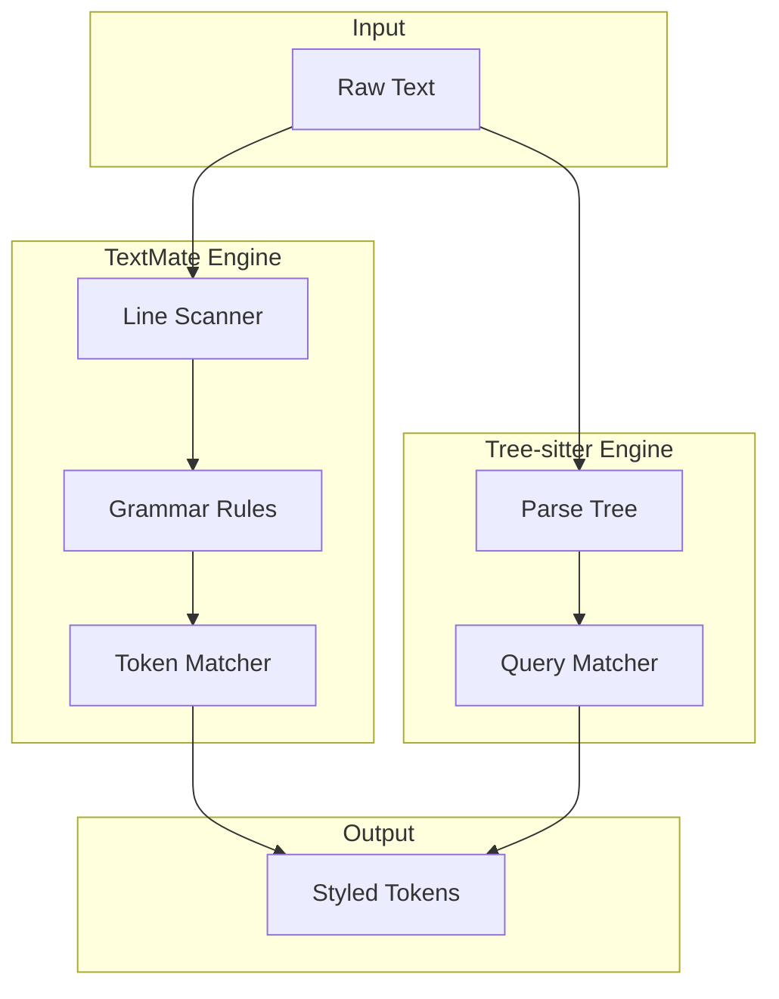

# View Rendering Deep Dive: Virtual Scrolling and Syntax Highlighting

## Introduction

The view layer transforms raw text into a beautifully rendered, syntax-highlighted display. This document explores virtual scrolling, syntax highlighting engines, and the rendering pipeline.

---

## Part 1: The Viewport Problem

### The Challenge

Your terminal is typically 80x24 characters, but your file might be:
- 50,000 lines long
- 500 characters wide
- Need to scroll both vertically and horizontally

The **viewport** manages what's visible:

```rust
pub struct Viewport {
    pub top_byte: usize,      // Byte offset of first visible line
    pub left_column: usize,   // Horizontal scroll offset
    pub width: usize,         // Viewport width in characters
    pub height: usize,        // Viewport height in lines
}
```

### Virtual Scrolling

Never render more than what's visible. For a 50,000 line file:

```rust
// WRONG: Don't do this!
fn render_wrong(buffer: &TextBuffer) {
    for line in buffer.all_lines() {  // Iterates ALL 50,000 lines!
        render_line(line);
    }
}

// RIGHT: Only render visible lines
fn render_right(buffer: &TextBuffer, viewport: &Viewport) {
    let visible_lines = buffer.get_lines(viewport.top_line, viewport.height);
    for (i, line) in visible_lines.enumerate() {
        render_line(i, line);  // Only 24 iterations max
    }
}
```

---

## Part 2: Line Iteration

### Finding Line Start by Byte Offset

With Fresh's piece tree, finding line N is O(log n):

```rust
impl TextBuffer {
    pub fn line_to_byte_offset(&self, line: usize) -> usize {
        self.piece_tree.find_line(line).byte_offset
    }

    pub fn byte_offset_to_line(&self, byte_offset: usize) -> LineInfo {
        self.piece_tree.find_byte_offset(byte_offset)
    }
}
```

### Iterating Visible Lines

```rust
pub struct LineIterator<'a> {
    buffer: &'a TextBuffer,
    current_line: usize,
    end_line: usize,
}

impl<'a> Iterator for LineIterator<'a> {
    type Item = LineSlice<'a>;

    fn next(&mut self) -> Option<Self::Item> {
        if self.current_line >= self.end_line {
            return None;
        }

        let line = self.buffer.get_line(self.current_line);
        self.current_line += 1;
        Some(line)
    }
}

impl TextBuffer {
    pub fn get_lines(&self, start_line: usize, count: usize) -> LineIterator {
        LineIterator {
            buffer: self,
            current_line: start_line,
            end_line: start_line + count,
        }
    }
}
```

### Handling Horizontal Scroll

```rust
pub struct LineSlice<'a> {
    data: &'a [u8],
    start_col: usize,
    end_col: usize,
}

impl<'a> LineSlice<'a> {
    pub fn visible_part(&self, left_column: usize, width: usize) -> Self {
        LineSlice {
            data: self.data,
            start_col: self.start_col + left_column,
            end_col: (self.start_col + left_column + width).min(self.end_col),
        }
    }
}
```

---

## Part 3: Syntax Highlighting Pipeline

Fresh supports two syntax highlighting engines:



### TextMate Grammars (VS Code Compatible)

TextMate grammars use a regex-based approach with begin/end patterns:

```json
{
  "scopeName": "source.rust",
  "patterns": [
    {
      "name": "comment.line.double-slash.rust",
      "match": "//.*$"
    },
    {
      "name": "keyword.control.rust",
      "match": "\\b(if|else|match|while|for|fn|pub|struct|enum)\\b"
    },
    {
      "begin": "\"\"\"",
      "end": "\"\"\"",
      "name": "string.raw.block.rust"
    }
  ]
}
```

Fresh's TextMate engine:

```rust
pub struct TextMateHighlighter {
    grammar: Grammar,
    state_stack: Vec<ScopeState>,
}

impl TextMateHighlighter {
    pub fn highlight_line(&mut self, line: &str, line_number: usize) -> Vec<StyledToken> {
        let mut tokens = Vec::new();
        let mut position = 0;

        // Apply grammar rules to tokenize
        for rule in &self.grammar.patterns {
            if let Some(m) = rule.regex.find_at(line, position) {
                tokens.push(StyledToken {
                    text: &line[m.start()..m.end()],
                    scopes: rule.scopes.clone(),
                });
                position = m.end();
            }
        }

        tokens
    }
}

pub struct StyledToken<'a> {
    pub text: &'a str,
    pub scopes: Vec<String>,  // e.g., ["source.rust", "keyword.control.rust"]
}
```

### Tree-sitter (AST-Based)

Tree-sitter builds a concrete syntax tree:

```rust
use tree_sitter::{Parser, Query, QueryCursor};

pub struct TreeSitterHighlighter {
    parser: Parser,
    language: Language,
    highlight_query: Query,
}

impl TreeSitterHighlighter {
    pub fn highlight(&self, source: &str) -> Vec<StyledToken> {
        // Parse to AST
        let tree = self.parser.parse(source, None).unwrap();

        // Run highlight query against AST
        let mut cursor = QueryCursor::new();
        let matches = cursor.matches(&self.highlight_query, tree.root_node(), source.as_bytes());

        let mut tokens = Vec::new();
        for m in matches {
            for capture in m.captures {
                let node = capture.node;
                let capture_name = &self.highlight_query.capture_names()[capture.index as usize];

                tokens.push(StyledToken {
                    text: &source[node.byte_range()],
                    scope: capture_name.to_string(),
                });
            }
        }

        tokens
    }
}
```

**Comparison**:

| Aspect | TextMate | Tree-sitter |
|--------|----------|-------------|
| Speed | Faster (regex-based) | Slower (parsing) |
| Accuracy | Good | Excellent |
| Context-aware | No | Yes (knows AST structure) |
| Memory | Low | Higher |
| Fresh usage | Default for most languages | For semantic highlighting |

---

## Part 4: Theme System

Themes map scopes to colors:

```json
{
  "name": "One Dark",
  "tokenColors": [
    {
      "scope": ["keyword.control", "keyword.function"],
      "settings": {
        "foreground": "#C678DD"
      }
    },
    {
      "scope": "string",
      "settings": {
        "foreground": "#98C379"
      }
    },
    {
      "scope": "comment",
      "settings": {
        "foreground": "#5C6370",
        "fontStyle": "italic"
      }
    }
  ]
}
```

Fresh's theme loader:

```rust
pub struct Theme {
    pub name: String,
    pub colors: HashMap<String, Color>,
    pub styles: HashMap<String, FontStyle>,
}

impl Theme {
    pub fn load(path: &Path) -> Result<Self> {
        let content = std::fs::read_to_string(path)?;
        let json: ThemeJson = serde_json::from_str(&content)?;

        let mut colors = HashMap::new();
        for rule in json.token_colors {
            for scope in rule.scope {
                if let Some(fg) = rule.settings.foreground {
                    colors.insert(scope.clone(), parse_color(&fg));
                }
            }
        }

        Ok(Theme {
            name: json.name,
            colors,
            styles: HashMap::new(),
        })
    }

    pub fn get_style(&self, scopes: &[String]) -> Style {
        // Find most specific matching scope
        for scope in scopes.iter().rev() {
            if let Some(color) = self.colors.get(scope) {
                return Style {
                    fg: *color,
                    bg: None,
                    bold: false,
                    italic: false,
                };
            }
        }
        Style::default()
    }
}
```

---

## Part 5: Rendering with Ratatui

Fresh uses `ratatui` for terminal rendering:

```rust
use ratatui::{
    Frame,
    layout::{Rect, Constraint},
    style::{Style, Color},
    text::{Line, Span},
    widgets::{Paragraph, Block},
};

pub fn render_viewport(
    frame: &mut Frame,
    buffer: &TextBuffer,
    viewport: &Viewport,
    theme: &Theme,
    area: Rect,
) {
    // Get visible lines
    let lines = buffer.get_lines(viewport.top_line, viewport.height as usize);

    // Build styled lines
    let mut styled_lines = Vec::new();
    for (i, line) in lines.enumerate() {
        let tokens = buffer.highlight_line(line.as_str(), viewport.top_line + i);
        let spans: Vec<Span> = tokens
            .iter()
            .map(|token| {
                let style = theme.get_style(&token.scopes);
                Span::styled(token.text, ratatui_style(style))
            })
            .collect();

        styled_lines.push(Line::from(spans));
    }

    // Render with ratatui
    let paragraph = Paragraph::new(styled_lines)
        .block(Block::bordered().title("buffer.rs"));

    frame.render_widget(paragraph, area);
}

fn ratatui_style(style: Style) -> Style {
    let mut ratatui_style = Style::default();

    if let Some(fg) = style.fg {
        ratatui_style = ratatui_style.fg(Color::Rgb(fg.r, fg.g, fg.b));
    }
    if let Some(bg) = style.bg {
        ratatui_style = ratatui_style.bg(Color::Rgb(bg.r, bg.g, bg.b));
    }
    if style.bold {
        ratatui_style = ratatui_style.bold();
    }
    if style.italic {
        ratatui_style = ratatui_style.italic();
    }

    ratatui_style
}
```

---

## Part 6: Virtual Text and Overlays

Fresh supports virtual text (text that appears in the buffer but isn't part of the document):

```rust
pub struct VirtualText {
    pub line: usize,
    pub column: usize,
    pub text: String,
    pub style: Style,
    pub kind: VirtualTextKind,
}

pub enum VirtualTextKind {
    Inline,      // Rendered on same line
    Below,       // Rendered on line below
    Eol,         // End of line
}

impl TextBuffer {
    pub fn add_virtual_text(&mut self, virtual_text: VirtualText) {
        self.virtual_texts.push(virtual_text);
    }

    pub fn render_line_with_virtual(&self, line_num: usize) -> Vec<StyledToken> {
        let mut tokens = self.highlight_line(line_num);

        // Add virtual text tokens
        for vt in &self.virtual_texts {
            if vt.line == line_num {
                tokens.push(StyledToken {
                    text: vt.text.clone(),
                    style: vt.style,
                    is_virtual: true,
                });
            }
        }

        tokens
    }
}
```

### Use Cases for Virtual Text

1. **Inlay hints** (type annotations, parameter names)
2. **Git blame** (showing commit info at end of lines)
3. **Error messages** (displaying diagnostics inline)
4. **Code lens** (run/test buttons above functions)

---

## Part 7: Line Wrapping

Fresh supports multiple line wrapping modes:

```rust
pub enum LineWrap {
    None,           // Horizontal scroll
    SoftWrap,       // Wrap at word boundaries
    HardWrap(u16),  // Wrap at specific column
}

impl TextBuffer {
    pub fn get_wrapped_lines(&self, start_line: usize, viewport_height: usize, wrap_mode: &LineWrap) -> Vec<WrappedLine> {
        match wrap_mode {
            LineWrap::None => {
                self.get_lines(start_line, viewport_height)
                    .map(|line| WrappedLine::Single(line))
                    .collect()
            }
            LineWrap::SoftWrap => {
                self.wrap_lines_soft(start_line, viewport_height)
            }
            LineWrap::HardWrap(width) => {
                self.wrap_lines_hard(start_line, viewport_height, *width)
            }
        }
    }

    fn wrap_lines_soft(&self, start_line: usize, max_lines: usize) -> Vec<WrappedLine> {
        let mut wrapped = Vec::new();
        let viewport_width = self.viewport.width;

        for line in self.get_lines(start_line, max_lines) {
            let mut remaining = line.as_str();

            while !remaining.is_empty() {
                // Find word boundary at viewport edge
                let wrap_point = self.find_word_break(remaining, viewport_width);

                wrapped.push(WrappedLine::Segment(&remaining[..wrap_point]));
                remaining = &remaining[wrap_point..];
            }
        }

        wrapped
    }
}
```

---

## Part 8: Performance Optimizations

### 1. Cache Highlighted Lines

```rust
pub struct HighlightCache {
    cache: LruCache<(usize, u64), Vec<StyledToken>>,  // (line, version) -> tokens
    version: u64,
}

impl HighlightCache {
    pub fn get_or_compute(&mut self, line: usize, buffer: &TextBuffer) -> &Vec<StyledToken> {
        if let Some(tokens) = self.cache.get(&(line, self.version)) {
            return tokens;
        }

        // Compute and cache
        let tokens = buffer.highlight_line(line);
        self.cache.put((line, self.version), tokens);
        self.cache.get(&(line, self.version)).unwrap()
    }
}
```

### 2. Incremental Highlighting

Only re-highlight changed lines:

```rust
pub fn highlight_changed_range(&mut self, start_line: usize, end_line: usize) {
    for line_num in start_line..=end_line {
        self.highlight_cache.invalidate(line_num);
    }
}
```

### 3. Lazy Token Computation

Only compute tokens for visible lines:

```rust
pub fn render_visible(&mut self, viewport: &Viewport) {
    let start = viewport.top_line;
    let end = viewport.top_line + viewport.height;

    // Only highlight lines that are visible NOW
    for line_num in start..end {
        if !self.highlight_cache.contains(line_num) {
            self.compute_highlight(line_num);
        }
    }
}
```

### 4. Batch Terminal Updates

```rust
// WRONG: Many small writes
for line in visible_lines {
    execute!(stdout, MoveTo(0, row), Print(line))?;
}

// RIGHT: Build single buffer, write once
let mut output = String::new();
for (i, line) in visible_lines.enumerate() {
    output.push_str(&format!("\x1b[{};{}H{}", i + 1, 1, line));
}
stdout.write_all(output.as_bytes())?;
```

---

## Part 9: Advanced Rendering Features

### Bracket Highlighting

```rust
pub fn highlight_matching_bracket(&self, cursor_pos: usize) -> Option<(usize, usize)> {
    let bracket = self.char_at(cursor_pos)?;

    let (open, close) = match bracket {
        '(' => ('(', ')'),
        '[' => ('[', ']'),
        '{' => ('{', '}'),
        ')' => ('(', ')'),
        ']' => ('[', ']'),
        '}' => ('{', '}'),
        _ => return None,
    };

    // Search for matching bracket
    if bracket == open {
        self.find_matching_close(cursor_pos, open, close)
    } else {
        self.find_matching_open(cursor_pos, open, close)
    }
}
```

### Diff Rendering

For split-view diff:

```rust
pub struct DiffHunk {
    pub old_start: usize,
    pub old_count: usize,
    pub new_start: usize,
    pub new_count: usize,
}

pub fn render_diff_split(
    frame: &mut Frame,
    old_buffer: &TextBuffer,
    new_buffer: &TextBuffer,
    hunks: &[DiffHunk],
    area: Rect,
) {
    // Split area in half
    let chunks = Layout::default()
        .direction(Direction::Horizontal)
        .constraints([Constraint::Percentage(50), Constraint::Percentage(50)])
        .split(area);

    // Render old buffer with removal highlighting
    let old_lines = self.render_with_diff(old_buffer, hunks, DiffSide::Old);
    frame.render_widget(Paragraph::new(old_lines), chunks[0]);

    // Render new buffer with addition highlighting
    let new_lines = self.render_with_diff(new_buffer, hunks, DiffSide::New);
    frame.render_widget(Paragraph::new(new_lines), chunks[1]);
}
```

---

## Resources

- [Ratatui Documentation](https://ratatui.rs/)
- [TextMate Grammar Guide](https://macromates.com/manual/en/language_grammars)
- [Tree-sitter Documentation](https://tree-sitter.github.io/)
- [Fresh Source: view/](/home/darkvoid/Boxxed/@formulas/src.rust/src.CodingIDE/fresh/crates/fresh-editor/src/view/) - Rendering implementation
- [Fresh Source: primitives/](/home/darkvoid/Boxxed/@formulas/src.rust/src.CodingIDE/fresh/crates/fresh-editor/src/primitives/) - Syntax highlighting
