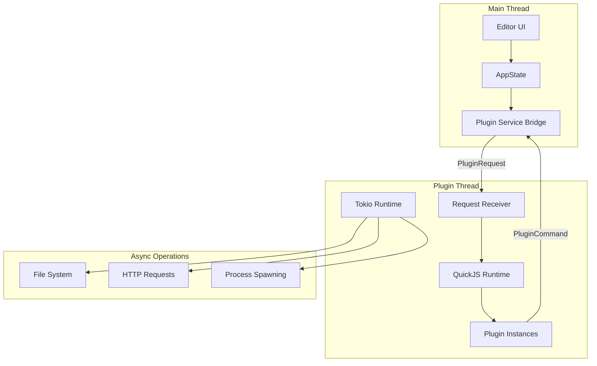

# Plugin System Deep Dive: Architecture and APIs

## Introduction

Fresh's plugin system allows extending the editor with TypeScript/JavaScript plugins running in a sandboxed QuickJS runtime. This document explores the plugin architecture, API design, and implementation details.

---

## Part 1: Plugin Architecture Overview

### High-Level Design



### Key Components

1. **Main Thread**: Runs the editor UI, sends requests to plugin thread
2. **Plugin Thread**: Owns QuickJS runtime, executes plugin code
3. **Service Bridge**: Mediates communication between threads
4. **Async Runtime**: Tokio runtime in plugin thread for async operations

---

## Part 2: Plugin Thread Implementation

### Thread Architecture

```rust
pub struct PluginThreadHandle {
    request_sender: Option<tokio::sync::mpsc::UnboundedSender<PluginRequest>>,
    thread_handle: Option<JoinHandle<()>>,
    state_snapshot: Arc<RwLock<EditorStateSnapshot>>,
    pending_responses: PendingResponses,
    command_receiver: std::sync::mpsc::Receiver<PluginCommand>,
}

pub enum PluginRequest {
    LoadPlugin {
        path: PathBuf,
        response: oneshot::Sender<Result<()>>,
    },
    ExecuteAction {
        action_name: String,
        response: oneshot::Sender<Result<()>>,
    },
    RunHook {
        hook_name: String,
        args: HookArgs,
    },
    ResolveCallback {
        callback_id: JsCallbackId,
        result_json: String,
    },
    // ... more requests
}
```

### Plugin Thread Main Loop

```rust
impl PluginThreadHandle {
    pub fn spawn(services: Arc<dyn PluginServiceBridge>) -> Result<Self> {
        let (request_sender, request_receiver) = tokio::sync::mpsc::unbounded_channel();
        let (command_sender, command_receiver) = std::sync::mpsc::channel();

        let thread_handle = thread::spawn(move || {
            // Create tokio runtime for async operations
            let rt = tokio::runtime::Builder::new_current_thread()
                .enable_all()
                .build()
                .unwrap();

            // Create QuickJS runtime
            let mut runtime = QuickJsBackend::new(command_sender, services);

            // Main plugin thread loop
            rt.block_on(async move {
                let mut request_receiver = request_receiver;

                while let Some(request) = request_receiver.recv().await {
                    match request {
                        PluginRequest::LoadPlugin { path, response } => {
                            let result = runtime.load_plugin(&path).await;
                            let _ = response.send(result);
                        }
                        PluginRequest::ExecuteAction { action_name, response } => {
                            let result = runtime.execute_action(&action_name).await;
                            let _ = response.send(result);
                        }
                        PluginRequest::ResolveCallback { callback_id, result_json } => {
                            runtime.resolve_callback(callback_id, result_json).await;
                        }
                        PluginRequest::RunHook { hook_name, args } => {
                            runtime.run_hook(&hook_name, args).await;
                        }
                        PluginRequest::Shutdown => break,
                        _ => {}
                    }
                }
            });
        });

        Ok(PluginThreadHandle {
            request_sender: Some(request_sender),
            thread_handle: Some(thread_handle),
            // ...
        })
    }
}
```

---

## Part 3: QuickJS Backend

### Runtime Initialization

```rust
pub struct QuickJsBackend {
    ctx: Ctx<'static>,
    rt: Runtime,
    plugins: HashMap<String, LoadedPlugin>,
    command_sender: mpsc::Sender<PluginCommand>,
    services: Arc<dyn PluginServiceBridge>,
    pending_responses: PendingResponses,
}

impl QuickJsBackend {
    pub fn new(command_sender: mpsc::Sender<PluginCommand>, services: Arc<dyn PluginServiceBridge>) -> Self {
        let rt = Runtime::new().unwrap();
        let ctx = rt.context().unwrap();

        // Register global `editor` object with API methods
        let editor_obj = ctx.object().unwrap();

        // Register all API methods
        editor_obj.set("getActiveBufferId", Func::from(move |ctx| {
            // Implementation
        })).unwrap();

        editor_obj.set("getBufferText", Func::from(move |ctx, buffer_id, start, end| {
            // Async operation - returns Promise
        })).unwrap();

        editor_obj.set("spawnProcess", Func::from(move |ctx, cmd, args| {
            // Returns ProcessHandle (cancellable Promise)
        })).unwrap();

        // Set global
        ctx.globals().set("getEditor", Func::from(move || editor_obj.clone())).unwrap();

        QuickJsBackend {
            ctx,
            rt,
            plugins: HashMap::new(),
            command_sender,
            services,
            pending_responses: Arc::new(Mutex::new(HashMap::new())),
        }
    }
}
```

### Loading a Plugin

```rust
impl QuickJsBackend {
    pub async fn load_plugin(&mut self, path: &Path) -> Result<()> {
        // Read plugin source
        let source = tokio::fs::read_to_string(path).await?;

        // Transpile TypeScript to JavaScript (using oxc)
        let js_source = self.transpile_typescript(&source)?;

        // Create plugin module
        let plugin_name = path.file_stem().unwrap().to_string_lossy().to_string();

        // Execute plugin code
        let plugin_obj = self.ctx.eval_file_with_name::<rquickjs::Object>(
            path.to_string_lossy().to_string(),
            js_source,
        )?;

        // Extract plugin metadata
        let plugin = LoadedPlugin {
            name: plugin_name,
            path: path.to_path_buf(),
            object: plugin_obj,
            actions: self.extract_actions(&plugin_obj)?,
            hooks: self.extract_hooks(&plugin_obj)?,
        };

        self.plugins.insert(plugin.name.clone(), plugin);

        Ok(())
    }

    fn transpile_typescript(&self, source: &str) -> Result<String> {
        use oxc_allocator::Allocator;
        use oxc_parser::Parser;
        use oxc_transformer::{Transformer, TransformOptions};
        use oxc_codegen::CodeGenerator;

        let allocator = Allocator::default();
        let ret = Parser::new(&allocator, source, SourceType::ts()).parse();

        let mut transformer = Transformer::new(
            &allocator,
            Path::new("plugin.ts"),
            &ret.trivias,
            TransformOptions::default(),
        );

        let mut program = ret.program;
        transformer.build(&mut program);

        let js = CodeGenerator::new().build(&program).source_text;

        Ok(js)
    }
}
```

---

## Part 4: Plugin API Design

### Editor API Methods

The plugin API is defined in Rust and exported to TypeScript:

```rust
#[plugin_api_impl]
#[rquickjs::methods(rename_all = "camelCase")]
impl JsEditorApi {
    /// Get the active buffer ID (0 if none)
    pub fn get_active_buffer_id(&self) -> u32 {
        // Access editor state
        self.state.active_buffer_id.unwrap_or(0)
    }

    /// Get buffer path by ID
    pub fn get_buffer_path(&self, buffer_id: u32) -> Option<String> {
        self.state.get_buffer_path(buffer_id)
    }

    /// Get cursor position
    pub fn get_cursor_position(&self) -> u32 {
        self.state.cursor_byte_offset()
    }

    /// Get cursor line number
    pub fn get_cursor_line(&self) -> usize {
        self.state.cursor_line()
    }

    /// Get text range from buffer (async)
    #[plugin_api(async_promise, ts_return = "string")]
    pub async fn get_buffer_text(
        &self,
        buffer_id: u32,
        start: u32,
        end: u32,
    ) -> Result<String> {
        // Send request to main thread via channel
        let (tx, rx) = oneshot::channel();
        self.command_sender.send(PluginCommand::GetBufferText {
            buffer_id,
            start,
            end,
            response: tx,
        }).unwrap();

        rx.await.unwrap()
    }

    /// Spawn external process (async, cancellable)
    #[plugin_api(async_thenable, ts_return = "{ stdout: string, stderr: string, exit_code: number }")]
    pub fn spawn_process(
        &self,
        command: String,
        args: Vec<String>,
        cwd: Option<String>,
    ) -> Result<ProcessHandle> {
        // Create cancellable operation
        let handle = ProcessHandle::new(command, args, cwd, self.pending_responses.clone());
        Ok(handle)
    }

    /// Debug logging
    pub fn debug(&self, message: String) {
        eprintln!("[plugin] {}", message);
    }

    /// Get plugin directory
    pub fn get_plugin_dir(&self) -> String {
        self.current_plugin_dir.clone()
    }
}
```

### TypeScript Type Definitions

The proc macro auto-generates TypeScript definitions:

```typescript
// Auto-generated fresh.d.ts
interface EditorAPI {
    getActiveBufferId(): number;
    getBufferPath(bufferId: number): string | null;
    getCursorPosition(): number;
    getCursorLine(): number;
    getBufferText(bufferId: number, start: number, end: number): Promise<string>;
    spawnProcess(command: string, args: string[], cwd?: string): ProcessHandle<{
        stdout: string;
        stderr: string;
        exit_code: number;
    }>;
    debug(message: string): void;
    getPluginDir(): string;
}

interface ProcessHandle<T> extends PromiseLike<T> {
    readonly result: Promise<T>;
    kill(): Promise<boolean>;
}

declare function getEditor(): EditorAPI;
```

---

## Part 5: Example Plugin

### Emmet Plugin

```typescript
/// <reference path="./lib/fresh.d.ts" />
const editor = getEditor();

/**
 * Emmet Plugin for Fresh Editor
 * Expands Emmet abbreviations for HTML, CSS, JSX, and more.
 */

// Check if Emmet expansion is supported for current buffer
function canExpandEmmet(): boolean {
    const bufferId = editor.getActiveBufferId();
    if (bufferId === 0) return false;

    const path = editor.getBufferPath(bufferId);
    if (!path) return true; // Allow in unsaved buffers

    const ext = editor.pathExtname(path).toLowerCase();
    const supportedExts = [".html", ".htm", ".css", ".js", ".jsx", ".ts", ".tsx", ".vue", ".svelte"];
    return supportedExts.includes(ext);
}

// Extract abbreviation before cursor
async function getAbbreviationBeforeCursor(): Promise<string | null> {
    const bufferId = editor.getActiveBufferId();
    if (bufferId === 0) return null;

    const cursorPos = editor.getCursorPosition();
    const lineNum = editor.getCursorLine();
    const lineStart = await editor.getLineStartPosition(lineNum);

    // Read text from line start to cursor
    const text = await editor.getBufferText(bufferId, lineStart, cursorPos);

    // Extract abbreviation (word-like characters)
    const match = text.match(/[\w.#:\-+>*\[\]{}()=\d]+$/);
    return match ? match[0] : null;
}

// Expand abbreviation using external emmet CLI
async function expandUsingCLI(abbr: string, type: 'html' | 'css'): Promise<string | null> {
    const pluginDir = editor.getPluginDir();
    const scriptPath = editor.pathJoin(pluginDir, "emmet-expand.js");

    try {
        const result = await editor.spawnProcess("node", [scriptPath, abbr, type], pluginDir);

        if (result.exit_code === 0) {
            return result.stdout.trim();
        } else {
            editor.debug(`[emmet] Expansion failed: ${result.stderr}`);
            return null;
        }
    } catch (e) {
        editor.debug(`[emmet] Failed to spawn node: ${e}`);
        return null;
    }
}

// Main expansion function
async function expandAbbreviation(): Promise<boolean> {
    if (!canExpandEmmet()) return false;

    const abbr = await getAbbreviationBeforeCursor();
    if (!abbr) return false;

    // Determine HTML or CSS context
    const bufferId = editor.getActiveBufferId();
    const path = editor.getBufferPath(bufferId);
    const ext = path ? editor.pathExtname(path).toLowerCase() : "";
    const isCSSFile = ext === ".css" || ext === ".scss" || ext === ".sass" || ext === ".less";

    // Expand using Emmet CLI
    const type = isCSSFile ? 'css' : 'html';
    const expanded = await expandUsingCLI(abbr, type);

    if (!expanded) return false;

    // Find abbreviation start position
    const cursorPos = editor.getCursorPosition();
    const abbrStart = cursorPos - abbr.length;

    // Delete abbreviation and insert expansion
    await editor.applyEdit([{
        range: { start: abbrStart, end: cursorPos },
        newText: expanded
    }]);

    return true;
}

// Export plugin
export default {
    name: "emmet",
    actions: {
        expandAbbreviation,
    },
    hooks: {
        onKey: async (event) => {
            if (event.key === "Tab" && !event.ctrlKey && !event.metaKey) {
                return await expandAbbreviation();
            }
            return false;
        },
    },
};
```

---

## Part 6: Async Operation Bridging

### The Challenge

Plugins need async operations (file I/O, HTTP, processes), but QuickJS doesn't have native async support. Fresh solves this with a callback system:

```rust
// Plugin code (TypeScript)
const content = await editor.getBufferText(bufferId, 0, 1000);

// Under the hood:
// 1. Plugin calls getBufferText, which returns a Promise
// 2. QuickJS suspends the plugin execution
// 3. Rust sends request to main thread via channel
// 4. Main thread responds with buffer text
// 5. Rust resolves the Promise with the result
// 6. Plugin execution resumes
```

### Implementation

```rust
// When plugin calls async function
pub fn get_buffer_text(&self, buffer_id: u32, start: u32, end: u32) -> rquickjs::Result<rquickjs::Promise> {
    // Create callback ID
    let callback_id = self.next_callback_id();

    // Create Promise in QuickJS
    let promise = self.create_promise(callback_id)?;

    // Send request to main thread
    self.command_sender.send(PluginCommand::GetBufferText {
        buffer_id,
        start,
        end,
        response: self.create_callback_sender(callback_id),
    }).unwrap();

    // Return Promise to plugin
    Ok(promise)
}

// When main thread responds
pub async fn resolve_callback(&mut self, callback_id: JsCallbackId, result: serde_json::Value) {
    let result_str = result.to_string();

    // Send resolve request to plugin thread
    self.request_sender.send(PluginRequest::ResolveCallback {
        callback_id,
        result_json: result_str,
    }).unwrap();
}

// Plugin thread resolves the Promise
pub fn resolve_callback_internal(&mut self, callback_id: JsCallbackId, result_json: String) {
    let ctx = &self.ctx;

    // Get the Promise from pending map
    if let Some(pending) = self.pending_callbacks.remove(&callback_id) {
        // Resolve the Promise
        let result: rquickjs::Value = serde_json::from_str(&result_json).unwrap();
        pending.resolve(result).unwrap();
    }
}
```

### ProcessHandle for Cancellable Operations

```typescript
interface ProcessHandle<T> extends PromiseLike<T> {
    readonly result: Promise<T>;
    kill(): Promise<boolean>;
}

// Usage in plugin
async function runWithTimeout(command: string, timeoutMs: number): Promise<string> {
    const handle = editor.spawnProcess(command, []);

    const timeout = new Promise((_, reject) =>
        setTimeout(() => reject(new Error("Timeout")), timeoutMs)
    );

    return Promise.race([handle.result, timeout])
        .catch(async (e) => {
            await handle.kill();  // Cancel the process
            throw e;
        });
}
```

---

## Part 7: Hook System

Plugins can register hooks that fire on editor events:

```rust
pub enum HookName {
    OnLoad,
    OnSave,
    OnCursorMoved,
    OnBufferChanged,
    OnKey,
    OnCommandPalette,
}

pub struct HookArgs {
    pub hook_name: HookName,
    pub data: serde_json::Value,
}

impl QuickJsBackend {
    pub async fn run_hook(&mut self, hook_name: &str, args: HookArgs) {
        for plugin in self.plugins.values() {
            if let Some(hook) = plugin.hooks.get(hook_name) {
                // Call hook in plugin
                let _ = hook.call((args.clone(),));
            }
        }
    }

    pub fn has_hook_handlers(&self, hook_name: &str) -> bool {
        self.plugins.values().any(|p| p.hooks.contains_key(hook_name))
    }
}
```

### Hook Example

```typescript
export default {
    name: "auto-save",
    hooks: {
        onSave: async (args) => {
            // Format file on save
            await formatDocument(args.bufferId);
        },
        onKey: async (event) => {
            // Custom key handling
            if (event.key === "F5") {
                await runTests();
                return true;  // Prevent default
            }
            return false;
        },
    },
};
```

---

## Part 8: Plugin Security

### Sandboxing

Plugins run in isolated QuickJS contexts:

```rust
// Limit memory usage
let rt = Runtime::new_with_limits(
    MemoryLimit::Kilobytes(1024),  // 1MB max
    GcThreshold::Kilobytes(512),   // GC at 512KB
)?;

// Disable dangerous operations
ctx.globals().set("eval", rquickjs::Undefined)?;
ctx.globals().set("Function", rquickjs::Undefined)?;
```

### Capability-Based Access

Plugins can only access what the editor explicitly provides:

```rust
// No direct file system access
// Plugins must use editor.getBufferText(), editor.applyEdit(), etc.

// No network access except through editor.spawnProcess()
// (which can be restricted by the editor)
```

---

## Part 9: Plugin Development Workflow

### 1. Create Plugin Structure

```
my-plugin/
├── package.json          # Plugin metadata
├── my-plugin.ts          # Main plugin code
├── my-plugin.i18n.json   # Translations
└── lib/
    └── fresh.d.ts        # Type definitions
```

### 2. Package.json

```json
{
  "name": "my-plugin",
  "version": "1.0.0",
  "main": "my-plugin.ts",
  "engines": {
    "fresh": ">=0.2.0"
  },
  "contributes": {
    "actions": ["myAction"],
    "hooks": ["onSave", "onKey"]
  }
}
```

### 3. Develop and Test

```bash
# Link plugin to Fresh config directory
ln -s /path/to/my-plugin ~/.config/fresh/plugins/

# Reload plugins in Fresh
# Command Palette > "Plugins: Reload Plugins"
```

### 4. Debug

```typescript
editor.debug(`[my-plugin] Processing buffer ${bufferId}`);
```

Debug output appears in Fresh's log file.

---

## Resources

- [Fresh Plugin API Types](/home/darkvoid/Boxxed/@formulas/src.rust/src.CodingIDE/fresh-plugins/emmet/plugins/lib/fresh.d.ts)
- [Fresh Plugin Runtime](/home/darkvoid/Boxxed/@formulas/src.rust/src.CodingIDE/fresh/crates/fresh-plugin-runtime/)
- [Plugin API Macros](/home/darkvoid/Boxxed/@formulas/src.rust/src.CodingIDE/fresh/crates/fresh-plugin-api-macros/)
- [Example Plugins](/home/darkvoid/Boxxed/@formulas/src.rust/src.CodingIDE/fresh-plugins/)
