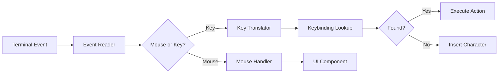

# Command Pattern Deep Dive: Commands, Undo/Redo, and Command Palette

## Introduction

The command pattern is the backbone of editor interactions. This document explores how Fresh implements commands, the command palette, undo/redo, and input handling.

---

## Part 1: The Command Pattern

### What Is the Command Pattern?

The command pattern encapsulates actions as objects:

```rust
pub trait Command {
    fn execute(&mut self, context: &mut EditorContext);
    fn undo(&mut self, context: &mut EditorContext);
    fn description(&self) -> &str;
}

// Example command
pub struct InsertTextCommand {
    position: usize,
    text: String,
    original_text: Option<String>,  // For undo
}

impl Command for InsertTextCommand {
    fn execute(&mut self, ctx: &mut EditorContext) {
        // Save original for undo
        self.original_text = Some(ctx.buffer.get_text_range(self.position, self.text.len()));

        // Insert text
        ctx.buffer.insert(self.position, &self.text);
    }

    fn undo(&mut self, ctx: &mut EditorContext) {
        // Restore original text
        if let Some(original) = &self.original_text {
            ctx.buffer.replace(self.position, self.text.len(), original);
        }
    }

    fn description(&self) -> &str {
        "Insert Text"
    }
}
```

### Benefits

1. **Undo/Redo**: Every command knows how to undo itself
2. **Macro Recording**: Commands can be recorded and replayed
3. **Transaction Support**: Multiple commands can be grouped
4. **Command History**: Easy to log and replay commands

---

## Part 2: Fresh's Command System

### Command Structure

```rust
pub struct Command {
    pub name: String,              // Display name (e.g., "File: Open")
    pub description: String,       // For command palette
    pub action: Action,            // The actual action to execute
    pub contexts: Vec<KeyContext>, // Where this command is available
    pub custom_contexts: Vec<String>, // Plugin-defined contexts
    pub source: CommandSource,     // Builtin or Plugin
}

pub enum CommandSource {
    Builtin,
    Plugin(String),  // Plugin name
}

#[derive(Clone, Copy, PartialEq)]
pub enum KeyContext {
    Normal,
    Terminal,
    FileExplorer,
    Prompt,
    Popup,
}
```

### Action Definitions

```rust
pub enum Action {
    // File operations
    Open,
    Save,
    SaveAs,
    Close,

    // Editing
    Undo,
    Redo,
    Cut,
    Copy,
    Paste,

    // Search
    Find,
    Replace,
    FindInFiles,

    // Navigation
    GoToLine,
    GoToFile,
    GoToDefinition,

    // View
    ToggleLineNumbers,
    ToggleWordWrap,
    SplitHorizontal,
    SplitVertical,

    // Commands
    OpenCommandPalette,

    // Plugin actions
    PluginAction {
        plugin: String,
        action: String,
    },
}
```

### Command Registry

```rust
pub struct CommandRegistry {
    commands: Vec<Command>,
    keybindings: HashMap<KeyBinding, Action>,
}

impl CommandRegistry {
    pub fn new() -> Self {
        let mut registry = Self {
            commands: Vec::new(),
            keybindings: HashMap::new(),
        };

        // Register builtin commands
        registry.register_builtin_commands();

        registry
    }

    fn register_builtin_commands(&mut self) {
        // File operations
        self.register(Command {
            name: t!("cmd.open_file"),  // Localized
            description: t!("cmd.open_file_desc"),
            action: Action::Open,
            contexts: vec![],  // Available in all contexts
            custom_contexts: vec![],
            source: CommandSource::Builtin,
        });

        self.register(Command {
            name: t!("cmd.save_file"),
            description: t!("cmd.save_file_desc"),
            action: Action::Save,
            contexts: vec![KeyContext::Normal],
            custom_contexts: vec![],
            source: CommandSource::Builtin,
        });

        // ... more builtin commands
    }

    pub fn register(&mut self, command: Command) {
        self.commands.push(command);
    }

    pub fn get_commands(&self, context: KeyContext) -> Vec<&Command> {
        self.commands
            .iter()
            .filter(|c| c.contexts.is_empty() || c.contexts.contains(&context))
            .collect()
    }

    pub fn bind(&mut self, keybinding: KeyBinding, action: Action) {
        self.keybindings.insert(keybinding, action);
    }

    pub fn lookup(&self, keybinding: &KeyBinding) -> Option<Action> {
        self.keybindings.get(keybinding).copied()
    }
}
```

---

## Part 3: Keybinding System

### Key Binding Structure

```rust
#[derive(Debug, Clone, PartialEq, Eq, Hash)]
pub struct KeyBinding {
    pub key: KeyCode,
    pub modifiers: KeyModifiers,
}

#[derive(Debug, Clone, Copy, PartialEq, Eq, Hash)]
pub struct KeyModifiers {
    pub ctrl: bool,
    pub alt: bool,
    pub shift: bool,
    pub super_: bool,  // Command on macOS
}

impl KeyBinding {
    pub fn new(key: KeyCode, modifiers: KeyModifiers) -> Self {
        Self { key, modifiers }
    }

    pub fn ctrl(key: KeyCode) -> Self {
        Self {
            key,
            modifiers: KeyModifiers {
                ctrl: true,
                alt: false,
                shift: false,
                super_: false,
            },
        }
    }

    pub fn display(&self) -> String {
        let mut parts = Vec::new();

        if self.modifiers.ctrl {
            parts.push("Ctrl");
        }
        if self.modifiers.alt {
            parts.push("Alt");
        }
        if self.modifiers.super_ {
            parts.push("Cmd");  // or "Super" on Linux
        }
        if self.modifiers.shift {
            parts.push("Shift");
        }

        parts.push(self.key.display());

        parts.join("+")
    }
}
```

### Loading Keybindings from Config

```json
// ~/.config/fresh/keybindings.json
{
    "ctrl+s": "File: Save",
    "ctrl+shift+s": "File: Save As",
    "ctrl+p": "File: Quick Open",
    "ctrl+shift+p": "Command Palette",
    "alt+enter": "Terminal: Toggle",
    "ctrl+`": "Terminal: New"
}
```

```rust
pub fn load_keybindings(path: &Path) -> Result<HashMap<KeyBinding, String>> {
    let content = std::fs::read_to_string(path)?;
    let json: HashMap<String, String> = serde_json::from_str(&content)?;

    let mut bindings = HashMap::new();

    for (key_str, action_str) in json {
        if let Some(binding) = parse_keybinding(&key_str) {
            bindings.insert(binding, action_str);
        }
    }

    Ok(bindings)
}

fn parse_keybinding(s: &str) -> Option<KeyBinding> {
    let parts: Vec<&str> = s.split('+').collect();

    let mut modifiers = KeyModifiers {
        ctrl: false, alt: false, shift: false, super_: false,
    };

    let mut key_part = parts.last()?;

    for part in &parts[..parts.len() - 1] {
        match part.to_lowercase().as_str() {
            "ctrl" => modifiers.ctrl = true,
            "alt" => modifiers.alt = true,
            "shift" => modifiers.shift = true,
            "cmd" | "super" | "win" => modifiers.super_ = true,
            _ => {}
        }
    }

    let key = parse_key_code(key_part)?;

    Some(KeyBinding::new(key, modifiers))
}
```

---

## Part 4: Command Palette

### Implementation

```rust
pub struct CommandPalette {
    commands: Vec<Command>,
    filter: String,
    selected: usize,
    scroll_offset: usize,
    visible_count: usize,
}

impl CommandPalette {
    pub fn new(commands: Vec<Command>) -> Self {
        Self {
            commands,
            filter: String::new(),
            selected: 0,
            scroll_offset: 0,
            visible_count: 10,
        }
    }

    pub fn update_filter(&mut self, filter: &str) {
        self.filter = filter.to_string();
        self.selected = 0;
        self.scroll_offset = 0;
    }

    pub fn filtered_commands(&self) -> Vec<&Command> {
        if self.filter.is_empty() {
            return self.commands.iter().collect();
        }

        let filter_lower = self.filter.to_lowercase();

        self.commands
            .iter()
            .filter(|cmd| {
                cmd.name.to_lowercase().contains(&filter_lower)
                    || cmd.description.to_lowercase().contains(&filter_lower)
            })
            .collect()
    }

    pub fn select_next(&mut self) {
        let filtered = self.filtered_commands();
        if !filtered.is_empty() {
            self.selected = (self.selected + 1) % filtered.len();

            // Adjust scroll if needed
            if self.selected >= self.scroll_offset + self.visible_count {
                self.scroll_offset = self.selected - self.visible_count + 1;
            }
        }
    }

    pub fn select_previous(&mut self) {
        let filtered = self.filtered_commands();
        if !filtered.is_empty() {
            self.selected = self.selected.checked_sub(1).unwrap_or(filtered.len() - 1);

            // Adjust scroll if needed
            if self.selected < self.scroll_offset {
                self.scroll_offset = self.selected;
            }
        }
    }

    pub fn execute_selected(&self, editor: &mut Editor) -> Result<()> {
        let filtered = self.filtered_commands();
        if let Some(cmd) = filtered.get(self.selected) {
            editor.execute_action(&cmd.action)?;
        }
        Ok(())
    }
}
```

### Rendering the Command Palette

```rust
pub fn render_command_palette(
    frame: &mut Frame,
    palette: &CommandPalette,
    area: Rect,
) {
    // Create popup area
    let popup_area = centered_rect(60, 50, area);

    // Build input line
    let input = Paragraph::new(format!("> {}", palette.filter))
        .style(Style::default().fg(Color::White));

    // Build command list
    let filtered = palette.filtered_commands();
    let items: Vec<Line> = filtered
        .iter()
        .enumerate()
        .map(|(i, cmd)| {
            let style = if i == palette.selected {
                Style::default()
                    .bg(Color::Blue)
                    .fg(Color::White)
            } else {
                Style::default()
            };

            Line::styled(
                format!("{}  {}", cmd.name, cmd.description),
                style,
            )
        })
        .skip(palette.scroll_offset)
        .take(palette.visible_count)
        .collect();

    let list = List::new(items)
        .block(Block::bordered().title("Commands"));

    // Render
    frame.render_widget(Clear, popup_area);
    frame.render_widget(input, popup_area);
    frame.render_widget(list, popup_area);
}

fn centered_rect(percent_x: u16, percent_y: u16, area: Rect) -> Rect {
    let popup_layout = Layout::default()
        .direction(Direction::Vertical)
        .constraints([
            Constraint::Percentage((100 - percent_y) / 2),
            Constraint::Percentage(percent_y),
            Constraint::Percentage((100 - percent_y) / 2),
        ])
        .split(area);

    Layout::default()
        .direction(Direction::Horizontal)
        .constraints([
            Constraint::Percentage((100 - percent_x) / 2),
            Constraint::Percentage(percent_x),
            Constraint::Percentage((100 - percent_x) / 2),
        ])
        .split(popup_layout[1])[1]
}
```

---

## Part 5: Undo/Redo with Piece Tree

### Snapshot-Based Undo

```rust
pub struct UndoHistory {
    undo_stack: Vec<BufferSnapshot>,
    redo_stack: Vec<BufferSnapshot>,
    max_history: usize,
    current_version: u64,
}

#[derive(Clone)]
pub struct BufferSnapshot {
    pub piece_tree: PieceTree,
    pub buffers: Vec<StringBuffer>,
    pub next_buffer_id: usize,
    pub version: u64,
}

impl TextBuffer {
    pub fn save_for_undo(&mut self) {
        let snapshot = BufferSnapshot {
            piece_tree: self.piece_tree.clone(),
            buffers: self.buffers.clone(),
            next_buffer_id: self.next_buffer_id,
            version: self.version,
        };

        self.undo_history.undo_stack.push(snapshot);

        // Limit history size
        while self.undo_history.undo_stack.len() > self.undo_history.max_history {
            self.undo_history.undo_stack.remove(0);
        }

        // Clear redo stack on new action
        self.undo_history.redo_stack.clear();
    }

    pub fn undo(&mut self) -> bool {
        if self.undo_history.undo_stack.is_empty() {
            return false;
        }

        // Save current for redo
        let current = BufferSnapshot {
            piece_tree: self.piece_tree.clone(),
            buffers: self.buffers.clone(),
            next_buffer_id: self.next_buffer_id,
            version: self.version,
        };
        self.undo_history.redo_stack.push(current);

        // Restore previous
        let snapshot = self.undo_history.undo_stack.pop().unwrap();
        self.restore_snapshot(snapshot);

        true
    }

    pub fn redo(&mut self) -> bool {
        if self.undo_history.redo_stack.is_empty() {
            return false;
        }

        // Save current for undo
        let current = BufferSnapshot {
            piece_tree: self.piece_tree.clone(),
            buffers: self.buffers.clone(),
            next_buffer_id: self.next_buffer_id,
            version: self.version,
        };
        self.undo_history.undo_stack.push(current);

        // Restore redo
        let snapshot = self.undo_history.redo_stack.pop().unwrap();
        self.restore_snapshot(snapshot);

        true
    }

    fn restore_snapshot(&mut self, snapshot: BufferSnapshot) {
        self.piece_tree = snapshot.piece_tree;
        self.buffers = snapshot.buffers;
        self.next_buffer_id = snapshot.next_buffer_id;
        self.version = snapshot.version;
        self.modified = true;
    }
}
```

### Compound Undo with BulkEdit

```rust
pub struct BulkEdit {
    edits: Vec<Edit>,
    original_snapshot: Option<BufferSnapshot>,
    skip_threshold: usize,  // Don't save snapshot for small edits
}

impl BulkEdit {
    pub fn start(buffer: &TextBuffer) -> Self {
        Self {
            edits: Vec::new(),
            original_snapshot: None,  // Lazy snapshot
            skip_threshold: 100,
        }
    }

    pub fn add(&mut self, edit: Edit) {
        self.edits.push(edit);
    }

    pub fn finish(mut self, buffer: &mut TextBuffer) {
        if self.edits.is_empty() {
            return;
        }

        // Only save snapshot if edit is significant
        let estimated_change = self.edits.iter().map(|e| e.size()).sum::<usize>();

        if estimated_change > self.skip_threshold {
            self.original_snapshot = Some(buffer.save_snapshot());
        }

        // Apply all edits in reverse order (so positions stay valid)
        self.edits.sort_by_key(|e| Reverse(e.position()));

        for edit in self.edits {
            buffer.apply(edit);
        }

        // Single undo step for entire bulk edit
        if let Some(snapshot) = self.original_snapshot {
            buffer.undo_stack.push(snapshot);
            buffer.redo_stack.clear();
        }
    }
}

// Usage: Replace all occurrences
fn replace_all(buffer: &mut TextBuffer, pattern: &Regex, replacement: &str) {
    let mut bulk_edit = BulkEdit::start(buffer);

    for m in pattern.find_iter(buffer.get_all_text()) {
        bulk_edit.add(Edit::Delete(m.start(), m.end()));
        bulk_edit.add(Edit::Insert(m.start(), replacement.to_string()));
    }

    bulk_edit.finish(buffer);
    // Single undo step for entire "replace all" operation
}
```

---

## Part 6: Input Handling Pipeline

### Event Flow



### Input Handler

```rust
pub struct InputHandler {
    keybindings: HashMap<KeyBinding, Action>,
    mode: InputMode,
}

pub enum InputMode {
    Normal,
    Insert,
    Prompt,
    Popup,
}

impl InputHandler {
    pub fn handle_event(&mut self, event: Event, editor: &mut Editor) -> Result<()> {
        match event {
            Event::Key(key_event) => self.handle_key(key_event, editor),
            Event::Mouse(mouse_event) => self.handle_mouse(mouse_event, editor),
            Event::Resize(width, height) => self.handle_resize(width, height, editor),
        }
    }

    fn handle_key(&mut self, key_event: KeyEvent, editor: &mut Editor) -> Result<()> {
        // Check for special modes first
        match self.mode {
            InputMode::Prompt => return self.handle_prompt_key(key_event, editor),
            InputMode::Popup => return self.handle_popup_key(key_event, editor),
            _ => {}
        }

        // Build keybinding
        let binding = KeyBinding::from(key_event);

        // Lookup action
        if let Some(action) = editor.commands.lookup(&binding) {
            editor.execute_action(&action)?;
            return Ok(());
        }

        // No binding - insert character if printable
        if let KeyCode::Char(c) = key_event.code {
            if !key_event.modifiers.ctrl && !key_event.modifiers.alt {
                editor.insert_char(c)?;
            }
        }

        Ok(())
    }

    fn handle_mouse(&mut self, event: MouseEvent, editor: &mut Editor) -> Result<()> {
        match event.kind {
            MouseEventKind::Down(MouseButton::Left) => {
                // Handle click
                let (col, row) = (event.column as usize, event.row as usize);
                editor.move_cursor_to(col, row)?;
            }
            MouseEventKind::ScrollUp => {
                editor.scroll_up()?;
            }
            MouseEventKind::ScrollDown => {
                editor.scroll_down()?;
            }
            _ => {}
        }

        Ok(())
    }
}
```

### Multi-Cursor Input

```rust
pub struct MultiCursorInput {
    primary: Cursor,
    additional: Vec<Cursor>,
}

impl InputHandler {
    fn handle_key_with_multi_cursor(
        &mut self,
        key: KeyEvent,
        editor: &mut Editor,
    ) -> Result<()> {
        let cursors = editor.multi_cursor.all_cursors();

        match key.code {
            KeyCode::Char(c) => {
                // Insert at all cursors
                let mut edits: Vec<(usize, char)> = cursors
                    .iter()
                    .map(|c| (c.position(), c))
                    .collect();

                // Sort in reverse order so positions stay valid
                edits.sort_by_key(|(pos, _)| Reverse(*pos));

                for (pos, _) in edits {
                    editor.buffer.insert(pos, c);
                }

                // Move all cursors forward
                for cursor in &mut editor.multi_cursor.all_cursors_mut() {
                    cursor.move_right();
                }
            }

            KeyCode::Backspace => {
                // Delete before each cursor
                for cursor in cursors.iter().rev() {
                    if cursor.position() > 0 {
                        editor.buffer.delete_at(cursor.position() - 1);
                        cursor.move_left();
                    }
                }
            }

            _ => {
                // For other keys, just use primary cursor
                self.handle_key(key, editor)?;
            }
        }

        Ok(())
    }
}
```

---

## Part 7: Keyboard Macros

### Recording Macros

```rust
pub struct MacroRecorder {
    recording: bool,
    recorded_keys: Vec<KeyEvent>,
    recorded_actions: Vec<Action>,
}

impl Editor {
    pub fn start_recording_macro(&mut self, name: &str) {
        self.macro_recorder = MacroRecorder {
            recording: true,
            recorded_keys: Vec::new(),
            recorded_actions: Vec::new(),
        };
    }

    pub fn stop_recording_macro(&mut self) -> Option<KeyboardMacro> {
        if !self.macro_recorder.recording {
            return None;
        }

        self.macro_recorder.recording = false;

        Some(KeyboardMacro {
            name: self.current_macro_name.clone(),
            keys: self.macro_recorder.recorded_keys.clone(),
            actions: self.macro_recorder.recorded_actions.clone(),
        })
    }

    pub fn record_key(&mut self, key: KeyEvent) {
        if self.macro_recorder.recording {
            self.macro_recorder.recorded_keys.push(key);
        }
    }

    pub fn record_action(&mut self, action: Action) {
        if self.macro_recorder.recording {
            self.macro_recorder.recorded_actions.push(action);
        }
    }
}
```

### Playing Macros

```rust
pub struct KeyboardMacro {
    name: String,
    keys: Vec<KeyEvent>,
    actions: Vec<Action>,
}

impl Editor {
    pub fn play_macro(&mut self, macro: &KeyboardMacro) -> Result<()> {
        for action in &macro.actions {
            self.execute_action(action)?;

            // Small delay between actions
            std::thread::sleep(Duration::from_millis(10));
        }

        Ok(())
    }
}
```

---

## Resources

- [Fresh Source: input/commands.rs](/home/darkvoid/Boxxed/@formulas/src.rust/src.CodingIDE/fresh/crates/fresh-editor/src/input/commands.rs) - Command palette
- [Fresh Source: input/keybindings.rs](/home/darkvoid/Boxxed/@formulas/src.rust/src.CodingIDE/fresh/crates/fresh-editor/src/input/keybindings.rs) - Keybinding system
- [Fresh Source: input/handler.rs](/home/darkvoid/Boxxed/@formulas/src.rust/src.CodingIDE/fresh/crates/fresh-editor/src/input/handler.rs) - Input handling
- [Fresh Source: model/edit.rs](/home/darkvoid/Boxxed/@formulas/src.rust/src.CodingIDE/fresh/crates/fresh-editor/src/model/edit.rs) - Edit operations
