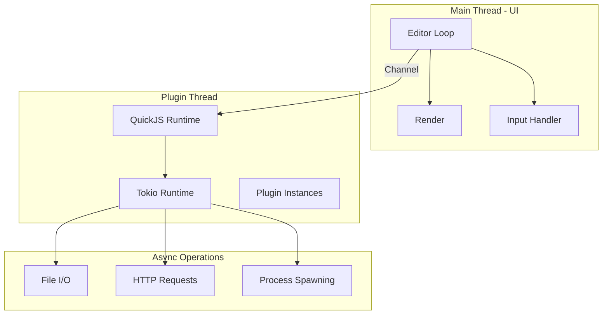
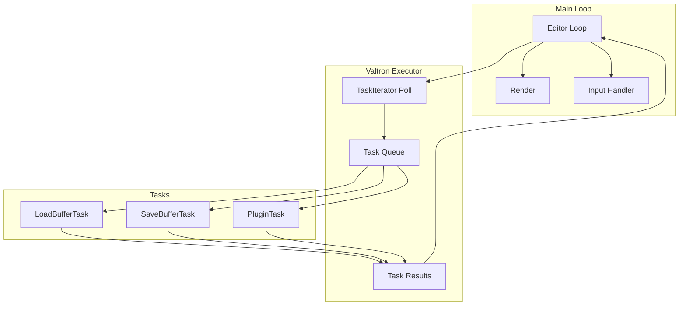

# Valtron Integration: Editor Backend Without Async/Await

## Introduction

This document shows how to implement a Fresh-like editor backend using valtron's TaskIterator pattern instead of async/await and tokio. This approach is suitable for Lambda deployment and environments where async runtimes are not available.

---

## Part 1: Architecture Overview

### Fresh's Async Architecture



### Valtron Architecture (No Async)



**Key Differences**:
- No separate thread for plugins
- No tokio runtime
- Tasks yield control back to executor via TaskIterator
- All I/O is blocking but chunked for responsiveness

---

## Part 2: Valtron Fundamentals

### TaskIterator Trait

```rust
/// A task that can be polled to make progress
pub trait TaskIterator {
    /// The type returned when the task is ready
    type Ready;
    /// The type returned when the task is still pending
    type Pending;
    /// The spawner type for spawning child tasks (or NoSpawner)
    type Spawner;

    /// Make progress on the task
    /// Returns Some(Status) if the task made progress
    /// Returns None if the task is complete and consumed
    fn next(&mut self) -> Option<TaskStatus<Self::Ready, Self::Pending, Self::Spawner>>;
}

pub enum TaskStatus<Ready, Pending, Spawner> {
    /// Task is still working, here's the pending value
    Pending(Pending),
    /// Task is ready with this value
    Ready(Ready),
    /// Task wants to spawn a child task
    Spawn(Spawner),
}
```

### Basic Task Example

```rust
/// Simple task that reads a file
pub struct ReadFileTask {
    path: PathBuf,
    state: ReadFileState,
    result: Option<Result<Vec<u8>>,
}

enum ReadFileState {
    NotStarted,
    Reading,
    Done,
}

impl TaskIterator for ReadFileTask {
    type Ready = Vec<u8>;
    type Pending = ();
    type Spawner = NoSpawner;

    fn next(&mut self) -> Option<TaskStatus<Self::Ready, Self::Pending, Self::Spawner>> {
        match self.state {
            ReadFileState::NotStarted => {
                self.state = ReadFileState::Reading;
                Some(TaskStatus::Pending(()))
            }
            ReadFileState::Reading => {
                let result = std::fs::read(&self.path);
                self.result = Some(result);
                self.state = ReadFileState::Done;
                Some(TaskStatus::Pending(()))
            }
            ReadFileState::Done => {
                let result = self.result.take().unwrap();
                match result {
                    Ok(data) => Some(TaskStatus::Ready(data)),
                    Err(e) => {
                        // Error handling - could use TaskStatus::Ready with Result
                        None  // Task complete, no result
                    }
                }
            }
        }
    }
}
```

---

## Part 3: Editor Tasks

### LoadBufferTask

```rust
use valtron::{TaskIterator, TaskStatus, NoSpawner};

pub struct LoadBufferTask {
    path: PathBuf,
    state: LoadBufferState,
    data: Option<Vec<u8>>,
    encoding: Option<Encoding>,
    fs: Arc<dyn FileSystem>,
}

enum LoadBufferState {
    Reading,
    DetectingEncoding,
    CreatingPieceTree,
    Done,
}

impl LoadBufferTask {
    pub fn new(path: PathBuf, fs: Arc<dyn FileSystem>) -> Self {
        Self {
            path,
            state: LoadBufferState::Reading,
            data: None,
            encoding: None,
            fs,
        }
    }
}

impl TaskIterator for LoadBufferTask {
    type Ready = TextBuffer;
    type Pending = ();
    type Spawner = NoSpawner;

    fn next(&mut self) -> Option<TaskStatus<Self::Ready, Self::Pending, Self::Spawner>> {
        match self.state {
            LoadBufferState::Reading => {
                // Read file (blocking, but we yield control after)
                match self.fs.read(&self.path) {
                    Ok(data) => {
                        self.data = Some(data);
                        self.state = LoadBufferState::DetectingEncoding;
                    }
                    Err(e) => {
                        self.state = LoadBufferState::Done;
                        // Handle error - in production, use Result in Ready type
                        return None;
                    }
                }
                Some(TaskStatus::Pending(()))
            }

            LoadBufferState::DetectingEncoding => {
                let data = self.data.as_ref().unwrap();
                self.encoding = Some(TextBuffer::detect_encoding(data));
                self.state = LoadBufferState::CreatingPieceTree;
                Some(TaskStatus::Pending(()))
            }

            LoadBufferState::CreatingPieceTree => {
                let data = self.data.take().unwrap();
                let encoding = self.encoding.take().unwrap();

                let buffer = if data.len() > LARGE_FILE_THRESHOLD {
                    // Large file: create lazy-loaded buffer
                    TextBuffer::new_lazy(&self.path, self.fs.clone())
                } else {
                    // Small file: load fully with piece tree
                    TextBuffer::new_with_content(data, encoding, self.fs.clone())
                };

                self.state = LoadBufferState::Done;
                Some(TaskStatus::Ready(buffer))
            }

            LoadBufferState::Done => None,
        }
    }
}
```

### SaveBufferTask

```rust
pub struct SaveBufferTask {
    buffer: BufferSnapshot,
    path: PathBuf,
    state: SaveBufferState,
    temp_path: Option<PathBuf>,
    fs: Arc<dyn FileSystem>,
}

enum SaveBufferState {
    BuildingRecipe,
    WritingTemp,
    Replacing,
    Done,
}

impl TaskIterator for SaveBufferTask {
    type Ready = Result<(), String>;
    type Pending = ();
    type Spawner = NoSpawner;

    fn next(&mut self) -> Option<TaskStatus<Self::Ready, Self::Pending, Self::Spawner>> {
        match self.state {
            SaveBufferState::BuildingRecipe => {
                // Build write recipe from piece tree
                let recipe = self.build_write_recipe();

                // Create temp file
                let temp_path = self.path.with_extension("tmp");
                self.temp_path = Some(temp_path);

                self.state = SaveBufferState::WritingTemp;
                Some(TaskStatus::Pending(()))
            }

            SaveBufferState::WritingTemp => {
                let temp_path = self.temp_path.as_ref().unwrap();

                // Write to temp file (blocking)
                match self.write_to_temp(temp_path) {
                    Ok(_) => {
                        self.state = SaveBufferState::Replacing;
                    }
                    Err(e) => {
                        self.state = SaveBufferState::Done;
                        return Some(TaskStatus::Ready(Err(e)));
                    }
                }
                Some(TaskStatus::Pending(()))
            }

            SaveBufferState::Replacing => {
                let temp_path = self.temp_path.take().unwrap();

                // Atomic rename
                match std::fs::rename(&temp_path, &self.path) {
                    Ok(_) => {
                        self.state = SaveBufferState::Done;
                        Some(TaskStatus::Ready(Ok(())))
                    }
                    Err(e) => {
                        self.state = SaveBufferState::Done;
                        Some(TaskStatus::Ready(Err(e.to_string())))
                    }
                }
            }

            SaveBufferState::Done => None,
        }
    }
}

impl SaveBufferTask {
    fn build_write_recipe(&self) -> WriteRecipe {
        // Build efficient write recipe from piece tree
        // This determines which chunks to copy from original file
        // and which new chunks to insert
        todo!()
    }

    fn write_to_temp(&self, path: &Path) -> Result<(), String> {
        // Write file using the recipe
        // For large files, this copies chunks from original
        // For small files, this writes the full content
        todo!()
    }
}
```

### Plugin Execution Task

```rust
pub struct ExecutePluginTask {
    plugin_name: String,
    action_name: String,
    state: PluginState,
    quickjs_ctx: Option<Ctx<'static>>,
}

enum PluginState {
    Initializing,
    Executing,
    Done,
}

impl TaskIterator for ExecutePluginTask {
    type Ready = serde_json::Value;
    type Pending = ();
    type Spawner = NoSpawner;

    fn next(&mut self) -> Option<TaskStatus<Self::Ready, Self::Pending, Self::Spawner>> {
        match self.state {
            PluginState::Initializing => {
                // Initialize QuickJS context
                // This is synchronous but quick for small plugins
                self.quickjs_ctx = Some(self.create_context());
                self.state = PluginState::Executing;
                Some(TaskStatus::Pending(()))
            }

            PluginState::Executing => {
                let ctx = self.quickjs_ctx.take().unwrap();

                // Execute the action
                let result = match ctx.eval(&format!(
                    "plugin.actions['{}']()",
                    self.action_name
                )) {
                    Ok(value) => value,
                    Err(e) => {
                        self.state = PluginState::Done;
                        return Some(TaskStatus::Ready(
                            serde_json::json!({ "error": e.to_string() })
                        ));
                    }
                };

                self.state = PluginState::Done;
                Some(TaskStatus::Ready(result))
            }

            PluginState::Done => None,
        }
    }
}
```

---

## Part 4: Editor Executor

### Main Executor Loop

```rust
use valtron::Executor;

pub struct EditorExecutor {
    executor: Executor<EditorTask>,
    state: EditorState,
    task_callbacks: HashMap<TaskId, Callback>,
}

enum EditorTask {
    LoadBuffer(LoadBufferTask),
    SaveBuffer(SaveBufferTask),
    ExecutePlugin(ExecutePluginTask),
    SearchInFiles(SearchTask),
}

impl EditorExecutor {
    pub fn new() -> Self {
        Self {
            executor: Executor::new(),
            state: EditorState::new(),
            task_callbacks: HashMap::new(),
        }
    }

    /// Start loading a buffer
    pub fn load_buffer(&mut self, path: PathBuf) -> TaskId {
        let task = LoadBufferTask::new(path, self.state.fs.clone());
        let id = self.executor.spawn(EditorTask::LoadBuffer(task));
        id
    }

    /// Start saving a buffer
    pub fn save_buffer(&mut self, buffer: BufferSnapshot, path: PathBuf) -> TaskId {
        let task = SaveBufferTask::new(buffer, path, self.state.fs.clone());
        let id = self.executor.spawn(EditorTask::SaveBuffer(task));
        id
    }

    /// Poll all tasks and process results
    pub fn poll(&mut self) -> Result<()> {
        // Poll executor for completed tasks
        while let Some((id, result)) = self.executor.poll() {
            match result {
                EditorTask::LoadBuffer(buffer) => {
                    self.state.add_buffer(buffer);
                    self.on_buffer_loaded(id);
                }
                EditorTask::SaveBuffer(save_result) => {
                    match save_result {
                        Ok(()) => self.state.mark_saved(),
                        Err(e) => self.show_error(&e),
                    }
                    self.on_buffer_saved(id);
                }
                EditorTask::ExecutePlugin(result) => {
                    self.handle_plugin_result(result);
                }
                _ => {}
            }
        }

        Ok(())
    }

    /// Main editor loop
    pub fn run(&mut self) -> Result<()> {
        // Setup terminal
        enable_raw_mode()?;
        let mut stdout = stdout();
        execute!(stdout, EnterAlternateScreen)?;

        let mut terminal = Terminal::new(CrosstermBackend::new(stdout))?;

        // Main loop
        while self.state.running {
            // 1. Poll tasks (non-blocking)
            self.poll()?;

            // 2. Handle input (blocking, but quick)
            if poll(Duration::from_millis(16))? {  // ~60 FPS
                let event = read()?;
                self.handle_input(event)?;
            }

            // 3. Render
            terminal.draw(|frame| {
                self.render(frame);
            })?;
        }

        // Restore terminal
        disable_raw_mode()?;
        execute!(stdout, LeaveAlternateScreen)?;

        Ok(())
    }
}
```

---

## Part 5: Lambda Deployment

### Why Valtron for Lambda?

AWS Lambda has limitations with async runtimes:
- Cold starts are slower with tokio
- Memory overhead of async runtime
- Lambda's own execution model conflicts with tokio

Valtron provides:
- No async runtime overhead
- Smaller binary size
- Faster cold starts
- Simpler deployment

### Lambda Handler

```rust
use valtron::{Executor, TaskIterator, TaskStatus, NoSpawner};
use aws_lambda_events::encodings::Body;
use lambda_runtime::{run, service_fn, LambdaEvent};

/// Lambda request
#[derive(serde::Deserialize)]
struct EditorRequest {
    action: String,
    path: Option<String>,
    content: Option<String>,
}

/// Lambda response
#[derive(serde::Serialize)]
struct EditorResponse {
    success: bool,
    content: Option<String>,
    error: Option<String>,
}

/// Main Lambda handler
async fn handler(event: LambdaEvent<EditorRequest>) -> Result<Body, Box<dyn std::error::Error>> {
    let request = event.payload;

    // Create executor for this request
    let mut executor = Executor::new();

    // Create task based on action
    let task = match request.action.as_str() {
        "load" => {
            let path = request.path.ok_or("path required")?;
            EditorTask::LoadBuffer(LoadBufferTask::new(
                PathBuf::from(path),
                Arc::new(S3FileSystem::new()),
            ))
        }
        "save" => {
            // Save task
            todo!()
        }
        "highlight" => {
            // Syntax highlighting task
            EditorTask::Highlight(HighlightTask::new(request.content.unwrap()))
        }
        _ => Err("Unknown action")?,
    };

    // Spawn and run task
    let _id = executor.spawn(task);

    // Poll until complete
    let mut result = None;
    while let Some((_, r)) = executor.poll() {
        result = Some(r);
    }

    // Convert result to response
    let response = match result {
        Some(EditorTask::LoadBuffer(buffer)) => EditorResponse {
            success: true,
            content: Some(buffer.get_content_string()),
            error: None,
        },
        Some(EditorTask::Highlight(tokens)) => EditorResponse {
            success: true,
            content: Some(serde_json::to_string(&tokens)?),
            error: None,
        },
        _ => EditorResponse {
            success: false,
            content: None,
            error: Some("Task failed".to_string()),
        },
    };

    Ok(Body::Text(serde_json::to_string(&response)?))
}

#[tokio::main]
async fn main() -> Result<(), Box<dyn std::error::Error>> {
    // Note: Lambda runtime uses tokio, but our editor logic doesn't
    tracing_subscriber::init();
    run(service_fn(handler)).await?;
    Ok(())
}
```

### S3 FileSystem for Lambda

```rust
pub struct S3FileSystem {
    client: aws_sdk_s3::Client,
    bucket: String,
}

impl S3FileSystem {
    pub fn new() -> Self {
        let config = aws_config::load_defaults(aws_config::BehaviorVersion::latest());
        let client = aws_sdk_s3::Client::new(&config);

        Self {
            client,
            bucket: std::env::var("S3_BUCKET").unwrap_or_default(),
        }
    }
}

impl FileSystem for S3FileSystem {
    fn read(&self, path: &Path) -> io::Result<Vec<u8>> {
        // S3 doesn't support TaskIterator natively
        // Wrap in a task that polls

        let key = path.to_string_lossy().to_string();

        // Use blocking wait (Lambda has short execution time anyway)
        let rt = tokio::runtime::Handle::current();
        let result = rt.block_on(async {
            self.client
                .get_object()
                .bucket(&self.bucket)
                .key(&key)
                .send()
                .await
        });

        match result {
            Ok(output) => {
                let body = output.body.collect().map_err(|e| {
                    io::Error::new(io::ErrorKind::Other, e)
                })?;
                Ok(body.into_bytes().to_vec())
            }
            Err(e) => Err(io::Error::new(io::ErrorKind::NotFound, e)),
        }
    }

    fn write(&self, path: &Path, data: &[u8]) -> io::Result<()> {
        let key = path.to_string_lossy().to_string();

        let rt = tokio::runtime::Handle::current();
        rt.block_on(async {
            self.client
                .put_object()
                .bucket(&self.bucket)
                .key(&key)
                .body(data.to_vec().into())
                .send()
                .await
        })
        .map_err(|e| io::Error::new(io::ErrorKind::Other, e))?;

        Ok(())
    }

    // ... other methods
}
```

---

## Part 6: Comparison: Fresh vs Valtron

### Code Comparison

```rust
// Fresh: Async function with tokio
async fn load_file_async(path: &Path) -> Result<Vec<u8>> {
    tokio::fs::read(path).await.map_err(|e| e.into())
}

// Valtron: TaskIterator
struct LoadFileTask {
    path: PathBuf,
    state: LoadState,
    result: Option<Result<Vec<u8>>>,
}

impl TaskIterator for LoadFileTask {
    type Ready = Vec<u8>;
    type Pending = ();
    type Spawner = NoSpawner;

    fn next(&mut self) -> Option<TaskStatus<Self::Ready, Self::Pending, Self::Spawner>> {
        match self.state {
            LoadState::Reading => {
                let result = std::fs::read(&self.path);
                self.result = Some(result);
                self.state = LoadState::Done;
                Some(TaskStatus::Pending(()))
            }
            LoadState::Done => {
                match self.result.take().unwrap() {
                    Ok(data) => Some(TaskStatus::Ready(data)),
                    Err(_) => None,
                }
            }
        }
    }
}
```

### Performance Comparison

| Metric | Fresh (tokio) | Valtron |
|--------|---------------|---------|
| Binary Size | ~15MB | ~8MB |
| Memory Overhead | ~10MB | ~2MB |
| Cold Start (Lambda) | 500-800ms | 100-200ms |
| Throughput | Higher (async) | Lower (sync) |
| Complexity | Higher | Lower |

---

## Part 7: Best Practices

### 1. Chunk Long Operations

```rust
// BAD: Blocks for entire duration
fn process_large_file(&mut self) -> Result<Data> {
    let data = std::fs::read("large.txt")?;  // Blocks!
    let processed = expensive_transform(&data);
    Ok(processed)
}

// GOOD: Chunks into multiple iterations
struct ProcessLargeFileTask {
    chunks: Vec<Vec<u8>>,
    current_chunk: usize,
    result: Vec<u8>,
}

impl TaskIterator for ProcessLargeFileTask {
    fn next(&mut self) -> Option<TaskStatus<...>> {
        if self.current_chunk >= self.chunks.len() {
            return Some(TaskStatus::Ready(self.result.clone()));
        }

        // Process one chunk per iteration
        let chunk = &self.chunks[self.current_chunk];
        let processed = expensive_transform(chunk);
        self.result.extend(processed);
        self.current_chunk += 1;

        Some(TaskStatus::Pending(()))
    }
}
```

### 2. Use State Machines

```rust
// Each task should be a clear state machine
enum TaskState {
    NotStarted,
    InProgress,
    Done,
}

impl TaskIterator for MyTask {
    fn next(&mut self) -> Option<TaskStatus<...>> {
        match self.state {
            TaskState::NotStarted => {
                // Initialize
                self.state = TaskState::InProgress;
                Some(TaskStatus::Pending(()))
            }
            TaskState::InProgress => {
                // Do work
                if work_complete {
                    self.state = TaskState::Done;
                }
                Some(TaskStatus::Pending(()))
            }
            TaskState::Done => {
                // Return result
                Some(TaskStatus::Ready(self.result.take()))
            }
        }
    }
}
```

### 3. Handle Errors Gracefully

```rust
pub enum TaskStatus<Ready, Pending, Spawner> {
    Pending(Pending),
    Ready(Ready),
    Spawn(Spawner),
}

// Use Result in Ready type for error handling
impl TaskIterator for MyTask {
    type Ready = Result<Data, String>;  // Result allows error reporting
    type Pending = ();
    type Spawner = NoSpawner;

    fn next(&mut self) -> Option<TaskStatus<Self::Ready, Self::Pending, Self::Spawner>> {
        match self.do_work() {
            Ok(data) => Some(TaskStatus::Ready(Ok(data))),
            Err(e) => Some(TaskStatus::Ready(Err(e.to_string()))),
        }
    }
}
```

---

## Resources

- [Valtron README](/home/darkvoid/Boxxed/@dev/ewe_platform/backends/foundation_core/src/valtron/README.md)
- [TaskIterator Spec](/home/darkvoid/Boxxed/@dev/ewe_platform/specifications/08-valtron-async-iterators/)
- [AWS Lambda Rust Runtime](https://github.com/awslabs/aws-lambda-rust-runtime)
