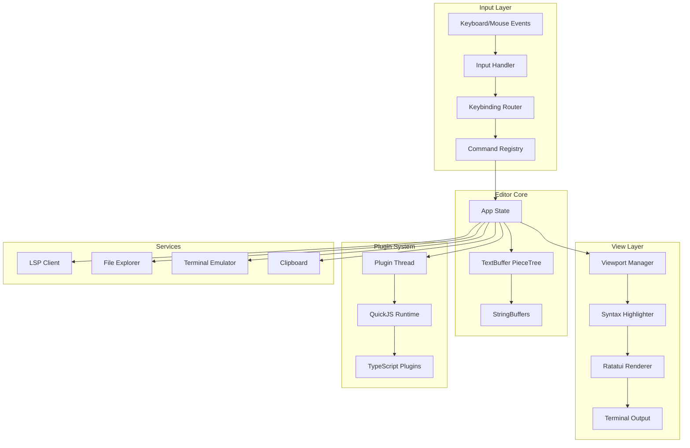

# Fresh: Complete Exploration

## Overview

**Fresh** is a modern terminal-based text editor written in Rust that brings IDE-level features to the terminal with zero configuration. It combines the performance of terminal applications with the UX of graphical editors like VS Code and Sublime Text.

### Why This Exploration Exists

This is a **complete textbook** covering text editor engineering from first principles through production deployment, including Rust/valtron replication for the ewe_platform.

### Key Characteristics

| Aspect | Fresh |
|--------|-------|
| **Core Innovation** | Piece table with integrated line tracking for huge file support |
| **Dependencies** | tokio, ratatui, crossterm, tree-sitter, syntect, rquickjs |
| **Lines of Code** | ~40,000 (entire workspace) |
| **Purpose** | Terminal text editor with IDE features, plugin system |
| **Architecture** | Multi-crate workspace with core, editor, plugin runtime |
| **Runtime** | Native terminal (Linux, macOS, Windows, BSD) |
| **Rust Equivalent** | ewe_platform with valtron executor (no async/await) |

---

## Complete Table of Contents

This exploration consists of multiple deep-dive documents. Read them in order for complete understanding:

### Part 1: Foundations
1. **[Zero to Editor Engineer](00-zero-to-editor-engineer.md)** - Start here if new to text editors
   - What are text editors?
   - Buffers, views, and documents
   - Terminal rendering basics
   - Input handling and events
   - Editor architecture fundamentals

### Part 2: Core Implementation
2. **[Buffer Model Deep Dive](01-buffer-model-deep-dive.md)**
   - Piece table data structure
   - Integrated line tracking
   - Chunked lazy loading for huge files
   - Encoding detection and handling
   - Binary file support

3. **[View Rendering Deep Dive](02-view-rendering-deep-dive.md)**
   - Virtual scrolling and viewport management
   - Syntax highlighting pipeline
   - TextMate grammar integration
   - Tree-sitter for semantic highlighting
   - Ratatui rendering pipeline

4. **[Plugin System Deep Dive](03-plugin-system-deep-dive.md)**
   - QuickJS JavaScript runtime embedding
   - Plugin API design
   - Async operation bridging
   - Plugin lifecycle management
   - TypeScript plugin development

5. **[Command Pattern Deep Dive](04-command-pattern-deep-dive.md)**
   - Command palette architecture
   - Undo/redo with piece table
   - Action registration system
   - Keybinding contexts
   - Input dispatch pipeline

### Part 3: Rust Replication
6. **[Rust Revision](rust-revision.md)**
   - Complete Rust translation for ewe_platform
   - Type system design
   - Ownership and borrowing strategy
   - Valtron integration patterns
   - Code examples

7. **[Production-Grade](production-grade.md)**
   - Performance optimizations
   - Memory management
   - Batching and throughput
   - Session persistence
   - Monitoring and observability

### Part 4: Integrations
8. **[Valtron Integration](05-valtron-integration.md)**
   - Editor backend with valtron
   - HTTP API compatibility
   - No async/await, no tokio
   - Production deployment

---

## Quick Reference: Fresh Architecture

### High-Level Flow



### Component Summary

| Component | Lines | Purpose | Deep Dive |
|-----------|-------|---------|-----------|
| Buffer Core | 2,500 | Piece table, line tracking, lazy loading | [Buffer Model](01-buffer-model-deep-dive.md) |
| View/Rendering | 3,500 | Virtual scrolling, syntax highlighting | [View Rendering](02-view-rendering-deep-dive.md) |
| Plugin Runtime | 1,200 | QuickJS embedding, API bindings | [Plugin System](03-plugin-system-deep-dive.md) |
| Input System | 2,000 | Keybinding, command palette | [Command Pattern](04-command-pattern-deep-dive.md) |
| App State | 4,000 | Editor state machine, actions | Multiple deep dives |
| LSP Client | 800 | Language server protocol | Referenced in deep dives |
| Terminal | 600 | Integrated terminal emulator | Referenced in deep dives |

---

## Workspace Structure

```
fresh/
├── Cargo.toml                      # Workspace manifest
├── crates/
│   ├── fresh-core/                 # Core traits, types, plugin API
│   │   ├── Cargo.toml
│   │   └── src/
│   │       ├── lib.rs              # Exports, CursorId, BufferId, SplitId
│   │       ├── api.rs              # Plugin API types
│   │       ├── command.rs          # Command/CommandSource types
│   │       ├── config.rs           # Plugin config types
│   │       ├── hooks.rs            # Plugin hook system
│   │       ├── services.rs         # Service bridge traits
│   │       └── text_property.rs    # Text property types
│   │
│   ├── fresh-editor/               # Main editor application
│   │   ├── Cargo.toml
│   │   ├── src/
│   │   │   ├── main.rs             # Entry point
│   │   │   ├── lib.rs              # Library root, feature gating
│   │   │   ├── app/                # Application state machine
│   │   │   │   ├── mod.rs          # AppState struct, main loop
│   │   │   │   ├── render.rs       # Main render function
│   │   │   │   ├── input.rs        # Input handling
│   │   │   │   ├── buffer_management.rs
│   │   │   │   ├── lsp_actions.rs
│   │   │   │   ├── plugin_commands.rs
│   │   │   │   └── ... (40+ action modules)
│   │   │   │
│   │   │   ├── model/              # Core data models (pure Rust)
│   │   │   │   ├── mod.rs          # Module exports
│   │   │   │   ├── buffer.rs       # TextBuffer struct, lazy loading
│   │   │   │   ├── piece_tree.rs   # Piece tree with line tracking
│   │   │   │   ├── piece_tree_diff.rs
│   │   │   │   ├── cursor.rs       # Cursor navigation
│   │   │   │   ├── edit.rs         # Edit operations
│   │   │   │   ├── encoding.rs     # Encoding detection
│   │   │   │   ├── filesystem.rs   # FileSystem trait
│   │   │   │   └── marker_tree.rs  # Bookmark/diagnostic markers
│   │   │   │
│   │   │   ├── primitives/         # Low-level utilities
│   │   │   │   ├── mod.rs          # Feature-gated exports
│   │   │   │   ├── grapheme.rs     # Unicode grapheme clusters
│   │   │   │   ├── syntax_highlight.rs
│   │   │   │   ├── textmate_engine.rs
│   │   │   │   ├── visual_layout.rs
│   │   │   │   ├── word_navigation.rs
│   │   │   │   └── line_wrapping.rs
│   │   │   │
│   │   │   ├── view/               # Rendering components
│   │   │   │   ├── mod.rs          # Feature-gated exports
│   │   │   │   ├── theme/          # Theme loading, types
│   │   │   │   ├── ui/             # UI components
│   │   │   │   │   ├── mod.rs
│   │   │   │   │   ├── text_edit.rs    # TextEdit component
│   │   │   │   │   ├── tabs.rs         # Tab bar
│   │   │   │   │   ├── status_bar.rs   # Status bar
│   │   │   │   │   ├── menu.rs         # Menu bar
│   │   │   │   │   └── view_pipeline.rs
│   │   │   │   ├── viewport.rs     # Viewport management
│   │   │   │   ├── overlay.rs      # Overlay rendering
│   │   │   │   └── ... (50+ view modules)
│   │   │   │
│   │   │   ├── input/              # Input handling
│   │   │   │   ├── mod.rs
│   │   │   │   ├── commands.rs     # Command palette
│   │   │   │   ├── keybindings.rs  # Keybinding system
│   │   │   │   ├── handler.rs      # Input handler
│   │   │   │   ├── fuzzy.rs        # Fuzzy finder
│   │   │   │   └── quick_open/     # Quick open providers
│   │   │   │
│   │   │   ├── services/           # Background services
│   │   │   │   ├── mod.rs
│   │   │   │   ├── lsp.rs          # LSP client
│   │   │   │   ├── release_check.rs
│   │   │   │   └── ...
│   │   │   │
│   │   │   ├── config.rs           # Configuration system
│   │   │   ├── i18n.rs             # Internationalization
│   │   │   └── locales/            # Translation files
│   │   │
│   │   └── plugins/                # Embedded TypeScript plugins
│   │       └── lib/fresh.d.ts      # Auto-generated API types
│   │
│   ├── fresh-parser-js/            # TypeScript/JSX parsing (oxc)
│   ├── fresh-languages/            # Language packs
│   ├── fresh-plugin-runtime/       # Plugin thread runtime
│   │   ├── Cargo.toml
│   │   └── src/
│   │       ├── lib.rs
│   │       ├── thread.rs           # Plugin thread, QuickJS backend
│   │       ├── backend.rs          # QuickJS backend implementation
│   │       └── process.rs          # Process spawning for plugins
│   │
│   └── fresh-plugin-api-macros/    # Proc macros for TS generation
│       ├── Cargo.toml
│       └── src/
│           └── lib.rs              # plugin_api_impl macro
│
├── fresh-plugins/                  # TypeScript plugins (git submodule)
│   ├── amp/                        # AMP plugin
│   ├── calculator/                 # Calculator plugin
│   ├── color-highlighter/          # Color highlighting
│   ├── emmet/                      # Emmet expansion
│   ├── spellcheck/                 # Spell checking
│   ├── todo-highlighter/           # TODO highlighting
│   └── languages/                  # Language packs
│       ├── elixir/
│       ├── hare/
│       ├── solidity/
│       └── ...
│
└── fresh-plugins-registry/         # Plugin registry (git submodule)
    ├── plugins.json                # Plugin registry
    ├── themes.json                 # Theme registry
    └── schemas/                    # JSON schemas
```

---

## Key Architectural Patterns

### 1. Piece Table with Integrated Line Tracking

Fresh uses a piece table data structure where line feed counts are integrated into each node:

```rust
pub enum PieceTreeNode {
    Internal {
        left_bytes: usize,
        lf_left: Option<usize>,  // Line feeds in left subtree
        left: Arc<PieceTreeNode>,
        right: Arc<PieceTreeNode>,
    },
    Leaf {
        location: BufferLocation,
        offset: usize,
        bytes: usize,
        line_feed_cnt: Option<usize>,  // Line feeds in this piece
    },
}
```

This allows O(log n) navigation by both byte offset AND line number.

### 2. Lazy Loading for Huge Files

Files >100MB are loaded in chunks without line indexing:

```rust
pub enum BufferData {
    Loaded {
        data: Vec<u8>,
        line_starts: Option<Vec<usize>>,  // None for lazy-loaded chunks
    },
    Unloaded {
        file_path: PathBuf,
        file_offset: usize,
        bytes: usize,
    },
}
```

### 3. Plugin Thread Architecture

Plugins run in a dedicated thread with their own QuickJS runtime and tokio runtime:

```
Main Thread (UI)          Plugin Thread
     │                          │
     │── PluginRequest ──>      │
     │                          │ (QuickJS + tokio)
     │                          │ (async operations complete naturally)
     │                          │
     │<─ PluginCommand ──       │
```

### 4. Command Pattern with Contexts

Commands are registered with keybinding contexts:

```rust
pub struct Command {
    pub name: String,
    pub action: Action,
    pub contexts: Vec<KeyContext>,  // Normal, Terminal, FileExplorer
    pub custom_contexts: Vec<String>,  // Plugin-defined contexts
}
```

---

## How Fresh Compares

| Feature | Fresh | VS Code | Neovim |
|---------|-------|---------|--------|
| **Buffer Model** | Piece table + line tracking | Gap buffer/rope | Gap buffer |
| **Huge Files** | Yes, lazy loading | Limited | Limited |
| **Plugin Runtime** | QuickJS (sandboxed) | Node.js | Lua |
| **UI** | Ratatui (terminal) | Electron | Terminal |
| **Startup Time** | <100ms | 2-5s | <50ms |
| **Memory** | ~20MB base | 500MB+ | ~10MB |
| **LSP** | Built-in | Built-in | Via plugins |
| **Multi-cursor** | Native | Native | Via plugins |

---

## Replicating in Rust for ewe_platform

### Key Dependencies to Replace

| Fresh Dependency | Purpose | ewe_platform Equivalent |
|-----------------|---------|------------------------|
| tokio | Async runtime | valtron TaskIterator |
| ratatui | Terminal rendering | Continue using ratatui (pure Rust) |
| tree-sitter | AST parsing | tree-sitter (pure Rust via FFI) |
| syntect | Syntax highlighting | syntect (pure Rust) |
| rquickjs | JavaScript runtime | rquickjs (continue using) |
| crossterm | Terminal I/O | Continue using crossterm |

### Valtron Integration Strategy

```rust
// Fresh async pattern
async fn load_plugin(path: &Path) -> Result<Plugin> { ... }

// Valtron pattern for ewe_platform
struct LoadPluginTask {
    path: PathBuf,
}

impl TaskIterator for LoadPluginTask {
    type Ready = Plugin;
    type Pending = ();
    type Spawner = NoSpawner;

    fn next(&mut self) -> Option<TaskStatus<Self::Ready, Self::Pending, Self::Spawner>> {
        // Return Pending or Ready
    }
}
```

---

## Running Fresh

```bash
# Clone and build
git clone https://github.com/sinelaw/fresh.git
cd fresh
cargo build --release

# Run
./target/release/fresh [file]

# Install plugins
# Plugins are loaded from ~/.config/fresh/plugins/
```

---

## Document History

| Date | Change |
|------|--------|
| 2026-03-27 | Initial exploration created |
| 2026-03-27 | Deep dives 00-05 outlined |
| 2026-03-27 | Rust revision and production-grade planned |

---

*This exploration is a living document. Revisit sections as concepts become clearer through implementation.*
