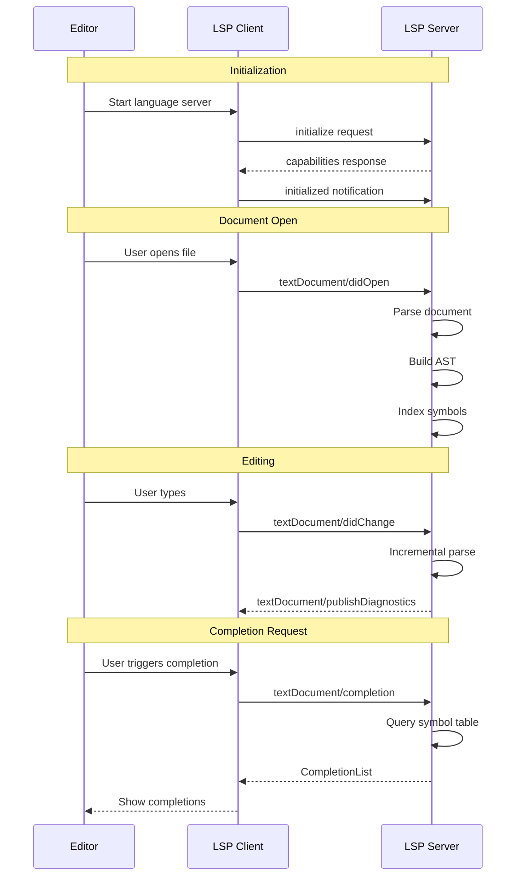
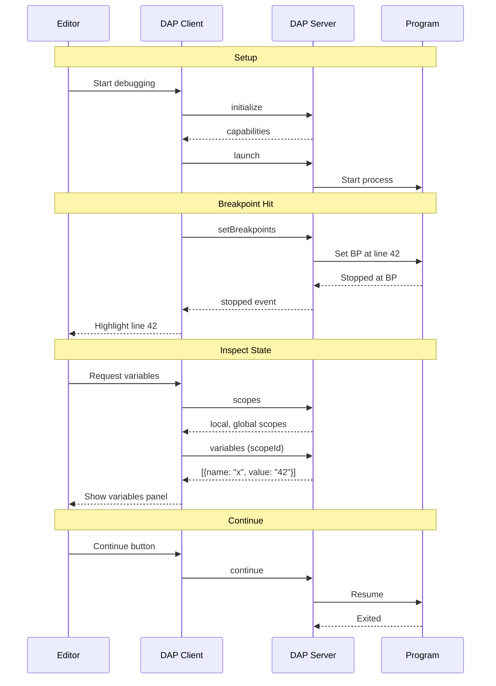

# Zero to IDE Engineer: First-Principles Guide

## Table of Contents

1. [What Are IDEs?](#1-what-are-ides)
2. [IDE Core Components](#2-ide-core-components)
3. [Language Server Protocol (LSP)](#3-language-server-protocol-lsp)
4. [Debug Adapter Protocol (DAP)](#4-debug-adapter-protocol-dap)
5. [Project Systems and File Indexing](#5-project-systems-and-file-indexing)
6. [Rockies Patterns for IDE Systems](#6-rockies-patterns-for-ide-systems)
7. [Your Learning Path](#7-your-learning-path)

---

## 1. What Are IDEs?

### 1.1 The Fundamental Question

**What is an IDE (Integrated Development Environment)?**

An IDE is a software application that provides comprehensive facilities for software development. At its core, an IDE:

1. **Edits** source code (text editor with syntax highlighting)
2. **Understands** code structure (parsing, indexing, analysis)
3. **Assists** development (completions, navigation, refactoring)
4. **Executes** code (build, run, debug)
5. **Manages** projects (files, dependencies, configurations)

```
┌─────────────────────────────────────────────────────────┐
│                    IDE Architecture                      │
│  ┌──────────────┐  ┌──────────────┐  ┌──────────────┐  │
│  │    Editor    │  │   Language   │  │    Debug     │  │
│  │   (Frontend) │  │   Server     │  │    Adapter   │  │
│  └──────┬───────┘  └──────┬───────┘  └──────┬───────┘  │
│         │                 │                 │          │
│         └────────────┬────┴────────────────┘          │
│                      │                                 │
│              ┌───────┴───────┐                        │
│              │ Project System │                        │
│              │  (Index)      │                        │
│              └───────────────┘                        │
└─────────────────────────────────────────────────────────┘
```

**Real-world analogy:** A writer's office

| Office Item | IDE Equivalent | Purpose |
|-------------|----------------|---------|
| Desk with papers | Editor | Working surface for code |
| Dictionary/Thesaurus | Language Server | Reference for words (symbols) |
| Bookshelf | Project System | Organized storage (files) |
| Editor/Reviewer | Linter/Analyzer | Quality检查 |
| Filing cabinet | Index | Quick lookup |
| Phone/Email | Debugger | Communication with running program |

### 1.2 Evolution of IDEs

**Generation 1: Text Editors (1960s-1980s)**
- Emacs, Vi
- Syntax highlighting
- Macros

**Generation 2: Integrated Tools (1990s)**
- Visual Studio, Eclipse
- Compiler integration
- Debugger integration

**Generation 3: Language-Aware (2000s)**
- IntelliJ IDEA
- Code understanding
- Refactoring

**Generation 4: Protocol-Based (2010s+)**
- VS Code, Neovim
- LSP for language support
- DAP for debugging
- Extensible via extensions

### 1.3 Modern IDE Architecture

```
┌────────────────────────────────────────────────────────────┐
│                      IDE Frontend                          │
│  ┌─────────────┐  ┌─────────────┐  ┌─────────────────┐   │
│  │   Editor    │  │    Tree     │  │   Terminal      │   │
│  │   Component │  │   View      │  │   Panel         │   │
│  └──────┬──────┘  └──────┬──────┘  └────────┬────────┘   │
└─────────┼────────────────┼──────────────────┼────────────┘
          │                │                  │
          ▼                ▼                  ▼
┌────────────────────────────────────────────────────────────┐
│                    Protocol Layer                          │
│  ┌────────────────────┐  ┌────────────────────────────┐  │
│  │  LSP Client        │  │  DAP Client                │  │
│  │  - completions     │  │  - breakpoints             │  │
│  │  - diagnostics     │  │  - stack traces            │  │
│  │  - hover           │  │  - variables               │  │
│  └─────────┬──────────┘  └─────────────┬──────────────┘  │
└────────────┼────────────────────────────┼─────────────────┘
             │                            │
             ▼                            ▼
┌──────────────────┐          ┌─────────────────────────────┐
│ Language Server  │          │ Debug Adapter               │
│ (per language)   │          │ (per runtime)               │
│ - parser         │          │ - GDB/LLDB                  │
│ - type checker   │          │ - Node.js inspector         │
│ - linter         │          │ - Java Debug Wire Protocol  │
└──────────────────┘          └─────────────────────────────┘
```

---

## 2. IDE Core Components

### 2.1 Editor Component

The editor is the primary interface for code input:

**Features:**
- Text input and rendering
- Syntax highlighting (TextMate grammars, Tree-sitter)
- Code folding
- Line numbers, minimap
- Multiple cursors
- Undo/redo history

**Example: VS Code Editor Stack**
```
Monaco Editor (frontend)
    ├── TextBuffer (internal representation)
    ├── ViewModel (rendering logic)
    └── Controller (input handling)
```

### 2.2 Language Server Protocol (LSP)

LSP standardizes language feature integration:

```
┌──────────────┐         JSON-RPC         ┌──────────────┐
│  IDE Client  │ ◄──────────────────────► │  Language    │
│  (VS Code)   │                          │   Server     │
└──────────────┘                          └──────────────┘
       │                                        │
       │ textDocument/didOpen                   │
       │──────────────────────────────────────► │
       │                                        │ Parse, analyze
       │                                        │
       │ textDocument/completion                │
       │◄────────────────────────────────────── │
       │ { items: ["forEach", "filter", ...] }  │
```

**Key LSP Features:**
- `textDocument/completion` - IntelliSense
- `textDocument/hover` - Tooltip on hover
- `textDocument/definition` - Go to definition
- `textDocument/references` - Find all references
- `textDocument/diagnostic` - Errors and warnings
- `textDocument/formatting` - Code formatting

### 2.3 Debug Adapter Protocol (DAP)

DAP standardizes debugger integration:

```
┌──────────────┐         JSON-RPC         ┌──────────────┐
│  IDE Client  │ ◄──────────────────────► │   Debug      │
│  (VS Code)   │                          │   Adapter    │
└──────────────┘                          └──────────────┘
       │                                        │
       │ initialize                             │
       │──────────────────────────────────────► │
       │                                        │ Start debugger
       │                                        │
       │ setBreakpoints                         │
       │──────────────────────────────────────► │
       │ { source, lines: [42] }                │
       │                                        │ Set BP in runtime
       │                                        │
       │ launch                                 │
       │──────────────────────────────────────► │
       │                                        │ Run program
       │                                        │
       │ ◄───────── stopped (breakpoint) ────── │
       │                                        │
       │ stackTrace                             │
       │◄────────────────────────────────────── │
```

**Key DAP Features:**
- `initialize` - Capability negotiation
- `launch` / `attach` - Start debugging
- `setBreakpoints` - Configure breakpoints
- `stackTrace` - Get call stack
- `scopes` / `variables` - Inspect variables
- `continue` / `stepOver` / `stepIn` - Control execution

### 2.4 Project System

The project system manages files and indexing:

```
┌─────────────────────────────────────────┐
│          Project/Workspace              │
├─────────────────────────────────────────┤
│  File System Watcher                    │
│  - Detect file changes                  │
│  - Trigger re-indexing                  │
├─────────────────────────────────────────┤
│  Index Database                         │
│  - Symbol table                         │
│  - File contents cache                  │
│  - Dependency graph                     │
├─────────────────────────────────────────┤
│  Virtual File System                    │
│  - Unified file access                  │
│  - Handle archives, remote files        │
└─────────────────────────────────────────┤
```

---

## 3. Language Server Protocol (LSP)

### 3.1 LSP Architecture

**Communication:** JSON-RPC 2.0 over stdin/stdout, sockets, or pipes

**Message Format:**
```json
{
  "jsonrpc": "2.0",
  "id": 1,
  "method": "textDocument/completion",
  "params": {
    "textDocument": { "uri": "file:///app/main.rs" },
    "position": { "line": 10, "character": 5 }
  }
}
```

**Response:**
```json
{
  "jsonrpc": "2.0",
  "id": 1,
  "result": {
    "items": [
      {
        "label": "println!",
        "kind": 3,
        "detail": "Macro",
        "documentation": "Prints to stdout"
      }
    ]
  }
}
```

### 3.2 LSP Request Lifecycle



### 3.3 How Rockies Maps to LSP

| Rockies | LSP Equivalent |
|---------|---------------|
| `MultiGrid` | Symbol index across files |
| `GridIndex` | File identifier |
| `Grid::get(x, y)` | `textDocument/hover` at position |
| `Grid::put(x, y, cell)` | `textDocument/didChange` |
| `get_missing_grids()` | Lazy file loading |
| `save_grid()` | Document save |
| `load_grid()` | Document open |

**Example: Symbol Lookup as Grid Query**

```rust
// Rockies: Get cells at position
let result = grid.get(x, y);
for cell in result.neighbors {
    println!("Neighbor: {:?}", cell);
}

// LSP equivalent: Get symbols at position
let symbols = index.symbols_at(file_id, line, column);
for symbol in symbols.references {
    println!("Reference: {:?}", symbol);
}
```

---

## 4. Debug Adapter Protocol (DAP)

### 4.1 DAP Architecture

**Communication:** JSON-RPC 2.0 over stdin/stdout, named pipes, or TCP

**Message Format:**
```json
{
  "seq": 1,
  "type": "request",
  "command": "setBreakpoints",
  "arguments": {
    "source": { "path": "/app/main.rs" },
    "breakpoints": [{ "line": 42 }]
  }
}
```

**Response:**
```json
{
  "seq": 1,
  "type": "response",
  "request_seq": 1,
  "success": true,
  "body": {
    "breakpoints": [
      { "verified": true, "id": 1, "line": 42 }
    ]
  }
}
```

### 4.2 DAP Debug Session



### 4.3 How Rockies Maps to DAP

| Rockies | DAP Equivalent |
|---------|---------------|
| `Universe` state | Program state |
| `Player` position | Current execution point |
| `Cell` properties | Variable values |
| `tick()` | Step execution |
| `get_missing_grids()` | Stack frame loading |
| Grid save/load | Debug session serialization |

---

## 5. Project Systems and File Indexing

### 5.1 File System Watching

**Polling vs Event-based:**

```rust
// Polling (simple but inefficient)
loop {
    for file in &files {
        let new_mtime = file.modified()?;
        if new_mtime != file.last_mtime {
            notify_change(file);
            file.last_mtime = new_mtime;
        }
    }
    sleep(Duration::from_millis(1000));
}

// Event-based (efficient)
let watcher = notify::recommended_watcher(|event| {
    match event.kind {
        EventKind::Create(_) => file_created(event.path),
        EventKind::Modify(_) => file_modified(event.path),
        EventKind::Remove(_) => file_deleted(event.path),
        _ => {}
    }
})?;
watcher.watch(path, RecursiveMode::Recursive)?;
```

### 5.2 Indexing Strategies

**Full Index (startup):**
```rust
fn build_index(workspace: &Workspace) -> Index {
    let mut index = Index::new();
    for file in workspace.all_files() {
        let ast = parse(&file.content);
        index.add_file(file.path, &ast);
    }
    index
}
```

**Incremental Index (on change):**
```rust
fn update_index(index: &mut Index, file: &File, change: &TextChange) {
    let old_ast = index.get_ast(file.path);
    let new_ast = apply_change(old_ast, change);
    index.update_file(file.path, &new_ast);
}
```

### 5.3 Rockies MultiGrid as File Index

```rust
// Rockies: Partition space into grids
pub struct MultiGrid<T> {
    grids: HashMap<GridIndex, UniverseGrid<T>>,
    grid_width: usize,   // e.g., 128 cells
    grid_height: usize,
}

// IDE equivalent: Partition workspace into modules
pub struct WorkspaceIndex {
    modules: HashMap<ModuleId, ModuleIndex>,
    module_size: usize,  // e.g., files per module
}

// Lazy loading pattern
impl WorkspaceIndex {
    pub fn get_missing_modules(&self, active_area: &Path) -> Vec<ModuleId> {
        // Find modules near the active file that aren't loaded
        self.grids.get_dropped_grids(active_area, 2)
    }

    pub fn load_module(&mut self, module_id: ModuleId, bytes: Vec<u8>) {
        let module = ModuleIndex::from_bytes(bytes);
        self.modules.insert(module_id, module);
    }
}
```

---

## 6. Rockies Patterns for IDE Systems

### 6.1 Grid Index as File Path Hash

```rust
// Rockies: Convert position to grid index
impl GridIndex {
    pub fn from_pos(pos: V2i, width: usize, height: usize) -> GridIndex {
        GridIndex {
            grid_offset: V2i::new(
                pos.x.div_euclid(width as i32),
                pos.y.div_euclid(height as i32),
            ),
        }
    }
}

// IDE: Convert file path to module index
impl ModuleIndex {
    pub fn from_path(path: &Path, files_per_module: usize) -> ModuleIndex {
        let hash = hash_path(path);
        ModuleIndex {
            module_offset: V2i::new(
                (hash / files_per_module) as i32,
                (hash % files_per_module) as i32,
            ),
        }
    }
}
```

### 6.2 Dirty Tracking State Machine

From the TLA+ specification:

```
Grid States:
- stored/not_stored  (persisted to disk?)
- loaded/not_loaded  (currently in memory?)
- dirty/unmodified/pristine (modification state)

Valid Transitions:
not_stored + not_loaded  ──LoadMissingGrid──> loaded + pristine
stored + not_loaded      ──LoadStoredGrid───> loaded + unmodified
loaded + pristine        ──MarkDirty────────> loaded + dirty
loaded + unmodified      ──MarkDirty────────> loaded + dirty
loaded + dirty           ──StoreGrid────────> stored + unmodified
loaded + unmodified      ──UnloadGrid───────> not_loaded
loaded + pristine        ──UnloadGrid───────> not_loaded
```

**IDE Application:**

```rust
enum DocumentState {
    NotStored,    // New file, never saved
    Stored,       // Saved to disk
}

enum LoadState {
    NotLoaded,    // Not in memory
    Loaded,       // In memory
}

enum DirtyState {
    Pristine,     // New, no changes
    Unmodified,   // Loaded, no changes since
    Dirty,        // Modified since load
}

struct Document {
    state: (DocumentState, LoadState, DirtyState),
    content: Option<String>,
}
```

### 6.3 Neighbor Tracking for References

```rust
// Rockies: Pre-calculate neighbors for O(1) lookup
pub struct GridCell<T> {
    value: Vec<Rc<RefCell<T>>>,      // Items here
    neighbors: Vec<Rc<RefCell<T>>>,  // Items nearby
}

// IDE: Pre-calculate references for O(1) lookup
pub struct SymbolEntry {
    definition: SymbolId,
    references: Vec<Reference>,      // All reference locations
    incoming: Vec<CallSite>,         // Who calls this
    outgoing: Vec<CallSite>,         // What this calls
}

// Fast "find references"
fn find_references(index: &SymbolIndex, symbol: &SymbolId) -> Vec<Reference> {
    index.get(symbol).references.clone()  // O(1)!
}
```

### 6.4 Serialization for Persistence

```rust
// Rockies: Serialize grid to JsValue
impl<T: Serialize> Grid<T> {
    pub fn to_bytes(&self) -> Result<JsValue, Error> {
        let items = self.collect_items();
        serde_wasm_bindgen::to_value(&GridSerialData {
            width: self.width,
            height: self.height,
            items,  // Vec<(x, y, T)>
        })
    }
}

// IDE: Serialize document state
impl Document {
    pub fn to_bytes(&self) -> Result<Vec<u8>, Error> {
        bincode::serialize(&DocumentSerialData {
            path: self.path.clone(),
            content: self.content.clone(),
            cursor_position: self.cursor,
            undo_history: self.undo_stack.clone(),
        })
    }
}
```

---

## 7. Your Learning Path

### 7.1 How to Use This Exploration

```
CodingIDE/rockies/
├── exploration.md              # This file (index)
├── 00-zero-to-ide-engineer.md  ← You are here (foundations)
├── 01-lsp-integration-deep-dive.md
├── 02-debug-adapter-deep-dive.md
├── 03-project-system-deep-dive.md
├── 04-intellisense-deep-dive.md
├── rust-revision.md
├── production-grade.md
└── 05-valtron-integration.md
```

### 7.2 Recommended Reading Order

**For complete beginners:**
1. This document (00-zero-to-ide-engineer.md) - IDE foundations
2. 01-lsp-integration-deep-dive.md - Language server protocol
3. 02-debug-adapter-deep-dive.md - Debug adapter protocol
4. 03-project-system-deep-dive.md - Project and file management
5. 04-intellisense-deep-dive.md - Completion and navigation
6. rust-revision.md - Rust implementation patterns

**For experienced developers:**
1. Skim this document for context
2. Jump to relevant deep dives
3. Review rust-revision.md for implementation

### 7.3 Practice Exercises

**Exercise 1: Build a Simple LSP Client**
```rust
use std::process::{Command, Stdio};
use std::io::{Write, BufRead};

fn start_language_server(command: &str) -> (ChildStdin, BufReader<ChildStdout>) {
    let mut child = Command::new(command)
        .stdin(Stdio::piped())
        .stdout(Stdio::piped())
        .spawn()
        .expect("Failed to start language server");

    let stdin = child.stdin.take().unwrap();
    let stdout = BufReader::new(child.stdout.take().unwrap());
    (stdin, stdout)
}
```

**Exercise 2: Implement File Watching**
```rust
use notify::{Watcher, RecommendedWatcher, RecursiveMode};
use std::path::Path;

fn watch_directory(path: &Path) -> notify::Result<()> {
    let (tx, rx) = std::sync::mpsc::channel();
    let mut watcher = RecommendedWatcher::new(tx)?;
    watcher.watch(path, RecursiveMode::Recursive)?;

    loop {
        match rx.recv() {
            Ok(event) => println!("File changed: {:?}", event),
            Err(e) => println!("Watch error: {:?}", e),
        }
    }
}
```

**Exercise 3: Build a Symbol Index**
```rust
use std::collections::HashMap;

struct SymbolIndex {
    symbols: HashMap<String, SymbolLocation>,
}

struct SymbolLocation {
    file: String,
    line: usize,
    column: usize,
}

impl SymbolIndex {
    fn add_symbol(&mut self, name: String, location: SymbolLocation) {
        self.symbols.insert(name, location);
    }

    fn find_symbol(&self, name: &str) -> Option<&SymbolLocation> {
        self.symbols.get(name)
    }
}
```

### 7.4 Next Steps After Completion

**After finishing this exploration:**
1. **Build a project indexer** - Adapt MultiGrid for file paths
2. **Implement LSP client** - Connect to rust-analyzer or similar
3. **Add DAP debugging** - Integrate with a debug adapter
4. **Translate to ewe_platform** - Use valtron patterns

### 7.5 Key Resources

| Resource | Purpose |
|----------|---------|
| [LSP Specification](https://microsoft.github.io/language-server-protocol/) | Official LSP docs |
| [DAP Specification](https://microsoft.github.io/debug-adapter-protocol/) | Official DAP docs |
| [TLA+ Hyperbook](https://learntla.com/) | Learn formal specification |
| [notify crate](https://docs.rs/notify) | File system watching in Rust |
| [tower-lsp crate](https://docs.rs/tower-lsp) | LSP implementation in Rust |

---

## Appendix A: LSP Request Types Quick Reference

| Method | Direction | Description |
|--------|-----------|-------------|
| `initialize` | Client → Server | Start session, exchange capabilities |
| `initialized` | Client → Server | Notification: initialization complete |
| `textDocument/didOpen` | Client → Server | Notification: document opened |
| `textDocument/didChange` | Client → Server | Notification: document changed |
| `textDocument/didClose` | Client → Server | Notification: document closed |
| `textDocument/completion` | Client → Server | Request: code completions |
| `textDocument/hover` | Client → Server | Request: hover information |
| `textDocument/definition` | Client → Server | Request: go to definition |
| `textDocument/references` | Client → Server | Request: find references |
| `textDocument/diagnostic` | Client → Server | Request: diagnostics |
| `textDocument/publishDiagnostics` | Server → Client | Notification: new diagnostics |

## Appendix B: DAP Request Types Quick Reference

| Command | Direction | Description |
|---------|-----------|-------------|
| `initialize` | Client → Server | Start session, exchange capabilities |
| `launch` | Client → Server | Start debugging session |
| `attach` | Client → Server | Attach to running process |
| `setBreakpoints` | Client → Server | Configure breakpoints |
| `configurationDone` | Client → Server | Configuration complete |
| `stackTrace` | Client → Server | Get call stack |
| `scopes` | Client → Server | Get variable scopes |
| `variables` | Client → Server | Get variables in scope |
| `continue` | Client → Server | Resume execution |
| `stepOver` | Client → Server | Step over line |
| `stepIn` | Client → Server | Step into function |
| `stepOut` | Client → Server | Step out of function |
| `stopped` | Server → Client | Event: execution stopped |
| `exited` | Server → Client | Event: program exited |

---

*This document is a living textbook. Revisit sections as concepts become clearer through implementation. Next: [01-lsp-integration-deep-dive.md](01-lsp-integration-deep-dive.md)*
