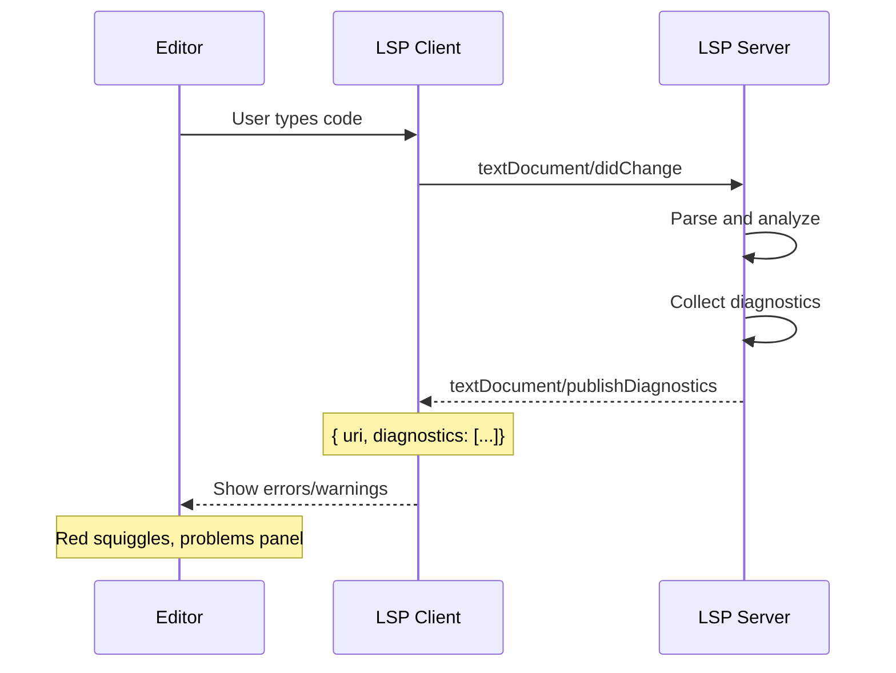

# LSP Integration Deep Dive

## Table of Contents

1. [LSP Architecture Overview](#1-lsp-architecture-overview)
2. [JSON-RPC Protocol](#2-json-rpc-protocol)
3. [LSP Client Implementation](#3-lsp-client-implementation)
4. [LSP Server Implementation](#4-lsp-server-implementation)
5. [Symbol Indexing with MultiGrid Patterns](#5-symbol-indexing-with-multigrid-patterns)
6. [Diagnostic Handling](#6-diagnostic-handling)
7. [Completion Providers](#7-completion-providers)
8. [Advanced LSP Features](#8-advanced-lsp-features)

---

## 1. LSP Architecture Overview

### 1.1 The Language Server Protocol

The Language Server Protocol (LSP) defines a standard way for editors to provide language features like:
- Auto-complete
- Go to definition
- Find all references
- Hover information
- Diagnostics (errors/warnings)
- Formatting
- Rename refactoring
- Signature help

**Key insight:** Instead of building language support into each editor, write it once as a language server.

```
┌─────────────────────────────────────────────────────────────┐
│                         Editors                             │
│  VS Code  │  Neovim  │  Emacs  │  Sublime  │  JetBrains   │
└─────┬─────┴─────┬─────┴────┬─────┴────┬──────┴──────┬─────┘
      │           │          │          │             │
      │  LSP      │  LSP     │  LSP     │  LSP        │  LSP
      │  Client   │  Client  │  Client  │  Client     │  Client
      │           │          │          │             │
      └───────────┴──────────┴──────────┴─────────────┘
                              │
                              │ JSON-RPC
                              │
                     ┌────────┴────────┐
                     │  Language Server│
                     │  (rust-analyzer)│
                     └─────────────────┘
```

### 1.2 LSP and Rockies: Architectural Parallels

| LSP Concept | Rockies Equivalent | Shared Pattern |
|-------------|-------------------|----------------|
| Symbol Index | MultiGrid | Spatial partitioning |
| Document URI | GridIndex | Identifier system |
| Position (line/char) | V2i (x, y) | 2D coordinates |
| Diagnostics | Collision detection | Problem detection |
| Incremental updates | Grid version system | Change tracking |
| Workspace folders | Grid loading zones | Area of interest |

---

## 2. JSON-RPC Protocol

### 2.1 JSON-RPC 2.0 Basics

LSP uses JSON-RPC 2.0 for communication. The protocol defines three message types:

**1. Request:**
```json
{
  "jsonrpc": "2.0",
  "id": 1,
  "method": "textDocument/completion",
  "params": {
    "textDocument": {
      "uri": "file:///app/main.rs"
    },
    "position": {
      "line": 10,
      "character": 5
    }
  }
}
```

**2. Response:**
```json
{
  "jsonrpc": "2.0",
  "id": 1,
  "result": {
    "items": [
      {
        "label": "println!",
        "kind": 3,
        "detail": "Macro",
        "documentation": "Prints a line to stdout"
      }
    ]
  }
}
```

**3. Notification (no response expected):**
```json
{
  "jsonrpc": "2.0",
  "method": "textDocument/didOpen",
  "params": {
    "textDocument": {
      "uri": "file:///app/main.rs",
      "languageId": "rust",
      "version": 1,
      "text": "fn main() { println!(\"Hello\"); }"
    }
  }
}
```

### 2.2 JSON-RPC Message Structure

```rust
use serde::{Deserialize, Serialize};

#[derive(Debug, Clone, Serialize, Deserialize)]
pub struct JsonRpcMessage {
    pub jsonrpc: String,  // Always "2.0"

    #[serde(skip_serializing_if = "Option::is_none")]
    pub id: Option<u64>,  // None for notifications

    #[serde(skip_serializing_if = "Option::is_none")]
    pub method: Option<String>,

    #[serde(skip_serializing_if = "Option::is_none")]
    pub params: Option<serde_json::Value>,

    #[serde(skip_serializing_if = "Option::is_none")]
    pub result: Option<serde_json::Value>,

    #[serde(skip_serializing_if = "Option::is_none")]
    pub error: Option<JsonRpcError>,
}

#[derive(Debug, Clone, Serialize, Deserialize)]
pub struct JsonRpcError {
    pub code: i32,
    pub message: String,

    #[serde(skip_serializing_if = "Option::is_none")]
    pub data: Option<serde_json::Value>,
}

// Standard error codes
pub const PARSE_ERROR: i32 = -32700;
pub const INVALID_REQUEST: i32 = -32600;
pub const METHOD_NOT_FOUND: i32 = -32601;
pub const INVALID_PARAMS: i32 = -32602;
pub const INTERNAL_ERROR: i32 = -32603;
```

### 2.3 Content-Length Header

JSON-RPC messages over stdio use a Content-Length header:

```
Content-Length: 150\r
\r
{"jsonrpc":"2.0","id":1,"method":"initialize","params":{"processId":123,...}}
```

**Parser implementation:**
```rust
use std::io::{BufRead, BufReader};

pub struct LspReader<R: BufRead> {
    inner: R,
}

impl<R: BufRead> LspReader<R> {
    pub fn new(reader: R) -> Self {
        Self { inner: reader }
    }

    pub fn read_message(&mut self) -> std::io::Result<String> {
        let mut content_length = 0;

        // Read headers
        loop {
            let mut line = String::new();
            self.inner.read_line(&mut line)?;
            let line = line.trim();

            if line.is_empty() {
                break;  // End of headers
            }

            if let Some(length) = line.strip_prefix("Content-Length: ") {
                content_length = length.parse()?;
            }
        }

        // Read content
        let mut content = vec![0u8; content_length];
        self.inner.read_exact(&mut content)?;
        Ok(String::from_utf8(content).unwrap())
    }
}
```

---

## 3. LSP Client Implementation

### 3.1 Client Architecture

```
┌─────────────────────────────────────────┐
│            LSP Client                   │
├─────────────────────────────────────────┤
│  Message Loop                           │
│  - Read JSON-RPC from server            │
│  - Dispatch to handlers                 │
├─────────────────────────────────────────┤
│  Request Handlers                       │
│  - completions                          │
│  - hover                                │
│  - definition                           │
├─────────────────────────────────────────┤
│  Notification Handlers                  │
│  - publishDiagnostics                   │
│  - progress                             │
├─────────────────────────────────────────┤
│  Document State                         │
│  - Open documents                       │
│  - Version tracking                     │
└─────────────────────────────────────────┘
```

### 3.2 Client Implementation in Rust

```rust
use std::process::{Child, ChildStdin, ChildStdout, Command, Stdio};
use std::io::{BufRead, BufReader, Write};
use serde_json::{json, Value};

pub struct LspClient {
    process: Child,
    stdin: ChildStdin,
    stdout: BufReader<ChildStdout>,
    request_id: u64,
}

impl LspClient {
    /// Start a language server process
    pub fn start(command: &str, args: &[&str]) -> std::io::Result<Self> {
        let mut process = Command::new(command)
            .args(args)
            .stdin(Stdio::piped())
            .stdout(Stdio::piped())
            .stderr(Stdio::piped())
            .spawn()?;

        let stdin = process.stdin.take().unwrap();
        let stdout = BufReader::new(process.stdout.take().unwrap());

        Ok(Self {
            process,
            stdin,
            stdout,
            request_id: 0,
        })
    }

    /// Send a JSON-RPC message
    fn send_message(&mut self, message: &Value) -> std::io::Result<()> {
        let content = message.to_string();
        let header = format!("Content-Length: {}\r\n\r\n", content.len());

        self.stdin.write_all(header.as_bytes())?;
        self.stdin.write_all(content.as_bytes())?;
        self.stdin.flush()?;
        Ok(())
    }

    /// Read a JSON-RPC message from server
    fn read_message(&mut self) -> std::io::Result<Value> {
        // Read Content-Length header
        let mut content_length = 0;
        let mut reader = &mut self.stdout;

        loop {
            let mut line = String::new();
            reader.read_line(&mut line)?;
            let line = line.trim();

            if line.is_empty() {
                break;
            }

            if let Some(length) = line.strip_prefix("Content-Length: ") {
                content_length = length.parse().unwrap();
            }
        }

        // Read content
        let mut content = vec![0u8; content_length];
        reader.read_exact(&mut content)?;

        Ok(serde_json::from_slice(&content)?)
    }

    /// Send a request and wait for response
    pub fn send_request(&mut self, method: &str, params: Value) -> std::io::Result<Value> {
        self.request_id += 1;

        let message = json!({
            "jsonrpc": "2.0",
            "id": self.request_id,
            "method": method,
            "params": params
        });

        self.send_message(&message)?;

        // Wait for response with matching ID
        loop {
            let response = self.read_message()?;
            if response.get("id").and_then(|id| id.as_u64()) == Some(self.request_id) {
                return Ok(response);
            }
        }
    }

    /// Send a notification (no response)
    pub fn send_notification(&mut self, method: &str, params: Value) -> std::io::Result<()> {
        let message = json!({
            "jsonrpc": "2.0",
            "method": method,
            "params": params
        });
        self.send_message(&message)
    }

    /// Initialize the language server
    pub fn initialize(&mut self, root_path: &str) -> std::io::Result<Value> {
        let params = json!({
            "processId": std::process::id(),
            "clientInfo": {
                "name": "rockies-ide",
                "version": "0.1.0"
            },
            "rootPath": root_path,
            "rootUri": format!("file://{}", root_path),
            "capabilities": {
                "textDocument": {
                    "completion": {
                        "completionItem": {
                            "snippetSupport": true
                        }
                    },
                    "hover": {
                        "contentFormat": ["markdown"]
                    }
                }
            }
        });

        self.send_request("initialize", params)
    }

    /// Open a document
    pub fn open_document(&mut self, uri: &str, text: &str, language_id: &str) -> std::io::Result<()> {
        self.send_notification("textDocument/didOpen", json!({
            "textDocument": {
                "uri": uri,
                "languageId": language_id,
                "version": 1,
                "text": text
            }
        }))
    }

    /// Request completions
    pub fn completion(&mut self, uri: &str, line: u32, character: u32) -> std::io::Result<Value> {
        self.send_request("textDocument/completion", json!({
            "textDocument": { "uri": uri },
            "position": { "line": line, "character": character }
        }))
    }

    /// Request hover information
    pub fn hover(&mut self, uri: &str, line: u32, character: u32) -> std::io::Result<Value> {
        self.send_request("textDocument/hover", json!({
            "textDocument": { "uri": uri },
            "position": { "line": line, "character": character }
        }))
    }

    /// Request definition
    pub fn definition(&mut self, uri: &str, line: u32, character: u32) -> std::io::Result<Value> {
        self.send_request("textDocument/definition", json!({
            "textDocument": { "uri": uri },
            "position": { "line": line, "character": character }
        }))
    }
}
```

### 3.3 Usage Example

```rust
fn main() -> std::io::Result<()> {
    // Start rust-analyzer
    let mut client = LspClient::start("rust-analyzer", &[])?;

    // Initialize
    let response = client.initialize("/home/user/project")?;
    println!("Server capabilities: {:?}", response);

    // Open a document
    let code = r#"
        fn main() {
            let x = 42;
            println!("{}", x);
        }
    "#;
    client.open_document("file:///home/user/project/src/main.rs", code, "rust")?;

    // Request completions at position (2, 15) - after "let x = "
    let completions = client.completion(
        "file:///home/user/project/src/main.rs",
        2,
        15
    )?;
    println!("Completions: {:?}", completions);

    // Request hover at position (2, 8) - on "x"
    let hover = client.hover(
        "file:///home/user/project/src/main.rs",
        2,
        8
    )?;
    println!("Hover: {:?}", hover);

    // Request definition at position (3, 24) - on "x" in println
    let definition = client.definition(
        "file:///home/user/project/src/main.rs",
        3,
        24
    )?;
    println!("Definition: {:?}", definition);

    Ok(())
}
```

---

## 4. LSP Server Implementation

### 4.1 Server Architecture

```
┌─────────────────────────────────────────┐
│           Language Server               │
├─────────────────────────────────────────┤
│  Message Loop                           │
│  - Parse JSON-RPC                       │
│  - Route to handlers                    │
├─────────────────────────────────────────┤
│  Request Handlers                       │
│  - initialize                           │
│  - textDocument/completion              │
│  - textDocument/hover                   │
│  - textDocument/definition              │
├─────────────────────────────────────────┤
│  Language Analysis                      │
│  - Parser (Tree-sitter)                 │
│  - Type checker                         │
│  - Symbol indexer                       │
├─────────────────────────────────────────┤
│  Document Store                         │
│  - Open documents                       │
│  - AST cache                            │
│  - Diagnostic cache                     │
└─────────────────────────────────────────┘
```

### 4.2 Minimal LSP Server in Rust

```rust
use serde_json::{json, Value};
use std::io::{self, BufRead, Write};

pub struct LanguageServer {
    documents: std::collections::HashMap<String, Document>,
}

struct Document {
    uri: String,
    text: String,
    version: i32,
}

impl LanguageServer {
    pub fn new() -> Self {
        Self {
            documents: std::collections::HashMap::new(),
        }
    }

    /// Main message loop
    pub fn run(&mut self) -> io::Result<()> {
        let stdin = io::stdin();
        let mut stdout = io::stdout();
        let mut reader = stdin.lock();

        loop {
            // Read Content-Length
            let mut content_length = 0;
            let mut line = String::new();

            loop {
                line.clear();
                reader.read_line(&mut line)?;
                let trimmed = line.trim();

                if trimmed.is_empty() {
                    break;
                }

                if let Some(length) = trimmed.strip_prefix("Content-Length: ") {
                    content_length = length.parse()?;
                }
            }

            // Read content
            let mut content = vec![0u8; content_length];
            reader.read_exact(&mut content)?;

            let message: Value = serde_json::from_slice(&content)?;
            let response = self.handle_message(message)?;

            if let Some(response) = response {
                let content = response.to_string();
                let header = format!("Content-Length: {}\r\n\r\n", content.len());
                stdout.write_all(header.as_bytes())?;
                stdout.write_all(content.as_bytes())?;
                stdout.flush()?;
            }
        }
    }

    fn handle_message(&mut self, message: Value) -> io::Result<Option<Value>> {
        let method = message.get("method").and_then(|m| m.as_str()).unwrap_or("");

        match method {
            "initialize" => Ok(Some(self.handle_initialize(&message))),
            "initialized" => {
                self.handle_initialized(&message);
                Ok(None)
            }
            "textDocument/didOpen" => {
                self.handle_did_open(&message);
                Ok(None)
            }
            "textDocument/didChange" => {
                self.handle_did_change(&message);
                Ok(None)
            }
            "textDocument/completion" => {
                Ok(Some(self.handle_completion(&message)))
            }
            "textDocument/hover" => {
                Ok(Some(self.handle_hover(&message)))
            }
            "textDocument/definition" => {
                Ok(Some(self.handle_definition(&message)))
            }
            "shutdown" => {
                Ok(Some(self.handle_shutdown(&message)))
            }
            "exit" => {
                std::process::exit(0);
            }
            _ => {
                Ok(Some(json!({
                    "jsonrpc": "2.0",
                    "id": message.get("id"),
                    "error": {
                        "code": -32601,
                        "message": "Method not found"
                    }
                })))
            }
        }
    }

    fn handle_initialize(&self, message: &Value) -> Value {
        let id = message.get("id").cloned().unwrap_or(json!(null));

        json!({
            "jsonrpc": "2.0",
            "id": id,
            "result": {
                "capabilities": {
                    "textDocumentSync": {
                        "openClose": true,
                        "change": 2  // Incremental
                    },
                    "completionProvider": {
                        "resolveProvider": false,
                        "triggerCharacters": [".", ":", "{"]
                    },
                    "hoverProvider": true,
                    "definitionProvider": true
                },
                "serverInfo": {
                    "name": "rockies-language-server",
                    "version": "0.1.0"
                }
            }
        })
    }

    fn handle_initialized(&mut self, _message: &Value) {
        // Server is now fully initialized
        eprintln!("Server initialized");
    }

    fn handle_did_open(&mut self, message: &Value) {
        let params = &message["params"]["textDocument"];
        let uri = params["uri"].as_str().unwrap().to_string();
        let text = params["text"].as_str().unwrap().to_string();
        let version = params["version"].as_i64().unwrap() as i32;

        self.documents.insert(uri, Document { uri: "".to_string(), text, version });
    }

    fn handle_did_change(&mut self, message: &Value) {
        // Handle incremental text changes
        let params = &message["params"];
        let uri = params["textDocument"]["uri"].as_str().unwrap();

        if let Some(doc) = self.documents.get_mut(uri) {
            doc.version = params["textDocument"]["version"].as_i64().unwrap() as i32;
            // Apply changes...
        }
    }

    fn handle_completion(&self, message: &Value) -> Value {
        let id = message.get("id").cloned().unwrap_or(json!(null));
        let params = &message["params"];
        let uri = params["textDocument"]["uri"].as_str().unwrap();

        // Simple completion based on document text
        let items = if let Some(doc) = self.documents.get(uri) {
            // Extract words from document
            let mut items = Vec::new();
            for word in doc.text.split_whitespace() {
                let word = word.trim_matches(|c: char| !c.is_alphanumeric());
                if word.len() > 2 && !items.iter().any(|i: &Value| i["label"] == word) {
                    items.push(json!({
                        "label": word,
                        "kind": 6,  // Variable
                        "insertText": word
                    }));
                }
            }
            items
        } else {
            Vec::new()
        };

        json!({
            "jsonrpc": "2.0",
            "id": id,
            "result": {
                "items": items
            }
        })
    }

    fn handle_hover(&self, message: &Value) -> Value {
        let id = message.get("id").cloned().unwrap_or(json!(null));

        json!({
            "jsonrpc": "2.0",
            "id": id,
            "result": {
                "contents": {
                    "kind": "markdown",
                    "value": "**Hover Information**\n\nType inference not implemented in demo server."
                }
            }
        })
    }

    fn handle_definition(&self, message: &Value) -> Value {
        let id = message.get("id").cloned().unwrap_or(json!(null));

        json!({
            "jsonrpc": "2.0",
            "id": id,
            "result": []  // Empty - no definition lookup in demo
        })
    }

    fn handle_shutdown(&self, message: &Value) -> Value {
        let id = message.get("id").cloned().unwrap_or(json!(null));

        json!({
            "jsonrpc": "2.0",
            "id": id,
            "result": null
        })
    }
}

fn main() -> io::Result<()> {
    let mut server = LanguageServer::new();
    server.run()
}
```

---

## 5. Symbol Indexing with MultiGrid Patterns

### 5.1 Rockies MultiGrid Review

```rust
// Rockies partitions space into grids
pub struct MultiGrid<T> {
    grids: HashMap<GridIndex, UniverseGrid<T>>,
    grid_width: usize,
    grid_height: usize,
}

// GridIndex identifies a chunk
#[derive(Hash, Eq, PartialEq, Clone, Copy)]
pub struct GridIndex {
    pub grid_offset: V2i,  // (grid_x, grid_y)
}

// Efficient neighbor lookup
impl Grid<T> {
    pub fn get(&self, x: usize, y: usize) -> GetResult<T> {
        // Returns value + neighbors in O(1)
    }
}
```

### 5.2 Symbol Index Using MultiGrid Pattern

```rust
use std::collections::HashMap;
use std::hash::{Hash, Hasher};

/// Partition symbol space like Rockies partitions physical space
pub struct SymbolIndex {
    /// Partition symbols into "grids" by package/module
    grids: HashMap<SymbolGridIndex, SymbolGrid>,
    /// Symbols per grid (like grid_width/height in Rockies)
    symbols_per_grid: usize,
}

#[derive(Hash, Eq, PartialEq, Clone, Copy)]
pub struct SymbolGridIndex {
    pub package_hash: u64,
    pub module_hash: u64,
}

pub struct SymbolGrid {
    /// Symbols in this grid
    symbols: HashMap<String, Vec<Symbol>>,
    /// Pre-computed references (like neighbors in Rockies)
    references: HashMap<SymbolId, Vec<Reference>>,
}

#[derive(Debug, Clone)]
pub struct Symbol {
    pub id: SymbolId,
    pub name: String,
    pub kind: SymbolKind,
    pub location: Location,
    pub container: Option<SymbolId>,  // Parent symbol
}

#[derive(Debug, Clone, Copy, PartialEq, Eq, Hash)]
pub struct SymbolId(u64);

#[derive(Debug, Clone, Copy)]
pub enum SymbolKind {
    Function,
    Method,
    Class,
    Interface,
    Variable,
    Parameter,
    Field,
    Module,
}

#[derive(Debug, Clone)]
pub struct Location {
    pub uri: String,
    pub line: u32,
    pub column: u32,
}

#[derive(Debug, Clone)]
pub struct Reference {
    pub location: Location,
    pub is_definition: bool,
}
```

### 5.3 Building the Index

```rust
impl SymbolIndex {
    pub fn new(symbols_per_grid: usize) -> Self {
        Self {
            grids: HashMap::new(),
            symbols_per_grid,
        }
    }

    /// Convert a file path to a grid index (like GridIndex::from_pos)
    fn path_to_grid_index(&self, path: &str) -> SymbolGridIndex {
        let mut hasher = std::collections::hash_map::DefaultHasher::new();
        path.hash(&mut hasher);
        let hash = hasher.finish();

        SymbolGridIndex {
            package_hash: hash / self.symbols_per_grid as u64,
            module_hash: hash % self.symbols_per_grid as u64,
        }
    }

    /// Add a symbol to the index (like Grid::put)
    pub fn add_symbol(&mut self, symbol: Symbol) {
        let grid_index = self.path_to_grid_index(&symbol.location.uri);

        let grid = self.grids.entry(grid_index).or_insert_with(|| SymbolGrid {
            symbols: HashMap::new(),
            references: HashMap::new(),
        });

        grid.symbols
            .entry(symbol.name.clone())
            .or_insert_with(Vec::new)
            .push(symbol);
    }

    /// Find symbols by name (like Grid::get)
    pub fn find_by_name(&self, name: &str) -> Vec<&Symbol> {
        let mut results = Vec::new();

        for grid in self.grids.values() {
            if let Some(symbols) = grid.symbols.get(name) {
                results.extend(symbols.iter());
            }
        }

        results
    }

    /// Find references to a symbol (like neighbor lookup)
    pub fn find_references(&self, symbol_id: SymbolId) -> Vec<&Reference> {
        for grid in self.grids.values() {
            if let Some(references) = grid.references.get(&symbol_id) {
                return references.iter().collect();
            }
        }
        Vec::new()
    }

    /// Get symbols in a "region" (like get_range in Rockies)
    pub fn get_symbols_in_range(
        &self,
        uri: &str,
        start_line: u32,
        end_line: u32,
    ) -> Vec<&Symbol> {
        let grid_index = self.path_to_grid_index(uri);

        if let Some(grid) = self.grids.get(&grid_index) {
            grid.symbols
                .values()
                .flat_map(|symbols| {
                    symbols.iter().filter(|s| {
                        s.location.line >= start_line && s.location.line <= end_line
                    })
                })
                .collect()
        } else {
            Vec::new()
        }
    }
}
```

### 5.4 LSP Integration

```rust
impl SymbolIndex {
    /// Handle textDocument/completion
    pub fn handle_completion(&self, uri: &str, line: u32, column: u32) -> Vec<CompletionItem> {
        // Find symbols in nearby "grids"
        let mut completions = Vec::new();

        // Get current file's grid
        let current_grid = self.path_to_grid_index(uri);

        // Check current grid and neighboring grids
        for grid in self.grids.values() {
            for (name, symbols) in &grid.symbols {
                if let Some(symbol) = symbols.first() {
                    completions.push(CompletionItem {
                        label: name.clone(),
                        kind: symbol.kind.to_lsp_kind(),
                        detail: Some(format!("From {}", symbol.location.uri)),
                        ..Default::default()
                    });
                }
            }
        }

        completions
    }

    /// Handle textDocument/definition
    pub fn handle_definition(&self, name: &str) -> Vec<Location> {
        self.find_by_name(name)
            .iter()
            .map(|s| s.location.clone())
            .collect()
    }

    /// Handle textDocument/references
    pub fn handle_references(&self, symbol_id: SymbolId) -> Vec<Location> {
        self.find_references(symbol_id)
            .iter()
            .map(|r| r.location.clone())
            .collect()
    }

    /// Handle textDocument/hover
    pub fn handle_hover(&self, uri: &str, line: u32, column: u32) -> Option<Hover> {
        let symbols = self.get_symbols_in_range(uri, line, line);

        for symbol in symbols {
            if symbol.location.column <= column && column <= symbol.location.column + symbol.name.len() as u32 {
                return Some(Hover {
                    contents: format!("**{}**\n\nType: {:?}", symbol.name, symbol.kind),
                    range: Some(Range {
                        start: Position { line: symbol.location.line, character: symbol.location.column },
                        end: Position { line: symbol.location.line, character: symbol.location.column + symbol.name.len() as u32 },
                    }),
                });
            }
        }

        None
    }
}
```

---

## 6. Diagnostic Handling

### 6.1 LSP Diagnostics Flow



### 6.2 Diagnostic Structure

```rust
use serde::{Deserialize, Serialize};

#[derive(Debug, Clone, Serialize, Deserialize)]
pub struct Diagnostic {
    /// The range at which the diagnostic applies
    pub range: Range,

    /// The diagnostic's severity
    #[serde(skip_serializing_if = "Option::is_none")]
    pub severity: Option<DiagnosticSeverity>,

    /// The diagnostic's code
    #[serde(skip_serializing_if = "Option::is_none")]
    pub code: Option<DiagnosticCode>,

    /// A human-readable string describing the diagnostic
    pub message: String,

    /// The diagnostic's source
    #[serde(skip_serializing_if = "Option::is_none")]
    pub source: Option<String>,

    /// Additional metadata
    #[serde(skip_serializing_if = "Option::is_none")]
    pub data: Option<serde_json::Value>,
}

#[derive(Debug, Clone, Copy, Serialize, Deserialize)]
#[serde(rename_all = "lowercase")]
pub enum DiagnosticSeverity {
    Error = 1,
    Warning = 2,
    Information = 3,
    Hint = 4,
}

#[derive(Debug, Clone, Serialize, Deserialize)]
#[serde(untagged)]
pub enum DiagnosticCode {
    Number(i32),
    String(String),
}

#[derive(Debug, Clone, Serialize, Deserialize)]
pub struct Range {
    pub start: Position,
    pub end: Position,
}

#[derive(Debug, Clone, Copy, Serialize, Deserialize)]
pub struct Position {
    pub line: u32,
    pub character: u32,
}
```

### 6.3 Rockies Collision Detection as Diagnostics

```rust
// Rockies: Detect collisions between cells
fn collect_collisions(&mut self) {
    self.collisions_list.clear();

    for cell1_ref in &self.moving_cells {
        for cell2_ref in cell1_ref.neighbors {
            if Inertia::is_collision(&cell1.inertia, &cell2.inertia) {
                self.collisions_list.push((cell1, cell2));
            }
        }
    }
}

// IDE: Detect diagnostics in code
fn collect_diagnostics(&self, document: &Document) -> Vec<Diagnostic> {
    let mut diagnostics = Vec::new();

    for (line_idx, line) in document.text.lines().enumerate() {
        // Check for common issues (like collision detection)
        if let Some(col) = line.find("TODO") {
            diagnostics.push(Diagnostic {
                range: Range {
                    start: Position { line: line_idx as u32, character: col as u32 },
                    end: Position { line: line_idx as u32, character: (col + 4) as u32 },
                },
                severity: Some(DiagnosticSeverity::Hint),
                message: "TODO: This needs attention".to_string(),
                source: Some("rockies-lsp".to_string()),
                ..Default::default()
            });
        }

        // Check for unused variables (like unused cells)
        // ... more diagnostic rules
    }

    diagnostics
}
```

### 6.4 Publishing Diagnostics

```rust
impl LanguageServer {
    /// Send diagnostics to client
    fn publish_diagnostics(&mut self, uri: String, diagnostics: Vec<Diagnostic>) {
        let params = json!({
            "uri": uri,
            "diagnostics": diagnostics
        });

        self.send_notification("textDocument/publishDiagnostics", params);
    }

    /// Analyze document after changes
    fn analyze_document(&mut self, uri: &str) {
        if let Some(doc) = self.documents.get(uri) {
            let diagnostics = self.collect_diagnostics(doc);
            self.publish_diagnostics(uri.to_string(), diagnostics);
        }
    }
}
```

---

## 7. Completion Providers

### 7.1 Completion Item Structure

```rust
#[derive(Debug, Clone, Serialize, Deserialize)]
pub struct CompletionItem {
    /// The label of this completion item
    pub label: String,

    /// The kind of this completion item
    #[serde(skip_serializing_if = "Option::is_none")]
    pub kind: Option<CompletionItemKind>,

    /// A human-readable string with additional information
    #[serde(skip_serializing_if = "Option::is_none")]
    pub detail: Option<String>,

    /// A human-readable string that represents a doc-comment
    #[serde(skip_serializing_if = "Option::is_none")]
    pub documentation: Option<Documentation>,

    /// A string that should be inserted into the document
    #[serde(skip_serializing_if = "Option::is_none")]
    pub insertText: Option<String>,

    /// The format of the insert text
    #[serde(skip_serializing_if = "Option::is_none")]
    pub insertTextFormat: Option<InsertTextFormat>,

    /// An edit which is applied to the document
    #[serde(skip_serializing_if = "Option::is_none")]
    pub textEdit: Option<TextEdit>,

    /// A list of additional edits to be applied
    #[serde(skip_serializing_if = "Option::is_none")]
    pub additionalTextEdits: Option<Vec<TextEdit>>,

    /// A command to run after completion is accepted
    #[serde(skip_serializing_if = "Option::is_none")]
    pub command: Option<Command>,
}

#[derive(Debug, Clone, Copy, Serialize, Deserialize)]
#[serde(rename_all = "lowercase")]
pub enum CompletionItemKind {
    Text = 1,
    Method = 2,
    Function = 3,
    Constructor = 4,
    Field = 5,
    Variable = 6,
    Class = 7,
    Interface = 8,
    Module = 9,
    Property = 10,
    Unit = 11,
    Value = 12,
    Enum = 13,
    Keyword = 14,
    Snippet = 15,
    Color = 16,
    File = 17,
    Reference = 18,
    Folder = 19,
    EnumMember = 20,
    Constant = 21,
    Struct = 22,
    Event = 23,
    Operator = 24,
    TypeParameter = 25,
}

#[derive(Debug, Clone, Copy, Serialize, Deserialize)]
#[serde(rename_all = "lowercase")]
pub enum InsertTextFormat {
    PlainText = 1,
    Snippet = 2,
}
```

### 7.2 Completion Implementation

```rust
impl LanguageServer {
    fn handle_completion(&self, message: &Value) -> Value {
        let id = message.get("id").cloned().unwrap_or(json!(null));
        let params = &message["params"];
        let uri = params["textDocument"]["uri"].as_str().unwrap();
        let position = &params["position"];

        let items = if let Some(doc) = self.documents.get(uri) {
            self.generate_completions(&doc.text, position)
        } else {
            Vec::new()
        };

        json!({
            "jsonrpc": "2.0",
            "id": id,
            "result": {
                "isIncomplete": false,
                "items": items
            }
        })
    }

    fn generate_completions(&self, text: &str, position: &Value) -> Vec<Value> {
        let line = position["line"].as_u64().unwrap() as usize;
        let character = position["character"].as_u64().unwrap() as usize;

        let lines: Vec<&str> = text.lines().collect();
        if line >= lines.len() {
            return Vec::new();
        }

        let current_line = lines[line];
        let prefix = &current_line[..character.min(current_line.len())];

        // Extract identifier being completed
        let ident_start = prefix.rfind(|c: char| c.is_alphanumeric() || c == '_')
            .map(|i| i + 1)
            .unwrap_or(0);
        let prefix_ident = &prefix[ident_start..];

        // Generate completions
        let mut completions = Vec::new();

        // Keywords
        let keywords = vec!["fn", "let", "mut", "if", "else", "match", "for", "while", "struct", "impl"];
        for keyword in keywords {
            if keyword.starts_with(prefix_ident) {
                completions.push(json!({
                    "label": keyword,
                    "kind": 14,  // Keyword
                    "insertText": keyword,
                    "insertTextFormat": 1  // PlainText
                }));
            }
        }

        // Snippets
        let snippets = vec![
            ("main", "fn main() {\n    $0\n}"),
            ("if", "if $1 {\n    $0\n}"),
            ("for", "for $1 in $2 {\n    $0\n}"),
            ("fn", "fn $1($2) -> $3 {\n    $0\n}"),
        ];
        for (label, snippet) in snippets {
            if label.starts_with(prefix_ident) {
                completions.push(json!({
                    "label": label,
                    "kind": 15,  // Snippet
                    "insertText": snippet,
                    "insertTextFormat": 2  // Snippet
                }));
            }
        }

        // Variables from context
        for word in text.split_whitespace() {
            let word = word.trim_matches(|c: char| !c.is_alphanumeric() && c != '_');
            if word.len() > 2 && word.starts_with(prefix_ident) && !keywords.contains(&word) {
                completions.push(json!({
                    "label": word,
                    "kind": 6,  // Variable
                    "insertText": word,
                    "insertTextFormat": 1
                }));
            }
        }

        completions
    }
}
```

---

## 8. Advanced LSP Features

### 8.1 Incremental Text Sync

```rust
#[derive(Debug, Clone, Serialize, Deserialize)]
pub struct TextDocumentContentChangeEvent {
    /// The range of the document that changed
    #[serde(skip_serializing_if = "Option::is_none")]
    pub range: Option<Range>,

    /// The length of the range that changed
    #[serde(skip_serializing_if = "Option::is_none")]
    pub rangeLength: Option<u32>,

    /// The new text for the range
    pub text: String,
}

impl LanguageServer {
    fn handle_did_change(&mut self, message: &Value) {
        let params = &message["params"];
        let uri = params["textDocument"]["uri"].as_str().unwrap().to_string();
        let version = params["textDocument"]["version"].as_i64().unwrap() as i32;
        let changes = params["contentChanges"].as_array().unwrap();

        if let Some(doc) = self.documents.get_mut(&uri) {
            doc.version = version;

            for change in changes {
                let range = change.get("range").and_then(|r| serde_json::from_value::<Range>(r.clone()).ok());
                let text = change["text"].as_str().unwrap();

                if let Some(range) = range {
                    // Apply incremental change
                    self.apply_text_change(&mut doc.text, range, text);
                } else {
                    // Full document replace
                    doc.text = text.to_string();
                }
            }

            // Re-analyze after changes
            self.analyze_document(&uri);
        }
    }

    fn apply_text_change(&self, text: &mut String, range: Range, new_text: &str) {
        let lines: Vec<&str> = text.lines().collect();

        // Calculate byte offsets from positions
        let start_offset = self.position_to_offset(&lines, range.start);
        let end_offset = self.position_to_offset(&lines, range.end);

        text.replace_range(start_offset..end_offset, new_text);
    }
}
```

### 8.2 Workspace Symbols

```rust
// Request: workspace/symbol
{
    "jsonrpc": "2.0",
    "id": 1,
    "method": "workspace/symbol",
    "params": {
        "query": "Database"
    }
}

// Response
{
    "jsonrpc": "2.0",
    "id": 1,
    "result": [
        {
            "name": "DatabaseConnection",
            "kind": 7,  // Class
            "location": {
                "uri": "file:///app/src/db.rs",
                "range": { "start": {"line": 10, "character": 0}, "end": {"line": 10, "character": 18} }
            },
            "containerName": "db"
        }
    ]
}
```

### 8.3 Rename Refactoring

```rust
// Request: textDocument/rename
{
    "jsonrpc": "2.0",
    "id": 1,
    "method": "textDocument/rename",
    "params": {
        "textDocument": { "uri": "file:///app/src/main.rs" },
        "position": { "line": 5, "character": 8 },
        "newName": "database_conn"
    }
}

// Response (WorkspaceEdit with changes across files)
{
    "jsonrpc": "2.0",
    "id": 1,
    "result": {
        "changes": {
            "file:///app/src/main.rs": [
                {
                    "range": { "start": {"line": 5, "character": 4}, "end": {"line": 5, "character": 12} },
                    "newText": "database_conn"
                }
            ],
            "file:///app/src/db.rs": [
                {
                    "range": { "start": {"line": 15, "character": 8}, "end": {"line": 15, "character": 16} },
                    "newText": "database_conn"
                }
            ]
        }
    }
}
```

### 8.4 Signature Help

```rust
// Request: textDocument/signatureHelp
{
    "jsonrpc": "2.0",
    "id": 1,
    "method": "textDocument/signatureHelp",
    "params": {
        "textDocument": { "uri": "file:///app/src/main.rs" },
        "position": { "line": 10, "character": 15 }
    }
}

// Response
{
    "jsonrpc": "2.0",
    "id": 1,
    "result": {
        "signatures": [
            {
                "label": "fn println(format: &str, args...)",
                "documentation": "Prints a formatted line to stdout",
                "parameters": [
                    {
                        "label": [3, 15],
                        "documentation": "Format string"
                    }
                ],
                "activeParameter": 0
            }
        ],
        "activeSignature": 0,
        "activeParameter": 0
    }
}
```

---

## 9. Testing LSP Implementation

### 9.1 LSP Test Harness

```rust
#[cfg(test)]
mod tests {
    use super::*;
    use std::process::{Command, Stdio};
    use std::io::{Write, BufRead, BufReader};

    struct LspTestHarness {
        client: LspClient,
    }

    impl LspTestHarness {
        fn start(server_cmd: &str) -> Self {
            let client = LspClient::start(server_cmd, &[]).unwrap();
            Self { client }
        }

        fn initialize(&mut self) {
            self.client.initialize("/tmp/test-project").unwrap();
        }

        fn open_file(&mut self, uri: &str, content: &str) {
            self.client.open_document(uri, content, "rust").unwrap();
        }
    }

    #[test]
    fn test_completion() {
        let mut harness = LspTestHarness::start("cargo run --bin lsp-server");
        harness.initialize();

        let code = r#"
            fn main() {
                let hello = "world";
                let h = hello;
            }
        "#;

        harness.open_file("file:///test.rs", code);

        // Request completion on "h" at line 4
        let completions = harness.client.completion("file:///test.rs", 4, 10).unwrap();

        assert!(completions["result"]["items"].as_array().unwrap().len() > 0);
    }

    #[test]
    fn test_hover() {
        let mut harness = LspTestHarness::start("cargo run --bin lsp-server");
        harness.initialize();

        let code = r#"
            fn main() {
                let x: i32 = 42;
            }
        "#;

        harness.open_file("file:///test.rs", code);

        // Request hover on "x" at line 2
        let hover = harness.client.hover("file:///test.rs", 2, 12).unwrap();

        assert!(hover["result"].is_object());
    }
}
```

---

*Next: [02-debug-adapter-deep-dive.md](02-debug-adapter-deep-dive.md)*
