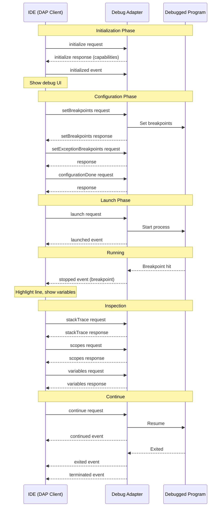

# Debug Adapter Protocol (DAP) Deep Dive

## Table of Contents

1. [DAP Architecture Overview](#1-dap-architecture-overview)
2. [DAP Protocol Fundamentals](#2-dap-protocol-fundamentals)
3. [DAP Client Implementation](#3-dap-client-implementation)
4. [Breakpoint Management](#4-breakpoint-management)
5. [Stack Frame Navigation](#5-stack-frame-navigation)
6. [Variable Inspection](#6-variable-inspection)
7. [Execution Control](#7-execution-control)
8. [Rockies Universe as Debug State](#8-rockies-universe-as-debug-state)
9. [Building a Debug Adapter](#9-building-a-debug-adapter)

---

## 1. DAP Architecture Overview

### 1.1 What is DAP?

The Debug Adapter Protocol (DAP) is a standard protocol that allows IDEs to communicate with debuggers. Instead of building debugger integration into each IDE, DAP allows you to write a debug adapter once.

```
┌─────────────────────────────────────────────────────────────┐
│                         IDEs                                │
│  VS Code  │  Neovim  │  Emacs  │  Eclipse  │  JetBrains   │
└─────┬─────┴─────┬─────┴────┬─────┴────┬──────┴──────┬─────┘
      │           │          │          │             │
      │  DAP      │  DAP     │  DAP     │  DAP        │  DAP
      │  Client   │  Client  │  Client  │  Client     │  Client
      │           │          │          │             │
      └───────────┴──────────┴──────────┴─────────────┘
                              │
                              │ JSON-RPC
                              │
                     ┌────────┴────────┐
                     │  Debug Adapter  │
                     │  (e.g., node)   │
                     └────────┬────────┘
                              │
                              │ Native API
                              │
              ┌───────────────┼───────────────┐
              │               │               │
         ┌────┴────┐    ┌────┴────┐    ┌────┴────┐
         │  GDB    │    │  LLDB   │    │  Node   │
         │  (C++)  │    │ (Rust)  │    │ Inspector│
         └─────────┘    └─────────┘    └─────────┘
```

### 1.2 DAP vs LSP

| Aspect | LSP | DAP |
|--------|-----|-----|
| **Purpose** | Language features | Debugging |
| **Communication** | Request/Response | Event-driven |
| **State** | Stateless | Stateful session |
| **Events** | Diagnostics, progress | Stopped, continued, exited |
| **Session** | Document-based | Debug session-based |

### 1.3 DAP and Rockies: Parallels

| Rockies | DAP Equivalent |
|---------|---------------|
| `Universe` state | Debug session state |
| `Player` position | Current execution point (PC) |
| `Cell` properties | Variable values |
| `tick()` | Step execution |
| Grid save/load | Debug session serialization |
| `get_missing_grids()` | Lazy stack frame loading |
| Collision detection | Breakpoint hit |

---

## 2. DAP Protocol Fundamentals

### 2.1 DAP Message Structure

DAP uses JSON-RPC-like messages but with a slightly different structure:

**Request:**
```json
{
  "seq": 1,
  "type": "request",
  "command": "initialize",
  "arguments": {
    "clientID": "vscode",
    "adapterID": "rust",
    "pathFormat": "path",
    "linesStartAt1": true,
    "columnsStartAt1": true,
    "supportsVariableType": true,
    "supportsVariablePaging": false
  }
}
```

**Response:**
```json
{
  "seq": 1,
  "type": "response",
  "request_seq": 1,
  "success": true,
  "command": "initialize",
  "body": {
    "supportsConfigurationDoneRequest": true,
    "supportsSetVariable": true,
    "supportsConditionalBreakpoints": true,
    "supportsHitConditionalBreakpoints": true
  }
}
```

**Event:**
```json
{
  "seq": 2,
  "type": "event",
  "event": "initialized",
  "body": {}
}
```

### 2.2 DAP Message Types in Rust

```rust
use serde::{Deserialize, Serialize};

#[derive(Debug, Clone, Serialize, Deserialize)]
#[serde(tag = "type")]
pub enum DapMessage {
    #[serde(rename = "request")]
    Request(DapRequest),

    #[serde(rename = "response")]
    Response(DapResponse),

    #[serde(rename = "event")]
    Event(DapEvent),
}

#[derive(Debug, Clone, Serialize, Deserialize)]
pub struct DapRequest {
    pub seq: u64,
    pub command: String,
    #[serde(rename = "arguments", skip_serializing_if = "Option::is_none")]
    pub arguments: Option<serde_json::Value>,
}

#[derive(Debug, Clone, Serialize, Deserialize)]
pub struct DapResponse {
    pub seq: u64,
    #[serde(rename = "request_seq")]
    pub request_seq: u64,
    pub success: bool,
    pub command: String,
    #[serde(skip_serializing_if = "Option::is_none")]
    pub body: Option<serde_json::Value>,
    #[serde(skip_serializing_if = "Option::is_none")]
    pub message: Option<String>,
}

#[derive(Debug, Clone, Serialize, Deserialize)]
pub struct DapEvent {
    pub seq: u64,
    pub event: String,
    #[serde(rename = "body", skip_serializing_if = "Option::is_none")]
    pub body: Option<serde_json::Value>,
}
```

### 2.3 DAP Session Lifecycle



---

## 3. DAP Client Implementation

### 3.1 DAP Client Architecture

```
┌─────────────────────────────────────────┐
│            DAP Client                   │
├─────────────────────────────────────────┤
│  Message Loop                           │
│  - Read DAP messages from adapter       │
│  - Dispatch to handlers                 │
├─────────────────────────────────────────┤
│  Request Handlers                       │
│  - launch/attach                        │
│  - setBreakpoints                       │
│  - stackTrace                           │
│  - variables                            │
├─────────────────────────────────────────┤
│  Event Handlers                         │
│  - stopped                              │
│  - continued                            │
│  - exited                               │
│  - terminated                           │
├─────────────────────────────────────────┤
│  Debug State                            │
│  - Thread states                        │
│  - Stack frames                         │
│  - Variable cache                       │
└─────────────────────────────────────────┘
```

### 3.2 DAP Client in Rust

```rust
use std::process::{Child, ChildStdin, ChildStdout, Command, Stdio};
use std::io::{BufRead, BufReader, Write};
use serde_json::{json, Value};
use std::collections::HashMap;

pub struct DapClient {
    process: Option<Child>,
    stdin: ChildStdin,
    stdout: BufReader<ChildStdout>,
    seq: u64,
    pending_requests: HashMap<u64, std::sync::mpsc::Sender<Value>>,
}

impl DapClient {
    /// Start a debug adapter process
    pub fn start(command: &str, args: &[&str]) -> std::io::Result<Self> {
        let mut process = Command::new(command)
            .args(args)
            .stdin(Stdio::piped())
            .stdout(Stdio::piped())
            .stderr(Stdio::piped())
            .spawn()?;

        let stdin = process.stdin.take().unwrap();
        let stdout = BufReader::new(process.stdout.take().unwrap());

        Ok(Self {
            process: Some(process),
            stdin,
            stdout,
            seq: 0,
            pending_requests: HashMap::new(),
        })
    }

    /// Send a DAP message
    fn send_message(&mut self, message: &Value) -> std::io::Result<()> {
        let content = message.to_string();
        let header = format!("Content-Length: {}\r\n\r\n", content.len());

        self.stdin.write_all(header.as_bytes())?;
        self.stdin.write_all(content.as_bytes())?;
        self.stdin.flush()?;
        Ok(())
    }

    /// Read a DAP message from adapter
    fn read_message(&mut self) -> std::io::Result<Value> {
        // Read Content-Length header
        let mut content_length = 0;
        let mut reader = &mut self.stdout;

        loop {
            let mut line = String::new();
            reader.read_line(&mut line)?;
            let line = line.trim();

            if line.is_empty() {
                break;
            }

            if let Some(length) = line.strip_prefix("Content-Length: ") {
                content_length = length.parse().unwrap();
            }
        }

        // Read content
        let mut content = vec![0u8; content_length];
        reader.read_exact(&mut content)?;

        Ok(serde_json::from_slice(&content)?)
    }

    /// Send a request and wait for response
    pub fn send_request(&mut self, command: &str, arguments: Value) -> std::io::Result<Value> {
        self.seq += 1;
        let seq = self.seq;

        let message = json!({
            "seq": seq,
            "type": "request",
            "command": command,
            "arguments": arguments
        });

        self.send_message(&message)?;

        // Wait for response with matching request_seq
        loop {
            let response = self.read_message()?;
            if response.get("type").and_then(|t| t.as_str()) == Some("response") {
                if response.get("request_seq").and_then(|r| r.as_u64()) == Some(seq) {
                    return Ok(response);
                }
            }
        }
    }

    /// Initialize the debug adapter
    pub fn initialize(&mut self) -> std::io::Result<Value> {
        self.send_request("initialize", json!({
            "clientID": "rockies-ide",
            "adapterID": "rust",
            "pathFormat": "path",
            "linesStartAt1": true,
            "columnsStartAt1": true,
            "supportsVariableType": true,
            "supportsVariablePaging": false,
            "supportsRunInTerminalRequest": true
        }))
    }

    /// Launch a debug session
    pub fn launch(&mut self, program: &str, args: &[String]) -> std::io::Result<Value> {
        self.send_request("launch", json!({
            "program": program,
            "args": args,
            "stopOnEntry": false,
            "cwd": std::env::current_dir()?.to_str().unwrap()
        }))
    }

    /// Set breakpoints in a source file
    pub fn set_breakpoints(
        &mut self,
        source: &str,
        breakpoints: &[usize],
    ) -> std::io::Result<Value> {
        self.send_request("setBreakpoints", json!({
            "source": {
                "path": source
            },
            "breakpoints": breakpoints.iter().map(|&line| {
                json!({ "line": line })
            }).collect::<Vec<_>>(),
            "sourceModified": false
        }))
    }

    /// Get stack trace for a thread
    pub fn stack_trace(&mut self, thread_id: i64) -> std::io::Result<Value> {
        self.send_request("stackTrace", json!({
            "threadId": thread_id,
            "startFrame": 0,
            "levels": 20
        }))
    }

    /// Get scopes for a stack frame
    pub fn scopes(&mut self, frame_id: i64) -> std::io::Result<Value> {
        self.send_request("scopes", json!({
            "frameId": frame_id
        }))
    }

    /// Get variables in a scope
    pub fn variables(&mut self, variables_reference: i64) -> std::io::Result<Value> {
        self.send_request("variables", json!({
            "variablesReference": variables_reference
        }))
    }

    /// Continue execution
    pub fn continue_(&mut self, thread_id: i64) -> std::io::Result<Value> {
        self.send_request("continue", json!({
            "threadId": thread_id
        }))
    }

    /// Step over (next)
    pub fn next(&mut self, thread_id: i64) -> std::io::Result<Value> {
        self.send_request("next", json!({
            "threadId": thread_id
        }))
    }

    /// Step in (into function)
    pub fn step_in(&mut self, thread_id: i64) -> std::io::Result<Value> {
        self.send_request("stepIn", json!({
            "threadId": thread_id
        }))
    }

    /// Step out (return from function)
    pub fn step_out(&mut self, thread_id: i64) -> std::io::Result<Value> {
        self.send_request("stepOut", json!({
            "threadId": thread_id
        }))
    }

    /// Terminate debug session
    pub fn terminate(&mut self) -> std::io::Result<Value> {
        self.send_request("terminate", json!({}))
    }

    /// Disconnect from debug adapter
    pub fn disconnect(&mut self) -> std::io::Result<Value> {
        self.send_request("disconnect", json!({
            "restart": false,
            "terminateDebuggee": true
        }))
    }
}
```

### 3.3 DAP Event Handling

```rust
pub enum DapEvent {
    Initialized,
    Stopped(StoppedEvent),
    Continued(ContinuedEvent),
    Exited(ExitedEvent),
    Terminated,
    Output(OutputEvent),
    Breakpoint(BreakpointEvent),
}

pub struct StoppedEvent {
    pub reason: String,  // "breakpoint", "step", "exception", etc.
    pub thread_id: i64,
    pub all_threads_stopped: bool,
}

pub struct ContinuedEvent {
    pub thread_id: i64,
    pub all_threads_continued: bool,
}

pub struct ExitedEvent {
    pub exit_code: i64,
}

pub struct OutputEvent {
    pub category: String,  // "stdout", "stderr", "console", etc.
    pub output: String,
}

impl DapClient {
    /// Run event loop and handle events
    pub fn run_event_loop<F>(&mut self, mut handler: F) -> std::io::Result<()>
    where
        F: FnMut(DapEvent),
    {
        loop {
            let message = self.read_message()?;

            match message.get("type").and_then(|t| t.as_str()) {
                Some("event") => {
                    let event_name = message.get("event").and_then(|e| e.as_str()).unwrap_or("");
                    let body = message.get("body");

                    match event_name {
                        "initialized" => handler(DapEvent::Initialized),
                        "stopped" => {
                            if let Some(body) = body {
                                handler(DapEvent::Stopped(StoppedEvent {
                                    reason: body["reason"].as_str().unwrap_or("").to_string(),
                                    thread_id: body["threadId"].as_i64().unwrap_or(0),
                                    all_threads_stopped: body["allThreadsStopped"].as_bool().unwrap_or(false),
                                }));
                            }
                        }
                        "continued" => {
                            if let Some(body) = body {
                                handler(DapEvent::Continued(ContinuedEvent {
                                    thread_id: body["threadId"].as_i64().unwrap_or(0),
                                    all_threads_continued: body["allThreadsContinued"].as_bool().unwrap_or(true),
                                }));
                            }
                        }
                        "exited" => {
                            if let Some(body) = body {
                                handler(DapEvent::Exited(ExitedEvent {
                                    exit_code: body["exitCode"].as_i64().unwrap_or(0),
                                }));
                            }
                        }
                        "terminated" => handler(DapEvent::Terminated),
                        "output" => {
                            if let Some(body) = body {
                                handler(DapEvent::Output(OutputEvent {
                                    category: body["category"].as_str().unwrap_or("").to_string(),
                                    output: body["output"].as_str().unwrap_or("").to_string(),
                                }));
                            }
                        }
                        _ => {}
                    }
                }
                Some("response") => {
                    // Handled by send_request
                }
                _ => {}
            }
        }
    }
}
```

---

## 4. Breakpoint Management

### 4.1 Breakpoint Types

DAP supports several breakpoint types:

**1. Line Breakpoint:**
```json
{
  "source": { "path": "/app/src/main.rs" },
  "breakpoints": [
    { "line": 42 },
    { "line": 100, "column": 5 }
  ]
}
```

**2. Conditional Breakpoint:**
```json
{
  "source": { "path": "/app/src/main.rs" },
  "breakpoints": [
    {
      "line": 42,
      "condition": "x > 100",
      "hitCondition": "3"  // Break on 3rd hit
    }
  ]
}
```

**3. Exception Breakpoint:**
```json
{
  "filters": ["panic", "unwind"],
  "filterOptions": [
    {
      "filterId": "panic",
      "condition": "message.contains(\"connection\")"
    }
  ]
}
```

### 4.2 Breakpoint Verification

```rust
#[derive(Debug, Clone, Serialize, Deserialize)]
pub struct Breakpoint {
    /// Unique identifier for the breakpoint
    #[serde(skip_serializing_if = "Option::is_none")]
    pub id: Option<i64>,

    /// Whether the breakpoint could be set
    pub verified: bool,

    /// The source where the breakpoint is set
    #[serde(skip_serializing_if = "Option::is_none")]
    pub source: Option<Source>,

    /// The line position (1-based)
    #[serde(skip_serializing_if = "Option::is_none")]
    pub line: Option<i64>,

    /// The column position
    #[serde(skip_serializing_if = "Option::is_none")]
    pub column: Option<i64>,

    /// An optional message about the breakpoint state
    #[serde(skip_serializing_if = "Option::is_none")]
    pub message: Option<String>,
}

#[derive(Debug, Clone, Serialize, Deserialize)]
pub struct Source {
    #[serde(skip_serializing_if = "Option::is_none")]
    pub name: Option<String>,

    #[serde(skip_serializing_if = "Option::is_none")]
    pub path: Option<String>,

    #[serde(skip_serializing_if = "Option::is_none")]
    pub sourceReference: Option<i64>,
}
```

### 4.3 Breakpoint Manager

```rust
use std::collections::HashMap;

pub struct BreakpointManager {
    /// Breakpoints by source path
    breakpoints: HashMap<String, Vec<SourceBreakpoint>>,
    /// Next breakpoint ID
    next_id: i64,
    /// Exception breakpoints
    exception_filters: Vec<String>,
}

#[derive(Debug, Clone)]
pub struct SourceBreakpoint {
    pub id: i64,
    pub line: i64,
    pub column: Option<i64>,
    pub condition: Option<String>,
    pub hit_condition: Option<String>,
    pub verified: bool,
    pub actual_line: Option<i64>,  // May differ if line mapping exists
}

impl BreakpointManager {
    pub fn new() -> Self {
        Self {
            breakpoints: HashMap::new(),
            next_id: 1,
            exception_filters: Vec::new(),
        }
    }

    /// Set breakpoints for a source file
    pub fn set_breakpoints(
        &mut self,
        source_path: &str,
        breakpoints: &[serde_json::Value],
    ) -> Vec<Breakpoint> {
        let mut result = Vec::new();
        let mut new_breakpoints = Vec::new();

        for bp in breakpoints {
            let id = self.next_id;
            self.next_id += 1;

            let source_bp = SourceBreakpoint {
                id,
                line: bp["line"].as_i64().unwrap_or(0),
                column: bp.get("column").and_then(|c| c.as_i64()),
                condition: bp.get("condition").and_then(|c| c.as_str()).map(String::from),
                hit_condition: bp.get("hitCondition").and_then(|c| c.as_str()).map(String::from),
                verified: true,  // Assume verified; debugger may adjust
                actual_line: None,
            };

            // Verify breakpoint makes sense (line exists in file)
            let verified_bp = self.verify_breakpoint(source_path, &source_bp);
            new_breakpoints.push(verified_bp.clone());

            result.push(Breakpoint {
                id: Some(verified_bp.id),
                verified: verified_bp.verified,
                source: Some(Source {
                    path: Some(source_path.to_string()),
                    ..Default::default()
                }),
                line: Some(verified_bp.line),
                column: verified_bp.column,
                message: if !verified_bp.verified {
                    Some("Line does not exist".to_string())
                } else {
                    None
                },
            });
        }

        self.breakpoints.insert(source_path.to_string(), new_breakpoints);
        result
    }

    /// Verify a breakpoint can be set at the given location
    fn verify_breakpoint(&self, source_path: &str, bp: &SourceBreakpoint) -> SourceBreakpoint {
        // In a real implementation, check if the line exists and can have a breakpoint
        // For now, assume all breakpoints are valid
        bp.clone()
    }

    /// Get breakpoints for a source file
    pub fn get_breakpoints(&self, source_path: &str) -> Vec<&SourceBreakpoint> {
        self.breakpoints
            .get(source_path)
            .map(|bps| bps.iter().collect())
            .unwrap_or_default()
    }

    /// Check if a breakpoint exists at a location
    pub fn has_breakpoint(&self, source_path: &str, line: i64) -> bool {
        self.breakpoints
            .get(source_path)
            .map(|bps| bps.iter().any(|bp| bp.line == line && bp.verified))
            .unwrap_or(false)
    }

    /// Set exception breakpoint filters
    pub fn set_exception_breakpoints(&mut self, filters: Vec<String>) {
        self.exception_filters = filters;
    }
}
```

---

## 5. Stack Frame Navigation

### 5.1 Stack Frame Structure

```rust
#[derive(Debug, Clone, Serialize, Deserialize)]
pub struct StackFrame {
    /// Unique identifier for the stack frame
    pub id: i64,

    /// Name of the frame (function name, etc.)
    pub name: String,

    /// The source of the frame
    #[serde(skip_serializing_if = "Option::is_none")]
    pub source: Option<Source>,

    /// The line position (1-based)
    pub line: i64,

    /// The column position (1-based)
    #[serde(skip_serializing_if = "Option::is_none")]
    pub column: Option<i64>,

    /// Indicates whether this frame can be restarted
    #[serde(skip_serializing_if = "Option::is_none")]
    pub canRestart: Option<bool>,
}

#[derive(Debug, Clone, Serialize, Deserialize)]
pub struct StackTraceResponse {
    /// The frames of the stack
    pub stackFrames: Vec<StackFrame>,

    /// The total number of frames available
    #[serde(skip_serializing_if = "Option::is_none")]
    pub totalFrames: Option<i64>,
}
```

### 5.2 Stack Trace Implementation

```rust
impl DapClient {
    /// Get full stack trace with parsed frames
    pub fn get_stack_trace(&mut self, thread_id: i64) -> std::io::Result<Vec<StackFrame>> {
        let response = self.stack_trace(thread_id)?;

        if !response["success"].as_bool().unwrap_or(false) {
            return Ok(Vec::new());
        }

        let frames = response["body"]["stackFrames"]
            .as_array()
            .map(|arr| {
                arr.iter()
                    .map(|frame| StackFrame {
                        id: frame["id"].as_i64().unwrap_or(0),
                        name: frame["name"].as_str().unwrap_or("unknown").to_string(),
                        source: frame.get("source").and_then(|s| {
                            serde_json::from_value(s.clone()).ok()
                        }),
                        line: frame["line"].as_i64().unwrap_or(0),
                        column: frame.get("column").and_then(|c| c.as_i64()),
                        canRestart: frame.get("canRestart").and_then(|c| c.as_bool()),
                    })
                    .collect()
            })
            .unwrap_or_default();

        Ok(frames)
    }
}

/// Display stack trace in UI
pub fn render_stack_trace(frames: &[StackFrame]) -> String {
    let mut output = String::new();

    output.push_str("Stack Trace:\n");
    output.push_str("─".repeat(60).as_str());
    output.push('\n');

    for (i, frame) in frames.iter().enumerate() {
        let source_info = frame
            .source
            .as_ref()
            .and_then(|s| s.path.as_ref())
            .map(|p| format!("{}:{}", p, frame.line))
            .unwrap_or_else(|| format!("line {}", frame.line));

        output.push_str(&format!(
            "#{:<2} {:<40} {}\n",
            i,
            frame.name,
            source_info
        ));
    }

    output
}
```

### 5.3 Rockies Universe as Stack Trace

```rust
// Rockies: Universe tracks player position in world
pub struct Universe {
    pub player: Player,
    pub cells: UniverseCells,
    // ...
}

pub struct Player {
    pub inertia: Inertia,  // Position, velocity
    pub frame: usize,
    // ...
}

// Debug equivalent: Track execution state
pub struct DebugSession {
    pub current_frame: StackFrame,
    pub call_stack: Vec<StackFrame>,
    pub variables: HashMap<String, Variable>,
}

// Parallels:
// - Player.inertia.pos ≈ Program counter (current line)
// - Universe.cells ≈ Variable store
// - Universe.tick() ≈ Step execution
```

---

## 6. Variable Inspection

### 6.1 Variable Structure

```rust
#[derive(Debug, Clone, Serialize, Deserialize)]
pub struct ScopesResponse {
    pub scopes: Vec<Scope>,
}

#[derive(Debug, Clone, Serialize, Deserialize)]
pub struct Scope {
    /// Name of the scope (e.g., "Locals", "Globals")
    pub name: String,

    /// Presentation hint (optional)
    #[serde(skip_serializing_if = "Option::is_none")]
    pub presentationHint: Option<String>,

    /// Variables reference for fetching variables
    pub variablesReference: i64,

    /// Whether named variables can be fetched
    #[serde(skip_serializing_if = "Option::is_none")]
    pub namedVariables: Option<i64>,

    /// Whether indexed variables can be fetched
    #[serde(skip_serializing_if = "Option::is_none")]
    pub indexedVariables: Option<i64>,

    /// Whether variables can be modified
    #[serde(skip_serializing_if = "Option::is_none")]
    pub expensive: Option<bool>,
}

#[derive(Debug, Clone, Serialize, Deserialize)]
pub struct VariablesResponse {
    pub variables: Vec<Variable>,
}

#[derive(Debug, Clone, Serialize, Deserialize)]
pub struct Variable {
    /// Variable name
    pub name: String,

    /// Variable value (string representation)
    pub value: String,

    /// Variable type (language-specific)
    #[serde(skip_serializing_if = "Option::is_none")]
    #[serde(rename = "type")]
    pub var_type: Option<String>,

    /// Variables reference for child variables
    #[serde(skip_serializing_if = "Option::is_none")]
    pub variablesReference: Option<i64>,

    /// Presentation hint (optional)
    #[serde(skip_serializing_if = "Option::is_none")]
    pub presentationHint: Option<VariablePresentationHint>,
}

#[derive(Debug, Clone, Serialize, Deserialize)]
pub struct VariablePresentationHint {
    /// Kind of variable (optional)
    #[serde(skip_serializing_if = "Option::is_none")]
    pub kind: Option<String>,

    /// Attributes (optional)
    #[serde(skip_serializing_if = "Option::is_none")]
    pub attributes: Option<Vec<String>>,

    /// Visibility (optional)
    #[serde(skip_serializing_if = "Option::is_none")]
    pub visibility: Option<String>,
}
```

### 6.2 Variable Inspection Implementation

```rust
impl DapClient {
    /// Get all variables for a stack frame
    pub fn get_all_variables(
        &mut self,
        frame_id: i64,
    ) -> std::io::Result<HashMap<String, Vec<Variable>>> {
        let mut result = HashMap::new();

        // Get scopes
        let scopes_response = self.scopes(frame_id)?;
        let scopes: Vec<Scope> = scopes_response["body"]["scopes"]
            .as_array()
            .map(|arr| {
                arr.iter()
                    .map(|s| serde_json::from_value(s.clone()).unwrap())
                    .collect()
            })
            .unwrap_or_default();

        // Get variables for each scope
        for scope in scopes {
            let variables_response = self.variables(scope.variablesReference)?;
            let variables: Vec<Variable> = variables_response["body"]["variables"]
                .as_array()
                .map(|arr| {
                    arr.iter()
                        .map(|v| serde_json::from_value(v.clone()).unwrap())
                        .collect()
                })
                .unwrap_or_default();

            result.insert(scope.name, variables);
        }

        Ok(result)
    }

    /// Get child variables (for complex types)
    pub fn get_child_variables(
        &mut self,
        variables_reference: i64,
    ) -> std::io::Result<Vec<Variable>> {
        let response = self.variables(variables_reference)?;

        let variables: Vec<Variable> = response["body"]["variables"]
            .as_array()
            .map(|arr| {
                arr.iter()
                    .map(|v| serde_json::from_value(v.clone()).unwrap())
                    .collect()
            })
            .unwrap_or_default();

        Ok(variables)
    }
}
```

### 6.3 Rockies Cell Properties as Variables

```rust
// Rockies: Cell has properties
#[derive(Clone, Copy, Debug, PartialEq, Serialize, Deserialize)]
pub struct Cell {
    pub index: CellIndex,
    pub color: Color,
    pub inertia: Inertia,
}

// Debug equivalent: Variable with children
fn cell_to_variable(cell: &Cell) -> Variable {
    Variable {
        name: format!("cell_{}", cell.index.index),
        value: format!("Cell {{ color: {:?}, ... }}", cell.color),
        var_type: Some("Cell".to_string()),
        variablesReference: Some(cell.index.index as i64),
        presentationHint: None,
    }
}

fn get_cell_children(cell: &Cell) -> Vec<Variable> {
    vec![
        Variable {
            name: "index".to_string(),
            value: cell.index.index.to_string(),
            var_type: Some("CellIndex".to_string()),
            variablesReference: None,
            presentationHint: None,
        },
        Variable {
            name: "color".to_string(),
            value: format!("#{:06X}", cell.color.to_u32() & 0xFFFFFF),
            var_type: Some("Color".to_string()),
            variablesReference: None,
            presentationHint: None,
        },
        Variable {
            name: "inertia".to_string(),
            value: format!("Inertia {{ pos: {:?}, vel: {:?} }}", cell.inertia.pos, cell.inertia.velocity),
            var_type: Some("Inertia".to_string()),
            variablesReference: Some(1),  // Would have children
            presentationHint: None,
        },
    ]
}
```

---

## 7. Execution Control

### 7.1 Execution Commands

```rust
impl DapClient {
    /// Continue execution until next breakpoint
    pub fn continue_execution(&mut self, thread_id: i64) -> std::io::Result<bool> {
        let response = self.continue_(thread_id)?;
        Ok(response["success"].as_bool().unwrap_or(false))
    }

    /// Step over (execute current line, don't enter functions)
    pub fn step_over(&mut self, thread_id: i64) -> std::io::Result<bool> {
        let response = self.next(thread_id)?;
        Ok(response["success"].as_bool().unwrap_or(false))
    }

    /// Step in (enter function call)
    pub fn step_into(&mut self, thread_id: i64) -> std::io::Result<bool> {
        let response = self.step_in(thread_id)?;
        Ok(response["success"].as_bool().unwrap_or(false))
    }

    /// Step out (return from current function)
    pub fn step_out(&mut self, thread_id: i64) -> std::io::Result<bool> {
        let response = self.step_out(thread_id)?;
        Ok(response["success"].as_bool().unwrap_or(false))
    }
}
```

### 7.2 Rockies Tick as Step Execution

```rust
// Rockies: Universe advances one tick
impl Universe {
    pub fn tick(&mut self) {
        self.cells.stats.ticks += 1;

        for _ in 0..((1.0 / self.dt) as usize) {
            self.calc_forces();
            self.update_velocity();
            self.cells.calc_collisions(self.dt);
            self.player.update_pos(&self.cells, self.dt);
            self.cells.update_pos(self.dt);
            self.zero_forces();
        }
    }
}

// Debug equivalent: Single step execution
impl DebugSession {
    pub fn step(&mut self) -> DebugEvent {
        // Execute one instruction/line
        let current_frame = &mut self.current_frame;

        // Update state (like Universe::tick)
        self.execute_line(current_frame.line);

        // Check for breakpoints
        if self.check_breakpoint(current_frame.source, current_frame.line) {
            return DebugEvent::Stopped(StoppedReason::Breakpoint);
        }

        // Update stack frame
        self.update_stack_frame();

        DebugEvent::Running
    }
}
```

---

## 8. Rockies Universe as Debug State

### 8.1 State Comparison

| Rockies Universe | Debug Session |
|-----------------|---------------|
| `Universe` | `DebugSession` |
| `Player` | Current execution context |
| `Player.inertia.pos` | Program counter (current line) |
| `Universe.cells` | Variable store |
| `Cell` | Variable/object instance |
| `Cell.inertia` | Object state |
| `tick()` | Step/continue |
| `get_missing_grids()` | Lazy load stack frames |
| `save_grid()` | Serialize debug state |
| `load_grid()` | Restore debug state |
| `grid_dirty_status` | Modified since last save |

### 8.2 TLA+ Grid State as Debug State Machine

From the rockies TLA+ specification:

```
Grid States:
- stored/not_stored  (persisted to disk?)
- loaded/not_loaded  (currently in memory?)
- dirty/unmodified/pristine (modification state)

Valid Transitions:
not_stored + not_loaded  ──Load──> loaded + pristine
stored + not_loaded      ──Load──> loaded + unmodified
loaded + pristine        ──Modify─> loaded + dirty
loaded + unmodified      ──Modify─> loaded + dirty
loaded + dirty           ──Save──> stored + unmodified
loaded + unmodified      ──Unload─> not_loaded
loaded + pristine        ──Unload─> not_loaded
```

**Debug State Machine:**

```
Frame States:
- loaded/not_loaded (in memory?)
- dirty/clean (modified?)

Transitions:
not_loaded ──GetStackTrace──> loaded
loaded ──Step/Continue──> dirty (execution changed state)
loaded ──Refresh──> clean
```

---

## 9. Building a Debug Adapter

### 9.1 Minimal Debug Adapter

```rust
use std::io::{self, BufRead, Write};
use serde_json::{json, Value};

pub struct DebugAdapter {
    seq: u64,
    breakpoints: BreakpointManager,
    session: Option<DebugSession>,
}

struct DebugSession {
    program: String,
    running: bool,
    current_line: i64,
    variables: HashMap<String, Variable>,
}

impl DebugAdapter {
    pub fn new() -> Self {
        Self {
            seq: 0,
            breakpoints: BreakpointManager::new(),
            session: None,
        }
    }

    pub fn run(&mut self) -> io::Result<()> {
        let stdin = io::stdin();
        let mut stdout = io::stdout();
        let mut reader = stdin.lock();

        loop {
            // Read message
            let mut content_length = 0;
            let mut line = String::new();

            loop {
                line.clear();
                reader.read_line(&mut line)?;
                let trimmed = line.trim();

                if trimmed.is_empty() {
                    break;
                }

                if let Some(length) = trimmed.strip_prefix("Content-Length: ") {
                    content_length = length.parse()?;
                }
            }

            let mut content = vec![0u8; content_length];
            reader.read_exact(&mut content)?;

            let message: Value = serde_json::from_slice(&content)?;
            let response = self.handle_message(message)?;

            if let Some(response) = response {
                let content = response.to_string();
                let header = format!("Content-Length: {}\r\n\r\n", content.len());
                stdout.write_all(header.as_bytes())?;
                stdout.write_all(content.as_bytes())?;
                stdout.flush()?;
            }
        }
    }

    fn handle_message(&mut self, message: Value) -> io::Result<Option<Value>> {
        let msg_type = message.get("type").and_then(|t| t.as_str()).unwrap_or("");
        let command = message.get("command").and_then(|c| c.as_str()).unwrap_or("");

        match (msg_type, command) {
            ("request", "initialize") => Ok(Some(self.handle_initialize(&message))),
            ("request", "launch") => Ok(Some(self.handle_launch(&message))),
            ("request", "setBreakpoints") => Ok(Some(self.handle_set_breakpoints(&message))),
            ("request", "stackTrace") => Ok(Some(self.handle_stack_trace(&message))),
            ("request", "scopes") => Ok(Some(self.handle_scopes(&message))),
            ("request", "variables") => Ok(Some(self.handle_variables(&message))),
            ("request", "continue") => Ok(Some(self.handle_continue(&message))),
            ("request", "next") => Ok(Some(self.handle_next(&message))),
            ("request", "stepIn") => Ok(Some(self.handle_step_in(&message))),
            ("request", "stepOut") => Ok(Some(self.handle_step_out(&message))),
            ("request", "disconnect") => Ok(Some(self.handle_disconnect(&message))),
            _ => Ok(None),
        }
    }

    fn send_event(&mut self, event: &str, body: Value) -> io::Result<()> {
        self.seq += 1;
        let message = json!({
            "seq": self.seq,
            "type": "event",
            "event": event,
            "body": body
        });

        let content = message.to_string();
        let header = format!("Content-Length: {}\r\n\r\n", content.len());

        let mut stdout = io::stdout();
        stdout.write_all(header.as_bytes())?;
        stdout.write_all(content.as_bytes())?;
        stdout.flush()?;

        Ok(())
    }

    fn handle_initialize(&mut self, message: &Value) -> Value {
        json!({
            "seq": 1,
            "type": "response",
            "request_seq": message["seq"],
            "success": true,
            "command": "initialize",
            "body": {
                "supportsConfigurationDoneRequest": true,
                "supportsSetVariable": true,
                "supportsConditionalBreakpoints": true,
                "supportsHitConditionalBreakpoints": true,
                "supportsSteppingGranularity": false
            }
        })
    }

    fn handle_launch(&mut self, message: &Value) -> Value {
        let program = message["arguments"]["program"].as_str().unwrap().to_string();

        self.session = Some(DebugSession {
            program,
            running: true,
            current_line: 1,
            variables: HashMap::new(),
        });

        // Send initialized event
        self.send_event("initialized", json!({})).ok();

        json!({
            "seq": 2,
            "type": "response",
            "request_seq": message["seq"],
            "success": true,
            "command": "launch"
        })
    }

    fn handle_set_breakpoints(&mut self, message: &Value) -> Value {
        let source_path = message["arguments"]["source"]["path"].as_str().unwrap();
        let breakpoints = message["arguments"]["breakpoints"].as_array().unwrap();

        let result = self.breakpoints.set_breakpoints(source_path, breakpoints);

        json!({
            "seq": 3,
            "type": "response",
            "request_seq": message["seq"],
            "success": true,
            "command": "setBreakpoints",
            "body": {
                "breakpoints": result
            }
        })
    }

    fn handle_stack_trace(&mut self, message: &Value) -> Value {
        // Return mock stack trace
        json!({
            "seq": 4,
            "type": "response",
            "request_seq": message["seq"],
            "success": true,
            "command": "stackTrace",
            "body": {
                "stackFrames": [
                    {
                        "id": 1,
                        "name": "main",
                        "source": { "path": "/app/src/main.rs" },
                        "line": 10,
                        "column": 1
                    }
                ],
                "totalFrames": 1
            }
        })
    }

    fn handle_scopes(&mut self, message: &Value) -> Value {
        json!({
            "seq": 5,
            "type": "response",
            "request_seq": message["seq"],
            "success": true,
            "command": "scopes",
            "body": {
                "scopes": [
                    {
                        "name": "Locals",
                        "variablesReference": 1,
                        "presentationHint": "locals"
                    },
                    {
                        "name": "Globals",
                        "variablesReference": 2,
                        "presentationHint": "globals"
                    }
                ]
            }
        })
    }

    fn handle_variables(&mut self, message: &Value) -> Value {
        json!({
            "seq": 6,
            "type": "response",
            "request_seq": message["seq"],
            "success": true,
            "command": "variables",
            "body": {
                "variables": [
                    { "name": "x", "value": "42", "type": "i32", "variablesReference": 0 },
                    { "name": "name", "value": "\"hello\"", "type": "&str", "variablesReference": 0 }
                ]
            }
        })
    }

    fn handle_continue(&mut self, message: &Value) -> Value {
        if let Some(session) = &mut self.session {
            session.running = true;
        }

        json!({
            "seq": 7,
            "type": "response",
            "request_seq": message["seq"],
            "success": true,
            "command": "continue"
        })
    }

    fn handle_next(&mut self, message: &Value) -> Value {
        if let Some(session) = &mut self.session {
            session.current_line += 1;

            // Send stopped event
            self.send_event("stopped", json!({
                "reason": "step",
                "threadId": 1,
                "allThreadsStopped": true
            })).ok();
        }

        json!({
            "seq": 8,
            "type": "response",
            "request_seq": message["seq"],
            "success": true,
            "command": "next"
        })
    }

    fn handle_step_in(&mut self, message: &Value) -> Value {
        self.handle_next(message)
    }

    fn handle_step_out(&mut self, message: &Value) -> Value {
        self.handle_next(message)
    }

    fn handle_disconnect(&mut self, message: &Value) -> Value {
        self.session = None;

        self.send_event("terminated", json!({})).ok();

        json!({
            "seq": 9,
            "type": "response",
            "request_seq": message["seq"],
            "success": true,
            "command": "disconnect"
        })
    }
}

fn main() -> io::Result<()> {
    let mut adapter = DebugAdapter::new();
    adapter.run()
}
```

---

*Next: [03-project-system-deep-dive.md](03-project-system-deep-dive.md)*
