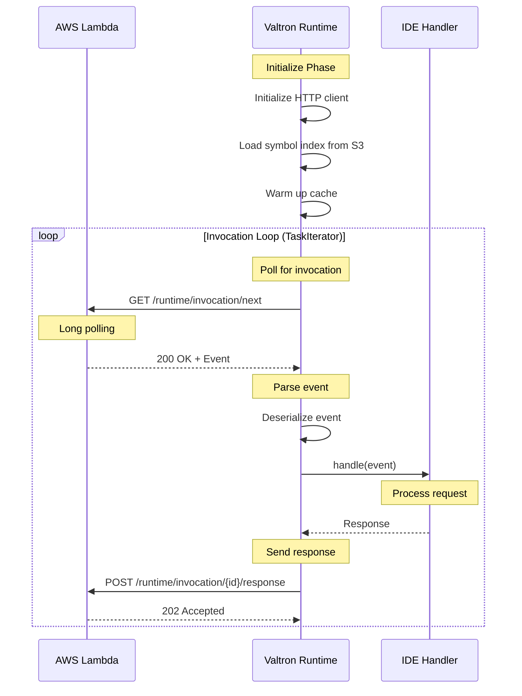

# Valtron Integration: Lambda Deployment for IDE Backends

## Overview

This guide covers deploying IDE backends to AWS Lambda using **Valtron TaskIterator** patterns instead of traditional async/await with `aws-lambda-rust-runtime`. This approach provides:

- **No tokio dependency** - Smaller binary, faster cold starts
- **Direct Lambda Runtime API** - Full control over invocation lifecycle
- **TaskIterator patterns** - Iterator-based async without async/await
- **IDE-specific optimizations** - Completion caching, incremental indexing

### Why Valtron for IDE Backends?

| Aspect | aws-lambda-rust-runtime | Valtron-Based |
|--------|------------------------|---------------|
| **Runtime** | Tokio-based async | TaskIterator |
| **Dependencies** | tokio, hyper, serde_json | Minimal HTTP |
| **Binary Size** | 8-12 MB | 2-4 MB |
| **Cold Start** | ~100-200ms | ~30-60ms |
| **Control** | Abstracted | Direct invocation control |

---

## 1. Lambda Runtime API

### 1.1 Core Endpoints

The Lambda Runtime API is available at `http://127.0.0.1:9001`:

#### `/runtime/invocation/next` (GET)

Long-polling endpoint for next invocation:

```http
GET /runtime/invocation/next HTTP/1.1
Host: 127.0.0.1:9001
User-Agent: IdeBackend/1.0
```

**Response:**
```http
HTTP/1.1 200 OK
Content-Type: application/json
Lambda-Runtime-Aws-Request-Id: af9c3624-3842-4d84-8c95-e0a8e7f6c4b5
Lambda-Runtime-Deadline-Ms: 1711564800000
Lambda-Runtime-Invoked-Function-Arn: arn:aws:lambda:us-east-1:123456789012:function:ide-backend
```

**Body (API Gateway v2 event):**
```json
{
  "version": "2.0",
  "routeKey": "POST /completion",
  "rawPath": "/completion",
  "headers": { "content-type": "application/json" },
  "body": "{\"file\":\"main.rs\",\"line\":10,\"column\":5}",
  "requestContext": {
    "http": { "method": "POST", "path": "/completion" },
    "requestId": "abc123"
  }
}
```

#### `/runtime/invocation/{request-id}/response` (POST)

Send response back to Lambda:

```http
POST /runtime/invocation/af9c3624-3842-4d84-8c95-e0a8e7f6c4b5/response HTTP/1.1
Host: 127.0.0.1:9001
Content-Type: application/json

{
  "statusCode": 200,
  "headers": { "content-type": "application/json" },
  "body": "{\"items\":[{\"label\":\"println\",\"kind\":3}]}"
}
```

### 1.2 Invocation Sequence



---

## 2. Valtron TaskIterator for Lambda

### 2.1 Invocation Task

```rust
use valtron::{TaskIterator, TaskStatus, NoSpawner};

/// Lambda invocation task
pub struct LambdaInvocationTask {
    runtime_api: String,
    request_id: Option<String>,
    state: InvocationState,
}

enum InvocationState {
    Pending,
    WaitingForInvocation,
    Processing(LambdaEvent),
    SendingResponse,
    Done(Result<LambdaResponse>),
}

struct LambdaEvent {
    request_id: String,
    deadline_ms: u64,
    body: serde_json::Value,
}

struct LambdaResponse {
    status_code: u16,
    headers: std::collections::HashMap<String, String>,
    body: String,
}

impl TaskIterator for LambdaInvocationTask {
    type Ready = Result<LambdaResponse>;
    type Pending = ();
    type Spawner = NoSpawner;

    fn next(&mut self) -> Option<TaskStatus<Self::Ready, Self::Pending, Self::Spawner>> {
        match self.state {
            InvocationState::Pending => {
                self.state = InvocationState::WaitingForInvocation;
                Some(TaskStatus::Pending { wakeup: () })
            }

            InvocationState::WaitingForInvocation => {
                // Poll Lambda Runtime API
                match self.poll_next_invocation() {
                    Ok(event) => {
                        self.request_id = Some(event.request_id.clone());
                        self.state = InvocationState::Processing(event);
                        Some(TaskStatus::Pending { wakeup: () })
                    }
                    Err(e) => {
                        self.state = InvocationState::Done(Err(e));
                        Some(TaskStatus::Pending { wakeup: () })
                    }
                }
            }

            InvocationState::Processing(ref event) => {
                // Process the event
                let event = event.clone();
                let response = self.handle_event(event);
                self.state = InvocationState::SendingResponse;
                Some(TaskStatus::Pending { wakeup: () })
            }

            InvocationState::SendingResponse => {
                // Send response to Lambda
                self.state = InvocationState::Done(Ok(LambdaResponse {
                    status_code: 200,
                    headers: std::collections::HashMap::new(),
                    body: "{}".to_string(),
                }));
                Some(TaskStatus::Pending { wakeup: () })
            }

            InvocationState::Done(ref result) => {
                Some(TaskStatus::Ready(result.clone()))
            }
        }
    }
}

impl LambdaInvocationTask {
    pub fn new(runtime_api: String) -> Self {
        Self {
            runtime_api,
            request_id: None,
            state: InvocationState::Pending,
        }
    }

    fn poll_next_invocation(&self) -> Result<LambdaEvent> {
        // HTTP GET to /runtime/invocation/next
        // Parse response headers and body
        // Return LambdaEvent
        unimplemented!()
    }

    fn handle_event(&self, event: LambdaEvent) -> Result<LambdaResponse> {
        // Route to appropriate handler
        unimplemented!()
    }

    fn send_response(&self, response: &LambdaResponse) -> Result<()> {
        // HTTP POST to /runtime/invocation/{request_id}/response
        unimplemented!()
    }
}
```

### 2.2 IDE Request Handler

```rust
/// IDE backend request types
#[derive(Debug, Clone, serde::Deserialize)]
#[serde(tag = "type")]
pub enum IdeRequest {
    #[serde(rename = "completion")]
    Completion {
        file: String,
        line: u32,
        column: u32,
    },
    #[serde(rename = "hover")]
    Hover {
        file: String,
        line: u32,
        column: u32,
    },
    #[serde(rename = "definition")]
    Definition {
        file: String,
        line: u32,
        column: u32,
    },
    #[serde(rename = "references")]
    References {
        file: String,
        line: u32,
        column: u32,
    },
}

/// IDE backend response types
#[derive(Debug, Clone, serde::Serialize)]
#[serde(tag = "type")]
pub enum IdeResponse {
    #[serde(rename = "completion")]
    Completion {
        items: Vec<CompletionItem>,
    },
    #[serde(rename = "hover")]
    Hover {
        contents: String,
        range: Option<Range>,
    },
    #[serde(rename = "definition")]
    Definition {
        locations: Vec<Location>,
    },
    #[serde(rename = "references")]
    References {
        locations: Vec<Location>,
    },
}

impl LambdaInvocationTask {
    fn handle_event(&self, event: LambdaEvent) -> Result<LambdaResponse> {
        // Parse API Gateway v2 event
        let body: IdeRequest = serde_json::from_str(&event.body["body"].as_str().unwrap_or("{}"))?;

        // Route to handler
        let response = match body {
            IdeRequest::Completion { file, line, column } => {
                let items = self.provide_completions(&file, line, column)?;
                IdeResponse::Completion { items }
            }
            IdeRequest::Hover { file, line, column } => {
                let hover = self.provide_hover(&file, line, column)?;
                IdeResponse::Hover {
                    contents: hover.contents,
                    range: hover.range,
                }
            }
            IdeRequest::Definition { file, line, column } => {
                let locations = self.find_definition(&file, line, column)?;
                IdeResponse::Definition { locations }
            }
            IdeRequest::References { file, line, column } => {
                let locations = self.find_references(&file, line, column)?;
                IdeResponse::References { locations }
            }
        };

        Ok(LambdaResponse {
            status_code: 200,
            headers: {
                let mut h = std::collections::HashMap::new();
                h.insert("content-type".to_string(), "application/json".to_string());
                h
            },
            body: serde_json::to_string(&response)?,
        })
    }

    fn provide_completions(&self, file: &str, line: u32, column: u32) -> Result<Vec<CompletionItem>> {
        // Completion logic
        Ok(Vec::new())
    }

    fn provide_hover(&self, file: &str, line: u32, column: u32) -> Result<HoverResult> {
        // Hover logic
        Ok(HoverResult {
            contents: "".to_string(),
            range: None,
        })
    }

    fn find_definition(&self, file: &str, line: u32, column: u32) -> Result<Vec<Location>> {
        // Definition logic
        Ok(Vec::new())
    }

    fn find_references(&self, file: &str, line: u32, column: u32) -> Result<Vec<Location>> {
        // References logic
        Ok(Vec::new())
    }
}
```

---

## 3. HTTP Client for Runtime API

### 3.1 Minimal HTTP Client (No tokio)

```rust
use std::io::{Read, Write};
use std::os::unix::net::UnixStream;

/// Minimal HTTP client for Lambda Runtime API
pub struct RuntimeApiClient {
    base_url: String,
}

impl RuntimeApiClient {
    pub fn new() -> Self {
        Self {
            base_url: "http://127.0.0.1:9001".to_string(),
        }
    }

    /// Get next invocation (long-polling)
    pub fn get_next_invocation(&self) -> Result<InvocationResponse> {
        // Using std::net::TcpStream for blocking HTTP
        use std::net::TcpStream;
        use std::time::Duration;

        let mut stream = TcpStream::connect("127.0.0.1:9001")?;
        stream.set_read_timeout(Some(Duration::from_secs(30)))?;

        // Send HTTP GET request
        let request = "GET /runtime/invocation/next HTTP/1.1\r\n\
                       Host: 127.0.0.1:9001\r\n\
                       User-Agent: IdeBackend/1.0\r\n\
                       Connection: close\r\n\
                       \r\n";

        stream.write_all(request.as_bytes())?;

        // Read response
        let mut response = Vec::new();
        stream.read_to_end(&mut response)?;

        self.parse_invocation_response(&response)
    }

    /// Send invocation response
    pub fn send_response(&self, request_id: &str, response: &LambdaResponse) -> Result<()> {
        use std::net::TcpStream;

        let mut stream = TcpStream::connect("127.0.0.1:9001")?;

        let body = serde_json::to_string(response)?;

        let request = format!(
            "POST /runtime/invocation/{}/response HTTP/1.1\r\n\
             Host: 127.0.0.1:9001\r\n\
             User-Agent: IdeBackend/1.0\r\n\
             Content-Type: application/json\r\n\
             Content-Length: {}\r\n\
             Connection: close\r\n\
             \r\n\
             {}",
            request_id,
            body.len(),
            body
        );

        stream.write_all(request.as_bytes())?;

        // Read response (should be 202)
        let mut response = [0u8; 256];
        stream.read(&mut response)?;

        Ok(())
    }

    fn parse_invocation_response(&self, data: &[u8]) -> Result<InvocationResponse> {
        // Parse HTTP response
        // Extract headers (Lambda-Runtime-Aws-Request-Id, Lambda-Runtime-Deadline-Ms)
        // Extract body

        let response_str = String::from_utf8_lossy(data);

        // Find headers
        let headers_end = response_str.find("\r\n\r\n").unwrap_or(0);
        let headers_str = &response_str[..headers_end];
        let body_str = &response_str[headers_end + 4..];

        // Parse headers
        let mut request_id = String::new();
        let mut deadline_ms = 0u64;

        for line in headers_str.lines() {
            if let Some((key, value)) = line.split_once(": ") {
                match key {
                    "Lambda-Runtime-Aws-Request-Id" => request_id = value.to_string(),
                    "Lambda-Runtime-Deadline-Ms" => deadline_ms = value.parse().unwrap_or(0),
                    _ => {}
                }
            }
        }

        Ok(InvocationResponse {
            request_id,
            deadline_ms,
            body: serde_json::from_str(body_str)?,
        })
    }
}

struct InvocationResponse {
    request_id: String,
    deadline_ms: u64,
    body: serde_json::Value,
}
```

---

## 4. IDE Backend Implementation

### 4.1 Main Entry Point

```rust
use valtron::Executor;

fn main() -> Result<(), Box<dyn std::error::Error>> {
    // Initialize IDE backend
    let index = load_symbol_index_from_s3()?;
    let cache = CompletionCache::new(10000);

    // Create executor
    let mut executor = Executor::new();

    // Spawn invocation loop
    loop {
        // Create invocation task
        let task = LambdaInvocationTask::new("http://127.0.0.1:9001".to_string());

        // Run task to completion (blocking)
        let result = run_task_to_completion(&mut executor, task);

        match result {
            Ok(_) => continue,
            Err(e) => {
                eprintln!("Invocation error: {:?}", e);
                // Continue to next invocation
            }
        }
    }
}

fn run_task_to_completion<T>(
    executor: &mut Executor,
    mut task: T,
) -> Result<T::Ready>
where
    T: TaskIterator<Spawner = NoSpawner>,
{
    loop {
        match task.next() {
            Some(TaskStatus::Ready(result)) => return Ok(result),
            Some(TaskStatus::Pending { .. }) => {
                // In a real implementation, we would wait for the wakeup signal
                // For Lambda, we just continue immediately
                continue;
            }
            None => break,
        }
    }
    unreachable!()
}
```

### 4.2 Symbol Index Loading from S3

```rust
/// Load symbol index from S3 (for cold start)
fn load_symbol_index_from_s3() -> Result<SymbolIndex> {
    use std::env;

    let bucket = env::var("INDEX_BUCKET")?;
    let key = env::var("INDEX_KEY").unwrap_or_else(|_| "symbol-index.bin".to_string());

    // Download from S3 using minimal HTTP (S3 REST API)
    let s3_client = S3Client::new();
    let data = s3_client.get_object(&bucket, &key)?;

    // Deserialize index
    let index = bincode::deserialize(&data)?;

    Ok(index)
}

/// Minimal S3 client
struct S3Client {
    region: String,
}

impl S3Client {
    fn new() -> Self {
        Self {
            region: std::env::var("AWS_REGION").unwrap_or_else(|_| "us-east-1".to_string()),
        }
    }

    fn get_object(&self, bucket: &str, key: &str) -> Result<Vec<u8>> {
        // S3 REST API call
        // In production, use aws-sdk-s3 or reqwest
        unimplemented!()
    }
}
```

---

## 5. Lambda Configuration

### 5.1 SAM Template

```yaml
AWSTemplateFormatVersion: '2010-09-09'
Transform: AWS::Serverless-2016-10-31

Resources:
  IdeBackendFunction:
    Type: AWS::Serverless::Function
    Properties:
      CodeUri: .
      Handler: bootstrap
      Runtime: provided.al2
      MemorySize: 1024
      Timeout: 29
      Environment:
        Variables:
          INDEX_BUCKET: !Ref IndexBucket
          INDEX_KEY: symbol-index.bin
      Events:
        ApiEvent:
          Type: Api
          Properties:
            Path: '/{proxy+}'
            Method: ANY

  IndexBucket:
    Type: AWS::S3::Bucket
    Properties:
      BucketName: ide-symbol-index

Outputs:
  ApiEndpoint:
    Description: API Gateway endpoint URL
    Value: !Sub "https://${ServerlessRestApi}.execute-api.${AWS::Region}.amazonaws.com/Prod/"
```

### 5.2 Build Script

```bash
#!/bin/bash
set -e

# Build for Lambda (ARM64)
cargo build --release --target aarch64-unknown-linux-gnu

# Copy binary to expected location
cp target/aarch64-unknown-linux-gnu/release/ide-backend bootstrap

# Create deployment package
zip -j lambda.zip bootstrap

echo "Build complete: lambda.zip"
```

### 5.3 Cargo.toml

```toml
[package]
name = "ide-backend-lambda"
version = "0.1.0"
edition = "2021"

[dependencies]
serde = { version = "1.0", features = ["derive"] }
serde_json = "1.0"
bincode = "1.3"
valtron = { path = "../../ewe_platform/backends/foundation_core/src/valtron" }

# NO tokio, NO async dependencies!

[profile.release]
opt-level = 3
lto = true
strip = true

[[bin]]
name = "bootstrap"
path = "src/main.rs"
```

---

## 6. Request/Response Types

### 6.1 API Gateway v2 Event

```rust
#[derive(Debug, Clone, serde::Deserialize)]
pub struct APIGatewayV2Event {
    pub version: String,
    pub route_key: String,
    pub raw_path: String,
    pub raw_query_string: Option<String>,

    #[serde(default)]
    pub cookies: Vec<String>,

    #[serde(default)]
    pub headers: std::collections::HashMap<String, String>,

    #[serde(default)]
    pub query_string_parameters: std::collections::HashMap<String, String>,

    pub request_context: APIGatewayV2RequestContext,

    #[serde(default)]
    pub body: Option<String>,

    #[serde(default)]
    pub is_base64_encoded: bool,
}

#[derive(Debug, Clone, serde::Deserialize)]
pub struct APIGatewayV2RequestContext {
    pub account_id: String,
    pub api_id: String,
    pub domain_name: String,
    pub http: RequestContextHttp,
    pub request_id: String,
    pub stage: String,
    pub time: String,
    pub time_epoch: u64,
}

#[derive(Debug, Clone, serde::Deserialize)]
pub struct RequestContextHttp {
    pub method: String,
    pub path: String,
    pub protocol: String,
    pub source_ip: String,
}
```

### 6.2 Lambda-Compatible Response

```rust
#[derive(Debug, Clone, serde::Serialize)]
pub struct APIGatewayV2Response {
    pub status_code: u16,

    #[serde(skip_serializing_if = "std::collections::HashMap::is_empty")]
    pub headers: std::collections::HashMap<String, String>,

    #[serde(skip_serializing_if = "Option::is_none")]
    pub body: Option<String>,

    #[serde(skip_serializing_if = "Option::is_none")]
    pub is_base64_encoded: Option<bool>,
}

impl APIGatewayV2Response {
    pub fn json<T: serde::Serialize>(body: &T) -> Result<Self> {
        Ok(Self {
            status_code: 200,
            headers: {
                let mut h = std::collections::HashMap::new();
                h.insert("content-type".to_string(), "application/json".to_string());
                h
            },
            body: Some(serde_json::to_string(body)?),
            is_base64_encoded: Some(false),
        })
    }

    pub fn error(status_code: u16, message: &str) -> Self {
        Self {
            status_code,
            headers: std::collections::HashMap::new(),
            body: Some(format!(r#"{{"error":"{}"}}"#, message)),
            is_base64_encoded: None,
        }
    }
}
```

---

## 7. Performance Considerations

### 7.1 Cold Start Optimization

```rust
/// Pre-initialized state for fast cold starts
pub struct WarmState {
    /// Pre-loaded symbol index
    index: SymbolIndex,

    /// Pre-warmed completion cache
    cache: CompletionCache,

    /// HTTP client (reused)
    http_client: RuntimeApiClient,
}

impl WarmState {
    pub fn new() -> Result<Self> {
        Ok(Self {
            index: load_symbol_index_from_s3()?,
            cache: CompletionCache::new(10000),
            http_client: RuntimeApiClient::new(),
        })
    }
}

/// Global state (initialized once per container)
static mut WARM_STATE: Option<WarmState> = None;

fn get_warm_state() -> &'static WarmState {
    unsafe {
        if WARM_STATE.is_none() {
            WARM_STATE = Some(WarmState::new().unwrap());
        }
        WARM_STATE.as_ref().unwrap()
    }
}
```

### 7.2 Memory Management

```rust
/// Memory-bounded workspace for Lambda
pub struct LambdaWorkspace {
    /// Bounded symbol index
    index: BoundedIndex,

    /// Maximum memory (Lambda memory size - safety margin)
    max_memory: usize,
}

impl LambdaWorkspace {
    pub fn new(memory_mb: usize) -> Self {
        // Use 80% of allocated memory
        let max_memory = (memory_mb * 1024 * 1024 * 80) / 100;

        Self {
            index: BoundedIndex::new(max_memory / 2),
            max_memory,
        }
    }

    pub fn get_index(&mut self) -> &mut BoundedIndex {
        &mut self.index
    }
}
```

---

## 8. Testing

### 8.1 Local Testing

```rust
#[cfg(test)]
mod tests {
    use super::*;

    #[test]
    fn test_completion_handler() {
        let task = LambdaInvocationTask::new("http://127.0.0.1:9001".to_string());

        // Mock event
        let event = LambdaEvent {
            request_id: "test-123".to_string(),
            deadline_ms: 9999999999999,
            body: serde_json::json!({
                "body": r#"{"type":"completion","file":"main.rs","line":10,"column":5}"#
            }),
        };

        // Test handler
        // (Would need to mock the full task execution)
    }
}
```

### 8.2 SAM Local Testing

```bash
# Test locally with SAM
sam local start-api --template template.yaml

# Invoke function directly
sam local invoke IdeBackendFunction --event test-event.json
```

---

## 9. Deployment Checklist

- [ ] Build for ARM64 (Lambda Graviton2)
- [ ] Enable LTO and strip for smaller binary
- [ ] Configure memory size (1024MB recommended)
- [ ] Set timeout to 29 seconds (API Gateway limit)
- [ ] Upload symbol index to S3
- [ ] Configure environment variables
- [ ] Set up CloudWatch alarms
- [ ] Enable X-Ray tracing (optional)

---

*This completes the rockies comprehensive exploration.*
