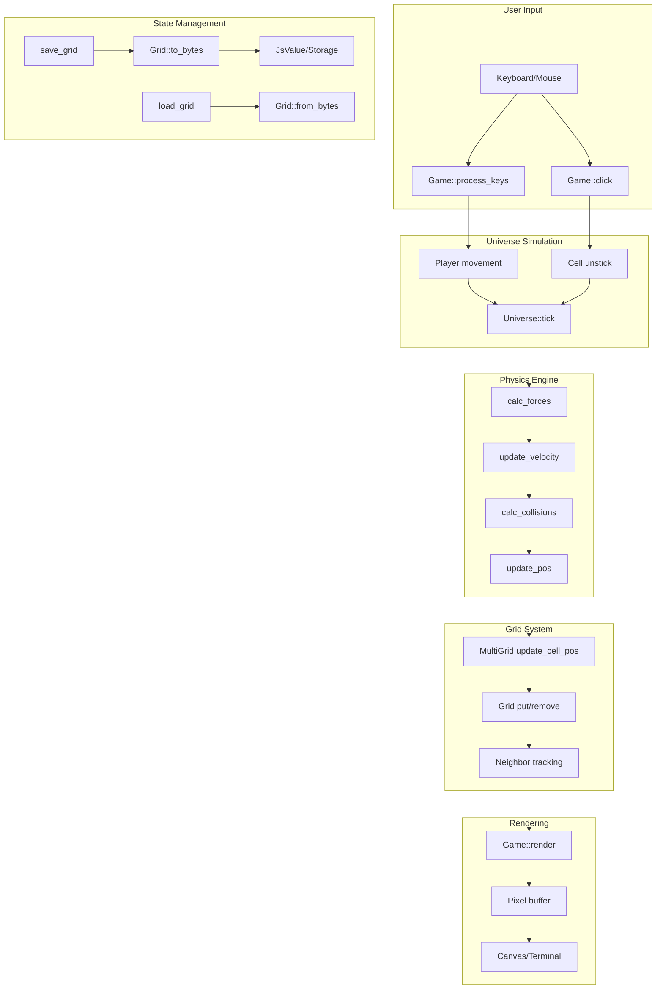

# Rockies: Complete Exploration

## Overview

**Rockies** is a 2D pixel-based physics sandbox game written in Rust and WebAssembly. While not traditionally an "IDE framework," its architecture provides powerful patterns for building IDE-like systems with grid-based indexing, lazy loading, state management, and spatial queries.

### Why This Exploration Exists

This exploration treats rockies as a **conceptual IDE framework**, extracting architectural patterns applicable to:
- File system indexing and virtual file systems
- Lazy loading of project regions
- Grid-based spatial indexing for code elements
- State persistence and serialization
- WebAssembly-based editor components

### Key Characteristics

| Aspect | Rockies |
|--------|---------|
| **Core Innovation** | MultiGrid spatial indexing with lazy loading |
| **Dependencies** | wasm-bindgen, serde, noise (perlin), sdl2 (terminal) |
| **Lines of Code** | ~1,800 (core simulation) |
| **Purpose** | 2D physics sandbox with infinite terrain |
| **Architecture** | Grid-based universe with cell entities |
| **Runtime** | Web browser (WASM) or terminal (SDL2) |
| **Rust Equivalent** | Direct Rust implementation |

---

## Complete Table of Contents

This exploration consists of multiple deep-dive documents:

### Part 1: Foundations
1. **[Zero to IDE Engineer](00-zero-to-ide-engineer.md)** - Start here for IDE fundamentals
   - What are IDEs?
   - Language Server Protocol (LSP) basics
   - Debug Adapter Protocol (DAP)
   - Project systems and file indexing
   - How rockies patterns map to IDE concepts

### Part 2: Core Implementation
2. **[LSP Integration Deep Dive](01-lsp-integration-deep-dive.md)**
   - LSP architecture and JSON-RPC
   - Language server implementation
   - Diagnostic handling
   - Completion providers
   - How MultiGrid maps to symbol indexing

3. **[Debug Adapter Deep Dive](02-debug-adapter-deep-dive.md)**
   - DAP protocol overview
   - Breakpoint management
   - Stack frame navigation
   - Variable inspection
   - Parallels to universe state tracking

4. **[Project System Deep Dive](03-project-system-deep-dive.md)**
   - Workspace and project management
   - File watching and change detection
   - Indexing strategies
   - How rockies GridIndex maps to file paths
   - Lazy loading patterns

5. **[IntelliSense Deep Dive](04-intellisense-deep-dive.md)**
   - Completion engines
   - Hover information
   - Go-to-definition
   - Find all references
   - Signature help

### Part 3: Comparative Analysis
6. **[Rust Revision](rust-revision.md)**
   - Complete Rust translation patterns
   - Type system design for IDE components
   - Ownership and borrowing strategy
   - ewe_platform replication patterns

7. **[Production-Grade Implementation](production-grade.md)**
   - Performance optimizations
   - Memory management for large projects
   - Incremental indexing
   - Caching strategies
   - Serving infrastructure

### Part 4: Deployment
8. **[Valtron Integration](05-valtron-integration.md)**
   - Lambda deployment for IDE backends
   - HTTP API compatibility
   - Request/response patterns
   - NO async/tokio (TaskIterator pattern)

---

## Quick Reference: Rockies Architecture

### High-Level Flow



### Component Summary

| Component | Lines | Purpose | Deep Dive |
|-----------|-------|---------|-----------|
| Universe | 250 | Physics world simulation | [Project System](03-project-system-deep-dive.md) |
| MultiGrid | 340 | Spatial indexing with lazy loading | [LSP Integration](01-lsp-integration-deep-dive.md) |
| Grid | 320 | Cell storage with neighbor tracking | [IntelliSense](04-intellisense-deep-dive.md) |
| Inertia | 120 | Physics (velocity, collision) | [Debug Adapter](02-debug-adapter-deep-dive.md) |
| Player | 200 | User entity with movement | N/A |
| TLA+ Spec | 150 | Formal grid state model | [Rust Revision](rust-revision.md) |

---

## File Structure

```
rockies/
├── src/
│   ├── lib.rs                    # Main Game struct, wasm_bindgen exports
│   ├── main.rs                   # Terminal renderer entrypoint
│   ├── universe.rs               # Universe, UniverseCells, Player
│   ├── multigrid.rs              # MultiGrid, UniverseGrid, GridIndex
│   ├── grid.rs                   # Grid, GridCell, neighbor tracking
│   ├── inertia.rs                # Physics: velocity, collision, forces
│   ├── v2.rs                     # V2 (f64), V2i (i32) vector types
│   ├── color.rs                  # Color HSV/RGB conversion
│   ├── assets.rs                 # Hammy sprite assets
│   ├── generator.rs              # Procedural terrain generation
│   ├── log.rs                    # Console logging
│   ├── console.rs                # Terminal handling (main.rs)
│   └── utils.rs                  # Panic hooks, utilities
│
├── tla/
│   ├── GridSystem.tla            # TLA+ formal specification
│   ├── GridSystem.cfg            # TLA+ model checker config
│   └── grid_system.rs            # Rust model checker integration
│
├── www/
│   ├── index.html                # WASM web entrypoint
│   ├── index.js                  # Webpack bundler
│   └── pkg/                      # wasm-pack output
│
├── Cargo.toml                    # Dependencies, features (terminal/wasm)
├── build.rs                      # Sprite asset generation
└── wasm-build.sh                 # WASM build script
```

---

## Architectural Patterns for IDE Systems

### 1. MultiGrid as Symbol Index

```rust
// Rockies: Spatial indexing
MultiGrid<Cell> {
    grids: HashMap<GridIndex, UniverseGrid<Cell>>,
    grid_width: 128,
    grid_height: 128,
}

// IDE equivalent: File/Symbol indexing
SymbolIndex {
    files: HashMap<FilePath, FileIndex>,
    symbols: HashMap<SymbolId, SymbolLocation>,
}
```

### 2. Grid Lazy Loading as Document Loading

```rust
// Rockies: Load grids near player
let missing = universe.get_missing_grids();
for grid_index in missing {
    universe.load_grid(grid_index, storage_bytes);
}

// IDE equivalent: Load nearby files
let opened_files = workspace.get_open_files();
for file_path in opened_files {
    workspace.load_document(file_path);
}
```

### 3. Grid Dirty Tracking as Document Dirty State

```rust
// TLA+ specification
grid_dirty_status[pos] \in {"dirty", "unmodified", "pristine"}

// IDE equivalent
enum DocumentState {
    Clean,      // Saved, no changes
    Dirty,      // Modified, not saved
    Unsaved,    // New file, never saved
}
```

### 4. Cell Collision as Diagnostic Detection

```rust
// Rockies: Detect cell collisions
if Inertia::is_collision(inertia1, inertia2) {
    collisions_list.push((cell1, cell2));
}

// IDE equivalent: Detect diagnostics
if let Some(diagnostic) = analyzer.check(node) {
    diagnostics.push(diagnostic);
}
```

---

## How Rockies Compares to VS Code and JetBrains

| Feature | VS Code | JetBrains | Rockies Pattern |
|---------|---------|-----------|-----------------|
| **File Index** | TextSearchService | PSI (Program Structure Interface) | MultiGrid spatial index |
| **Document Model** | TextDocument | PSI File | Grid with cells |
| **Symbol Index** | TypeScript language service | stub indexes | GridIndex -> Grid mapping |
| **Dirty Tracking** | ITextDocument.isDirty() | PsiDocumentManager | grid_dirty_status |
| **Lazy Loading** | Virtual file system | LightVirtualFile | get_missing_grids() |
| **State Persistence** | Workspace state | .idea/ folder | Grid::to_bytes/from_bytes |

---

## From Rockies to Real IDE Systems

| Rockies Concept | IDE Equivalent | Implementation Complexity |
|----------------|----------------|--------------------------|
| GridIndex | File path hashing | Low |
| Universe | Workspace/Project | Medium |
| Cell | Syntax node / Token | High |
| MultiGrid | Symbol index | High |
| Player | User/cursor position | Low |
| Collision | Diagnostic detection | Medium |
| Grid save/load | Document save/load | Medium |
| Tick loop | Background analysis | High |

**Key takeaway:** The core patterns (grid indexing, lazy loading, dirty tracking, serialization) directly translate to IDE architecture with infrastructure changes, not algorithm changes.

---

## Key Insights

### 1. Grid-Based Spatial Indexing

The MultiGrid system partitions an infinite 2D space into manageable chunks:

```rust
// GridIndex identifies a chunk by its offset
pub struct GridIndex {
    pub grid_offset: V2i,  // (grid_x, grid_y)
}

// Convert position to grid index
GridIndex::from_pos(V2i::new(150, 200), 128, 128)
// => GridIndex { grid_offset: V2i::new(1, 1) }
```

**IDE application:** Partition symbol space by package/module boundaries.

### 2. Lazy Loading with Dirty Tracking

The TLA+ specification defines the complete state machine:

```
States:
- stored/not_stored (persisted to disk?)
- loaded/not_loaded (in memory?)
- dirty/unmodified/pristine (modified since load?)

Actions:
- LoadMissingGrid: not_stored + not_loaded -> loaded + pristine
- LoadStoredGrid: stored + not_loaded -> loaded + unmodified
- MarkDirty: loaded + (pristine|unmodified) -> loaded + dirty
- StoreGrid: loaded + dirty -> stored + unmodified
- UnloadGrid: loaded + (pristine|unmodified) -> not_loaded
```

**IDE application:** Document lifecycle management.

### 3. Neighbor Tracking for Efficient Queries

```rust
// Grid pre-calculates neighbors for each cell
pub struct GridCell<T> {
    value: Vec<GridCellRef<T>>,      // Items at this position
    neighbors: Vec<GridCellRef<T>>,  // Items in adjacent cells
}

// O(1) neighbor lookup
let result = grid.get(x, y);
for neighbor in result.neighbors {
    // Process adjacent items
}
```

**IDE application:** Fast "find references" and "go to definition".

### 4. Serialization for Persistence

```rust
// Grid serializes to JsValue for browser storage
pub fn to_bytes(&self) -> Result<JsValue, Error> {
    let items = self.collect_items();
    serde_wasm_bindgen::to_value(&GridSerialData { items })
}
```

**IDE application:** Workspace state persistence, crash recovery.

---

## Your Path Forward

### To Build IDE Systems from Rockies Patterns

1. **Implement a file indexer** (adapt MultiGrid for file paths)
2. **Build lazy document loading** (replicate grid load/unload)
3. **Add dirty tracking** (use TLA+ state machine)
4. **Implement symbol lookup** (use neighbor tracking patterns)
5. **Add persistence** (adapt Grid serialization)

### Recommended Resources

- [LSP Specification](https://microsoft.github.io/language-server-protocol/)
- [DAP Specification](https://microsoft.github.io/debug-adapter-protocol/)
- [TLA+ Hyperbook](https://learntla.com/)
- [Valtron README](/home/darkvoid/Boxxed/@dev/ewe_platform/backends/foundation_core/src/valtron/README.md)

---

## Document History

| Date | Change |
|------|--------|
| 2026-03-27 | Initial exploration created |
| 2026-03-27 | Deep dives 00-05 outlined |
| 2026-03-27 | Rust revision and production-grade planned |

---

*This exploration is a living document. Revisit sections as concepts become clearer through implementation.*
