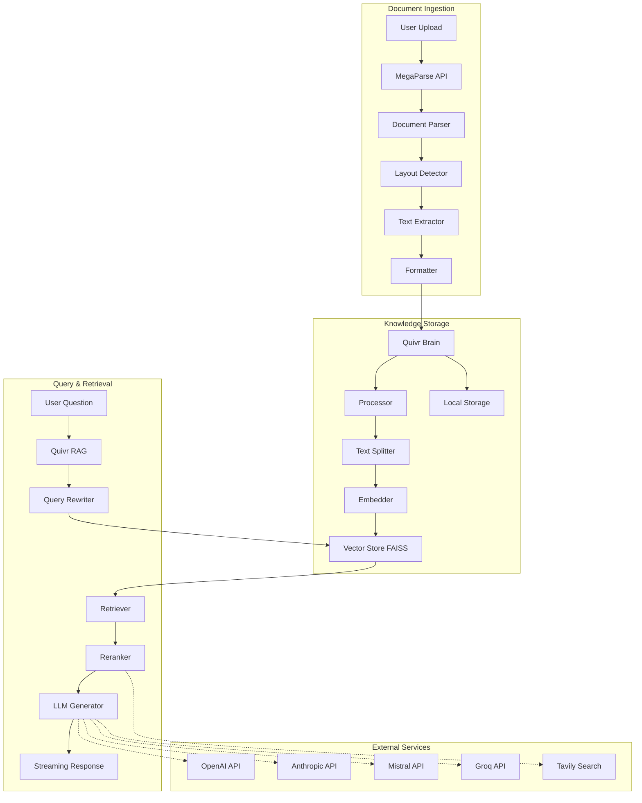
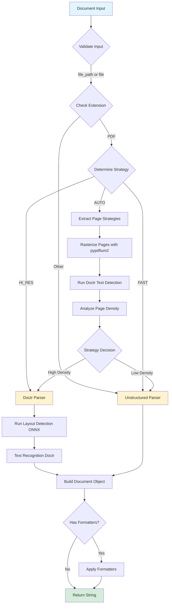
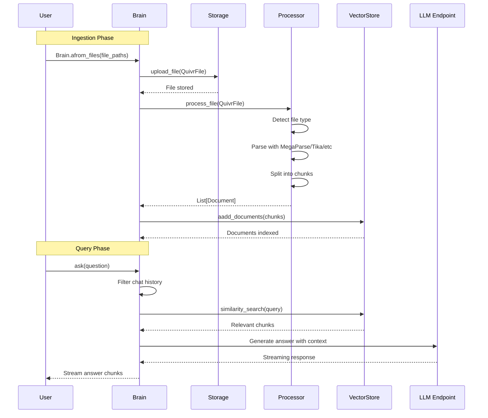
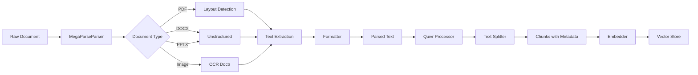
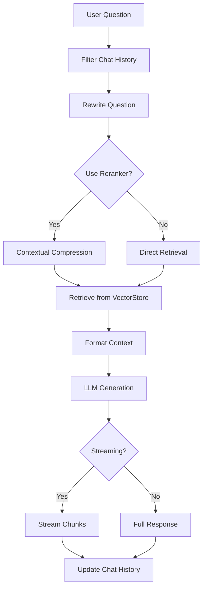

# Project Exploration: DataParsing (MegaParse & quivr)

## Overview

This directory contains two complementary Python projects focused on document parsing and knowledge management:

**MegaParse** is a powerful document parsing library designed to handle various document types (PDF, DOCX, PPTX, images, spreadsheets) with minimal information loss. It employs multiple parsing strategies including OCR, layout detection, and vision-based parsing to extract text, tables, headers, footers, and other content from documents. The library supports both synchronous and asynchronous parsing, with configurable strategies for balancing speed versus accuracy.

**quivr** (pronounced "key-vr") is a knowledge management system built on RAG (Retrieval-Augmented Generation) principles. It provides a "Brain" abstraction for storing files, processing them into chunks, embedding them in vector stores, and retrieving relevant information to answer questions. Quivr integrates tightly with MegaParse for document ingestion and supports multiple LLM providers (OpenAI, Anthropic, Mistral, Groq, Gemini) for generation.

Together, these projects form a complete pipeline: MegaParse handles document ingestion and text extraction, while quivr manages knowledge storage, retrieval, and AI-powered Q&A.

## Repository

- **Location:** `/home/darkvoid/Boxxed/@formulas/src.DataParsing`
- **Remote:** N/A - not a git repository
- **Primary Language:** Python (requires >= 3.11)
- **License:** MIT (detected in MegaParse)

## Directory Structure

```
/home/darkvoid/Boxxed/@formulas/src.DataParsing/
├── MegaParse/                          # Document parsing library
│   ├── .aws/                           # AWS deployment configuration
│   │   └── task_definition.json        # ECS task definition
│   ├── .github/workflows/              # CI/CD pipelines
│   │   ├── CI.yml                      # Continuous integration
│   │   ├── build-and-deploy.yml        # Docker build and deployment
│   │   ├── build-gpu.yml               # GPU-enabled build
│   │   ├── release-please.yml          # Automated releases
│   │   └── test-build-docker.yml       # Docker build tests
│   ├── .vscode/                        # VS Code settings
│   ├── benchmark/                      # Performance benchmarking
│   │   ├── process_single_doc.py       # Single document processing benchmark
│   │   └── test_quality_sim.py         # Quality similarity testing
│   ├── evaluations/                    # Quality evaluation scripts
│   │   └── script.py                   # Benchmark comparison script
│   ├── images/                         # Documentation images
│   │   └── tables.png                  # Table parsing examples
│   ├── docs/                           # Documentation files
│   │   └── archive.txt                 # Archived documentation
│   ├── libs/                           # Core library directories
│   │   ├── megaparse/                  # Main megaparse library
│   │   │   ├── src/megaparse/          # Source code
│   │   │   │   ├── api/                # FastAPI REST API
│   │   │   │   │   ├── app.py          # Main API application
│   │   │   │   │   ├── models/         # API request/response models
│   │   │   │   │   └── exceptions/     # API exception handlers
│   │   │   │   ├── configs/            # Configuration classes
│   │   │   │   │   └── auto.py         # Auto-strategy configuration
│   │   │   │   ├── exceptions/         # Custom exceptions
│   │   │   │   │   └── base.py         # Base exception classes
│   │   │   │   ├── formatter/          # Output formatters
│   │   │   │   │   ├── base.py         # Base formatter interface
│   │   │   │   │   ├── structured_formatter/  # Structured output
│   │   │   │   │   └── table_formatter/       # Table to markdown
│   │   │   │   ├── layout_detection/   # Document layout detection
│   │   │   │   │   ├── layout_detector.py  # ONNX-based detector
│   │   │   │   │   ├── output.py       # Detection output types
│   │   │   │   │   └── models/         # Pre-trained ONNX models
│   │   │   │   ├── models/             # Data models
│   │   │   │   │   └── page.py         # Page representation
│   │   │   │   ├── parser/             # Parser implementations
│   │   │   │   │   ├── base.py         # Base parser interface
│   │   │   │   │   ├── builder.py      # Parser builder factory
│   │   │   │   │   ├── doctr_parser.py # Doctr OCR parser
│   │   │   │   │   ├── entity.py       # Parser entities
│   │   │   │   │   ├── llama.py        # LlamaParse integration
│   │   │   │   │   ├── megaparse_vision.py  # Vision-based parsing
│   │   │   │   │   └── unstructured_parser.py  # Unstructured.io parser
│   │   │   │   ├── utils/              # Utilities
│   │   │   │   └── megaparse.py        # Main MegaParse class
│   │   │   ├── examples/               # Usage examples
│   │   │   │   ├── parse_file.py       # Basic parsing example
│   │   │   │   └── parsing_process.py  # Process walkthrough
│   │   │   ├── tests/                  # Test files
│   │   │   └── pyproject.toml          # Package configuration
│   │   └── megaparse_sdk/              # SDK for MegaParse
│   │       ├── megaparse_sdk/
│   │       │   ├── endpoints/          # API endpoints
│   │       │   ├── schema/             # Pydantic schemas
│   │       │   └── utils/              # Utilities
│   │       ├── tests/
│   │       └── pyproject.toml
│   ├── benchmark/                      # Root benchmark files
│   ├── evaluations/                    # Root evaluation files
│   ├── .env.example                    # Example environment variables
│   ├── .flake8                         # Flake8 configuration
│   ├── .gitattributes                  # Git attributes
│   ├── .gitignore                      # Git ignore patterns
│   ├── .pre-commit-config.yaml         # Pre-commit hooks
│   ├── .python-version                 # Python version (3.11)
│   ├── .release-please-manifest.json   # Release manifest
│   ├── CHANGELOG.md                    # Project changelog
│   ├── Dockerfile                      # Standard Docker image
│   ├── Dockerfile.gpu                  # GPU-enabled Docker image
│   ├── LICENSE                         # MIT License
│   ├── Makefile                        # Build commands
│   ├── Pipfile                         # Pipfile dependencies
│   ├── pyproject.toml                  # Root project configuration
│   ├── requirements-dev.lock           # Dev dependencies lock
│   ├── requirements.lock               # Production dependencies lock
│   ├── docker-compose.yml              # Docker Compose config
│   └── docker-compose.dev.yml          # Development Docker Compose
│
└── quivr/                              # Knowledge management system
    ├── .github/
    │   ├── ISSUE_TEMPLATE/             # Issue templates
    │   │   ├── EXTERNAL_ISSUE_TEMPLATE.yml
    │   │   ├── EXTERNAL_USER_FEATURE_REQUEST.yml
    │   │   ├── INTERNAL_EPIC_TEMPLATE.yml
    │   │   ├── INTERNAL_USER_STORY_TEMPLATE.yml
    │   │   └── config.yml
    │   └── workflows/                  # CI/CD workflows
    │       ├── backend-core-tests.yml  # Backend test workflow
    │       ├── conventional-pr-title.yml
    │       ├── release-please-core.yml
    │       └── stale.yml
    ├── .vscode/                        # VS Code settings
    ├── core/                           # Core quivr library
    │   ├── example_workflows/          # Example RAG workflows
    │   │   └── talk_to_file_rag_config_workflow.yaml
    │   ├── quivr_core/                 # Main source code
    │   │   ├── brain/                  # Brain abstraction
    │   │   │   ├── brain.py            # Main Brain class
    │   │   │   ├── brain_defaults.py   # Default configurations
    │   │   │   ├── info.py             # Brain info/metadata
    │   │   │   └── serialization.py    # Brain serialization
    │   │   ├── files/                  # File handling
    │   │   │   ├── file.py             # QuivrFile class
    │   │   │   └── __init__.py
    │   │   ├── language/               # Language utilities
    │   │   │   ├── models.py           # Language models
    │   │   │   └── utils.py            # Language detection
    │   │   ├── llm/                    # LLM integration
    │   │   │   ├── __init__.py
    │   │   │   └── llm_endpoint.py     # LLM endpoint abstraction
    │   │   ├── llm_tools/              # LLM tools
    │   │   │   ├── llm_tools.py        # Tool factory
    │   │   │   ├── web_search_tools.py # Web search tools
    │   │   │   ├── other_tools.py      # Other utilities
    │   │   │   └── entity.py           # Tool entities
    │   │   ├── processor/              # Document processors
    │   │   │   ├── processor_base.py   # Base processor class
    │   │   │   ├── registry.py         # Processor registry
    │   │   │   ├── splitter.py         # Text splitting
    │   │   │   └── implementations/    # Processor implementations
    │   │   │       ├── default.py              # Default processor
    │   │   │       ├── megaparse_processor.py  # MegaParse integration
    │   │   │       ├── simple_txt_processor.py # TXT processor
    │   │   │       └── tika_processor.py       # Apache Tika processor
    │   │   ├── rag/                    # RAG implementation
    │   │   │   ├── quivr_rag.py        # Basic RAG pipeline
    │   │   │   ├── quivr_rag_langgraph.py  # LangGraph RAG
    │   │   │   ├── prompts.py          # RAG prompts
    │   │   │   ├── utils.py            # RAG utilities
    │   │   │   └── entities/           # RAG entities
    │   │   │       ├── config.py       # Configuration classes
    │   │   │       ├── models.py       # Data models
    │   │   │       └── chat.py         # Chat history
    │   │   ├── storage/                # Storage backends
    │   │   │   ├── storage_base.py     # Base storage class
    │   │   │   ├── local_storage.py    # Local disk storage
    │   │   │   └── file.py             # Storage file handling
    │   │   ├── base_config.py          # Base configuration
    │   │   ├── config.py               # Main configuration
    │   │   └── __init__.py
    │   ├── scripts/                    # Utility scripts
    │   │   ├── run_tests.sh
    │   │   └── run_tests_buildx.sh
    │   └── tests/                      # Test suite
    │       └── processor/              # Processor tests
    │           ├── community/          # Community processors
    │           ├── data/               # Test data files
    │           ├── docx/               # DOCX tests
    │           ├── epub/               # EPUB tests
    │           ├── odt/                # ODT tests
    │           └── pdf/                # PDF tests
    ├── docs/                           # Documentation site
    │   ├── docs/                       # Documentation content
    │   │   ├── brain/                  # Brain documentation
    │   │   ├── config/                 # Configuration docs
    │   │   ├── css/                    # Stylesheets
    │   │   ├── examples/               # Example documentation
    │   │   ├── parsers/                # Parser documentation
    │   │   ├── storage/                # Storage documentation
    │   │   ├── vectorstores/           # Vector store docs
    │   │   └── workflows/              # Workflow documentation
    │   ├── overrides/                  # MkDocs overrides
    │   └── src/                        # Documentation source
    ├── examples/                       # Example applications
    │   ├── chatbot/                    # Chatbot example
    │   ├── chatbot_voice/              # Voice chatbot
    │   ├── simple_question/            # Simple Q&A example
    │   └── quivr-whisper/              # Whisper integration
    ├── pyproject.toml                  # Project configuration
    └── README.md                       # Project readme
```

## Architecture

### High-Level System Architecture



### MegaParse Document Parsing Pipeline



### Quivr Knowledge Ingestion and Retrieval Flow



## Component Breakdown

### MegaParse Components

#### Main MegaParse Class
- **Location:** `libs/megaparse/src/megaparse/megaparse.py`
- **Purpose:** Central orchestrator for document parsing
- **Dependencies:** pypdfium2, doctr, unstructured, layout detection model
- **Dependents:** API endpoints, SDK clients, quivr MegaparseProcessor

**Key Methods:**
- `load()` / `aload()` - Main parsing entry points
- `validate_input()` - Input validation
- `extract_page_strategies()` - Determines per-page parsing strategy
- `determine_global_strategy()` - Decides between FAST and HI_RES modes

#### Layout Detector
- **Location:** `libs/megaparse/src/megaparse/layout_detection/layout_detector.py`
- **Purpose:** Detects document structure elements (tables, headers, images, etc.)
- **Model:** YOLOv10s-doclaynet (ONNX format)
- **Labels:** Caption, Footnote, Formula, List-item, Page-footer, Page-header, Picture, Section-header, Table, Text, Title

**Configuration:**
```python
TextDetConfig:
  - det_arch: "fast_base"
  - batch_size: 2
  - assume_straight_pages: True
  - preserve_aspect_ratio: True

TextRecoConfig:
  - reco_arch: "crnn_vgg16_bn"
  - batch_size: 512

AutoStrategyConfig:
  - page_threshold: 0.6
  - document_threshold: 0.2
```

#### Parser Implementations
- **Location:** `libs/megaparse/src/megaparse/parser/`

| Parser | File | Purpose |
|--------|------|---------|
| BaseParser | base.py | Abstract base class for all parsers |
| DoctrParser | doctr_parser.py | OCR-based parsing using doctr |
| UnstructuredParser | unstructured_parser.py | Integration with unstructured.io |
| LlamaParser | llama.py | LlamaParse cloud service integration |
| MegaParseVision | megaparse_vision.py | Vision-based parsing with LLMs |

#### Formatters
- **Location:** `libs/megaparse/src/megaparse/formatter/`
- **Purpose:** Post-process parsed documents to improve output quality

| Formatter | Purpose |
|-----------|---------|
| BaseFormatter | Abstract base for formatters |
| TableFormatter | Convert HTML tables to markdown |
| VisionTableFormatter | LLM-based table formatting |
| StructuredFormatter | Custom structured output |

#### REST API
- **Location:** `libs/megaparse/src/megaparse/api/app.py`
- **Framework:** FastAPI
- **Endpoints:**
  - `POST /v1/file` - Parse uploaded file
  - `POST /v1/url` - Parse URL (PDF or website)
  - `GET /healthz` - Health check

### Quivr Components

#### Brain Class
- **Location:** `core/quivr_core/brain/brain.py`
- **Purpose:** Central abstraction for knowledge management
- **Key Features:**
  - File storage management
  - Document processing and chunking
  - Vector store integration (default: FAISS)
  - Chat history management
  - RAG-based Q&A

**Key Methods:**
- `afrom_files()` - Create brain from file paths
- `save()` / `load()` - Serialize/deserialize brain
- `asearch()` - Search for relevant documents
- `ask()` / `ask_streaming()` - Q&A with streaming

#### Processor System
- **Location:** `core/quivr_core/processor/`

| Processor | Supported Extensions | Source |
|-----------|---------------------|--------|
| MegaparseProcessor | PDF, DOCX, PPTX, XLS, XLSX, CSV, EPUB, ODT, HTML, MD, TXT | megaparse library |
| SimpleTxtProcessor | TXT | Built-in |
| TikaProcessor | Multiple | Apache Tika |
| DefaultProcessor | Various | Community implementations |

**Processor Flow:**
```python
QuivrFile -> Processor.check_supported()
           -> Processor.process_file_inner()
           -> Text Splitting (RecursiveCharacterTextSplitter)
           -> Metadata Enrichment (language detection, chunk index)
           -> List[Document]
```

#### RAG Pipeline
- **Location:** `core/quivr_core/rag/`

| Component | File | Purpose |
|-----------|------|---------|
| QuivrQARAG | quivr_rag.py | Basic RAG implementation |
| QuivrQARAGLangGraph | quivr_rag_langgraph.py | LangGraph-based RAG |
| prompts.py | prompts.py | System prompts for RAG |
| entities/config.py | config.py | Configuration classes |

**Retrieval Configuration:**
```python
RetrievalConfig:
  - max_history: 10           # Chat history pairs
  - max_files: 20             # Max files in context
  - k: 40                     # Chunks from retriever
  - reranker_config          # Re-ranking settings
  - llm_config               # LLM configuration
  - workflow_config          # LangGraph workflow
```

#### Storage System
- **Location:** `core/quivr_core/storage/`

| Storage | Purpose |
|---------|---------|
| LocalStorage | Store files on disk (~/.cache/quivr/files) |
| TransparentStorage | In-memory file tracking without copying |

#### LLM Integration
- **Location:** `core/quivr_core/llm/`
- **Supported Suppliers:**
  - OpenAI (gpt-4o, gpt-4-turbo, gpt-4, gpt-3.5-turbo, o1, o3-mini)
  - Anthropic (claude-3-5-sonnet, claude-3-opus, claude-3-haiku)
  - Mistral (mistral-large, mistral-small, mistral-nemo)
  - Groq (llama-3.1-70b, llama-3.3-70b)
  - Gemini (gemini-2.5)

## Entry Points

### MegaParse

#### Library Usage
```python
from megaparse import MegaParse

megaparse = MegaParse()
result = megaparse.load("./document.pdf")
print(result)
```

#### Async Usage
```python
from megaparse import MegaParse

megaparse = MegaParse()
result = await megaparse.aload(file=file_stream, file_extension=".pdf")
```

#### Vision Parser
```python
from megaparse.parser.megaparse_vision import MegaParseVision
from langchain_openai import ChatOpenAI

model = ChatOpenAI(model="gpt-4o")
parser = MegaParseVision(model=model)
result = parser.convert("./document.pdf")
```

#### API Server
```bash
make dev
# Starts uvicorn on localhost:8000
# Docs available at localhost:8000/docs
```

#### Docker
```bash
docker-compose up
# Starts MegaParse API on port 8000
```

### Quivr

#### Create Brain from Files
```python
from quivr_core import Brain

brain = await Brain.afrom_files(
    name="My Brain",
    file_paths=["doc1.pdf", "doc2.docx"],
    skip_file_error=False
)
brain.print_info()
```

#### Ask Questions
```python
# Synchronous
response = brain.ask(
    run_id=uuid4(),
    question="What is the main topic?"
)
print(response.answer)

# Streaming
async for chunk in brain.ask_streaming(
    run_id=uuid4(),
    question="Explain the key concepts?"
):
    print(chunk.answer, end="")
```

#### Search
```python
results = await brain.asearch(
    query="machine learning",
    n_results=5
)
for result in results:
    print(result.chunk.page_content)
```

#### Save/Load Brain
```python
# Save
await brain.save("./my_brain")

# Load
brain = Brain.load("./my_brain")
```

## Data Flow

### Document Ingestion Flow (MegaParse -> Quivr)



### Query Execution Flow



## External Dependencies

### MegaParse Core Dependencies

| Dependency | Version | Purpose |
|------------|---------|---------|
| megaparse-sdk | - | SDK for API communication |
| pycryptodome | >=3.21.0 | Cryptographic operations |
| pdfplumber | >=0.11.0 | PDF text extraction |
| pypdf | >=5.0.1 | PDF manipulation |
| pypdfium2 | >=4.30.0 | PDF rendering/rasterization |
| numpy | <=2.0.0 | Numerical operations |
| onnxruntime | 1.20.0 | ONNX model inference (CPU) |
| onnxruntime-gpu | 1.20.0 | ONNX model inference (GPU) |
| onnxtr | >=0.6.0 | OCR with doctr |
| unstructured[all-docs] | 0.15.0 | Document parsing library |
| langchain | >=0.3,<0.4 | LLM framework |
| langchain-openai | >=0.1.21 | OpenAI integration |
| langchain-anthropic | >=0.1.23 | Anthropic integration |
| llama-parse | >=0.4.0 | LlamaParse service |
| playwright | >=1.47.0 | Web scraping |
| python-magic | >=0.4.27 | File type detection |
| pydantic-settings | >=2.6.1 | Configuration management |

### Quivr Core Dependencies

| Dependency | Version | Purpose |
|------------|---------|---------|
| pydantic | >=2.8.2 | Data validation |
| langchain-core | >=0.3,<0.4 | Core LLM abstractions |
| langchain | >=0.3.9,<0.4 | LLM framework |
| langgraph | >=0.2.38,<0.3 | Graph-based workflows |
| langchain-openai | >=0.3.0 | OpenAI integration |
| langchain-anthropic | >=0.1.23 | Anthropic integration |
| langchain-cohere | >=0.1.0 | Cohere reranker |
| langchain-mistralai | >=0.2.3 | Mistral integration |
| langchain-google-genai | >=2.1.3 | Gemini integration |
| langchain-groq | >=0.3.2 | Groq integration |
| faiss-cpu | >=1.8.0 | Vector store (default) |
| transformers | >=4.44.2 | HuggingFace models |
| tiktoken | >=0.7.0 | Tokenization |
| megaparse-sdk | >=0.1.11 | MegaParse integration |
| langfuse | >=2.57.0 | Observability |
| rich | >=13.7.1 | Terminal formatting |

## Configuration

### MegaParse Configuration

**Environment Variables (.env.example):**
```bash
LLAMA_CLOUD_API_KEY=llx-1234567890
OPENAI_API_KEY=sk-1234567890
MEGAPARSE_API_KEY=MyMegaParseKey
```

**Programmatic Configuration:**
```python
from megaparse.configs.auto import MegaParseConfig, DeviceEnum

config = MegaParseConfig(
    device=DeviceEnum.CPU,  # or DeviceEnum.CUDA
    auto_config=AutoStrategyConfig(
        page_threshold=0.6,
        document_threshold=0.2
    ),
    doctr_config=DoctrConfig(
        straighten_pages=False,
        detect_orientation=False,
        detect_language=False
    )
)

megaparse = MegaParse(config=config)
```

**Docker Configuration:**
```yaml
# docker-compose.yml
services:
  megaparse:
    build: .
    ports:
      - "8000:8000"
    environment:
      - OPENAI_API_KEY=${OPENAI_API_KEY}
      - MEGAPARSE_API_KEY=${MEGAPARSE_API_KEY}
    volumes:
      - ./data:/app/data
```

### Quivr Configuration

**Environment Variables:**
```bash
# LLM API Keys
OPENAI_API_KEY=sk-...
ANTHROPIC_API_KEY=sk-ant-...
MISTRAL_API_KEY=...
GROQ_API_KEY=...
GOOGLE_API_KEY=...

# Storage
QUIVR_LOCAL_STORAGE=~/.cache/quivr/files

# Reranker
COHERE_API_KEY=...
JINA_API_KEY=...
```

**Retrieval Configuration:**
```python
from quivr_core.rag.entities.config import RetrievalConfig, LLMEndpointConfig

config = RetrievalConfig(
    llm_config=LLMEndpointConfig(
        supplier=DefaultModelSuppliers.OPENAI,
        model="gpt-4o",
        max_context_tokens=128000,
        max_output_tokens=4096,
        temperature=0.3
    ),
    max_history=10,
    max_files=20,
    k=40,
    reranker_config=RerankerConfig(
        supplier=DefaultRerankers.COHERE,
        model="rerank-v3.5",
        top_n=5
    )
)
```

## Testing

### MegaParse Testing

**Test Structure:**
- `libs/megaparse/tests/` - Main test directory
- `tests/pdf/` - PDF test files (native and OCR)
- `tests/data/` - Sample documents
- `tests/supported_docs/` - Various document types

**Running Tests:**
```bash
# Install dev dependencies
pip install -r requirements-dev.lock

# Run tests
pytest libs/megaparse/tests/ -v

# Run with coverage
pytest --cov=megaparse libs/megaparse/tests/

# Run specific test category
pytest -m "not slow"  # Skip slow tests
pytest -m "tika"      # Run Tika-dependent tests
```

**Benchmark Script:**
```bash
python evaluations/script.py
```

**Test Markers:**
- `slow` - Performance-intensive tests
- `tika` - Requires Tika server
- `unstructured` - Requires unstructured extras

### Quivr Testing

**Test Structure:**
- `core/tests/processor/` - Processor tests
- `tests/processor/pdf/` - PDF processor tests
- `tests/processor/docx/` - DOCX processor tests
- `tests/processor/epub/` - EPUB processor tests
- `tests/processor/odt/` - ODT processor tests

**Running Tests:**
```bash
cd core
pip install -e .[dev]
pytest tests/ -v

# With benchmarks
pytest tests/ -v --benchmark-only
```

**Test Scripts:**
```bash
# Core tests
./scripts/run_tests.sh

# Docker buildx tests
./scripts/run_tests_buildx.sh
```

## Key Insights

### MegaParse

1. **Adaptive Strategy Selection:** MegaParse intelligently chooses between FAST (unstructured.io) and HI_RES (doctr OCR) modes based on document analysis. Pages with low text density trigger OCR processing.

2. **Layout-Aware Parsing:** The YOLOv10-based layout detector identifies 11 document elements (tables, headers, images, etc.) enabling structured extraction and proper formatting.

3. **Multi-Modal Support:** Vision-based parsing using GPT-4o/Claude for complex documents where traditional OCR fails.

4. **ONNX Runtime:** Uses ONNX for efficient model inference with both CPU and GPU support, enabling deployment flexibility.

5. **API-First Design:** Built-in FastAPI server with Docker support makes deployment straightforward. Memory monitoring prevents OOM issues.

6. **Monorepo Structure:** Organized as a monorepo with separate `megaparse` and `megaparse_sdk` packages, allowing clean separation of core logic and client SDK.

### Quivr

1. **Brain Abstraction:** The Brain class provides a clean interface for knowledge management, handling storage, processing, embedding, and retrieval transparently.

2. **Pluggable Processors:** File type detection and processor registration enable easy extension for new document formats.

3. **LangGraph Integration:** RAG workflow implemented as a LangGraph state machine, enabling complex multi-step retrieval strategies.

4. **Multi-LLM Support:** Abstracted LLM endpoint with automatic configuration lookup for context windows, token limits, and API keys across 6+ suppliers.

5. **Serialization:** Brains can be saved/loaded with full state including vector store, chat history, and file references.

6. **Reranking Support:** Optional reranking with Cohere/Jina for improved retrieval quality, configurable top_n selection.

7. **Tight MegaParse Integration:** MegaparseProcessor is the default for PDFs and Office documents, creating a cohesive parsing-to-retrieval pipeline.

### Integration Points

1. **MegaParse -> Quivr:** Quivr uses MegaParse via `MegaparseProcessor` for PDF and Office document parsing. The parsed text is then chunked and embedded.

2. **Shared Dependencies:** Both projects use langchain, pydantic, and similar LLM providers, reducing dependency conflicts.

3. **SDK Pattern:** MegaParse SDK (`megaparse-sdk`) is a dependency of quivr-core, enabling remote parsing if needed.

## Open Questions

1. **GPU Support Details:** While Dockerfile.gpu exists, the exact GPU requirements and CUDA version compatibility are not documented.

2. **Custom Processor Development:** Limited documentation on how to implement custom processors for quivr beyond the base class.

3. **Vector Store Alternatives:** Default is FAISS, but documentation mentions PGVector - setup instructions for alternative stores are unclear.

4. **Production Deployment:** No clear guidance on horizontal scaling, load balancing, or multi-instance deployments for either project.

5. **Performance Benchmarks:** Benchmark scripts exist but baseline performance numbers (docs/second, latency) are not documented.

6. **Language Support:** Language detection is implemented but supported languages and accuracy are not documented.

7. **Table Handling:** While table detection exists, the exact workflow for "table checker" mentioned in README is incomplete.

8. **AWS Integration:** `.aws/task_definition.json` exists but deployment documentation for AWS ECS is missing.

9. **Error Handling:** Exception handling for corrupted files, malformed PDFs, and edge cases could be better documented.

10. **Rate Limiting:** API rate limiting configuration exists but optimal settings for production use are not specified.

---

*Generated following the exploration-agent.md format from `.agents/exploration-agent.md`*
