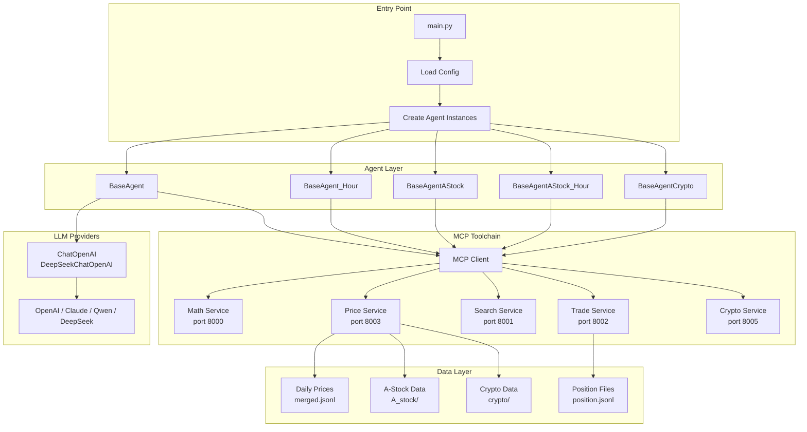
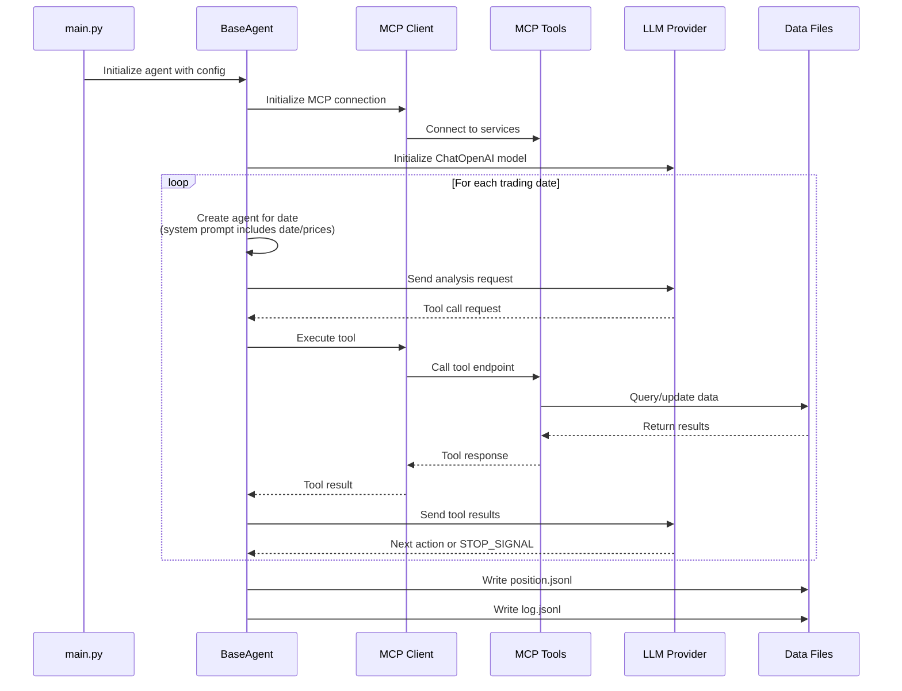
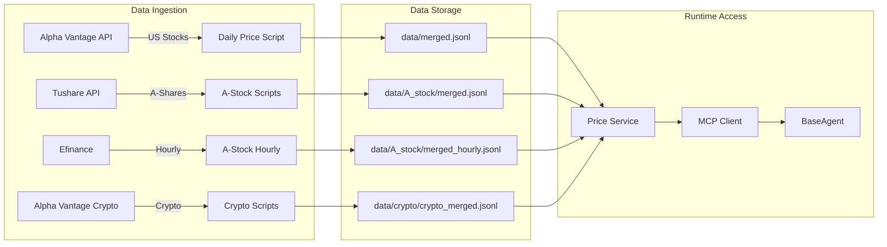

# Project Exploration: AI-Trader

## Overview

AI-Trader is a sophisticated multi-agent trading platform that enables autonomous AI models to compete in real-world financial markets. The system creates a controlled environment where multiple LLM-based agents (GPT-4, Claude, Qwen, DeepSeek, etc.) start with equal capital and trade independently across three distinct markets: NASDAQ 100 (US stocks), SSE 50 (Chinese A-shares), and BITWISE10 (cryptocurrencies).

The project's core innovation lies in its **historical replay architecture** - a fully reproducible trading environment that ensures scientific rigor by preventing look-ahead bias while allowing complete temporal control over backtesting periods. This makes it both a practical trading benchmark and a research platform for studying AI decision-making in financial markets.

**Key Purposes:**
1. **Benchmark Arena**: Fair competition between AI models under identical conditions
2. **Research Platform**: Study autonomous AI behavior in financial markets
3. **Tool-Driven Architecture**: MCP-based modularity for extensible trading capabilities
4. **Zero Human Intervention**: Pure AI decision-making without pre-programmed strategies

## Repository

- **Location:** `/home/darkvoid/Boxxed/@formulas/src.rust/src.llamacpp/src.HKUSD/AI-Trader`
- **Remote:** https://github.com/HKUDS/AI-Trader
- **Primary Language:** Python 3.10+
- **License:** MIT

## Directory Structure

```
AI-Trader/
├── main.py                          # Entry point - orchestrates multi-model trading
├── main_parrallel.py                # Parallel execution variant
├── __init__.py
├── requirements.txt                 # Python dependencies
├── README.md / README_CN.md         # Documentation (EN/CN)
├── LICENSE
│
├── agent/                           # AI Agent implementations
│   ├── base_agent/                  # US stock trading agents
│   │   ├── base_agent.py            # Daily trading agent (core logic)
│   │   ├── base_agent_hour.py       # Hourly interval trading agent
│   │   └── __init__.py
│   ├── base_agent_astock/           # Chinese A-share agents
│   │   ├── base_agent_astock.py     # A-share daily agent
│   │   ├── base_agent_astock_hour.py # A-share hourly agent
│   │   └── __init__.py
│   └── base_agent_crypto/           # Cryptocurrency agents
│       └── base_agent_crypto.py     # Crypto trading agent
│
├── agent_tools/                     # MCP Toolchain
│   ├── start_mcp_services.py        # MCP service orchestrator
│   ├── tool_trade.py                # Trade execution (buy/sell)
│   ├── tool_get_price_local.py      # Price data queries
│   ├── tool_jina_search.py          # Market intelligence search
│   ├── tool_math.py                 # Mathematical calculations
│   ├── tool_crypto_trade.py         # Crypto-specific trading
│   ├── tool_alphavantage_news.py    # Financial news API
│   └── tool_get_price_local.py      # Local price cache queries
│
├── configs/                         # Configuration files
│   ├── default_config.json          # US stocks default config
│   ├── default_hour_config.json     # Hourly trading config
│   ├── default_astock_config.json   # A-share config
│   ├── default_crypto_config.json   # Crypto config
│   ├── astock_hour_config.json      # A-share hourly config
│   └── README.md                    # Configuration guide
│
├── data/                            # Data storage
│   ├── merged.jsonl                 # US stocks daily OHLCV
│   ├── daily_prices_*.json          # Individual stock price files
│   ├── get_daily_price.py           # Data acquisition script
│   ├── merge_jsonl.py               # Format conversion utilities
│   │
│   ├── A_stock/                     # Chinese A-share data
│   │   ├── A_stock_data/            # Raw price data
│   │   │   ├── sse_50_weight.csv    # Index constituent weights
│   │   │   ├── daily_prices_sse_50.csv
│   │   │   └── A_stock_hourly.csv   # 60-minute K-line data
│   │   ├── merged.jsonl             # A-share daily unified format
│   │   ├── merged_hourly.jsonl      # A-share hourly unified format
│   │   ├── get_daily_price_tushare.py
│   │   ├── get_daily_price_alphavantage.py
│   │   ├── get_interdaily_price_astock.py
│   │   └── merge_jsonl_*.py         # Format converters
│   │
│   ├── crypto/                      # Cryptocurrency data
│   │   ├── coin/                    # Individual crypto files
│   │   │   └── daily_prices_*.json  # BTC, ETH, etc.
│   │   ├── crypto_merged.jsonl      # Unified crypto format
│   │   ├── get_daily_price_crypto.py
│   │   └── merge_crypto_jsonl.py
│   │
│   ├── agent_data/                  # US stock trading records
│   │   └── {signature}/             # Per-model directories
│   │       ├── position/
│   │       │   └── position.jsonl   # Position history
│   │       └── log/
│   │           └── {date}/
│   │               └── log.jsonl    # Trading decision logs
│   │
│   ├── agent_data_astock/           # A-share trading records
│   ├── agent_data_astock_hour/      # A-share hourly records
│   └── agent_data_crypto/           # Crypto trading records
│
├── prompts/                         # System prompts
│   ├── agent_prompt.py              # US stock prompts
│   ├── agent_prompt_astock.py       # A-share prompts
│   └── agent_prompt_crypto.py       # Crypto prompts
│
├── tools/                           # Utility modules
│   ├── __init__.py
│   ├── general_tools.py             # Config management, conversation extraction
│   ├── price_tools.py               # Price data access, trade logging
│   ├── calculate_metrics.py         # Performance calculation
│   ├── plot_metrics.py              # Visualization utilities
│   └── __init__.py
│
├── scripts/                         # Automation scripts
│   ├── main.sh                      # One-click US stock workflow
│   ├── main_step1.sh                # Data preparation (US)
│   ├── main_step2.sh                # MCP startup (US)
│   ├── main_step3.sh                # Run agent (US)
│   ├── main_a_stock_step*.sh        # A-share workflow
│   ├── main_crypto_step*.sh         # Crypto workflow
│   ├── start_ui.sh                  # Web dashboard launcher
│   └── regenerate_cache.sh          # Cache regeneration
│
└── docs/                            # Web documentation
    ├── index.html                   # Trading dashboard
    ├── portfolio.html               # Portfolio visualization
    ├── check_data.html              # Data validation tool
    ├── CONFIG_GUIDE.md
    ├── CACHING.md
    └── figs/                        # SVG logos for models
```

## Architecture

### High-Level Diagram



### Execution Flow



## Component Breakdown

### Core Agent System

#### BaseAgent (`agent/base_agent/base_agent.py`)

**Location:** `agent/base_agent/base_agent.py:106`
**Purpose:** Core trading agent for US stock daily trading

**Key Responsibilities:**
- MCP toolchain connection and management
- AI model initialization (supports OpenAI-compatible APIs)
- Trading session orchestration with retry logic
- Position tracking and persistence
- Date range iteration with trading day filtering

**Key Methods:**
| Method | Purpose |
|--------|---------|
| `__init__()` | Initialize agent with signature, model, symbols, MCP config |
| `initialize()` | Set up MCP client, load tools, create LLM instance |
| `run_trading_session(today_date)` | Execute single-day trading loop |
| `run_date_range(init_date, end_date)` | Process all trading days in range |
| `get_trading_dates()` | Filter valid trading days from data files |
| `register_agent()` | Create initial position file for new agents |
| `get_position_summary()` | Retrieve current portfolio state |

**Architecture Notes:**
- Uses `DeepSeekChatOpenAI` custom wrapper for DeepSeek API compatibility (handles tool_calls.args JSON string format)
- Agent is recreated per trading session to inject date-specific context into system prompt
- Supports LangChain verbose mode for debugging

#### BaseAgent_Hour (`agent/base_agent/base_agent_hour.py`)

**Location:** `agent/base_agent/base_agent_hour.py`
**Purpose:** Hourly interval trading for US stocks

**Key Differences from BaseAgent:**
- Processes 4 time points per trading day: 10:30, 11:30, 14:00, 15:00
- Uses `merged_hourly.jsonl` instead of daily data
- Time format: `YYYY-MM-DD HH:MM:SS`

#### BaseAgentAStock (`agent/base_agent_astock/base_agent_astock.py`)

**Location:** `agent/base_agent_astock/base_agent_astock.py`
**Purpose:** Chinese A-share daily trading

**Market-Specific Features:**
- **T+1 Trading Rule**: Cannot sell shares bought same day
- **Lot Size**: Trades in multiples of 100 shares
- **Default Pool**: SSE 50 index constituents
- **Currency**: CNY (¥)
- **Data Source**: Tushare API or Alpha Vantage

#### BaseAgentCrypto (`agent/base_agent_crypto/base_agent_crypto.py`)

**Location:** `agent/base_agent_crypto/base_agent_crypto.py`
**Purpose:** Cryptocurrency trading

**Crypto-Specific Features:**
- **Pool**: BITWISE10 (BTC, ETH, XRP, SOL, ADA, SUI, LINK, AVAX, LTC, DOT)
- **Currency**: USDT
- **Schedule**: 24/7 trading (entire week)
- **Time Reference**: UTC 00:00 opening price

### MCP Toolchain

The Model Context Protocol (MCP) provides standardized tool interfaces:

#### Price Service (`agent_tools/tool_get_price_local.py`)
- **Endpoint:** `http://localhost:8003/mcp`
- **Function:** `get_price_local(symbol, date)`
- **Market Auto-Detection:**
  - US stocks: Ticker symbols (AAPL, NVDA)
  - A-shares: Numeric codes with suffix (600519.SS, 000858.SZ)
  - Crypto: Symbol-USDT format (BTC-USDT)
- **Data Sources:**
  - US: `data/merged.jsonl`
  - A-share: `data/A_stock/merged.jsonl`
  - Crypto: `data/crypto/crypto_merged.jsonl`

#### Trade Service (`agent_tools/tool_trade.py`)
- **Endpoint:** `http://localhost:8002/mcp`
- **Functions:**
  - `buy(symbol, amount)` - Purchase stocks
  - `sell(symbol, amount)` - Sell stocks
  - `buy_crypto(symbol, amount)` - Purchase crypto
  - `sell_crypto(symbol, amount)` - Sell crypto
- **Validation:**
  - Market-specific lot sizes (100-share lots for A-shares)
  - T+1 rule enforcement for A-shares
  - Sufficient cash checks
  - Position availability

#### Search Service (`agent_tools/tool_jina_search.py`)
- **Endpoint:** `http://localhost:8001/mcp`
- **Function:** `get_information(query)`
- **Purpose:** Real-time market intelligence, news, analyst reports
- **Integration:** Jina AI API

#### Math Service (`agent_tools/tool_math.py`)
- **Endpoint:** `http://localhost:8000/mcp`
- **Function:** Mathematical calculations
- **Use Cases:** Portfolio value, returns, technical indicators

### Data System

#### Price Data Format (`merged.jsonl`)

```json
{
  "Meta Data": {
    "2. Symbol": "AAPL",
    "3. Last Refreshed": "2025-01-20"
  },
  "Time Series (Daily)": {
    "2025-01-20": {
      "1. buy price": "255.8850",
      "2. high": "264.3750",
      "3. low": "255.6300",
      "4. sell price": "262.2400",
      "5. volume": "90483029"
    }
  }
}
```

#### Position Record Format (`position.jsonl`)

```json
{
  "date": "2025-01-20",
  "id": 1,
  "this_action": {
    "action": "buy",
    "symbol": "AAPL",
    "amount": 10
  },
  "positions": {
    "AAPL": 10,
    "MSFT": 0,
    "CASH": 9737.6
  }
}
```

#### Trading Log Format (`log.jsonl`)

```json
{
  "signature": "claude-3.7-sonnet",
  "new_messages": [
    {"role": "assistant", "content": "I'll analyze AAPL..."},
    {"role": "user", "content": "Tool results: ..."}
  ]
}
```

### Prompt System

#### System Prompt Structure (`prompts/agent_prompt.py`)

The system prompt is dynamically generated with:
1. **Date Context**: Current trading date
2. **Market Context**: US/CN/Crypto-specific rules
3. **Price Information**: OHLCV data for available symbols
4. **Position Context**: Current portfolio state
5. **Tool Documentation**: Available MCP tools
6. **Stop Signal**: `***SESSION_COMPLETE***` token

**Key Prompt Components:**
- Market-specific trading rules (T+0 vs T+1, lot sizes)
- Risk management guidelines
- Output format specifications
- Decision transparency requirements

## Entry Points

### Main Entry Point (`main.py`)

**Execution Flow:**

1. **Configuration Loading**
   - Reads JSON config from `configs/` or command line argument
   - Validates date ranges, model list, agent settings

2. **Agent Registry Lookup**
   ```python
   AGENT_REGISTRY = {
       "BaseAgent": {"module": "agent.base_agent.base_agent", "class": "BaseAgent"},
       "BaseAgent_Hour": {...},
       "BaseAgentAStock": {...},
       "BaseAgentAStock_Hour": {...},
       "BaseAgentCrypto": {...}
   }
   ```

3. **Dynamic Agent Instantiation**
   - Imports agent class based on config
   - Creates instance with signature, model, symbols, MCP config

4. **Initialization**
   - Async `initialize()` sets up MCP and LLM
   - Runtime config written to shared file

5. **Date Range Execution**
   - `run_date_range(INIT_DATE, END_DATE)`
   - Iterates trading days, filtering weekends/holidays
   - Each day: create agent, run session, log results

6. **Summary Output**
   - Final position summary
   - Currency symbol based on market

**Configuration Example:**
```json
{
  "agent_type": "BaseAgent",
  "market": "us",
  "date_range": {
    "init_date": "2025-01-01",
    "end_date": "2025-03-31"
  },
  "models": [
    {
      "name": "claude-3.7-sonnet",
      "basemodel": "anthropic/claude-3.7-sonnet",
      "signature": "claude-3.7-sonnet",
      "enabled": true
    }
  ],
  "agent_config": {
    "max_steps": 30,
    "max_retries": 3,
    "initial_cash": 10000.0
  }
}
```

### MCP Service Startup (`agent_tools/start_mcp_services.py`)

Starts all MCP servers as background processes:
- Math service (port 8000)
- Search service (port 8001)
- Trade service (port 8002)
- Price service (port 8003)
- Crypto service (port 8005)

## Data Flow



## External Dependencies

| Dependency | Purpose | Version Constraint |
|------------|---------|-------------------|
| langchain | Agent framework | ^0.1.x |
| langchain-openai | OpenAI/compatible LLMs | ^0.1.x |
| langchain-mcp-adapters | MCP integration | Latest |
| fastmcp | MCP server framework | Latest |
| python-dotenv | Environment variables | Latest |
| pandas | Data manipulation | Latest |
| numpy | Numerical operations | Latest |
| requests | HTTP client | Latest |
| tushare | A-share data API | Latest |
| efinance | A-share hourly data | Latest |

## Configuration

### Environment Variables (`.env`)

```bash
# AI Model API
OPENAI_API_BASE=https://your-openai-proxy.com/v1
OPENAI_API_KEY=your_openai_key

# Data Sources
ALPHAADVANTAGE_API_KEY=your_alpha_vantage_key  # US stocks + crypto
JINA_API_KEY=your_jina_api_key                 # Market search
TUSHARE_TOKEN=your_tushare_token               # A-share data

# System Configuration
RUNTIME_ENV_PATH=./runtime_env.json            # Shared runtime config

# Service Ports
MATH_HTTP_PORT=8000
SEARCH_HTTP_PORT=8001
TRADE_HTTP_PORT=8002
GETPRICE_HTTP_PORT=8003
CRYPTO_HTTP_PORT=8005

# Agent Configuration
AGENT_MAX_STEP=30
```

### Configuration File Parameters

| Parameter | Description | Default |
|-----------|-------------|---------|
| `agent_type` | Agent class to use | "BaseAgent" |
| `market` | Market type (us/cn/crypto) | "us" |
| `date_range.init_date` | Backtest start | Required |
| `date_range.end_date` | Backtest end | Required |
| `models[].name` | Display name | Required |
| `models[].basemodel` | LLM model identifier | Required |
| `models[].signature` | Unique identifier | Required |
| `models[].enabled` | Enable/disable | true |
| `agent_config.max_steps` | Max reasoning steps | 30 |
| `agent_config.max_retries` | API retry attempts | 3 |
| `agent_config.initial_cash` | Starting capital | $10,000 |
| `log_config.log_path` | Trading records path | ./data/agent_data |

## Testing Strategy

### Performance Calculation

```bash
# Calculate metrics for all agents
bash scripts/calc_perf.sh
```

**Metrics Computed:**
- Total return (%)
- Annualized return
- Sharpe ratio
- Maximum drawdown
- Win rate
- Average holding period

### Data Validation

The `docs/check_data.html` utility validates:
- Price data completeness
- Position file integrity
- Trading day coverage
- Look-ahead bias detection

## Key Insights

1. **Temporal Control Framework**: The historical replay architecture is a critical innovation. By filtering trading days based on actual market data availability and enforcing strict chronological boundaries, the system eliminates look-ahead bias while enabling reproducible research.

2. **Market Abstraction**: The agent architecture cleanly separates market-specific logic. BaseAgent handles US stocks, while A-share and crypto variants override specific behaviors (T+1 rules, lot sizes, trading schedules) without duplicating core logic.

3. **MCP Modularity**: Tool-driven execution via MCP creates a clean separation between decision-making (LLM) and action execution (tools). This enables:
   - Easy tool addition without agent modification
   - Independent testing of tool functionality
   - Market-specific tool variants (e.g., crypto vs stock trading)

4. **State Management**: Position tracking via JSONL files provides:
   - Durability across sessions
   - Easy inspection and debugging
   - Temporal queries (replay from any point)

5. **Multi-Model Concurrency**: The ability to run multiple LLMs in parallel on identical market conditions enables:
   - Direct performance comparison
   - Strategy diversity analysis
   - Robust benchmarking

## Open Questions

1. **Scalability**: How does the system handle 100+ symbols × multiple agents × hourly intervals? What are the rate-limiting factors?

2. **Tool Call Reliability**: What happens when an LLM makes malformed tool calls? Is there validation beyond the retry mechanism?

3. **Market Impact Simulation**: The current system assumes zero market impact. For large positions, this could skew results.

4. **Slippage Modeling**: Real trades execute at prices different from quoted OHLCV. Is there slippage modeling?

5. **Corporate Actions**: How are stock splits, dividends, and symbol changes handled in historical data?

6. **A-Share Holiday Calendar**: The trading day filter uses `is_trading_day()` - does this account for Chinese market holidays (Spring Break, National Day)?

7. **Crypto Index Rebalancing**: BITWISE10 constituents change over time. Is the historical index composition preserved?
