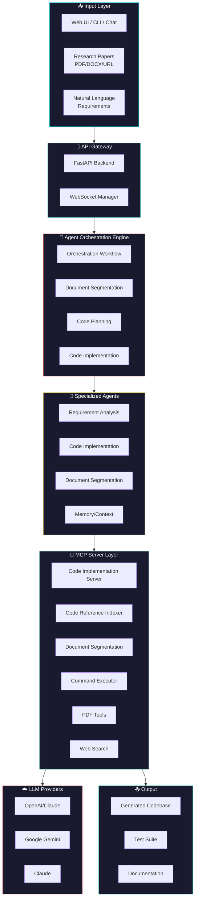
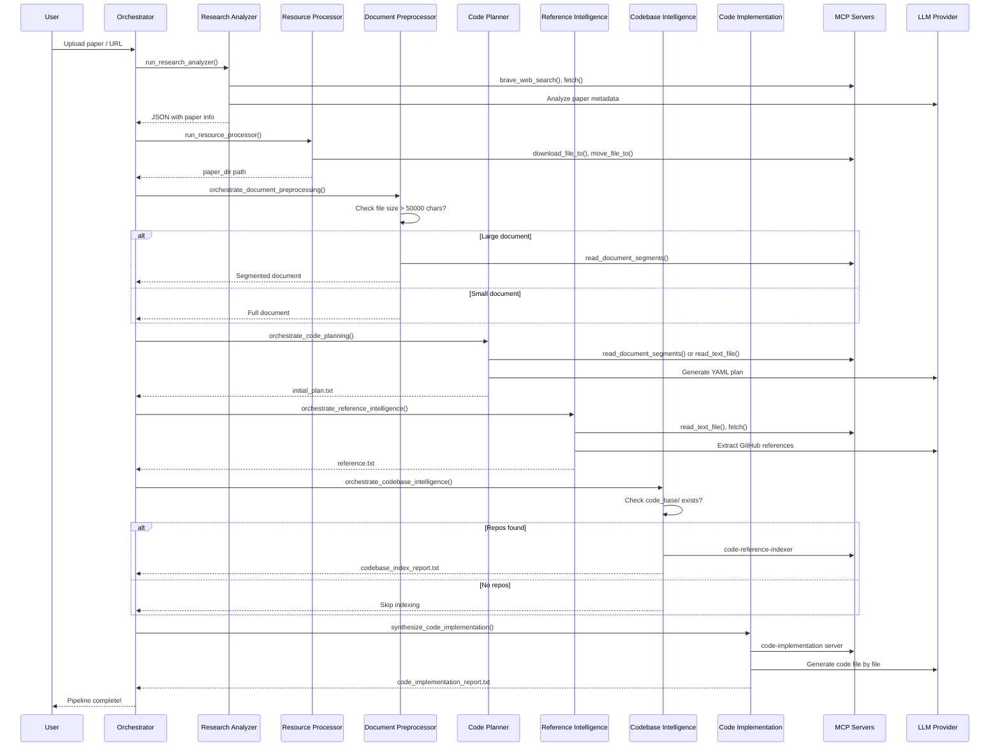
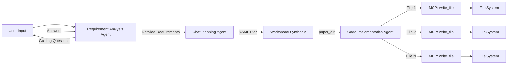

# Project Exploration: DeepCode - Open Agentic Coding

## Overview

DeepCode is an AI-powered multi-agent code generation platform that automates the transformation of research papers and natural language requirements into production-ready code. The system achieves SOTA performance on OpenAI's PaperBench benchmark (75.9%), surpassing human experts (72.4%) and commercial code agents (+26.1%).

The platform's core value proposition centers on three capabilities:
1. **Paper2Code**: Automated implementation of complex algorithms from research papers
2. **Text2Web**: Translation of natural language descriptions into functional frontend web code
3. **Text2Backend**: Generation of efficient, scalable backend systems from text specifications

DeepCode employs a sophisticated multi-agent architecture with 7 specialized agents coordinated by a central orchestrator. The system integrates MCP (Model Context Protocol) for tool standardization, supports multiple deployment modes (Docker, local, CLI, web UI), and includes nanobot integration for Feishu chatbot-based code generation.

## Repository

- **Location:** `/home/darkvoid/Boxxed/@formulas/src.rust/src.llamacpp/src.HKUSD/DeepCode`
- **Remote:** https://github.com/HKUDS/DeepCode
- **Primary Language:** Python 3.13
- **License:** MIT License
- **Paper:** https://arxiv.org/abs/2512.07921

## Directory Structure

```
DeepCode/
├── deepcode.py                      # Main launcher (cross-platform: Docker/local/CLI)
├── mcp_agent.config.yaml            # MCP server and LLM configuration
├── mcp_agent.secrets.yaml           # API keys (OpenAI, Anthropic, Google, etc.)
├── requirements.txt                 # Python dependencies
├── setup.py                         # Package installation
│
├── new_ui/                          # Modern web interface
│   ├── backend/                     # FastAPI backend
│   │   ├── main.py                  # FastAPI app entry point
│   │   ├── settings.py              # Pydantic settings
│   │   ├── api/
│   │   │   ├── routes/              # REST endpoints (config, files, workflows)
│   │   │   └── websockets/          # WS handlers (code_stream, logs, workflow)
│   │   ├── models/                  # Pydantic request/response models
│   │   ├── services/                # Business logic (workflow, session, requirement)
│   │   └── app_utils/               # Utility functions
│   │
│   └── frontend/                    # React + Vite frontend
│       ├── src/
│       │   ├── components/          # UI components
│       │   ├── services/            # API clients
│       │   └── App.tsx              # Main application
│       └── package.json
│
├── workflows/                       # Core orchestration engine
│   ├── agent_orchestration_engine.py    # Main pipeline coordinator (2000+ lines)
│   ├── code_implementation_workflow.py  # Code generation workflow
│   ├── codebase_index_workflow.py       # Repository indexing
│   │
│   └── agents/                      # Specialized agents
│       ├── requirement_analysis_agent.py   # User requirement parsing
│       ├── code_implementation_agent.py    # File-by-file code synthesis
│       ├── document_segmentation_agent.py  # Smart paper chunking
│       └── memory_agent_concise.py         # Context compression
│
├── config/                          # MCP tool definitions
│   ├── mcp_tool_definitions.py      # Tool registry
│   └── mcp_tool_definitions_index.py
│
├── tools/                           # MCP server implementations
│   ├── code_implementation_server.py    # Core code generation
│   ├── code_reference_indexer.py        # Repository search
│   ├── code_indexer.py                  # Knowledge graph builder
│   ├── document_segmentation_server.py  # Paper chunking
│   ├── command_executor.py              # Shell execution
│   ├── git_command.py                   # Git operations
│   ├── pdf_downloader.py                # PDF acquisition
│   ├── pdf_converter.py                 # PDF→Markdown
│   └── bocha_search_server.py           # Web search API
│
├── prompts/                         # Agent system prompts
│   └── code_prompts.py              # Centralized prompt definitions
│
├── cli/                             # Terminal interface
│   ├── main_cli.py                  # CLI entry point
│   ├── cli_app.py                   # CLI application
│   ├── cli_interface.py             # User interaction
│   └── workflows/                   # CLI workflow adapters
│
├── ui/                              # Classic Streamlit UI (legacy)
│   ├── app.py
│   ├── components.py
│   └── handlers.py
│
├── nanobot/                         # Feishu/Telegram/Discord bot integration
│   └── nanobot/
│       ├── agent/                   # Bot agent framework
│       │   ├── loop.py              # Agent execution loop
│       │   ├── context.py           # Session context
│       │   ├── memory.py            # Conversation memory
│       │   ├── skills.py            # Bot capabilities
│       │   └── tools/               # Bot tool implementations
│       │
│       ├── channels/                # Messaging platform adapters
│       │   ├── base.py              # Abstract channel interface
│       │   ├── feishu.py            # Feishu/Lark WebSocket
│       │   ├── telegram.py          # Telegram polling
│       │   ├── discord.py           # Discord gateway
│       │   └── [slack, whatsapp, dingtalk, qq, email]
│       │
│       ├── config/                  # Bot configuration
│       │   ├── schema.py            # Config Pydantic models
│       │   └── loader.py            # YAML/JSON config loading
│       │
│       ├── providers/               # LLM provider abstraction
│       │   ├── base.py              # Provider interface
│       │   ├── litellm_provider.py  # LiteLLM wrapper
│       │   └── registry.py          # Provider discovery
│       │
│       ├── session/                 # Multi-user session management
│       │   └── manager.py
│       │
│       ├── cron/                    # Scheduled tasks
│       │   ├── service.py
│       │   └── types.py
│       │
│       └── heartbeat/               # Health monitoring
│           └── service.py
│
├── deepcode_docker/                 # Docker deployment
│   ├── Dockerfile
│   ├── docker-compose.yml
│   └── run_docker.sh
│
└── papers/                          # Sample research papers for testing
    └── [paper_name]/
        ├── paper.md                 # Paper content
        └── addendum.md              # Supplementary materials
```

## Architecture

### High-Level System Diagram



### Multi-Agent Architecture

```mermaid
flowchart LR
    subgraph Central["🎯 Central Orchestrating Agent"]
        ORCH[Strategic Decision Making<br/>Workflow Coordination<br/>Agent Management]
    end

    subgraph Analysis["📊 Analysis Agents"]
        REQ[📝 Requirement Analysis<br/>Semantic parsing of user input]
        DOC[📄 Document Parsing<br/>Paper/URL content extraction]
    end

    subgraph Planning["🏗️ Planning Agents"]
        CODE_PLAN[📋 Code Planning<br/>Architecture design & roadmap]
        REF[🔍 Code Reference Mining<br/>Repository discovery]
        IDX[📚 Code Indexing<br/>Knowledge graph building]
    end

    subgraph Implementation["🧬 Implementation Agents"]
        CODE_GEN[Code Generation<br/>File-by-file synthesis]
        MEM[💾 Memory Agent<br/>Context compression]
    end

    Central --> Analysis
    Analysis --> Planning
    Planning --> Implementation

    style Central fill:#0EA5E9,stroke:#0284c7,color:#000
    style Analysis fill:#8c7ae6,stroke:#7158e2,color:#fff
    style Planning fill:#00d2d3,stroke:#01a3a4,color:#000
    style Implementation fill:#26de81,stroke:#20bf6b,color:#000
```



## Component Breakdown

### 1. Agent Orchestration Engine (`workflows/agent_orchestration_engine.py`)

**Location:** `workflows/agent_orchestration_engine.py` (2000+ lines)

**Purpose:** Central coordination of the multi-agent research-to-code pipeline

**Key Classes and Methods:**

```python
# Core pipeline function
async def execute_multi_agent_research_pipeline(
    input_source: str,
    logger,
    progress_callback: Optional[Callable],
    enable_indexing: bool = True
) -> str
```

**10-Phase Pipeline:**

| Phase | Progress | Agent | Responsibility |
|-------|----------|-------|----------------|
| 0 | 5% | Workspace Setup | Directory structure creation |
| 1 | 10% | Input Processing | File path/URL validation |
| 2 | 25% | Research Analyzer | Content extraction & analysis |
| 3 | 40% | Resource Processor | PDF/download handling |
| 4 | 50% | Document Preprocessor | Segmentation decision |
| 5 | 65% | Code Planning | Architecture & roadmap |
| 6 | 70% | Reference Intelligence | GitHub repo discovery |
| 7 | 75% | Repository Acquisition | Automated cloning |
| 8 | 80% | Codebase Intelligence | Knowledge graph indexing |
| 9 | 85% | Code Implementation | File-by-file generation |

**Key Functions:**

```python
# Research content analysis
async def run_research_analyzer(prompt_text: str, logger) -> str
    # Uses ResearchAnalyzerAgent with PAPER_INPUT_ANALYZER_PROMPT
    # Returns JSON with paper metadata and file paths

# Document segmentation decision
async def orchestrate_document_preprocessing_agent(dir_info, logger) -> Dict
    # Checks document size against threshold (50000 chars)
    # Decides between segmented vs traditional processing

# Code planning with adaptive prompts
async def run_code_analyzer(paper_dir, logger, use_segmentation: bool) -> str
    # Coordinates ConceptAnalysisAgent + AlgorithmAnalysisAgent
    # Uses ParallelLLM for concurrent analysis
    # Returns comprehensive YAML implementation plan

# Reference analysis for GitHub repos
async def paper_reference_analyzer(paper_dir, logger) -> str
    # Extracts references from bibliography
    # Identifies GitHub repositories for code reference

# Repository download automation
async def github_repo_download(search_result, paper_dir, logger) -> str
    # Uses GithubDownloadAgent with github-downloader MCP server
    # Downloads repos to {paper_dir}/code_base/

# Codebase indexing (when enabled)
async def orchestrate_codebase_intelligence_agent(dir_info, logger) -> Dict
    # Runs CodebaseIndexWorkflow
    # Creates semantic knowledge graph of referenced code

# Final code generation
async def synthesize_code_implementation_agent(dir_info, logger) -> Dict
    # Uses CodeImplementationWorkflow or CodeImplementationWorkflowWithIndex
    # Generates production-ready code file by file
```

**Adaptive Token Management:**

```python
def _assess_output_completeness(text: str) -> float:
    """Assess YAML plan completeness (0.0-1.0 score)"""
    # Checks for 5 required sections:
    # - file_structure:
    # - implementation_components:
    # - validation_approach:
    # - environment_setup:
    # - implementation_strategy:

def _adjust_params_for_retry(params, retry_count, config_path) -> RequestParams:
    """Reduce tokens on retry to fit model context limits"""
    # Retry 1: 15000 tokens (from config)
    # Retry 2: 80% of retry_max_tokens
    # Retry 3: 60% of retry_max_tokens
```

### 2. Requirement Analysis Agent (`workflows/agents/requirement_analysis_agent.py`)

**Location:** `workflows/agents/requirement_analysis_agent.py`

**Purpose:** Interactive requirement refinement through guiding questions

**Key Methods:**

```python
class RequirementAnalysisAgent:
    async def generate_guiding_questions(self, user_input: str) -> List[Dict]
        """Generate 1-3 targeted questions covering:
        - Functional Requirements
        - Technical Architecture
        - Performance & Scalability
        """

    async def summarize_detailed_requirements(
        self, initial_input: str, answers: Dict[str, str]
    ) -> str
        """Generate structured requirement document with:
        - Project Overview
        - Functional Requirements
        - Technical Architecture
        - Performance & Scalability
        """

    async def modify_requirements(
        self, current_requirements: str, modification_feedback: str
    ) -> str
        """Update requirements based on user feedback"""
```

### 3. Code Implementation Agent (`workflows/agents/code_implementation_agent.py`)

**Location:** `workflows/agents/code_implementation_agent.py` (1100+ lines)

**Purpose:** Systematic file-by-file code generation with progress tracking

**Key Features:**

- **Progress Tracking:** Counts implemented files, tracks technical decisions
- **Memory Optimization:** Summarizes implemented files to reduce context
- **Analysis Loop Detection:** Prevents infinite read cycles
- **Token Calculation:** Uses tiktoken for accurate context management

**Key Methods:**

```python
class CodeImplementationAgent:
    def __init__(self, mcp_agent, logger, enable_read_tools: bool = True):
        self.implementation_summary = {
            "completed_files": [],
            "technical_decisions": [],
            "important_constraints": [],
            "architecture_notes": [],
            "dependency_analysis": [],
        }
        self.files_implemented_count = 0
        self.implemented_files_set = set()  # Unique files

    async def execute_tool_calls(self, tool_calls: List[Dict]) -> List[Dict]:
        """Execute MCP tool calls with progress tracking"""
        # Intercepts read_file calls to use read_code_mem if summary exists
        # Tracks write_file calls to count implemented files

    async def _handle_read_file_with_memory_optimization(self, tool_call) -> Dict:
        """Redirect read_file to read_code_mem if summary available"""
        # Checks memory agent for existing code summary
        # Returns summary instead of full file content

    def should_trigger_summary(self, summary_trigger: int = 5, messages: List = None) -> bool:
        """Check if summary should be triggered:
        - Token-based (primary): When approaching 190k tokens
        - File-based (fallback): Every N files implemented
        """

    def is_in_analysis_loop(self) -> bool:
        """Detect if agent is stuck reading files without writing"""
        # Checks last 5 tool calls
        # Returns True if all are read_file/search_reference_code
```

### 4. Document Segmentation Agent (`workflows/agents/document_segmentation_agent.py`)

**Location:** `workflows/agents/document_segmentation_agent.py`

**Purpose:** Intelligent chunking of large research papers

**Key Function:**

```python
async def prepare_document_segments(paper_dir: str, logger) -> Dict:
    """Split large papers into semantically coherent segments

    Returns:
    {
        "status": "success",
        "segments_dir": "./deepcode_lab/papers/1/segments/",
        "segments": [
            {"id": 1, "title": "Introduction", "content": "..."},
            {"id": 2, "title": "Methodology", "content": "..."},
            ...
        ]
    }
    """
```

### 5. Launcher (`deepcode.py`)

**Location:** `deepcode.py` (756 lines)

**Purpose:** Cross-platform application launcher

**Launch Modes:**

```python
# Docker (default)
deepcode                              # docker compose up

# Local development
deepcode --local                      # FastAPI + React dev servers

# CLI interface
deepcode --cli                        # Terminal-based interaction

# Classic Streamlit UI
deepcode --classic                    # Legacy web interface

# Paper testing
deepcode test rice                    # Test RICE paper reproduction
deepcode test rice --fast             # Fast mode testing
```

**Key Functions:**

```python
def check_dependencies():
    """Check Python (fastapi, uvicorn, pyyaml) and Node.js availability"""

def is_port_in_use(port: int) -> bool:
    """Check if port 8000 or 5173 is occupied"""

def kill_process_on_port(port: int):
    """Kill process on port (Windows: taskkill, Unix: lsof + kill)"""

def start_backend(backend_dir: Path):
    """Start FastAPI backend on port 8000"""

def start_frontend(frontend_dir: Path):
    """Start React dev server on port 5173"""

def cleanup_processes():
    """Graceful shutdown of backend and frontend"""
```

## Entry Points

### 1. Main Application Entry Point

**File:** `deepcode.py:main()`

**Execution Flow:**

```
1. Parse command line arguments
   └─> --docker, --local, --cli, --classic, test <paper>

2. Check dependencies
   └─> Python packages (fastapi, uvicorn, pyyaml)
   └─> System tools (node, npm)

3. Clean up ports (8000, 5173) if in use

4. Start services based on mode:
   └─> Docker: docker compose up -d
   └─> Local: uvicorn main:app + npm run dev
   └─> CLI: python cli/main_cli.py
   └─> Classic: streamlit run ui/app.py

5. Wait for processes (infinite loop)

6. Handle Ctrl+C: cleanup_processes()
```

### 2. API Backend Entry Point

**File:** `new_ui/backend/main.py`

**FastAPI Application:**

```python
from fastapi import FastAPI
from fastapi.middleware.cors import CORSMiddleware

app = FastAPI(title="DeepCode API")

# CORS for frontend
app.add_middleware(CORSMiddleware, ...)

# Routes
app.include_router(workflows_router, prefix="/api/workflows")
app.include_router(files_router, prefix="/api/files")
app.include_router(config_router, prefix="/api/config")

# WebSocket endpoints
@app.websocket("/ws/code-stream")
async def code_stream_websocket(websocket: WebSocket):
    ...

@app.websocket("/ws/logs")
async def logs_websocket(websocket: WebSocket):
    ...
```

### 3. CLI Entry Point

**File:** `cli/main_cli.py`

**Terminal Interface:**

```python
async def main():
    # Load configuration
    config = load_config("mcp_agent.config.yaml")
    secrets = load_secrets("mcp_agent.secrets.yaml")

    # Interactive CLI loop
    while True:
        user_input = await get_user_input()

        # Run chat-based planning pipeline
        result = await execute_chat_based_planning_pipeline(
            user_input=user_input,
            logger=logger,
            progress_callback=print_progress
        )

        print(result)
```

## Data Flow

### Research Paper → Code Pipeline



### Chat-Based Code Generation Flow



## External Dependencies

### MCP Servers

| Server | Command | Purpose |
|--------|---------|---------|
| **brave** | `npx -y @modelcontextprotocol/server-brave-search` | Web search via Brave Search API |
| **bocha-mcp** | `python tools/bocha_search_server.py` | Alternative search (Bocha API) |
| **filesystem** | `npx -y @modelcontextprotocol/server-filesystem` | File/directory operations |
| **fetch** | `npx -y @modelcontextprotocol/server-fetch` | Web content retrieval |
| **github-downloader** | Custom | Clone GitHub repositories |
| **file-downloader** | Custom | Download and convert files |
| **command-executor** | Custom | Execute shell commands |
| **code-implementation** | `python tools/code_implementation_server.py` | Core code generation |
| **code-reference-indexer** | `python tools/code_reference_indexer.py` | Semantic code search |
| **document-segmentation** | `python tools/document_segmentation_server.py` | Paper chunking |

### Python Dependencies (requirements.txt)

| Package | Version | Purpose |
|---------|---------|---------|
| mcp-agent | - | Agent framework |
| fastapi | >=0.104.0 | Web backend |
| uvicorn | >=0.24.0 | ASGI server |
| pydantic | >=2.0 | Data validation |
| pydantic-settings | >=2.0 | Settings management |
| pyyaml | >=6.0 | YAML parsing |
| websockets | - | WebSocket support |
| aiofiles | - | Async file I/O |
| python-multipart | - | Form data handling |
| streamlit | - | Classic UI (legacy) |
| tiktoken | - | Token counting |

## Configuration

### mcp_agent.config.yaml

```yaml
# LLM Provider Selection (line ~106)
llm_provider: "google"  # Options: google, anthropic, openai

# Search Server Configuration
default_search_server: "brave"  # Options: brave, bocha-mcp

# Brave Search API (line ~28)
brave:
  command: "npx"
  args: ["-y", "@modelcontextprotocol/server-brave-search"]
  env:
    BRAVE_API_KEY: "your_brave_api_key"

# Bocha-MCP Search (line ~74)
bocha-mcp:
  command: "python"
  args: ["tools/bocha_search_server.py"]
  env:
    BOCHA_API_KEY: "your_bocha_api_key"

# Document Segmentation Control
document_segmentation:
  enabled: true          # Enable/disable intelligent segmentation
  size_threshold_chars: 50000  # Trigger segmentation for large docs
```

### mcp_agent.secrets.yaml

```yaml
# At least ONE provider API key required
openai:
  api_key: "sk-..."
  base_url: "https://openrouter.ai/api/v1"  # Optional: custom endpoint

anthropic:
  api_key: "sk-ant-..."  # For Claude models

google:
  api_key: "..."  # For Gemini models
```

### nanobot_config.json (Feishu Integration)

```jsonc
{
  "channels": {
    "feishu": {
      "enabled": true,
      "appId": "cli_xxx",           // Feishu App ID
      "appSecret": "xxx",           // Feishu App Secret
      "allowFrom": []               // [] = allow all users
    }
  },
  "providers": {
    "openrouter": {
      "apiKey": "sk-or-v1-xxx"      // OpenRouter API Key
    }
  },
  "agents": {
    "defaults": {
      "model": "anthropic/claude-sonnet-4-20250514"
    }
  }
}
```

## Testing

### Paper Testing Mode

```bash
# Test paper reproduction
deepcode test rice

# Fast mode (skip indexing)
deepcode test rice --fast
```

### Unit Test Structure

The project uses integration testing through the pipeline rather than traditional unit tests:

1. **Pipeline Testing:** Full end-to-end paper reproduction tests
2. **PaperBench Benchmark:** 20 ICML 2024 papers for evaluation
3. **Component Testing:** Individual agent testing through CLI

## Key Insights

### Architectural Decisions

1. **Multi-Agent Specialization**: Seven distinct agents with clear separation of concerns prevents cognitive overload on any single LLM call

2. **Adaptive Document Processing**: Document segmentation decision (50000 char threshold) balances context completeness against model limits

3. **MCP Standardization**: All tool interactions go through MCP protocol, enabling:
   - Hot-swappable tool implementations
   - Consistent error handling
   - Cross-agent tool reuse

4. **Progressive Token Management**: Token-based summary triggering (190k threshold) prevents context overflow while maintaining coherence

5. **Analysis Loop Detection**: Tracking consecutive read operations prevents infinite analysis without implementation

### Technical Innovations

1. **ParallelLLM Workflow**: Concurrent execution of ConceptAnalysisAgent + AlgorithmAnalysisAgent improves plan quality

2. **Read File Interception**: Automatic redirection from `read_file` to `read_code_mem` when summaries exist

3. **Completeness Scoring**: `_assess_output_completeness()` function evaluates YAML plan quality before proceeding

4. **Retry Token Reduction**: Counter-intuitively REDUCES tokens on retry to fit within 32k context limits

### Performance Optimizations

1. **Direct File Reading**: Paper content loaded directly in `run_code_analyzer()` rather than through LLM tool calls

2. **Deterministic Operations**: File copy/move operations use direct Python functions, not LLM agents

3. **Fast Mode**: `enable_indexing=False` skips GitHub download and codebase indexing for 3x speedup

## Open Questions

1. **Memory Agent Implementation**: The `memory_agent` and `create_code_implementation_summary()` method are referenced but the full implementation needs investigation

2. **Code Reference Indexer Algorithm**: The semantic search algorithm in `code_reference_indexer.py` uses vector embeddings but the exact embedding model and indexing strategy needs examination

3. **Document Segmentation Algorithm**: How does `document_segmentation_server.py` determine semantic boundaries? Is it LLM-based or rule-based?

4. **WebSocket State Management**: How does the FastAPI backend maintain conversation state across WebSocket connections for the "User-in-Loop" feature?

5. **nanobot Session Persistence**: How are conversation sessions persisted across bot restarts? What storage backend is used?

6. **Tool Call Interception Edge Cases**: What happens when `read_code_mem` returns partial summaries? How does the Code Implementation Agent handle missing details?

7. **ParallelLLM Synchronization**: How does the fan-in agent (CodePlannerAgent) reconcile potentially conflicting analyses from ConceptAnalysisAgent and AlgorithmAnalysisAgent?
