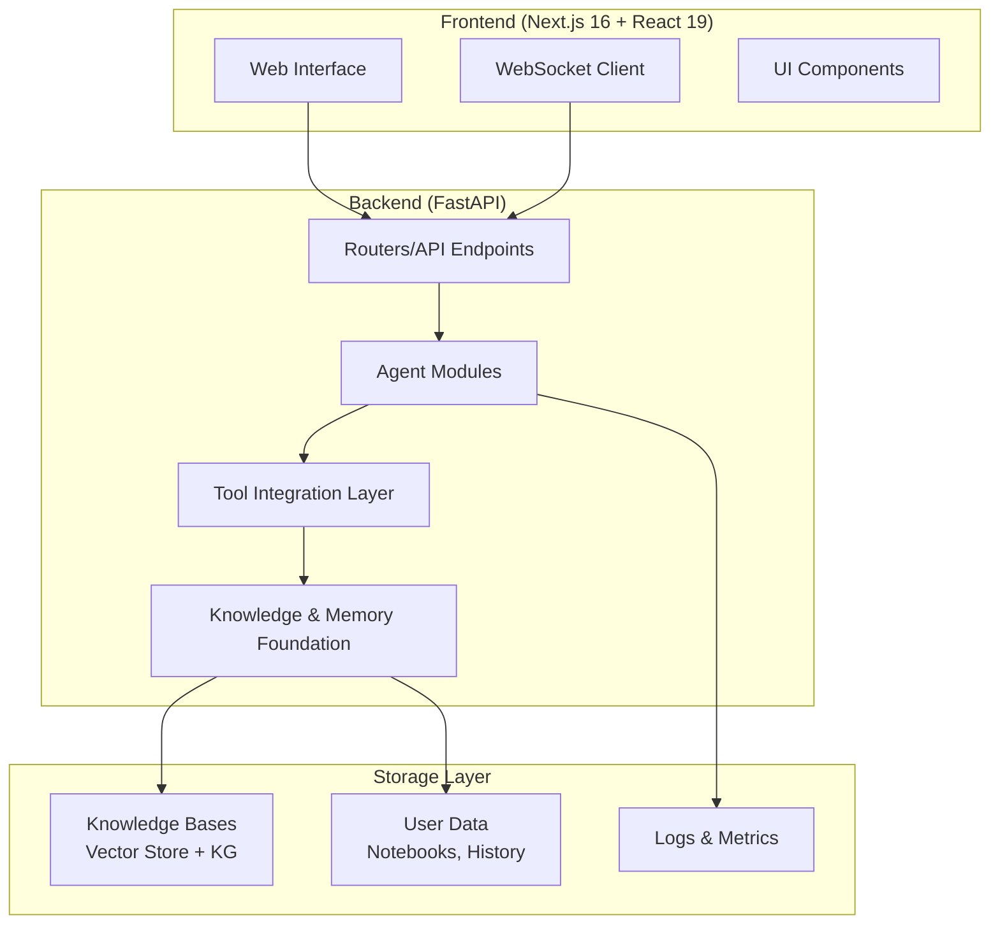
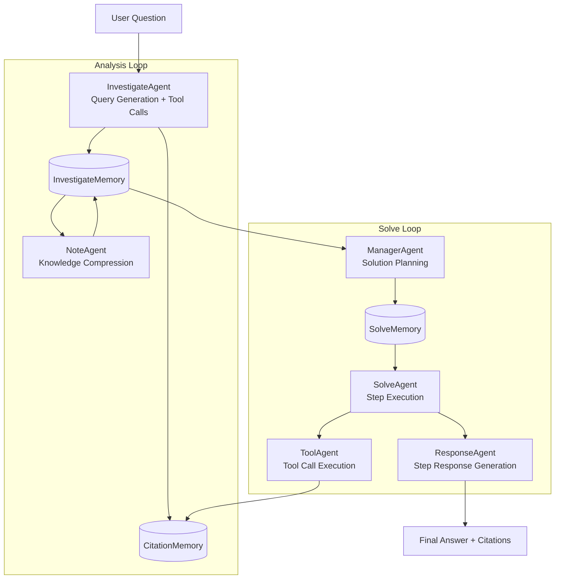
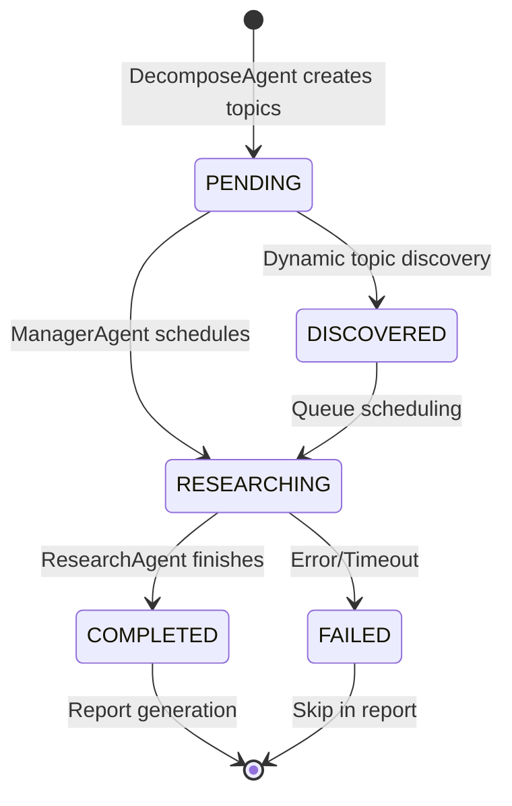
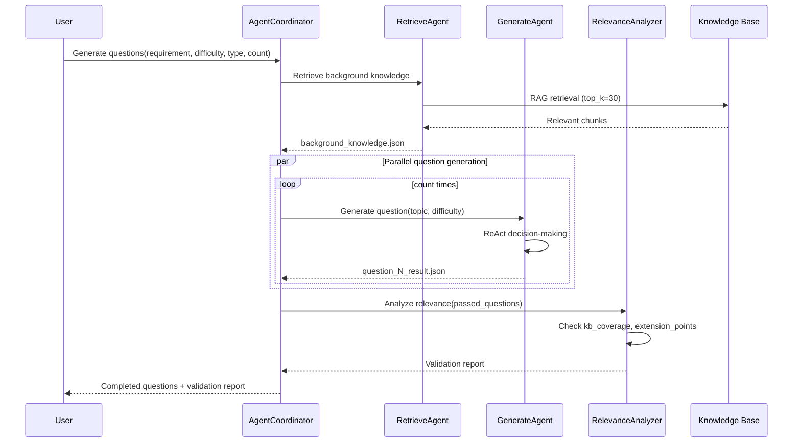

# Project Exploration: DeepTutor

## Overview

DeepTutor is an **AI-Powered Personalized Learning Assistant** that combines massive document knowledge Q&A, interactive learning visualization, knowledge reinforcement, and deep research capabilities. Built with a FastAPI backend and Next.js 16 + React 19 frontend, it delivers a comprehensive educational platform powered by multi-agent AI systems.

The system's architecture centers on **eight core modules**: Solve (dual-loop problem solving), Question Generator (custom and exam-mimicking question creation), Guided Learning (interactive page generation), Co-Writer (AI-assisted markdown editing), Research (dynamic topic queue-based deep research), IdeaGen (multi-stage filtered idea generation), Dashboard (knowledge base management), and Notebook (unified learning record storage).

Key architectural patterns include the **Dual-Loop Problem Solver** (Analysis Loop + Solve Loop), **Dynamic Topic Queue** for research scheduling (PENDING → RESEARCHING → COMPLETED/FAILED), **BaseAgent Framework** for unified agent implementation, and **Centralized Citation Management** with thread-safe async operations for parallel research execution.

## Repository

- **Location:** `/home/darkvoid/Boxxed/@formulas/src.rust/src.llamacpp/src.HKUSD/DeepTutor`
- **Remote:** https://github.com/HKUDS/DeepTutor
- **Primary Language:** Python 3.10+, TypeScript (React 19)
- **License:** AGPL-3.0
- **Latest Release:** v0.6.0 (Jan 2026) - Frontend session persistence, full Chinese support, Docker deployment

## Directory Structure

```
DeepTutor/
├── assets/                          # Static assets (logos, GIFs, README figures)
│   ├── logo-ver2.png
│   └── figs/                        # Architecture diagrams
├── config/                          # Configuration files
│   ├── agents.yaml                  # Agent parameters (temperature, max_tokens) - SINGLE SOURCE OF TRUTH
│   ├── main.yaml                    # System paths, tool settings, module-specific configs
│   └── prompts/                     # Prompt templates per module/agent/language
├── data/                            # User data storage
│   ├── knowledge_bases/             # KB vector stores, embeddings, knowledge graphs
│   └── user/                        # Activity outputs (solve/, question/, research/, etc.)
├── scripts/                         # Installation and launch scripts
│   ├── install_all.py               # One-click dependency installation
│   ├── start_web.py                 # Launch frontend + backend
│   └── extract_numbered_items.sh    # KB extraction utility
├── src/
│   ├── agents/                      # Core AI agent implementations
│   │   ├── base_agent.py            # Unified BaseAgent class (658 lines)
│   │   ├── solve/                   # Dual-loop problem solver
│   │   │   ├── main_solver.py       # Main controller (872 lines)
│   │   │   ├── analysis_loop/       # InvestigateAgent, NoteAgent
│   │   │   ├── solve_loop/          # ManagerAgent, SolveAgent, CheckAgent, ResponseAgent, ToolAgent
│   │   │   ├── memory/              # CitationMemory, InvestigateMemory, SolveMemory
│   │   │   └── utils/               # ConfigValidator, DisplayManager, TokenTracker
│   │   ├── research/                # Deep research pipeline
│   │   │   ├── main.py              # CLI entry point
│   │   │   ├── research_pipeline.py # Three-phase orchestrator
│   │   │   ├── agents/              # RephraseAgent, DecomposeAgent, ManagerAgent, ResearchAgent, NoteAgent, ReportingAgent
│   │   │   └── utils/               # CitationManager (centralized), TokenTracker
│   │   ├── question/                # Question generation
│   │   │   ├── coordinator.py       # Agent coordinator
│   │   │   ├── agents/              # RetrieveAgent, GenerateAgent, RelevanceAnalyzer
│   │   │   └── tools/exam_mimic/    # PDF parsing, style mimicking
│   │   ├── guide/                   # Guided learning
│   │   │   ├── guide_manager.py
│   │   │   └── agents/              # LocateAgent, InteractiveAgent, ChatAgent, SummaryAgent
│   │   ├── ideagen/                 # Idea generation
│   │   │   ├── idea_generation_workflow.py
│   │   │   └── material_organizer_agent.py
│   │   ├── co_writer/               # Collaborative writing
│   │   │   ├── edit_agent.py        # Rewrite/Shorten/Expand
│   │   │   └── narrator_agent.py    # TTS script generation
│   │   └── chat/                    # Contextual Q&A
│   │       ├── chat_agent.py
│   │       └── session_manager.py
│   ├── api/                         # FastAPI backend
│   │   ├── main.py                  # FastAPI app initialization
│   │   ├── routers/                 # API endpoints per module
│   │   │   ├── solve.py             # WebSocket streaming for problem solving
│   │   │   ├── research.py          # Research pipeline endpoints
│   │   │   ├── question.py          # Question generation endpoints
│   │   │   ├── knowledge.py         # KB CRUD operations
│   │   │   └── ...
│   │   └── utils/                   # NotebookManager, TaskIdManager, ProgressBroadcaster
│   ├── config/                      # Configuration loaders
│   │   ├── settings.py              # Settings loader with main.yaml defaults
│   │   ├── schema.py                # Pydantic config schemas
│   │   └── accessors.py             # Type-safe config accessors
│   ├── knowledge/                   # RAG knowledge base management
│   │   ├── rag_module/              # Hybrid/naive retrieval, embedding management
│   │   └── extract_numbered_items.py
│   ├── tools/                       # Tool implementations
│   │   ├── rag_tool.py              # RAG retrieval (hybrid/naive modes)
│   │   ├── web_search.py            # Multi-provider search (Perplexity, Tavily, Jina, etc.)
│   │   ├── run_code.py              # Sandboxed Python execution
│   │   └── query_item.py            # Entity lookup in knowledge graphs
│   ├── services/                    # Shared services
│   │   ├── llm/                     # LLM factory (cloud/local routing)
│   │   │   ├── config.py            # get_llm_config(), get_token_limit_kwargs()
│   │   │   ├── completion.py        # llm_complete() factory
│   │   │   ├── streaming.py         # llm_stream() factory
│   │   │   └── response_format.py   # Capability detection
│   │   ├── prompt.py                # PromptManager (load_prompts by module/agent/language)
│   │   └── config.py                # get_agent_params() for agents.yaml
│   └── logging/                     # Unified logging system
│       ├── __init__.py              # get_logger(), LLMStats tracker
│       └── agent_logger.py          # SolveAgentLogger with display_manager integration
├── tests/                           # Test suites
├── web/                             # Next.js 16 + React 19 frontend
│   ├── src/
│   │   ├── app/                     # App router pages
│   │   │   ├── solver/              # Problem solving UI with WebSocket
│   │   │   ├── research/            # Research progress display
│   │   │   ├── question/            # Question generation UI
│   │   │   ├── knowledge/           # KB management
│   │   │   └── ...
│   │   └── components/              # React components
│   ├── package.json                 # Next.js 16, TailwindCSS 3.4
│   └── .env.local                   # Frontend API configuration
├── docker-compose.yml               # Docker Compose configuration
├── Dockerfile                       # Multi-architecture build (AMD64 + ARM64)
├── pyproject.toml                   # Python project metadata
├── requirements.txt                 # Python dependencies
└── README.md                        # 1500+ lines comprehensive documentation
```

## Architecture

### High-Level System Architecture



### Dual-Loop Problem Solver Architecture



### Deep Research Dynamic Topic Queue



### 8 Core Modules Overview

| Module | Architecture | Key Agents | Tools Used |
|--------|-------------|------------|------------|
| **Solve** | Dual-Loop (Analysis + Solve) | InvestigateAgent, NoteAgent, ManagerAgent, SolveAgent, ResponseAgent, ToolAgent | RAG (hybrid/naive), Web Search, Query Item, Code Execution |
| **Question** | Dual-Mode Pipeline | RetrieveAgent, GenerateAgent, RelevanceAnalyzer | RAG (naive), PDF Parser (MinerU) |
| **Research** | Three-Phase + Dynamic Queue | RephraseAgent, DecomposeAgent, ManagerAgent, ResearchAgent, NoteAgent, ReportingAgent | RAG, Paper Search, Web Search, Code Execution |
| **Guide** | Sequential Agent Chain | LocateAgent, InteractiveAgent, ChatAgent, SummaryAgent | RAG for context |
| **IdeaGen** | Multi-Stage Filtering | MaterialOrganizerAgent, IdeaGenerationWorkflow | Knowledge extraction |
| **Co-Writer** | Edit + Narrate Pipeline | EditAgent (Rewrite/Shorten/Expand), NarratorAgent | RAG (optional), Web Search (optional), TTS API |
| **Dashboard** | CRUD + Statistics | N/A (direct KB management) | KB indexing |
| **Notebook** | Unified Record Storage | N/A (record aggregation) | Cross-module integration |

### BaseAgent Framework Architecture

```mermaid
graph LR
    subgraph BaseAgent["BaseAgent (658 lines)"]
        LLM[LLM Config Management]
        Prompts[PromptManager Integration]
        CallLLM[call_llm() / stream_llm()]
        Track[Token Tracking]
        Log[Logging]
    end

    subgraph Modules["Agent Modules"]
        Solve[ solve/main_solver.py]
        Research[ research/main.py]
        Question[ question/coordinator.py]
        Guide[ guide/guide_manager.py]
        IdeaGen[ ideagen/idea_generation_workflow.py]
        CoWriter[ co_writer/edit_agent.py]
    end

    BaseAgent --> Solve
    BaseAgent --> Research
    BaseAgent --> Question
    BaseAgent --> Guide
    BaseAgent --> IdeaGen
    BaseAgent --> CoWriter
```

### Centralized Citation System Architecture

```mermaid
graph TB
    subgraph CitationManager["CitationManager (Single Source of Truth)"]
        IDGen[ID Generation<br/>PLAN-XX, CIT-X-XX]
        RefMap[ref_number Mapping<br/>citation_id → 1-based number]
        Dedup[Paper Deduplication]
    end

    subgraph Consumers["Citation Consumers"]
        DecomposeAgent[DecomposeAgent<br/>requests PLAN-XX IDs]
        ResearchAgent[ResearchAgent<br/>requests CIT-X-XX IDs before tool calls]
        NoteAgent[NoteAgent<br/>pre-assigns IDs in ToolTraces]
    end

    subgraph Report["ReportingAgent"]
        BuildMap[Build ref_number Map]
        InlineCite[Inline [N] Citations]
        PostProcess[Post-process to [[N]](#ref-N)]
        RefSection[Generate References Section]
    end

    DecomposeAgent --> IDGen
    ResearchAgent --> IDGen
    NoteAgent --> IDGen
    IDGen --> RefMap
    RefMap --> BuildMap
    BuildMap --> InlineCite
    InlineCite --> PostProcess
    PostProcess --> RefSection
```

## Component Breakdown

### Solve Module - Dual-Loop Problem Solver

**Location:** `src/agents/solve/`

**Purpose:** Solve complex questions using a dual-loop architecture with exact citations from knowledge bases.

**Architecture:**
- **Analysis Loop:** InvestigateAgent generates queries and calls tools (RAG, Web Search, etc.), NoteAgent compresses retrieved knowledge into summaries. Iterates up to `max_iterations` (default: 3) or until `should_stop` condition.
- **Solve Loop:** ManagerAgent generates a step-by-step plan, SolveAgent executes each step with tool calls, CheckAgent validates correctness, ResponseAgent generates step responses. Final answer compiled with clickable citations.

**Key Components:**
- `main_solver.py` (872 lines) - Main controller with two-phase initialization (`__init__` + `ainit()`)
- `analysis_loop/investigate_agent.py` - Query generation, tool validation, knowledge sufficiency check
- `analysis_loop/note_agent.py` - Knowledge compression, summary generation
- `solve_loop/manager_agent.py` - Solution planning, step generation
- `solve_loop/solve_agent.py` - Step execution with tool calls
- `solve_loop/tool_agent.py` - Tool call execution (RAG, web search, code)
- `solve_loop/response_agent.py` - Step response generation
- `solve_loop/precision_answer_agent.py` - Optional concise answer generation
- `memory/citation_memory.py` - Centralized citation management with `CitationItem` dataclass
- `memory/investigate_memory.py` - Analysis loop state persistence
- `memory/solve_memory.py` - Solve loop step tracking with `SolveChainStep`
- `utils/token_tracker.py` - Token usage tracking with Tiktoken preference
- `utils/display_manager.py` - Real-time UI progress updates via WebSocket

**Configuration (from `config/main.yaml` and `config/agents.yaml`):**
```yaml
solve:
  temperature: 0.3
  max_tokens: 8192
  max_solve_correction_iterations: 3
  enable_citations: true
  save_intermediate_results: true
  valid_tools: ["rag_naive", "rag_hybrid", "web_search", "query_item", "none"]
  agents:
    investigate_agent:
      max_actions_per_round: 1
      max_iterations: 3
    precision_answer_agent:
      enabled: true
```

**Data Flow:**
```
User Question → InvestigateAgent → [RAG/Web Search/Query Item] → CitationMemory
              → NoteAgent → InvestigateMemory (compressed knowledge)
              → ManagerAgent → SolveMemory (planned steps)
              → SolveAgent → ToolAgent → CitationMemory
              → ResponseAgent → Final Answer (with [[N]] citations)
```

---

### Research Module - Deep Research with Dynamic Topic Queue

**Location:** `src/agents/research/`

**Purpose:** Conduct systematic deep research on topics using a three-phase pipeline (Planning → Researching → Reporting) with dynamic topic queue management.

**Architecture:**
1. **Planning Phase:** RephraseAgent optimizes user topic (multi-turn refinement), DecomposeAgent breaks into 5-8 subtopics with RAG context, assigns citation IDs (PLAN-XX format).
2. **Researching Phase:** ManagerAgent manages topic queue state (PENDING → RESEARCHING → COMPLETED/FAILED), ResearchAgent decides tools per iteration, NoteAgent compresses tool outputs with pre-assigned citation IDs (CIT-X-XX format). Supports `series` (default) and `parallel` (max 5 concurrent topics) execution modes.
3. **Reporting Phase:** ReportingAgent builds ref_number map, generates three-level outline, writes sections with inline citations [N], post-processes to clickable [[N]](#ref-N), generates References section with deduplicated paper entries.

**Key Components:**
- `research_pipeline.py` - Three-phase orchestrator
- `main.py` - CLI entry point with preset configs (quick/medium/deep/auto)
- `agents/decompose_agent.py` - Topic decomposition with RAG
- `agents/manager_agent.py` - Queue state management, dynamic topic discovery
- `agents/research_agent.py` - Research decisions, tool selection, knowledge sufficiency check
- `agents/note_agent.py` - Tool output compression, ToolTrace creation
- `agents/reporting_agent.py` - Report generation with citation post-processing
- `utils/citation_manager.py` - Centralized citation registry with thread-safe async methods (`get_next_citation_id_async()`, `add_citation_async()`)
- `utils/token_tracker.py` - Per-module token tracking

**Configuration:**
```yaml
research:
  temperature: 0.5
  max_tokens: 12000
  planning:
    decompose:
      mode: auto
      initial_subtopics: 5
      auto_max_subtopics: 8
  researching:
    max_iterations: 5
    execution_mode: series  # or "parallel"
    max_parallel_topics: 5
    enable_rag_hybrid: true
    enable_paper_search: true
    enable_web_search: true
  reporting:
    enable_inline_citations: true
    enable_citation_list: true
```

**Preset Modes:**
- **quick:** 1-2 subtopics, 1-2 iterations (fast research)
- **medium/standard:** 5 subtopics, 4 iterations (balanced)
- **deep:** 8 subtopics, 7 iterations (thorough)
- **auto:** Agent decides depth based on topic complexity

---

### Question Module - Dual-Mode Question Generation

**Location:** `src/agents/question/`

**Purpose:** Generate practice questions in two modes: Custom (knowledge-based) and Mimic (exam style cloning).

**Architecture:**
- **Custom Mode:** Background Knowledge (RAG retrieval) → Question Planning → Generation (batch parallel) → Single-Pass Validation (relevance analysis with `kb_coverage` and `extension_points`).
- **Mimic Mode:** PDF Upload → MinerU Parsing → Question Extraction → Style Mimicking → Generation. Creates timestamped batch folders.

**Key Components:**
- `coordinator.py` - AgentCoordinator for full pipeline orchestration
- `agents/retrieve_agent.py` - RAG retrieval for background knowledge (top_k=30)
- `agents/generate_agent.py` - ReAct-based question generation with autonomous decision-making
- `agents/relevance_analyzer.py` - Single-pass relevance analysis (no rejection logic)
- `tools/exam_mimic/mimic_exam_questions.py` - PDF parsing, style extraction, question generation

**Configuration:**
```yaml
question:
  temperature: 0.7
  max_tokens: 4096
  rag_query_count: 3
  max_parallel_questions: 1
  rag_mode: naive
  agents:
    retrieve:
      top_k: 30
    generate:
      max_retries: 2
    relevance_analyzer:
      enabled: true
```

**Output Structure:**
```
# Custom Mode
data/user/question/custom_YYYYMMDD_HHMMSS/
├── background_knowledge.json
├── question_plan.json
├── question_1_result.json
└── ...

# Mimic Mode
data/user/question/mimic_papers/mimic_YYYYMMDD_HHMMSS_{pdf_name}/
├── {pdf_name}.pdf
├── auto/{pdf_name}.md  (MinerU parsed)
├── {pdf_name}_YYYYMMDD_HHMMSS_questions.json
└── {pdf_name}_YYYYMMDD_HHMMSS_generated_questions.json
```

---

### Guide Module - Interactive Learning

**Location:** `src/agents/guide/`

**Purpose:** Generate personalized learning paths from notebook content with interactive HTML pages and contextual Q&A.

**Architecture:** Sequential agent chain: LocateAgent (identifies 3-5 progressive knowledge points) → InteractiveAgent (generates visual HTML pages) → ChatAgent (contextual Q&A) → SummaryAgent (learning summary).

**Key Components:**
- `guide_manager.py` - Session management, cross-notebook support
- `agents/locate_agent.py` - Knowledge point identification
- `agents/interactive_agent.py` - HTML page generation with bug fixing
- `agents/chat_agent.py` - Context-aware Q&A
- `agents/summary_agent.py` - Learning summary generation

**Configuration:**
```yaml
guide:
  temperature: 0.5
  max_tokens: 16192
```

**Output:** `data/user/guide/session_{session_id}.json` (complete session state with knowledge points, chat history)

---

### IdeaGen Module - Automated Idea Generation

**Location:** `src/agents/ideagen/`

**Purpose:** Extract knowledge points from notebook records and generate research ideas through multi-stage filtering.

**Architecture:** MaterialOrganizerAgent (extracts knowledge points) → Loose Filter (generates 5+ ideas per point) → Explore Ideas (innovative thinking) → Strict Filter (validates novelty) → Generate Markdown (structured output).

**Key Components:**
- `material_organizer_agent.py` - Knowledge extraction from materials
- `idea_generation_workflow.py` - Multi-stage filtering workflow

**Configuration:**
```yaml
ideagen:
  temperature: 0.7
  max_tokens: 4096
```

---

### Co-Writer Module - AI-Assisted Writing

**Location:** `src/agents/co_writer/`

**Purpose:** Intelligent Markdown editor with AI-assisted editing, auto-annotation, and TTS narration.

**Architecture:** EditAgent (Rewrite/Shorten/Expand with optional RAG/web context) + NarratorAgent (script generation, TTS audio with multiple voices: Cherry, Stella, Annie, Cally, Eva, Bella).

**Key Components:**
- `edit_agent.py` - Text editing operations
- `narrator_agent.py` - TTS script generation, audio file creation

**Configuration:**
```yaml
co_writer:
  temperature: 0.7
  max_tokens: 4096
narrator:
  temperature: 0.7
  max_tokens: 4000  # TTS API character limit
```

**Output:** `data/user/co-writer/audio/{operation_id}.mp3`, `history.json`

---

### BaseAgent Framework

**Location:** `src/agents/base_agent.py` (658 lines)

**Purpose:** Unified base class for all module agents providing LLM configuration, prompt management, token tracking, and logging.

**Key Features:**
- **LLM Configuration Management:** `api_key`, `base_url`, `model`, `api_version`, `binding` from environment or config
- **Agent Parameters:** Temperature, max_tokens from `agents.yaml` via `get_agent_params()`
- **Prompt Loading:** PromptManager integration with `get_prompt()` supporting simple (`get_prompt("system")`) and nested (`get_prompt("section", "field", "fallback")`) lookups
- **Unified LLM Interface:** `call_llm()` and `stream_llm()` with automatic capability detection (response_format, token limits)
- **Token Tracking:** Shared `LLMStats` per module with `_track_tokens()` method
- **Logging:** `get_logger()` with `SolveAgentLogger` for display_manager integration
- **Two-Phase Initialization:** Pattern used in `MainSolver` (`__init__` + `ainit()`)

**Key Methods:**
```python
def __init__(self, module_name, agent_name, config, api_key, base_url, model, ...)
async def call_llm(user_prompt, system_prompt, response_format, temperature, max_tokens, ...)
async def stream_llm(user_prompt, system_prompt, temperature, ...)
def get_prompt(section_or_type, field_or_fallback=None, fallback="")
def get_model() -> str  # Priority: agent_config > llm_config > self.model > env
def get_temperature() -> float  # From agents.yaml
def get_max_tokens() -> int  # From agents.yaml
def _track_tokens(model, system_prompt, user_prompt, response, stage)
```

---

### FastAPI Backend

**Location:** `src/api/`

**Purpose:** RESTful API + WebSocket endpoints for all modules.

**Architecture:**
- `main.py` - FastAPI app initialization with CORS, middleware
- `routers/` - Per-module endpoints:
  - `solve.py` - WebSocket streaming for real-time solving progress
  - `research.py` - Research pipeline endpoints with progress callbacks
  - `question.py` - Question generation endpoints (custom/mimic modes)
  - `knowledge.py` - KB CRUD, incremental document addition
  - `notebook.py` - Notebook management, record aggregation
  - `guide.py` - Guided learning session endpoints
  - `ideagen.py` - Idea generation endpoints
  - `co_writer.py` - Editing and narration endpoints
  - `chat.py` - Contextual Q&A endpoint
  - `config.py`, `settings.py` - System configuration endpoints
- `utils/` - `NotebookManager`, `TaskIdManager`, `ProgressBroadcaster`, `HistoryManager`

**WebSocket Flow:**
```
Client Connect → TaskIdManager assigns ID → ProgressBroadcaster sends updates → Client displays real-time progress
```

---

### Knowledge Base System (RAG)

**Location:** `src/knowledge/`, `src/tools/rag_tool.py`

**Purpose:** Document ingestion, embedding generation, knowledge graph construction, hybrid/naive retrieval.

**Features:**
- **RAG Modes:** Hybrid (semantic + keyword) and Naive (semantic only)
- **Embedding Models:** Configurable via `EMBEDDING_MODEL`, `EMBEDDING_API_KEY`, `EMBEDDING_HOST`
- **Knowledge Graph:** Entity-relation mapping for semantic connections
- **Vector Store:** Embedding-based semantic search
- **Incremental Updates:** `add_documents.py` for adding new docs without reinitialization
- **Numbered Items Extraction:** Extract definitions, theorems, equations from textbooks

**Configuration:**
```yaml
tools:
  rag_tool:
    kb_base_dir: ./data/knowledge_bases
    default_kb: ai_textbook
  query_item:
    enabled: true
    max_results: 5
```

## Entry Points

### Main Solver Entry Point

**File:** `src/agents/solve/main_solver.py`

**Description:** Main entry point for problem solving with dual-loop architecture.

**Flow:**
```python
# 1. Two-phase initialization
solver = MainSolver(kb_name="ai_textbook", output_base_dir="data/user/solve")
await solver.ainit()  # Loads config, initializes agents, sets up logging

# 2. Execute solving pipeline
result = await solver.solve(
    question="Calculate the linear convolution of x=[1,2,3] and h=[4,5]",
    verbose=True
)

# 3. Result structure
{
    "question": str,
    "formatted_solution": str,  # Markdown with citations
    "output_md": str,  # Path to final_answer.md
    "output_json": str,  # Path to solve_chain.json
    "citations": List[str],  # Used citation IDs
    "total_steps": int,
    "analysis_iterations": int,
    "metadata": {...}
}
```

---

### Research Pipeline Entry Point

**File:** `src/agents/research/main.py`

**Description:** CLI entry point for deep research with preset configurations.

**Flow:**
```bash
# CLI usage
python src/agents/research/main.py --topic "Deep Learning Basics" --preset quick
python src/agents/research/main.py --topic "Transformer Architecture" --preset medium
python src/agents/research/main.py --topic "Graph Neural Networks" --preset deep
python src/agents/research/main.py --topic "Reinforcement Learning" --preset auto

# Python API
from src.agents.research import ResearchPipeline
pipeline = ResearchPipeline(config=config, api_key=..., base_url=..., kb_name="ai_textbook")
result = await pipeline.run(topic="Attention Mechanisms in Deep Learning")
```

---

### Question Generation Entry Point

**File:** `src/agents/question/coordinator.py`

**Description:** Agent coordinator for custom and mimic question generation.

**Flow:**
```python
# Custom Mode
coordinator = AgentCoordinator(kb_name="ai_textbook", output_dir="data/user/question")
result = await coordinator.generate_questions_custom(
    requirement_text="Generate 3 medium-difficulty questions about deep learning",
    difficulty="medium",
    question_type="choice",
    count=3
)

# Mimic Mode
from src.agents.question.tools.exam_mimic import mimic_exam_questions
result = await mimic_exam_questions(
    pdf_path="exams/midterm.pdf",
    kb_name="calculus",
    output_dir="data/user/question/mimic_papers",
    max_questions=5
)
```

---

### API Server Entry Point

**File:** `src/api/run_server.py`

**Description:** Launch FastAPI backend server.

**Flow:**
```python
# Run server
python src/api/run_server.py

# Or with uvicorn directly
uvicorn src.api.main:app --host 0.0.0.0 --port 8001 --reload

# Access API docs at http://localhost:8001/docs
```

---

### Frontend + Backend Launcher

**File:** `scripts/start_web.py`

**Description:** Launch both frontend (Next.js) and backend (FastAPI) concurrently.

**Flow:**
```bash
python scripts/start_web.py
# Starts backend on port 8001 (or BACKEND_PORT from .env)
# Starts frontend on port 3782 (or FRONTEND_PORT from .env)
# Access at http://localhost:3782
```

## Data Flow

### Problem Solving Data Flow (Dual-Loop)

```mermaid
sequenceDiagram
    participant User
    participant Solver as MainSolver
    participant Inv as InvestigateAgent
    participant Note as NoteAgent
    participant Manager as ManagerAgent
    participant Solve as SolveAgent
    participant Tool as ToolAgent
    participant Response as ResponseAgent
    participant CMem as CitationMemory
    participant IMem as InvestigateMemory
    participant SMem as SolveMemory

    User->>Solver: Question
    Solver->>Solver: ainit() - load config, init agents

    rect rgb(200, 220, 255)
        Note over Solver,IMem: Analysis Loop
        Solver->>Inv: Process(question, kb_name)
        Inv->>Tool: RAG/Web Search/Query Item
        Tool-->>CMem: Store citation (CIT-X-XX)
        Inv->>IMem: Store knowledge items
        Inv->>Solver: should_stop? (yes/no)
        loop max_iterations (3)
            Solver->>Note: Process(new_knowledge_ids)
            Note->>CMem: Retrieve citations
            Note->>IMem: Store compressed summaries
        end
    end

    rect rgb(220, 255, 200)
        Note over Solver,SMem: Solve Loop
        Solver->>Manager: Process(question, IMem)
        Manager->>SMem: Store solve_chains (planned steps)
        loop Each step
            Solver->>Solve: Process(current_step, IMem, SMem)
            Solve->>Tool: Execute tool calls
            Tool-->>CMem: Store new citations
            Solve-->>SMem: Update step status
        end
        Solver->>Response: Process(step, accumulated_response)
        Response-->>SMem: step_response
    end

    Solver->>Solver: Compile final answer with [[N]] citations
    Solver-->>User: formatted_solution + citations
```

### Deep Research Data Flow (Three-Phase)

```mermaid
sequenceDiagram
    participant User
    participant Pipeline as ResearchPipeline
    participant Rephrase as RephraseAgent
    participant Decompose as DecomposeAgent
    participant Manager as ManagerAgent
    participant Research as ResearchAgent
    participant Note as NoteAgent
    participant Report as ReportingAgent
    participant Queue as DynamicTopicQueue
    participant CMem as CitationManager

    User->>Pipeline: Run(topic)

    rect rgb(255, 220, 200)
        Note over Pipeline,Decompose: Phase 1: Planning
        Pipeline->>Rephrase: Rephrase topic (multi-turn)
        Pipeline->>Decompose: Decompose into subtopics
        Decompose->>CMem: Request PLAN-XX citation IDs
        CMem-->>Decompose: PLAN-01, PLAN-02, ...
        Decompose->>Queue: Create TopicBlocks (PENDING)
    end

    rect rgb(200, 255, 220)
        Note over Pipeline,Note: Phase 2: Researching
        loop Queue scheduling
            Manager->>Queue: Get next PENDING topic
            Queue->>Queue: PENDING → RESEARCHING
            Manager->>Research: Process(topic)
            loop max_iterations (5)
                Research->>CMem: Request CIT-X-XX ID before tool call
                CMem-->>Research: New citation ID
                Research->>Tool: RAG/Paper Search/Web Search/Code
                Tool-->>Note: Raw result
                Note->>Note: Compress to summary
                Note->>CMem: Store citation with pre-assigned ID
            end
            Queue->>Queue: RESEARCHING → COMPLETED/FAILED
        end
    end

    rect rgb(220, 200, 255)
        Note over Pipeline,Report: Phase 3: Reporting
        Pipeline->>Report: Generate report
        Report->>CMem: Build ref_number map
        Report->>Report: Generate 3-level outline
        Report->>Report: Write sections with [N] citations
        Report->>Report: Post-process to [[N]](#ref-N)
        Report->>Report: Generate References section
    end

    Report-->>User: Markdown report with clickable citations
```

### Question Generation Data Flow (Custom Mode)



## External Dependencies

| Dependency | Version | Purpose |
|------------|---------|---------|
| **FastAPI** | 0.100+ | Backend web framework |
| **uvicorn** | 0.24+ | ASGI server |
| **websockets** | 12.0+ | WebSocket support for streaming |
| **pydantic** | 2.0+ | Data validation, settings management |
| **pydantic-settings** | 2.0+ | Settings loading from .env |
| **langchain** | 0.1+ | RAG utilities, embeddings |
| **chromadb** | 0.4+ | Vector store for KB embeddings |
| **networkx** | 3.0+ | Knowledge graph construction |
| **numpy** | 1.24+ | Numerical operations |
| **tiktoken** | 0.5+ | Token counting for OpenAI models |
| **aiohttp** | 3.9+ | Async HTTP client for tool calls |
| **httpx** | 0.25+ | HTTP client for API calls |
| **Jinja2** | 3.1+ | Template rendering |
| **python-multipart** | 0.0.6+ | Form data parsing |
| **python-dotenv** | 1.0+ | .env file loading |
| **PyYAML** | 6.0+ | YAML config loading |
| **Next.js** | 16 | Frontend framework |
| **React** | 19 | UI library |
| **TailwindCSS** | 3.4 | Styling framework |

## Configuration

### Environment Variables (.env)

```bash
# LLM Configuration (Required)
LLM_MODEL=gpt-4o
LLM_API_VERSION=2024-02-15-preview  # For Azure OpenAI (optional)
LLM_API_KEY=your-api-key
LLM_HOST=https://api.openai.com/v1

# Embedding Configuration (Required)
EMBEDDING_MODEL=text-embedding-3-large
EMBEDDING_API_VERSION=2024-02-15-preview  # For Azure (optional)
EMBEDDING_API_KEY=your-embedding-key
EMBEDDING_HOST=https://api.openai.com/v1

# Port Configuration (Optional, defaults shown)
BACKEND_PORT=8001
FRONTEND_PORT=3782

# Remote Access (Optional, for LAN/cloud deployment)
NEXT_PUBLIC_API_BASE=http://192.168.1.100:8001

# Search Provider (Optional, default: perplexity)
SEARCH_PROVIDER=perplexity
SEARCH_API_KEY=your-search-api-key

# TTS Configuration (Optional)
TTS_API_KEY=your-tts-key
TTS_VOICE=stella  # Options: cherry, stella, annie, cally, eva, bella
```

### Main Configuration (config/main.yaml)

Key sections:
- `system.language` - UI language (en/zh)
- `paths.*` - Output directories for each module
- `tools.*` - Tool settings (RAG, web search, code execution, query item)
- `logging.*` - Log level, file output, console output
- `solve.*` - Solve module settings (iterations, citations, valid tools)
- `research.*` - Research settings (presets, execution mode, tool switches)
- `question.*` - Question generation settings (RAG mode, parallel count)

### Agent Parameters (config/agents.yaml)

**Single source of truth** for temperature and max_tokens across all modules:

```yaml
solve:
  temperature: 0.3
  max_tokens: 8192

research:
  temperature: 0.5
  max_tokens: 12000

question:
  temperature: 0.7
  max_tokens: 4096

guide:
  temperature: 0.5
  max_tokens: 16192

ideagen:
  temperature: 0.7
  max_tokens: 4096

co_writer:
  temperature: 0.7
  max_tokens: 4096

narrator:
  temperature: 0.7
  max_tokens: 4000  # TTS API limit
```

## Testing

**Test Directory:** `tests/`

DeepTutor follows a testing strategy that includes:
- Unit tests for individual agent components
- Integration tests for module pipelines
- End-to-end tests for API endpoints

**Running Tests:**
```bash
# Run all tests
pytest tests/

# Run module-specific tests
pytest tests/test_solve.py
pytest tests/test_research.py
pytest tests/test_question.py

# Run with coverage
pytest tests/ --cov=src --cov-report=html
```

**Test Fixtures:**
- Mock LLM responses for deterministic testing
- Temporary knowledge bases for isolated KB tests
- Sample PDFs for exam-mimic testing

## Key Insights

1. **Two-Phase Initialization Pattern:** `MainSolver` and other complex classes use `__init__` for lightweight setup and `ainit()` for async initialization (config loading, agent creation). This keeps object construction fast while allowing I/O-bound setup.

2. **Centralized Citation Management:** `CitationManager` in Research module is the single source of truth for citation ID generation. All agents (DecomposeAgent, ResearchAgent, NoteAgent) request IDs from it, ensuring consistent `PLAN-XX` and `CIT-X-XX` naming and enabling deduplication in the References section.

3. **Dynamic Topic Queue State Machine:** Research module's queue uses explicit state transitions (PENDING → RESEARCHING → COMPLETED/FAILED) with support for dynamic topic discovery during research. This enables adaptive exploration of newly discovered subtopics.

4. **BaseAgent Framework Unification:** All 20+ agents across 6 modules inherit from `BaseAgent`, which provides unified LLM configuration, prompt loading, token tracking, and logging. This reduces code duplication and ensures consistent behavior.

5. **Thread-Safe Parallel Research:** When `execution_mode: "parallel"` is enabled, `AsyncCitationManagerWrapper` uses `asyncio.Lock()` to ensure thread-safe citation ID generation across concurrent research tasks (up to `max_parallel_topics=5`).

6. **PromptManager Architecture:** Prompts are loaded via `get_prompt()` with support for simple (`"system"`) and nested (`"section", "field"`) lookups. Prompts are stored in `config/prompts/{module}/{agent}/{language}/` for multi-language support.

7. **Token Tracking Hierarchy:** Token usage is tracked at multiple levels: per-agent (via `LLMStats`), per-module (shared stats), and per-task (via `TokenTracker`). The hierarchy enables granular cost analysis.

8. **Config Loading Priority:** Agent parameters follow a clear priority: `agents.yaml` (authoritative) > `main.yaml` overrides > environment variables. This separation keeps tuning parameters (temperature, max_tokens) separate from structural config.

9. **Tool Validation in InvestigateAgent:** `valid_tools` in `config/main.yaml` defines allowed tools for validation. The agent checks tool calls against this list before execution, preventing invalid tool usage.

10. **Session Persistence (v0.6.0):** Frontend sessions are now persisted, allowing users to resume work across browser restarts. Session state is stored in browser localStorage with server-side sync.

## Open Questions

1. **Knowledge Graph Incremental Updates:** How does the knowledge graph handle incremental updates when new documents are added? Is there a background job for graph reconstruction, or is it done on-the-fly during retrieval?

2. **Parallel Research Race Conditions:** With `execution_mode: "parallel"`, how are conflicts handled if two concurrent ResearchAgents discover the same new topic? Does the queue have deduplication logic?

3. **Citation Deduplication Scope:** The citation system deduplicates papers in the References section, but how are duplicate RAG citations handled? Are they merged or listed separately?

4. **MinerU Integration Depth:** How deeply is MinerU (PDF parser) integrated for the Mimic mode? Does it handle complex layouts, equations, diagrams, or only text extraction?

5. **WebSocket Scaling Strategy:** The backend uses WebSocket for real-time updates. What's the scaling strategy for multiple concurrent users? Is there a message broker (Redis Pub/Sub) for multi-instance deployments?

6. **RAG Hybrid vs Naive Selection:** When is `rag_hybrid` preferred over `rag_naive`? Is there automatic mode selection based on query type, or is it manually configured per module?

7. **Cross-Module Knowledge Sharing:** Can insights from one module (e.g., research findings) be automatically added to a notebook for use in other modules? Is there inter-module knowledge transfer?

8. **TTS Voice Selection Logic:** The NarratorAgent supports 6 voices. Is voice selection based on content type (e.g., formal vs casual), or is it purely user preference?

9. **Error Recovery in Solve Loop:** If a tool call fails mid-solve, does the system retry, skip the step, or abort the entire solve? What's the error recovery strategy?

10. **Knowledge Base Size Limits:** Are there practical limits on KB size (number of documents, embedding count)? How does retrieval latency scale with KB size?

---

*This exploration was generated by analyzing DeepTutor's source code, configuration files, and comprehensive README documentation (1500+ lines).*
