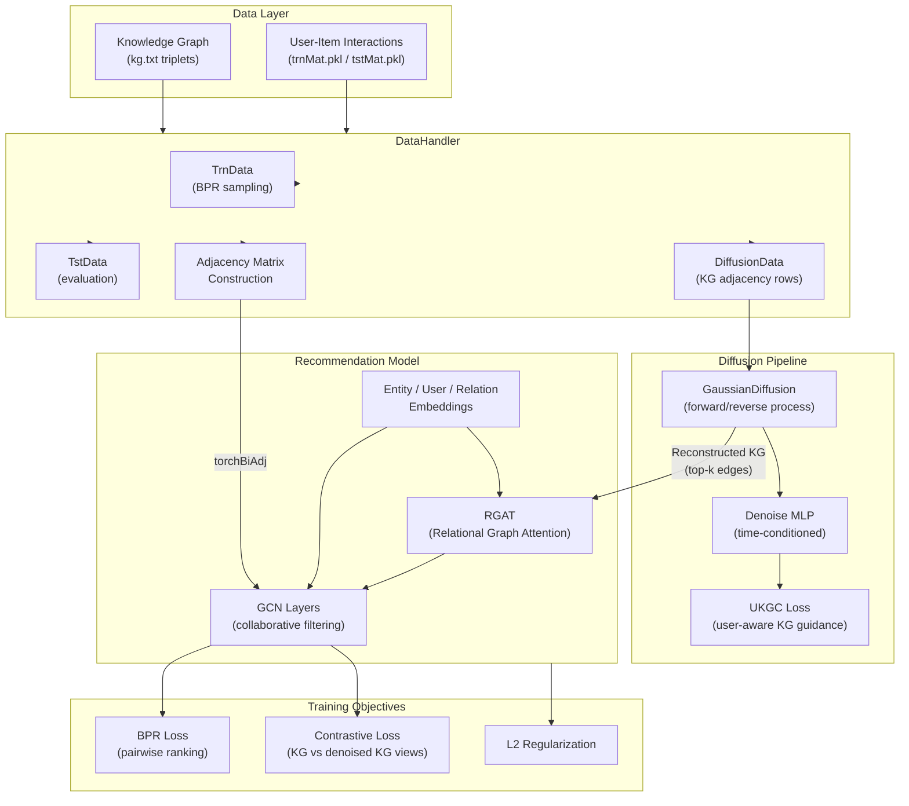
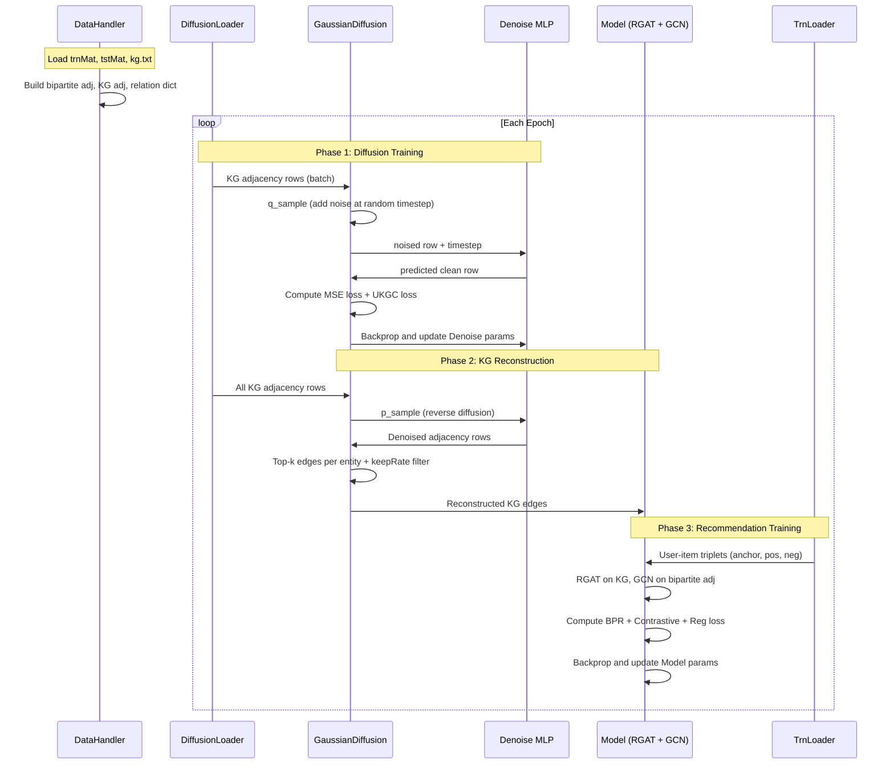

# Project Exploration: DiffKG

## Overview

DiffKG (Knowledge Graph Diffusion Model for Recommendation) is a research implementation accompanying the WSDM 2024 Oral paper by Yangqin Jiang, Yuhao Yang, Lianghao Xia, and Chao Huang from the Hong Kong University of Data Science (HKUDS). The system applies a generative diffusion model to knowledge graph augmentation for collaborative filtering-based recommendation systems.

The core idea is to use a Gaussian diffusion process to denoise and reconstruct knowledge graph (KG) edges, producing an augmented KG that better aligns item-level semantics from the knowledge graph with user-item collaborative signals. This reconstructed KG is then used alongside a standard GCN-based collaborative filtering model, with a contrastive learning objective bridging the original and diffusion-augmented KG representations.

The codebase is compact -- six Python files totaling roughly 500 lines of code -- and is designed for single-GPU training on three benchmark datasets (Last-FM, MIND, Alibaba-iFashion). It has also been integrated into the SSLRec framework for broader comparisons with other self-supervised recommendation methods.

## Repository

- **Location:** `/home/darkvoid/Boxxed/@formulas/src.rust/src.llamacpp/src.HKUSD/DiffKG`
- **Remote:** `git@github.com:HKUDS/DiffKG.git`
- **Primary Language:** Python 3.9 (PyTorch 1.11)
- **License:** Not specified in the repository

## Directory Structure

```
DiffKG/
├── README.md                  # Project documentation, usage instructions, results
├── DiffKG.png                 # Architecture diagram image
├── performance.png            # Experimental results visualization
├── Main.py                    # Entry point: Coach class, training loop, seed setup
├── Model.py                   # Neural network modules: Model, GCNLayer, RGAT, Denoise, GaussianDiffusion
├── Params.py                  # Argument parser with all hyperparameters
├── DataHandler.py             # Data loading, KG parsing, adjacency matrix construction, Dataset classes
├── Utils/
│   ├── TimeLogger.py          # Simple timestamped logging utility
│   └── Utils.py               # Loss functions: BPR, contrastive, regularization helpers
└── Datasets/
    ├── alibaba/
    │   ├── trnMat.pkl          # Training user-item interaction matrix (sparse, pickled)
    │   ├── tstMat.pkl          # Test user-item interaction matrix (sparse, pickled)
    │   └── kg.txt              # Knowledge graph triplets (head, relation, tail)
    ├── lastfm/
    │   ├── trnMat.pkl
    │   ├── tstMat.pkl
    │   └── kg.txt
    └── mind/
        ├── trnMat.pkl
        ├── tstMat.pkl
        └── kg.txt
```

## Architecture

### High-Level Diagram



### Component Breakdown

#### Main.py -- Coach (Training Orchestrator)

- **Location:** `Main.py`
- **Purpose:** Orchestrates the entire training and evaluation pipeline. The `Coach` class manages model initialization, the two-phase training epoch (diffusion training followed by recommendation training), KG reconstruction, and test evaluation.
- **Dependencies:** `Model.py` (Model, Denoise, GaussianDiffusion), `DataHandler.py` (DataHandler), `Params.py` (args), `Utils/Utils.py` (loss functions), `Utils/TimeLogger.py` (logging)
- **Dependents:** None (top-level entry point)
- **Key details:**
  - `seed_it()` ensures reproducibility across random, numpy, and CUDA backends.
  - Each training epoch has two phases: (1) train the diffusion/denoise model on KG rows, (2) reconstruct the KG via `p_sample` and top-k selection, then train the recommendation model with BPR + contrastive loss.
  - The `cl_pattern` flag controls which forward pass uses the denoised KG vs the original KG for contrastive learning views.

#### Model.py -- Model (Recommendation Backbone)

- **Location:** `Model.py`, class `Model`
- **Purpose:** The main recommendation model combining knowledge graph embeddings with collaborative filtering. Holds learnable user embeddings, entity embeddings, and relation embeddings.
- **Dependencies:** `Params.py` (args), `torch_scatter` (scatter_sum, scatter_softmax)
- **Dependents:** `Main.py` (Coach)
- **Key details:**
  - `forward()` first runs RGAT on entity embeddings over the KG, then slices the first `args.item` entity embeddings and concatenates them with user embeddings, passing through GCN layers over the user-item bipartite adjacency.
  - Layer outputs are summed (LightGCN-style aggregation) rather than concatenated.
  - `sampleEdgeFromDict()` optionally limits the number of triplets per head entity via `triplet_num`.

#### Model.py -- RGAT (Relational Graph Attention)

- **Location:** `Model.py`, class `RGAT`
- **Purpose:** Multi-hop relational graph attention network for KG entity representation learning.
- **Dependencies:** `torch_scatter`
- **Dependents:** `Model` class
- **Key details:**
  - Computes attention weights by concatenating head/tail entity embeddings, projecting through a shared weight matrix `W`, element-wise multiplying with relation embeddings, and applying LeakyReLU + scatter_softmax.
  - Supports residual connections controlled by `res_lambda`.
  - Message dropout is applied between hops.

#### Model.py -- GCNLayer (Graph Convolution)

- **Location:** `Model.py`, class `GCNLayer`
- **Purpose:** Simple parameter-free GCN layer performing sparse matrix multiplication on the normalized user-item bipartite graph.
- **Dependencies:** None (uses `torch.spmm`)
- **Dependents:** `Model` class

#### Model.py -- Denoise (Denoising MLP)

- **Location:** `Model.py`, class `Denoise`
- **Purpose:** Time-conditioned MLP that predicts the clean KG adjacency row from a noised version. This is the learned denoiser in the diffusion framework.
- **Dependencies:** None (standard PyTorch modules)
- **Dependents:** `GaussianDiffusion`
- **Key details:**
  - Uses sinusoidal positional embeddings for the diffusion timestep (same scheme as in standard diffusion models).
  - Architecture: `in_layers` (encoder) followed by `out_layers` (decoder), with tanh activations.
  - The input dimension is `entity_n + time_emb_dim`; the output dimension is `entity_n` (predicting a full adjacency row).

#### Model.py -- GaussianDiffusion (Diffusion Process)

- **Location:** `Model.py`, class `GaussianDiffusion`
- **Purpose:** Implements the forward (noising) and reverse (denoising) Gaussian diffusion process over KG adjacency matrix rows.
- **Dependencies:** `Denoise` model
- **Dependents:** `Main.py` (Coach)
- **Key details:**
  - Beta schedule is linear between `noise_scale * noise_min` and `noise_scale * noise_max`, converted to cumulative alpha products.
  - `training_losses()` computes two losses: (1) weighted MSE between predicted and true adjacency (with SNR-based weighting), and (2) UKGC loss -- a user-aware knowledge graph consistency loss that aligns denoised item embeddings with the recommendation model's entity embeddings via the user-item interaction matrix.
  - `p_sample()` runs the full reverse diffusion chain for inference/reconstruction.

#### DataHandler.py -- DataHandler

- **Location:** `DataHandler.py`
- **Purpose:** Loads and preprocesses all data: user-item interaction matrices, knowledge graph triplets, and constructs all required graph structures and data loaders.
- **Dependencies:** `Params.py` (args), scipy, numpy, pickle, torch
- **Dependents:** `Main.py` (Coach), `Model.py` (Model -- receives `handler.kg_dict`)
- **Key details:**
  - Interaction matrices (`trnMat.pkl`, `tstMat.pkl`) are loaded as scipy sparse COO matrices and binarized.
  - KG triplets are read from `kg.txt` (tab-separated: head, relation, tail), deduplicated, and augmented with inverse relations (doubling the relation count).
  - `entity_n` is set to `max(max(heads), max(relations)) + 1` -- note this means the entity embedding table includes relation indices, which is unusual and may be a quirk of the implementation.
  - The bipartite adjacency is symmetrically normalized with self-loops (standard GCN normalization).
  - `DiffusionData` wraps the dense KG adjacency matrix (`kg_matrix.A`), where each row is the adjacency vector for one entity. This is the input to the diffusion model.
  - Three DataLoader instances are created: `trnLoader` (BPR training), `tstLoader` (evaluation), `diffusionLoader` (diffusion training).

#### DataHandler.py -- TrnData, TstData, DiffusionData (Dataset Classes)

- **Location:** `DataHandler.py`
- **Purpose:** PyTorch Dataset wrappers for the three data loading pipelines.
- **Key details:**
  - `TrnData`: Stores COO rows/cols of interactions. `negSampling()` is called each epoch to generate fresh negative samples (uniform random from items not in the user's history).
  - `TstData`: Provides test users with their training mask (for excluding known positives from predictions).
  - `DiffusionData`: Wraps dense KG adjacency rows; each `__getitem__` returns a FloatTensor row and its index.

#### Params.py -- Argument Parser

- **Location:** `Params.py`
- **Purpose:** Defines all hyperparameters via argparse. The `args` object is imported globally across all modules.
- **Dependencies:** None
- **Dependents:** Every other module

#### Utils/Utils.py -- Loss and Helper Functions

- **Location:** `Utils/Utils.py`
- **Purpose:** Provides loss computation utilities used during training.
- **Dependencies:** PyTorch
- **Dependents:** `Main.py`
- **Key functions:**
  - `pairPredict()`: BPR pairwise score difference (anchor dot positive - anchor dot negative).
  - `contrastLoss()`: InfoNCE-style contrastive loss between two embedding views.
  - `calcRegLoss()`: L2 norm squared over all model parameters.
  - `calcReward()` and `calcGradNorm()`: Appear unused in the current codebase (possibly legacy from earlier experiments).

#### Utils/TimeLogger.py -- Logging

- **Location:** `Utils/TimeLogger.py`
- **Purpose:** Simple timestamped console logger with optional message accumulation and single-line overwrite mode.
- **Dependencies:** None
- **Dependents:** `Main.py`

## Entry Points

### Main.py (Primary Entry Point)

- **File:** `Main.py`
- **Description:** Invoked via `python Main.py --data <dataset> [options]`. Sets random seeds, selects GPU, loads data, and runs the training/evaluation loop.
- **Flow:**
  1. `seed_it(args.seed)` -- set all random seeds for reproducibility
  2. Set `CUDA_VISIBLE_DEVICES` from `args.gpu`
  3. `DataHandler().LoadData()` -- load interaction matrices, parse KG triplets, build adjacency structures, create DataLoaders
  4. `Coach(handler).run()` -- enter the training loop:
     - `prepareModel()` -- instantiate `Model`, `GaussianDiffusion`, `Denoise`, and their optimizers
     - For each epoch:
       a. **Diffusion phase**: iterate over `diffusionLoader`, train `Denoise` via `GaussianDiffusion.training_losses()` (MSE + UKGC loss)
       b. **KG reconstruction**: run `p_sample()` on all KG rows, select top-k edges per entity, filter by `keepRate`
       c. **Recommendation phase**: iterate over `trnLoader`, compute user/item embeddings via `Model.forward()` with both original and denoised KG, compute BPR + contrastive loss
       d. **Evaluation** (every `tstEpoch` epochs): compute Recall@K and NDCG@K on test set

## Data Flow



## External Dependencies

| Dependency | Version | Purpose |
|------------|---------|---------|
| python | 3.9.13 | Runtime |
| torch (PyTorch) | 1.11.0 | Deep learning framework, tensor operations, autograd |
| numpy | 1.23.1 | Array operations, data loading |
| scipy | 1.9.1 | Sparse matrix operations (COO, CSR), adjacency construction |
| torch_scatter | (unspecified) | Efficient scatter operations for graph attention (scatter_sum, scatter_softmax) |
| pickle | (stdlib) | Loading serialized interaction matrices |
| tqdm | (unspecified) | Progress bar for KG triplet loading |

## Configuration

All configuration is managed through command-line arguments defined in `Params.py`. The `args` object is instantiated at module import time and used globally.

**Core hyperparameters:**

| Parameter | Default | Description |
|-----------|---------|-------------|
| `--data` | `yelp2018` | Dataset name (`lastfm`, `mind`, `alibaba`) |
| `--lr` | 1e-3 | Learning rate (shared by both optimizers) |
| `--batch` | 1024 | Batch size for recommendation training |
| `--kg_batch` | 4096 | Batch size for KG (unused -- diffusionLoader uses `args.batch`) |
| `--epoch` | 25 | Number of training epochs |
| `--latdim` | 64 | Embedding dimension |
| `--gnn_layer` | 2 | Number of GCN layers |
| `--gpu` | `2` | GPU device ID |

**Diffusion hyperparameters:**

| Parameter | Default | Description |
|-----------|---------|-------------|
| `--steps` | 5 | Number of diffusion timesteps |
| `--noise_scale` | 0.1 | Noise scale multiplier |
| `--noise_min` | 0.0001 | Minimum noise level |
| `--noise_max` | 0.02 | Maximum noise level |
| `--sampling_steps` | 0 | Steps for reverse sampling (0 = no noise added) |
| `--dims` | `[1000]` | Hidden dimensions for Denoise MLP (parsed via `eval()`) |
| `--d_emb_size` | 10 | Time embedding dimension |
| `--norm` | True | Normalize input to Denoise |

**KG and contrastive learning hyperparameters:**

| Parameter | Default | Description |
|-----------|---------|-------------|
| `--rebuild_k` | 1 | Top-k edges to keep per entity in KG reconstruction |
| `--e_loss` | 0.5 | Weight balancing diffusion MSE vs UKGC loss |
| `--keepRate` | 0.5 | Fraction of reconstructed KG edges to retain |
| `--res_lambda` | 0.5 | Residual connection weight in RGAT |
| `--triplet_num` | 10 | Max triplets per head entity (-1 = all) |
| `--cl_pattern` | 0 | Contrastive learning view assignment (0 or 1) |
| `--ssl_reg` | 0.1 | Contrastive loss weight |
| `--temp` | 0.1 | Temperature for contrastive loss |
| `--reg` | 1e-7 | L2 regularization weight |

**Dataset-specific recommended settings** (from README):

- **Last-FM:** `--reg 1e-5 --mess_dropout_rate 0.2 --layer_num_kg 2 --res_lambda 0 --triplet_num -1 --cl_pattern 1 --keepRate 0.1 --e_loss 0.01`
- **MIND:** `--e_loss 0.1 --temp 1 --ssl_reg 1 --mess_dropout_rate 0.4 --res_lambda 1 --keepRate 1`
- **Alibaba:** `--reg 1e-6 --epoch 50 --ssl_reg 1 --temp 1 --keepRate 1`

## Testing

There is no automated test suite. Evaluation is integrated into the training loop:

- **Metrics:** Recall@20 and NDCG@20 (configurable via `--topk`)
- **Evaluation frequency:** Every `tstEpoch` epochs (default: every epoch)
- **Method:** Full-ranking over all items per test user, masking out training interactions, then computing Recall and NDCG on the top-K predictions
- **Best model tracking:** The training loop tracks the best Recall and NDCG across epochs and prints the best epoch at termination. No model checkpointing or saving is implemented.

## Key Insights

- The diffusion model operates on rows of the dense KG adjacency matrix (entity_n x entity_n), which can be very memory-intensive for large knowledge graphs. A prior commit (`c924659`) explicitly addresses "high memory usage" issues.
- The UKGC (User-aware Knowledge Graph Consistency) loss is a distinctive contribution: it uses the user-item interaction matrix to propagate denoised KG signals through user embeddings, creating alignment between the diffusion model's output and the recommendation model's learned representations.
- The `cl_pattern` flag flips which view (original KG vs denoised KG) is treated as the anchor vs positive in contrastive learning, effectively controlling the direction of knowledge transfer.
- `entity_n` is computed as `max(max(entity_ids), max(relation_ids)) + 1`, meaning the entity embedding table is sized to include relation indices. This is unusual and means relation IDs and entity IDs share index space in the adjacency matrix -- this appears to be a side effect of how `readTriplets` computes the value rather than a deliberate design choice.
- The `dims` parameter is parsed via `eval()`, which is a security concern in production but acceptable for a research prototype.
- `calcReward()` and `calcGradNorm()` in `Utils.py` are unused in the current codebase, likely remnants of earlier experimental variants.
- `kg_batch` is defined in `Params.py` but never referenced in the actual data loading -- `diffusionLoader` uses `args.batch` instead.
- No model saving/loading is implemented despite `save_path` and `load_model` arguments existing in `Params.py`.
- The project is also available through the SSLRec framework (`github.com/HKUDS/SSLRec`) for systematic comparisons with other KG-enhanced recommendation methods.

## Open Questions

- **Memory scaling:** The `DiffusionData` class converts the KG sparse adjacency to a dense matrix (`.A`). For knowledge graphs with hundreds of thousands of entities, this becomes prohibitively large. How does this scale beyond the provided datasets?
- **Entity/relation index overlap:** The `entity_n` calculation includes relation IDs in its max computation. Is this intentional for some embedding sharing scheme, or is it an implementation artifact?
- **Unused parameters:** `kg_batch`, `save_path`, `load_model` are defined but never used. Were these planned features that were never completed?
- **Inverse relation strategy:** Inverse triplets are created with relation IDs offset by `max_relation + 1`. How sensitive is the model to this particular augmentation versus other KG augmentation strategies?
- **Reproducibility note:** The README states results may differ from the paper due to bug fixes in the training code (`f2e9910`). What specific bugs were fixed and how much do results diverge?
