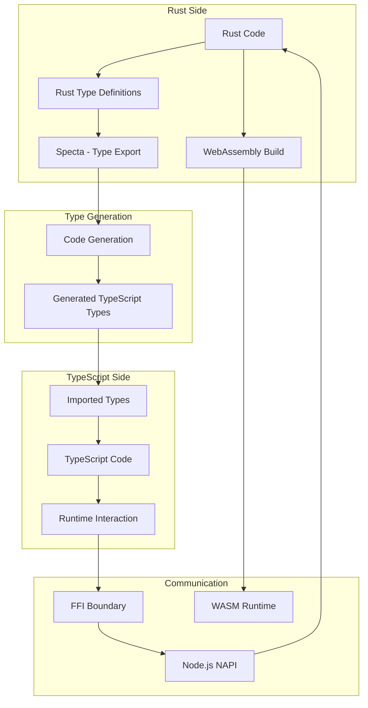
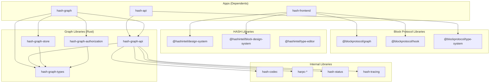
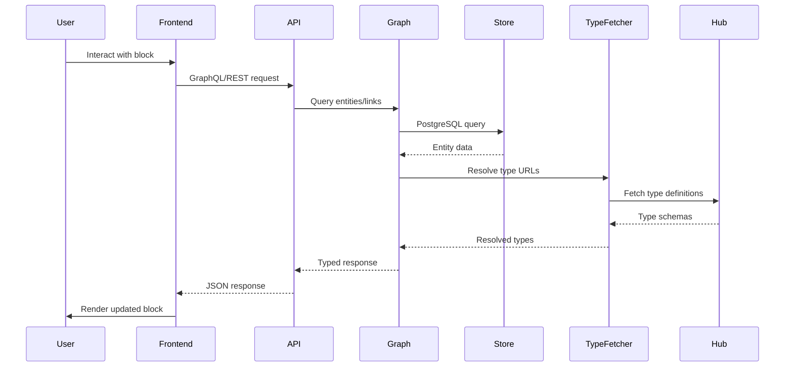

# Project Exploration: HashIntel Ecosystem

## Overview

HashIntel is a comprehensive knowledge management platform built around the **Block Protocol**, an open standard for building, using, and embedding data-driven blocks. The ecosystem consists of multiple repositories organized under a common structure, with HASH being the flagship application - described as a "self-building, open-source database which grows, structures and checks itself."

The core innovation is the **Block Protocol**, which allows blocks (reusable UI components) to communicate with embedding applications through a standardized interface. Blocks are self-contained components that can display and interact with typed data, and they can be discovered and embedded dynamically from the Hub (blockprotocol.org). HASH leverages this protocol to provide a flexible, AI-augmented knowledge management system where intelligent agents can integrate and structure information from multiple sources.

The platform is built with a hybrid architecture combining **Rust** for performance-critical backend services (particularly the Graph database layer) and **TypeScript/JavaScript** for frontend applications and block components. This dual-language approach leverages Rust's safety and performance for core infrastructure while using TypeScript's ecosystem for rapid UI development.

## Repository

- **Location:** /home/darkvoid/Boxxed/@formulas/src.HashIntel
- **Remote:** N/A - appears to be a submodule or subdirectory copy
- **Primary Languages:** Rust, TypeScript, JavaScript
- **License:** AGPL-3.0 (main), MIT/Apache-2.0 dual license for many components

## Directory Structure

```
/home/darkvoid/Boxxed/@formulas/src.HashIntel/
├── awesome-blocks/           # Curated list of Block Protocol resources
│   ├── README.md             # Awesome list with environments, resources, libraries
│   ├── CONTRIBUTING.md
│   └── .github/
├── awesome-hash/             # Curated HASH-related resources
│   ├── README.md
│   ├── CONTRIBUTING.md
│   └── .github/
├── blockprotocol/            # Block Protocol specification and tools
│   ├── README.md             # Block Protocol documentation
│   ├── apps/
│   │   └── site/             # blockprotocol.org website
│   │       ├── public/       # Assets, fonts, logos
│   │       └── src/          # Site source code
│   ├── blocks/               # Block Protocol maintained blocks
│   │   └── feature-showcase/ # Reference implementation block
│   ├── libs/                 # Block Protocol libraries
│   │   ├── @blockprotocol/   # Core protocol packages
│   │   │   ├── core/         # Core specification implementation
│   │   │   ├── graph/        # Graph module for block-graph communication
│   │   │   ├── hook/         # Hook module for reactive data binding
│   │   │   └── type-system/  # Type system (Rust + TypeScript/WASM)
│   │   ├── block-scripts/    # Build scripts for blocks
│   │   ├── block-template-*/ # Starter templates for new blocks
│   │   ├── create-block-app/ # CLI tool for creating blocks
│   │   ├── mock-block-dock/  # Mock embedding app for testing
│   │   └── wordpress-plugin/ # WordPress integration
│   └── .github/
├── hash/                     # MAIN MONOREPO - HASH application
│   ├── README.md             # Comprehensive setup and usage guide
│   ├── CLAUDE.md             # Development guidelines
│   ├── Cargo.toml            # Rust workspace definition
│   ├── package.json          # Yarn workspace root
│   ├── turbo.json            # Turborepo configuration
│   ├── biome.jsonc           # Biome formatter/linter config
│   ├── yarn.lock             # Yarn lockfile
│   ├── Cargo.lock            # Cargo lockfile
│   ├── .env*                 # Environment configuration files
│   ├── apps/                 # Core applications
│   │   ├── hash-api/         # Backend API service (TypeScript)
│   │   ├── hash-frontend/    # Web frontend (Next.js)
│   │   ├── hash-graph/       # Graph database service (Rust)
│   │   ├── hash-external-services/  # Docker configs for deps
│   │   ├── hash-ai-worker-ts/       # AI processing workers
│   │   ├── hash-integration-worker/ # External integration sync
│   │   ├── hash-realtime/    # Real-time synchronization service
│   │   ├── hash-search-loader/       # OpenSearch indexing
│   │   ├── plugin-browser/   # Browser extension
│   │   └── mcp/              # Model Context Protocol integrations
│   ├── blocks/               # HASH-developed Block Protocol blocks
│   │   ├── address/          # Address display block
│   │   ├── ai-chat/          # AI chat interface block
│   │   ├── ai-image/         # AI image generation block
│   │   ├── ai-text/          # AI text generation block
│   │   ├── callout/          # Callout/annotation block
│   │   ├── chart/            # Data visualization block
│   │   ├── code/             # Code display/editing block
│   │   ├── countdown/        # Countdown timer block
│   │   ├── divider/          # Visual divider block
│   │   ├── embed/            # External content embed block
│   │   ├── faq/              # FAQ section block
│   │   ├── heading/          # Heading/section title block
│   │   ├── how-to/           # Step-by-step instructions block
│   │   ├── image/            # Image display block
│   │   ├── kanban-board/     # Kanban board block
│   │   ├── minesweeper/      # Game block (demo)
│   │   ├── paragraph/        # Text paragraph block
│   │   ├── person/           # Person/entity block
│   │   ├── shuffle/          # Randomization block
│   │   ├── table/            # Data table block
│   │   ├── timer/            # Timer block
│   │   └── video/            # Video embed block
│   ├── libs/                 # Shared libraries
│   │   ├── @blockprotocol/   # Block Protocol libs (mirrored)
│   │   │   ├── graph/        # Graph module TypeScript
│   │   │   └── type-system/  # Type system (Rust + TS)
│   │   ├── @hashintel/       # HASH-specific libraries
│   │   │   ├── block-design-system/  # UI primitives for blocks
│   │   │   ├── design-system/        # UI primitives for HASH
│   │   │   ├── query-editor/         # Query editing UI
│   │   │   └── type-editor/          # Type definition UI
│   │   ├── @local/           # Internal monorepo libraries
│   │   │   ├── codec/        # Serde/byte codecs (Rust)
│   │   │   ├── codegen/      # Code generation utilities
│   │   │   ├── effect-dns/   # DNS resolution effects
│   │   │   ├── eslint/       # Custom ESLint config
│   │   │   ├── graph/        # Graph-related libraries
│   │   │   │   ├── api/             # REST API definitions
│   │   │   │   ├── authorization/   # Authorization logic
│   │   │   │   ├── client/          # TypeScript graph client
│   │   │   │   ├── migrations/      # Database migrations
│   │   │   │   ├── postgres-store/  # PostgreSQL storage
│   │   │   │   ├── sdk/             # TypeScript SDK
│   │   │   │   ├── store/           # Store interface
│   │   │   │   ├── temporal-versioning/  # Temporal versioning
│   │   │   │   ├── test-server/     # Test utilities
│   │   │   │   ├── type-defs/       # Type definitions
│   │   │   │   ├── type-fetcher/    # Type fetching from web
│   │   │   │   ├── types/           # Graph types
│   │   │   │   └── validation/      # Data validation
│   │   │   ├── harpc/        # HASH RPC framework
│   │   │   │   ├── client/   # RPC client
│   │   │   │   ├── codec/    # RPC codecs
│   │   │   │   ├── net/      # Network layer
│   │   │   │   ├── server/   # RPC server
│   │   │   │   ├── system/   # System utilities
│   │   │   │   ├── tower/    # Tower integration
│   │   │   │   ├── types/    # RPC types
│   │   │   │   ├── wire-protocol/  # Wire protocol
│   │   │   │   └── client/typescript/  # TS RPC client
│   │   │   ├── hashql/       # HASH query language
│   │   │   │   ├── ast/      # AST definitions
│   │   │   │   ├── core/     # Core implementation
│   │   │   │   ├── hir/      # High-level IR
│   │   │   │   └── ...
│   │   │   ├── status/       # Status/error types
│   │   │   ├── temporal-client/  # Temporal.io client
│   │   │   ├── tracing/      # Tracing instrumentation
│   │   │   └── tsconfig/     # TypeScript config
│   │   ├── antsi/            # ANSI terminal coloring (Rust)
│   │   ├── chonky/           # File chunking/embedding (Rust)
│   │   ├── deer/             # Deserialization framework (Rust)
│   │   │   ├── desert/       # Default values
│   │   │   ├── json/         # JSON deserialization
│   │   │   └── macros/       # Derive macros
│   │   ├── error-stack/      # Error handling library (Rust)
│   │   │   └── macros/       # Error macros
│   │   └── sarif/            # SARIF representation (Rust)
│   ├── tests/                # Test suites
│   │   └── graph/
│   │       ├── benches/      # Benchmarks
│   │       ├── integration/  # Integration tests
│   │       └── test-data/    # Test fixtures
│   ├── infra/                # Deployment infrastructure
│   │   ├── docker/           # Docker configurations
│   │   └── terraform/        # Terraform IaC
│   ├── content/              # Website content (docs, glossary)
│   ├── .github/              # GitHub workflows and configs
│   ├── .cursor/              # Cursor IDE configuration
│   │   └── rules/            # AI coding guidelines
│   └── .config/              # Development tool configs
│       ├── mise/             # mise-en-place tool management
│       └── examples/         # IDE configuration examples
├── labs/                     # Experimental projects
│   └── ...
└── .github/                  # Organization-level configs
    ├── profile/
    │   └── README.md         # Organization README
    └── ...
```

## Architecture

### High-Level System Architecture

```mermaid
graph TB
    subgraph "HashIntel Ecosystem"
        subgraph "blockprotocol/"
            BP_SPEC[Block Protocol Spec]
            BP_LIBS[Block Protocol Libraries]
            BP_BLOCKS[Reference Blocks]
            BP_HUB[Þ Hub - blockprotocol.org]
        end

        subgraph "hash/ (Main Monorepo)"
            subgraph "Frontend Layer"
                FRONTEND[hash-frontend<br/>Next.js App]
                BLOCKS[HASH Blocks]
                PLUGIN[Browser Plugin]
            end

            subgraph "API Layer"
                API[hash-api<br/>TypeScript Backend]
                AI_WORKER[AI Worker]
                INTEGRATION[Integration Worker]
            end

            subgraph "Graph Layer (Rust)"
                GRAPH[hash-graph<br/>Graph Database]
                AUTH[Authorization]
                STORE[PostgreSQL Store]
                TYPE_FETCH[Type Fetcher]
            end

            subgraph "Support Services"
                REALTIME[Real-time Sync]
                SEARCH[Search Loader]
                EXTERNAL[External Services]
            end

            subgraph "Shared Libraries"
                BP_GRAPH["@blockprotocol/graph"]
                BP_TYPES["@blockprotocol/type-system"]
                LOCAL_LIBS[@local/* libraries]
                HARPC[harpc RPC]
                HASHQL[hashql Query Language]
            end
        end

        subgraph "awesome-*"
            AWESOME_BLOCKS[awesome-blocks]
            AWESOME_HASH[awesome-hash]
        end
    end

    FRONTEND --> API
    API --> GRAPH
    BLOCKS --> BP_GRAPH
    GRAPH --> STORE
    GRAPH --> AUTH
    GRAPH --> TYPE_FETCH
    TYPE_FETCH --> BP_HUB
    API --> AI_WORKER
    API --> INTEGRATION
    API --> REALTIME
    API --> SEARCH
    BP_LIBS --> BP_SPEC
    BP_BLOCKS --> BP_LIBS
```

### Block Protocol Architecture

```mermaid
graph LR
    subgraph "Block Protocol Stack"
        subgraph "Embedding Application"
            APP[Application<br/>e.g., HASH, WordPress]
            APP_MODULE[Block Protocol<br/>Module Implementation]
        end

        subgraph "Communication Layer"
            PROTOCOL[Block Protocol<br/>Specification]
            CORE[@blockprotocol/core]
        end

        subgraph "Blocks"
            BLOCK[Block Component]
            BLOCK_META[block-metadata.json]
            BLOCK_SCHEMA[block-schema.json]
            BLOCK_CODE[Block Implementation]
        end

        subgraph "Type System"
            TYPE_SYS[Type System<br/>Rust -> WASM -> TypeScript]
            ENTITY_TYPES[Entity Types]
            PROPERTY_TYPES[Property Types]
        end

        subgraph "Hub"
            HUB[Þ Hub<br/>blockprotocol.org]
            REGISTRY[Block Registry]
            TYPE_REGISTRY[Type Registry]
        end
    end

    APP --> APP_MODULE
    APP_MODULE --> CORE
    CORE --> PROTOCOL
    BLOCK --> CORE
    BLOCK --> BLOCK_META
    BLOCK --> BLOCK_SCHEMA
    BLOCK --> TYPE_SYS
    APP_MODULE --> TYPE_SYS
    BLOCK --> HUB
    APP --> HUB
    TYPE_SYS --> HUB
```

### Rust + TypeScript Interop Pattern



### Monorepo Package Relationships



## Component Breakdown

### Applications (apps/)

| Application | Language | Purpose | Entry Point |
|-------------|----------|---------|-------------|
| **hash-api** | TypeScript | Main backend API service | `src/index.ts` |
| **hash-frontend** | TypeScript (Next.js) | Web application UI | `src/pages/` |
| **hash-graph** | Rust | Graph database with REST/RPC API | `src/main.rs` |
| **hash-external-services** | Docker | PostgreSQL, Redis, Temporal, etc. | `docker-compose.yml` |
| **hash-ai-worker-ts** | TypeScript | AI processing workflows | Temporal workers |
| **hash-integration-worker** | TypeScript | External app sync (2-way) | Queue processor |
| **hash-realtime** | TypeScript | Real-time synchronization | WebSocket server |
| **hash-search-loader** | TypeScript | OpenSearch indexing | Queue processor |
| **plugin-browser** | TypeScript | Browser extension | Extension manifest |

### Blocks (blocks/)

Each block is a self-contained React component following the Block Protocol:

| Block | Description | Dependencies |
|-------|-------------|--------------|
| **paragraph** | Text content display/edit | @blockprotocol/graph, @blockprotocol/hook |
| **ai-chat** | AI conversation interface | Graph module, AI APIs |
| **ai-text** | AI text generation | Graph module, AI APIs |
| **ai-image** | AI image generation | Graph module, AI APIs |
| **table** | Data table visualization | Graph module |
| **kanban-board** | Kanban project management | Graph module |
| **chart** | Data visualization | Graph module, charting lib |
| **image** | Image display | Graph module |
| **video** | Video embed | Graph module |
| **code** | Code display/editing | Graph module, code editor |
| **heading** | Section headings | Graph module |
| **callout** | Annotations/highlights | Graph module |
| **address** | Address display | Graph module |
| **person** | Person/entity cards | Graph module |
| **divider** | Visual separators | Graph module |
| **faq** | FAQ sections | Graph module |
| **how-to** | Step-by-step guides | Graph module |
| **countdown/timer** | Time-based displays | Graph module |
| **embed** | External content | Graph module |
| **minesweeper** | Game (demo) | Graph module |
| **shuffle** | Randomization | Graph module |

### Graph Libraries (libs/@local/graph/)

| Crate | Purpose | Key Types |
|-------|---------|-----------|
| **hash-graph-api** | REST/RPC API definitions | Route handlers, OpenAPI specs |
| **hash-graph-store** | PostgreSQL storage backend | Entity storage, link storage |
| **hash-graph-authorization** | Authorization logic | Cedar policy integration |
| **hash-graph-types** | Core graph type definitions | Entity, Link, EntityType, PropertyType |
| **hash-graph-validation** | Data validation | Schema validation, type checking |
| **hash-graph-temporal-versioning** | Historical versioning | Temporal intervals, versioned data |
| **hash-graph-type-fetcher** | Fetch types from web | HTTP client, type resolution |
| **hash-graph-migrations** | Database migrations | Refinery integration |
| **hash-graph-test-server** | Testing utilities | Test server, fixtures |

### HARPC RPC Framework (libs/@local/harpc/)

HASH's internal RPC framework, similar to gRPC but customized:

| Crate | Purpose |
|-------|---------|
| **harpc-types** | Core type definitions |
| **harpc-codec** | Message encoding/decoding |
| **harpc-net** | Network transport layer |
| **harpc-server** | Server implementation |
| **harpc-client** | Rust client implementation |
| **harpc-tower** | Tower service integration |
| **harpc-wire-protocol** | Wire format definitions |
| **harpc-system** | System-level utilities |

### hashql Query Language (libs/@local/hashql/)

A custom query language for graph queries:

| Crate | Purpose |
|-------|---------|
| **hashql-ast** | Abstract syntax tree definitions |
| **hashql-hir** | High-level intermediate representation |
| **hashql-core** | Core query language implementation |
| **hashql-diagnostics** | Error diagnostics |
| **hashql-syntax-jexpr** | JExpr syntax support |
| **hashql-compiletest** | Compilation testing |

## Entry Points

### hash-graph (Rust)

```
apps/hash-graph/src/main.rs
    └── CLI interface via `just` commands
        ├── just run server    # Start graph server
        ├── just run migrate   # Run database migrations
        ├── just test          # Run test suites
        └── just bench         # Run benchmarks

Server initialization:
    ├── Initialize tracing/logging
    ├── Connect to PostgreSQL
    ├── Run migrations
    ├── Initialize authorization (SpiceDB)
    ├── Start HTTP server (port 4000)
    ├── Start RPC server (port 4002)
    └── Start type-fetcher service
```

### hash-api (TypeScript)

```
apps/hash-api/src/index.ts
    └── Express/Fastify server initialization
        ├── Initialize database connections
        ├── Load middleware (auth, tracing)
        ├── Register routes
        ├── Start Temporal workers
        ├── Connect to hash-graph
        └── Start listening (port 5001)
```

### hash-frontend (Next.js)

```
apps/hash-frontend/src/pages/
    ├── _app.tsx          # App wrapper with providers
    ├── index.tsx         # Home/dashboard
    ├── /[shortname]/     # User/workspace pages
    │   └── types/        # Type editor pages
    │   └── entities/     # Entity browser
    └── api/              # API routes

Build process:
    ├── codegen           # Generate types from graph
    ├── next build        # Production build
    └── next start        # Production server
```

### Block Development

```
blocks/{block-name}/
    ├── package.json      # Block metadata + scripts
    ├── src/
    │   ├── app.tsx       # Main block component
    │   ├── dev.tsx       # Development wrapper
    │   └── property-ids.ts  # Property type IDs
    ├── blockprotocol/    # Block Protocol config
    └── public/           # Assets

Commands:
    yarn workspace @blocks/{name} dev    # Development server
    yarn workspace @blocks/{name} build  # Production build
    yarn workspace @blocks/{name} serve  # Serve built block
```

## Data Flow



## External Dependencies

### Rust Crates (Key Workspace Dependencies)

| Crate | Version | Purpose |
|-------|---------|---------|
| **axum** | 0.7.5 | Web framework |
| **tokio** | 1.45.0 | Async runtime |
| **serde** | 1.0.219 | Serialization |
| **serde_json** | 1.0.140 | JSON handling |
| **postgres-types** | 0.2.9 | PostgreSQL types |
| **deadpool-postgres** | 0.14.1 | Connection pooling |
| **tracing** | 0.1.41 | Observability |
| **error-stack** | workspace | Error handling |
| **uuid** | 1.16.0 | UUID generation |
| **url** | 2.5.4 | URL parsing |
| **specta** | 2.0.0-rc.22 | TypeScript type export |
| **tsify-next** | 0.5.6 | WASM TypeScript bindings |
| **cedar-policy-core** | 4.4.0 | Authorization policies |
| **libp2p** | 0.55.0 | Peer-to-peer networking |
| **temporal-client** | git | Temporal.io workflow client |
| **opentelemetry** | 0.29.1 | Observability |
| **sentry** | 0.37.0 | Error reporting |
| **criterion** | 0.5.1 | Benchmarking |

### npm Packages (Key Dependencies)

| Package | Version | Purpose |
|---------|---------|---------|
| **react** | 19.1.0 | UI framework |
| **next** | (via Next.js) | React framework |
| **@blockprotocol/graph** | 0.3.4 | Graph module |
| **@blockprotocol/hook** | 0.1.3 | Hook module |
| **@blockprotocol/type-system** | 0.1.2 | Type system |
| **turbo** | (via Turborepo) | Build system |
| **biome** | 1.9.4 | Formatter/linter |
| **eslint** | 9.20.1 | Linting |
| **typescript** | 5.7.3 | Type checking |
| **vitest** | 3.1.3 | Testing |
| **changesets** | 2.26.0 | Version management |

## Configuration

### turbo.json (Build System)

The Turborepo configuration defines task dependencies and caching:

- **dev**: Persistent development mode, depends on `codegen`
- **build**: Production build, depends on `codegen` and `^build`
- **codegen**: Code generation, depends on `^build`
- **test:unit**: Unit tests with coverage support
- **test:integration**: Integration tests requiring services
- **lint:eslint**, **lint:tsc**: Type checking and linting
- **start**: Production startup with migrations

Global dependencies trigger full rebuilds when changed:
- All `turbo.json` files
- `.github/` workflows and scripts
- Dotfiles and configs (`.cargo/`, `.config/`, `.yarn/`)
- Lock files and manifests

### biome.jsonc (Code Formatting)

- 2-space indentation, 80 char line width
- LF line endings
- Double quotes for JSX
- Trailing commas: all
- Semicolons: always
- Organize imports: disabled (waiting for Biome 2)

### Cargo.toml (Rust Workspace)

Key workspace settings:
- Edition: 2024 (latest)
- License: AGPL-3
- Resolver: 3 (MSRV-aware)
- Lints: Comprehensive clippy restrictions

Profile configuration:
- **dev**: Cranelift backend (faster compiles)
- **dev-llvm**: LLVM backend for debugging
- **test**: LLVM for compatibility
- **coverage**: LLVM for coverage instrumentation
- **production**: LTO + no strip

### Environment Variables

Key environment configuration (from `.env`):

| Variable | Default | Purpose |
|----------|---------|---------|
| **FRONTEND_URL** | http://localhost:3000 | Frontend origin |
| **API_ORIGIN** | http://localhost:5001 | API origin |
| **POSTGRES_*** | postgres/postgres:5432 | Database connection |
| **HASH_GRAPH_*** | graph/graph:4000 | Graph service config |
| **HASH_REDIS_*** | localhost:6379 | Redis connection |
| **HASH_TEMPORAL_*** | localhost:7233 | Temporal.io config |
| **HASH_SPICEDB_*** | localhost:50051 | Authorization (Cedar) |
| **HASH_VAULT_*** | localhost:8200 | Secrets management |
| **HASH_OPENSEARCH_*** | localhost:9200 | Search (disabled by default) |
| **HASH_TELEMETRY_*** | disabled | Usage analytics |

### mise Configuration

Tool versions managed via mise-en-place:
- Rust toolchain from `rust-toolchain.toml`
- Node.js v22+
- Python for scripts
- Various CLI tools (just, cargo-nextest, etc.)

## Testing Strategy

### Test Types

1. **Unit Tests** (`test:unit`)
   - Rust: `cargo nextest run --package <pkg>`
   - TypeScript: `vitest --run`
   - Isolated, fast, no external dependencies

2. **Integration Tests** (`test:integration`)
   - Require external services (PostgreSQL, Redis, etc.)
   - Started via `yarn external-services:test up`
   - Full stack testing

3. **End-to-End Tests** (`test:playwright`)
   - Playwright browser automation
   - Full user journey testing

4. **Benchmarks** (`bench:unit`, `bench:integration`)
   - Criterion for Rust
   - Setup cost significant, databases not cleaned between runs

5. **Miri Tests** (`test:miri`)
   - Rust undefined behavior detection
   - For unsafe code verification

### Test Infrastructure

```
tests/graph/
├── benches/              # Criterion benchmarks
├── integration/          # Integration test suites
└── test-data/
    └── rust/             # Shared test fixtures
```

### Coverage

- Rust: `cargo llvm-cov` (requires LLVM profile)
- TypeScript: `vitest --coverage` (Istanbul)
- Environment: `TEST_COVERAGE=1` enables coverage

## Key Insights

### Architecture Insights

1. **Hybrid Language Design**: Rust powers performance-critical infrastructure (Graph database, type system WASM), while TypeScript handles application logic and UI. This leverages Rust's safety for core systems and TypeScript's ecosystem for rapid development.

2. **Block Protocol as Foundation**: Everything in HASH is built around blocks. The Block Protocol provides a clean abstraction where blocks are completely decoupled from their embedding context, communicating only through well-defined interfaces.

3. **Type-System Centric**: The type system (implemented in Rust, compiled to WASM, exported to TypeScript) is the single source of truth. All data in HASH is strongly typed, and types can be fetched from the web at runtime.

4. **Graph-Native Storage**: Data is stored as entities and links in a graph structure with temporal versioning. Every change is tracked historically, enabling time-travel queries and audit trails.

5. **Authorization via SpiceDB/Cedar**: Fine-grained authorization is implemented using Cedar policies, with SpiceDB as the policy evaluation engine.

6. **RPC Framework (HARPC)**: Custom RPC framework optimized for HASH's needs, sitting between services for efficient communication.

7. **Query Language (hashql)**: Custom query language for expressing complex graph queries, with proper AST, HIR, and diagnostics.

### Development Insights

1. **Justfile over Make**: Uses `just` (modern make alternative) for Rust tasks, providing better error messages and UX.

2. **mise for Tool Management**: Uses mise-en-place instead of asdf/nvm for consistent tool versions across the team.

3. **Turborepo for Orchestration**: Turborepo manages task dependencies and caching across the monorepo, with careful global dependency tracking.

4. **Biome for Formatting**: Migrated to Biome (formerly Rome) for faster formatting/linting, though ESLint still used for some rules.

5. **Changesets for Publishing**: TypeScript packages use Changesets for version management and publishing.

6. **Cursor IDE Integration**: Extensive `.cursor/rules/` for AI-assisted development guidelines.

### Block Protocol Specifics

1. **Three Modules**:
   - **Core**: Basic block lifecycle and messaging
   - **Graph**: Data entity/link operations
   - **Hook**: Reactive data binding

2. **Block Structure**: Each block has metadata (block-metadata.json), schema (block-schema.json), and implementation (React/JS component).

3. **Type Integration**: Blocks declare entity types they work with, and the Block Protocol generates TypeScript types automatically.

4. **Mock Block Dock**: Lightweight embedding application for testing blocks in isolation.

## Open Questions

1. **Type Fetcher Security**: How does the type-fetcher validate fetched types from arbitrary URLs? What's the trust model for external type definitions?

2. **Authorization Granularity**: How fine-grained can Cedar policies get? Can authorization be specified at the property level within entities?

3. **Block Protocol Versioning**: The blocks show various spec targets (0.1, 0.2, 0.3). What's the migration path between versions?

4. **Self-Hosted vs. Hosted**: What features are specific to hosted HASH vs. self-hosted instances? The `SELF_HOSTED_HASH` flag suggests significant differences.

5. **OpenSearch Status**: OpenSearch is disabled by default and "unmaintained" - what's the search strategy going forward?

6. **MCP Integration**: The `apps/mcp/` directory contains Linear and Notion integrations. What's the scope of Model Context Protocol support?

7. **Rust 2024 Edition**: The workspace uses `edition = "2024"` - this is a very new/preview edition. What features does it leverage?

8. **Cranelift vs. LLVM**: The project uses Cranelift for dev builds but LLVM for tests/release. Are there specific performance characteristics driving this?

9. **harpc vs. gRPC/tonic**: What specific requirements led to building a custom RPC framework instead of using gRPC?

10. **Temporal Workflows**: What workflows are implemented in the Temporal workers? How are failures and retries handled?

11. **Block Publishing**: How are blocks published to the Hub? What's the review/approval process for `@hash` namespace blocks?

12. **AI Features**: What AI capabilities are implemented? Which models are supported beyond OpenAI and Anthropic?
