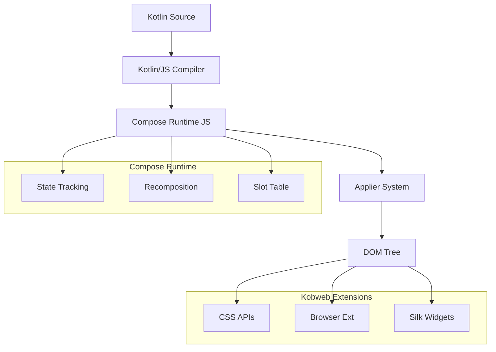

# Deep Dive: Compose HTML Integration

## Overview

This deep dive examines how Kobweb leverages JetBrains Compose HTML to provide declarative UI components in the browser. We explore the Compose runtime, Modifier system, CSS APIs, and how Kotlin code compiles to efficient DOM operations.

## Compose HTML Architecture



## Compose Runtime Fundamentals

### Compiler Transformation

```kotlin
// Source code
@Composable
fun Greeting(name: String) {
    Column {
        Text("Hello, $name!")
        Text("Welcome to Kobweb")
    }
}

// Transformed by Compose compiler
fun Greeting(name: String, %composer: Composer?, %changed: Int) {
    %composer = %composer.startRestartGroup(token)
    
    if (isTraceInProgress()) traceEventStart(token, %changed, -1, token)
    
    // Create or update Column
    Column(
        modifier = Modifier,
        contentAlignment = Alignment.TopStart,
        %composer = %composer,
        %changed = 0
    ) {
        // Create or update first Text
        Text(
            text = "Hello, $name!",
            modifier = Modifier,
            %composer = %composer,
            %changed = 0
        )
        
        // Create or update second Text
        Text(
            text = "Welcome to Kobweb",
            modifier = Modifier,
            %composer = %composer,
            %changed = 0
        )
    }
    
    %composer.endRestartGroup()?.updateScope { name: String, %changed: Int ->
        Greeting(name, %composer, %changed)
    }
    
    if (isTraceInProgress()) traceEventEnd()
}
```

### Slot Table and Recomposition

```kotlin
// Compose maintains a slot table for memoization

// Initial composition:
// Slot Table:
// [Column, [Text("Hello, Alice")], [Text("Welcome")]]

// After state change (name = "Bob"):
// Slot Table:
// [Column, [Text("Hello, Bob!")], [Text("Welcome")]]
// Only first Text recomposes, second Text is skipped

@Composable
fun Greeting(name: String) {
    var count by remember { mutableStateOf(0) }
    
    // This recomposes when name changes
    Text("Hello, $name!")
    
    // This also recomposes when count changes
    Text("Clicks: $count")
    
    // This NEVER recomposes (stable inputs)
    Text("Static text")
}
```

### State and Recomposition

```kotlin
@Composable
fun Counter() {
    // State holder - triggers recomposition on change
    var count by remember { mutableStateOf(0) }
    
    // This Text reads count, becomes "invalid" when count changes
    Text("Count: $count")  // Recomposes when count changes
    
    // This Button doesn't read count, won't recompose unnecessarily
    Button(onClick = { count++ }) {
        Text("Increment")
    }
}

// Under the hood:
// 1. mutableStateOf creates a StateObject
// 2. Reading state.value registers read observer
// 3. Writing state.value notifies observers
// 4. Compose schedules recomposition for affected scopes
```

## DOM Applier System

### Applier Implementation

```kotlin
// kobweb-browser-ext/src/jsMain/kotlin/com/varabyte/kobweb/browser/HtmlApplier.kt

class HtmlApplier(
    private val container: HTMLElement
) : Applier<Node> {
    private val nodeStack = ArrayDeque<Node>()
    
    override val current: Node
        get() = nodeStack.last()
    
    override fun onBeginNode(node: Node) {
        // Append new node to parent
        val parent = current
        when (parent) {
            is HTMLElement -> parent.appendChild(node as HTMLElement)
            is DocumentFragment -> parent.appendChild(node as HTMLElement)
        }
        nodeStack.addLast(node)
    }
    
    override fun onEndNode() {
        nodeStack.removeLast()
    }
    
    override fun insertBottomUp(index: Int, node: Node) {
        val parent = current as HTMLElement
        if (index < parent.children.length) {
            parent.insertBefore(node as HTMLElement, parent.children[index])
        } else {
            parent.appendChild(node as HTMLElement)
        }
    }
    
    override fun remove(index: Int, count: Int) {
        val parent = current as HTMLElement
        repeat(count) {
            parent.removeChild(parent.children[index])
        }
    }
    
    override fun move(from: Int, to: Int, count: Int) {
        val parent = current as HTMLElement
        repeat(count) {
            val node = parent.children[from]
            parent.insertBefore(node, parent.children[to])
        }
    }
}
```

### Node Creation

```kotlin
// kobweb-compose-html/src/jsMain/kotlin/org/jetbrains/compose/web/dom/Elements.kt

@Composable
fun Div(
    attrs: AttrBuilderContext<HTMLDivElement>? = null,
    content: ContentBuilder<HTMLDivElement>? = null
) {
    val factory = remember {
        ElementNodeFactory<HTMLDivElement> { contentScope ->
            Document.createElement("div").unsafeCast<HTMLDivElement>().apply {
                contentScope(this)
            }
        }
    }
    
    NodeFactoryProvider(factory) {
        ApplyAttributes(factory.current, attrs)
        content?.invoke(factory.current)
    }
}

@Composable
fun Text(
    text: String,
    attrs: AttrBuilderContext<Text>? = null
) {
    val factory = remember {
        ElementNodeFactory<Text> { contentScope ->
            Document.createTextNode(text).unsafeCast<Text>()
        }
    }
    
    NodeFactoryProvider(factory) {
        ApplyAttributes(factory.current, attrs)
    }
}
```

## Modifier System

### Modifier Interface

```kotlin
// compose-html-ext/src/commonMain/kotlin/org/jetbrains/compose/web/css/Modifier.kt

interface Modifier {
    fun <T : Element> apply(element: T, scope: CssScope)
    
    fun then(other: Modifier): Modifier = CompositeModifier(this, other)
    
    companion object : Modifier {
        override fun <T : Element> apply(element: T, scope: CssScope) {
            // Empty modifier does nothing
        }
    }
}

class CompositeModifier(
    private val outer: Modifier,
    private val inner: Modifier
) : Modifier {
    override fun <T : Element> apply(element: T, scope: CssScope) {
        outer.apply(element, scope)
        inner.apply(element, scope)
    }
}
```

### Modifier Implementations

```kotlin
// kobweb-compose-html-ext/src/jsMain/kotlin/org/jetbrains/compose/web/css/StyleModifiers.kt

// Width modifier
fun Modifier.width(value: CssSizeValue<out CssLengthUnit>): Modifier =
    then(StyleModifier("width", value.toString()))

// Padding modifier
fun Modifier.padding(value: CssSizeValue<out CssLengthUnit>): Modifier =
    then(StyleModifier("padding", value.toString()))

// Combined padding
fun Modifier.padding(horizontal: CssSizeValue<out CssLengthUnit>, vertical: CssSizeValue<out CssLengthUnit>): Modifier =
    then(StyleModifier("padding", "${vertical.value}${vertical.unit} ${horizontal.value}${horizontal.unit}"))

// Background color
fun Modifier.backgroundColor(color: Color): Modifier =
    then(StyleModifier("background-color", color.toCssString()))

// Flexbox
fun Modifier.display(value: Display): Modifier =
    then(StyleModifier("display", value.value))

fun Modifier.flexDirection(value: FlexDirection): Modifier =
    then(StyleModifier("flex-direction", value.value))

fun Modifier.alignItems(value: AlignItems): Modifier =
    then(StyleModifier("align-items", value.value))

fun Modifier.justifyContent(value: JustifyContent): Modifier =
    then(StyleModifier("justify-content", value.value))

// Implementation
class StyleModifier(
    private val property: String,
    private val value: String
) : Modifier {
    override fun <T : Element> apply(element: T, scope: CssScope) {
        element.style.setProperty(property, value)
    }
}
```

### Modifier Chaining

```kotlin
// Chain multiple modifiers
Box(
    Modifier
        .fillMaxWidth()                      // width: 100%
        .height(200.px)                      // height: 200px
        .padding(16.px)                      // padding: 16px
        .backgroundColor(Color.Blue)         // background-color: blue
        .border(1.px, LineStyle.Solid, Color.Black)
        .borderRadius(8.px)
        .onClick { println("Clicked!") }
)

// Under the hood, creates CompositeModifier:
// CompositeModifier(
//   CompositeModifier(
//     CompositeModifier(..., FillMaxWidthModifier),
//     HeightModifier(200.px)
//   ),
//   PaddingModifier(16.px)
// )
```

### Custom Modifiers

```kotlin
// Create custom modifier extension
fun Modifier.cardElevation(elevation: Int): Modifier =
    then(StyleModifier(
        "box-shadow",
        when (elevation) {
            1 -> "0 1px 3px rgba(0,0,0,0.12)"
            2 -> "0 3px 6px rgba(0,0,0,0.15)"
            3 -> "0 10px 20px rgba(0,0,0,0.19)"
            else -> "none"
        }
    ))

// Usage
Card(Modifier.cardElevation(2)) { ... }

// Create compound modifier
fun Modifier.cardStyle(): Modifier =
    backgroundColor(Color.White)
        .borderRadius(8.px)
        .cardElevation(2)
        .padding(16.px)
```

## CSS Value Types

### Size Values

```kotlin
// kobweb-compose-html-ext/src/commonMain/kotlin/org/jetbrains/compose/web/css/CssSizeValue.kt

// Pixel value
val size: CssSizeValue<CssPixelUnit> = 16.px

// Percentage
val width: CssSizeValue<CssPercentUnit> = 50.percent

// EM value
val fontSize: CssSizeValue<CssEmUnit> = 1.5.em

// REM value
val remSize: CssSizeValue<CssRemUnit> = 2.rem

// Viewport units
val viewportWidth: CssSizeValue<CssVwUnit> = 100.vw
val viewportHeight: CssSizeValue<CssVhUnit> = 50.vh

// Conversion
fun CssSizeValue<*>.toCssString(): String {
    return when (this.unit) {
        CssPixelUnit -> "${this.value}px"
        CssPercentUnit -> "${this.value}%"
        CssEmUnit -> "${this.value}em"
        CssRemUnit -> "${this.value}rem"
        CssVwUnit -> "${this.value}vw"
        CssVhUnit -> "${this.value}vh"
    }
}
```

### Color Values

```kotlin
// kobweb-compose-html-ext/src/commonMain/kotlin/org/jetbrains/compose/web/css/Color.kt

// Predefined colors
Color.Red
Color.Blue
Color.Green
Color.Black
Color.White
Color.Transparent

// RGB
Color.rgb(255, 128, 0)
Color.rgb(100, 200, 50, alpha = 0.5)

// HSL
Color.hsl(180, 100, 50)

// Hex
Color.valueOf("#FF8000")

// With opacity
val semiTransparent = Color.Red.copy(alpha = 0.5)

// Conversion to CSS
fun Color.toCssString(): String {
    return "rgba($red, $green, $blue, $alpha)"
}
```

## Layout System

### Flexbox Implementation

```kotlin
// kobweb-compose-html-ext/src/jsMain/kotlin/org/jetbrains/compose/web/dom/Flexbox.kt

@Composable
fun Row(
    modifier: Modifier = Modifier,
    verticalAlignment: Alignment.Vertical = Alignment.Top,
    horizontalArrangement: Arrangement.Horizontal = Arrangement.Start,
    content: @Composable RowScope.() -> Unit
) {
    Div(
        attrs = {
            modifier.display(Display.Flex)
                .flexDirection(FlexDirection.Row)
                .then(modifier)
            
            when (verticalAlignment) {
                Alignment.Top -> this.alignItems(AlignItems.FlexStart)
                Alignment.CenterVertically -> this.alignItems(AlignItems.Center)
                Alignment.Bottom -> this.alignItems(AlignItems.FlexEnd)
            }
            
            when (horizontalArrangement) {
                Arrangement.Start -> this.justifyContent(JustifyContent.FlexStart)
                Arrangement.Center -> this.justifyContent(JustifyContent.Center)
                Arrangement.End -> this.justifyContent(JustifyContent.FlexEnd)
                Arrangement.SpaceBetween -> this.justifyContent(JustifyContent.SpaceBetween)
                Arrangement.SpaceAround -> this.justifyContent(JustifyContent.SpaceAround)
            }
        }
    ) {
        content()
    }
}

@Composable
fun Column(
    modifier: Modifier = Modifier,
    horizontalAlignment: Alignment.Horizontal = Alignment.Start,
    verticalArrangement: Arrangement.Vertical = Arrangement.Top,
    content: @Composable ColumnScope.() -> Unit
) {
    Div(
        attrs = {
            modifier.display(Display.Flex)
                .flexDirection(FlexDirection.Column)
                .then(modifier)
            
            when (horizontalAlignment) {
                Alignment.Start -> this.alignItems(AlignItems.FlexStart)
                Alignment.CenterHorizontally -> this.alignItems(AlignItems.Center)
                Alignment.End -> this.alignItems(AlignItems.FlexEnd)
            }
            
            when (verticalArrangement) {
                Arrangement.Top -> this.justifyContent(JustifyContent.FlexStart)
                Arrangement.Center -> this.justifyContent(JustifyContent.Center)
                Arrangement.Bottom -> this.justifyContent(JustifyContent.FlexEnd)
            }
        }
    ) {
        content()
    }
}
```

### Box (Absolute Positioning)

```kotlin
@Composable
fun Box(
    modifier: Modifier = Modifier,
    contentAlignment: Alignment = Alignment.TopStart,
    content: @Composable BoxScope.() -> Unit
) {
    Div(
        attrs = {
            modifier.display(Display.Flex)
                .then(modifier)
            
            // Box uses position absolute for children
            this.position(Position.Relative)
        }
    ) {
        content()
    }
}

// BoxScope provides alignment modifiers
interface BoxScope {
    fun Modifier.align(alignment: Alignment): Modifier
}

// Usage
Box {
    Text("Top-left")
    
    Text(
        "Center",
        modifier = Modifier.align(Alignment.Center)
    )
    
    Text(
        "Bottom-right",
        modifier = Modifier.align(Alignment.BottomEnd)
    )
}
```

### Weight (Flex Grow)

```kotlin
// kobweb-compose-html-ext/src/commonMain/kotlin/org/jetbrains/compose/web/css/Modifier.kt

fun Modifier.weight(weight: Float, fill: Boolean = true): Modifier =
    then(StyleModifier("flex-grow", weight.toString()))
        .then(if (fill) StyleModifier("flex-basis", "0%") else Modifier)

// Usage
Row {
    // Takes 1/3 of available space
    Box(Modifier.weight(1f)) { Text("Sidebar") }
    
    // Takes 2/3 of available space
    Box(Modifier.weight(2f)) { Text("Main content") }
}
```

## Event Handling

### Event Types

```kotlin
// kobweb-browser-ext/src/jsMain/kotlin/org/jetbrains/compose/web/events/Events.kt

@Composable
fun Button(
    onClick: (MouseEvent) -> Unit,
    modifier: Modifier = Modifier,
    content: @Composable () -> Unit
) {
    Button(
        attrs = {
            modifier.then(modifier)
            
            // Click event
            onClick { event ->
                onClick(event)
            }
            
            // Prevent default
            preventDefault()
        }
    ) {
        content()
    }
}

// Event types
interface MouseEvent : Event {
    val button: Int
    val buttons: Int
    val clientX: Int
    val clientY: Int
    val pageX: Int
    val pageY: Int
    val screenX: Int
    val screenY: Int
}

interface KeyboardEvent : Event {
    val key: String
    val code: String
    val altKey: Boolean
    val ctrlKey: Boolean
    val metaKey: Boolean
    val shiftKey: Boolean
}

interface InputEvent : Event {
    val data: String?
    val inputType: String
}
```

### Event Modifiers

```kotlin
// Modifier event handlers
fun Modifier.onClick(handler: (MouseEvent) -> Unit): Modifier =
    then(EventModifier("click", handler))

fun Modifier.onDoubleClick(handler: (MouseEvent) -> Unit): Modifier =
    then(EventModifier("dblclick", handler))

fun Modifier.onKeyDown(handler: (KeyboardEvent) -> Unit): Modifier =
    then(EventModifier("keydown", handler))

fun Modifier.onMouseEnter(handler: (MouseEvent) -> Unit): Modifier =
    then(EventModifier("mouseenter", handler))

fun Modifier.onMouseLeave(handler: (MouseEvent) -> Unit): Modifier =
    then(EventModifier("mouseleave", handler))

// Event modifier implementation
class EventModifier<T : Event>(
    private val eventType: String,
    private val handler: (T) -> Unit
) : Modifier {
    override fun <T : Element> apply(element: T, scope: CssScope) {
        element.addEventListener(eventType) { event ->
            handler(event.unsafeCast<T>())
        }
    }
}
```

## CSS Styling

### Inline Styles vs CSS Classes

```kotlin
// Inline styles (direct)
Div(
    attrs = {
        style {
            width(200.px)
            height(100.px)
            backgroundColor(Color.Blue)
        }
    }
)

// CSS classes (recommended for reusability)
object Styles {
    val card = CssStyle("card") {
        width(200.px)
        height(100.px)
        backgroundColor(Color.Blue)
        borderRadius(8.px)
        boxShadow(Color.Black.copy(0.25), 0.px, 4.px, 8.px)
    }
}

// Usage
Div(attrs = { modifier(Styles.card) }) { ... }

// Generated CSS:
// .card {
//     width: 200px;
//     height: 100px;
//     background-color: blue;
//     border-radius: 8px;
//     box-shadow: 0 4px 8px rgba(0, 0, 0, 0.25);
// }
```

### Style Sheets

```kotlin
// kobweb-silk/src/jsMain/kotlin/com/varabyte/kobweb/silk/theme/StyleSheet.kt

object SilkStyleSheet : StyleSheet("silk") {
    // Button styles
    val button = CssStyle {
        display(Display.InlineFlex)
        alignItems(AlignItems.Center)
        justifyContent(JustifyContent.Center)
        padding(8.px, 16.px)
        borderRadius(4.px)
        fontSize(14.px)
        fontWeight(FontWeight.Medium)
        cursor(Cursor.Pointer)
        transition("all", 150.ms, Ease.InOut)
        
        // Hover state
        ":hover" {
            filter("brightness(1.1)")
        }
        
        // Disabled state
        ":disabled" {
            opacity(0.5)
            cursor(Cursor.NotAllowed)
        }
    }
    
    // Variant styles
    val buttonPrimary = CssStyle {
        backgroundColor(Color.Blue)
        color(Color.White)
        border(1.px, LineStyle.Solid, Color.Transparent)
    }
    
    val buttonOutline = CssStyle {
        backgroundColor(Color.Transparent)
        color(Color.Blue)
        border(1.px, LineStyle.Solid, Color.Blue)
    }
}
```

### Responsive Design

```kotlin
val responsiveCard = CssStyle {
    // Mobile-first base styles
    width(100.percent)
    padding(16.px)
    
    // Tablet
    @MediaQuery("(min-width: 768px)") {
        width(50.percent)
        padding(24.px)
    }
    
    // Desktop
    @MediaQuery("(min-width: 1024px)") {
        width(33.33.percent)
        padding(32.px)
    }
}

// Dark mode
val themedText = CssStyle {
    color(Color.Black)
    
    @MediaQuery("(prefers-color-scheme: dark)") {
        color(Color.White)
    }
}
```

## State Management

### Local Composition

```kotlin
// Create composition-local values
val LocalUserData = compositionLocalOf<UserData?> { null }

@Composable
fun AppProvider(content: @Composable () -> Unit) {
    val userData = remember { mutableStateOf(UserData()) }
    
    CompositionLocalProvider(
        LocalUserData provides userData.value
    ) {
        content()
    }
}

// Access in child components
@Composable
fun UserProfile() {
    val userData = LocalUserData.current ?: return
    
    Text("Welcome, ${userData.name}")
}
```

### Side Effects

```kotlin
// Launch side effect on composition
@Composable
fun PageWithEffect() {
    var data by remember { mutableStateOf<List<Item>?>(null) }
    
    // Runs after every successful composition
    LaunchedEffect(Unit) {
        data = fetchData()
    }
    
    if (data == null) {
        Text("Loading...")
    } else {
        ItemList(data!!)
    }
}

// Cleanup effect
@Composable
fun ComponentWithCleanup() {
    DisposableEffect(Unit) {
        // Setup
        val subscription = eventBus.subscribe { event -> ... }
        
        // Cleanup
        onDispose {
            subscription.unsubscribe()
        }
    }
}
```

## Performance Optimization

### Stable Parameters

```kotlin
// Unstable - causes unnecessary recomposition
@Composable
fun ItemList(items: List<Item>) {
    // Lambda recreation on every recomposition
    items.map { item ->
        ItemView(
            item = item,
            onClick = { println("Clicked: ${item.id}") }  // New lambda each time!
        )
    }
}

// Stable - only recomposes when items actually change
@Composable
fun ItemList(items: List<Item>, onItemClick: (Item) -> Unit) {
    items.map { item ->
        ItemView(
            item = item,
            onClick = onItemClick  // Stable reference
        )
    }
}
```

### Derived State

```kotlin
// Expensive computation on every recomposition
@Composable
fun FilteredList(items: List<Item>, filter: String) {
    val filtered = items.filter { it.name.contains(filter) }  // Runs every time!
    // ...
}

// Optimized with derivedStateOf
@Composable
fun FilteredList(items: List<Item>, filter: String) {
    val filtered by remember(items, filter) {
        derivedStateOf {
            items.filter { it.name.contains(filter) }
        }
    }
    // Only recomputes when items or filter changes
    // ...
}
```

### Key Parameter

```kotlin
// Without key - items may not update correctly
items.forEach { item ->
    ItemView(item)
}

// With key - proper item tracking
items.forEach { item ->
    key(item.id) {
        ItemView(item)
    }
}
```

## Conclusion

Kobweb's Compose HTML integration provides:

1. **Declarative UI**: Kotlin code compiles to DOM operations
2. **Compose Runtime**: State tracking and automatic recomposition
3. **Modifier System**: Chainable styling and behavior composition
4. **CSS APIs**: Type-safe CSS value construction
5. **Layout Primitives**: Row, Column, Box with Flexbox
6. **Event Handling**: Typed event listeners via modifiers
7. **State Management**: compositionLocalOf, LaunchedEffect, DisposableEffect
8. **Performance**: Stable parameters, derived state, keyed lists

This enables writing reactive web UIs in pure Kotlin with compile-time type safety.
