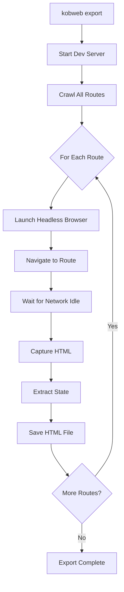

# Deep Dive: SSR Export and Hydration

## Overview

This deep dive examines Kobweb's static site export system - how pages are pre-rendered to HTML using a headless browser, then hydrated on the client for interactivity. We cover the export pipeline, hydration mechanics, and strategies for handling dynamic content.

## Export Architecture



## Export Pipeline

### Export Command Implementation

```kotlin
// gradle-plugins/src/main/kotlin/com/varabyte/kobweb/gradle/tasks/KobwebExport.kt

abstract class KobwebExportTask : DefaultTask() {
    @get:Input
    abstract val exportLayout: Property<ExportLayout>
    
    @get:Input
    abstract val dynamicRouteValues: MapProperty<String, List<Map<String, String>>>
    
    @get:OutputDirectory
    abstract val outputDirectory: DirectoryProperty
    
    @TaskAction
    fun export() {
        val layout = exportLayout.get()
        
        when (layout) {
            ExportLayout.STATIC -> exportStatic()
            ExportLayout.FULLSTACK -> exportFullStack()
        }
    }
    
    private fun exportStatic() {
        // 1. Start development server in background
        val serverProcess = startDevServer()
        
        try {
            // 2. Wait for server to be ready
            waitForServerReady(serverProcess)
            
            // 3. Crawl all routes
            val routes = crawlRoutes("http://localhost:8080")
            
            // 4. Render each route
            for (route in routes) {
                renderRoute(route, outputDirectory.get().asFile)
            }
            
            // 5. Copy static assets
            copyStaticAssets()
            
            // 6. Generate 404 page
            generate404Page()
            
        } finally {
            serverProcess.destroy()
        }
    }
    
    private fun renderRoute(route: String, outputDir: File) {
        // Use Puppeteer/Playwright for headless browser rendering
        val options = HeadlessOptions(
            width = 1920,
            height = 1080,
            waitForNetworkIdle = true,
            timeout = 30000
        )
        
        val browser = HeadlessBrowser.launch(options)
        
        try {
            val page = browser.newPage()
            
            // Navigate to route
            page.navigate("http://localhost:8080$route")
            
            // Wait for hydration to complete
            page.waitForFunction("window.__KOBWEB_HYDRATED__ === true")
            
            // Get fully rendered HTML
            val html = page.content()
            
            // Extract hydration state
            val state = page.evaluate("""
                () => JSON.stringify(window.__KOBWEB_STATE__)
            """)
            
            // Save HTML file
            val outputPath = getOutputPath(route, outputDir)
            File(outputPath).writeText(html)
            
            // Save state file (for hydration)
            val statePath = outputPath.removeSuffix(".html") + ".state.json"
            File(statePath).writeText(state)
            
        } finally {
            browser.close()
        }
    }
}
```

### Route Crawling

```kotlin
// gradle-plugins/src/main/kotlin/com/varabyte/kobweb/gradle/tasks/RouteCrawler.kt

data class CrawlResult(
    val staticRoutes: List<String>,
    val dynamicRoutes: List<DynamicRoute>
)

data class DynamicRoute(
    val path: String,
    val parameters: List<String>
)

fun crawlRoutes(baseUrl: String): CrawlResult {
    val staticRoutes = mutableListOf<String>()
    val dynamicRoutes = mutableListOf<DynamicRoute>()
    
    // Fetch route manifest from server
    val manifest = fetchRouteManifest(baseUrl)
    
    for (route in manifest.routes) {
        if (route.isDynamic) {
            dynamicRoutes.add(DynamicRoute(
                path = route.path,
                parameters = route.parameters
            ))
        } else {
            staticRoutes.add(route.path)
        }
    }
    
    return CrawlResult(staticRoutes, dynamicRoutes)
}

fun fetchRouteManifest(baseUrl: String): RouteManifest {
    val response = Http.get("$baseUrl/__kobweb/routes.json")
    return Json.decodeFromString(response.body)
}
```

### Dynamic Route Values

```kotlin
// gradle-plugins/src/main/kotlin/com/varabyte/kobweb/gradle/tasks/DynamicRouteRenderer.kt

// Configuration in build.gradle.kts:
// kobweb {
//     export {
//         dynamicRouteValues.put("users/[userId]", listOf(
//             mapOf("userId" to "1"),
//             mapOf("userId" to "2"),
//             mapOf("userId" to "3"),
//         ))
//     }
// }

fun resolveDynamicRoutes(
    dynamicRoutes: List<DynamicRoute>,
    configuredValues: Map<String, List<Map<String, String>>>
): List<String> {
    val resolvedRoutes = mutableListOf<String>()
    
    for (route in dynamicRoutes) {
        val values = configuredValues[route.path]
            ?: throw IllegalStateException(
                "No values configured for dynamic route: ${route.path}"
            )
        
        for (paramValues in values) {
            val resolvedPath = route.path.replacePattern(
                paramValues
            )
            resolvedRoutes.add(resolvedPath)
        }
    }
    
    return resolvedRoutes
}

fun String.replacePattern(params: Map<String, String>): String {
    var result = this
    
    for ((key, value) in params) {
        result = result.replace("[$key]", value)
    }
    
    return result
}
```

## HTML Generation

### Server-Side Rendering

```kotlin
// kobweb-ssr/src/jvmMain/kotlin/com/varabyte/kobweb/ssr/HtmlRenderer.kt

class HtmlRenderer(
    private val router: Router,
    private val layoutRegistry: LayoutRegistry
) {
    suspend fun renderPage(
        route: String,
        context: PageContext
    ): RenderedPage {
        // Find matching page handler
        val pageHandler = router.findHandler(route)
            ?: throw NotFoundException("Route not found: $route")
        
        // Determine layout
        val layoutId = pageHandler.layoutId
        val layout = layoutRegistry.get(layoutId)
        
        // Render with layout
        val html = renderWithLayout(layout, pageHandler, context)
        
        // Extract initial state
        val state = context.extractState()
        
        return RenderedPage(html, state)
    }
    
    private suspend fun renderWithLayout(
        layout: LayoutHandler,
        page: PageHandler,
        context: PageContext
    ): String {
        // Use kotlinx.html for server-side rendering
        return buildString {
            appendLine("<!DOCTYPE html>")
            appendLine("<html>")
            appendLine("<head>")
            appendLine("""<meta charset="UTF-8">""")
            appendLine("""<meta name="viewport" content="width=device-width, initial-scale=1.0">""")
            appendLine("""<link rel="stylesheet" href="/site.css">""")
            appendLine("</head>")
            appendLine("<body>")
            
            // Render layout with page content
            layout.render(context) {
                page.render(context)
            }
            
            // Embed initial state for hydration
            appendLine("""<script id="__KOBWEB_STATE__" type="application/json">""")
            append(context.extractState().toJson())
            appendLine("""</script>""")
            
            appendLine("""<script src="/site.js"></script>""")
            appendLine("</body>")
            appendLine("</html>")
        }
    }
}
```

### kotlinx.html Integration

```kotlin
// kobweb-ssr/src/jvmMain/kotlin/com/varabyte/kobweb/ssr/ComposeToHtml.kt

fun Appendable.renderComposable(composable: @Composable () -> Unit) {
    val writer = HtmlWriter(this)
    val applier = HtmlApplier(writer)
    val composer = ComposerImpl(applier)
    
    // Start composition
    composer.startRoot()
    
    // Execute composable
    composable()
    
    // End composition and flush
    composer.endRoot()
    writer.flush()
}

class HtmlWriter(
    private val appendable: Appendable
) {
    fun openTag(tag: String, attrs: Map<String, String> = emptyMap()) {
        appendable.append("<$tag")
        for ((key, value) in attrs) {
            appendable.append(""" $key="${escapeAttr(value)}"""")
        }
        appendable.append(">")
    }
    
    fun closeTag(tag: String) {
        appendable.append("</$tag>")
    }
    
    fun text(content: String) {
        appendable.append(escapeText(content))
    }
    
    private fun escapeAttr(s: String): String {
        return s.replace("&", "&amp;")
            .replace("\"", "&quot;")
            .replace("<", "&lt;")
            .replace(">", "&gt;")
    }
    
    private fun escapeText(s: String): String {
        return s.replace("&", "&amp;")
            .replace("<", "&lt;")
            .replace(">", "&gt;")
    }
}
```

### Generated HTML Structure

```html
<!DOCTYPE html>
<html>
<head>
    <meta charset="UTF-8">
    <meta name="viewport" content="width=device-width, initial-scale=1.0">
    <title>My Kobweb Page</title>
    <link rel="stylesheet" href="/site.css">
    <style>
        /* Inline critical CSS */
        .card { width: 200px; height: 100px; }
    </style>
</head>
<body>
    <div id="root">
        <!-- Pre-rendered content -->
        <div class="card">
            <h1>Welcome to Kobweb!</h1>
            <p>This page was server-side rendered.</p>
        </div>
    </div>
    
    <!-- Embedded state for hydration -->
    <script id="__KOBWEB_STATE__" type="application/json">
        {
            "routes": ["/", "/about", "/users/1"],
            "pageData": {
                "userId": "1",
                "userName": "Alice"
            }
        }
    </script>
    
    <!-- Client bundle -->
    <script src="/site.js"></script>
    <script>
        // Hydration entry point
        window.__KOBWEB_HYDRATE__();
    </script>
</body>
</html>
```

## Hydration System

### Client-Side Hydration

```kotlin
// kobweb-core/src/jsMain/kotlin/com/varabyte/kobweb/core/Hydration.kt

external val __KOBWEB_STATE__: dynamic by js("window.__KOBWEB_STATE__")

fun hydrate() {
    // 1. Load embedded state
    val state = parseState(__KOBWEB_STATE__)
    
    // 2. Restore route registry
    RouteRegistry.restore(state.routes)
    
    // 3. Restore page data
    PageContext.restore(state.pageData)
    
    // 4. Mount Compose to existing DOM
    val root = document.getElementById("root")!!
    
    renderComposable(root) {
        App()
    }
    
    // 5. Signal hydration complete
    window.asDynamic().__KOBWEB_HYDRATED__ = true
    
    // 6. Remove loading indicator
    document.querySelector(".loading")?.remove()
}

fun parseState(stateJson: dynamic): AppState {
    return try {
        JSON.parse<dynamic>(JSON.stringify(stateJson)).let { json ->
            AppState(
                routes = json.routes.unsafeCast<List<String>>(),
                pageData = json.pageData
            )
        }
    } catch (e: Exception) {
        console.error("Failed to parse hydration state", e)
        AppState(emptyList(), dynamic())
    }
}
```

### State Synchronization

```kotlin
// kobweb-core/src/jsMain/kotlin/com/varabyte/kobweb/core/StateManager.kt

object HydrationState {
    private var isHydrated = false
    private var serverState: dynamic = null
    
    fun initialize(state: dynamic) {
        serverState = state
    }
    
    fun <T> getValue(key: String, defaultValue: T): T {
        if (!isHydrated && serverState != null) {
            // Use server value during hydration
            return serverState[key] as? T ?: defaultValue
        }
        return defaultValue
    }
    
    fun markHydrated() {
        isHydrated = true
        serverState = null  // Clear server state after hydration
    }
}

@Composable
fun <T> rememberHydratedState(
    key: String,
    defaultValue: () -> T
): T {
    var value by remember {
        mutableStateOf(
            HydrationState.getValue(key, defaultValue())
        )
    }
    
    // Mark component as hydrated
    DisposableEffect(key) {
        onDispose {
            HydrationState.markHydrated()
        }
    }
    
    return value
}
```

### Handling Hydration Mismatches

```kotlin
// kobweb-core/src/jsMain/kotlin/com/varabyte/kobweb/core/HydrationMismatch.kt

sealed class HydrationMismatch {
    object NodeNotFound : HydrationMismatch()
    object NodeTypeMismatch : HydrationMismatch()
    object ContentMismatch : HydrationMismatch()
}

fun handleHydrationMismatch(mismatch: HydrationMismatch) {
    when (mismatch) {
        is HydrationMismatch.NodeNotFound -> {
            // Server rendered different structure than client
            // Force client-side render
            console.warn("Hydration mismatch: Node not found, re-rendering")
            forceClientRender()
        }
        
        is HydrationMismatch.NodeTypeMismatch -> {
            // Server rendered different element type
            console.warn("Hydration mismatch: Node type mismatch")
            forceClientRender()
        }
        
        is HydrationMismatch.ContentMismatch -> {
            // Content differs (e.g., timestamp, random value)
            // Usually safe to ignore
            console.warn("Hydration mismatch: Content differs")
        }
    }
}

// Detect mismatches
fun checkHydration(expected: Node, actual: Node): HydrationMismatch? {
    if (actual == null) {
        return HydrationMismatch.NodeNotFound
    }
    
    if (expected.nodeType != actual.nodeType) {
        return HydrationMismatch.NodeTypeMismatch
    }
    
    if (expected.nodeType == Node.TEXT_NODE) {
        if (expected.textContent != actual.textContent) {
            return HydrationMismatch.ContentMismatch
        }
    }
    
    return null
}
```

## Export Modes

### Static Export

```kotlin
// build.gradle.kts
kobweb {
    export {
        layout.set(ExportLayout.STATIC)
    }
}

// Characteristics:
// - No server required for hosting
// - API routes NOT available
// - All content pre-rendered
// - Static JSON files for data
```

### Full-Stack Export

```kotlin
// build.gradle.kts
kobweb {
    export {
        layout.set(ExportLayout.FULLSTACK)
    }
}

// Characteristics:
// - Requires JVM server for hosting
// - API routes available
// - Dynamic data fetching at runtime
// - Can still pre-render pages
```

### Hybrid Approach

```kotlin
// Some pages static, some dynamic
@Page
@Composable
fun StaticPage() {
    // Pre-rendered at build time
    Text("This is static content")
}

@Page
@Composable
fun DynamicPage(ctx: PageContext) {
    // Client-side fetch after hydration
    var data by remember { mutableStateOf<String?>(null) }
    
    LaunchedEffect(Unit) {
        data = fetchData()
    }
    
    if (data == null) {
        Text("Loading...")
    } else {
        Text("Dynamic: $data")
    }
}
```

## Optimization Strategies

### Incremental Static Regeneration

```kotlin
// kobweb-ssr/src/jvmMain/kotlin/com/varabyte/kobweb/ssr/IncrementalRegen.kt

class IncrementalRegenerator(
    private val outputDir: File,
    private val revalidateSeconds: Int
) {
    data class CachedPage(
        val html: String,
        val timestamp: Long,
        val revalidateAt: Long
    )
    
    private val cache = ConcurrentHashMap<String, CachedPage>()
    
    suspend fun getPage(route: String): CachedPage {
        val cached = cache[route]
        
        if (cached != null && System.currentTimeMillis() < cached.revalidateAt) {
            return cached
        }
        
        // Regenerate in background
        if (cached != null) {
            launch {
                val fresh = renderPage(route)
                cache[route] = fresh
                saveToDisk(route, fresh)
            }
            return cached  // Serve stale while revalidating
        }
        
        // First render
        val fresh = renderPage(route)
        cache[route] = fresh
        saveToDisk(route, fresh)
        return fresh
    }
    
    private fun renderPage(route: String): CachedPage {
        val html = renderer.render(route)
        val now = System.currentTimeMillis()
        
        return CachedPage(
            html = html,
            timestamp = now,
            revalidateAt = now + (revalidateSeconds * 1000)
        )
    }
}
```

### Streaming SSR

```kotlin
// kobweb-ssr/src/jvmMain/kotlin/com/varabyte/kobweb/ssr/StreamingRenderer.kt

class StreamingRenderer {
    suspend fun stream(
        route: String,
        send: suspend (String) -> Unit
    ) {
        // Send HTML head immediately
        send(buildHtmlHead())
        
        // Start body
        send("<body>")
        
        // Stream content in chunks
        val channel = Channel<String>(Channel.BUFFERED)
        
        launch {
            renderPageChunks(route, channel)
            channel.close()
        }
        
        for (chunk in channel) {
            send(chunk)
        }
        
        // Send hydration script
        send(buildHydrationScript())
        send("</body></html>")
    }
    
    private suspend fun renderPageChunks(
        route: String,
        channel: Channel<String>
    ) {
        // Send skeleton immediately
        channel.send("<div id=\"root\">")
        
        // Render page content (may suspend for data)
        val content = renderPageContent(route)
        channel.send(content)
        
        channel.send("</div>")
    }
}
```

### Preloading and Prefetching

```kotlin
// kobweb-core/src/jsMain/kotlin/com/varabyte/kobweb/core/Prefetch.kt

object PrefetchManager {
    private val prefetched = mutableSetOf<String>()
    
    fun prefetch(route: String) {
        if (route in prefetched) return
        
        prefetched.add(route)
        
        // Fetch page data in background
        launch {
            val response = fetch("/__kobweb/prefetch?route=$route")
            val data = response.json()
            
            // Store in hydration cache
            HydrationCache.set(route, data)
        }
    }
    
    fun prefetchOnHover(links: NodeList) {
        links.forEach { link ->
            link.asDynamic().addEventListener("mouseenter") {
                val href = link.asDynamic().href
                prefetch(href)
            }
        }
    }
}

// Usage in components
@Composable
fun NavigationMenu() {
    val links = remember { mutableStateListOf("/about", "/contact", "/blog") }
    
    LaunchedEffect(links) {
        PrefetchManager.prefetchOnHover(document.querySelectorAll("a"))
    }
    
    // ... render links
}
```

## Deployment Output

### Static Site Structure

```
build/dist/js/site/
├── index.html              # Home page
├── about/
│   └── index.html          # About page
├── users/
│   ├── 1/
│   │   └── index.html      # User 1 profile
│   ├── 2/
│   │   └── index.html      # User 2 profile
│   └── [userId]/           # Dynamic route template
│       └── index.html
├── site.js                 # Bundled JavaScript
├── site.css                # Bundled CSS
├── static/                 # Public assets
│   ├── images/
│   └── favicon.ico
└── 404.html                # Not found page
```

### Full-Stack Distribution

```
build/dist/js/site/
├── server.jar              # Runnable JAR with Ktor
├── static/                 # Static assets
│   ├── index.html
│   ├── site.js
│   └── site.css
└── config/
    └── application.conf    # Ktor configuration
```

## Conclusion

Kobweb's SSR export system provides:

1. **Static Site Generation**: Pre-render pages to HTML at build time
2. **Headless Browser Rendering**: Use Puppeteer/Playwright for accurate rendering
3. **Hydration**: Restore interactivity after page load
4. **State Synchronization**: Embed server state for seamless client takeover
5. **Incremental Regeneration**: Revalidate pages periodically
6. **Streaming SSR**: Send HTML in chunks for faster TTFB
7. **Prefetching**: Load page data before navigation

This enables both static hosting (CDN) and full-stack deployments from the same codebase.
