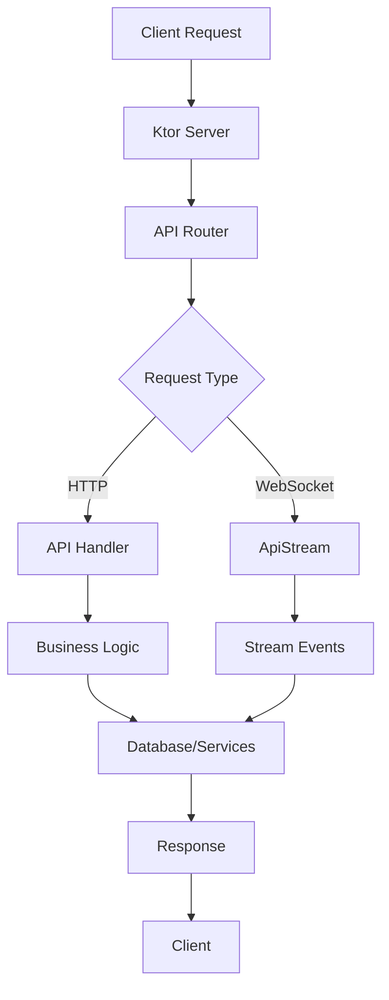

# Deep Dive: API Routes and Streams

## Overview

This deep dive examines Kobweb's backend API system - how `@Api` annotated functions become Ktor HTTP endpoints, and how `ApiStream` enables websocket-based real-time communication between client and server.

## API Architecture



## API Route Registration

### @Api Annotation Processing

```kotlin
// kobweb-api/src/commonMain/kotlin/com/varabyte/kobweb/api/Api.kt

@Target(AnnotationTarget.FUNCTION, AnnotationTarget.PROPERTY)
@Retention(AnnotationRetention.BINARY)
annotation class Api(
    val value: String = "",           // Route path
    val method: HttpMethod = HttpMethod.Get,
    val description: String = "",
    val requiresAuth: Boolean = false,
)

// Generated code from KSP processing
// build/generated/ksp/jvm/main/kotlin/kobweb/generated/ApiRegistry.kt

package kobweb.generated

import com.varabyte.kobweb.api.ApiHandler
import com.varabyte.kobweb.api.HttpMethod
import com.example.api.users.fetchUser
import com.example.api.users.createUser

object ApiRegistry {
    val handlers: Map<String, ApiHandler> = mapOf(
        "GET:users/fetch" to ApiHandler(
            method = HttpMethod.Get,
            path = "users/fetch",
            handler = ::fetchUser
        ),
        "POST:users/create" to ApiHandler(
            method = HttpMethod.Post,
            path = "users/create",
            handler = ::createUser
        )
    )
}
```

### ApiContext

```kotlin
// kobweb-api/src/jvmMain/kotlin/com/varabyte/kobweb/api/ApiContext.kt

class ApiContext(
    val call: ApplicationCall,
    val pathParams: Map<String, String>,
    val queryParams: Parameters,
    val headers: Headers,
    val cookies: RequestCookies,
    val session: Session?
) {
    // Request body parsing
    suspend inline fun <reified T> bodyAs(): T {
        val body = call.receiveText()
        return Json.decodeFromString(body)
    }
    
    // Response helpers
    suspend fun respond(data: Any, status: HttpStatusCode = HttpStatusCode.OK) {
        call.respond(status, data)
    }
    
    suspend fun respondText(text: String, contentType: ContentType = ContentType.Text.Plain) {
        call.respondText(text, contentType)
    }
    
    suspend fun respondError(message: String, status: HttpStatusCode = HttpStatusCode.BadRequest) {
        call.respond(status, ApiError(message, status.value))
    }
    
    suspend fun respondSuccess() {
        call.respond(HttpStatusCode.OK)
    }
    
    // File upload handling
    suspend fun receiveFile(): List<PartData.FileItem> {
        return call.receiveMultipart().readAllParts()
            .filterIsInstance<PartData.FileItem>()
    }
    
    // Streaming response
    fun respondStream(content: Flow<ByteArray>) {
        call.respondOutputStream {
            content.collect { chunk ->
                channel.writeFully(chunk)
            }
        }
    }
}

data class ApiError(
    val message: String,
    val code: Int
)
```

## HTTP API Handlers

### Basic GET Handler

```kotlin
// src/jvmMain/kotlin/myapp/api/users/UserApi.kt
package myapp.api.users

import com.varabyte.kobweb.api.*
import io.ktor.http.*

@Api("users/list")
suspend fun listUsers(ctx: ApiContext) {
    val users = database.getAllUsers()
    ctx.respond(users)
}

// Request: GET /api/users/list
// Response: [{ "id": "1", "name": "Alice" }, ...]
```

### Path Parameters

```kotlin
@Api("users/fetch")
suspend fun fetchUser(ctx: ApiContext) {
    val userId = ctx.pathParams["userId"]
        ?: run {
            ctx.respondError("Missing userId")
            return
        }
    
    val user = database.getUser(userId)
        ?: run {
            ctx.respondError("User not found", HttpStatusCode.NotFound)
            return
        }
    
    ctx.respond(user)
}

// Request: GET /api/users/fetch?userId=123
// Response: { "id": "123", "name": "Alice", "email": "alice@example.com" }
```

### POST Handler with Body

```kotlin
@Api(value = "users/create", method = HttpMethod.Post)
suspend fun createUser(ctx: ApiContext) {
    val userData = ctx.bodyAs<UserCreateRequest>()
    
    // Validate input
    if (userData.email.isBlank()) {
        ctx.respondError("Email is required")
        return
    }
    
    if (userData.password.length < 8) {
        ctx.respondError("Password must be at least 8 characters")
        return
    }
    
    // Check for existing user
    val existing = database.getUserByEmail(userData.email)
    if (existing != null) {
        ctx.respondError("User already exists", HttpStatusCode.Conflict)
        return
    }
    
    // Create user
    val user = database.createUser(
        email = userData.email,
        password = hashPassword(userData.password),
        name = userData.name
    )
    
    ctx.respond(user, HttpStatusCode.Created)
}

data class UserCreateRequest(
    val email: String,
    val password: String,
    val name: String
)

// Request: POST /api/users/create
// Body: { "email": "alice@example.com", "password": "secret123", "name": "Alice" }
// Response: 201 Created + { "id": "1", "email": "alice@example.com", ... }
```

### PUT Handler

```kotlin
@Api(value = "users/update", method = HttpMethod.Put)
suspend fun updateUser(ctx: ApiContext) {
    val userId = ctx.pathParams["userId"]
        ?: return ctx.respondError("Missing userId")
    
    val updateData = ctx.bodyAs<UserUpdateRequest>()
    
    val user = database.getUser(userId)
        ?: return ctx.respondError("User not found", HttpStatusCode.NotFound)
    
    // Update fields
    val updatedUser = database.updateUser(
        id = userId,
        email = updateData.email ?: user.email,
        name = updateData.name ?: user.name
    )
    
    ctx.respond(updatedUser)
}

data class UserUpdateRequest(
    val email: String?,
    val name: String?
)

// Request: PUT /api/users/update/123
// Body: { "email": "new@example.com" }
// Response: { "id": "123", "email": "new@example.com", ... }
```

### DELETE Handler

```kotlin
@Api(value = "users/delete", method = HttpMethod.Delete)
suspend fun deleteUser(ctx: ApiContext) {
    val userId = ctx.pathParams["userId"]
        ?: return ctx.respondError("Missing userId")
    
    val deleted = database.deleteUser(userId)
    
    if (!deleted) {
        return ctx.respondError("User not found", HttpStatusCode.NotFound)
    }
    
    ctx.respondSuccess()
}

// Request: DELETE /api/users/delete/123
// Response: 200 OK + { "success": true }
```

## API Interceptors

### Authentication Interceptor

```kotlin
// src/jvmMain/kotlin/myapp/api/interceptors/AuthInterceptor.kt
package myapp.api.interceptors

import com.varabyte.kobweb.api.*
import io.ktor.http.*

class AuthInterceptor : ApiInterceptor {
    override suspend fun intercept(ctx: ApiContext, next: () -> Unit) {
        val authHeader = ctx.headers["Authorization"]
            ?: run {
                ctx.respondError("Missing authorization header", HttpStatusCode.Unauthorized)
                return
            }
        
        if (!authHeader.startsWith("Bearer ")) {
            ctx.respondError("Invalid authorization format", HttpStatusCode.Unauthorized)
            return
        }
        
        val token = authHeader.removePrefix("Bearer ")
        
        try {
            val payload = verifyJwt(token)
            
            // Attach user to context
            val authContext = ctx.copy(
                user = AuthUser(
                    id = payload.userId,
                    role = payload.role
                )
            )
            
            // Continue with authenticated context
            next()
            
        } catch (e: JwtVerificationException) {
            ctx.respondError("Invalid token", HttpStatusCode.Unauthorized)
        }
    }
}

// Register interceptor
class MyServerPlugin : KobwebServerPlugin {
    override fun Application.install() {
        install(Kobweb) {
            addInterceptor(AuthInterceptor())
        }
    }
}
```

### Rate Limiting Interceptor

```kotlin
// src/jvmMain/kotlin/myapp/api/interceptors/RateLimitInterceptor.kt
package myapp.api.interceptors

import com.varabyte.kobweb.api.*
import io.ktor.http.*
import java.util.concurrent.ConcurrentHashMap

class RateLimitInterceptor(
    private val maxRequests: Int = 100,
    private val windowMs: Long = 60_000
) : ApiInterceptor {
    
    private val requestCounts = ConcurrentHashMap<String, RequestWindow>()
    
    data class RequestWindow(
        val count: Int,
        val windowStart: Long
    )
    
    override suspend fun intercept(ctx: ApiContext, next: () -> Unit) {
        val clientId = getClientId(ctx)
        val now = System.currentTimeMillis()
        
        val window = requestCounts.getOrPut(clientId) {
            RequestWindow(0, now)
        }
        
        // Reset window if expired
        if (now - window.windowStart > windowMs) {
            requestCounts[clientId] = RequestWindow(0, now)
        }
        
        val currentCount = requestCounts.getValue(clientId).count
        
        if (currentCount >= maxRequests) {
            ctx.respondError(
                "Rate limit exceeded",
                HttpStatusCode.TooManyRequests
            ) {
                header("Retry-After", windowMs / 1000)
            }
            return
        }
        
        // Increment counter
        requestCounts[clientId] = window.copy(count = currentCount + 1)
        
        next()
    }
    
    private fun getClientId(ctx: ApiContext): String {
        // Use IP address or API key as client identifier
        return ctx.headers["X-Forwarded-For"]
            ?.split(",")
            ?.first()
            ?: ctx.call.request.local.remoteAddress
    }
}
```

### Logging Interceptor

```kotlin
// src/jvmMain/kotlin/myapp/api/interceptors/LoggingInterceptor.kt
package myapp.api.interceptors

import com.varabyte.kobweb.api.*
import io.ktor.http.*

class LoggingInterceptor : ApiInterceptor {
    override suspend fun intercept(ctx: ApiContext, next: () -> Unit) {
        val start = System.currentTimeMillis()
        val method = ctx.call.request.httpMethod.value
        val path = ctx.call.request.path()
        
        println("→ $method $path")
        
        try {
            next()
            
            val duration = System.currentTimeMillis() - start
            val status = ctx.call.response.status()
            
            println("← $method $path $status (${duration}ms)")
            
        } catch (e: Exception) {
            val duration = System.currentTimeMillis() - start
            println("← $method $path 500 (${duration}ms) - ${e.message}")
            
            throw e
        }
    }
}
```

## API Streams (WebSockets)

### Stream Definition

```kotlin
// src/jvmMain/kotlin/myapp/api/chat/ChatStream.kt
package myapp.api.chat

import com.varabyte.kobweb.api.*
import kotlinx.coroutines.flow.MutableSharedFlow
import kotlinx.coroutines.flow.SharedFlow
import kotlinx.coroutines.flow.asSharedFlow
import kotlinx.coroutines.launch

data class ChatMessage(
    val userId: String,
    val text: String,
    val timestamp: Long
)

@Api("chat")
val chatStream = object : ApiStream {
    private val messageBuffer = MutableSharedFlow<ChatMessage>(replay = 50)
    val messages: SharedFlow<ChatMessage> = messageBuffer.asSharedFlow()
    
    override suspend fun onOpen(ctx: ApiStreamContext) {
        println("Client connected: ${ctx.sessionId}")
        
        // Send welcome message
        ctx.send(
            ChatMessage(
                userId = "system",
                text = "Welcome to the chat!",
                timestamp = System.currentTimeMillis()
            )
        )
    }
    
    override suspend fun onMessage(ctx: ApiStreamContext, message: String) {
        try {
            val chatMessage = Json.decodeFromString<ChatMessage>(message)
            
            // Broadcast to all clients
            messageBuffer.emit(chatMessage)
            
        } catch (e: Exception) {
            ctx.sendError("Invalid message format")
        }
    }
    
    override suspend fun onClose(ctx: ApiStreamContext) {
        println("Client disconnected: ${ctx.sessionId}")
    }
}
```

### Stream Context

```kotlin
// kobweb-api/src/jvmMain/kotlin/com/varabyte/kobweb/api/ApiStreamContext.kt

class ApiStreamContext(
    val session: DefaultWebSocketServerSession,
    val sessionId: String,
    val headers: Headers
) {
    // Send message to client
    suspend fun send(data: Any) {
        val json = Json.encodeToString(data)
        session.send(json)
    }
    
    // Send error to client
    suspend fun sendError(message: String) {
        send(mapOf("error" to message))
    }
    
    // Broadcast to all connected clients
    suspend fun broadcast(data: Any, excludeSelf: Boolean = false) {
        // Implementation depends on stream manager
    }
    
    // Get session attribute
    fun <T> getAttribute(key: String): T? {
        @Suppress("UNCHECKED_CAST")
        return session.call.attributes.get(AttributeKey(key)) as? T
    }
    
    // Set session attribute
    fun <T> setAttribute(key: String, value: T) {
        session.call.attributes.put(AttributeKey(key), value)
    }
}
```

### Client-Side Stream Usage

```kotlin
// src/jsMain/kotlin/myapp/pages/ChatPage.kt
package myapp.pages

import androidx.compose.runtime.*
import com.varabyte.kobweb.api.*
import com.varabyte.kobweb.core.*

@Page
@Composable
fun ChatPage() {
    var messages by remember { mutableStateOf(listOf<ChatMessage>()) }
    var inputText by remember { mutableStateOf("") }
    
    // Connect to stream
    val stream = remember {
        ApiStream.connect("/api/chat")
    }
    
    // Listen for messages
    LaunchedEffect(stream) {
        stream.onMessage<ChatMessage> { message ->
            messages = messages + message
        }
        
        stream.onClose {
            println("Stream closed")
        }
    }
    
    Column {
        // Message list
        Box(
            modifier = Modifier
                .weight(1f)
                .border(1.px, LineStyle.Solid, Color.Gray)
        ) {
            messages.forEach { message ->
                Text("${message.userId}: ${message.text}")
            }
        }
        
        // Input
        Row {
            Input(
                value = inputText,
                onValueChangedEvent = { inputText = it.value }
            )
            
            Button(
                onClick = {
                    stream.send(ChatMessage(
                        userId = "me",
                        text = inputText,
                        timestamp = System.currentTimeMillis()
                    ))
                    inputText = ""
                }
            ) {
                Text("Send")
            }
        }
    }
}
```

### Pub/Sub Pattern

```kotlin
// src/jvmMain/kotlin/myapp/api/streams/PubSubStream.kt
package myapp.api.streams

import com.varabyte.kobweb.api.*
import kotlinx.coroutines.sync.Mutex
import kotlinx.coroutines.sync.withLock

class PubSubManager {
    private val subscribers = mutableMapOf<String, MutableSet<ApiStreamContext>>()
    private val mutex = Mutex()
    
    suspend fun subscribe(topic: String, ctx: ApiStreamContext) {
        mutex.withLock {
            subscribers.getOrPut(topic) { mutableSetOf() }.add(ctx)
        }
    }
    
    suspend fun unsubscribe(topic: String, ctx: ApiStreamContext) {
        mutex.withLock {
            subscribers[topic]?.remove(ctx)
            if (subscribers[topic]?.isEmpty() == true) {
                subscribers.remove(topic)
            }
        }
    }
    
    suspend fun publish(topic: String, data: Any) {
        mutex.withLock {
            subscribers[topic]?.forEach { ctx ->
                launch { ctx.send(data) }
            }
        }
    }
}

val pubSubManager = PubSubManager()

@Api("pubsub")
val pubSubStream = object : ApiStream {
    override suspend fun onOpen(ctx: ApiStreamContext) {
        // Client subscribes on connect
        val topic = ctx.headers["X-Topic"] ?: "default"
        pubSubManager.subscribe(topic, ctx)
        ctx.setAttribute("topic", topic)
    }
    
    override suspend fun onMessage(ctx: ApiStreamContext, message: String) {
        val topic = ctx.getAttribute<String>("topic") ?: return
        pubSubManager.publish(topic, message)
    }
    
    override suspend fun onClose(ctx: ApiStreamContext) {
        val topic = ctx.getAttribute<String>("topic")
        if (topic != null) {
            pubSubManager.unsubscribe(topic, ctx)
        }
    }
}
```

## Database Integration

### Exposed ORM

```kotlin
// src/jvmMain/kotlin/myapp/db/Database.kt
package myapp.db

import org.jetbrains.exposed.sql.*
import org.jetbrains.exposed.sql.transactions.transaction

object Users : Table() {
    val id = varchar("id", 36).primaryKey()
    val email = varchar("email", 255).uniqueIndex()
    val name = varchar("name", 100)
    val passwordHash = varchar("password_hash", 255)
    val createdAt = datetime("created_at").clientDefault { DateTimeNow() }
}

class Database {
    private val database: Database by lazy {
        Database.connect(
            url = System.getenv("DATABASE_URL"),
            driver = "org.postgresql.Driver",
            user = System.getenv("DB_USER"),
            password = System.getenv("DB_PASSWORD")
        )
    }
    
    fun getUser(id: String): User? = transaction {
        Users.select { Users.id eq id }.singleOrNull()?.let { row ->
            User(
                id = row[Users.id],
                email = row[Users.email],
                name = row[Users.name],
                createdAt = row[Users.createdAt]
            )
        }
    }
    
    fun createUser(email: String, passwordHash: String, name: String): User = transaction {
        Users.insert {
            it[id] = generateUuid()
            it[email] = email
            it[passwordHash] = passwordHash
            it[name] = name
        } returning {
            User(
                id = it[id],
                email = it[email],
                name = it[name],
                createdAt = it[createdAt]
            )
        }
    }
}
```

### Repository Pattern

```kotlin
// src/jvmMain/kotlin/myapp/repositories/UserRepository.kt
package myapp.repositories

interface UserRepository {
    suspend fun findById(id: String): User?
    suspend fun findByEmail(email: String): User?
    suspend fun create(email: String, passwordHash: String, name: String): User
    suspend fun update(id: String, email: String?, name: String?): User?
    suspend fun delete(id: String): Boolean
}

class UserRepositoryImpl(
    private val database: Database
) : UserRepository {
    override suspend fun findById(id: String): User? {
        return withContext(Dispatchers.IO) {
            database.getUser(id)
        }
    }
    
    // ... other methods
}
```

## Error Handling

### Global Exception Handler

```kotlin
// src/jvmMain/kotlin/myapp/api/ErrorHandler.kt
package myapp.api

import com.varabyte.kobweb.api.*
import io.ktor.http.*

class GlobalErrorHandler : ApiErrorHandler {
    override suspend fun handle(ctx: ApiContext, error: Throwable) {
        when (error) {
            is NotFoundException -> {
                ctx.respondError(error.message ?: "Not found", HttpStatusCode.NotFound)
            }
            is ValidationException -> {
                ctx.respondError(error.message ?: "Validation failed", HttpStatusCode.BadRequest) {
                    content { 
                        Json.encodeToJsonElement(error.errors)
                    }
                }
            }
            is UnauthorizedException -> {
                ctx.respondError("Unauthorized", HttpStatusCode.Unauthorized)
            }
            else -> {
                // Log unexpected error
                logger.error("Unexpected error", error)
                ctx.respondError("Internal server error", HttpStatusCode.InternalServerError)
            }
        }
    }
}
```

## Conclusion

Kobweb's API system provides:

1. **Type-Safe Handlers**: `@Api` annotation with KSP code generation
2. **HTTP Methods**: GET, POST, PUT, DELETE support
3. **Request Parsing**: Path params, query params, body parsing
4. **Interceptors**: Auth, rate limiting, logging middleware
5. **WebSockets**: ApiStream for real-time communication
6. **Pub/Sub**: Topic-based message broadcasting
7. **Database Integration**: Exposed ORM support
8. **Error Handling**: Global exception handler

This enables building full-stack applications with shared Kotlin code between client and server.
