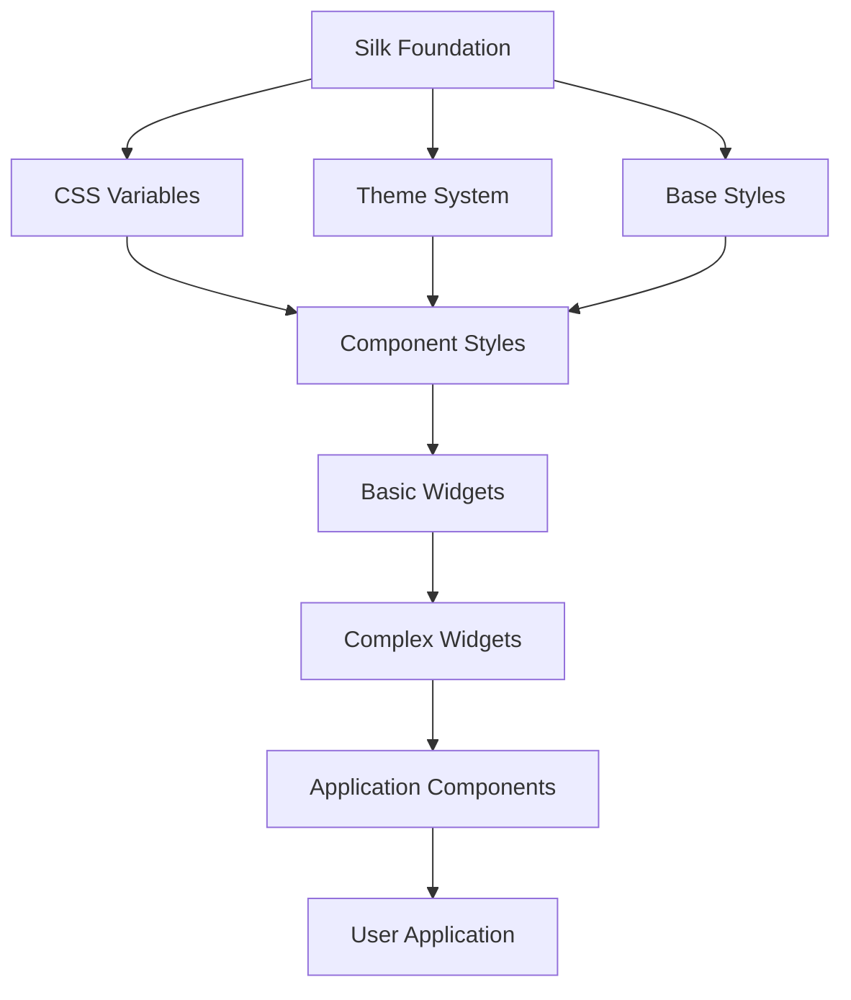

# Deep Dive: Silk UI System

## Overview

This deep dive examines Kobweb's Silk UI library - a Chakra UI-inspired component system built on Compose HTML. We cover the component architecture, theming system, widget implementations, and how to build custom components.

## Silk Architecture



## Foundation System

### CSS Variables

```kotlin
// silk-foundation/src/jsMain/kotlin/com/varabyte/kobweb/silk/foundation/Variables.kt

object SilkVariables {
    // Colors
    val colors = CssVariables("silk-colors", mapOf(
        "primary" to "#3B82F6",
        "secondary" to "#10B981",
        "success" to "#22C55E",
        "warning" to "#F59E0B",
        "error" to "#EF4444",
        "info" to "#0EA5E9",
        
        // Neutrals
        "white" to "#FFFFFF",
        "black" to "#000000",
        "gray-50" to "#F9FAFB",
        "gray-100" to "#F3F4F6",
        "gray-200" to "#E5E7EB",
        "gray-300" to "#D1D5DB",
        "gray-400" to "#9CA3AF",
        "gray-500" to "#6B7280",
        "gray-600" to "#4B5563",
        "gray-700" to "#374151",
        "gray-800" to "#1F2937",
        "gray-900" to "#111827",
    ))
    
    // Spacing
    val spacing = CssVariables("silk-spacing", mapOf(
        "0" to "0px",
        "1" to "0.25rem",   // 4px
        "2" to "0.5rem",    // 8px
        "3" to "0.75rem",   // 12px
        "4" to "1rem",      // 16px
        "5" to "1.25rem",   // 20px
        "6" to "1.5rem",    // 24px
        "8" to "2rem",      // 32px
        "10" to "2.5rem",   // 40px
        "12" to "3rem",     // 48px
        "16" to "4rem",     // 64px
    ))
    
    // Typography
    val fonts = CssVariables("silk-fonts", mapOf(
        "base" to "system-ui, -apple-system, sans-serif",
        "heading" to "Georgia, Cambria, serif",
        "mono" to "ui-monospace, monospace",
    ))
    
    val fontSizes = CssVariables("silk-font-sizes", mapOf(
        "xs" to "0.75rem",   // 12px
        "sm" to "0.875rem",  // 14px
        "base" to "1rem",    // 16px
        "lg" to "1.125rem",  // 18px
        "xl" to "1.25rem",   // 20px
        "2xl" to "1.5rem",   // 24px
        "3xl" to "1.875rem", // 30px
        "4xl" to "2.25rem",  // 36px
    ))
    
    // Border radius
    val radii = CssVariables("silk-radii", mapOf(
        "none" to "0",
        "sm" to "0.125rem",  // 2px
        "base" to "0.25rem", // 4px
        "md" to "0.375rem",  // 6px
        "lg" to "0.5rem",    // 8px
        "xl" to "0.75rem",   // 12px
        "2xl" to "1rem",     // 16px
        "full" to "9999px",
    ))
    
    // Shadows
    val shadows = CssVariables("silk-shadows", mapOf(
        "sm" to "0 1px 2px rgba(0, 0, 0, 0.05)",
        "base" to "0 1px 3px rgba(0, 0, 0, 0.1), 0 1px 2px rgba(0, 0, 0, 0.06)",
        "md" to "0 4px 6px rgba(0, 0, 0, 0.1), 0 2px 4px rgba(0, 0, 0, 0.06)",
        "lg" to "0 10px 15px rgba(0, 0, 0, 0.1), 0 4px 6px rgba(0, 0, 0, 0.05)",
        "xl" to "0 20px 25px rgba(0, 0, 0, 0.1), 0 10px 10px rgba(0, 0, 0, 0.04)",
        "2xl" to "0 25px 50px rgba(0, 0, 0, 0.25)",
        "inner" to "inset 0 2px 4px rgba(0, 0, 0, 0.06)",
    ))
}
```

### Theme System

```kotlin
// silk-foundation/src/jsMain/kotlin/com/varabyte/kobweb/silk/theme/Theme.kt

interface SilkTheme {
    val colors: MutableMap<String, String>
    val spacing: MutableMap<String, String>
    val fonts: MutableMap<String, String>
    val fontSizes: MutableMap<String, String>
    val radii: MutableMap<String, String>
    val shadows: MutableMap<String, String>
    val breakpoints: MutableMap<String, String>
}

class SilkThemeImpl : SilkTheme {
    override val colors = mutableMapOf<String, String>()
    override val spacing = mutableMapOf<String, String>()
    override val fonts = mutableMapOf<String, String>()
    override val fontSizes = mutableMapOf<String, String>()
    override val radii = mutableMapOf<String, String>()
    override val shadows = mutableMapOf<String, String>()
    override val breakpoints = mutableMapOf<String, String>()
}

// Register custom theme
@InitKobweb
fun initCustomTheme() {
    SilkTheme.registerCustomTheme { theme ->
        // Override colors
        theme.colors["primary"] = "#7C3AED"  // Violet
        theme.colors["secondary"] = "#EC4899" // Pink
        
        // Add custom colors
        theme.colors["brand"] = "#8B5CF6"
        
        // Override spacing
        theme.spacing["tight"] = "0.125rem"
        theme.spacing["loose"] = "2rem"
        
        // Custom breakpoints
        theme.breakpoints["sm"] = "640px"
        theme.breakpoints["md"] = "768px"
        theme.breakpoints["lg"] = "1024px"
        theme.breakpoints["xl"] = "1280px"
        theme.breakpoints["2xl"] = "1536px"
    }
}

// Access theme in components
@Composable
fun ThemedComponent() {
    val theme = SilkTheme.current
    
    Box(
        Modifier.backgroundColor(theme.colors["primary"]?.let { Color.valueOf(it) })
    ) {
        // ...
    }
}
```

### Dark Mode

```kotlin
// silk-foundation/src/jsMain/kotlin/com/varabyte/kobweb/silk/theme/DarkMode.kt

object DarkMode {
    val colors = CssVariables("silk-dark-colors", mapOf(
        "primary" to "#60A5FA",  // Lighter blue for dark mode
        "secondary" to "#34D399",
        "background" to "#111827",
        "surface" to "#1F2937",
        "text" to "#F9FAFB",
        "text-muted" to "#9CA3AF",
    ))
}

@Composable
fun SilkApp(
    colorMode: ColorMode = ColorMode.Light,
    content: @Composable () -> Unit
) {
    val className = when (colorMode) {
        ColorMode.Light -> "silk-light"
        ColorMode.Dark -> "silk-dark"
        ColorMode.System -> "silk-system"
    }
    
    Div(
        attrs = {
            modifier(className(className))
        }
    ) {
        content()
    }
}

// Toggle color mode
@Composable
fun ColorModeToggle() {
    var colorMode by ColorMode.currentState
    
    Button(
        onClick = { colorMode = colorMode.opposite }
    ) {
        when (colorMode) {
            ColorMode.Light -> Text("Dark Mode")
            ColorMode.Dark -> Text("Light Mode")
        }
    }
}
```

## Basic Components

### Button

```kotlin
// silk-widgets/src/jsMain/kotlin/com/varabyte/kobweb/silk/components/Button.kt

enum class ButtonVariant {
    SOLID,
    OUTLINE,
    GHOST,
    LINK
}

enum class ButtonSize {
    SM,
    MD,
    LG,
    XL
}

@Composable
fun Button(
    onClick: () -> Unit,
    variant: ButtonVariant = ButtonVariant.SOLID,
    size: ButtonSize = ButtonSize.MD,
    disabled: Boolean = false,
    modifier: Modifier = Modifier,
    content: @Composable RowScope.() -> Unit
) {
    val theme = SilkTheme.current
    
    val baseStyles = Modifier
        .display(Display.InlineFlex)
        .alignItems(AlignItems.Center)
        .justifyContent(JustifyContent.Center)
        .borderRadius(theme.radii["md"]?.let { CssSizeValue(it, CssLengthUnit.Rem) } ?: 0.px)
        .fontWeight(FontWeight.Medium)
        .cursor(if (disabled) Cursor.NotAllowed else Cursor.Pointer)
        .transition("all", 150.ms, Ease.InOut)
    
    val variantStyles = when (variant) {
        ButtonVariant.SOLID -> Modifier
            .backgroundColor(theme.colors["primary"]?.let { Color.valueOf(it) } ?: Color.Blue)
            .color(Color.White)
            .border(1.px, LineStyle.Solid, Color.Transparent)
            .hover {
                filter("brightness(1.1)")
            }
        
        ButtonVariant.OUTLINE -> Modifier
            .backgroundColor(Color.Transparent)
            .color(theme.colors["primary"]?.let { Color.valueOf(it) } ?: Color.Blue)
            .border(1.px, LineStyle.Solid, theme.colors["primary"]?.let { Color.valueOf(it) } ?: Color.Blue)
            .hover {
                backgroundColor(theme.colors["primary"]?.let { Color.valueOf(it) }?.copy(alpha = 0.1) ?: Color.Blue.copy(alpha = 0.1))
            }
        
        ButtonVariant.GHOST -> Modifier
            .backgroundColor(Color.Transparent)
            .color(theme.colors["text"]?.let { Color.valueOf(it) } ?: Color.Black)
            .hover {
                backgroundColor(theme.colors["gray-100"]?.let { Color.valueOf(it) } ?: Color.Gray.copy(alpha = 0.1))
            }
        
        ButtonVariant.LINK -> Modifier
            .backgroundColor(Color.Transparent)
            .color(theme.colors["primary"]?.let { Color.valueOf(it) } ?: Color.Blue)
            .textDecorationLine(TextDecorationLine.Underline)
            .hover {
                textDecoratedColor(theme.colors["primary"]?.let { Color.valueOf(it) }?.copy(alpha = 0.8) ?: Color.Blue.copy(alpha = 0.8))
            }
    }
    
    val sizeStyles = when (size) {
        ButtonSize.SM -> Modifier
            .padding(4.px, 8.px)
            .fontSize(CssSizeValue(0.875, CssLengthUnit.Rem))
        
        ButtonSize.MD -> Modifier
            .padding(8.px, 16.px)
            .fontSize(CssSizeValue(1, CssLengthUnit.Rem))
        
        ButtonSize.LG -> Modifier
            .padding(12.px, 24.px)
            .fontSize(CssSizeValue(1.125, CssLengthUnit.Rem))
        
        ButtonSize.XL -> Modifier
            .padding(16.px, 32.px)
            .fontSize(CssSizeValue(1.25, CssLengthUnit.Rem))
    }
    
    Button(
        onClick = onClick,
        disabled = disabled,
        attrs = {
            modifier(baseStyles.then(variantStyles).then(sizeStyles).then(modifier))
        }
    ) {
        content()
    }
}

// Usage
Button(
    onClick = { println("Clicked!") },
    variant = ButtonVariant.SOLID,
    size = ButtonSize.LG
) {
    Icon(FontAwesomeIcon.home)
    Text("Home")
}
```

### Input

```kotlin
// silk-widgets/src/jsMain/kotlin/com/varabyte/kobweb/silk/components/Input.kt

enum class InputSize {
    SM, MD, LG
}

enum class InputVariant {
    OUTLINE,
    FILLED,
    FLUSHED
}

@Composable
fun Input(
    value: String,
    onValueChangedEvent: (ChangeEvent) -> Unit,
    placeholder: String = "",
    type: InputType = InputType.Text,
    disabled: Boolean = false,
    variant: InputVariant = InputVariant.OUTLINE,
    size: InputSize = InputSize.MD,
    leftElement: @Composable () -> Unit = {},
    rightElement: @Composable () -> Unit = {},
    attrs: AttrBuilderContext<HTMLInputElement>? = null
) {
    val theme = SilkTheme.current
    
    val baseStyles = Modifier
        .display(Display.Flex)
        .alignItems(AlignItems.Center)
        .borderRadius(theme.radii["md"]?.let { CssSizeValue(it, CssLengthUnit.Rem) } ?: 0.px)
        .padding(8.px, 12.px)
        .fontSize(CssSizeValue(1, CssLengthUnit.Rem))
        .transition("all", 150.ms, Ease.InOut)
    
    val variantStyles = when (variant) {
        InputVariant.OUTLINE -> Modifier
            .border(1.px, LineStyle.Solid, theme.colors["gray-300"]?.let { Color.valueOf(it) } ?: Color.LightGray)
            .backgroundColor(Color.White)
            .focus {
                borderColor(theme.colors["primary"]?.let { Color.valueOf(it) } ?: Color.Blue)
                boxShadow("0 0 0 3px ${theme.colors["primary"]?.copy(alpha = 0.2) ?: Color.Blue.copy(alpha = 0.2)}")
            }
        
        InputVariant.FILLED -> Modifier
            .backgroundColor(theme.colors["gray-100"]?.let { Color.valueOf(it) } ?: Color.LightGray.copy(alpha = 0.2))
            .border(1.px, LineStyle.Solid, Color.Transparent)
            .focus {
                backgroundColor(Color.White)
                borderColor(theme.colors["primary"]?.let { Color.valueOf(it) } ?: Color.Blue)
            }
        
        InputVariant.FLUSHED -> Modifier
            .border(0.px, LineStyle.None, Color.Transparent)
            .borderBottom(1.px, LineStyle.Solid, theme.colors["gray-300"]?.let { Color.valueOf(it) } ?: Color.LightGray)
            .borderRadius(0.px)
            .focus {
                borderBottomColor(theme.colors["primary"]?.let { Color.valueOf(it) } ?: Color.Blue)
            }
    }
    
    Div(
        attrs = {
            modifier(Modifier.position(Position.Relative))
        }
    ) {
        // Left element
        if (leftElement != {}) {
            Box(
                attrs = {
                    modifier(Modifier.position(Position.Absolute).left(0.px).top(0.px).zIndex(1))
                }
            ) {
                leftElement()
            }
        }
        
        // Input field
        Input(
            value = value,
            onValueChangedEvent = onValueChangedEvent,
            type = type,
            disabled = disabled,
            placeholder = placeholder,
            attrs = {
                modifier(
                    baseStyles
                        .then(variantStyles)
                        .then(modifier)
                        .apply {
                            if (leftElement != {}) padding(8.px, 12.px, 8.px, 36.px)
                            if (rightElement != {}) padding(8.px, 36.px, 8.px, 12.px)
                        }
                )
                attrs?.invoke(this)
            }
        )
        
        // Right element
        if (rightElement != {}) {
            Box(
                attrs = {
                    modifier(Modifier.position(Position.Absolute).right(0.px).top(0.px).zIndex(1))
                }
            ) {
                rightElement()
            }
        }
    }
}

// Usage
var email by remember { mutableStateOf("") }

Input(
    value = email,
    onValueChangedEvent = { email = it.value },
    placeholder = "Enter email",
    type = InputType.Email,
    leftElement = {
        Icon(FontAwesomeIcon.envelope, Modifier.color(Color.Gray))
    }
)
```

### Card

```kotlin
// silk-widgets/src/jsMain/kotlin/com/varabyte/kobweb/silk/components/Card.kt

enum class CardVariant {
    ELEVATED,
    OUTLINE,
    FILLED
}

@Composable
fun Card(
    variant: CardVariant = CardVariant.ELEVATED,
    modifier: Modifier = Modifier,
    content: @Composable () -> Unit
) {
    val theme = SilkTheme.current
    
    val variantStyles = when (variant) {
        CardVariant.ELEVATED -> Modifier
            .backgroundColor(theme.colors["white"]?.let { Color.valueOf(it) } ?: Color.White)
            .borderRadius(theme.radii["lg"]?.let { CssSizeValue(it, CssLengthUnit.Rem) } ?: 8.px)
            .boxShadow(theme.shadows["md"] ?: "0 4px 6px rgba(0, 0, 0, 0.1)")
        
        CardVariant.OUTLINE -> Modifier
            .backgroundColor(theme.colors["white"]?.let { Color.valueOf(it) } ?: Color.White)
            .borderRadius(theme.radii["lg"]?.let { CssSizeValue(it, CssLengthUnit.Rem) } ?: 8.px)
            .border(1.px, LineStyle.Solid, theme.colors["gray-200"]?.let { Color.valueOf(it) } ?: Color.LightGray)
        
        CardVariant.FILLED -> Modifier
            .backgroundColor(theme.colors["gray-50"]?.let { Color.valueOf(it) } ?: Color.LightGray.copy(alpha = 0.2))
            .borderRadius(theme.radii["lg"]?.let { CssSizeValue(it, CssLengthUnit.Rem) } ?: 8.px)
    }
    
    Box(
        attrs = {
            modifier(variantStyles.then(modifier))
        }
    ) {
        content()
    }
}

@Composable
fun CardHeader(
    modifier: Modifier = Modifier,
    content: @Composable () -> Unit
) {
    Box(
        attrs = {
            modifier(
                Modifier
                    .padding(16.px)
                    .borderBottom(1.px, LineStyle.Solid, Color.LightGray)
                    .then(modifier)
            )
        }
    ) {
        content()
    }
}

@Composable
fun CardBody(
    modifier: Modifier = Modifier,
    content: @Composable () -> Unit
) {
    Box(
        attrs = {
            modifier(
                Modifier
                    .padding(16.px)
                    .then(modifier)
            )
        }
    ) {
        content()
    }
}

@Composable
fun CardFooter(
    modifier: Modifier = Modifier,
    content: @Composable () -> Unit
) {
    Box(
        attrs = {
            modifier(
                Modifier
                    .padding(16.px)
                    .borderTop(1.px, LineStyle.Solid, Color.LightGray)
                    .then(modifier)
            )
        }
    ) {
        content()
    }
}

// Usage
Card {
    CardHeader {
        H3 { Text("Card Title") }
    }
    CardBody {
        Text("Card content goes here...")
    }
    CardFooter {
        Button(onClick = { }) {
            Text("Action")
        }
    }
}
```

## Layout Components

### Stack

```kotlin
// silk-widgets/src/jsMain/kotlin/com/varabyte/kobweb/silk/components/Stack.kt

@Composable
fun Stack(
    spacing: CssSizeValue<out CssLengthUnit> = 16.px,
    direction: StackDirection = StackDirection.Vertical,
    align: AlignItems? = null,
    justify: JustifyContent? = null,
    divider: @Composable () -> Unit = {},
    modifier: Modifier = Modifier,
    content: @Composable () -> Unit
) {
    val flexDirection = when (direction) {
        StackDirection.Vertical -> FlexDirection.Column
        StackDirection.Horizontal -> FlexDirection.Row
    }
    
    Div(
        attrs = {
            modifier(
                Modifier
                    .display(Display.Flex)
                    .flexDirection(flexDirection)
                    .gap(spacing)
                    .apply {
                        align?.let { alignItems(it) }
                        justify?.let { justifyContent(it) }
                    }
                    .then(modifier)
            )
        }
    ) {
        if (divider == {}) {
            content()
        } else {
            // Render content with dividers between items
            val contents = mutableListOf<@Composable () -> Unit>()
            // ... collect contents
            contents.forEachIndexed { index, item ->
                item()
                if (index < contents.size - 1) {
                    divider()
                }
            }
        }
    }
}

// Usage
Stack(spacing = 24.px, direction = StackDirection.Vertical) {
    Text("First item")
    Text("Second item")
    Text("Third item")
}
```

### Grid

```kotlin
// silk-widgets/src/jsMain/kotlin/com/varabyte/kobweb/silk/components/Grid.kt

@Composable
fun Grid(
    templateColumns: String,
    templateRows: String? = null,
    gap: CssSizeValue<out CssLengthUnit> = 16.px,
    modifier: Modifier = Modifier,
    content: @Composable () -> Unit
) {
    Div(
        attrs = {
            modifier(
                Modifier
                    .display(Display.Grid)
                    .gridTemplateColumns(templateColumns)
                    .gap(gap)
                    .apply {
                        templateRows?.let { gridTemplateRows(it) }
                    }
                    .then(modifier)
            )
        }
    ) {
        content()
    }
}

@Composable
fun GridItem(
    column: Int? = null,
    columnSpan: Int? = null,
    row: Int? = null,
    rowSpan: Int? = null,
    modifier: Modifier = Modifier,
    content: @Composable () -> Unit
) {
    Div(
        attrs = {
            modifier(
                Modifier
                    .apply {
                        column?.let { gridColumnStart(it.toString()) }
                        columnSpan?.let { gridColumnSpan(it) }
                        row?.let { gridRowStart(it.toString()) }
                        rowSpan?.let { gridRowSpan(it) }
                    }
                    .then(modifier)
            )
        }
    ) {
        content()
    }
}

// Usage
Grid(templateColumns = "repeat(3, 1fr)", gap = 24.px) {
    GridItem { Text("Item 1") }
    GridItem { Text("Item 2") }
    GridItem(columnSpan = 2) { Text("Item 3 (spans 2 columns)") }
}
```

## Icon System

### Font Awesome Integration

```kotlin
// silk-icons-fa/src/jsMain/kotlin/com/varabyte/kobweb/silk/icons/fa/FontAwesome.kt

object FontAwesomeIcon {
    val home = IconData("fas", "home", "\uf015")
    val user = IconData("fas", "user", "\uf007")
    val envelope = IconData("fas", "envelope", "\uf0e0")
    val search = IconData("fas", "search", "\uf002")
    val heart = IconData("fas", "heart", "\uf004")
    val star = IconData("fas", "star", "\uf005")
    // ... more icons
}

@Composable
fun Icon(
    icon: IconData,
    modifier: Modifier = Modifier,
    size: CssSizeValue<out CssLengthUnit> = 16.px,
    color: Color? = null
) {
    I(
        attrs = {
            modifier(
                Modifier
                    .className("${icon.style} fa-${icon.name}")
                    .fontSize(size)
                    .apply { color?.let { this.color(it) } }
                    .then(modifier)
            )
        }
    )
}

// Usage
Icon(FontAwesomeIcon.home, size = 24.px, color = Color.Blue)
```

## Building Custom Components

```kotlin
// Custom Avatar component
@Composable
fun Avatar(
    src: String?,
    name: String,
    size: AvatarSize = AvatarSize.MD,
    onClick: (() -> Unit)? = null
) {
    val theme = SilkTheme.current
    
    val sizeValue = when (size) {
        AvatarSize.SM -> 32.px
        AvatarSize.MD -> 40.px
        AvatarSize.LG -> 56.px
        AvatarSize.XL -> 80.px
    }
    
    val backgroundColor = stringToColor(name)
    
    val showImage = src != null && !src.isBlank()
    
    Box(
        attrs = {
            modifier(
                Modifier
                    .width(sizeValue)
                    .height(sizeValue)
                    .borderRadius(CssSizeValue(50, CssLengthUnit.Percent))
                    .overflow(Overflow.Hidden)
                    .apply {
                        if (onClick != null) {
                            cursor(Cursor.Pointer)
                            onClick(onClick)
                        }
                    }
            )
        }
    ) {
        if (showImage) {
            Img(
                src = src!!,
                alt = name,
                attrs = {
                    modifier(Modifier.width(100.percent).height(100.percent).objectFit(ObjectFit.Cover))
                }
            )
        } else {
            Box(
                attrs = {
                    modifier(
                        Modifier
                            .width(100.percent)
                            .height(100.percent)
                            .backgroundColor(backgroundColor)
                            .display(Display.Flex)
                            .alignItems(AlignItems.Center)
                            .justifyContent(JustifyContent.Center)
                    )
                }
            ) {
                Text(
                    text = name.first().uppercase(),
                    attrs = {
                        modifier(
                            Modifier
                                .color(Color.White)
                                .fontWeight(FontWeight.Bold)
                                .fontSize(CssSizeValue(sizeValue.value * 0.4, CssLengthUnit.Px))
                        )
                    }
                )
            }
        }
    }
}

fun stringToColor(s: String): Color {
    var hash = 0
    for (char in s) {
        hash = char.code + ((hash shl 5) - hash)
    }
    val hue = hash % 360
    return Color.hsl(hue, 75, 50)
}
```

## Conclusion

Silk UI provides:

1. **Design System**: Consistent colors, spacing, typography via CSS variables
2. **Theming**: Custom themes with light/dark mode support
3. **Component Library**: Button, Input, Card, Stack, Grid, etc.
4. **Icon System**: Font Awesome and Material Design icon integration
5. **Composition**: Build custom components from primitives
6. **Responsive**: Breakpoint-based responsive design
7. **Accessibility**: Focus states, ARIA attributes built-in

This enables rapid UI development with consistent, accessible components.
