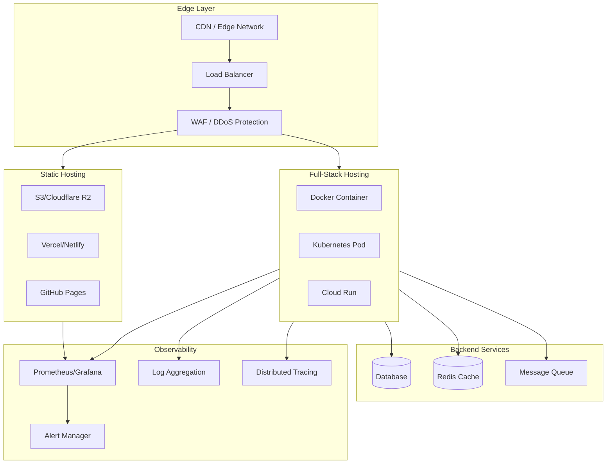

# Production-Grade Kobweb

## Overview

This document outlines production-grade patterns for deploying Kobweb applications. We cover static hosting, full-stack deployments, performance optimization, monitoring, security hardening, and operational excellence for enterprise deployments.

## Architecture



## Deployment Modes

### Static Export Deployment

```bash
# Export static site
kobweb export -PkobwebExportLayout=STATIC

# Output: build/dist/js/site/
# Deploy to any static host
```

### Vercel Deployment

```yaml
# vercel.json
{
  "version": 2,
  "buildCommand": "chmod +x gradlew && ./gradlew kobwebExport -PkobwebExportLayout=STATIC",
  "outputDirectory": "build/dist/js/site",
  "devCommand": "kobweb run",
  "installCommand": "./gradlew build",
  "framework": null,
  "regions": ["iad1", "sfo1", "lhr1"],
  "headers": [
    {
      "source": "/(.*)",
      "headers": [
        {
          "key": "X-Content-Type-Options",
          "value": "nosniff"
        },
        {
          "key": "X-Frame-Options",
          "value": "SAMEORIGIN"
        },
        {
          "key": "X-XSS-Protection",
          "value": "1; mode=block"
        },
        {
          "key": "Referrer-Policy",
          "value": "strict-origin-when-cross-origin"
        }
      ]
    }
  ]
}
```

### Netlify Deployment

```toml
# netlify.toml
[build]
  command = "chmod +x gradlew && ./gradlew kobwebExport -PkobwebExportLayout=STATIC"
  publish = "build/dist/js/site"

[build.environment]
  JAVA_VERSION = "17"
  KOBWEB_VERSION = "0.23.1"

[[redirects]]
  from = "/api/*"
  to = "/.netlify/functions/:splat"
  status = 200

[[headers]]
  for = "/*"
  [headers.values]
    X-Frame-Options = "SAMEORIGIN"
    X-XSS-Protection = "1; mode=block"
    X-Content-Type-Options = "nosniff"
    Referrer-Policy = "strict-origin-when-cross-origin"
```

### AWS S3 + CloudFront

```yaml
# .github/workflows/deploy-static.yml
name: Deploy to S3 + CloudFront

on:
  push:
    branches: [main]

jobs:
  deploy:
    runs-on: ubuntu-latest
    
    steps:
      - uses: actions/checkout@v3
      
      - name: Set up JDK 17
        uses: actions/setup-java@v3
        with:
          java-version: '17'
          distribution: 'temurin'
      
      - name: Build static site
        run: |
          chmod +x gradlew
          ./gradlew kobwebExport -PkobwebExportLayout=STATIC
      
      - name: Deploy to S3
        uses: aws-actions/configure-aws-credentials@v2
        with:
          aws-access-key-id: ${{ secrets.AWS_ACCESS_KEY_ID }}
          aws-secret-access-key: ${{ secrets.AWS_SECRET_ACCESS_KEY }}
          aws-region: us-east-1
      
      - name: Upload to S3
        run: |
          aws s3 sync build/dist/js/site/ s3://my-bucket/ \
            --delete \
            --cache-control "public,max-age=31536000,immutable"
      
      - name: Invalidate CloudFront
        run: |
          aws cloudfront create-invalidation \
            --distribution-id ${{ secrets.CLOUDFRONT_DISTRIBUTION_ID }} \
            --paths "/*"
```

### Full-Stack Docker Deployment

```dockerfile
# Dockerfile - Multi-stage build
FROM gradle:8-jdk17 AS builder

WORKDIR /app

# Copy build files
COPY build.gradle.kts settings.gradle.kts gradle.properties ./
COPY gradle gradle
COPY gradlew ./

# Download dependencies (cached layer)
RUN ./gradlew dependencies --no-daemon

# Copy source
COPY . .

# Build full-stack export
RUN ./gradlew kobwebExport -PkobwebExportLayout=FULLSTACK

# Production image
FROM eclipse-temurin:17-jre-alpine

# Security: non-root user
RUN addgroup -g 1001 -S nodejs && \
    adduser -S nodejs -u 1001

WORKDIR /app

# Copy built artifacts
COPY --from=builder --chown=nodejs:nodejs /app/build/dist/js/site ./site
COPY --from=builder --chown=nodejs:nodejs /app/build/libs/*.jar ./server.jar

# Health check
HEALTHCHECK --interval=30s --timeout=3s --start-period=10s --retries=3 \
  CMD wget -qO- http://localhost:8080/__kobweb/health || exit 1

EXPOSE 8080

USER nodejs

CMD ["java", "-jar", "server.jar"]
```

### Kubernetes Deployment

```yaml
# k8s/deployment.yaml
apiVersion: apps/v1
kind: Deployment
metadata:
  name: kobweb-app
  labels:
    app: kobweb-app
spec:
  replicas: 3
  selector:
    matchLabels:
      app: kobweb-app
  template:
    metadata:
      labels:
        app: kobweb-app
    spec:
      containers:
      - name: kobweb-app
        image: your-registry/kobweb-app:latest
        imagePullPolicy: Always
        ports:
        - containerPort: 8080
          name: http
          protocol: TCP
        env:
        - name: JAVA_OPTS
          value: "-Xmx512m -Xms256m"
        - name: DATABASE_URL
          valueFrom:
            secretKeyRef:
              name: db-secrets
              key: url
        - name: JWT_SECRET
          valueFrom:
            secretKeyRef:
              name: app-secrets
              key: jwt-secret
        resources:
          requests:
            cpu: "100m"
            memory: "256Mi"
          limits:
            cpu: "500m"
            memory: "512Mi"
        livenessProbe:
          httpGet:
            path: /__kobweb/health/live
            port: 8080
          initialDelaySeconds: 15
          periodSeconds: 20
        readinessProbe:
          httpGet:
            path: /__kobweb/health/ready
            port: 8080
          initialDelaySeconds: 5
          periodSeconds: 10
        securityContext:
          runAsNonRoot: true
          runAsUser: 1001
          allowPrivilegeEscalation: false
          readOnlyRootFilesystem: true
          capabilities:
            drop:
              - ALL
      securityContext:
        fsGroup: 1001
---
apiVersion: v1
kind: Service
metadata:
  name: kobweb-app
spec:
  selector:
    app: kobweb-app
  ports:
  - port: 80
    targetPort: 8080
    protocol: TCP
    name: http
  type: ClusterIP
---
apiVersion: autoscaling/v2
kind: HorizontalPodAutoscaler
metadata:
  name: kobweb-app-hpa
spec:
  scaleTargetRef:
    apiVersion: apps/v1
    kind: Deployment
    name: kobweb-app
  minReplicas: 3
  maxReplicas: 20
  metrics:
  - type: Resource
    resource:
      name: cpu
      target:
        type: Utilization
        averageUtilization: 70
  - type: Resource
    resource:
      name: memory
      target:
        type: Utilization
        averageUtilization: 80
```

### Google Cloud Run

```yaml
# cloudbuild.yaml
steps:
  - name: 'gcr.io/cloud-builders/docker'
    args: ['build', '-t', 'gcr.io/$PROJECT_ID/kobweb-app', '.']
  
  - name: 'gcr.io/cloud-builders/docker'
    args: ['push', 'gcr.io/$PROJECT_ID/kobweb-app']
  
  - name: 'gcr.io/google.com/cloudsdktool/cloud-sdk'
    entrypoint: gcloud
    args:
      - 'run'
      - 'deploy'
      - 'kobweb-app'
      - '--image=gcr.io/$PROJECT_ID/kobweb-app'
      - '--region=us-central1'
      - '--platform=managed'
      - '--allow-unauthenticated'
      - '--memory=512Mi'
      - '--cpu=1'
      - '--concurrency=80'
      - '--timeout=300'
      - '--set-env-vars=DATABASE_URL=${_DATABASE_URL}'

substitutions:
  _DATABASE_URL: ${DATABASE_URL}
```

## Performance Optimization

### Bundle Size Optimization

```kotlin
// build.gradle.kts
tasks.withType<Kotlin2JsCompile>().configureEach {
    compilerOptions {
        // Enable tree shaking
        freeCompilerArgs.add("-Xir-dce=true")
        
        // Optimize for size
        freeCompilerArgs.add("-Xopt-in=kotlin.js.ExperimentalJsExport")
    }
}

// webpack.config.d/optimize.config.js
module.exports = {
    optimization: {
        minimize: true,
        splitChunks: {
            chunks: 'all',
            cacheGroups: {
                vendors: {
                    test: /[\\/]node_modules[\\/]/,
                    priority: -10,
                    filename: 'vendors.[contenthash].js'
                },
                common: {
                    minChunks: 2,
                    priority: -20,
                    reuseExistingChunk: true,
                    filename: 'common.[contenthash].js'
                }
            }
        }
    }
}
```

### Image Optimization

```kotlin
// gradle/plugins/image-optimization.gradle.kts
tasks.register("optimizeImages") {
    doLast {
        val inputDir = file("src/jsMain/resources/public/images")
        val outputDir = file("build/dist/js/site/images")
        
        inputDir.walk().filter { it.extension in listOf("png", "jpg", "webp") }
            .forEach { file ->
                val relativePath = file.relativeTo(inputDir)
                val outputFile = outputDir.resolve(relativePath)
                
                when (file.extension) {
                    "png" -> optimizePng(file, outputFile)
                    "jpg" -> optimizeJpg(file, outputFile)
                    "webp" -> optimizeWebp(file, outputFile)
                }
            }
    }
}

fun optimizePng(input: File, output: File) {
    exec {
        commandLine("pngquant", "--quality=65-80", "--output", output.path, input.path)
    }
}
```

### Lazy Loading

```kotlin
// Lazy load components
@Composable
fun PageWithLazyContent() {
    var heavyComponentLoaded by remember { mutableStateOf(false) }
    
    Column {
        // Immediate content
        Header()
        
        // Lazy loaded content
        if (heavyComponentLoaded) {
            HeavyComponent()
        } else {
            // Placeholder
            Box(Modifier.size(200.px)) {
                Text("Loading...")
            }
            
            // Load after initial render
            LaunchedEffect(Unit) {
                delay(100)  // Let initial render complete
                heavyComponentLoaded = true
            }
        }
    }
}

// Lazy load images
@Composable
fun LazyImage(
    src: String,
    alt: String,
    modifier: Modifier = Modifier
) {
    var loaded by remember { mutableStateOf(false) }
    var inView by remember { mutableStateOf(false) }
    
    val ref = remember { mutableStateOf<Element?>(null) }
    
    DisposableEffect(Unit) {
        val observer = IntersectionObserver { entries ->
            entries.forEach { entry ->
                if (entry.isIntersecting) {
                    inView = true
                    observer.disconnect()
                }
            }
        }
        
        ref.value?.let { observer.observe(it) }
        
        onDispose { observer.disconnect() }
    }
    
    Img(
        src = if (inView) src else "data:image/gif;base64,R0lGODlhAQABAIAAAAAAAP///yH5BAEAAAAALAAAAAABAAEAAAIBRAA7",
        alt = alt,
        attrs = {
            modifier(modifier)
            ref { ref.value = it }
            onLoad { loaded = true }
        }
    )
}
```

### Code Splitting

```kotlin
// webpack.config.d/split.config.js
module.exports = {
    optimization: {
        runtimeChunk: 'single',
        splitChunks: {
            chunks: 'all',
            maxInitialRequests: 25,
            minSize: 20000,
            cacheGroups: {
                kobweb: {
                    test: /[\\/]kobweb[\\/]/,
                    name: 'kobweb',
                    priority: 20
                },
                compose: {
                    test: /[\\/]compose[\\/]/,
                    name: 'compose',
                    priority: 20
                }
            }
        }
    }
}

// Dynamic imports for routes
@Composable
fun App() {
    val router = Router.current
    
    Suspense(loading = { Text("Loading...") }) {
        Routes {
            Route(path = "/") {
                // Lazy load page component
                LazyComponent { HomePage() }
            }
            Route(path = "/about") {
                LazyComponent { AboutPage() }
            }
        }
    }
}
```

## Security Hardening

### HTTPS Enforcement

```kotlin
// src/jvmMain/kotlin/myapp/ServerConfig.kt
package myapp

import io.ktor.server.*
import io.ktor.server.engine.*
import io.ktor.server.netty.*
import io.ktor.server.routing.*
import io.ktor.server.plugins.hsts.*
import io.ktor.server.plugins.contentnegotiation.*
import kotlinx.serialization.json.Json

fun Application.module() {
    // Force HTTPS
    install(HSTS) {
        maxAgeSeconds = 31536000  // 1 year
        includeSubDomains = true
        preload = true
    }
    
    // JSON serialization
    install(ContentNegotiation) {
        json(Json {
            prettyPrint = false
            isLenient = false
        })
    }
    
    // CORS configuration
    install(io.ktor.server.plugins.cors.routing.CORS) {
        allowHost("your-domain.com", schemes = listOf("https"))
        allowHeader(io.ktor.http.HttpHeaders.Authorization)
        allowHeader(io.ktor.http.HttpHeaders.ContentType)
    }
}
```

### Rate Limiting

```kotlin
// src/jvmMain/kotlin/myapp/api/RateLimit.kt
package myapp.api

import io.ktor.server.*
import io.ktor.server.plugins.ratelimit.*
import io.ktor.http.*
import java.util.concurrent.ConcurrentHashMap

class RateLimitConfig {
    val rateLimiter = RateLimiter.create(
        rate = 100,  // requests per minute
        capacity = 100
    )
    
    val requestCounts = ConcurrentHashMap<String, Long>()
}

fun Application.installRateLimiting() {
    install(RateLimit) {
        global {
            rateLimiter(100, 100)  // 100 requests per minute
        }
        
        route("api") {
            rateLimiter(60, 60)  // 60 requests per minute for API
        }
    }
}
```

### Input Validation

```kotlin
// src/jvmMain/kotlin/myapp/api/validation.kt
package myapp.api

import com.varabyte.kobweb.api.*
import io.ktor.http.*

// Email validation
fun validateEmail(email: String): Boolean {
    return email.matches(Regex("^[A-Za-z0-9+_.-]+@[A-Za-z0-9.-]+\\.[A-Za-z]{2,}$"))
}

// Password strength validation
fun validatePassword(password: String): PasswordValidationResult {
    val errors = mutableListOf<String>()
    
    if (password.length < 8) errors.add("Password must be at least 8 characters")
    if (!password.any { it.isUpperCase() }) errors.add("Must contain uppercase letter")
    if (!password.any { it.isLowerCase() }) errors.add("Must contain lowercase letter")
    if (!password.any { it.isDigit() }) errors.add("Must contain number")
    if (!password.any { !it.isLetterOrDigit() }) errors.add("Must contain special character")
    
    return if (errors.isEmpty()) {
        PasswordValidationResult.Valid
    } else {
        PasswordValidationResult.Invalid(errors)
    }
}

// Sanitize string input
fun sanitizeInput(input: String): String {
    return input
        .replace(Regex("<[^>]*>"), "")  // Remove HTML tags
        .trim()
        .take(10000)  // Max length
}

// Usage in API handler
@Api(value = "users/create", method = HttpMethod.Post)
suspend fun createUser(ctx: ApiContext) {
    val userData = ctx.bodyAs<UserCreateRequest>()
    
    // Validate email
    if (!validateEmail(userData.email)) {
        return ctx.respondError("Invalid email format")
    }
    
    // Validate password
    when (val result = validatePassword(userData.password)) {
        is PasswordValidationResult.Invalid -> {
            return ctx.respondError("Password requirements: ${result.errors.joinToString(", ")}")
        }
        PasswordValidationResult.Valid -> {}
    }
    
    // Sanitize name
    val sanitizedName = sanitizeInput(userData.name)
    
    // Continue with user creation...
}
```

### SQL Injection Prevention

```kotlin
// Use parameterized queries with Exposed
// src/jvmMain/kotlin/myapp/db/UserRepository.kt

import org.jetbrains.exposed.sql.*

// BAD - vulnerable to SQL injection
// fun getUserByName(name: String) = 
//     Users.select { "name = '$name'" }  // NEVER DO THIS

// GOOD - parameterized query
fun getUserByName(name: String) = 
    Users.select { Users.name eq name }

// Using transactions
fun createUser(email: String, passwordHash: String, name: String): User {
    return transaction {
        Users.insert {
            it[id] = generateUuid()
            it[email] = email  // Parameterized automatically
            it[passwordHash] = passwordHash
            it[name] = name
        } returning {
            User.fromRow(it)
        }
    }
}
```

## Monitoring & Observability

### Health Check Endpoints

```kotlin
// src/jvmMain/kotlin/myapp/api/HealthApi.kt
package myapp.api

import com.varabyte.kobweb.api.*
import io.ktor.http.*

@Api("health/live")
suspend fun livenessCheck(ctx: ApiContext) {
    ctx.respond(mapOf(
        "status" to "alive",
        "timestamp" to System.currentTimeMillis()
    ))
}

@Api("health/ready")
suspend fun readinessCheck(ctx: ApiContext) {
    val checks = mutableMapOf<String, Any>()
    var healthy = true
    
    // Database check
    try {
        val start = System.currentTimeMillis()
        database.healthCheck()
        val latency = System.currentTimeMillis() - start
        
        checks["database"] = mapOf(
            "status" to "up",
            "latency_ms" to latency
        )
        
        if (latency > 1000) healthy = false
    } catch (e: Exception) {
        checks["database"] = mapOf(
            "status" to "down",
            "error" to e.message
        )
        healthy = false
    }
    
    ctx.respond(mapOf(
        "status" to (if (healthy) "ready" else "unhealthy"),
        "timestamp" to System.currentTimeMillis(),
        "checks" to checks
    ))
}
```

### Metrics Collection

```kotlin
// src/jvmMain/kotlin/myapp/metrics/Metrics.kt
package myapp.metrics

import io.ktor.server.*
import io.ktor.server.metrics.micrometer.*
import io.micrometer.prometheus.*
import io.micrometer.core.instrument.*

fun Application.installMetrics() {
    val registry = PrometheusMeterRegistry(PrometheusConfig.DEFAULT)
    
    // Install Micrometer metrics
    install(MicrometerMetrics) {
        registry = registry
        
        // Track HTTP requests
        timerBuilder { name, tags ->
            registry.timer(name, *tags)
        }
    }
    
    // Custom business metrics
    val userSignups = registry.counter("user_signups_total")
    val ordersProcessed = registry.counter("orders_processed_total")
    
    // Expose metrics endpoint
    routing {
        get("/metrics") {
            call.respondText(registry.scrape())
        }
    }
}
```

### Structured Logging

```kotlin
// src/jvmMain/kotlin/myapp/logging/Logging.kt
package myapp.logging

import io.ktor.server.*
import io.ktor.server.plugins.callloging.*
import io.ktor.util.*
import org.slf4j.event.Level

fun Application.installLogging() {
    install(CallLogging) {
        level = Level.INFO
        filter { call ->
            call.request.path().startsWith("/api")
        }
        
        format { call ->
            val status = call.response.status()
            val method = call.request.httpMethod.value
            val path = call.request.path()
            val duration = call.attributes.getOrNull(ResponseTimeAttributeKey) ?: 0
            
            "$method $path $status (${duration}ms)"
        }
    }
}

// Request ID for tracing
class RequestId(val value: String)

val RequestIdKey = AttributeKey<RequestId>("RequestId")

fun Application.installRequestId() {
    intercept(ApplicationCallPipeline.Monitoring) {
        val requestId = call.request.headers["X-Request-Id"] ?: generateUuid()
        call.attributes.put(RequestIdKey, RequestId(requestId))
        call.response.headers.append("X-Request-Id", requestId)
    }
}
```

### Distributed Tracing

```kotlin
// src/jvmMain/kotlin/myapp/tracing/Tracing.kt
package myapp.tracing

import io.opentelemetry.api.trace.*
import io.opentelemetry.context.*
import io.opentelemetry.sdk.*
import io.opentelemetry.exporter.jaeger.*

fun initTracing(serviceName: String, endpoint: String) {
    val tracerSdkFactory = OpenTelemetrySdk.builder()
        .setTracerProvider(
            SdkTracerProvider.builder()
                .addSpanProcessor(
                    BatchSpanProcessor.builder(
                        JaegerGrpcSpanExporter.builder()
                            .setEndpoint(endpoint)
                            .build()
                    ).build()
                )
                .build()
        )
        .build()
    
    val tracer = tracerSdkFactory.getTracer(serviceName)
}

// Use in API handlers
@Api("users/fetch")
suspend fun fetchUser(ctx: ApiContext) {
    val span = tracer.spanBuilder("fetchUser")
        .setSpanKind(SpanKind.SERVER)
        .setAttribute("user.id", ctx.pathParams["userId"] ?: "unknown")
        .startSpan()
    
    val scope = span.makeCurrent()
    
    try {
        // Database query creates child span automatically
        val user = database.getUser(ctx.pathParams["userId"]!!)
        span.setAttribute("user.found", user != null)
        
        ctx.respond(user)
    } catch (e: Exception) {
        span.recordException(e)
        span.setStatus(StatusCode.ERROR)
        throw e
    } finally {
        scope.close()
        span.end()
    }
}
```

## Scaling Strategies

### Horizontal Scaling

```yaml
# docker-compose.scale.yml
version: '3.8'

services:
  app:
    build: .
    deploy:
      replicas: 3
      resources:
        limits:
          cpus: '1'
          memory: 512M
    environment:
      - DATABASE_URL=postgresql://user:pass@db:5432/app
      - REDIS_URL=redis://redis:6379
    depends_on:
      - db
      - redis

  db:
    image: postgres:15
    volumes:
      - postgres-data:/var/lib/postgresql/data
    environment:
      - POSTGRES_USER=user
      - POSTGRES_PASSWORD=pass
      - POSTGRES_DB=app

  redis:
    image: redis:7-alpine
    volumes:
      - redis-data:/data

volumes:
  postgres-data:
  redis-data:
```

### Database Connection Pooling

```kotlin
// src/jvmMain/kotlin/myapp/db/Database.kt
package myapp.db

import com.zaxxer.hikari.*
import org.jetbrains.exposed.sql.*

object Database {
    private lateinit var hikariConfig: HikariConfig
    private lateinit var dataSource: HikariDataSource
    
    fun init() {
        hikariConfig = HikariConfig().apply {
            jdbcUrl = System.getenv("DATABASE_URL")
            username = System.getenv("DB_USER")
            password = System.getenv("DB_PASSWORD")
            
            // Connection pool settings
            maximumPoolSize = 20
            minimumIdle = 5
            connectionTimeout = 30000
            idleTimeout = 600000
            maxLifetime = 1800000
            
            // Health check
            connectionTestQuery = "SELECT 1"
            validationTimeout = 5000
        }
        
        dataSource = HikariDataSource(hikariConfig)
        Database.connect(dataSource)
    }
}
```

### Caching Strategy

```kotlin
// src/jvmMain/kotlin/myapp/cache/Cache.kt
package myapp.cache

import io.github.microutils.kotlin.coroutines.caching.*
import kotlinx.coroutines.*
import java.util.concurrent.*

class CacheConfig(
    val maxSize: Long = 1000,
    val expireAfterWrite: Long = 300,  // seconds
    val expireAfterAccess: Long = 60   // seconds
)

class CacheManager(private val config: CacheConfig) {
    private val cache = Caffeine.newBuilder()
        .maximumSize(config.maxSize)
        .expireAfterWrite(config.expireAfterWrite, TimeUnit.SECONDS)
        .expireAfterAccess(config.expireAfterAccess, TimeUnit.SECONDS)
        .recordStats()
        .build<String, Any>()
    
    suspend fun <T> getOrPut(key: String, loader: suspend () -> T): T {
        val existing = cache.getIfPresent(key) as? T
        if (existing != null) return existing
        
        val value = loader()
        cache.put(key, value)
        return value
    }
    
    fun invalidate(key: String) {
        cache.invalidate(key)
    }
    
    fun invalidatePattern(pattern: String) {
        cache.asMap().keys.filter { it.matches(pattern.toRegex()) }
            .forEach { cache.invalidate(it) }
    }
}

// Usage
val cacheManager = CacheManager(CacheConfig())

@Api("users/fetch")
suspend fun fetchUser(ctx: ApiContext) {
    val userId = ctx.pathParams["userId"] ?: return
    
    val user = cacheManager.getOrPut("user:$userId") {
        // Expensive database call
        database.getUser(userId)
    }
    
    ctx.respond(user)
}
```

## Production Checklist

### Pre-Deployment

- [ ] Set `NODE_ENV=production` or equivalent
- [ ] Configure database connection pooling
- [ ] Set up SSL/TLS certificates
- [ ] Configure CORS for production domain
- [ ] Enable compression (gzip/brotli)
- [ ] Set up structured logging
- [ ] Configure health check endpoints
- [ ] Set up metrics collection
- [ ] Configure distributed tracing
- [ ] Set up alerting rules

### Security

- [ ] Enable HTTPS enforcement (HSTS)
- [ ] Configure rate limiting
- [ ] Set up input validation
- [ ] Use parameterized queries (SQL injection prevention)
- [ ] Sanitize user input (XSS prevention)
- [ ] Configure CSP headers
- [ ] Set up authentication/authorization
- [ ] Rotate secrets regularly
- [ ] Enable security scanning in CI/CD

### Performance

- [ ] Enable bundle optimization (tree shaking, minification)
- [ ] Configure code splitting
- [ ] Optimize images (WebP, compression)
- [ ] Enable lazy loading
- [ ] Configure CDN for static assets
- [ ] Set up caching headers
- [ ] Configure database indexes
- [ ] Set up query result caching

### Monitoring

- [ ] Configure liveness/readiness probes
- [ ] Set up Prometheus metrics
- [ ] Configure log aggregation
- [ ] Set up distributed tracing
- [ ] Create alerting rules (error rate, latency, availability)
- [ ] Set up dashboard (Grafana)
- [ ] Configure on-call notifications

## Conclusion

Production-grade Kobweb deployment requires:

1. **Deployment Strategy**: Static export vs full-stack based on needs
2. **Hosting Options**: Vercel/Netlify for static, Docker/K8s for full-stack
3. **Performance Optimization**: Bundle optimization, lazy loading, caching
4. **Security Hardening**: HTTPS, rate limiting, input validation, SQL injection prevention
5. **Monitoring**: Health checks, metrics, logging, distributed tracing
6. **Scaling**: Horizontal scaling, connection pooling, caching

These patterns ensure reliable, secure, and performant Kobweb applications at enterprise scale.
