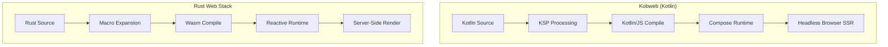

# Rust Revision: Kobweb Patterns in Rust

## Overview

This document translates Kobweb's Kotlin/web patterns into Rust equivalents. We explore how to achieve similar developer experience with compile-time routing, server-side rendering, component systems, and full-stack web development using Rust frameworks like Axum, Leptos, Yew, and Dioxus.

## Key Differences

```kotlin
// Kobweb - Kotlin with Compose HTML
@Page
@Composable
fun HomePage() {
    var count by remember { mutableStateOf(0) }
    
    Column {
        H1 { Text("Hello, Kobweb!") }
        Text("Count: $count")
        Button(onClick = { count++ }) {
            Text("Increment")
        }
    }
}
```

```rust
// Leptos - Rust with signals and JSX-like syntax
#[component]
fn HomePage() -> impl IntoView {
    let (count, set_count) = create_signal(0);
    
    view! {
        <Column>
            <h1>"Hello, Rust!"</h1>
            <p>"Count: " {count}</p>
            <button on:click=move |_| set_count.update(|n| *n += 1)>
                "Increment"
            </button>
        </Column>
    }
}
```

## Architecture Comparison



## Core Web Frameworks

### Leptos

```rust
// Leptos provides full-stack Reactivity with SSR support
use leptos::*;

// Component definition
#[component]
fn Counter(initial_value: i32) -> impl IntoView {
    let (count, set_count) = create_signal(initial_value);
    
    // Server-side data fetching
    let server_data = create_resource(
        || (),
        |_| async { fetch_server_data().await }
    );
    
    view! {
        <div>
            <h2>"Counter Example"</h2>
            
            // Reactive text
            <p>"Count: " {count}</p>
            
            // Event handling
            <button on:click=move |_| set_count.update(|n| *n += 1)>
                "Increment"
            </button>
            
            // Conditional rendering
            {move || if count() > 5 {
                view! { <p>"Count is high!"</p> }.into_view()
            } else {
                ().into_view()
            }}
            
            // Server data with loading state
            {move || server_data.with(|data| match data {
                Some(Ok(d)) => view! { <p>"Data: " {d}</p> }.into_view(),
                Some(Err(e)) => view! { <p class="error">"Error: " {e}</p> }.into_view(),
                None => view! { <p>"Loading..."</p> }.into_view(),
            })}
        </div>
    }
}

// Server function (RPC-style)
#[server(FetchData, "/api")]
pub async fn fetch_server_data() -> Result<String, ServerFnError> {
    // Runs on server only
    Ok("Server data".to_string())
}
```

### Axum + Leptos Integration

```rust
// src/main.rs - Full-stack Axum + Leptos app
use axum::Router;
use leptos::*;
use leptos_axum::{generate_route_list, LeptosRoutes};
use my_app::app::*;

#[tokio::main]
async fn main() {
    // Configure Leptos
    let conf = get_configuration(None).await.unwrap();
    let addr = conf.leptos_options.site_addr;
    
    // Generate route list from components
    let routes = generate_route_list(App);
    
    // Build Axum router
    let app = Router::new()
        .leptos_routes(&conf.leptos_options, routes, App)
        .fallback(file_and_error_handler)
        .with_state(conf.leptos_options);
    
    // Start server
    let listener = tokio::net::TcpListener::bind(&addr).await.unwrap();
    axum::serve(listener, app).await.unwrap();
}
```

### Yew (Component-Based)

```rust
// Yew uses a different component model
use yew::prelude::*;

enum Msg {
    Increment,
    Decrement,
}

#[function_component(Counter)]
pub fn counter() -> Html {
    let counter = use_state(|| 0);
    
    let increment = {
        let counter = counter.clone();
        Callback::from(move |_| counter.set(*counter + 1))
    };
    
    let decrement = {
        let counter = counter.clone();
        Callback::from(move |_| counter.set(*counter - 1))
    };
    
    html! {
        <div>
            <button onclick={decrement}>{ "-1" }</button>
            <h1>{ *counter }</h1>
            <button onclick={increment}>{ "+1" }</button>
        </div>
    }
}
```

### Dioxus (Cross-Platform)

```rust
// Dioxus targets web, desktop, mobile, TUI
use dioxus::prelude::*;

fn App() -> Element {
    let mut count = use_signal(|| 0);
    
    rsx! {
        div {
            h1 { "High-Fidelity app for every platform" }
            h3 { "Count: {count}" }
            button { onclick: move |_| count += 1, "Increment" }
            button { onclick: move |_| count -= 1, "Decrement" }
        }
    }
}
```

## Routing Systems

### File-Based Routing (Kobweb-like)

```rust
// Using leptos_router for file-based routing simulation
// build.rs generates routes from directory structure

use leptos_router::*;

#[component]
pub fn App() -> impl IntoView {
    view! {
        <Router>
            <Routes>
                // Static routes
                <Route path="/" view=HomePage/>
                <Route path="/about" view=AboutPage/>
                
                // Dynamic routes
                <Route path="/users/:id" view=UserProfile/>
                
                // Nested routes
                <Route path="/blog" view=BlogLayout>
                    <Route path="/:slug" view=BlogPost/>
                </Route>
            </Routes>
        </Router>
    }
}

// Access route params
#[component]
fn UserProfile() -> impl IntoView {
    let params = use_params_map();
    let user_id = move || params.with(|p| p.get("id").cloned().unwrap_or_default());
    
    view! {
        <div>"User Profile: " {user_id}</div>
    }
}
```

### Macro-Generated Routes

```rust
// Custom macro for route definition
// Similar to Kobweb's @Page annotation

#[route("/", HomePage)]
#[route("/about", AboutPage)]
#[route("/users/:id", UserProfile)]
pub struct AppRoutes;

// Macro expands to:
impl RouteHandler for AppRoutes {
    fn routes() -> Vec<RouteDef> {
        vec![
            RouteDef::new("/", HomePage),
            RouteDef::new("/about", AboutPage),
            RouteDef::new("/users/:id", UserProfile),
        ]
    }
}

// Procedural macro implementation
#[proc_macro_attribute]
pub fn route(args: TokenStream, item: TokenStream) -> TokenStream {
    // Parse route definition
    // Generate route registration code
    // Similar to Kobweb's KSP processing
}
```

## Component System

### Basic Component

```rust
// Leptos component
#[component]
fn Button(
    on_click: Callback<MouseEvent>,
    #[prop(default = ButtonVariant::Solid)]
    variant: ButtonVariant,
    #[prop(optional)]
    disabled: bool,
    children: Children,
) -> impl IntoView {
    let class = match variant {
        ButtonVariant::Solid => "btn-solid",
        ButtonVariant::Outline => "btn-outline",
        ButtonVariant::Ghost => "btn-ghost",
    };
    
    view! {
        <button 
            class=class
            on:click=on_click
            disabled=disabled
        >
            {children()}
        </button>
    }
}

// Usage
#[component]
fn Page() -> impl IntoView {
    view! {
        <Button on_click=|_| println!("Clicked!")>
            "Click me"
        </Button>
    }
}
```

### Component with Slots

```rust
// Card component with slots (like Kobweb's CardHeader, CardBody)
#[component]
fn Card(
    #[prop(optional)]
    header: Option<Children>,
    #[prop(optional)]
    footer: Option<Children>,
    children: Children,
) -> impl IntoView {
    view! {
        <div class="card">
            {header.map(|h| view! { <div class="card-header">{h()}</div> })}
            <div class="card-body">{children()}</div>
            {footer.map(|f| view! { <div class="card-footer">{f()}</div> })}
        </div>
    }
}

// Usage
view! {
    <Card
        header=|| view! { <h3>"Card Title"</h3> }
        footer=|| view! { <button>"Action"</button> }
    >
        <p>"Card content goes here..."</p>
    </Card>
}
```

### Layout Components

```rust
// Row layout (Flexbox)
#[component]
fn Row(
    #[prop(optional)]
    align: AlignItems,
    #[prop(optional)]
    justify: JustifyContent,
    #[prop(optional)]
    spacing: Option<u16>,
    children: Children,
) -> impl IntoView {
    let style = format!(
        "display: flex; flex-direction: row; align-items: {}; justify-content: {}; gap: {}px;",
        match align {
            AlignItems::Start => "flex-start",
            AlignItems::Center => "center",
            AlignItems::End => "flex-end",
        },
        match justify {
            JustifyContent::Start => "flex-start",
            JustifyContent::Center => "center",
            JustifyContent::End => "flex-end",
        },
        spacing.unwrap_or(0)
    );
    
    view! {
        <div style=style>{children()}</div>
    }
}

// Grid layout
#[component]
fn Grid(
    columns: String,
    #[prop(optional)]
    gap: u16,
    children: Children,
) -> impl IntoView {
    view! {
        <div style=format!("display: grid; grid-template-columns: {}; gap: {}px;", columns, gap)>
            {children()}
        </div>
    }
}
```

## State Management

### Signals (Reactive State)

```rust
use leptos::*;

#[component]
fn Counter() -> impl IntoView {
    // Local state
    let (count, set_count) = create_signal(0);
    
    // Derived state (computed, cached)
    let doubled = create_memo(move |_| count() * 2);
    
    // Effect (runs when count changes)
    create_effect(move |_| {
        log::info!("Count changed to {}", count());
    });
    
    view! {
        <div>
            <p>"Count: " {count}</p>
            <p>"Doubled: " {doubled}</p>
            <button on:click=move |_| set_count.update(|n| *n += 1)>
                "Increment"
            </button>
        </div>
    }
}
```

### Global State (Context)

```rust
// Define context
#[derive(Clone, Copy)]
pub struct UserContext {
    pub user: ReadSignal<Option<User>>,
    pub set_user: WriteSignal<Option<User>>,
}

// Provide context
#[component]
fn AppProvider(children: Children) -> impl IntoView {
    let (user, set_user) = create_signal(None);
    
    let ctx = UserContext { user, set_user };
    
    view! {
        <Provider value=ctx>
            {children()}
        </Provider>
    }
}

// Consume context
#[component]
fn UserProfile() -> impl IntoView {
    let ctx = expect_context::<UserContext>();
    
    view! {
        {move || ctx.user.with(|u| match u {
            Some(user) => view! { <p>"Welcome, " {&user.name}</p> }.into_view(),
            None => view! { <p>"Not logged in"</p> }.into_view(),
        })}
    }
}
```

### Server State (Query Cache)

```rust
// Using leptos_query (similar to React Query)
use leptos_query::*;

#[component]
fn UserList() -> impl IntoView {
    // Query with caching
    let users_query = use_query(
        query_options("users", |_| async { fetch_users().await }),
    );
    
    view! {
        <div>
            {move || match users_query.data.get() {
                Some(Ok(users)) => view! {
                    <ul>
                        {users.iter().map(|u| view! { <li>{&u.name}</li> }).collect::<Vec<_>>()}
                    </ul>
                }.into_view(),
                Some(Err(e)) => view! { <p class="error">"Error: " {e}</p> }.into_view(),
                None => view! { <p>"Loading..."</p> }.into_view(),
            }}
        </div>
    }
}

// Mutation
#[component]
fn CreateUserForm() -> impl IntoView {
    let query_client = use_query_client();
    
    let create_user = use_mutation(
        mutation_options(|input: CreateUserInput| async move {
            create_user_api(input).await
        })
        .on_success(move |_| {
            // Invalidate users query
            query_client.invalidate_query("users");
        }),
    );
    
    view! {
        <form on:submit=|ev| {
            ev.prevent_default();
            create_user.dispatch(CreateUserInput { name: "New User".to_string() });
        }>
            <button type="submit" disabled=create_user.pending>
                "Create User"
            </button>
        </form>
    }
}
```

## Server-Side Rendering

### SSR with Axum

```rust
// src/lib.rs - Leptos SSR setup
use leptos::*;
use leptos_axum::*;
use axum::Router;

#[component]
pub fn App() -> impl IntoView {
    view! {
        <main>
            <Routes>
                <Route path="/" view=HomePage/>
                <Route path="/about" view=AboutPage/>
            </Routes>
        </main>
    }
}

// Handler for SSR
pub async fn render_app(
    Path(path): Path<String>,
    Query(url_params): Query<HashMap<String, String>>,
) -> impl IntoResponse {
    let options = LeptosOptions::from_request_parts(&parts, &state).await?;
    
    render_to_stream_with_prefix(
        view! { <App/> },
        |head| view! { <head>{/* Additional head content */}</head> },
        &options,
        move |head| {
            // Inject initial data for hydration
            provide_context(ServerContext { path, url_params });
        }
    ).await
}
```

### Hydration

```rust
// src/main.rs - Client-side hydration
#[cfg(feature = "hydrate")]
fn main() {
    console_error_panic_hook::set_once();
    leptos::mount_to_body(App);
}

// Hydration state transfer
#[server(GetInitialState)]
pub async fn get_initial_state() -> Result<InitialState, ServerFnError> {
    Ok(InitialState {
        user: get_current_user().await,
        config: get_config().await,
    })
}

// Client component that hydrates with server state
#[component]
fn HydratedApp() -> impl IntoView {
    // Get server state
    let initial_state = expect_context::<InitialState>();
    
    // Use state in reactive system
    let (user, set_user) = create_signal(initial_state.user);
    
    view! {
        <App initial_user=user/>
    }
}
```

## API Routes

### Axum Route Handlers

```rust
// src/api/users.rs
use axum::{
    extract::{Path, State},
    json::Json,
    http::StatusCode,
};
use serde::{Deserialize, Serialize};

#[derive(Serialize)]
pub struct User {
    id: String,
    name: String,
    email: String,
}

#[derive(Deserialize)]
pub struct CreateUserRequest {
    name: String,
    email: String,
}

// GET /api/users/:id
pub async fn get_user(
    Path(user_id): Path<String>,
    State(db): State<DatabasePool>,
) -> Result<Json<User>, StatusCode> {
    let user = db.find_user(&user_id)
        .await
        .ok_or(StatusCode::NOT_FOUND)?;
    
    Ok(Json(user))
}

// POST /api/users
pub async fn create_user(
    State(db): State<DatabasePool>,
    Json(req): Json<CreateUserRequest>,
) -> Result<(StatusCode, Json<User>), StatusCode> {
    // Validate
    if req.email.is_empty() {
        return Err(StatusCode::BAD_REQUEST);
    }
    
    let user = db.create_user(&req.name, &req.email)
        .await
        .ok_or(StatusCode::CONFLICT)?;
    
    Ok((StatusCode::CREATED, Json(user)))
}

// Router setup
pub fn users_router() -> Router<DatabasePool> {
    Router::new()
        .route("/users/:id", get(get_user))
        .route("/users", post(create_user))
}
```

### Leptos Server Functions

```rust
// RPC-style server functions (runs on server, called from client)
use leptos::*;

#[server(FetchUser, "/api")]
pub async fn fetch_user(user_id: String) -> Result<User, ServerFnError> {
    // Database access here
    let pool = pool().await?;
    let user = sqlx::query_as::<_, User>(
        "SELECT * FROM users WHERE id = ?"
    )
    .bind(&user_id)
    .fetch_one(&pool)
    .await
    .map_err(|_| ServerFnError::ServerError("User not found".to_string()))?;
    
    Ok(user)
}

#[server(CreateUser, "/api")]
pub async fn create_user(
    name: String,
    email: String,
) -> Result<User, ServerFnError> {
    let pool = pool().await?;
    
    let user = sqlx::query_as::<_, User>(
        "INSERT INTO users (name, email) VALUES (?, ?) RETURNING *"
    )
    .bind(&name)
    .bind(&email)
    .fetch_one(&pool)
    .await
    .map_err(|e| ServerFnError::ServerError(e.to_string()))?;
    
    Ok(user)
}

// Client usage
#[component]
fn UserForm() -> impl IntoView {
    let (name, set_name) = create_signal(String::new());
    let (email, set_email) = create_signal(String::new());
    
    let create_action = Action::new(move |()| {
        let name = name.get();
        let email = email.get();
        async move { create_user(name, email).await }
    });
    
    view! {
        <form on:submit=|ev| {
            ev.prevent_default();
            create_action.dispatch(());
        }>
            <input 
                type="text" 
                prop:value=name
                on:input=move |ev| set_name(event_target_value(&ev))
            />
            <input 
                type="email" 
                prop:value=email
                on:input=move |ev| set_email(event_target_value(&ev))
            />
            <button type="submit" disabled=create_action.pending()>
                "Create"
            </button>
        </form>
    }
}
```

## WebSocket Streams

```rust
// Real-time communication with WebSockets
use axum::{
    extract::ws::{WebSocket, WebSocketUpgrade, Message},
    response::IntoResponse,
};
use futures::{stream::SplitSink, SinkExt, StreamExt};

pub async fn ws_handler(
    ws: WebSocketUpgrade,
) -> impl IntoResponse {
    ws.on_upgrade(handle_socket)
}

async fn handle_socket(socket: WebSocket) {
    let (mut sender, mut receiver) = socket.split();
    
    // Spawn task for receiving messages
    tokio::spawn(async move {
        while let Some(msg) = receiver.next().await {
            match msg {
                Ok(Message::Text(text)) => {
                    println!("Received: {}", text);
                    // Process message...
                }
                Ok(Message::Close(_)) => break,
                _ => {}
            }
        }
    });
    
    // Send messages
    sender.send(Message::Text("Welcome!".to_string())).await.ok();
}

// Broadcast pattern (pub/sub)
use tokio::sync::broadcast;

struct ChatState {
    tx: broadcast::Sender<String>,
}

pub async fn chat_ws(
    ws: WebSocketUpgrade,
    State(state): State<Arc<ChatState>>,
) -> impl IntoResponse {
    ws.on_upgrade(move |socket| handle_chat_socket(socket, state))
}

async fn handle_chat_socket(
    socket: WebSocket,
    state: Arc<ChatState>,
) {
    let (mut sender, mut receiver) = socket.split();
    let mut rx = state.tx.subscribe();
    
    // Broadcast received messages
    tokio::spawn(async move {
        while let Some(Ok(msg)) = rx.recv().await {
            sender.send(Message::Text(msg)).await.ok();
        }
    });
    
    // Send to broadcast channel
    while let Some(Ok(Message::Text(text))) = receiver.next().await {
        state.tx.send(text).ok();
    }
}
```

## Styling System

### CSS Modules

```rust
// Using gloo-style or similar
use gloo_style::style;

fn create_button_styles() -> String {
    style!(
        .button {
            display: inline-flex;
            align-items: center;
            padding: 8px 16px;
            border-radius: 4px;
            font-weight: 500;
            cursor: pointer;
            transition: all 150ms ease-in-out;
        }
        
        .solid {
            background-color: #3B82F6;
            color: white;
            border: 1px solid transparent;
        }
        
        .solid:hover {
            filter: brightness(1.1);
        }
        
        .outline {
            background-color: transparent;
            color: #3B82F6;
            border: 1px solid #3B82F6;
        }
    )
}
```

### Tailwind Integration

```rust
// Using tailwindcss-rs or similar
use leptos::*;

#[component]
fn Button(
    on_click: Callback<MouseEvent>,
    children: Children,
) -> impl IntoView {
    view! {
        <button 
            class="inline-flex items-center px-4 py-2 rounded-md font-medium 
                   bg-blue-500 text-white border-transparent 
                   hover:brightness-110 cursor-pointer 
                   transition-all duration-150 ease-in-out"
            on:click=on_click
        >
            {children()}
        </button>
    }
}
```

## Conclusion

Building Kobweb-like patterns in Rust involves:

1. **Leptos/Yew/Dioxus**: Component frameworks with SSR support
2. **Axum**: Backend server framework (replaces Ktor)
3. **Macros**: Compile-time route generation (replaces KSP)
4. **Signals**: Reactive state management (like Compose state)
5. **Server Functions**: RPC-style API calls
6. **Hydration**: SSR with client-side interactivity
7. **Tailwind/CSS**: Styling systems
8. **WebSockets**: Real-time communication via Axum

Rust's compile-time guarantees and zero-cost abstractions provide similar benefits to Kobweb's KSP processing, with even stronger safety guarantees.
