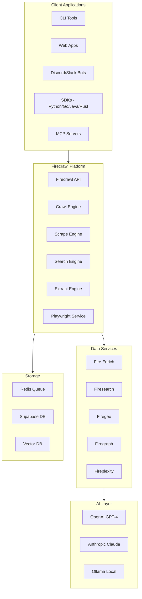
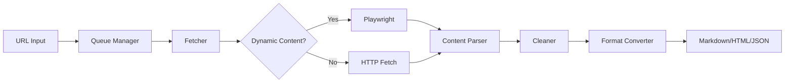
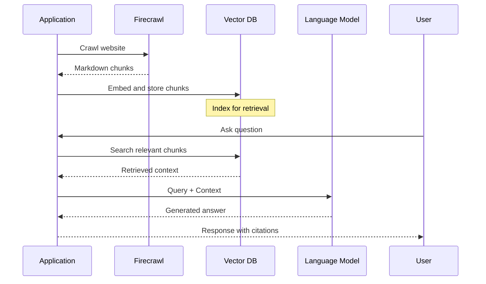
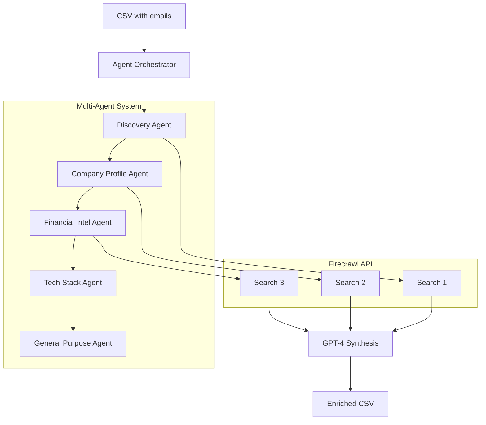
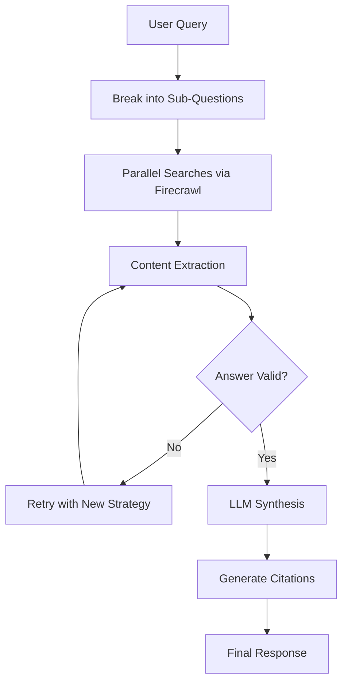
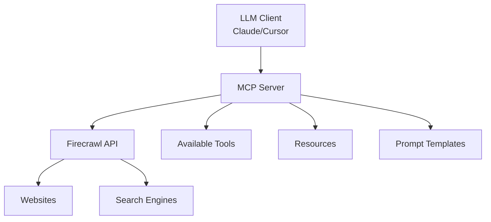

# Project Exploration: MendableAI/Firecrawl Ecosystem

## Overview

The MendableAI ecosystem is a comprehensive collection of AI-powered tools and services centered around **Firecrawl**, a web scraping and data extraction platform. This ecosystem provides everything from low-level web scraping APIs to high-level AI research assistants, data enrichment services, and integrations with popular frameworks.

**Core Mission**: Turn any website into clean, LLM-ready data through advanced scraping, crawling, and AI-powered extraction.

## Directory Structure

```
/home/darkvoid/Boxxed/@formulas/src.MendableAI/
├── firecrawl/                      # Main Firecrawl monorepo
│   ├── apps/                       # Core applications
│   │   ├── api/                    # Main API server
│   │   ├── playwright-service-ts/  # Browser automation
│   │   ├── redis/                  # Queue management
│   │   └── test-suite/             # Integration tests
│   ├── apps/python-sdk/            # Python SDK source
│   ├── apps/js-sdk/                # JavaScript/Node SDK
│   ├── apps/rust-sdk/              # Rust SDK
│   └── examples/                   # Usage examples
├── firecrawl-py/                   # Python SDK (legacy standalone)
├── firecrawl-go/                   # Go SDK
├── firecrawl-java-sdk/             # Java SDK
├── data-connectors/                # LLM-ready data connectors
├── fire-enrich/                    # AI-powered data enrichment
├── firegeo/                        # SaaS starter with geospatial features
├── firegraph/                      # Knowledge graph visualization
├── fireplexity/                    # AI search engine
├── firesearch/                     # Deep research tool
├── firestarter/                    # Starter templates
├── mendable-cli/                   # Mendable CLI tool
├── mendable-py/                    # Mendable Python SDK
├── mendable-nextjs-chatbot/        # Example chatbot
├── mcp-server-firecrawl/           # Model Context Protocol server
├── mcp-typescript-sdk/             # MCP TypeScript SDK
├── llmstxt-generator/              # LLMs.txt file generator
├── create-llmstxt-py/              # Python LLMs.txt creator
├── npx-generate-llmstxt/           # NPX LLMs.txt generator
├── ai-customer-support-bot/        # Customer support example
├── ai-discord-bot/                 # Discord bot example
├── ai-slack-bot/                   # Slack bot example
├── firecrawl-discord-bot/          # Firecrawl Discord bot
├── open-researcher/                # AI research assistant
├── rag-arena/                      # RAG comparison tool
├── gen-ui-firecrawl/               # UI generation with Firecrawl
└── OpenManus/                      # Open-source AI agent
```

## Architecture

### High-Level Diagram



## Firecrawl Platform

### Core API Endpoints

Firecrawl provides a RESTful API with the following main endpoints:

| Endpoint | Method | Description |
|----------|--------|-------------|
| `/v1/scrape` | POST | Scrape a single URL |
| `/v1/crawl` | POST | Start asynchronous crawl job |
| `/v1/crawl/:id` | GET | Check crawl job status |
| `/v1/map` | POST | Discover URLs on a website |
| `/v1/search` | POST | Web search with content extraction |
| `/v1/extract` | POST | Extract structured data with AI |
| `/v1/batch/scrape` | POST | Scrape multiple URLs asynchronously |

### Web Scraping Architecture

Firecrawl's scraping pipeline consists of multiple stages:



#### Key Components:

1. **Queue Manager**: Uses Redis/Bull for job queuing and rate limiting
2. **Fetcher**: Determines optimal scraping strategy
3. **Playwright Service**: Handles JavaScript-rendered content
4. **Content Parser**: Extracts main content, removes noise
5. **Format Converter**: Outputs to markdown, HTML, or structured JSON

### Scraping Features

- **LLM-ready formats**: markdown, structured data, screenshot, HTML, links, metadata
- **Dynamic content**: JavaScript-rendered page support via Playwright
- **Anti-bot bypass**: Proxy rotation, header spoofing, rate limiting
- **Media parsing**: PDFs, DOCX, images
- **Actions**: click, scroll, input, wait before extraction
- **Batch processing**: Thousands of URLs with async jobs

### Example API Usage

```bash
# Scrape single URL
curl -X POST https://api.firecrawl.dev/v1/scrape \
    -H 'Authorization: Bearer YOUR_API_KEY' \
    -H 'Content-Type: application/json' \
    -d '{
      "url": "https://example.com",
      "formats": ["markdown", "html"],
      "onlyMainContent": true
    }'

# Crawl website
curl -X POST https://api.firecrawl.dev/v1/crawl \
    -H 'Authorization: Bearer YOUR_API_KEY' \
    -H 'Content-Type: application/json' \
    -d '{
      "url": "https://docs.firecrawl.dev",
      "limit": 100,
      "scrapeOptions": {
        "formats": ["markdown"]
      }
    }'
```

## RAG Pipeline Integration

Firecrawl integrates seamlessly with RAG (Retrieval-Augmented Generation) pipelines:

### RAG Flow with Firecrawl



### Example Applications

1. **Chat with Documentation** (`firecrawl-ai-chatbot/`)
   - Crawl docs automatically
   - Store in vector database
   - Answer questions with citations

2. **Open Researcher** (`open-researcher/`)
   - Real-time web research
   - AI-powered analysis
   - Source citations

3. **Firesearch** (`firesearch/`)
   - Deep research with multi-step searches
   - Answer validation (0.7+ confidence)
   - Auto-retry with alternative queries

## SDKs and Integrations

### SDK Comparison

| SDK | Repository | Key Features |
|-----|------------|--------------|
| **Python** | `firecrawl-py/` | Pydantic schemas, async support, LangChain integration |
| **Node.js** | `firecrawl/apps/js-sdk/` | Zod schemas, TypeScript, native promises |
| **Go** | `firecrawl-go/` | Strong typing, concurrent scraping |
| **Java** | `firecrawl-java-sdk/` | Enterprise integration, Spring Boot support |
| **Rust** | `firecrawl/apps/rust-sdk/` | High performance, memory safety |

### Python SDK Example

```python
from firecrawl import FirecrawlApp

app = FirecrawlApp(api_key='your_api_key')

# Scrape
result = app.scrape_url(
    'https://example.com',
    formats=['markdown', 'html']
)

# Crawl with LLM extraction
from pydantic import BaseModel, Field

class ArticleSchema(BaseModel):
    title: str
    points: int
    by: str
    commentsURL: str

crawl_result = app.crawl_url(
    'https://news.ycombinator.com',
    params={
        'limit': 10,
        'jsonOptions': {
            'schema': ArticleSchema.model_json_schema()
        }
    }
)
```

### Go SDK Example

```go
import "github.com/mendableai/firecrawl-go"

app, err := firecrawl.NewFirecrawlApp("YOUR_API_KEY")

// Scrape
result, err := app.ScrapeURL("example.com", nil)

// Crawl with LLM extraction
jsonSchema := map[string]any{
    "type": "object",
    "properties": map[string]any{
        "title": map[string]string{"type": "string"},
    },
}
params := &firecrawl.CrawlParams{
    ExtractorOptions: firecrawl.ExtractorOptions{
        ExtractionSchema: jsonSchema,
    },
}
result, err := app.CrawlURL("example.com", params, nil)
```

## Data Enrichment Services

### Fire Enrich (`fire-enrich/`)

AI-powered data enrichment that transforms email lists into comprehensive company profiles.

**Architecture:**


**Agent Execution Flow:**
1. **Discovery Agent**: Finds company name, website, domain
2. **Company Profile Agent**: Industry, headquarters, founding year
3. **Financial Intel Agent**: Funding stage, investors, valuation
4. **Tech Stack Agent**: Technologies, frameworks, infrastructure
5. **General Purpose Agent**: Custom fields (CEO, competitors, etc.)

### Firesearch (`firesearch/`)

Deep research tool with intelligent query decomposition:



**Key Features:**
- Smart query decomposition
- Answer validation (0.7+ confidence threshold)
- Auto-retry with alternative search terms
- Maximum 2 retry attempts per question

## LLM.txt Tools

LLM.txt is a standard for providing machine-readable instructions to AI models about how to interact with a website.

### Components

1. **llmstxt-generator/** - Web-based generator
2. **create-llmstxt-py/** - Python CLI tool
3. **npx-generate-llmstxt/** - NPX package

### Output Format

```text
# LLMs.txt for example.com

## Allowed Paths
- /docs/*
- /api/*

## Disallowed Paths
- /admin/*
- /private/*

## Crawl Rules
- Respect robots.txt
- Rate limit: 1 request/second
- User-Agent: LLM-Bot/1.0
```

### Usage

```bash
# Via API
GET https://llmstxt.firecrawl.dev/example.com

# Via Python
from create_llmstxt_py import generate
generate("https://example.com")
```

## MCP Server Integration

The Model Context Protocol (MCP) allows LLM applications to connect to external tools and data sources.

### Firecrawl MCP Server (`mcp-server-firecrawl/`)

Provides the following tools to MCP clients:

| Tool | Description | Best For |
|------|-------------|----------|
| `firecrawl_scrape` | Scrape single URL | Known URL content |
| `firecrawl_batch_scrape` | Scrape multiple URLs | Bulk extraction |
| `firecrawl_map` | Discover URLs | Site exploration |
| `firecrawl_crawl` | Async crawl | Comprehensive extraction |
| `firecrawl_search` | Web search | Open-ended queries |
| `firecrawl_extract` | Structured data | Specific fields |
| `firecrawl_deep_research` | Multi-step research | Complex topics |
| `firecrawl_generate_llmstxt` | Generate LLMs.txt | AI permissions |

### MCP Architecture



### Configuration Example

```json
{
  "mcpServers": {
    "firecrawl": {
      "command": "npx",
      "args": ["-y", "firecrawl-mcp"],
      "env": {
        "FIRECRAWL_API_KEY": "your-api-key"
      }
    }
  }
}
```

### MCP TypeScript SDK (`mcp-typescript-sdk/`)

The SDK provides abstractions for:

- **Resources**: Data exposure (GET-like)
- **Tools**: Action execution (POST-like)
- **Prompts**: Interaction templates

```typescript
import { McpServer } from "@modelcontextprotocol/sdk/server/mcp.js";

const server = new McpServer({
  name: "firecrawl",
  version: "1.0.0"
});

// Add a tool
server.tool("scrape",
  { url: z.string() },
  async ({ url }) => {
    const result = await firecrawl.scrape(url);
    return { content: [{ type: "text", text: result.markdown }] };
  }
);
```

## Example Applications

### AI Customer Support Bot (`ai-customer-support-bot/`)

RAG-based chatbot for customer support:
- Ingests documentation via Firecrawl
- Stores embeddings in vector DB
- Answers with citations

### Open Researcher (`open-researcher/`)

Real-time AI research assistant:
- Live web scraping
- Thinking display
- Citation management
- Follow-up questions

### Fireplexity (`fireplexity/`)

AI search engine:
- Real-time search via Firecrawl
- Streaming GPT-4o-mini responses
- Source citations
- Live stock data integration

## Self-Hosting

Firecrawl can be self-hosted using Docker Compose:

### Environment Configuration

```bash
# .env
PORT=3002
HOST=0.0.0.0
REDIS_URL=redis://localhost:6379
PLAYWRIGHT_MICROSERVICE_URL=http://playwright:3000/scrape
USE_DB_AUTHENTICATION=false
```

### Docker Compose

```yaml
services:
  api:
    build: ./apps/api
    ports:
      - "3002:3002"
    environment:
      - REDIS_URL=redis://redis:6379
    depends_on:
      - redis
      - playwright

  workers:
    build: ./apps/api
    command: pnpm run workers
    environment:
      - REDIS_URL=redis://redis:6379

  redis:
    image: redis:alpine

  playwright:
    build: ./apps/playwright-service-ts
```

## Key Insights

### 1. Comprehensive Data Pipeline

Firecrawl provides an end-to-end solution:
- **Input**: URLs, search queries, sitemaps
- **Processing**: Scraping, parsing, cleaning
- **Output**: Markdown, HTML, structured JSON, screenshots

### 2. Multi-Language SDK Support

Consistent API across languages with idiomatic patterns:
- Python: Pydantic schemas, async/await
- Go: Strong typing, concurrent operations
- Node.js: Zod schemas, promises
- Java: Enterprise patterns
- Rust: Performance-focused

### 3. AI-Native Design

Every component is designed for LLM integration:
- Markdown output optimized for token efficiency
- Structured extraction with schema validation
- RAG-ready chunking and metadata
- Citation tracking

### 4. Agent Architecture

Fire Enrich demonstrates sophisticated multi-agent design:
- Sequential execution with context building
- Parallel searches within phases
- Type-safe schemas for extensibility
- GPT-4o for intelligent synthesis

### 5. MCP Integration

First-class support for Model Context Protocol:
- 8 specialized tools for different tasks
- Automatic rate limiting and retries
- Credit usage monitoring
- Streaming responses

### 6. Developer Experience

Focus on ease of use:
- One-command setup scripts
- Comprehensive documentation
- Multiple deployment options (Vercel, Docker, Kubernetes)
- Example applications for common patterns

## API Reference Summary

### Authentication

```bash
Authorization: Bearer fc-YOUR_API_KEY
```

### Rate Limits

| Plan | Requests/Minute | Credits/Month |
|------|-----------------|---------------|
| Free | 60 | 500 |
| Starter | 120 | 10,000 |
| Standard | 300 | 50,000 |
| Scale | 600 | Unlimited |

### Response Format

```json
{
  "success": true,
  "data": {
    "markdown": "...",
    "html": "...",
    "metadata": {
      "title": "...",
      "description": "...",
      "sourceURL": "..."
    }
  },
  "warning": "Optional warning message"
}
```

## Related Projects

- **Mendable AI**: Parent company, AI chat platform
- **Data Connectors**: Unified LLM-ready data connectors
- **FireGEO**: SaaS starter with authentication and billing
- **OpenManus**: Open-source AI agent framework

---

*Exploration completed on 2026-03-20. This document covers the MendableAI/Firecrawl ecosystem as found in `/home/darkvoid/Boxxed/@formulas/src.MendableAI/`.*
