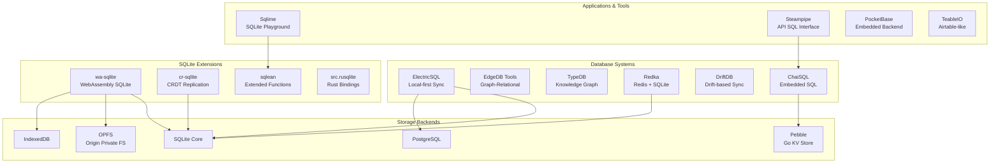
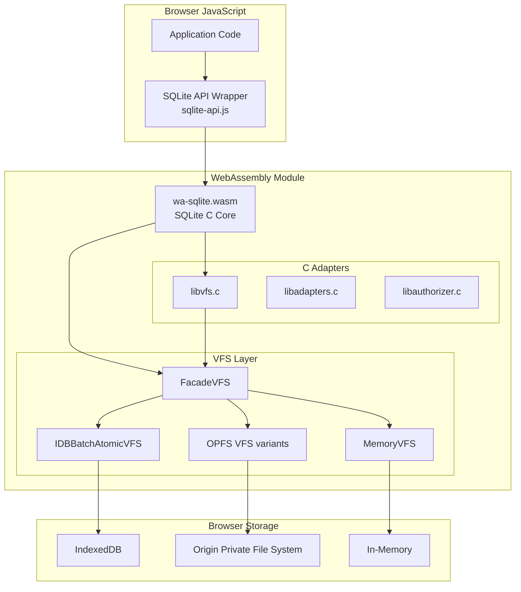
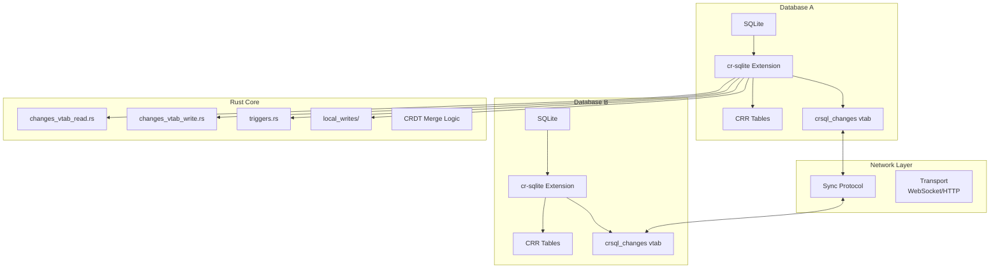
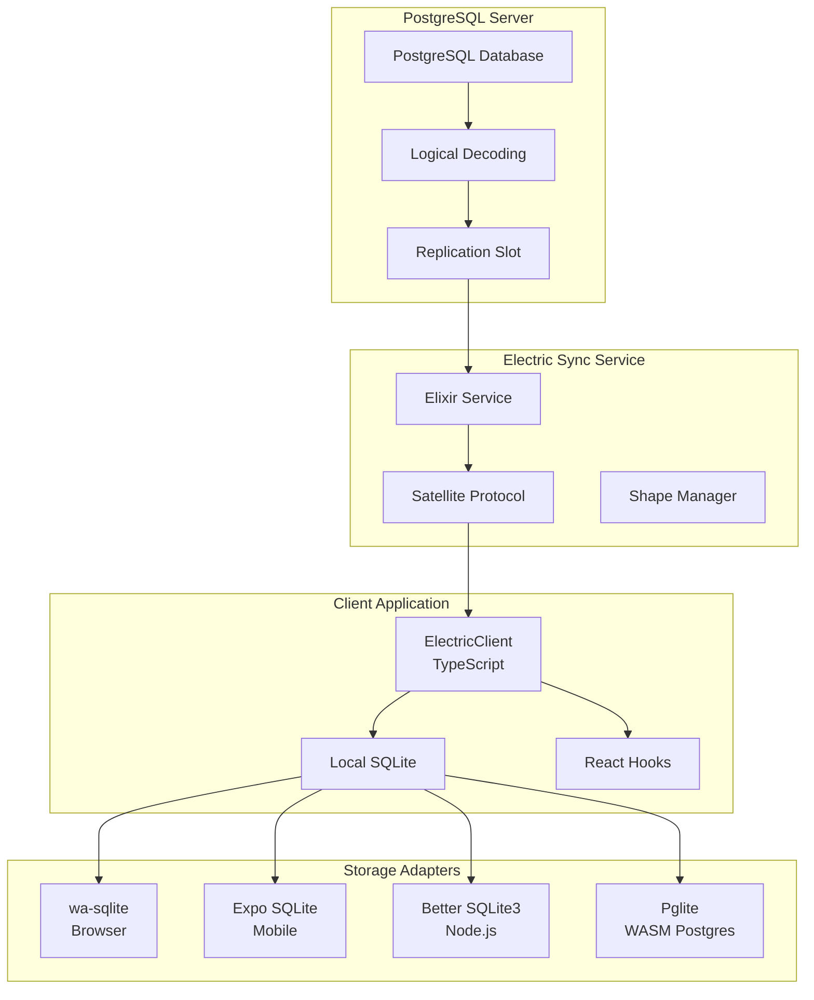
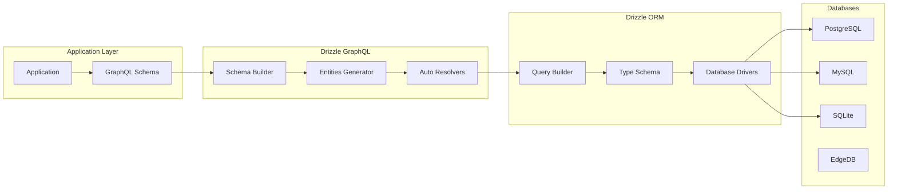
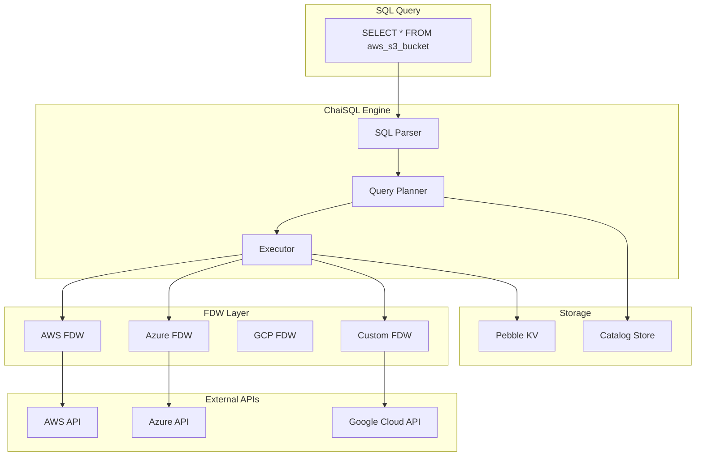
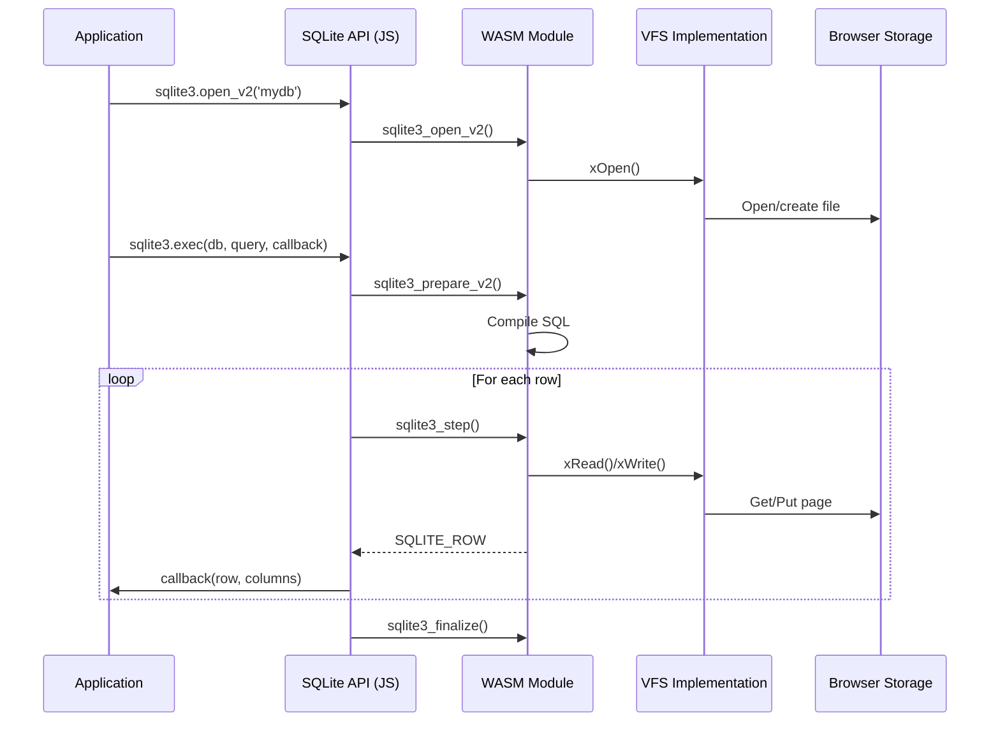
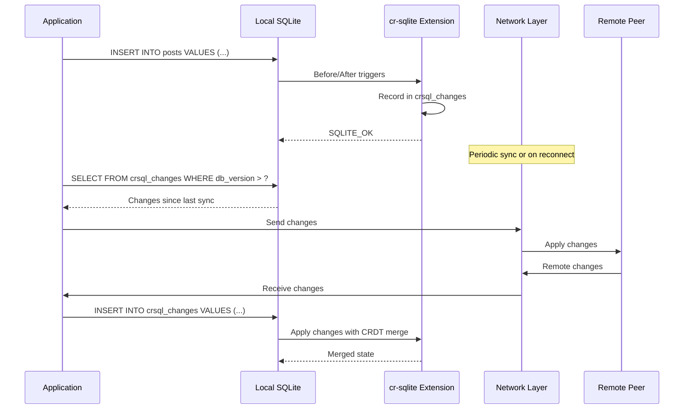

# SQL Projects Exploration

## Overview

This directory contains a comprehensive collection of 30+ SQL and database-related projects representing the modern landscape of embedded databases, local-first sync, and innovative storage solutions. The collection spans multiple paradigms:

**SQLite Extensions & Tools** - Projects extending SQLite with WebAssembly builds, CRDT replication, and enhanced functionality for browser and server environments.

**Database Systems** - Full database implementations including EdgeDB (graph-relational), ElectricSQL (local-first sync), TypeDB (knowledge graph), and Redka (Redis reimplementation with SQLite).

**Specialized Tools** - Query interfaces, embedded backends, and reactive data stores for specific use cases like API querying, note-taking, and Airtable-like databases.

The most innovative projects in this collection are **wa-sqlite** (browser SQLite via WebAssembly), **cr-sqlite** (CRDT-based multi-master replication), and **ElectricSQL** (Postgres-to-SQLite local-first sync platform).

## Repository Summary

| Project | Location | Primary Language | Purpose |
|---------|----------|-----------------|---------|
| wa-sqlite | wa-sqlite/ | JavaScript/C | WebAssembly SQLite for browsers |
| cr-sqlite | cr-sqlite/ | C/Rust | Conflict-free replicated SQLite (CRDTs) |
| src.electric_sql | src.electric_sql/ | TypeScript/Elixir | Local-first sync layer for Postgres |
| src.edgedb | src.edgedb/ | TypeScript/Rust | EdgeDB graph-relational database tools |
| src.steampipe | src.steampipe/ | Go/Rust | SQL query interface for APIs |
| redka | redka/ | Go | Redis reimplementation with SQLite |
| sqlime | sqlime/ | JavaScript | SQLite playground/IDE |
| driftdb | driftdb/ | Rust/TypeScript | Distributed database with drift-based sync |
| src.typedb | src.typedb/ | Java | TypeDB knowledge graph database |

## Directory Structure

```
src.SQL/
├── wa-sqlite/                          # WebAssembly SQLite build
│   ├── core/                           # Core SQLite source (amalgamated)
│   │   └── src/
│   │       └── sqlite/
│   │           ├── shell.c             # SQLite shell implementation
│   │           ├── sqlite3.c           # SQLite amalgamated source
│   │           ├── sqlite3.h           # SQLite public header
│   │           └── sqlite3ext.h        # Extension header
│   ├── src/                            # JavaScript wrapper & VFS implementations
│   │   ├── sqlite-api.js               # JavaScript API wrapper for SQLite C API
│   │   ├── sqlite-constants.js         # SQLite constants definitions
│   │   ├── VFS.js                      # Base virtual filesystem class
│   │   ├── FacadeVFS.js                # Facade pattern for VFS
│   │   ├── WebLocksMixin.js            # Web Locks API integration
│   │   ├── libadapters.{c,js}          # C/JS adapter layer
│   │   ├── libauthorizer.{c,js}        # Authorizer callbacks
│   │   ├── libfunction.{c,js}          # Function callbacks
│   │   ├── libprogress.{c,js}          # Progress callback
│   │   ├── libvfs.c                    # VFS C implementation
│   │   ├── main.c                      # Main entry point for WASM build
│   │   ├── examples/                   # VFS implementations
│   │   │   ├── IDBBatchAtomicVFS.js    # IndexedDB with batch atomic writes
│   │   │   ├── OPFSAdaptiveVFS.js      # Origin Private File System (adaptive)
│   │   │   ├── OPFSCoopSyncVFS.js      # OPFS with cooperative sync
│   │   │   ├── OPFSPermutedVFS.js      # OPFS with permuted writes
│   │   │   ├── MemoryVFS.js            # In-memory VFS
│   │   │   ├── MemoryAsyncVFS.js       # Async in-memory VFS
│   │   │   └── AccessHandlePoolVFS.js  # Access Handle Pool VFS
│   │   └── types/                      # TypeScript type definitions
│   ├── dist/                           # Pre-built artifacts
│   │   ├── wa-sqlite.mjs/.wasm         # Synchronous build
│   │   ├── wa-sqlite-async.mjs/.wasm   # Asyncify build
│   │   └── wa-sqlite-jspi.mjs/.wasm    # JSPI build
│   ├── demo/                           # Demo applications
│   │   ├── benchmarks/                 # Performance benchmarks (16 SQL tests)
│   │   ├── file/                       # File-based demo with service worker
│   │   ├── SharedService/              # SharedWorker demo
│   │   └── hello/                      # Basic hello world example
│   ├── Makefile                        # Build configuration
│   └── package.json
│
├── cr-sqlite/                          # Conflict-free Replicated SQLite
│   ├── core/
│   │   ├── src/
│   │   │   ├── crsqlite.c              # Main extension entry point
│   │   │   ├── crsqlite.h              # Public header
│   │   │   ├── changes-vtab.c/h        # crsql_changes virtual table
│   │   │   ├── ext-data.c/h            # Extension data management
│   │   │   ├── consts.h                # Constants (SITE_ID_LEN, etc.)
│   │   │   ├── core_init.c             # Extension initialization
│   │   │   └── rust.h                  # Rust FFI bindings
│   │   ├── rs/                         # Rust implementation
│   │   │   ├── bundle/                 # Bundled extension build
│   │   │   ├── bundle_static/          # Static linking bundle
│   │   │   ├── core/                   # Core Rust logic
│   │   │   │   ├── src/
│   │   │   │   │   ├── c.rs            # C FFI layer
│   │   │   │   │   ├── alter.rs        # ALTER TABLE support
│   │   │   │   │   ├── automigrate.rs  # Automatic migration
│   │   │   │   │   ├── backfill.rs     # Backfill logic
│   │   │   │   │   ├── bootstrap.rs    # Bootstrapping
│   │   │   │   │   ├── changes_vtab.rs # Changes virtual table
│   │   │   │   │   ├── changes_vtab_read.rs
│   │   │   │   │   ├── changes_vtab_write.rs
│   │   │   │   │   ├── create_crr.rs   # CREATE CRR logic
│   │   │   │   │   ├── db_version.rs   # Database versioning
│   │   │   │   │   ├── triggers.rs     # Trigger management
│   │   │   │   │   └── local_writes/   # Local write handling
│   │   │   │   └── Cargo.toml
│   │   │   └── fractindex-core/        # Fractional indexing for ordering
│   │   ├── Makefile
│   │   └── README.md
│   └── README.md
│
├── src.electric_sql/                   # ElectricSQL local-first sync
│   ├── electric/
│   │   ├── clients/typescript/         # TypeScript client
│   │   │   ├── src/
│   │   │   │   ├── client/
│   │   │   │   │   ├── model/
│   │   │   │   │   │   ├── client.ts   # ElectricClient class
│   │   │   │   │   │   ├── schema.ts   # Schema definitions
│   │   │   │   │   │   ├── table.ts    # Table operations
│   │   │   │   │   │   └── shapes.ts   # Shape subscriptions
│   │   │   │   │   ├── conversions/    # Type conversions
│   │   │   │   │   │   ├── converter.ts
│   │   │   │   │   │   ├── postgres.ts # Postgres type mapping
│   │   │   │   │   │   └── sqlite.ts   # SQLite type mapping
│   │   │   │   │   ├── execution/
│   │   │   │   │   │   ├── executor.ts # Query executor
│   │   │   │   │   │   ├── db.ts       # Database interface
│   │   │   │   │   │   └── transactionalDB.ts
│   │   │   │   │   └── validation/
│   │   │   │   ├── electric/
│   │   │   │   │   ├── index.ts        # Main electrify() entry point
│   │   │   │   │   ├── adapter.ts      # Database adapter interface
│   │   │   │   │   └── namespace.ts    # ElectricNamespace
│   │   │   │   ├── drivers/            # Database driver adapters
│   │   │   │   │   ├── wa-sqlite/      # wa-sqlite adapter
│   │   │   │   │   ├── better-sqlite3/ # Node.js better-sqlite3
│   │   │   │   │   ├── expo-sqlite/    # Expo SQLite
│   │   │   │   │   ├── capacitor-sqlite/
│   │   │   │   │   ├── op-sqlite/
│   │   │   │   │   ├── node-postgres/  # Direct Postgres driver
│   │   │   │   │   └── pglite/         # Pglite (WASM Postgres)
│   │   │   │   ├── frameworks/         # Framework integrations
│   │   │   │   │   ├── react/
│   │   │   │   │   │   ├── hooks/
│   │   │   │   │   │   │   ├── useLiveQuery.ts
│   │   │   │   │   │   │   └── useConnectivityState.ts
│   │   │   │   │   │   └── provider.tsx
│   │   │   │   │   └── vuejs/
│   │   │   │   ├── satellite/          # Satellite replication protocol
│   │   │   │   ├── migrators/          # Schema migrations
│   │   │   │   ├── notifiers/          # Event notification system
│   │   │   │   └── sockets/            # WebSocket implementations
│   │   │   └── package.json
│   │   ├── components/electric/        # Elixir sync service (not in this repo)
│   │   └── protocol/                   # Protocol Buffers definitions
│   │
├── src.edgedb/                         # EdgeDB tools
│   ├── drizzle-graphql/                # GraphQL schema generation
│   │   ├── src/
│   │   │   ├── index.ts
│   │   │   ├── types.ts
│   │   │   └── util/
│   │   │       ├── builders/           # Schema builders for MySQL, PG, SQLite
│   │   │       ├── case-ops/
│   │   │       ├── data-mappers/
│   │   │       └── type-converter/
│   │   └── package.json
│   └── drizzle-orm/                    # Drizzle ORM changelogs
│
├── src.steampipe/                      # Steampipe SQL query tools
│   ├── chai/                           # ChaiSQL embedded database
│   │   ├── internal/
│   │   │   ├── database/               # Database implementation
│   │   │   │   ├── catalog.go          # Schema catalog
│   │   │   │   ├── database.go         # Main database struct
│   │   │   │   ├── table.go            # Table operations
│   │   │   │   ├── transaction.go      # Transaction handling
│   │   │   │   └── encoding.go         # Data encoding
│   │   │   ├── engine/                 # Query engine
│   │   │   ├── kv/                     # Key-value storage layer (Pebble)
│   │   │   ├── planner/                # Query planner
│   │   │   ├── query/statement/        # SQL statement handlers
│   │   │   │   ├── select.go
│   │   │   │   ├── insert.go
│   │   │   │   ├── update.go
│   │   │   │   ├── delete.go
│   │   │   │   ├── create.go
│   │   │   │   └── alter.go
│   │   │   ├── expr/                   # Expression evaluation
│   │   │   │   ├── functions/          # Built-in functions
│   │   │   │   ├── comparison.go
│   │   │   │   └── arithmetic.go
│   │   │   └── sql/parser/             # SQL parser
│   │   └── cmd/chai/                   # CLI application
│   ├── GQL/                            # GitQL - Git as SQL
│   │   ├── crates/
│   │   │   ├── gitql-ast/              # AST definitions
│   │   │   ├── gitql-cli/              # CLI interface
│   │   │   ├── gitql-engine/           # Query engine
│   │   │   └── gitql-parser/           # SQL parser
│   │   └── docs/
│   ├── JsStore/                        # JavaScript SQL database
│   │   ├── src/
│   │   └── examples/
│   └── Musoq/                          # .NET SQL query engine
│
├── redka/                              # Redis reimplementation with SQLite
│   ├── internal/
│   │   ├── command/                    # Redis command implementations
│   │   │   ├── string/                 # String commands (GET, SET, INCR...)
│   │   │   ├── hash/                   # Hash commands (HGET, HSET...)
│   │   │   ├── list/                   # List commands (LPUSH, RPOP...)
│   │   │   ├── set/                    # Set commands (SADD, SMEMBERS...)
│   │   │   ├── zset/                   # Sorted set commands (ZADD, ZRANGE...)
│   │   │   ├── key/                    # Key management (DEL, EXPIRE...)
│   │   │   └── server/                 # Server commands
│   │   ├── core/                       # Core database logic
│   │   ├── rstring/                    # String type implementation
│   │   ├── rhash/                      # Hash type implementation
│   │   ├── rlist/                      # List type implementation
│   │   ├── rset/                       # Set type implementation
│   │   ├── rzset/                      # Sorted set implementation
│   │   ├── rkey/                       # Key management
│   │   ├── sqlx/                       # SQL layer
│   │   │   └── schema.sql              # Internal schema
│   │   └── server/                     # TCP server (RESP protocol)
│   ├── cmd/
│   │   ├── cli/                        # CLI client
│   │   └── redka/                      # Server binary
│   └── redka.go
│
├── driftdb/                            # Drift-based distributed database
│   ├── driftdb/                        # Core Rust implementation
│   ├── driftdb-server/                 # Development server
│   ├── driftdb-worker/                 # Cloudflare Workers implementation
│   └── js-pkg/                         # JavaScript/TypeScript packages
│       ├── packages/
│       │   ├── driftdb/                # Client library
│       │   ├── driftdb-react/          # React hooks
│       │   └── driftdb-ui/             # Debug UI
│       └── apps/
│           ├── demos/                  # Demo applications
│           └── tests/                  # Integration tests
│
├── sqlime/                             # SQLite playground/IDE
│   ├── index.html
│   ├── js/
│   └── css/
│
├── sqlean/                             # SQLite with extensions
│   ├── src/
│   │   ├── crypto/                     # Hash functions (SHA, MD5, BLAKE3)
│   │   ├── fuzzy/                      # Fuzzy matching (Levenshtein, Soundex)
│   │   ├── math/                       # Math functions
│   │   ├── regexp/                     # Regular expressions (PCRE2)
│   │   ├── text/                       # Text processing
│   │   └── uuid/                       # UUID generation
│   └── docs/
│
├── src.typedb/                         # TypeDB knowledge graph
├── src.pocketbase/                     # Embedded backend with SQLite
├── src.teableio/                       # Airtable-like database
├── src.tinybase/                       # Reactive data store
├── src.rusqlite/                       # Rust SQLite bindings
├── src.absurdsql/                      # Absurd SQL (HTTP backend)
├── src.sqlpad/                         # SQLPad web-based SQL editor
├── src.sqlsync/                        # SQL Sync protocol
├── dumper/                             # SQLite dumping utility
├── codapi/                             # Code execution sandbox
├── bolt/                               # Bolt embedded KV store
├── kit/                                # Database toolkit
├── notable/                            # Note-taking with SQL backend
├── pg_protocol/                        # PostgreSQL protocol implementation
├── html2markdown/                      # HTML to markdown converter
├── raw/                                # Raw database access
└── sqlite/                             # SQLite source/materials
```

## Architecture

### High-Level Component Diagram



### wa-sqlite WASM Integration Architecture



**Key Components:**

| Component | Location | Purpose |
|-----------|----------|---------|
| SQLite API Wrapper | src/sqlite-api.js | JavaScript wrapper exposing C API to JS |
| VFS Base | src/VFS.js | Base class implementing SQLite vfs_methods |
| FacadeVFS | src/FacadeVFS.js | Delegates to specific VFS implementations |
| IDBBatchAtomicVFS | src/examples/IDBBatchAtomicVFS.js | IndexedDB with batch atomic writes |
| OPFS VFS variants | src/examples/OPFS*.js | Origin Private File System implementations |
| WebLocksMixin | src/WebLocksMixin.js | Cross-tab synchronization via Web Locks API |

### cr-sqlite CRDT Replication Architecture



**CRDT Column Types:**

| Type | Purpose | Merge Behavior |
|------|---------|----------------|
| LWW (Last-Write-Wins) | Simple values | Latest timestamp wins |
| COUNTER | Distributed counters | Sum of increments |
| FRACTINDEX | Fractional indexing | Order preservation |
| PERITEXT | Collaborative text | Structure-aware merge |

### ElectricSQL Sync Architecture



**Data Flow:**

1. **Changes captured** from PostgreSQL via Logical Decoding
2. **Satellite protocol** serializes changes to Protocol Buffers
3. **Client subscribes** to shapes (filtered data subsets)
4. **Local SQLite** stores data with CRDT metadata
5. **Local mutations** sync back to PostgreSQL via Electric service
6. **Conflict resolution** handled automatically via CRDTs

### EdgeDB/Drizzle Query Pipeline



### Steampipe FDW (Foreign Data Wrapper) System



## Component Breakdown

### wa-sqlite

**Location:** `wa-sqlite/`

**Purpose:** WebAssembly build of SQLite enabling full SQLite functionality in browser environments with pluggable VFS for various storage backends.

**Key Files:**
- `src/sqlite-api.js` - JavaScript API wrapper (bind, step, column_* functions)
- `src/VFS.js` - Base VFS class implementing SQLite vfs_methods interface
- `src/examples/IDBBatchAtomicVFS.js` - IndexedDB VFS with batch atomic writes
- `src/main.c` - WASM entry point
- `Makefile` - Emscripten build configuration

**Dependencies:**
| Dependency | Purpose |
|------------|---------|
| Emscripten 3.1.47+ | WASM compilation toolchain |
| Yarn | Package management |
| TypeScript | Type definitions |

### cr-sqlite

**Location:** `cr-sqlite/`

**Purpose:** SQLite extension providing multi-master replication via CRDTs, enabling offline-first applications with automatic conflict resolution.

**Key Files:**
- `core/src/crsqlite.c` - Extension entry point, SQL function implementations
- `core/src/changes-vtab.c` - Virtual table for change tracking
- `core/rs/core/src/` - Rust implementation of core logic
- `core/rs/fractindex-core/` - Fractional indexing for ordered sequences

**Dependencies:**
| Dependency | Purpose |
|------------|---------|
| Rust Nightly | Core CRDT logic implementation |
| SQLite 3.x | Base database |
| libsql | Optional alternative SQLite fork |

### ElectricSQL

**Location:** `src.electric_sql/`

**Purpose:** Local-first sync platform providing realtime synchronization between PostgreSQL and local SQLite databases in client applications.

**Key Files:**
- `electric/clients/typescript/src/electric/index.ts` - Main electrify() entry point
- `electric/clients/typescript/src/client/model/client.ts` - ElectricClient class
- `electric/clients/typescript/src/drivers/` - Database adapter implementations
- `electric/clients/typescript/src/satellite/` - Satellite protocol implementation

**Dependencies:**
| Dependency | Purpose |
|------------|---------|
| PostgreSQL | Source database |
| Elixir | Sync service runtime |
| Protocol Buffers | Satellite protocol serialization |
| Multiple SQLite drivers | Client storage adapters |

### Redka

**Location:** `redka/`

**Purpose:** Redis-compatible server reimplementation using SQLite as storage backend, providing persistence without requiring all data in RAM.

**Key Files:**
- `redka.go` - Main package entry point
- `internal/command/` - Redis command implementations
- `internal/rstring/, internal/rhash/, etc.` - Data type implementations
- `internal/sqlx/schema.sql` - Internal SQLite schema

**Storage Schema:**
```sql
-- Key metadata
CREATE TABLE rkey (
    id INTEGER PRIMARY KEY,
    key TEXT NOT NULL,
    type INTEGER NOT NULL,  -- 1=string, 2=list, 3=set, 4=hash, 5=zset
    version INTEGER NOT NULL,
    etime INTEGER,          -- Expiration timestamp
    mtime INTEGER NOT NULL,
    len INTEGER
);

-- String values
CREATE TABLE rstring (
    kid INTEGER NOT NULL,
    value BLOB NOT NULL
);

-- Hash fields
CREATE TABLE rhash (
    kid INTEGER NOT NULL,
    field TEXT NOT NULL,
    value BLOB NOT NULL
);
```

### DriftDB

**Location:** `driftdb/`

**Purpose:** Real-time data backend using drift-based synchronization for collaborative applications.

**Components:**
- `driftdb/` - Core Rust implementation
- `driftdb-server/` - Development server
- `driftdb-worker/` - Cloudflare Workers implementation
- `js-pkg/packages/driftdb/` - JavaScript client library

## Entry Points

### wa-sqlite

**File:** `src/sqlite-api.js`

**Initialization Flow:**
```javascript
import SQLiteESMFactory from 'wa-sqlite/dist/wa-sqlite.mjs';
import * as SQLite from 'wa-sqlite';
import { IDBBatchAtomicVFS } from 'wa-sqlite/src/examples/IDBBatchAtomicVFS.js';

const module = await SQLiteESMFactory();
const sqlite3 = SQLite.Factory(module);

// Register custom VFS
const vfs = await IDBBatchAtomicVFS.create('mydb', module);
sqlite3.vfs_register(vfs);

const db = await sqlite3.open_v2('mydb');
await sqlite3.exec(db, `SELECT 'Hello, world!'`, callback);
```

### cr-sqlite

**File:** `core/src/crsqlite.c`

**SQL API:**
```sql
-- Load extension
.load crsqlite

-- Convert table to CRR (Conflict-free Replicated Relation)
SELECT crsql_as_crr('posts');

-- Get changes for sync
SELECT "table", "pk", "cid", "val", "col_version",
       "db_version", "site_id", "cl", "seq"
FROM crsql_changes
WHERE db_version > ?;

-- Apply changes from peer
INSERT INTO crsql_changes (...) VALUES (...);
```

### ElectricSQL

**File:** `electric/clients/typescript/src/electric/index.ts`

**Initialization:**
```typescript
import { electrify } from 'electric-sql'
import { schema } from './model/schema'
import { createSocket } from 'electric-sql/sockets/web'

const db = await electrify(
  'mydb',
  schema,
  adapter,
  createSocket,
  { host: 'localhost:5133' }
)

// Use reactive queries
const { data } = useLiveQuery(
  db.post.findMany({ where: { published: true } })
)
```

## Data Flow

### wa-sqlite Query Execution



### cr-sqlite Sync Flow



## External Dependencies

| Project | Dependencies | Purpose |
|---------|-------------|---------|
| wa-sqlite | Emscripten, Yarn | WASM build toolchain |
| cr-sqlite | Rust Nightly, SQLite | CRDT core logic |
| ElectricSQL | PostgreSQL, Elixir, Protobuf | Sync service infrastructure |
| Redka | Go, SQLite driver | Standalone server |
| DriftDB | Rust, Cloudflare Workers | Distributed sync |
| ChaiSQL | Pebble (CockroachDB) | KV storage backend |
| sqlean | PCRE2, Various C libs | SQLite extensions |
| TypeDB | Java, GraalVM | Knowledge graph engine |

## Configuration

### wa-sqlite Build Configuration

**Makefile variables:**
```makefile
# Build type: default, asyncify, jspi
BUILD_TYPE ?= default

# SQLite compile options
SQLITE_FLAGS += -DSQLITE_ENABLE_JSON1
SQLITE_FLAGS += -DSQLITE_ENABLE_FTS5

# Emscripten flags
EMFLAGS += -s ALLOW_MEMORY_GROWTH=1
EMFLAGS += -s WASM_BIGINT=1
```

### ElectricSQL Configuration

```typescript
interface ElectricConfig {
  host: string           // Electric sync service URL
  debug?: boolean        // Enable debug logging
  replication: {
    dialect: 'postgresql' | 'mysql' | 'sqlite'
  }
  auth?: {
    insecure: boolean    // Disable auth (development only)
    token?: string       // JWT token for auth
  }
}
```

### cr-sqlite Configuration

```sql
-- Site ID (unique per database instance)
SELECT crsql_site_id();

-- Database version
SELECT crsql_db_version();

-- Finalize extension (cleanup before close)
SELECT crsql_finalize();
```

## Testing

### wa-sqlite

**Location:** `test/`

**Framework:** Jasmine via @web/test-runner

**Test Categories:**
- VFS tests (IDB, OPFS, Memory)
- API tests (bind, step, column operations)
- Async tests (Asyncify, JSPI builds)

```bash
yarn test           # Run test suite
yarn test-manual    # Manual test mode
```

### cr-sqlite

**Location:** `core/src/*.test.c`, `core/rs/integration_check/`

**Test Types:**
- C unit tests (`.test.c` files)
- Rust integration tests
- Python correctness tests

```bash
cd core
make test           # Run C tests
cd ../py/correctness
./install-and-test.sh  # Python integration tests
```

### ElectricSQL

**Location:** `electric/clients/typescript/tests/`

**Framework:** Vitest

```bash
npm test           # Run TypeScript client tests
```

## Key Insights

### Architectural Patterns

1. **Virtual File System (VFS) Pattern** - wa-sqlite demonstrates how SQLite's pluggable VFS interface enables completely different storage backends (IndexedDB, OPFS, in-memory) while maintaining SQLite API compatibility.

2. **CRDT at the Database Level** - cr-sqlite's approach of tracking column-level versions with site IDs enables sophisticated conflict resolution without application logic.

3. **Logical Decoding for Sync** - ElectricSQL leverages PostgreSQL's logical decoding feature to capture changes without modifying the source database schema.

4. **Multi-driver Abstraction** - ElectricSQL's adapter pattern supports 10+ different SQLite drivers (wa-sqlite, Expo, Capacitor, better-sqlite3, etc.) through a common interface.

### Innovation Areas

1. **Browser-Native Storage** - wa-sqlite's OPFS implementations (AdaptiveVFS, CoopSyncVFS, PermutedVFS) explore cutting-edge browser storage capabilities.

2. **Fractional Indexing** - cr-sqlite's fractindex implementation enables efficient ordered sequences in CRDTs without global coordination.

3. **Shape-Based Subscriptions** - ElectricSQL's "shapes" concept allows clients to subscribe to filtered subsets of data, reducing sync overhead.

4. **Redis-Compatible Embedded SQL** - Redka demonstrates how a familiar API (Redis commands) can be layered on SQLite for better developer experience.

### Technical Considerations

1. **WASM Build Complexity** - wa-sqlite requires Emscripten toolchain and careful management of async boundaries between JS and WASM.

2. **Version Vector Overhead** - cr-sqlite's CRDT approach adds metadata overhead (site_id, col_version, db_version, seq) to every change.

3. **Sync Service Dependency** - ElectricSQL requires running an Elixir service for Postgres-to-client sync, adding operational complexity.

4. **Storage Format Stability** - Many projects (ChaiSQL, Redka) note their storage format is still evolving, cautioning against production use.

## Open Questions

1. **Performance at Scale** - How do wa-sqlite's various VFS implementations compare in performance with large databases (>100MB)?

2. **CRDT Merge Conflicts** - What are the edge cases where cr-sqlite's CRDT approach cannot automatically resolve conflicts?

3. **ElectricSQL Production Readiness** - What is the current status of ElectricSQL's alpha release? What features are missing for production use?

4. **Multi-Topology Sync** - How do these systems handle complex network topologies (mesh, federation) beyond simple client-server?

5. **Schema Evolution** - How do cr-sqlite and ElectricSQL handle schema migrations in a synced environment?

6. **Security Model** - What authentication/authorization mechanisms are available for wa-sqlite (browser) and cr-sqlite (P2P sync) deployments?

## Engineer Reference

### Getting Started Commands

```bash
# wa-sqlite - Start demo server
cd wa-sqlite
yarn install
yarn start
# Open http://localhost:8000/demo/

# cr-sqlite - Build loadable extension
cd cr-sqlite/core
rustup toolchain install nightly
make loadable
# Output: dist/crsqlite.{so,dylib,dll}

# ElectricSQL - Build TypeScript client
cd src.electric_sql/electric/clients/typescript
npm install
npm run build

# Redka - Build standalone server
cd redka
make setup build
./build/redka
```

### Project Selection Guide

| Use Case | Recommended Project |
|----------|---------------------|
| Browser SQLite with persistence | wa-sqlite + IDBBatchAtomicVFS |
| Offline-first with P2P sync | cr-sqlite |
| Postgres to client sync | ElectricSQL |
| Redis alternative with persistence | Redka |
| Collaborative editing | cr-sqlite + fractindex |
| SQL query over APIs | Steampipe/ChaiSQL |
| Mobile app with sync | ElectricSQL + Expo/OP-SQLite |
| Knowledge graph | TypeDB |
| Simple SQL playground | Sqlime |

### File Reference Summary

| File Path | Purpose |
|-----------|---------|
| wa-sqlite/src/sqlite-api.js | Main JS API - Factory function, bind/step/column methods |
| wa-sqlite/src/examples/IDBBatchAtomicVFS.js | Production-ready IndexedDB VFS |
| cr-sqlite/core/src/crsqlite.c | Extension registration, SQL function implementations |
| cr-sqlite/core/rs/core/src/changes_vtab.rs | Rust core for changes virtual table |
| src.electric_sql/electric/clients/typescript/src/electric/index.ts | Main electrify() entry point |
| src.electric_sql/electric/clients/typescript/src/client/model/client.ts | ElectricClient class |
| redka/redka.go | Main Redka package, Open() function |
| redka/internal/sqlx/schema.sql | Internal SQLite schema for Redis data types |
