# Project Exploration: UploadThing - File Upload Library

## Overview

UploadThing is a comprehensive file upload library for TypeScript applications that provides a type-safe, developer-friendly API for handling file uploads. It abstracts away the complexity of direct-to-S3 uploads, presigned URLs, multipart uploads, and progress tracking while maintaining full type safety across the entire upload pipeline.

The library supports multiple frameworks including Next.js (App and Pages directories), React, Solid, Svelte, Vue, Expo (React Native), and backend frameworks like Express, Fastify, H3, and Elysia.

## Directory Structure

```
uploadthing/
├── packages/
│   ├── uploadthing/          # Core package - framework-agnostic server/client logic
│   │   ├── src/
│   │   │   ├── client.ts     # Client-side uploader (genUploader, uploadFiles)
│   │   │   ├── server.ts     # Server-side route handler creation
│   │   │   ├── sdk/
│   │   │   │   ├── index.ts  # UTApi - Server SDK for programmatic file operations
│   │   │   │   ├── ut-file.ts # UTFile class for server-side file handling
│   │   │   │   └── utils.ts  # Server upload utilities
│   │   │   ├── internal/
│   │   │   │   ├── handler.ts        # Request handling logic
│   │   │   │   ├── upload-builder.ts # Builder pattern for file routes
│   │   │   │   ├── types.ts          # Core TypeScript types
│   │   │   │   ├── multi-part.browser.ts  # Multipart upload (client)
│   │   │   │   ├── multi-part.server.ts   # Multipart upload (server)
│   │   │   │   ├── presigned-post.browser.ts # Presigned POST upload (client)
│   │   │   │   ├── presigned-post.server.ts  # Presigned POST (server)
│   │   │   │   ├── validate-request-input.ts # Request validation
│   │   │   │   ├── shared-schemas.ts   # Effect Schema definitions
│   │   │   │   ├── ut-reporter.ts      # Event reporting to UT servers
│   │   │   │   └── parser.ts           # Input parsing (Zod support)
│   │   │   ├── next.ts         # Next.js App Router adapter
│   │   │   ├── next-legacy.ts  # Next.js Pages adapter
│   │   │   ├── express.ts      # Express adapter
│   │   │   ├── fastify.ts      # Fastify adapter
│   │   │   ├── h3.ts           # H3 (Nuxt) adapter
│   │   │   └── effect-platform.ts # Effect Platform adapter
│   │   └── package.json
│   │
│   ├── react/                  # React integration package (@uploadthing/react)
│   │   ├── src/
│   │   │   ├── useUploadThing.ts    # useUploadThing hook implementation
│   │   │   ├── hooks.ts             # Additional hooks
│   │   │   ├── components/          # UploadButton, UploadDropzone, etc.
│   │   │   ├── native.ts            # React Native exports
│   │   │   └── next-ssr-plugin.tsx  # Next.js SSR plugin for route config
│   │   └── package.json
│   │
│   ├── solid/                  # SolidJS integration (@uploadthing/solid)
│   ├── svelte/                 # Svelte integration
│   ├── vue/                    # Vue integration
│   ├── expo/                   # React Native/Expo integration
│   ├── dropzone/               # Standalone dropzone component
│   ├── mime-types/             # MIME type utilities
│   ├── shared/                 # Shared utilities across packages
│   │   └── src/
│   │       ├── types.ts        # Shared TypeScript types
│   │       ├── error.ts        # UploadThingError class
│   │       ├── crypto.ts       # Signature verification
│   │       ├── effect.ts       # Effect helpers
│   │       └── utils.ts        # General utilities
│   │
│   └── nuxt/                   # Nuxt 3 module
│
├── examples/                   # Working examples for all supported frameworks
│   ├── minimal-appdir/         # Next.js App Router
│   ├── minimal-pagedir/        # Next.js Pages
│   ├── minimal-solidstart/     # SolidStart
│   ├── minimal-sveltekit/      # SvelteKit
│   ├── minimal-expo/           # Expo/React Native
│   ├── backend-adapters/       # Express, Fastify, H3, Elysia, Hono
│   └── ...
│
├── docs/                       # Documentation site source
└── tooling/                    # ESLint config, TS config shared configs
```

## Architecture

### High-Level Diagram

```mermaid
flowchart TB
    subgraph Client["Client Side"]
        UI[UI Components<br/>UploadButton/UploadDropzone]
        Hook[useUploadThing Hook]
        GenUploader[genUploader]
        ClientPkg[uploadthing/client]
    end

    subgraph Server["Your Application Server"]
        RouteHandler[Route Handler<br/>createRouteHandler]
        FileRouter[File Router<br/>f{...}.middleware.onUploadComplete]
        Middleware[Middleware Function]
        Callback[onUploadComplete Callback]
    end

    subgraph UT["UploadThing Infrastructure"]
        PrepareAPI[/prepareUpload API/]
        PollAPI[/Polling Endpoint/]
        CallbackAPI[/Server Callback/]
    end

    subgraph Storage["Object Storage"]
        S3[S3-Compatible Storage]
    end

    UI --> Hook
    Hook --> GenUploader
    GenUploader --> ClientPkg

    ClientPkg -->|1. Request Upload| RouteHandler
    RouteHandler --> FileRouter
    FileRouter --> Middleware
    Middleware -->|Validate & Add Metadata| RouteHandler

    RouteHandler -->|2. Get Presigned URLs| PrepareAPI
    PrepareAPI -->|Return URLs + Keys| RouteHandler
    RouteHandler -->|3. Return Presigned URLs| ClientPkg

    ClientPkg -->|4. Direct Upload| S3
    S3 -->|5. Notify Completion| UT
    UT -->|6. Server Callback| CallbackAPI
    CallbackAPI -->|7. Trigger Callback| RouteHandler
    RouteHandler --> Callback

    ClientPkg -->|8. Poll for Completion| PollAPI
    PollAPI -->|Return Server Data| ClientPkg
```

## Upload Flow

### Step-by-Step Process

```mermaid
sequenceDiagram
    participant Browser
    participant Client as Client SDK
    participant Server as Your Server
    participant UT as UploadThing API
    participant S3 as S3 Storage

    Browser->>Client: User selects files
    Client->>Server: POST /api/uploadthing?actionType=upload
    Note over Server: Validates request<br/>Runs middleware
    Server->>UT: POST /v6/prepareUpload
    Note over UT: Generate presigned URLs<br/>for multipart upload
    UT-->>Server: Presigned URLs + file keys
    Server-->>Client: Presigned URLs

    loop For each file (parallel, concurrency: 6)
        loop For each chunk
            Client->>S3: PUT chunk to presigned URL
            Note over Client: Tracks progress<br/>via XMLHttpRequest
        end
    end

    Client->>Server: POST ?actionType=multipart-complete
    Server->>UT: Notify upload complete
    UT-->>Server: File metadata
    Server->>Server: Run onUploadComplete callback

    loop Polling (skipPolling: false)
        Client->>UT: Poll with JWT
        alt Upload processing complete
            UT-->>Client: { status: "done", callbackData }
        else Still processing
            UT-->>Client: { status: "still waiting" }
        end
    end

    Client->>Browser: onClientUploadComplete(result)
```



### 1. Initial Upload Request

When a user selects files, the client sends a request to your server's upload endpoint:

```typescript
// Client sends to your server
POST /api/uploadthing?actionType=upload&slug=videoAndImage
{
  files: [
    { name: "photo.jpg", size: 1024000, type: "image/jpeg" }
  ],
  input: undefined // or custom input if defined
}
```

### 2. Server Processing

Your server validates the request and runs middleware:

```typescript
// packages/uploadthing/src/internal/handler.ts:270-395

const handleUploadAction = Effect.gen(function* () {
  // 1. Parse and validate request
  const { files, input } = yield* Effect.flatMap(
    parseRequestJson(opts.req),
    S.decodeUnknown(UploadActionPayload),
  );

  // 2. Run user-defined middleware
  const { metadata, filesWithCustomIds } = yield* runRouteMiddleware({
    input: parsedInput,
    files,
  });

  // 3. Validate files meet config requirements
  yield* assertFilesMeetConfig(files, parsedConfig);

  // 4. Request presigned URLs from UploadThing
  const presignedUrls = yield* fetchEff(
    generateUploadThingURL("/v6/prepareUpload"),
    {
      method: "POST",
      body: JSON.stringify({
        files: filesWithCustomIds,
        routeConfig: parsedConfig,
        metadata,
        callbackUrl: callbackUrl.href,
        callbackSlug: opts.slug,
      }),
    }
  );

  return { body: presignedUrls };
});
```

### 3. Presigned URL Response

UploadThing returns presigned URLs for direct-to-S3 upload:

```typescript
// packages/uploadthing/src/internal/types.ts:29
export type PresignedURLs = S.Schema.Type<typeof PresignedURLResponse>;

// Structure returned from /v6/prepareUpload
{
  key: string;           // S3 file key
  fileName: string;
  fileUrl: string;       // Public URL (if acl: public-read)
  appUrl: string;        // UploadThing CDN URL
  customId?: string;     // Custom ID from middleware
  pollingUrl: string;    // URL to poll for completion
  pollingJwt: string;    // JWT for polling authentication

  // For multipart uploads (large files)
  urls: string[];        // Array of presigned PUT URLs for each chunk
  chunkSize: number;
  uploadId: string;
  contentDisposition: string;

  // OR for smaller files (presigned POST)
  url: string;           // Single POST URL
  fields: Record<string, string>; // Form fields for POST
}
```

### 4. Direct Browser-to-S3 Upload

The client uploads directly to S3 using the presigned URLs:

**Multipart Upload (for larger files):**

```typescript
// packages/uploadthing/src/internal/multi-part.browser.ts:14-71

export const uploadMultipartWithProgress = (
  file: File,
  presigned: MPUResponse,
  opts: { reportEventToUT: UTReporter; onUploadProgress?: ... }
) =>
  Micro.gen(function* () {
    let uploadedBytes = 0;

    // Upload each chunk in parallel
    const etags = yield* Micro.forEach(
      presigned.urls,
      (url, index) => {
        const offset = presigned.chunkSize * index;
        const chunk = file.slice(offset, offset + presigned.chunkSize);

        return uploadPart({ url, chunk, ... }).pipe(
          Micro.map((etag) => ({ tag: etag, partNumber: index + 1 })),
          Micro.retry({ while: (e) => e instanceof RetryError, times: 10 })
        );
      },
      { concurrency: "inherit" } // Uses parent concurrency settings
    );

    // Notify server that all parts are uploaded
    yield* opts.reportEventToUT("multipart-complete", {
      uploadId: presigned.uploadId,
      fileKey: presigned.key,
      etags,
    });
  });

// Individual part upload with progress tracking
const uploadPart = (opts: UploadPartOptions) =>
  Micro.async<string, UploadThingError | RetryError>((resume) => {
    const xhr = new XMLHttpRequest();
    xhr.open("PUT", opts.url, true);
    xhr.setRequestHeader("Content-Type", opts.fileType);
    xhr.setRequestHeader("Content-Disposition",
      contentDisposition(opts.contentDisposition, opts.fileName));

    xhr.upload.addEventListener("progress", (e) => {
      const delta = e.loaded - lastProgress;
      lastProgress += delta;
      opts.onProgress(delta); // Report progress to user
    });

    xhr.addEventListener("load", () => {
      const etag = xhr.getResponseHeader("Etag");
      if (xhr.status >= 200 && xhr.status <= 299 && etag) {
        resume(Micro.succeed(etag));
      } else {
        resume(Micro.fail(new RetryError()));
      }
    });

    xhr.send(opts.chunk);
    return Micro.sync(() => xhr.abort()); // Cleanup on interrupt
  });
```

**Presigned POST (for smaller files):**

```typescript
// packages/uploadthing/src/internal/presigned-post.browser.ts

export const uploadPresignedPostWithProgress = (
  file: File,
  presigned: PSPResponse,
  opts: { onUploadProgress?: ... }
) =>
  Micro.async((resume) => {
    const xhr = new XMLHttpRequest();
    const formData = new FormData();

    // Add all presigned fields
    Object.entries(presigned.fields).forEach(([k, v]) =>
      formData.append(k, v)
    );
    formData.append("file", file as Blob); // File MUST go last

    xhr.upload.addEventListener("progress", (e) => {
      const percent = (e.loaded / e.total) * 100;
      opts.onUploadProgress?.({ file: file.name, progress: percent });
    });

    xhr.addEventListener("load", () => {
      if (xhr.status >= 200 && xhr.status <= 299) {
        resume(Micro.succeed(void 0));
      } else {
        resume(Micro.fail(new UploadThingError(...)));
      }
    });

    xhr.addEventListener("error", () =>
      resume(Micro.fail(new UploadThingError(...)))
    );

    xhr.open("POST", presigned.url);
    xhr.setRequestHeader("Accept", "application/xml");
    xhr.send(formData);

    return Micro.sync(() => xhr.abort());
  });
```

### 5. Server Callback (onUploadComplete)

After S3 confirms the upload, UploadThing notifies your server:

```typescript
// packages/uploadthing/src/internal/handler.ts:141-215

const handleCallbackRequest = Effect.gen(function* () {
  const { req, uploadable, apiKey } = yield* RequestInput;

  // 1. Verify signature from UploadThing
  const verified = yield* Effect.tryPromise({
    try: async () =>
      verifySignature(
        await req.clone().text(),
        req.headers.get("x-uploadthing-signature"),
        apiKey
      ),
    catch: () => new UploadThingError({
      code: "BAD_REQUEST",
      message: "Invalid signature",
    }),
  });

  if (!verified) {
    return yield* new UploadThingError({
      code: "BAD_REQUEST",
      message: "Invalid signature",
    });
  }

  // 2. Parse callback payload
  const requestInput = yield* Effect.flatMap(
    parseRequestJson(req),
    S.decodeUnknown(S.Struct({
      status: S.String,
      file: UploadedFileData,
      metadata: S.Record(S.String, S.Unknown),
    })),
  );

  // 3. Run user's onUploadComplete callback
  const serverData = yield* Effect.tryPromise({
    try: async () =>
      uploadable.resolver({
        file: requestInput.file,
        metadata: requestInput.metadata,
      }) as Promise<unknown>,
    catch: (error) => new UploadThingError({
      code: "INTERNAL_SERVER_ERROR",
      message: "Failed to run onUploadComplete",
      cause: error,
    }),
  });

  // 4. Send response back to UploadThing
  yield* fetchEff(generateUploadThingURL("/v6/serverCallback"), {
    method: "POST",
    body: JSON.stringify({
      fileKey: requestInput.file.key,
      callbackData: serverData ?? null,
    }),
  });

  return { body: null };
});
```

### 6. Client Polling

The client polls for completion to receive server callback data:

```typescript
// packages/uploadthing/src/client.ts:236-264

const uploadFile = (...) =>
  // After file upload completes...
  fetchEff(presigned.pollingUrl, {
    headers: { authorization: presigned.pollingJwt },
  }).pipe(
    Micro.flatMap(parseResponseJson),
    Micro.filterOrFail(
      (res) => res.status === "done",
      () => new RetryError()
    ),
    Micro.map(({ callbackData }) => callbackData),
    Micro.retry({
      while: (res) => res._tag === "RetryError",
      schedule: exponentialDelay(), // Exponential backoff
    }),
    Micro.when(() => !opts.skipPolling),
  );
```

## Security Model

### 1. API Key Authentication

All server-to-UploadThing communication requires an API key:

```typescript
// packages/uploadthing/src/internal/get-api-key.ts
export const getApiKeyOrThrow = (providedKey?: string): string => {
  const apiKey = providedKey ?? process.env.UPLOADTHING_SECRET;

  if (!apiKey) {
    throw new UploadThingError({
      code: "MISSING_ENV",
      message: "No API key provided",
    });
  }

  if (!apiKey.startsWith("sk_")) {
    throw new UploadThingError({
      code: "MISSING_ENV",
      message: "Invalid API key. API keys must start with 'sk_'.",
    });
  }

  return apiKey;
};
```

### 2. Signature Verification

Server callbacks from UploadThing are signed using HMAC:

```typescript
// @uploadthing/shared/src/crypto.ts
export const verifySignature = async (
  body: string,
  signature: string | null,
  secret: string
): Promise<boolean> => {
  if (!signature) return false;

  const encoder = new TextEncoder();
  const keyData = encoder.encode(secret);
  const messageData = encoder.encode(body);

  const key = await crypto.subtle.importKey(
    "raw",
    keyData,
    { name: "HMAC", hash: "SHA-256" },
    false,
    ["verify"]
  );

  const signatureBuffer = hexToArrayBuffer(signature);
  const expectedSignature = await crypto.subtle.sign(
    "HMAC",
    key,
    messageData
  );

  return crypto.subtle.verify(
    "HMAC",
    key,
    expectedSignature,
    signatureBuffer
  );
};
```

### 3. File Validation

Files are validated both client-side and server-side:

```typescript
// packages/uploadthing/src/internal/validate-request-input.ts:77-138

export const assertFilesMeetConfig = (
  files: UploadActionPayload["files"],
  routeConfig: ExpandedRouteConfig,
): Effect.Effect<null, UploadThingError | ...> =>
  Effect.gen(function* () {
    const counts: Record<string, number> = {};

    for (const file of files) {
      // 1. Validate file type is allowed
      const type = yield* getTypeFromFileName(
        file.name,
        objectKeys(routeConfig)
      );
      counts[type] = (counts[type] ?? 0) + 1;

      // 2. Validate file size is within limits
      const sizeLimit = routeConfig[type]?.maxFileSize;
      const sizeLimitBytes = yield* fileSizeToBytes(sizeLimit);

      if (file.size > sizeLimitBytes) {
        return yield* new FileSizeMismatch(type, sizeLimit, file.size);
      }
    }

    // 3. Validate file count constraints
    for (const type in counts) {
      const config = routeConfig[type];
      const count = counts[type];
      const min = config.minFileCount;
      const max = config.maxFileCount;

      if (count < min) {
        return yield* new FileCountMismatch(type, "minimum", min, count);
      }
      if (count > max) {
        return yield* new FileCountMismatch(type, "maximum", max, count);
      }
    }

    return null;
  });
```

### 4. Client-Side Validation Helpers

```typescript
// packages/uploadthing/src/client.ts:62-87

export const isValidFileType = (
  file: File,
  routeConfig: ExpandedRouteConfig,
): boolean =>
  Micro.runSync(
    getTypeFromFileName(file.name, objectKeys(routeConfig)).pipe(
      Micro.map((type) => file.type.includes(type)),
      Micro.orElseSucceed(() => false),
    ),
  );

export const isValidFileSize = (
  file: File,
  routeConfig: ExpandedRouteConfig,
): boolean =>
  Micro.runSync(
    getTypeFromFileName(file.name, objectKeys(routeConfig)).pipe(
      Micro.flatMap((type) => fileSizeToBytes(routeConfig[type]!.maxFileSize)),
      Micro.map((maxFileSize) => file.size <= maxFileSize),
      Micro.orElseSucceed(() => false),
    ),
  );
```

## Progress Tracking

Progress is tracked per-file and aggregated across all files:

```typescript
// packages/react/src/useUploadThing.ts:81-142

const startUpload = useEvent(async (...args: FuncInput) => {
  const files = (await opts?.onBeforeUploadBegin?.(args[0])) ?? args[0];
  const input = args[1];

  setUploading(true);
  files.forEach((f) => fileProgress.current.set(f.name, 0));
  opts?.onUploadProgress?.(0);

  try {
    const res = await uploadFiles(endpoint, {
      files,
      onUploadProgress: (progress) => {
        if (!opts?.onUploadProgress) return;

        // Track progress per file
        fileProgress.current.set(progress.file, progress.progress);

        // Calculate average progress across all files
        let sum = 0;
        fileProgress.current.forEach((p) => { sum += p; });
        const averageProgress = Math.floor(sum / fileProgress.current.size / 10) * 10;

        if (averageProgress !== uploadProgress.current) {
          opts?.onUploadProgress?.(averageProgress);
          uploadProgress.current = averageProgress;
        }
      },
      // ... other options
    });

    await opts?.onClientUploadComplete?.(res);
    return res;
  } catch (e) {
    await opts?.onUploadError?.(e);
  } finally {
    setUploading(false);
    fileProgress.current = new Map();
    uploadProgress.current = 0;
  }
});
```

## SDK Integration

### Server-Side SDK (UTApi)

Programmatic file operations from your server:

```typescript
// packages/uploadthing/src/sdk/index.ts

export class UTApi {
  constructor(opts?: UTApiOptions) {
    const apiKey = getApiKeyOrThrow(opts?.apiKey);
    this.defaultHeaders = {
      "x-uploadthing-api-key": apiKey,
      "x-uploadthing-version": UPLOADTHING_VERSION,
      "x-uploadthing-be-adapter": "server-sdk",
    };
  }

  // Upload files directly from server
  async uploadFiles(
    files: FileEsque | FileEsque[],
    opts?: UploadFilesOptions
  ): Promise<UploadFileResult | UploadFileResult[]> {
    return this.executeAsync(
      uploadFilesInternal({ files, ...opts })
    );
  }

  // Upload from URLs
  async uploadFilesFromUrl(
    urls: MaybeUrl | UrlWithOverrides | (MaybeUrl | UrlWithOverrides)[],
    opts?: UploadFilesOptions
  ): Promise<UploadFileResult | UploadFileResult[]> {
    const files = await downloadFiles(urls);
    return this.executeAsync(uploadFilesInternal({ files, ...opts }));
  }

  // Delete files
  async deleteFiles(
    keys: string | string[],
    opts?: DeleteFilesOptions
  ): Promise<{ success: boolean; deletedCount: number }> {
    return this.requestUploadThing(
      "/v6/deleteFiles",
      { fileKeys: asArray(keys) },
      DeleteFileResponse
    );
  }

  // Get file URLs
  async getFileUrls(
    keys: string | string[],
    opts?: GetFileUrlsOptions
  ): Promise<{ key: string; url: string }[]> {
    return this.requestUploadThing(
      "/v6/getFileUrl",
      { fileKeys: keys },
      GetFileUrlResponse
    );
  }

  // Get signed URLs for private files
  async getSignedURL(
    key: string,
    opts?: GetSignedURLOptions
  ): Promise<{ url: string }> {
    return this.requestUploadThing(
      "/v6/requestFileAccess",
      { fileKey: key, expiresIn },
      GetSignedUrlResponse
    );
  }

  // Update file ACLs
  async updateACL(
    keys: string | string[],
    acl: ACL,
    opts?: ACLUpdateOptions
  ): Promise<{ success: boolean }> {
    return this.requestUploadThing(
      "/v6/updateACL",
      { updates: asArray(keys).map(key => ({ fileKey: key, acl })) },
      ResponseSchema
    );
  }

  // List files
  async listFiles(opts?: ListFilesOptions): Promise<{
    hasMore: boolean;
    files: Array<{ id: string; key: string; name: string; status: string }>;
  }> {
    return this.requestUploadThing("/v6/listFiles", opts, ListFileResponse);
  }

  // Get usage info
  async getUsageInfo(): Promise<{
    totalBytes: number;
    appTotalBytes: number;
    filesUploaded: number;
    limitBytes: number;
  }> {
    return this.requestUploadThing("/v6/getUsageInfo", {}, GetUsageInfoResponse);
  }
}
```

### React Integration

```typescript
// packages/react/src/useUploadThing.ts:45-161

export const INTERNAL_uploadthingHookGen = <TRouter extends FileRouter>(
  initOpts: { url: URL }
) => {
  const uploadFiles = genUploader<TRouter>({
    url: initOpts.url,
    package: "@uploadthing/react",
  });

  const useUploadThing = <
    TEndpoint extends keyof TRouter,
    TSkipPolling extends boolean = false,
  >(
    endpoint: TEndpoint,
    opts?: UseUploadthingProps<TRouter, TEndpoint, TSkipPolling>,
  ) => {
    const [isUploading, setUploading] = useState(false);
    const uploadProgress = useRef(0);
    const fileProgress = useRef<Map<string, number>>(new Map());

    type InferredInput = inferEndpointInput<TRouter[typeof endpoint]>;
    type FuncInput = undefined extends InferredInput
      ? [files: File[], input?: undefined]
      : [files: File[], input: InferredInput];

    const startUpload = useEvent(async (...args: FuncInput) => {
      // ... progress tracking and upload logic
    });

    const routeConfig = useRouteConfig(initOpts.url, endpoint as string);

    return {
      startUpload,
      isUploading,
      routeConfig,
      permittedFileInfo: routeConfig
        ? { slug: endpoint, config: routeConfig }
        : undefined,
    } as const;
  };

  return useUploadThing;
};

export const generateReactHelpers = <TRouter extends FileRouter>(
  initOpts?: GenerateTypedHelpersOptions
) => {
  const url = resolveMaybeUrlArg(initOpts?.url);

  return {
    useUploadThing: INTERNAL_uploadthingHookGen<TRouter>({ url }),
    uploadFiles: genUploader<TRouter>({ url, package: "@uploadthing/react" }),
    getRouteConfig, // Get config outside React context (requires NextSSRPlugin)
  } as const;
};
```

## Key Insights

### 1. Architecture Philosophy

- **Direct-to-S3 uploads**: Files never touch your server, reducing bandwidth and memory usage
- **Type-safe end-to-end**: TypeScript types flow from server router definition to client hooks
- **Effect-based internals**: Heavy use of the Effect ecosystem for robust error handling and composability
- **Framework agnostic core**: The `uploadthing` package is framework-agnostic; integrations are thin wrappers

### 2. Upload Mechanisms

- **Multipart Upload**: Used for larger files (>5MB typically). File is split into chunks, each uploaded via separate presigned PUT requests with ETag collection
- **Presigned POST**: Used for smaller files. Single POST request with FormData to S3
- **Parallel uploads**: Up to 6 files uploaded concurrently, with chunks also uploaded in parallel

### 3. Security Highlights

- **HMAC signatures**: All callbacks from UploadThing to your server are cryptographically signed
- **JWT polling**: Polling endpoints require JWT authentication
- **API key validation**: Strict validation that keys start with `sk_` prefix
- **Double validation**: Files validated both client-side (for UX) and server-side (for security)

### 4. Error Handling

- **Retry logic**: Automatic retries with exponential backoff for failed chunk uploads
- **UploadAbortedError**: Proper cleanup and error propagation on abort
- **Error formatting**: Customizable error formatter in router config

### 5. Developer Experience

- **Builder pattern**: Fluent API for defining file routes with `.input()`, `.middleware()`, `.onUploadComplete()`
- **Custom file identifiers**: Middleware can attach custom IDs to files for your own tracking
- **Progress callbacks**: Granular progress tracking per-file and aggregated
- **Skip polling**: Option to skip polling if you don't need server callback data

### 6. Integration Patterns

**Next.js App Router:**
```typescript
// src/app/api/uploadthing/route.ts
import { createRouteHandler } from "uploadthing/next";
import { uploadRouter } from "~/server/uploadthing";

export const { GET, POST } = createRouteHandler({
  router: uploadRouter,
});
```

**Express:**
```typescript
import { createRouteHandler } from "uploadthing/express";

app.use("/api/uploadthing", createRouteHandler({
  router: uploadRouter,
}));
```

**Client usage:**
```typescript
import { uploadRouter } from "~/server/uploadthing";
import { generateReactHelpers } from "@uploadthing/react";

export const { useUploadThing, uploadFiles } =
  generateReactHelpers<typeof uploadRouter>();

// In component:
const { startUpload, isUploading } = useUploadThing("videoAndImage", {
  onClientUploadComplete: (res) => console.log(res),
});
```
