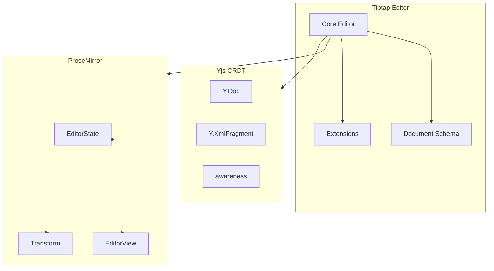
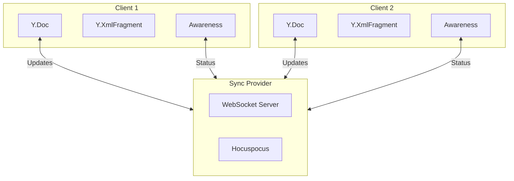

# Zero to WebEditors Developer

A comprehensive guide to building modern collaborative web editors using **Tiptap** (rich text) and **tldraw** (infinite canvas).

---

## Table of Contents

1. [Introduction](#introduction)
2. [Part I: Tiptap Editor](#part-i-tiptap-editor)
   - [What is Tiptap?](#what-is-tiptap)
   - [Installation and Setup](#installation-and-setup)
   - [Basic Usage](#basic-usage)
   - [Core Concepts](#core-concepts)
   - [Extensions System](#extensions-system)
   - [Collaborative Editing with Yjs](#collaborative-editing-with-yjs)
   - [Hocuspocus Backend](#hocuspocus-backend)
3. [Part II: tldraw](#part-ii-tldraw)
   - [What is tldraw?](#what-is-tldraw)
   - [Installation and Setup](#tldraw-installation-and-setup)
   - [Basic Usage](#tldraw-basic-usage)
   - [Core Concepts](#tldraw-core-concepts)
   - [Shapes and Tools](#shapes-and-tools)
   - [Custom Shapes](#custom-shapes)
   - [State Management](#state-management)
   - [Multiplayer Collaboration](#multiplayer-collaboration)
4. [Building Combined Applications](#building-combined-applications)

---

## Introduction

Modern web applications increasingly require rich editing capabilities - from document editors with real-time collaboration to infinite canvas whiteboards for visual thinking. This guide covers two powerful libraries that enable these experiences:

- **Tiptap**: A headless, framework-agnostic rich text editor based on ProseMirror
- **tldraw**: An infinite canvas SDK for React enabling whiteboard and diagramming features

Both libraries share common architectural patterns:
- **Headless/Composable**: Provide core functionality without imposing UI constraints
- **Extension-based**: Highly customizable through plugins/extensions
- **Collaborative**: Built-in support for real-time multiplayer editing using CRDTs

---

# Part I: Tiptap Editor

## What is Tiptap?

**Tiptap** is a headless, framework-agnostic rich text editor built on top of **ProseMirror**, a JavaScript library for building rich text editors. Tiptap provides a modern, flexible API for building editors ranging from simple comment boxes to full-featured document editors like Notion or Google Docs.

### Key Characteristics

| Feature | Description |
|---------|-------------|
| **Headless** | No default UI - you build the toolbar, menus, and styling |
| **Framework-Agnostic** | Official support for React, Vue, Svelte, and vanilla JS |
| **ProseMirror-Based** | Leverages ProseMirror's powerful document model and collaboration features |
| **Extension System** | Everything is an extension - nodes (blocks), marks (inline formatting), or extensions (behavior) |
| **Schema-Driven** | Document structure is defined by a schema of allowed content |

### Architecture Overview



### Philosophy

Tiptap's design philosophy centers on **flexibility without compromise**:

1. **You own the UI**: Tiptap provides the editing engine; you design the interface
2. **Schema-first**: Define what content is allowed, Tiptap enforces it
3. **Composable**: Combine small, focused extensions to build complex behavior
4. **Collaborative by design**: Real-time collaboration is built into the core

---

## Installation and Setup

### Basic Installation

```bash
# Core package
npm install @tiptap/core

# React integration
npm install @tiptap/react

# Essential extensions
npm install @tiptap/starter-kit
npm install @tiptap/extension-link
npm install @tiptap/extension-image
npm install @tiptap/extension-placeholder
```

### Framework-Specific Packages

| Framework | Package |
|-----------|---------|
| React | `@tiptap/react` |
| Vue 3 | `@tiptap/vue-3` |
| Svelte | `@tiptap/svelte` |
| Vanilla JS | `@tiptap/core` |

---

## Basic Usage

### Minimal React Example

```tsx
import { useEditor, EditorContent } from '@tiptap/react'
import StarterKit from '@tiptap/starter-kit'

const MinimalEditor = () => {
  const editor = useEditor({
    extensions: [
      StarterKit,
    ],
    content: '<p>Hello World!</p>',
  })

  if (!editor) return null

  return (
    <div>
      <button
        onClick={() => editor.chain().focus().toggleBold().run()}
        className={editor.isActive('bold') ? 'is-active' : ''}
      >
        Bold
      </button>
      <button
        onClick={() => editor.chain().focus().toggleItalic().run()}
        className={editor.isActive('italic') ? 'is-active' : ''}
      >
        Italic
      </button>
      <EditorContent editor={editor} />
    </div>
  )
}
```

### Editor Content Output

```tsx
// Get HTML
const html = editor.getHTML()
// => '<p>Hello <strong>World</strong>!</p>'

// Get JSON (for storage)
const json = editor.getJSON()
// => { type: 'doc', content: [...] }

// Get plain text
const text = editor.getText()
// => 'Hello World!'

// Set content
editor.commands.setContent('<p>New content</p>')
```

### Complete Toolbar Example

```tsx
import { BubbleMenu, EditorContent, useEditor } from '@tiptap/react'
import StarterKit from '@tiptap/starter-kit'
import Link from '@tiptap/extension-link'

const FullEditor = () => {
  const editor = useEditor({
    extensions: [
      StarterKit,
      Link.configure({
        openOnClick: false,
        HTMLAttributes: {
          class: 'text-blue-500 underline',
        },
      }),
    ],
    content: '<p>Start typing...</p>',
    editorProps: {
      attributes: {
        class: 'prose prose-sm sm:prose lg:prose-lg xl:prose-xl focus:outline-none min-h-[500px] p-4',
      },
    },
  })

  if (!editor) return null

  return (
    <div className="editor-container">
      {/* Bubble Menu - appears on text selection */}
      <BubbleMenu editor={editor} tippyOptions={{ duration: 100 }}>
        <div className="bubble-menu">
          <button onClick={() => editor.chain().focus().toggleBold().run()}>
            Bold
          </button>
          <button onClick={() => editor.chain().focus().toggleItalic().run()}>
            Italic
          </button>
          <button onClick={() => editor.chain().focus().toggleStrike().run()}>
            Strike
          </button>
          <button onClick={() => editor.chain().focus().toggleCode().run()}>
            Code
          </button>
        </div>
      </BubbleMenu>

      {/* Floating Menu - appears on empty lines */}
      <FloatingMenu editor={editor}>
        <div className="floating-menu">
          <button onClick={() => editor.chain().focus().toggleHeading({ level: 1 }).run()}>
            H1
          </button>
          <button onClick={() => editor.chain().focus().toggleHeading({ level: 2 }).run()}>
            H2
          </button>
          <button onClick={() => editor.chain().focus().toggleBulletList().run()}>
            Bullet List
          </button>
        </div>
      </FloatingMenu>

      <EditorContent editor={editor} />
    </div>
  )
}
```

---

## Core Concepts

### 1. Editor Instance

The editor instance is the central object that manages state, commands, and extensions:

```typescript
interface Editor {
  // State
  state: EditorState
  view: EditorView

  // Content manipulation
  commands: ChainableCommandAPI

  // Queries
  isActive(nodeOrMark: string, attributes?: {}): boolean
  getHTML(): string
  getJSON(): JSONContent
  getText(): string

  // Lifecycle
  destroy(): void
}
```

### 2. Document Schema

Tiptap uses a **schema** to define allowed content. The schema consists of:

- **Nodes**: Block-level elements (paragraph, heading, list item, image)
- **Marks**: Inline formatting (bold, italic, link, code)
- **Extensions**: Additional behavior (placeholder, collaboration, history)

```typescript
// Default document structure
const schema = {
  doc: {
    content: 'block+'  // Must contain one or more blocks
  },
  paragraph: {
    content: 'inline*',  // Can contain zero or more inline elements
    group: 'block',
    parseDOM: [{ tag: 'p' }],
    toDOM: () => ['p', 0]
  },
  text: {
    group: 'inline'
  },
  heading: {
    attrs: { level: { default: 1 } },
    content: 'inline*',
    group: 'block',
    defining: true,
    parseDOM: [
      { tag: 'h1', attrs: { level: 1 } },
      { tag: 'h2', attrs: { level: 2 } },
      // ...
    ],
    toDOM: (node) => [`h${node.attrs.level}`, 0]
  }
}
```

### 3. Commands and Chains

Commands modify the document. They can be chained for complex operations:

```typescript
// Single command
editor.commands.setBold()

// Chained commands
editor
  .chain()
  .focus()           // Focus editor
  .setTextSelection(0)  // Select text
  .toggleBold()      // Toggle bold
  .toggleItalic()    // Toggle italic
  .run()             // Execute chain

// Conditional execution
if (editor.can().chain().focus().toggleBold().run()) {
  editor.chain().focus().toggleBold().run()
}

// Check if command is possible
const canUndo = editor.can().undo()
```

### 4. Editor State

The editor state is immutable and follows ProseMirror's state management:

```typescript
interface EditorState {
  doc: Node           // Current document
  selection: Selection // Current selection
  storedMarks: Mark[] | null // Marks for next insertion
  schema: Schema      // Document schema
}
```

### 5. Transactions

All changes go through **transactions**:

```typescript
// Transaction structure
interface Transaction {
  doc: Node              // New document state
  selection: Selection   // New selection
  steps: Step[]          // Applied changes
  time: number           // Timestamp
  metadata: any          // Custom metadata
}

// Listen to transactions
const editor = useEditor({
  onTransaction: ({ transaction }) => {
    console.log('Document changed')
  },
  onUpdate: ({ editor }) => {
    console.log('Editor updated:', editor.getHTML())
  }
})
```

---

## Extensions System

Tiptap's extension system is its most powerful feature. Everything in Tiptap is an extension.

### Extension Types

| Type | Purpose | Examples |
|------|---------|----------|
| **Node** | Block-level content | Paragraph, Heading, Image, CodeBlock |
| **Mark** | Inline formatting | Bold, Italic, Link, Highlight |
| **Extension** | Behavior/Features | History, Placeholder, Collaboration |

### Creating a Custom Node Extension

```typescript
import { Node, mergeAttributes, nodePasteRule } from '@tiptap/core'

export interface YouTubeOptions {
  HTMLAttributes: Record<string, any>
  inline: boolean
}

export const YouTube = Node.create<YouTubeOptions>({
  name: 'youtube',

  addOptions() {
    return {
      HTMLAttributes: {},
      inline: false,
    }
  },

  group: this.parent?.group,

  content: this.options.inline ? 'inline*' : 'block+',

  addAttributes() {
    return {
      src: {
        default: null,
        parseHTML: element => element.getAttribute('src'),
        renderHTML: attributes => ({
          src: attributes.src,
        }),
      },
      start: {
        default: 0,
        parseHTML: element => element.getAttribute('data-start'),
        renderHTML: attributes => ({
          'data-start': attributes.start,
        }),
      },
    }
  },

  parseHTML() {
    return [
      {
        tag: 'iframe[src*="youtube.com/embed"]',
      },
    ]
  },

  renderHTML({ HTMLAttributes }) {
    return [
      'iframe',
      mergeAttributes(this.options.HTMLAttributes, HTMLAttributes, {
        allow: 'accelerometer; autoplay; clipboard-write; encrypted-media; gyroscope; picture-in-picture',
        allowfullscreen: true,
        frameborder: 0,
      }),
    ]
  },

  addCommands() {
    return {
      setYouTube:
        (attributes: { src: string; start?: number }) =>
        ({ commands }) => {
          return commands.insertContent({
            type: this.name,
            attrs: attributes,
          })
        },
    }
  },

  addNodeView() {
    return ({ editor, node, getPos }) => {
      const { src, start } = node.attrs

      const div = document.createElement('div')
      div.className = 'youtube-wrapper'

      const iframe = document.createElement('iframe')
      iframe.src = src
      iframe.setAttribute('allowfullscreen', '')

      div.appendChild(iframe)

      return {
        dom: div,
      }
    }
  },
})
```

### Creating a Custom Mark Extension

```typescript
import { Mark, mergeAttributes } from '@tiptap/core'

export interface HighlightOptions {
  HTMLAttributes: Record<string, any>
}

export const Highlight = Mark.create<HighlightOptions>({
  name: 'highlight',

  addOptions() {
    return {
      HTMLAttributes: {
        class: 'highlight',
      },
    }
  },

  parseHTML() {
    return [
      {
        tag: 'mark',
      },
      {
        tag: 'span.highlight',
      },
    ]
  },

  renderHTML({ HTMLAttributes }) {
    return ['mark', mergeAttributes(this.options.HTMLAttributes, HTMLAttributes), 0]
  },

  addCommands() {
    return {
      setHighlight: () => ({ commands }) => {
        return commands.setMark(this.name)
      },
      toggleHighlight: () => ({ commands }) => {
        return commands.toggleMark(this.name)
      },
      unsetHighlight: () => ({ commands }) => {
        return commands.unsetMark(this.name)
      },
    }
  },
})
```

### Creating a Custom Extension

```typescript
import { Extension } from '@tiptap/core'

export interface CharacterCountOptions {
  limit: number
}

export const CharacterCount = Extension.create<CharacterCountOptions>({
  name: 'characterCount',

  addOptions() {
    return {
      limit: null,
    }
  },

  addStorage() {
    return {
      characterCount: 0,
      wordCount: 0,
    }
  },

  onTransaction() {
    const text = this.editor.getText()
    const words = text.split(/\s+/).filter(word => word.length > 0)

    this.storage.characterCount = text.length
    this.storage.wordCount = words.length

    // Emit event for UI updates
    this.editor.emit('characterCount', {
      characters: this.storage.characterCount,
      words: this.storage.wordCount,
      limit: this.options.limit,
    })
  },

  addCommands() {
    return {
      checkLimit: () => ({ state, tr }) => {
        const text = state.doc.textContent
        if (text.length > this.options.limit) {
          return false
        }
        return true
      },
    }
  },
})
```

### Using Extensions

```tsx
import { useEditor, EditorContent } from '@tiptap/react'
import StarterKit from '@tiptap/starter-kit'
import Link from '@tiptap/extension-link'
import Image from '@tiptap/extension-image'
import Placeholder from '@tiptap/extension-placeholder'
import Highlight from './extensions/Highlight'
import CharacterCount from './extensions/CharacterCount'
import YouTube from './extensions/YouTube'

const editor = useEditor({
  extensions: [
    // Core extensions
    StarterKit.configure({
      history: {
        deepContentChange: true,
      },
    }),

    // Configured extensions
    Link.configure({
      openOnClick: false,
      HTMLAttributes: {
        class: 'text-blue-500 underline',
      },
    }),

    Image.configure({
      HTMLAttributes: {
        class: 'max-w-full rounded-lg',
      },
      allowBase64: true,
    }),

    Placeholder.configure({
      placeholder: 'Start writing or type / for commands...',
      emptyEditorClass: 'is-editor-empty',
      emptyNodeClass: 'is-empty',
    }),

    // Custom extensions
    Highlight,
    CharacterCount.configure({ limit: 5000 }),
    YouTube,
  ],
})
```

---

## Collaborative Editing with Yjs

Tiptap integrates with **Yjs**, a CRDT (Conflict-free Replicated Data Type) library, to enable real-time collaborative editing.

### What is Yjs?

Yjs is a CRDT library that enables:
- **Real-time synchronization** between multiple clients
- **Offline editing** with automatic conflict resolution
- **Shared data types** (Y.Map, Y.Array, Y.Xml, Y.Text)

### Yjs Architecture



### Installation

```bash
# Yjs core
npm install yjs

# Tiptap collaboration extension
npm install @tiptap/extension-collaboration
npm install @tiptap/extension-collaboration-cursor

# WebSocket provider
npm install y-websocket

# Or Hocuspocus provider
npm install @hocuspocus/provider
```

### Basic Yjs Setup

```tsx
import * as Y from 'yjs'
import { useEditor, EditorContent } from '@tiptap/react'
import Collaboration from '@tiptap/extension-collaboration'
import CollaborationCursor from '@tiptap/extension-collaboration-cursor'
import { WebrtcProvider } from 'y-webrtc'

const CollaborativeEditor = ({ roomId = 'demo-room' }) => {
  // Create Y.js document
  const ydoc = new Y.Doc()

  // Create provider (using WebRTC for demo)
  const provider = new WebrtcProvider(roomId, ydoc, {
    signaling: [
      'wss://signaling.yjs.dev',
      'wss://y-webrtc-signaling-eu.herokuapp.com',
    ],
  })

  const editor = useEditor({
    extensions: [
      StarterKit.configure({
        // Disable history when using collaboration
        history: false,
      }),
      Collaboration.configure({
        document: ydoc,
        field: 'tiptap', // The Y.XmlFragment field name
      }),
      CollaborationCursor.configure({
        provider,
        user: {
          name: 'Alex',
          color: '#ff7f7f',
        },
      }),
    ],
  })

  return <EditorContent editor={editor} />
}
```

### Using Hocuspocus Provider

```tsx
import * as Y from 'yjs'
import { TiptapCollabProvider } from '@hocuspocus/provider'

const HocuspocusEditor = () => {
  const ydoc = new Y.Doc()

  const provider = new TiptapCollabProvider({
    appId: 'your-app-id',
    name: 'your-document-id',
    token: 'your-auth-token',
  })

  const editor = useEditor({
    extensions: [
      StarterKit.configure({ history: false }),
      Collaboration.configure({
        document: ydoc,
      }),
      CollaborationCursor.configure({
        provider,
        user: { name: 'User', color: '#7f7fff' },
      }),
    ],
  })
}
```

### Custom Awareness Implementation

Awareness tracks user presence (cursors, selection, online status):

```tsx
import * as awarenessProtocol from 'y-protocols/awareness'

const setupAwareness = (ydoc: Y.Doc) => {
  const awareness = new awarenessProtocol.Awareness(ydoc)

  // Set local user state
  awareness.setLocalStateField('user', {
    name: 'John Doe',
    color: '#' + Math.floor(Math.random() * 16777215).toString(16),
  })

  // Listen to awareness changes
  awareness.on('change', ({ added, updated, removed }) => {
    added.forEach(id => {
      const state = awareness.getState(id)
      console.log('User joined:', state.user.name)
    })

    removed.forEach(id => {
      console.log('User left')
    })
  })

  return awareness
}
```

### Handling Offline/Online

```tsx
import { useEditor } from '@tiptap/react'
import { WebrtcProvider } from 'y-webrtc'

const editor = useEditor({
  extensions: [
    Collaboration.configure({ document: ydoc }),
  ],
})

// Connect/disconnect manually
const connect = () => provider.connect()
const disconnect = () => provider.disconnect()

// Check connection status
const isConnected = provider.status === 'connected'

// Listen to status changes
provider.on('status', ({ status }) => {
  console.log('Connection status:', status)
  // 'connecting' | 'connected' | 'disconnected'
})
```

---

## Hocuspocus Backend

**Hocuspocus** is a WebSocket server specifically designed for Yjs synchronization.

### Installation

```bash
npm install @hocuspocus/server
```

### Basic Server Setup

```typescript
import { Server } from '@hocuspocus/server'

const server = Server.configure({
  port: 4001,

  async onConnect(data) {
    console.log(`Client connected: ${data.documentName}`)
    // Authenticate user
    if (!data.token) {
      throw new Error('Authentication required')
    }
  },

  async onDisconnect(data) {
    console.log(`Client disconnected: ${data.documentName}`)
  },

  async onChange(data) {
    console.log(`Document changed: ${data.documentName}`)
    // Save to database
    await saveToDatabase(data.documentName, data.state)
  },

  async onLoadDocument(data) {
    // Load from database
    const document = await loadFromDatabase(data.documentName)
    return document
  },
})

server.listen()
```

### Database Integration

```typescript
import { Database } from '@hocuspocus/database'

const server = Server.configure({
  database: Database.configure({
    fetch: async (documentName) => {
      // Fetch from your database
      const doc = await db.collection('documents').findOne({ name: documentName })
      return doc?.content || null
    },
    store: async (documentName, state) => {
      // Store to your database
      await db.collection('documents').updateOne(
        { name: documentName },
        { $set: { content: state, updatedAt: new Date() } }
      )
    },
  }),
})
```

### Using Hooks

```typescript
const server = Server.configure({
  async onConnect(data) {
    const { document, connection } = data

    // Check permissions
    const user = await getUserFromToken(data.token)
    const hasAccess = await checkDocumentAccess(user.id, document.name)

    if (!hasAccess) {
      throw new Error('Access denied')
    }

    // Store user in connection context
    connection.context.user = user
  },

  async onChange(data) {
    const { document, connection } = data

    // Log changes with user info
    await auditLog.create({
      document: document.name,
      user: connection.context.user?.id,
      action: 'update',
      timestamp: new Date(),
    })
  },
})
```

---

# Part II: tldraw

## What is tldraw?

**tldraw** is an open-source infinite canvas SDK for React that enables building collaborative whiteboarding, diagramming, and visual design tools. It powers applications like tldraw.com, a digital whiteboard used by thousands.

### Key Characteristics

| Feature | Description |
|---------|-------------|
| **Infinite Canvas** | Pan and zoom infinitely with SVG + HTML layered rendering |
| **React-First** | Built for React with comprehensive hooks and components |
| **Signals-Based State** | Custom reactive state management using signals (not Redux) |
| **Shape System** | Extensible shape architecture for custom content types |
| **Multiplayer Ready** | Built-in support for real-time collaboration |
| **Tool System** | State-machine based tools for different interaction modes |

### Architecture Overview

```mermaid
graph TB
    subgraph Application["Application Layer"]
        TldrawComponent[Tldraw Component]
        UserInput[User Input]
    end

    subgraph SDK["@tldraw/tldraw"]
        DefaultShapes[Default Shapes]
        DefaultTools[Default Tools]
        UI[UI Components]
    end

    subgraph Editor["@tldraw/editor"]
        EditorClass[Editor Class]
        Canvas[Canvas Renderer]
        ShapeUtil[ShapeUtil Base]
        StateNode[StateNode Base]
        Managers[Managers]
    end

    subgraph Primitives["Primitives"]
        Vec[Vec2D]
        Mat[Matrix2D]
        Box[Box2D]
        Geometry[Geometry2D]
    end

    subgraph Store["@tldraw/store"]
        Atom[Atom]
        Computed[Computed]
        Store[Store]
    end

    subgraph Schema["@tldraw/tlschema"]
        Shape[TLShape]
        Page[TLPage]
        Camera[TLCamera]
    end

    TldrawComponent --> DefaultShapes & DefaultTools
    DefaultShapes --> ShapeUtil
    DefaultTools --> StateNode
    EditorClass --> Managers
    EditorClass --> Store
    Store --> Schema
    Canvas --> Primitives
```

### Philosophy

tldraw's design philosophy emphasizes:

1. **Composability**: Build complex tools from simple, focused components
2. **Performance**: Signals-based reactivity minimizes unnecessary re-renders
3. **Extensibility**: Everything is customizable - shapes, tools, UI
4. **Collaboration**: Multiplayer support is architectural, not an afterthought

---

## tldraw Installation and Setup

### Basic Installation

```bash
# Core tldraw package
npm install @tldraw/tldraw

# Peer dependencies
npm install react react-dom
```

### Basic Setup

```tsx
import { Tldraw } from '@tldraw/tldraw'
import '@tldraw/tldraw/tldraw.css'

function App() {
  return (
    <div style={{ position: 'fixed', inset: 0 }}>
      <Tldraw />
    </div>
  )
}
```

### Full Installation with All Packages

```bash
# Core packages
npm install @tldraw/tldraw
npm install @tldraw/editor

# Optional: Custom shape development
npm install @tldraw/state
npm install @tldraw/store
npm install @tldraw/tlschema
```

---

## tldraw Basic Usage

### Minimal Example

```tsx
import { Tldraw } from '@tldraw/tldraw'
import '@tldraw/tldraw/tldraw.css'

function MinimalCanvas() {
  return (
    <div style={{ width: '100vw', height: '100vh' }}>
      <Tldraw
        persistenceKey="my-canvas"  // Local persistence
        autoSize  // Auto-size to container
      />
    </div>
  )
}
```

### Customized Example

```tsx
import { Tldraw, useEditor } from '@tldraw/tldraw'
import '@tldraw/tldraw/tldraw.css'

function CustomCanvas() {
  return (
    <div style={{ position: 'fixed', inset: 0 }}>
      <Tldraw
        persistenceKey="custom-canvas"
        onMount={(editor) => {
          // Customize editor on mount
          editor.updateUserPreferences({
            isDarkMode: true,
            edgeScrollDelay: 0,
          })
        }}
      />
    </div>
  )
}
```

### Using the Editor Hook

```tsx
import { Tldraw, useEditor } from '@tldraw/tldraw'

function MyComponent() {
  const editor = useEditor()

  // Access editor state
  const shapeCount = editor.getSortedChildShapesForDiagram()

  return (
    <button onClick={() => {
      editor.createShape({
        type: 'geo',
        x: 100,
        y: 100,
        props: {
          geo: 'rectangle',
          w: 200,
          h: 100,
        },
      })
    }}>
      Add Rectangle
    </button>
  )
}

function App() {
  return (
    <div style={{ position: 'fixed', inset: 0 }}>
      <Tldraw />
      <MyComponent />
    </div>
  )
}
```

---

## tldraw Core Concepts

### 1. Editor Class

The Editor is the central class that manages all state and interactions:

```typescript
interface Editor {
  // Shape management
  createShape<T extends TLShape>(shape: Partial<T>): T
  updateShape<T extends TLShape>(id: T['id'], changes: Partial<T>): void
  deleteShape(id: TLShape['id'][]): void

  // Selection
  select(...ids: TLShape['id'][]): void
  deselect(): void
  getSelectedShapes(): TLShape[]

  // Camera (viewport)
  getCamera(): TLCamera
  setCamera(camera: Partial<TLCamera>): void

  // Tools
  setCurrentTool(tool: string): void
  getCurrentTool(): StateNode

  // History
  undo(): void
  redo(): void

  // User preferences
  updateUserPreferences(prefs: Partial<UserPreferences>): void
}
```

### 2. Shape Records

Shapes are stored as records in the tldraw store:

```typescript
interface TLShape {
  id: string
  type: string  // 'geo' | 'arrow' | 'text' | 'draw' | etc.
  x: number
  y: number
  rotation: number
  parentId: string
  index: string  // Lexicographic index for ordering
  typeName: 'shape'
  props: ShapeProps
  meta: Record<string, unknown>
}

// Example: Rectangle shape
const rectangle: TLShape = {
  id: 'shape:abc123',
  type: 'geo',
  x: 100,
  y: 100,
  rotation: 0,
  parentId: 'page:main',
  index: 'a1',
  typeName: 'shape',
  props: {
    geo: 'rectangle',
    w: 200,
    h: 100,
    color: 'blue',
    fill: 'solid',
    dash: 'solid',
    size: 'm',
  },
  meta: {},
}
```

### 3. Camera System

The camera controls the viewport's position and zoom:

```typescript
interface TLCamera {
  x: number  // Pan offset X
  y: number  // Pan offset Y
  z: number  // Zoom level (1 = 100%)
}

// Camera manipulation
editor.setCamera({ x: 100, y: 100, z: 1.5 })

// Animate camera
editor.animateToShape(shapeId)
editor.zoomToFit()
```

### 4. Signals-Based Reactivity

tldraw uses a custom signals library for fine-grained reactivity:

```typescript
import { atom, computed, useValue } from '@tldraw/state'

// Create reactive atom
const zoomLevel = atom('zoom', 1)

// Update atom
zoomLevel.set(1.5)

// Create computed value
const scaledSize = computed('scaledSize', () => {
  return baseSize * zoomLevel.get()
})

// Use in React component
function MyComponent() {
  const zoom = useValue('zoom', () => zoomLevel.get(), [])

  return <div>Zoom: {zoom}</div>
}
```

### 5. Transaction System

All changes go through transactions for consistency:

```typescript
editor.run((tx) => {
  tx.createShape({ type: 'geo', x: 0, y: 0 })
  tx.createShape({ type: 'text', x: 200, y: 0 })
  // All changes are atomic
})
```

---

## Shapes and Tools

### Default Shapes

tldraw includes these built-in shapes:

| Shape | Type | Description |
|-------|------|-------------|
| **Geo** | Box | Rectangle, ellipse, diamond, star, etc. |
| **Arrow** | Line | Directional arrow with optional text |
| **Draw** | Freehand | Freehand drawing with smoothing |
| **Text** | Text | Editable text blocks |
| **Note** | Box | Sticky note with text |
| **Frame** | Box | Framing container |
| **Highlight** | Freehand | Highlighter tool |
| **Line** | Line | Straight line segments |
| **Image** | Media | Image embedding |
| **Video** | Media | Video embedding |

### Using Shapes Programmatically

```tsx
import { useEditor } from '@tldraw/tldraw'

function ShapeExample() {
  const editor = useEditor()

  const addRectangle = () => {
    editor.createShape({
      type: 'geo',
      x: 100,
      y: 100,
      props: {
        geo: 'rectangle',
        w: 200,
        h: 100,
        color: 'blue',
        fill: 'semi',
      },
    })
  }

  const addArrow = () => {
    editor.createShape({
      type: 'arrow',
      x: 300,
      y: 100,
      props: {
        start: { x: 0, y: 0 },
        end: { x: 200, y: 0 },
        arrowheadStart: 'none',
        arrowheadEnd: 'arrow',
      },
    })
  }

  const addText = () => {
    editor.createShape({
      type: 'text',
      x: 100,
      y: 300,
      props: {
        text: 'Hello World!',
        size: 'm',
        color: 'black',
      },
    })
  }

  const addFreehand = () => {
    editor.createShape({
      type: 'draw',
      x: 300,
      y: 300,
      props: {
        segments: [
          {
            type: 'straight',
            points: [
              { x: 0, y: 0, z: 0.5 },
              { x: 50, y: 50, z: 0.5 },
              { x: 100, y: 0, z: 0.5 },
            ],
          },
        ],
        isComplete: true,
        color: 'red',
      },
    })
  }

  return (
    <div>
      <button onClick={addRectangle}>Rectangle</button>
      <button onClick={addArrow}>Arrow</button>
      <button onClick={addText}>Text</button>
      <button onClick={addFreehand}>Freehand</button>
    </div>
  )
}
```

### Default Tools

| Tool | Name | Description |
|------|------|-------------|
| **Select** | `select` | Select and manipulate shapes |
| **Hand** | `hand` | Pan the canvas |
| **Draw** | `draw` | Freehand drawing |
| **Frame** | `frame` | Create frames |
| **Arrow** | `arrow` | Draw arrows |
| **Line** | `line` | Draw straight lines |
| **Rectangle** | `geo-rectangle` | Draw rectangles |
| **Ellipse** | `geo-ellipse` | Draw ellipses |
| **Diamond** | `geo-diamond` | Draw diamonds |
| **Text** | `text` | Add text boxes |
| **Note** | `note` | Add sticky notes |
| **Highlighter** | `highlight` | Highlight content |
| **Laser** | `laser` | Laser pointer |
| **Eraser** | `eraser` | Erase shapes |
| **Image** | `image` | Add images |
| **Embed** | `embed` | Embed external content |

### Switching Tools

```tsx
import { useEditor } from '@tldraw/tldraw'

function Toolbar() {
  const editor = useEditor()

  return (
    <div className="toolbar">
      <button onClick={() => editor.setCurrentTool('select')}>
        Select
      </button>
      <button onClick={() => editor.setCurrentTool('hand')}>
        Hand (Pan)
      </button>
      <button onClick={() => editor.setCurrentTool('draw')}>
        Draw
      </button>
      <button onClick={() => editor.setCurrentTool('geo')}>
        Shapes
      </button>
      <button onClick={() => editor.setCurrentTool('text')}>
        Text
      </button>
      <button onClick={() => editor.setCurrentTool('eraser')}>
        Eraser
      </button>
    </div>
  )
}
```

---

## Custom Shapes

Creating custom shapes is one of tldraw's most powerful features.

### Basic Custom Shape

```tsx
import {
  BaseBoxShapeUtil,
  HTMLContainer,
  SVGContainer,
} from '@tldraw/tldraw'

interface VideoShapeProps {
  url: string
  autoplay: boolean
  muted: boolean
  loop: boolean
}

class VideoShapeUtil extends BaseBoxShapeUtil<VideoShapeProps> {
  static override type = 'video' as const

  // Default props
  override getDefaultProps(): VideoShapeProps {
    return {
      url: '',
      autoplay: false,
      muted: true,
      loop: true,
    }
  }

  // React component for rendering
  override component(shape) {
    const { url, autoplay, muted, loop } = shape.props

    return (
      <HTMLContainer>
        <video
          src={url}
          autoPlay={autoplay}
          muted={muted}
          loop={loop}
          style={{
            width: '100%',
            height: '100%',
            objectFit: 'cover',
          }}
        />
      </HTMLContainer>
    )
  }

  // SVG indicator (shown at low zoom)
  override indicator(shape) {
    return (
      <SVGContainer>
        <rect width={shape.w} height={shape.h} fill="none" stroke="black" />
        <text x={shape.w / 2} y={shape.h / 2} textAnchor="middle">
          Video
        </text>
      </SVGContainer>
    )
  }

  // Geometry for hit testing
  override geometry(shape) {
    return new Rectangle2d({
      width: shape.w,
      height: shape.h,
      isFilled: true,
    })
  }

  // Toolbar configuration
  override toolbarConfiguration = {
    label: 'Video',
    readonly: false,
    icon: 'video',
    kbd: 'v',
  }
}
```

### Using Custom Shapes

```tsx
import { Tldraw, defineShape, createShapeId } from '@tldraw/tldraw'

const videoShape = defineShape('video', {
  shape: VideoShapeUtil,
})

function App() {
  return (
    <Tldraw
      shapeUtils={[videoShape]}
      tools={[
        {
          id: 'video',
          label: 'Video',
          shape: 'video',
          readonly: false,
        },
      ]}
    />
  )
}
```

### Advanced: Shape with Node View

```tsx
import { NodeViewWrapper } from '@tiptap/react'

class DiagramShapeUtil extends BaseBoxShapeUtil<DiagramProps> {
  static override type = 'diagram' as const

  override component(shape) {
    return (
      <HTMLContainer>
        <div className="diagram-container">
          {/* Custom diagram rendering */}
          <DiagramEditor data={shape.props.data} />
        </div>
      </HTMLContainer>
    )
  }

  // Handle pointer events
  override onPointerDown = (info, shape) => {
    // Custom interaction logic
    if (info.button === 0) {
      this.editor.select(shape.id)
    }
  }

  // Handle keyboard events
  override onKeyDown = (info, shape) => {
    if (info.code === 'Enter') {
      // Open editor
      this.editor.emit('edit-diagram', shape.id)
      return true
    }
    return false
  }
}
```

### Shape with Migration

```typescript
import { defineMigrations } from '@tldraw/tldraw'

class ChartShapeUtil extends BaseBoxShapeUtil<ChartProps> {
  static override type = 'chart' as const

  // Define migrations for schema changes
  static override migrations = defineMigrations({
    currentVersion: 2,
    migrators: {
      1: (shape) => ({
        ...shape,
        props: {
          ...shape.props,
          chartType: shape.props.type || 'bar',
        },
      }),
      2: (shape) => ({
        ...shape,
        props: {
          ...shape.props,
          data: normalizeData(shape.props.data),
        },
      }),
    },
  })

  override getDefaultProps(): ChartProps {
    return {
      chartType: 'bar',
      data: [],
      colors: ['blue', 'green', 'red'],
      showLegend: true,
    }
  }
}
```

---

## State Management

### Atoms and Computed

```typescript
import { atom, computed } from '@tldraw/state'

// Mutable reactive value
const selectedTool = atom('selectedTool', 'select')

// Derived computed value
const isDrawingTool = computed('isDrawingTool', () => {
  const tool = selectedTool.get()
  return tool === 'draw' || tool === 'highlight' || tool === 'line'
})

// Update atom
selectedTool.set('draw')

// Subscribe to changes
selectedTool.subscribe((value) => {
  console.log('Tool changed:', value)
})
```

### useValue Hook

```tsx
import { useValue } from '@tldraw/state'

function Toolbar() {
  const currentTool = useValue(
    'currentTool',
    () => selectedTool.get(),
    []
  )

  return (
    <div>
      Current tool: {currentTool}
    </div>
  )
}
```

### useEditor Hook

```tsx
import { useEditor } from '@tldraw/tldraw'

function ShapeCount() {
  const editor = useEditor()

  // Reactively track shape count
  const count = useValue(
    'shapeCount',
    () => editor.getCurrentPageShapes().length,
    [editor]
  )

  return <div>Shapes: {count}</div>
}
```

### Transaction Patterns

```typescript
// Basic transaction
editor.run((tx) => {
  tx.createShape({ type: 'geo', x: 0, y: 0 })
  tx.updateShape(shapeId, { x: 100 })
  tx.deleteShape(anotherShapeId)
})

// With history
editor.run(
  (tx) => {
    // Changes here
  },
  {
    history: 'ignore',  // or 'record' (default)
    squashing: true,    // Merge with previous transaction
  }
)

// Async transaction
await editor.runAsync(async (tx) => {
  // Async operations
  const data = await fetchData()
  tx.createShape({ type: 'custom', props: data })
})
```

---

## Multiplayer Collaboration

### Using tldraw with Yjs

```bash
npm install yjs y-websocket
```

```tsx
import { Tldraw, useEditor } from '@tldraw/tldraw'
import * as Y from 'yjs'
import { WebsocketProvider } from 'y-websocket'

function MultiplayerCanvas({ roomId }) {
  // Create Y.js document
  const ydoc = new Y.Doc()

  // Connect to WebSocket server
  const provider = new WebsocketProvider(
    'ws://localhost:1234',
    roomId,
    ydoc
  )

  return (
    <Tldraw
      persistenceKey={false}  // Disable local persistence
      onMount={(editor) => {
        // Bind editor to Yjs document
        editor.bindToYjs(ydoc, 'room-' + roomId)
      }}
    />
  )
}
```

### Custom Sync Provider

```typescript
import { createTLStore, defaultShapeUtils } from '@tldraw/tldraw'
import { TldrawPersistenceManager } from '@tldraw/sync'

class CustomSyncManager {
  constructor(store, options) {
    this.store = store
    this.provider = options.provider
    this.roomId = options.roomId

    this.setupSync()
  }

  setupSync() {
    // Handle incoming updates
    this.provider.on('update', (update) => {
      this.store.mergeRemoteChanges(() => {
        Y.applyUpdate(this.store.ydoc, update)
      })
    })

    // Send outgoing updates
    this.store.ydoc.on('update', (update) => {
      this.provider.send(update)
    })
  }
}
```

### Presence and Cursors

```tsx
import { useEditor, usePresence } from '@tldraw/tldraw'

function PresenceExample() {
  const editor = useEditor()

  // Set user presence
  useEffect(() => {
    editor.updateUser({
      name: 'John Doe',
      color: '#ff0000',
      avatar: '/avatar.png',
    })
  }, [editor])

  // Subscribe to other users
  const peers = usePresence()

  return (
    <div>
      {peers.map((peer) => (
        <div key={peer.id}>
          <span style={{ color: peer.color }}>{peer.name}</span>
        </div>
      ))}
    </div>
  )
}
```

### Custom Collaboration UI

```tsx
import { useEditor, useCursor } from '@tldraw/tldraw'

function CollaboratorCursors() {
  const editor = useEditor()
  const cursors = useCursor()

  return (
    <svg className="collaborator-cursors">
      {cursors.map((cursor) => (
        <g
          key={cursor.userId}
          transform={`translate(${cursor.x}, ${cursor.y})`}
        >
          <path
            d="M0,0 L10,5 L5,10 Z"
            fill={cursor.color}
            opacity={0.8}
          />
          <text
            x={12}
            y={10}
            fontSize={12}
            fill={cursor.color}
          >
            {cursor.name}
          </text>
        </g>
      ))}
    </svg>
  )
}
```

---

## Building Combined Applications

### Example: Documentation Editor with Diagrams

Combine Tiptap for text content with tldraw for visual diagrams:

```tsx
import { useEditor, EditorContent } from '@tiptap/react'
import { Tldraw, useEditor as useTldrawEditor } from '@tldraw/tldraw'
import { Node, mergeAttributes } from '@tiptap/core'

// Custom Tiptap node for tldraw diagrams
const TldrawDiagram = Node.create({
  name: 'tldrawDiagram',

  group: 'block',

  atom: true,

  addAttributes() {
    return {
      diagramId: {
        default: null,
        parseHTML: element => element.getAttribute('data-diagram-id'),
        renderHTML: attributes => ({
          'data-diagram-id': attributes.diagramId,
        }),
      },
    }
  },

  parseHTML() {
    return [{ tag: 'tldraw-diagram' }]
  },

  renderHTML({ HTMLAttributes }) {
    return ['tldraw-diagram', mergeAttributes(HTMLAttributes)]
  },

  addNodeView() {
    return ({ editor, node, getPos }) => {
      const div = document.createElement('div')
      div.className = 'tldraw-diagram-node'
      div.style.height = '400px'

      // Mount tldraw editor
      const tldrawEditor = createTldrawEditor({
        container: div,
        diagramId: node.attrs.diagramId,
      })

      return {
        dom: div,
        destroy: () => tldrawEditor.destroy(),
      }
    }
  },
})

// Main editor component
function DocumentEditor() {
  const tiptapEditor = useEditor({
    extensions: [
      StarterKit,
      TldrawDiagram,
    ],
  })

  return (
    <div className="document-editor">
      <Toolbar editor={tiptapEditor} />
      <EditorContent editor={tiptapEditor} />
      <button
        onClick={() => {
          tiptapEditor
            .chain()
            .focus()
            .insertContent({
              type: 'tldrawDiagram',
              attrs: { diagramId: crypto.randomUUID() },
            })
            .run()
        }}
      >
        Insert Diagram
      </button>
    </div>
  )
}
```

### Shared State Management

```tsx
import { atom, useValue } from '@tldraw/state'
import { create } from 'zustand'

// Shared document state
const documentState = atom('document', {
  title: '',
  content: null,  // Tiptap JSON
  diagrams: {},   // tldraw snapshots
  collaborators: [],
})

// Zustand store for app state
const useAppStore = create((set) => ({
  activeTab: 'editor',
  setActiveTab: (tab) => set({ activeTab: tab }),

  saveDocument: async () => {
    const state = documentState.get()
    await api.save({
      title: state.title,
      content: state.content,
      diagrams: state.diagrams,
    })
  },
}))
```

### Unified Collaboration

```tsx
import * as Y from 'yjs'
import { WebrtcProvider } from 'y-webrtc'
import { Tldraw } from '@tldraw/tldraw'
import Collaboration from '@tiptap/extension-collaboration'

function UnifiedCollabEditor({ roomId }) {
  // Single Yjs document for both editors
  const ydoc = new Y.Doc()

  // Shared provider
  const provider = new WebrtcProvider(roomId, ydoc)

  // Tiptap field
  const tiptapXml = ydoc.getXmlFragment('tiptap')

  // tldraw field
  const tldrawMap = ydoc.getMap('tldraw')

  return (
    <div className="unified-editor">
      <TiptapEditor
        yXml={tiptapXml}
        provider={provider}
      />
      <TldrawCanvas
        yMap={tldrawMap}
        provider={provider}
      />
    </div>
  )
}
```

---

## Summary

### Tiptap Key Takeaways

1. **Headless Editor**: You control the UI, Tiptap provides the engine
2. **Extension-Based**: Everything is customizable through extensions
3. **ProseMirror Core**: Leverages ProseMirror's robust document model
4. **Yjs Collaboration**: Built-in support for real-time collaborative editing
5. **Hocuspocus**: Purpose-built WebSocket server for Yjs sync

### tldraw Key Takeaways

1. **Infinite Canvas**: SVG + HTML layers for performant rendering
2. **Signals Reactivity**: Custom signals library for fine-grained updates
3. **Shape System**: Extensible architecture for custom shape types
4. **State Machines**: Tools use hierarchical state machines
5. **Matrix Transforms**: Efficient camera and shape positioning

### When to Use Each

| Use Case | Library |
|----------|---------|
| Rich text documents | Tiptap |
| Digital whiteboarding | tldraw |
| Collaborative notes | Tiptap |
| Diagramming/diagrams | tldraw |
| Blog/editor CMS | Tiptap |
| Design mockups | tldraw |
| Documentation | Tiptap + tldraw combined |

Both libraries excel at enabling collaborative, extensible editing experiences. Choose based on whether your primary content is text-based (Tiptap) or visual/spatial (tldraw).
