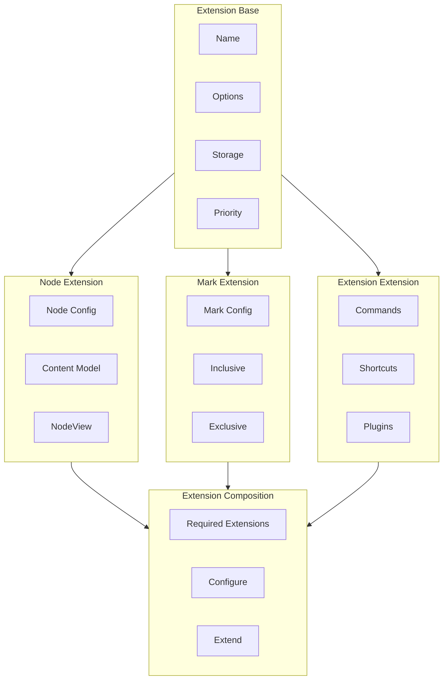

# Tiptap Extension System: Deep Dive

A comprehensive guide to Tiptap's extension system - the powerful architecture that enables building custom rich text editors from simple comment boxes to full-featured document editors like Notion or Google Docs.

---

## Table of Contents

1. [Extension Architecture Overview](#extension-architecture-overview)
2. [Extension Types](#extension-types)
   - [Extension Base Class](#extension-base-class)
   - [Node Extensions](#node-extensions)
   - [Mark Extensions](#mark-extensions)
   - [Extension Extensions](#extension-extensions)
3. [Extension API Reference](#extension-api-reference)
   - [Core Properties](#core-properties)
   - [Schema Methods](#schema-methods)
   - [Command Methods](#command-methods)
   - [Input/Output Methods](#inputoutput-methods)
   - [Plugin Methods](#plugin-methods)
   - [Storage and Lifecycle](#storage-and-lifecycle)
4. [Node Extensions Deep Dive](#node-extensions-deep-dive)
   - [Node Configuration](#node-configuration)
   - [Node Attributes](#node-attributes)
   - [Node Content Model](#node-content-model)
   - [Node View](#node-view)
   - [Built-in Node Examples](#built-in-node-examples)
5. [Mark Extensions Deep Dive](#mark-extensions-deep-dive)
   - [Mark Configuration](#mark-configuration)
   - [Mark Behavior](#mark-behavior)
   - [Built-in Mark Examples](#built-in-mark-examples)
6. [Custom Extensions](#custom-extensions)
   - [Creating Custom Nodes](#creating-custom-nodes)
   - [Creating Custom Marks](#creating-custom-marks)
   - [Creating Custom Extensions](#creating-custom-extensions)
   - [Node Views for Frameworks](#node-views-for-frameworks)
7. [Extension Composition](#extension-composition)
   - [Extension Priorities](#extension-priorities)
   - [Required Extensions](#required-extensions)
   - [Extension Conflicts](#extension-conflicts)
   - [Extension Ordering](#extension-ordering)
8. [Built-in Extensions Reference](#built-in-extensions-reference)
   - [Core Extensions](#core-extensions)
   - [Node Extensions](#node-extensions-reference)
   - [Mark Extensions](#mark-extensions-reference)
   - [Feature Extensions](#feature-extensions)
   - [List Extensions](#list-extensions)
   - [Table Extensions](#table-extensions)

---

## Extension Architecture Overview

Tiptap's extension system is built on a few key architectural principles:



Every extension in Tiptap inherits from the base `Extension` class and can override specific methods to add functionality.

---

## Extension Types

### Extension Base Class

All Tiptap extensions inherit from the base `Extension` class. The base class provides:

- **Type system**: Distinguishes between nodes, marks, and extensions
- **Options handling**: Default options and configuration
- **Storage**: Private state management
- **Extension composition**: Required extensions and priorities

```typescript
import { Extension } from '@tiptap/core'

export const MyExtension = Extension.create({
  // The extension name - required
  name: 'myExtension',

  // Priority determines order of execution (higher = earlier)
  priority: 100,

  // Extensions that must be loaded
  requiredExtensions: [],

  // Default options
  addOptions() {
    return {
      option1: 'default',
      option2: true,
    }
  },

  // Private storage (not serialized)
  addStorage() {
    return {
      privateState: null,
    }
  },

  // Called when extension is added to editor
  onCreate() {
    console.log('Extension created')
  },

  // Called after every transaction
  onTransaction() {
    console.log('Transaction completed')
  },

  // Called when selection changes
  onSelectionUpdate() {
    console.log('Selection updated')
  },

  // Called when editor is focused
  onFocus({ event }) {
    console.log('Editor focused', event)
  },

  // Called when editor loses focus
  onBlur({ event }) {
    console.log('Editor blurred', event)
  },

  // Called when editor content is updated
  onUpdate({ editor }) {
    console.log('Editor updated', editor.getHTML())
  },

  // Called during editor destruction
  onDestroy() {
    console.log('Extension destroyed')
  },
})
```

### Extension Inheritance with parent

Extensions can access parent class methods using `this.parent`:

```typescript
import { Node } from '@tiptap/core'

export const CustomParagraph = Node.create({
  name: 'paragraph',

  // Inherit group from parent if it exists
  group: this.parent?.group || 'block',

  // Extend parent options
  addOptions() {
    return {
      ...this.parent?.(),
      customOption: 'value',
    }
  },

  // Extend parent attributes
  addAttributes() {
    return {
      ...this.parent?.(),
      customAttribute: {
        default: null,
        parseHTML: element => element.getAttribute('data-custom'),
        renderHTML: attributes => ({
          'data-custom': attributes.customAttribute,
        }),
      },
    }
  },
})
```

---

### Node Extensions

Node extensions define **block-level** content in the document. They represent structural elements like paragraphs, headings, images, and custom blocks.

```typescript
import { Node } from '@tiptap/core'

export const CustomNode = Node.create({
  // Node type name
  name: 'customNode',

  // Node configuration is inherited from parent
  // or defined directly for custom nodes

  // Content model - what this node can contain
  content: 'inline*',

  // Group classification for schema rules
  group: 'block',

  // What marks are allowed on this node's content
  marks: 'textStyle link',

  // Is this a single atomic element?
  atom: false,

  // Can this node appear inline?
  inline: false,

  // Can this node be selected?
  selectable: true,

  // Can content be edited inside?
  editable: true,

  // Should cursor be trapped inside?
  isolating: false,

  // Can this node be dragged?
  draggable: false,

  // Default attributes
  addAttributes() {
    return {
      id: {
        default: null,
        parseHTML: element => element.getAttribute('data-id'),
        renderHTML: attributes => ({
          'data-id': attributes.id,
        }),
      },
    }
  },

  // How to parse from HTML
  parseHTML() {
    return [
      {
        tag: 'div[data-custom-node]',
      },
    ]
  },

  // How to render to HTML
  renderHTML({ HTMLAttributes }) {
    return ['div', mergeAttributes(HTMLAttributes, { 'data-custom-node': '' }), 0]
  },

  // Custom node view for React/Vue/Svelte
  addNodeView() {
    return ({ node, editor, getPos }) => {
      return {
        dom: document.createElement('div'),
        contentDOM: document.createElement('div'),
      }
    }
  },
})
```

#### Node Priority

Node priority determines the order nodes are registered in the schema:

```typescript
import { Node } from '@tiptap/core'

export const HighPriorityNode = Node.create({
  name: 'highPriority',
  priority: 1000, // Higher priority = registered earlier
})

export const LowPriorityNode = Node.create({
  name: 'lowPriority',
  priority: 1, // Lower priority = registered later
})
```

---

### Mark Extensions

Mark extensions define **inline formatting** like bold, italic, links, and highlights. Marks wrap text content within nodes.

```typescript
import { Mark } from '@tiptap/core'

export const CustomMark = Mark.create({
  // Mark type name
  name: 'customMark',

  // Mark behavior configuration

  // Should mark be included when extending selection?
  inclusive: true,

  // Should mark be excluded when adjacent marks differ?
  exclusive: false,

  // Should mark be expelled when wrapping with another mark?
  expelling: false,

  // Can mark span across node boundaries?
  spanning: false,

  // Default attributes
  addAttributes() {
    return {
      color: {
        default: null,
        parseHTML: element => element.style.color,
        renderHTML: attributes => ({
          style: attributes.color ? `color: ${attributes.color}` : '',
        }),
      },
    }
  },

  // How to parse from HTML
  parseHTML() {
    return [
      {
        tag: 'span[data-custom-mark]',
      },
      {
        tag: 'custom',
        getAttrs: node => ({
          custom: true,
        }),
      },
    ]
  },

  // How to render to HTML
  renderHTML({ HTMLAttributes }) {
    return ['span', mergeAttributes(HTMLAttributes, { 'data-custom-mark': '' }), 0]
  },
})
```

#### Mark Priority

```typescript
import { Mark } from '@tiptap/core'

export const HighPriorityMark = Mark.create({
  name: 'highPriorityMark',
  priority: 1000,
})
```

---

### Extension Extensions

"Extension" extensions add behavior and features without contributing to the document schema. They provide commands, keyboard shortcuts, plugins, and other functionality.

```typescript
import { Extension } from '@tiptap/core'

export const CustomExtension = Extension.create({
  name: 'customExtension',

  // Extensions that must be loaded with this one
  requiredExtensions: [
    // OtherExtension,
  ],

  addOptions() {
    return {
      enabled: true,
      shortcut: 'Mod-s',
    }
  },

  addStorage() {
    return {
      history: [],
    }
  },

  // Add ProseMirror plugins
  addProseMirrorPlugins() {
    return [
      // customPlugin(),
    ]
  },

  // Add keyboard shortcuts
  addKeyboardShortcuts() {
    return {
      [this.options.shortcut]: () => {
        console.log('Shortcut triggered')
        return true
      },
    }
  },

  // Add commands
  addCommands() {
    return {
      customCommand: () => ({ commands, state, dispatch }) => {
        // Command logic
        return true
      },
    }
  },

  // Add input rules (markdown-style typing)
  addInputRules() {
    return [
      {
        find: /^- $/,
        handler: ({ state, range }) => {
          // Transform to list item
        },
      },
    ]
  },

  // Add paste rules
  addPasteRules() {
    return [
      {
        find: /https?:\/\/[^\s]+/,
        handler: ({ state, range, match }) => {
          // Transform URL to link
        },
      },
    ]
  },
})
```

---

## Extension API Reference

### Core Properties

#### name

The extension's unique identifier. Required for all extensions.

```typescript
export const MyExtension = Extension.create({
  name: 'myExtension',
})
```

#### priority

Determines the order of execution. Higher numbers execute earlier.

```typescript
export const HighPriority = Extension.create({
  name: 'highPriority',
  priority: 1000, // Executes before priority 100
})

export const NormalPriority = Extension.create({
  name: 'normal',
  priority: 100, // Default
})
```

#### requiredExtensions

Extensions that must be loaded for this extension to work.

```typescript
import { Node } from '@tiptap/core'

export const Figure = Node.create({
  name: 'figure',

  requiredExtensions: [
    // Image must be loaded for Figure to work
    // Image,
  ],
})
```

---

### Options and Configuration

#### addOptions

Returns default options for the extension. Options can be overridden when adding the extension to the editor.

```typescript
import { Extension } from '@tiptap/core'

export const Placeholder = Extension.create({
  name: 'placeholder',

  addOptions() {
    return {
      placeholder: 'Start typing...',
      emptyEditorClass: 'is-editor-empty',
      emptyNodeClass: 'is-empty',
      showOnlyWhenEditable: true,
      showOnlyCurrent: true,
    }
  },
})

// Usage:
// Placeholder.configure({
//   placeholder: 'Enter text...',
// })
```

#### configure

Method to create a configured instance of an extension.

```typescript
import StarterKit from '@tiptap/starter-kit'
import Link from '@tiptap/extension-link'

const extensions = [
  StarterKit.configure({
    history: {
      deepContentChange: true,
    },
    bold: false, // Disable bold
  }),
  Link.configure({
    openOnClick: false,
    HTMLAttributes: {
      class: 'text-blue-500 underline',
      rel: 'noopener noreferrer',
    },
    protocols: ['http', 'https', 'mailto'],
  }),
]
```

---

### Schema Methods

#### addSchema

Adds to or overrides the ProseMirror schema.

```typescript
import { Extension } from '@tiptap/core'

export const CustomSchema = Extension.create({
  name: 'customSchema',

  addSchema() {
    return {
      nodes: {
        // Override or add nodes
        customNode: {
          content: 'inline*',
          group: 'block',
        },
      },
      marks: {
        // Override or add marks
        customMark: {
          inclusive: true,
        },
      },
    }
  },
})
```

#### addAttributes

Defines attributes for nodes or marks.

```typescript
import { Node } from '@tiptap/core'

export const Image = Node.create({
  name: 'image',

  addAttributes() {
    return {
      src: {
        default: null,
        parseHTML: element => element.getAttribute('src'),
        renderHTML: attributes => ({
          src: attributes.src,
        }),
      },
      alt: {
        default: null,
        parseHTML: element => element.getAttribute('alt'),
        renderHTML: attributes => ({
          alt: attributes.alt,
        }),
      },
      title: {
        default: null,
        parseHTML: element => element.getAttribute('title'),
        renderHTML: attributes => ({
          title: attributes.title,
        }),
      },
      width: {
        default: null,
        parseHTML: element => element.getAttribute('width'),
        renderHTML: attributes => ({
          width: attributes.width,
        }),
      },
      height: {
        default: null,
        parseHTML: element => element.getAttribute('height'),
        renderHTML: attributes => ({
          height: attributes.height,
        }),
      },
    }
  },
})
```

---

### Command Methods

#### addCommands

Defines commands that can be executed to modify the document.

```typescript
import { Node } from '@tiptap/core'

export const Heading = Node.create({
  name: 'heading',

  addCommands() {
    return {
      // Set heading level
      setHeading: (attributes) => ({ commands }) => {
        return commands.setNode(this.name, attributes)
      },

      // Toggle heading on/off
      toggleHeading: (attributes) => ({ commands }) => {
        return commands.toggleNode(this.name, 'paragraph', attributes)
      },
    }
  },
})
```

Commands return a function that receives an object with:
- `state`: Current editor state
- `dispatch`: Function to apply changes
- `commands`: Chained command API
- `tr`: Current transaction
- `editor`: Editor instance

```typescript
addCommands() {
  return {
    complexCommand: (options) => ({ state, dispatch, commands, tr }) => {
      // Check if command can run
      if (!state.selection) return false

      // Apply changes
      tr.insertText('Hello')

      // Dispatch if provided
      if (dispatch) {
        dispatch(tr)
      }

      return true
    },
  }
}
```

#### chainableCommands

Commands can be chained using the chain API:

```typescript
// In your extension
addCommands() {
  return {
    insertParagraph: () => ({ commands }) => {
      return commands.insertContent({
        type: 'paragraph',
        content: [{ type: 'text', text: 'New paragraph' }],
      })
    },
  }
}

// Usage
editor.chain()
  .focus()
  .setTextSelection(0)
  .insertParagraph()
  .run()
```

---

### Input/Output Methods

#### addInputRules

Defines markdown-style typing rules that trigger on pattern match.

```typescript
import { Extension } from '@tiptap/core'
import { InputRule } from '@tiptap/core'

export const MarkdownRules = Extension.create({
  name: 'markdownRules',

  addInputRules() {
    return [
      // Bold: **text**
      {
        find: /(?:^|\s)(\*\*(?:[^*]+)\*\*)$/,
        handler: ({ state, range, match }) => {
          const start = range.from
          const end = range.to
          const content = match[0].slice(2, -2)

          state.tr
            .delete(start, end)
            .insertText(content, start, start + content.length)
            .addMark(start, start + content.length, state.schema.marks.bold.create())

          return state.tr
        },
      },

      // Italic: *text*
      {
        find: /(?:^|\s)(\*(?:[^*]+)\*)$/,
        handler: ({ state, range, match }) => {
          const start = range.from
          const end = range.to
          const content = match[0].slice(1, -1)

          state.tr
            .delete(start, end)
            .insertText(content, start, start + content.length)
            .addMark(start, start + content.length, state.schema.marks.italic.create())

          return state.tr
        },
      },

      // Bullet list: - or *
      {
        find: /^[-*]\s$/,
        handler: ({ state, range }) => {
          return state.tr
            .delete(range.from, range.to)
            .setNode(state.schema.nodes.bulletList.create())
        },
      },

      // Ordered list: 1.
      {
        find: /^\d+\.\s$/,
        handler: ({ state, range }) => {
          return state.tr
            .delete(range.from, range.to)
            .setNode(state.schema.nodes.orderedList.create())
        },
      },

      // Blockquote: >
      {
        find: /^>\s$/,
        handler: ({ state, range }) => {
          return state.tr
            .delete(range.from, range.to)
            .setNode(state.schema.nodes.blockquote.create())
        },
      },

      // Code block: ```
      {
        find: /^```\s$/,
        handler: ({ state, range }) => {
          return state.tr
            .delete(range.from, range.to)
            .setNode(state.schema.nodes.codeBlock.create())
        },
      },

      // Horizontal rule: --- or ***
      {
        find: /^(?:---|\*\*\*)\s$/,
        handler: ({ state, range }) => {
          return state.tr
            .delete(range.from, range.to)
            .insert(state.schema.nodes.horizontalRule.create())
        },
      },
    ]
  },
})
```

#### Using textInputRule helper

```typescript
import { textInputRule } from '@tiptap/core'

export const Typography = Extension.create({
  name: 'typography',

  addInputRules() {
    return [
      // Copyright symbol
      textInputRule({
        find: /\(c\)$/i,
        replace: '©',
      }),

      // Registered trademark
      textInputRule({
        find: /\(r\)$/i,
        replace: '®',
      }),

      // Trademark
      textInputRule({
        find: /\(tm\)$/i,
        replace: '™',
      }),

      // Em dash
      textInputRule({
        find: /--$/,
        replace: '—',
      }),

      // Ellipsis
      textInputRule({
        find: /\.\.\.$/,
        replace: '…',
      }),

      // Right arrow
      textInputRule({
        find: /->$/,
        replace: '→',
      }),

      // Left arrow
      textInputRule({
        find: /<-$/,
        replace: '←',
      }),

      // Double quotes
      textInputRule({
        find: /""$/,
        replace: '"',
      }),

      // Single quotes
      textInputRule({
        find: /''$/,
        replace: "'",
      }),
    ]
  },
})
```

#### addPasteRules

Defines rules that transform pasted content.

```typescript
import { Extension } from '@tiptap/core'

export const LinkPasteHandler = Extension.create({
  name: 'linkPasteHandler',

  addPasteRules() {
    return [
      {
        // Find URLs in pasted content
        find: /https?:\/\/[^\s]+/g,
        handler: ({ state, range, match }) => {
          const url = match[0]

          // Create link mark
          const mark = state.schema.marks.link.create({
            href: url,
          })

          // Apply mark to the matched text
          return state.tr.addMark(
            range.from,
            range.to,
            mark,
          )
        },
      },
    ]
  },
})
```

---

### Plugin Methods

#### addProseMirrorPlugins

Adds ProseMirror plugins for advanced functionality.

```typescript
import { Extension } from '@tiptap/core'
import { Plugin, PluginKey } from '@tiptap/pm/state'

export const Mention = Extension.create({
  name: 'mention',

  addProseMirrorPlugins() {
    return [
      new Plugin({
        key: new PluginKey('mention'),

        state: {
          init: () => ({
            open: false,
            query: null,
            range: null,
          }),
          apply: (tr, oldState) => {
            // Handle state changes
            return oldState
          },
        },

        props: {
          handleKeyDown: (view, event) => {
            if (event.key === '@') {
              // Open mention popup
              return true
            }
            return false
          },
        },
      }),
    ]
  },
})
```

#### More complex plugin example

```typescript
import { Extension } from '@tiptap/core'
import { Plugin, PluginKey } from '@tiptap/pm/state'
import { Decoration, DecorationSet } from '@tiptap/pm/view'

export const HighlightSelection = Extension.create({
  name: 'highlightSelection',

  addProseMirrorPlugins() {
    const pluginKey = new PluginKey('highlightSelection')

    return [
      new Plugin({
        key: pluginKey,

        state: {
          init: () => DecorationSet.empty,
          apply: (tr, decorationSet) => {
            const oldSelection = tr.before.selection
            const newSelection = tr.selection

            // Remove old decorations
            decorationSet = decorationSet.map(tr.mapping, tr.doc)

            // Add decoration for current selection
            if (newSelection && !newSelection.empty) {
              const decoration = Decoration.inline(
                newSelection.from,
                newSelection.to,
                { class: 'highlight-selection' },
              )
              decorationSet = DecorationSet.create(tr.doc, [decoration])
            }

            return decorationSet
          },
        },

        props: {
          decorations: (state) => {
            return pluginKey.getState(state)
          },
        },
      }),
    ]
  },
})
```

---

### Storage and Lifecycle

#### addStorage

Private storage that persists across transactions but is not serialized.

```typescript
import { Extension } from '@tiptap/core'

export const CharacterCount = Extension.create({
  name: 'characterCount',

  addStorage() {
    return {
      characterCount: 0,
      wordCount: 0,
      lastUpdate: null,
    }
  },

  onUpdate() {
    const text = this.editor.getText()

    this.storage.characterCount = text.length
    this.storage.wordCount = text.split(/\s+/).filter(w => w.length > 0).length
    this.storage.lastUpdate = Date.now()
  },

  // Public API to access storage
  getCharacterCount() {
    return this.storage.characterCount
  },

  getWordCount() {
    return this.storage.wordCount
  },
})
```

#### Lifecycle Hooks

```typescript
import { Extension } from '@tiptap/core'

export const LifecycleExtension = Extension.create({
  name: 'lifecycle',

  // Called when the editor is created
  onCreate() {
    console.log('Editor created')
  },

  // Called after every transaction
  onTransaction({ transaction }) {
    console.log('Transaction:', {
      docChanged: transaction.docChanged,
      selectionChanged: transaction.selectionSet,
      steps: transaction.steps.length,
    })
  },

  // Called when editor content changes
  onUpdate({ editor }) {
    console.log('Content updated:', editor.getHTML())
  },

  // Called when selection changes
  onSelectionUpdate({ editor }) {
    console.log('Selection:', editor.state.selection)
  },

  // Called when editor receives focus
  onFocus({ event }) {
    console.log('Focus event:', event)
  },

  // Called when editor loses focus
  onBlur({ event }) {
    console.log('Blur event:', event)
  },

  // Called when editor is destroyed
  onDestroy() {
    console.log('Editor destroyed')
  },
})
```

#### Transaction Details

```typescript
onTransaction({ transaction }) {
  // Full transaction object
  const {
    doc,           // New document
    selection,     // New selection
    steps,         // Applied steps
    stepType,      // Type of step
    docChanged,    // Boolean
    selectionSet,  // Boolean
    time,          // Timestamp
    metadata,      // Custom metadata
    scroller,      // Scroll information
  } = transaction

  // Access editor
  const editor = this.editor

  // Check for specific metadata
  if (transaction.getMeta('addToHistory') === false) {
    console.log('Change not added to history')
  }
}
```

---

## Node Extensions Deep Dive

### Node Configuration

Nodes are the building blocks of document structure. Here's a complete breakdown of node configuration:

```typescript
import { Node } from '@tiptap/core'

export const CompleteNode = Node.create({
  name: 'completeNode',

  // --- Content Model ---

  // What content this node can contain
  // 'inline*' = zero or more inline elements
  // 'block+' = one or more blocks
  // '' = empty (for atom nodes)
  content: 'inline*',

  // Which group(s) this node belongs to
  // Used for schema validation
  group: 'block',

  // What marks can be applied to content
  // '' = no marks allowed
  // 'textStyle' = only text style marks
  marks: '_',

  // --- Behavior ---

  // Is this node atomic (cannot have content)?
  atom: false,

  // Can this node appear inline?
  inline: false,

  // Can this node be selected?
  selectable: true,

  // Can content inside be edited?
  editable: true,

  // Should cursor be trapped inside this node?
  isolating: false,

  // Can this node be dragged?
  draggable: false,

  // Should this node define a table cell structure?
  tableRole: null, // 'cell', 'header_cell', 'row', null

  // --- Default Attributes ---

  addAttributes() {
    return {
      // Attribute with default
      id: {
        default: null,
      },
      // Attribute with parsing
      class: {
        default: null,
        parseHTML: element => element.getAttribute('class'),
        renderHTML: attributes => ({
          class: attributes.class,
        }),
      },
      // Attribute with multiple sources
      align: {
        default: 'left',
        parseHTML: [
          element => element.style.textAlign,
          element => element.getAttribute('align'),
        ],
        renderHTML: attributes => ({
          style: `text-align: ${attributes.align}`,
        }),
      },
    }
  },

  // --- HTML Parsing ---

  parseHTML() {
    return [
      // Simple tag match
      {
        tag: 'div.my-node',
      },
      // Tag with attribute
      {
        tag: 'div[data-my-node]',
      },
      // Tag with specific attribute value
      {
        tag: 'div[data-type="my-node"]',
      },
      // Match with attribute extraction
      {
        tag: 'h1',
        getAttrs: (node) => ({
          level: 1,
        }),
      },
      // Conditional match
      {
        tag: 'div',
        getAttrs: (node) => {
          if (node.classList.contains('my-node')) {
            return {}
          }
          return false // Reject this match
        },
      },
      // Style-based match
      {
        tag: 'div',
        getAttrs: (node) => {
          if (node.style.display === 'flex') {
            return { type: 'flex' }
          }
          return false
        },
      },
    ]
  },

  // --- HTML Rendering ---

  renderHTML({ HTMLAttributes }) {
    // Return ProseMirror DOM spec
    return [
      'div',                    // Tag name
      mergeAttributes(HTMLAttributes, { 'data-my-node': '' }),  // Attributes
      0,                        // Content hole (where child content goes)
    ]
  },

  // --- Node View ---

  addNodeView() {
    return ({ node, editor, getPos, HTMLAttributes }) => {
      // Create container
      const div = document.createElement('div')
      div.className = 'my-node-wrapper'

      // Create content area
      const content = document.createElement('div')
      content.className = 'my-node-content'

      div.appendChild(content)

      return {
        dom: div,        // Outer DOM element
        contentDOM: content, // Where content is rendered
      }
    }
  },

  // --- Commands ---

  addCommands() {
    return {
      setCompleteNode: (attributes) => ({ commands }) => {
        return commands.setNode(this.name, attributes)
      },
      toggleCompleteNode: (attributes) => ({ commands }) => {
        return commands.toggleNode(this.name, 'paragraph', attributes)
      },
    }
  },

  // --- Keyboard Shortcuts ---

  addKeyboardShortcuts() {
    return {
      'Mod-Alt-c': () => {
        return this.editor.commands.toggleCompleteNode()
      },
    }
  },
})
```

### Node Content Model

The content model defines what can be inside a node:

```typescript
// Content patterns
const patterns = {
  // Zero or more inline elements
  empty: '',
  inlineZeroOrMore: 'inline*',
  inlineOneOrMore: 'inline+',
  inlineOne: 'inline',

  // Zero or more blocks
  blockZeroOrMore: 'block*',
  blockOneOrMore: 'block+',
  blockOne: 'block',

  // Specific nodes
  textOnly: 'text*',
  specificNodes: 'paragraph heading+',
  mixed: '(paragraph | heading)+',

  // Complex patterns
  titleThenContent: 'heading block+',
  listItem: 'paragraph block*',
}
```

### Node Groups

Groups allow schema rules to reference categories of nodes:

```typescript
import { Node } from '@tiptap/core'

// Define nodes with groups
export const Paragraph = Node.create({
  name: 'paragraph',
  group: 'block',
})

export const Heading = Node.create({
  name: 'heading',
  group: 'block',
})

export const BulletList = Node.create({
  name: 'bulletList',
  group: 'list',
})

export const OrderedList = Node.create({
  name: 'orderedList',
  group: 'list',
})

// In schema, you can reference groups
const schema = {
  doc: {
    content: '(block|list)+',
  },
}
```

### Node View

Node views allow custom rendering and behavior for nodes:

```typescript
addNodeView() {
  return ({ node, editor, getPos, HTMLAttributes }) => {
    const { src, alt } = node.attrs

    // Create DOM
    const div = document.createElement('div')
    div.className = 'image-node'

    const img = document.createElement('img')
    img.src = src
    img.alt = alt

    div.appendChild(img)

    // Add delete button
    const deleteBtn = document.createElement('button')
    deleteBtn.textContent = 'Delete'
    deleteBtn.onclick = () => {
      const pos = typeof getPos === 'function' ? getPos() : getPos
      editor.commands.deleteRange({ from: pos, to: pos + node.nodeSize })
    }
    div.appendChild(deleteBtn)

    return {
      dom: div,
      // For nodes with editable content
      // contentDOM: contentElement,
    }
  }
}
```

---

### Built-in Node Examples

#### Document

The root node of every Tiptap document:

```typescript
import { Node } from '@tiptap/core'

export const Document = Node.create({
  name: 'doc',

  topNode: true,

  content: 'block+',

  parseHTML() {
    return [{ tag: 'div' }]
  },

  renderHTML({ HTMLAttributes }) {
    return ['div', mergeAttributes(HTMLAttributes), 0]
  },
})
```

#### Text

The inline text node:

```typescript
import { Node } from '@tiptap/core'

export const Text = Node.create({
  name: 'text',

  group: 'inline',

  parseHTML() {
    return [{ tag: 'text' }]
  },
})
```

#### Paragraph

```typescript
import { Node, mergeAttributes } from '@tiptap/core'

export const Paragraph = Node.create({
  name: 'paragraph',

  group: 'block',

  content: 'inline*',

  marks: '_',

  parseHTML() {
    return [{ tag: 'p' }]
  },

  renderHTML({ HTMLAttributes }) {
    return ['p', mergeAttributes(HTMLAttributes), 0]
  },

  addCommands() {
    return {
      setParagraph: () => ({ commands }) => {
        return commands.setNode('paragraph')
      },
    }
  },

  addKeyboardShortcuts() {
    return {
      'Mod-Alt-0': () => {
        return this.editor.commands.setParagraph()
      },
    }
  },
})
```

#### Heading

```typescript
import { Node, mergeAttributes } from '@tiptap/core'

export interface HeadingOptions {
  levels: number[]
  HTMLAttributes: Record<string, any>
}

export const Heading = Node.create<HeadingOptions>({
  name: 'heading',

  addOptions() {
    return {
      levels: [1, 2, 3, 4, 5, 6],
      HTMLAttributes: {},
    }
  },

  group: 'block',

  content: 'inline*',

  defining: true,

  addAttributes() {
    return {
      level: {
        default: 1,
        parseHTML: element => parseInt(element.tagName.slice(1), 10),
        renderHTML: attributes => ({
          'data-level': attributes.level,
        }),
      },
    }
  },

  parseHTML() {
    return this.options.levels.map((level: number) => ({
      tag: `h${level}`,
      attrs: { level },
    }))
  },

  renderHTML({ node, HTMLAttributes }) {
    const level = node.attrs.level as number
    return [
      `h${level}`,
      mergeAttributes(this.options.HTMLAttributes, HTMLAttributes),
      0,
    ]
  },

  addCommands() {
    return {
      setHeading: (attributes) => ({ commands }) => {
        return commands.setNode(this.name, attributes)
      },
      toggleHeading: (attributes) => ({ commands }) => {
        return commands.toggleNode(this.name, 'paragraph', attributes)
      },
    }
  },

  addKeyboardShortcuts() {
    const shortcuts: Record<string, () => boolean> = {}

    this.options.levels.forEach((level: number) => {
      shortcuts[`Mod-Alt-${level}`] = () =>
        this.editor.commands.toggleHeading({ level })
    })

    return shortcuts
  },
})
```

#### Image

```typescript
import { Node, mergeAttributes } from '@tiptap/core'

export interface ImageOptions {
  inline: boolean
  allowBase64: boolean
  HTMLAttributes: Record<string, any>
}

export const Image = Node.create<ImageOptions>({
  name: 'image',

  addOptions() {
    return {
      inline: false,
      allowBase64: false,
      HTMLAttributes: {},
    }
  },

  inline: this.options.inline,

  group: this.options.inline ? 'inline' : 'block',

  draggable: true,

  atom: true,

  addAttributes() {
    return {
      src: {
        default: null,
        parseHTML: element => {
          const src = element.getAttribute('src')

          if (!this.options.allowBase64 && src?.startsWith('data:')) {
            return null
          }

          return src
        },
        renderHTML: attributes => ({
          src: attributes.src,
        }),
      },
      alt: {
        default: null,
        parseHTML: element => element.getAttribute('alt'),
        renderHTML: attributes => ({
          alt: attributes.alt,
        }),
      },
      title: {
        default: null,
        parseHTML: element => element.getAttribute('title'),
        renderHTML: attributes => ({
          title: attributes.title,
        }),
      },
    }
  },

  parseHTML() {
    return [
      {
        tag: this.options.inline ? 'img' : 'img[src]',
      },
    ]
  },

  renderHTML({ HTMLAttributes }) {
    return [
      'img',
      mergeAttributes(this.options.HTMLAttributes, HTMLAttributes),
    ]
  },

  addCommands() {
    return {
      setImage: (options) => ({ commands }) => {
        return commands.insertContent({
          type: this.name,
          attrs: options,
        })
      },
    }
  },
})
```

#### Blockquote

```typescript
import { Node, mergeAttributes } from '@tiptap/core'

export const Blockquote = Node.create({
  name: 'blockquote',

  group: 'block',

  content: 'block+',

  marks: '_',

  defining: true,

  parseHTML() {
    return [{ tag: 'blockquote' }]
  },

  renderHTML({ HTMLAttributes }) {
    return ['blockquote', mergeAttributes(HTMLAttributes), 0]
  },

  addCommands() {
    return {
      setBlockquote: () => ({ commands }) => {
        return commands.wrapIn('blockquote')
      },
      toggleBlockquote: () => ({ commands }) => {
        return commands.toggleWrap('blockquote')
      },
      unsetBlockquote: () => ({ commands }) => {
        return commands.lift('blockquote')
      },
    }
  },

  addKeyboardShortcuts() {
    return {
      'Mod-Shift-b': () => {
        return this.editor.commands.toggleBlockquote()
      },
    }
  },
})
```

#### CodeBlock

```typescript
import { Node, mergeAttributes } from '@tiptap/core'

export interface CodeBlockOptions {
  languageClassPrefix: string
  HTMLAttributes: Record<string, any>
}

export const CodeBlock = Node.create<CodeBlockOptions>({
  name: 'codeBlock',

  addOptions() {
    return {
      languageClassPrefix: 'language-',
      HTMLAttributes: {},
    }
  },

  group: 'block',

  content: 'text*',

  marks: '',

  code: true,

  defining: true,

  addAttributes() {
    return {
      language: {
        default: null,
        parseHTML: element => {
          const className = element.firstChild?.className
          const match = className?.match(new RegExp(`(?:${this.options.languageClassPrefix})([\\\\w-]+)`))
          return match?.[1]
        },
        renderHTML: attributes => ({
          'data-language': attributes.language,
        }),
      },
    }
  },

  parseHTML() {
    return [
      {
        tag: 'pre',
        preserveWhitespace: 'full',
      },
    ]
  },

  renderHTML({ node, HTMLAttributes }) {
    return [
      'pre',
      mergeAttributes(this.options.HTMLAttributes, HTMLAttributes),
      [
        'code',
        {
          class: node.attrs.language
            ? this.options.languageClassPrefix + node.attrs.language
            : null,
        },
        0,
      ],
    ]
  },

  addCommands() {
    return {
      setCodeBlock: (attributes) => ({ commands }) => {
        return commands.setNode(this.name, attributes)
      },
      toggleCodeBlock: (attributes) => ({ commands }) => {
        return commands.toggleNode(this.name, 'paragraph', attributes)
      },
    }
  },

  addKeyboardShortcuts() {
    return {
      'Mod-Alt-c': () => {
        return this.editor.commands.toggleCodeBlock()
      },
    }
  },
})
```

#### HorizontalRule

```typescript
import { Node, mergeAttributes } from '@tiptap/core'

export const HorizontalRule = Node.create({
  name: 'horizontalRule',

  group: 'block',

  atom: true,

  parseHTML() {
    return [{ tag: 'hr' }]
  },

  renderHTML({ HTMLAttributes }) {
    return ['hr', mergeAttributes(HTMLAttributes)]
  },

  addCommands() {
    return {
      setHorizontalRule: () => ({ commands }) => {
        return commands.insertContent({ type: this.name })
      },
    }
  },

  addKeyboardShortcuts() {
    return {
      'Mod-Alt--': () => {
        return this.editor.commands.setHorizontalRule()
      },
    }
  },
})
```

#### HardBreak

```typescript
import { Node, mergeAttributes } from '@tiptap/core'

export interface HardBreakOptions {
  keepMarks: boolean
  HTMLAttributes: Record<string, any>
}

export const HardBreak = Node.create<HardBreakOptions>({
  name: 'hardBreak',

  addOptions() {
    return {
      keepMarks: false,
      HTMLAttributes: {},
    }
  },

  inline: true,

  group: 'inline',

  selectable: false,

  parseHTML() {
    return [{ tag: 'br' }]
  },

  renderHTML({ HTMLAttributes }) {
    return ['br', mergeAttributes(this.options.HTMLAttributes, HTMLAttributes)]
  },

  addCommands() {
    return {
      setHardBreak: () => ({ commands, state, chain }) => {
        const { selection } = state

        if (selection.empty) {
          return false
        }

        if (!this.options.keepMarks) {
          return chain()
            .deleteSelection()
            .insertContent({ type: this.name })
            .run()
        }

        return chain()
          .deleteSelection()
          .insertContent({ type: this.name })
          .setSelection({ from: selection.from })
          .run()
      },
    }
  },

  addKeyboardShortcuts() {
    return {
      'Mod-Enter': () => {
        return this.editor.commands.setHardBreak()
      },
      'Shift-Enter': () => {
        return this.editor.commands.setHardBreak()
      },
    }
  },
})
```

---

## Mark Extensions Deep Dive

### Mark Configuration

Marks define inline formatting behavior:

```typescript
import { Mark } from '@tiptap/core'

export const CompleteMark = Mark.create({
  name: 'completeMark',

  // --- Mark Behavior ---

  // Should the mark be included when expanding selection?
  // true = mark extends with selection
  // false = mark boundary stops selection expansion
  inclusive: true,

  // Should marks be excluded when adjacent marks differ?
  // true = different adjacent marks exclude each other
  exclusive: false,

  // Should the mark be expelled when wrapping with certain marks?
  // true = mark is removed when wrapping with specific other marks
  expelling: false,

  // Can the mark span across different parent nodes?
  // true = mark can cross block boundaries
  spanning: false,

  // Default attributes
  addAttributes() {
    return {
      color: {
        default: null,
        parseHTML: element => element.style.color,
        renderHTML: attributes => ({
          style: `color: ${attributes.color}`,
        }),
      },
    }
  },

  // Parse from HTML
  parseHTML() {
    return [
      {
        tag: 'span.complete-mark',
      },
      {
        tag: 'complete',
      },
      {
        tag: 'span',
        getAttrs: (element) => {
          if (element.classList.contains('complete-mark')) {
            return {}
          }
          return false
        },
      },
      {
        style: 'font-weight=bold',
      },
    ]
  },

  // Render to HTML
  renderHTML({ HTMLAttributes }) {
    return ['span', mergeAttributes(HTMLAttributes, { 'data-complete': '' }), 0]
  },

  // Commands
  addCommands() {
    return {
      setCompleteMark: () => ({ commands }) => {
        return commands.setMark(this.name)
      },
      toggleCompleteMark: () => ({ commands }) => {
        return commands.toggleMark(this.name)
      },
      unsetCompleteMark: () => ({ commands }) => {
        return commands.unsetMark(this.name)
      },
    }
  },

  // Keyboard shortcuts
  addKeyboardShortcuts() {
    return {
      'Mod-m': () => {
        return this.editor.commands.toggleCompleteMark()
      },
    }
  },
})
```

### Mark Behavior Explained

#### inclusive

Controls whether the mark extends when the selection is expanded:

```typescript
// inclusive: true (default for most marks)
// When you extend selection, the mark extends too
editor.chain()
  .setSelection({ from: 0, to: 5 })
  .toggleBold()  // Creates **bold**
  .setSelection({ from: 0, to: 10 })  // Bold extends to 10
  .run()

// inclusive: false (used for marks like link)
// Selection stops at mark boundary
editor.chain()
  .setSelection({ from: 0, to: 5 })
  .toggleLink({ href: '...' })
  .setSelection({ from: 0, to: 10 })  // Stops at link boundary
  .run()
```

#### exclusive

When true, adjacent marks with different attributes exclude each other:

```typescript
// exclusive: true (used for text color marks)
// Setting a new color removes the old color mark
editor.chain()
  .setColor('red')   // Creates color mark
  .setColor('blue')  // Removes red, creates blue
  .run()
```

#### expelling

Controls whether the mark is removed when wrapping with certain nodes:

```typescript
// expelling: true (used for code mark)
// Wrapping in code block removes the code mark
editor.chain()
  .setCode()  // Creates code mark
  .toggleCodeBlock()  // Removes code mark, wraps in code block
  .run()
```

#### spanning

Controls whether the mark can span across parent nodes:

```typescript
// spanning: true
// Mark can cross from paragraph to heading
// Most marks have spanning: false
```

---

### Built-in Mark Examples

#### Bold

```typescript
import { Mark, mergeAttributes } from '@tiptap/core'

export const Bold = Mark.create({
  name: 'bold',

  inclusive: true,
  exclusive: false,
  expelling: false,
  spanning: false,

  parseHTML() {
    return [
      {
        tag: 'strong',
      },
      {
        tag: 'b',
      },
      {
        style: 'font-weight',
        getAttrs: (value) => {
          if (value === 'bold' || value === '700' || value === '400') {
            return {}
          }
          return false
        },
      },
    ]
  },

  renderHTML({ HTMLAttributes }) {
    return ['strong', mergeAttributes(HTMLAttributes), 0]
  },

  addCommands() {
    return {
      setBold: () => ({ commands }) => {
        return commands.setMark(this.name)
      },
      toggleBold: () => ({ commands }) => {
        return commands.toggleMark(this.name)
      },
      unsetBold: () => ({ commands }) => {
        return commands.unsetMark(this.name)
      },
    }
  },

  addKeyboardShortcuts() {
    return {
      'Mod-b': () => {
        return this.editor.commands.toggleBold()
      },
    }
  },
})
```

#### Italic

```typescript
import { Mark, mergeAttributes } from '@tiptap/core'

export const Italic = Mark.create({
  name: 'italic',

  parseHTML() {
    return [
      {
        tag: 'em',
      },
      {
        tag: 'i',
      },
      {
        style: 'font-style=italic',
      },
    ]
  },

  renderHTML({ HTMLAttributes }) {
    return ['em', mergeAttributes(HTMLAttributes), 0]
  },

  addCommands() {
    return {
      setItalic: () => ({ commands }) => {
        return commands.setMark(this.name)
      },
      toggleItalic: () => ({ commands }) => {
        return commands.toggleMark(this.name)
      },
      unsetItalic: () => ({ commands }) => {
        return commands.unsetMark(this.name)
      },
    }
  },

  addKeyboardShortcuts() {
    return {
      'Mod-i': () => {
        return this.editor.commands.toggleItalic()
      },
    }
  },
})
```

#### Strike

```typescript
import { Mark, mergeAttributes } from '@tiptap/core'

export const Strike = Mark.create({
  name: 'strike',

  parseHTML() {
    return [
      {
        tag: 's',
      },
      {
        tag: 'del',
      },
      {
        tag: 'strike',
      },
      {
        style: 'text-decoration=line-through',
      },
    ]
  },

  renderHTML({ HTMLAttributes }) {
    return ['s', mergeAttributes(HTMLAttributes), 0]
  },

  addCommands() {
    return {
      setStrike: () => ({ commands }) => {
        return commands.setMark(this.name)
      },
      toggleStrike: () => ({ commands }) => {
        return commands.toggleMark(this.name)
      },
      unsetStrike: () => ({ commands }) => {
        return commands.unsetMark(this.name)
      },
    }
  },

  addKeyboardShortcuts() {
    return {
      'Mod-Shift-s': () => {
        return this.editor.commands.toggleStrike()
      },
    }
  },
})
```

#### Underline

```typescript
import { Mark, mergeAttributes } from '@tiptap/core'

export const Underline = Mark.create({
  name: 'underline',

  parseHTML() {
    return [
      {
        tag: 'u',
      },
      {
        style: 'text-decoration=underline',
      },
    ]
  },

  renderHTML({ HTMLAttributes }) {
    return ['u', mergeAttributes(HTMLAttributes), 0]
  },

  addCommands() {
    return {
      setUnderline: () => ({ commands }) => {
        return commands.setMark(this.name)
      },
      toggleUnderline: () => ({ commands }) => {
        return commands.toggleMark(this.name)
      },
      unsetUnderline: () => ({ commands }) => {
        return commands.unsetMark(this.name)
      },
    }
  },

  addKeyboardShortcuts() {
    return {
      'Mod-u': () => {
        return this.editor.commands.toggleUnderline()
      },
    }
  },
})
```

#### Link

```typescript
import { Mark, mergeAttributes } from '@tiptap/core'

export interface LinkOptions {
  openOnClick: boolean
  linkOnPaste: boolean
  autolink: boolean
  protocols: Array<string | { scheme: string; optionalScheme: string }>
  HTMLAttributes: Record<string, any>
}

export const Link = Mark.create<LinkOptions>({
  name: 'link',

  addOptions() {
    return {
      openOnClick: true,
      linkOnPaste: true,
      autolink: true,
      protocols: [],
      HTMLAttributes: {
        target: '_blank',
        rel: 'noopener noreferrer nofollow',
        class: null,
      },
    }
  },

  inclusive: false,

  addAttributes() {
    return {
      href: {
        default: null,
      },
      target: {
        default: this.options.HTMLAttributes.target,
      },
      rel: {
        default: this.options.HTMLAttributes.rel,
      },
      class: {
        default: this.options.HTMLAttributes.class,
      },
    }
  },

  parseHTML() {
    return [
      {
        tag: 'a[href]',
      },
    ]
  },

  renderHTML({ HTMLAttributes }) {
    return [
      'a',
      mergeAttributes(this.options.HTMLAttributes, HTMLAttributes),
      0,
    ]
  },

  addCommands() {
    return {
      setLink:
        (attributes) =>
        ({ chain }) => {
          return chain().setMark(this.name, attributes).setMeta('preventAutolink', true).run()
        },
      toggleLink:
        (attributes) =>
        ({ chain }) => {
          return chain()
            .toggleMark(this.name, attributes, { extendEmptyMarkRange: true })
            .setMeta('preventAutolink', true)
            .run()
        },
      unsetLink:
        () =>
        ({ chain }) => {
          return chain()
            .unsetMark(this.name, { extendEmptyMarkRange: true })
            .setMeta('preventAutolink', true)
            .run()
        },
    }
  },

  addKeyboardShortcuts() {
    return {
      'Mod-k': () => {
        const { editor } = this
        const { from, to } = editor.state.selection
        const isLinkActive = editor.isActive('link')

        if (isLinkActive) {
          return editor.commands.unsetLink()
        }

        return false
      },
    }
  },
})
```

#### Code

```typescript
import { Mark, mergeAttributes } from '@tiptap/core'

export interface CodeOptions {
  HTMLAttributes: Record<string, any>
}

export const Code = Mark.create<CodeOptions>({
  name: 'code',

  addOptions() {
    return {
      HTMLAttributes: {},
    }
  },

  parseHTML() {
    return [
      {
        tag: 'code',
      },
    ]
  },

  renderHTML({ HTMLAttributes }) {
    return ['code', mergeAttributes(this.options.HTMLAttributes, HTMLAttributes), 0]
  },

  addCommands() {
    return {
      setCode: () => ({ commands }) => {
        return commands.setMark(this.name)
      },
      toggleCode: () => ({ commands }) => {
        return commands.toggleMark(this.name)
      },
      unsetCode: () => ({ commands }) => {
        return commands.unsetMark(this.name)
      },
    }
  },

  addKeyboardShortcuts() {
    return {
      'Mod-e': () => {
        return this.editor.commands.toggleCode()
      },
    }
  },
})
```

#### TextColor / Highlight

```typescript
import { Mark, mergeAttributes } from '@tiptap/core'

export interface ColorOptions {
  types: string[]
  HTMLAttributes: Record<string, any>
}

export const Color = Mark.create<ColorOptions>({
  name: 'color',

  addOptions() {
    return {
      types: ['textStyle'],
      HTMLAttributes: {
        class: null,
      },
    }
  },

  inclusive: false,
  exclusive: true,
  spanning: false,

  addAttributes() {
    return {
      color: {
        default: null,
        parseHTML: element => element.style.color,
        renderHTML: attributes => {
          if (!attributes.color) {
            return {}
          }
          return {
            style: `color: ${attributes.color}`,
          }
        },
      },
    }
  },

  parseHTML() {
    return [
      {
        tag: 'span',
        getAttrs: (element) => {
          if ((element as HTMLElement).style.color) {
            return {}
          }
          return false
        },
      },
    ]
  },

  renderHTML({ HTMLAttributes }) {
    return ['span', mergeAttributes(HTMLAttributes), 0]
  },

  addCommands() {
    return {
      setColor:
        (color) =>
        ({ chain }) => {
          return chain().setMark(this.name, { color }).run()
        },
      unsetColor:
        () =>
        ({ chain }) => {
          return chain().unsetMark(this.name).run()
        },
    }
  },
})

// Highlight mark
export const Highlight = Mark.create({
  name: 'highlight',

  parseHTML() {
    return [
      {
        tag: 'mark',
      },
      {
        tag: 'span',
        getAttrs: (element) => {
          if ((element as HTMLElement).style.backgroundColor) {
            return {}
          }
          return false
        },
      },
    ]
  },

  renderHTML({ HTMLAttributes }) {
    return ['mark', mergeAttributes(HTMLAttributes), 0]
  },

  addCommands() {
    return {
      setHighlight: () => ({ commands }) => {
        return commands.setMark(this.name)
      },
      toggleHighlight: () => ({ commands }) => {
        return commands.toggleMark(this.name)
      },
      unsetHighlight: () => ({ commands }) => {
        return commands.unsetMark(this.name)
      },
    }
  },

  addKeyboardShortcuts() {
    return {
      'Mod-Shift-h': () => {
        return this.editor.commands.toggleHighlight()
      },
    }
  },
})
```

---

## Custom Extensions

### Creating Custom Nodes

#### Custom Mention Node

A mention node that displays @username style references:

```typescript
import { Node, mergeAttributes, nodeInputRule } from '@tiptap/core'

export interface MentionOptions {
  HTMLAttributes: Record<string, any>
  renderLabel: (options: { node: any; options: MentionOptions }) => string
}

export const Mention = Node.create<MentionOptions>({
  name: 'mention',

  addOptions() {
    return {
      HTMLAttributes: {},
      renderLabel: ({ options, node }) => {
        return `@${node.attrs.label ?? node.attrs.id}`
      },
    }
  },

  inline: true,
  atom: true,
  group: 'inline',
  selectable: true,
  draggable: false,

  addAttributes() {
    return {
      id: {
        default: null,
        parseHTML: element => element.getAttribute('data-id'),
        renderHTML: attributes => ({
          'data-id': attributes.id,
        }),
      },
      label: {
        default: null,
        parseHTML: element => element.getAttribute('data-label'),
        renderHTML: attributes => ({
          'data-label': attributes.label,
        }),
      },
    }
  },

  parseHTML() {
    return [
      {
        tag: `span[data-type="${this.name}"]`,
      },
    ]
  },

  renderHTML({ node, HTMLAttributes }) {
    return [
      'span',
      mergeAttributes({ 'data-type': this.name }, this.options.HTMLAttributes, HTMLAttributes),
      this.options.renderLabel({
        node,
        options: this.options,
      }),
    ]
  },

  addCommands() {
    return {
      insertMention:
        (attributes) =>
        ({ commands }) => {
          return commands.insertContent({
            type: this.name,
            attrs: attributes,
          })
        },
    }
  },

  addInputRules() {
    return [
      nodeInputRule({
        find: /@(\S+)$/,
        type: this.type,
        getAttributes: (match) => ({
          id: match[1],
          label: match[1],
        }),
      }),
    ]
  },
})
```

#### Custom YouTube Node

```typescript
import { Node, mergeAttributes } from '@tiptap/core'

export interface YouTubeOptions {
  inline: boolean
  allowFullscreen: boolean
  HTMLAttributes: Record<string, any>
  width: number
  height: number
}

export const YouTube = Node.create<YouTubeOptions>({
  name: 'youtube',

  addOptions() {
    return {
      inline: false,
      allowFullscreen: true,
      HTMLAttributes: {},
      width: 640,
      height: 480,
    }
  },

  inline: this.options.inline,
  group: this.options.inline ? 'inline' : 'block',
  atom: true,
  draggable: true,

  addAttributes() {
    return {
      src: {
        default: null,
        parseHTML: element => {
          const src = element.getAttribute('src')
          if (!src) return null
          
          // Extract video ID from various URL formats
          const regex = /(?:youtube\.com\/(?:[^/]+\/.+\/|(?:v|e(?:mbed)?)\/|.*[?&]v=)|youtu\.be\/)([^"&?/ ]{11})/
          const match = src.match(regex)
          return match ? match[1] : src
        },
        renderHTML: attributes => ({
          src: `https://www.youtube.com/embed/${attributes.src}`,
        }),
      },
      start: {
        default: 0,
        parseHTML: element => element.getAttribute('data-start') || '0',
        renderHTML: attributes => ({
          'data-start': attributes.start,
        }),
      },
      width: {
        default: this.options.width,
        parseHTML: element => element.getAttribute('width'),
        renderHTML: attributes => ({
          width: attributes.width,
        }),
      },
      height: {
        default: this.options.height,
        parseHTML: element => element.getAttribute('height'),
        renderHTML: attributes => ({
          height: attributes.height,
        }),
      },
    }
  },

  parseHTML() {
    return [
      {
        tag: 'iframe[src*="youtube.com/embed"]',
      },
      {
        tag: 'iframe[src*="youtu.be"]',
      },
    ]
  },

  renderHTML({ HTMLAttributes }) {
    return [
      'iframe',
      mergeAttributes(
        this.options.HTMLAttributes,
        HTMLAttributes,
        {
          allow: 'accelerometer; autoplay; clipboard-write; encrypted-media; gyroscope; picture-in-picture',
          allowfullscreen: this.options.allowFullscreen,
          frameborder: 0,
        },
      ),
    ]
  },

  addCommands() {
    return {
      setYoutubeVideo:
        (attributes: { src: string; start?: number }) =>
        ({ commands }) => {
          return commands.insertContent({
            type: this.name,
            attrs: attributes,
          })
        },
    }
  },

  addNodeView() {
    return ({ editor, node, getPos, HTMLAttributes }) => {
      const { src, width, height } = node.attrs
      
      const div = document.createElement('div')
      div.className = 'youtube-node'
      
      const wrapper = document.createElement('div')
      wrapper.style.position = 'relative'
      wrapper.style.paddingBottom = '56.25%' // 16:9 aspect ratio
      wrapper.style.height = '0'
      wrapper.style.overflow = 'hidden'
      
      const iframe = document.createElement('iframe')
      iframe.src = `https://www.youtube.com/embed/${src}`
      iframe.style.position = 'absolute'
      iframe.style.top = '0'
      iframe.style.left = '0'
      iframe.style.width = '100%'
      iframe.style.height = '100%'
      iframe.style.border = '0'
      
      wrapper.appendChild(iframe)
      div.appendChild(wrapper)

      // Add resize handles
      if (editor.isEditable) {
        const resizeHandle = document.createElement('div')
        resizeHandle.className = 'resize-handle'
        div.appendChild(resizeHandle)
      }

      return {
        dom: div,
      }
    }
  },
})
```

#### Custom Code Block with Syntax Highlighting

```typescript
import { Node, mergeAttributes } from '@tiptap/core'
import { Plugin, PluginKey } from '@tiptap/pm/state'

export interface CodeBlockLowlightOptions {
  languageClassPrefix: string
  defaultLanguage: string | null
  HTMLAttributes: Record<string, any>
  lowlight: any
}

export const CodeBlockLowlight = Node.create<CodeBlockLowlightOptions>({
  name: 'codeBlock',

  addOptions() {
    return {
      languageClassPrefix: 'language-',
      defaultLanguage: null,
      HTMLAttributes: {},
      lowlight: null,
    }
  },

  group: 'block',
  content: 'text*',
  marks: '',
  code: true,
  defining: true,

  addAttributes() {
    return {
      language: {
        default: this.options.defaultLanguage,
        parseHTML: element => {
          const className = element.firstChild?.className || ''
          const match = className.match(new RegExp(`(?:${this.options.languageClassPrefix})([\\w-]+)`))
          return match?.[1]
        },
        renderHTML: attributes => ({
          'data-language': attributes.language,
        }),
      },
    }
  },

  parseHTML() {
    return [
      {
        tag: 'pre',
        preserveWhitespace: 'full',
      },
    ]
  },

  renderHTML({ node, HTMLAttributes }) {
    return [
      'pre',
      mergeAttributes(this.options.HTMLAttributes, HTMLAttributes),
      [
        'code',
        {
          class: node.attrs.language
            ? this.options.languageClassPrefix + node.attrs.language
            : null,
        },
        0,
      ],
    ]
  },

  addCommands() {
    return {
      setCodeBlock:
        (attributes) =>
        ({ commands }) => {
          return commands.setNode(this.name, attributes)
        },
      toggleCodeBlock:
        (attributes) =>
        ({ commands, state }) => {
          const { selection } = state
          const { $from } = selection
          const isAlreadyCodeBlock = $from.parent.type === this.type

          if (isAlreadyCodeBlock) {
            return commands.setNode('paragraph')
          }

          return commands.setNode(this.name, attributes)
        },
    }
  },

  addKeyboardShortcuts() {
    return {
      'Mod-Alt-c': () => {
        return this.editor.commands.toggleCodeBlock()
      },
      'Backspace': () => {
        const { selection } = this.editor.state
        const { $from } = selection

        if ($from.parent.type === this.type && $from.parentOffset === 0) {
          return this.editor.commands.setNode('paragraph')
        }

        return false
      },
    }
  },

  addProseMirrorPlugins() {
    return [
      new Plugin({
        key: new PluginKey('code-block-lowlight'),

        props: {
          decorations: (state) => {
            const { doc, selection } = state
            const decorations = []

            // Find all code blocks and apply highlighting
            doc.descendants((node, pos) => {
              if (node.type !== this.type) return

              const text = node.textContent
              const language = node.attrs.language || this.options.defaultLanguage

              if (language && this.options.lowlight?.getLanguage(language)) {
                const tokens = this.options.lowlight.highlight(language, text)

                // Create decorations for each token
                let currentPos = pos + 1 // Skip opening tag

                tokens.forEach((token) => {
                  if (token.type === 'text') {
                    currentPos += token.value.length
                    return
                  }

                  decorations.push(
                    Decoration.inline(
                      currentPos,
                      currentPos + token.value.length,
                      { class: `hljs-${token.type}` },
                    ),
                  )

                  currentPos += token.value.length
                })
              }
            })

            return DecorationSet.create(doc, decorations)
          },
        },
      }),
    ]
  },
})
```

---

### Creating Custom Marks

#### Custom Highlight Mark with Color

```typescript
import { Mark, mergeAttributes } from '@tiptap/core'

export interface HighlightOptions {
  multicolor: boolean
  HTMLAttributes: Record<string, any>
}

export const Highlight = Mark.create<HighlightOptions>({
  name: 'highlight',

  addOptions() {
    return {
      multicolor: true,
      HTMLAttributes: {},
    }
  },

  addAttributes() {
    if (!this.options.multicolor) {
      return {}
    }

    return {
      color: {
        default: null,
        parseHTML: element => element.style.backgroundColor || element.getAttribute('data-color'),
        renderHTML: attributes => {
          if (!attributes.color) {
            return {}
          }

          return {
            'data-color': attributes.color,
            style: `background-color: ${attributes.color}`,
          }
        },
      },
    }
  },

  parseHTML() {
    return [
      {
        tag: 'mark',
      },
      {
        tag: 'span',
        getAttrs: (element) => {
          if ((element as HTMLElement).style.backgroundColor) {
            return {}
          }
          return false
        },
      },
      {
        tag: 'span',
        getAttrs: (element) => {
          if ((element as HTMLElement).hasAttribute('data-color')) {
            return {}
          }
          return false
        },
      },
    ]
  },

  renderHTML({ HTMLAttributes }) {
    return ['mark', mergeAttributes(this.options.HTMLAttributes, HTMLAttributes), 0]
  },

  addCommands() {
    return {
      setHighlight:
        (attributes) =>
        ({ commands }) => {
          return commands.setMark(this.name, attributes)
        },
      toggleHighlight:
        (attributes) =>
        ({ commands }) => {
          return commands.toggleMark(this.name, attributes)
        },
      unsetHighlight:
        () =>
        ({ commands }) => {
          return commands.unsetMark(this.name)
        },
    }
  },

  addKeyboardShortcuts() {
    return {
      'Mod-Shift-h': () => {
        return this.editor.commands.toggleHighlight()
      },
    }
  },
})
```

#### Custom Subscript/Superscript Marks

```typescript
import { Mark, mergeAttributes } from '@tiptap/core'

// Subscript Mark
export const Subscript = Mark.create({
  name: 'subscript',

  exclusive: true,

  parseHTML() {
    return [
      {
        tag: 'sub',
      },
      {
        style: 'vertical-align=sub',
      },
      {
        style: 'vertical-align=-25%',
      },
    ]
  },

  renderHTML({ HTMLAttributes }) {
    return ['sub', mergeAttributes(HTMLAttributes), 0]
  },

  addCommands() {
    return {
      setSubscript: () => ({ commands }) => {
        return commands.setMark(this.name)
      },
      toggleSubscript: () => ({ commands }) => {
        return commands.toggleMark(this.name)
      },
      unsetSubscript: () => ({ commands }) => {
        return commands.unsetMark(this.name)
      },
    }
  },

  addKeyboardShortcuts() {
    return {
      'Mod-,': () => {
        return this.editor.commands.toggleSubscript()
      },
    }
  },
})

// Superscript Mark
export const Superscript = Mark.create({
  name: 'superscript',

  exclusive: true,

  parseHTML() {
    return [
      {
        tag: 'sup',
      },
      {
        style: 'vertical-align=super',
      },
      {
        style: 'vertical-align=25%',
      },
    ]
  },

  renderHTML({ HTMLAttributes }) {
    return ['sup', mergeAttributes(HTMLAttributes), 0]
  },

  addCommands() {
    return {
      setSuperscript: () => ({ commands }) => {
        return commands.setMark(this.name)
      },
      toggleSuperscript: () => ({ commands }) => {
        return commands.toggleMark(this.name)
      },
      unsetSuperscript: () => ({ commands }) => {
        return commands.unsetMark(this.name)
      },
    }
  },

  addKeyboardShortcuts() {
    return {
      'Mod-.': () => {
        return this.editor.commands.toggleSuperscript()
      },
    }
  },
})
```

---

### Creating Custom Extensions

#### Character Count Extension

```typescript
import { Extension } from '@tiptap/core'

export interface CharacterCountOptions {
  limit: number | null
}

export const CharacterCount = Extension.create<CharacterCountOptions>({
  name: 'characterCount',

  addOptions() {
    return {
      limit: null,
    }
  },

  addStorage() {
    return {
      characterCount: 0,
      wordCount: 0,
    }
  },

  onTransaction() {
    const text = this.editor.getText()

    this.storage.characterCount = text.length
    this.storage.wordCount = text
      .split(/\s+/)
      .filter(word => word.length > 0).length
  },

  addCommands() {
    return {
      checkCharacterLimit: () => ({ state }) => {
        if (!this.options.limit) return true

        const text = state.doc.textContent
        return text.length <= this.options.limit
      },
    }
  },

  // Public API
  characters() {
    return this.storage.characterCount
  },

  words() {
    return this.storage.wordCount
  },

  remaining() {
    if (!this.options.limit) return null
    return Math.max(0, this.options.limit - this.storage.characterCount)
  },

  isOverLimit() {
    if (!this.options.limit) return false
    return this.storage.characterCount > this.options.limit
  },
})
```

#### Placeholder Extension

```typescript
import { Extension } from '@tiptap/core'
import { Plugin, PluginKey } from '@tiptap/pm/state'
import { Decoration, DecorationSet } from '@tiptap/pm/view'

export interface PlaceholderOptions {
  placeholder: string | ((Editor) => string)
  emptyEditorClass: string
  emptyNodeClass: string
  showOnlyWhenEditable: boolean
  showOnlyCurrent: boolean
}

export const Placeholder = Extension.create<PlaceholderOptions>({
  name: 'placeholder',

  addOptions() {
    return {
      placeholder: 'Start typing...',
      emptyEditorClass: 'is-editor-empty',
      emptyNodeClass: 'is-empty',
      showOnlyWhenEditable: true,
      showOnlyCurrent: true,
    }
  },

  addProseMirrorPlugins() {
    const pluginKey = new PluginKey(this.name)

    return [
      new Plugin({
        key: pluginKey,

        state: {
          init: () => DecorationSet.empty,
          apply: (tr, decorationSet) => {
            const selection = tr.selection

            // Map existing decorations through the transaction
            decorationSet = decorationSet.map(tr.mapping, tr.doc)

            // Check if editor is empty
            const { doc } = tr
            const isEmpty = doc.childCount === 1 &&
              !doc.firstChild.content.size &&
              doc.firstChild.type.name !== 'hardBreak'

            if (!isEmpty) {
              return DecorationSet.empty
            }

            // Create placeholder decoration
            const decoration = Decoration.node(
              0,
              doc.firstChild.nodeSize,
              {
                'class': this.options.emptyNodeClass,
                'data-placeholder': typeof this.options.placeholder === 'function'
                  ? this.options.placeholder(this.editor)
                  : this.options.placeholder,
              },
            )

            return DecorationSet.create(doc, [decoration])
          },
        },

        props: {
          decorations: (state) => {
            return pluginKey.getState(state)
          },
          editorProps: {
            attributes: {
              class: (state) => {
                const { doc } = state
                const isEmpty = doc.childCount === 1 &&
                  !doc.firstChild.content.size

                if (isEmpty) {
                  return this.options.emptyEditorClass
                }
                return ''
              },
            },
          },
        },
      }),
    ]
  },
})
```

#### Typography Extension

```typescript
import { Extension } from '@tiptap/core'
import { textInputRule } from '@tiptap/core'

export const Typography = Extension.create({
  name: 'typography',

  addInputRules() {
    return [
      // Copyright symbol
      textInputRule({
        find: /\\(c\\)$/i,
        replace: '©',
      }),

      // Registered trademark
      textInputRule({
        find: /\\(r\\)$/i,
        replace: '®',
      }),

      // Trademark
      textInputRule({
        find: /\\(tm\\)$/i,
        replace: '™',
      }),

      // Em dash
      textInputRule({
        find: /--$/,
        replace: '—',
      }),

      // En dash
      textInputRule({
        find: /---$/,
        replace: '—',
      }),

      // Ellipsis
      textInputRule({
        find: /\\.\\.\\.$/,
        replace: '…',
      }),

      // Right arrow
      textInputRule({
        find: /->$/,
        replace: '→',
      }),

      // Left arrow
      textInputRule({
        find: /<-$/,
        replace: '←',
      }),

      // Double arrow
      textInputRule({
        find: /<->$/,
        replace: '↔',
      }),

      // Double quotes
      textInputRule({
        find: /""$/,
        replace: '"',
      }),

      // Single quotes
      textInputRule({
        find: /''$/,
        replace: "'",
      }),

      // Multiplication
      textInputRule({
        find: /\\*$/,
        replace: '×',
      }),

      // Division
      textInputRule({
        find: /:\\/$/,
        replace: '÷',
      }),

      // Plus-minus
      textInputRule({
        find: /\\+-$/,
        replace: '±',
      }),

      // Not equal
      textInputRule({
        find: /!=$/,
        replace: '≠',
      }),

      // Less than or equal
      textInputRule({
        find: /<=$/,
        replace: '≤',
      }),

      // Greater than or equal
      textInputRule({
        find: />=$/,
        replace: '≥',
      }),

      // One half
      textInputRule({
        find: /1\\/2$/,
        replace: '½',
      }),

      // One quarter
      textInputRule({
        find: /1\\/4$/,
        replace: '¼',
      }),

      // Three quarters
      textInputRule({
        find: /3\\/4$/,
        replace: '¾',
      }),

      // Pound currency
      textInputRule({
        find: /\\(L\\)$/,
        replace: '£',
      }),

      // Euro currency
      textInputRule({
        find: /\\(E\\)$/,
        replace: '€',
      }),

      // Yen currency
      textInputRule({
        find: /\\(Y\\)$/,
        replace: '¥',
      }),
    ]
  },
})
```

---

### Node Views for Frameworks

#### React Node View

```typescript
import { NodeViewWrapper, NodeViewContent, ReactNodeViewRenderer } from '@tiptap/react'
import { useEffect, useRef } from 'react'

// React component for the node
const YoutubeComponent = ({ node, updateAttributes, extension }) => {
  const wrapperRef = useRef(null)

  const handleSrcChange = (event) => {
    updateAttributes({ src: event.target.value })
  }

  return (
    <NodeViewWrapper className="youtube-node" ref={wrapperRef}>
      <div className="youtube-content">
        <iframe
          src={node.attrs.src}
          frameBorder="0"
          allowFullScreen
        />
      </div>

      <div className="controls">
        <input
          type="text"
          value={node.attrs.src}
          onChange={handleSrcChange}
          placeholder="Enter YouTube URL"
        />
      </div>
    </NodeViewWrapper>
  )
}

// Extension with React node view
import { Node } from '@tiptap/core'

export const YouTubeReact = Node.create({
  name: 'youtubeReact',

  group: 'block',
  atom: true,
  draggable: true,

  addAttributes() {
    return {
      src: {
        default: null,
      },
    }
  },

  parseHTML() {
    return [
      {
        tag: 'div[data-youtube]',
      },
    ]
  },

  renderHTML() {
    return ['div', { 'data-youtube': '' }]
  },

  addNodeView() {
    return ReactNodeViewRenderer(YoutubeComponent)
  },

  addCommands() {
    return {
      setYoutubeReact:
        (attributes) =>
        ({ commands }) => {
          return commands.insertContent({
            type: this.name,
            attrs: attributes,
          })
        },
    }
  },
})
```

#### Complex React Node View with Props

```typescript
import { NodeViewWrapper, NodeViewContent, ReactNodeViewRenderer } from '@tiptap/react'
import { useCallback } from 'react'

interface TaskItemProps {
  node: any
  updateAttributes: (attrs: any) => void
  extension: any
  selected: boolean
}

const TaskItemComponent = ({ node, updateAttributes, selected }: TaskItemProps) => {
  const handleCheckboxChange = useCallback(() => {
    updateAttributes({ checked: !node.attrs.checked })
  }, [node.attrs.checked, updateAttributes])

  const handleDelete = useCallback(() => {
    // Trigger delete via editor
  }, [])

  return (
    <NodeViewWrapper
      className={`task-item ${node.attrs.checked ? 'checked' : ''} ${selected ? 'selected' : ''}`}
      data-checked={node.attrs.checked}
    >
      <div className="task-content">
        <input
          type="checkbox"
          checked={node.attrs.checked}
          onChange={handleCheckboxChange}
          className="task-checkbox"
        />

        <div className="task-text">
          <NodeViewContent as="p" className="task-label" />
        </div>

        <button
          onClick={handleDelete}
          className="task-delete"
          disabled={!selected}
        >
          Delete
        </button>
      </div>
    </NodeViewWrapper>
  )
}

// Extension
export const TaskItem = Node.create({
  name: 'taskItem',

  addAttributes() {
    return {
      checked: {
        default: false,
        parseHTML: element => element.hasAttribute('data-checked'),
        renderHTML: attributes => ({
          'data-checked': attributes.checked,
        }),
      },
    }
  },

  addNodeView() {
    return ReactNodeViewRenderer(TaskItemComponent)
  },
})
```

#### Vue 3 Node View

```typescript
import { nodeVueNodeViewRenderer, NodeViewWrapper, NodeViewContent } from '@tiptap/vue-3'
import { defineComponent, h } from 'vue'

const YoutubeComponent = defineComponent({
  props: {
    node: {
      type: Object,
      required: true,
    },
    updateAttributes: {
      type: Function,
      required: true,
    },
    extension: {
      type: Object,
      required: true,
    },
  },

  setup(props) {
    const handleSrcChange = (event: Event) => {
      const target = event.target as HTMLInputElement
      props.updateAttributes({ src: target.value })
    }

    return () =>
      h(NodeViewWrapper, { class: 'youtube-node' }, [
        h('div', { class: 'youtube-content' }, [
          h('iframe', {
            src: props.node.attrs.src,
            frameborder: '0',
            allowfullscreen: 'true',
          }),
        ]),
        h('div', { class: 'controls' }, [
          h('input', {
            type: 'text',
            value: props.node.attrs.src,
            onInput: handleSrcChange,
            placeholder: 'Enter YouTube URL',
          }),
        ]),
      ])
  },
})

// Extension
export const YouTubeVue = Node.create({
  name: 'youtubeVue',

  group: 'block',
  atom: true,

  addAttributes() {
    return {
      src: {
        default: null,
      },
    }
  },

  parseHTML() {
    return [{ tag: 'div[data-youtube-vue]' }]
  },

  renderHTML() {
    return ['div', { 'data-youtube-vue': '' }]
  },

  addNodeView() {
    return nodeVueNodeViewRenderer(YoutubeComponent)
  },
})
```

#### Svelte Node View

```typescript
// YoutubeNode.svelte
<script lang="ts">
  import { onMount } from 'svelte'

  export let node
  export let updateAttributes
  export let extension
  export let selected
  export let editor

  let localSrc = $state(node.attrs.src)

  $effect(() => {
    localSrc = node.attrs.src
  })

  function handleSrcChange(event: Event) {
    const target = event.target as HTMLInputElement
    updateAttributes({ src: target.value })
  }
</script>

<div class="youtube-node" class:selected={selected}>
  <div class="youtube-content">
    <iframe
      src={localSrc}
      frameborder="0"
      allowfullscreen
    />
  </div>

  <div class="controls">
    <input
      type="text"
      value={localSrc}
      oninput={handleSrcChange}
      placeholder="Enter YouTube URL"
    />
  </div>
</div>

<!-- Extension -->
<script lang="ts">
  import { Node } from '@tiptap/core'
  import { createSvelteNodeViewRenderer } from 'svelte-tiptap'
  import YoutubeNode from './YoutubeNode.svelte'

  export const YouTubeSvelte = Node.create({
    name: 'youtubeSvelte',

    group: 'block',
    atom: true,
    draggable: true,

    addAttributes() {
      return {
        src: {
          default: null,
        },
      }
    },

    parseHTML() {
      return [{ tag: 'div[data-youtube-svelte]' }]
    },

    renderHTML() {
      return ['div', { 'data-youtube-svelte': '' }]
    },

    addNodeView() {
      return createSvelteNodeViewRenderer(YoutubeNode)
    },
  })
</script>
```

---

### Service Components

#### Floating Menu Component (React)

```typescript
import { FloatingMenu } from '@tiptap/react'
import { Editor } from '@tiptap/core'

interface FloatingMenuProps {
  editor: Editor
}

export const CustomFloatingMenu = ({ editor }: FloatingMenuProps) => {
  return (
    <FloatingMenu editor={editor} tippyOptions={{ duration: 100 }}>
      <div className="floating-menu">
        <button
          onClick={() => editor.chain().focus().toggleHeading({ level: 1 }).run()}
          className={editor.isActive('heading', { level: 1 }) ? 'is-active' : ''}
        >
          H1
        </button>
        <button
          onClick={() => editor.chain().focus().toggleHeading({ level: 2 }).run()}
          className={editor.isActive('heading', { level: 2 }) ? 'is-active' : ''}
        >
          H2
        </button>
        <button
          onClick={() => editor.chain().focus().toggleHeading({ level: 3 }).run()}
          className={editor.isActive('heading', { level: 3 }) ? 'is-active' : ''}
        >
          H3
        </button>
        <button
          onClick={() => editor.chain().focus().toggleBulletList().run()}
        >
          Bullet List
        </button>
        <button
          onClick={() => editor.chain().focus().toggleOrderedList().run()}
        >
          Ordered List
        </button>
        <button
          onClick={() => editor.chain().focus().toggleBlockquote().run()}
        >
          Blockquote
        </button>
        <button
          onClick={() => editor.chain().focus().setCodeBlock().run()}
        >
          Code Block
        </button>
      </div>
    </FloatingMenu>
  )
}
```

#### Bubble Menu Component (React)

```typescript
import { BubbleMenu, Editor } from '@tiptap/react'

interface BubbleMenuProps {
  editor: Editor
}

export const CustomBubbleMenu = ({ editor }: BubbleMenuProps) => {
  return (
    <BubbleMenu
      editor={editor}
      tippyOptions={{ duration: 100 }}
      shouldShow={({ editor, from, to }) => {
        // Don't show on empty selection
        if (from === to) {
          return false
        }
        // Don't show inside code blocks
        if (editor.isActive('codeBlock')) {
          return false
        }
        return true
      }}
    >
      <div className="bubble-menu">
        <div className="bubble-menu-group">
          <button
            onClick={() => editor.chain().focus().toggleBold().run()}
            className={editor.isActive('bold') ? 'is-active' : ''}
          >
            Bold
          </button>
          <button
            onClick={() => editor.chain().focus().toggleItalic().run()}
            className={editor.isActive('italic') ? 'is-active' : ''}
          >
            Italic
          </button>
          <button
            onClick={() => editor.chain().focus().toggleUnderline().run()}
            className={editor.isActive('underline') ? 'is-active' : ''}
          >
            Underline
          </button>
          <button
            onClick={() => editor.chain().focus().toggleStrike().run()}
            className={editor.isActive('strike') ? 'is-active' : ''}
          >
            Strike
          </button>
        </div>

        <div className="bubble-menu-divider" />

        <div className="bubble-menu-group">
          <button
            onClick={() => editor.chain().focus().toggleLink({ href: 'https://example.com' }).run()}
            className={editor.isActive('link') ? 'is-active' : ''}
          >
            Link
          </button>
          <button
            onClick={() => editor.chain().focus().toggleHighlight().run()}
            className={editor.isActive('highlight') ? 'is-active' : ''}
          >
            Highlight
          </button>
        </div>

        <div className="bubble-menu-divider" />

        <div className="bubble-menu-group">
          <button
            onClick={() => editor.chain().focus().toggleCode().run()}
            className={editor.isActive('code') ? 'is-active' : ''}
          >
            Code
          </button>
          <button
            onClick={() => editor.chain().focus().toggleSubscript().run()}
            className={editor.isActive('subscript') ? 'is-active' : ''}
          >
            Sub
          </button>
          <button
            onClick={() => editor.chain().focus().toggleSuperscript().run()}
            className={editor.isActive('superscript') ? 'is-active' : ''}
          >
            Super
          </button>
        </div>
      </div>
    </BubbleMenu>
  )
}
```

#### Slash Menu Component

```typescript
import { Extension } from '@tiptap/core'
import { Plugin, PluginKey } from '@tiptap/pm/state'
import { SuggestResult } from '@tiptap/suggestion'

export interface SlashCommandOptions {
  suggestion: {
    char: string
    command: (props: any) => void
  }
}

export const SlashCommand = Extension.create<SlashCommandOptions>({
  name: 'slashCommand',

  addOptions() {
    return {
      suggestion: {
        char: '/',
        command: ({ editor, range, props }) => {
          props.command({ editor, range })
        },
      },
    }
  },

  addProseMirrorPlugins() {
    return [
      new Plugin({
        key: new PluginKey('slashCommand'),

        props: {
          handleKeyDown: (view, event) => {
            if (event.key === '/') {
              // Open slash menu
              return true
            }
            return false
          },
        },
      }),
    ]
  },
})
```

---

## Extension Composition

### Extension Priorities

Priority determines the order in which extensions are registered and executed:

```typescript
import { Node, Mark, Extension } from '@tiptap/core'

// Higher priority = registered earlier
export const HighPriorityNode = Node.create({
  name: 'highPriority',
  priority: 1000,
})

export const NormalPriorityNode = Node.create({
  name: 'normal',
  priority: 100, // Default
})

export const LowPriorityNode = Node.create({
  name: 'low',
  priority: 1,
})

// Marks can also have priorities
export const HighPriorityMark = Mark.create({
  name: 'highPriorityMark',
  priority: 1000,
})

// Extensions can have priorities too
export const HighPriorityExtension = Extension.create({
  name: 'highPriorityExt',
  priority: 1000,
})
```

#### Priority Execution Order

```typescript
import { useEditor } from '@tiptap/react'

const editor = useEditor({
  extensions: [
    // Registered first (highest priority)
    CustomNode.configure({ priority: 1000 }),
    
    // Registered second
    StarterKit.configure({ priority: 500 }),
    
    // Registered third (default)
    Placeholder,
    
    // Registered last (lowest priority)
    AnalyticsExtension.configure({ priority: 1 }),
  ],
})
```

---

### Required Extensions

Extensions can declare dependencies on other extensions:

```typescript
import { Node } from '@tiptap/core'
import { Image } from '@tiptap/extension-image'

// Figure node requires Image extension
export const Figure = Node.create({
  name: 'figure',

  requiredExtensions: [
    Image,
  ],

  addAttributes() {
    return {
      // Can access Image's options if needed
      src: {
        default: null,
      },
      caption: {
        default: null,
      },
    }
  },
})

// Usage
const extensions = [
  Image, // Required
  Figure, // Will work because Image is present
]

// Or configure
const extensions = [
  Image.configure({ inline: false }),
  Figure,
]
```

---

### Extension Conflicts

When extensions conflict, the last one registered typically wins:

```typescript
import { useEditor } from '@tiptap/react'
import StarterKit from '@tiptap/starter-kit'

// Conflict: Both define 'bold'
const editor = useEditor({
  extensions: [
    StarterKit, // Includes Bold
    CustomBold, // Also defines Bold
    
    // Solution: Disable one
    StarterKit.configure({
      bold: false, // Disable built-in Bold
    }),
    CustomBold, // Use custom Bold
  ],
})
```

#### Handling Conflicts

```typescript
import { Extension } from '@tiptap/core'

export const CustomBold = Mark.create({
  name: 'bold',

  // Check if another extension provides the same functionality
  onBeforeCreate() {
    const existingBold = this.editor.extensionManager.extensions.find(
      ext => ext.name === 'bold' && ext !== this,
    )

    if (existingBold) {
      console.warn('CustomBold: Another bold extension is already registered')
    }
  },
})
```

---

### Extension Ordering

The order extensions are added affects behavior:

```typescript
import { useEditor } from '@tiptap/react'

// WRONG: Input rules may not work correctly
const editor = useEditor({
  extensions: [
    Link, // Added before input rules are set up
    InputRulesExtension,
  ],
})

// CORRECT: Input rules first
const editor = useEditor({
  extensions: [
    InputRulesExtension,
    Link,
  ],
})
```

#### Recommended Extension Order

```typescript
const extensions = [
  // 1. Core schema nodes (always first)
  Document,
  Text,

  // 2. Block nodes
  Paragraph,
  Heading,
  Blockquote,
  CodeBlock,

  // 3. Inline nodes
  HardBreak,
  Image,

  // 4. Marks
  Bold,
  Italic,
  Strike,
  Underline,
  Link,
  Code,
  Highlight,

  // 5. Feature extensions
  History,
  Dropcursor,
  Gapcursor,

  // 6. UI extensions
  Placeholder,
  BubbleMenu,
  FloatingMenu,

  // 7. Custom extensions
  CustomExtension,
]
```

---

## Built-in Extensions Reference

### Core Extensions

These are the fundamental extensions that define the document structure:

| Extension | Type | Description |
|-----------|------|-------------|
| `Document` | Node | Root node of every document |
| `Text` | Node | Inline text content |
| `Paragraph` | Node | Standard paragraph block |

```typescript
import Document from '@tiptap/extension-document'
import Text from '@tiptap/extension-text'
import Paragraph from '@tiptap/extension-paragraph'
```

---

### Node Extensions Reference

#### Block Nodes

| Extension | Description | Keyboard Shortcut |
|-----------|-------------|-------------------|
| `Heading` | Headings H1-H6 | Mod-Alt-1 through Mod-Alt-6 |
| `Blockquote` | Quoted text block | Mod-Shift-b |
| `CodeBlock` | Preformatted code | Mod-Alt-c |
| `BulletList` | Unordered list | - or * + Enter |
| `OrderedList` | Ordered list | 1. + Enter |
| `ListItem` | List item | Tab / Shift-Tab |
| `HorizontalRule` | Horizontal line | Mod-Alt-- |
| `HardBreak` | Line break | Shift-Enter |
| `Image` | Image embed | - |

#### Heading

```typescript
import Heading from '@tiptap/extension-heading'

Heading.configure({
  levels: [1, 2, 3, 4, 5, 6], // Which levels to enable
  HTMLAttributes: {
    class: 'custom-heading',
  },
})
```

#### Blockquote

```typescript
import Blockquote from '@tiptap/extension-blockquote'

Blockquote.configure({
  HTMLAttributes: {
    class: 'my-blockquote',
  },
})
```

#### CodeBlock

```typescript
import CodeBlock from '@tiptap/extension-code-block'

CodeBlock.configure({
  languageClassPrefix: 'lang-',
  HTMLAttributes: {
    class: 'code-block',
  },
})
```

#### Lists

```typescript
import BulletList from '@tiptap/extension-bullet-list'
import OrderedList from '@tiptap/extension-ordered-list'
import ListItem from '@tiptap/extension-list-item'

BulletList.configure({
  HTMLAttributes: {
    class: 'bullet-list',
  },
})

OrderedList.configure({
  HTMLAttributes: {
    class: 'ordered-list',
  },
})
```

---

### Mark Extensions Reference

| Extension | Description | Keyboard Shortcut |
|-----------|-------------|-------------------|
| `Bold` | Bold text | Mod-b |
| `Italic` | Italic text | Mod-i |
| `Strike` | Strikethrough | Mod-Shift-s |
| `Underline` | Underlined text | Mod-u |
| `Link` | Hyperlink | Mod-k |
| `Code` | Inline code | Mod-e |
| `Highlight` | Text highlight | Mod-Shift-h |
| `Subscript` | Subscript | Mod-, |
| `Superscript` | Superscript | Mod-. |
| `TextStyle` | Text styling wrapper | - |

#### Bold

```typescript
import Bold from '@tiptap/extension-bold'

Bold.configure({
  HTMLAttributes: {
    class: 'custom-bold',
  },
})
```

#### Link

```typescript
import Link from '@tiptap/extension-link'

Link.configure({
  openOnClick: false, // Don't open on click
  linkOnPaste: true, // Create link on paste
  autolink: true, // Auto-create links
  protocols: ['http', 'https', 'mailto'], // Allowed protocols
  HTMLAttributes: {
    target: '_blank',
    rel: 'noopener noreferrer',
    class: 'link',
  },
})
```

#### Highlight

```typescript
import Highlight from '@tiptap/extension-highlight'

Highlight.configure({
  multicolor: true, // Enable color customization
  HTMLAttributes: {
    class: 'highlight',
  },
})
```

---

### Feature Extensions

| Extension | Description |
|-----------|-------------|
| `History` | Undo/Redo |
| `Dropcursor` | Drop indicator for drag-drop |
| `Gapcursor` | Cursor between nodes |
| `Placeholder` | Placeholder text |
| `CharacterCount` | Character/word counting |
| `Focus` | Focus events |
| `Typography` | Typography substitutions |

#### History

```typescript
import History from '@tiptap/extension-history'

History.configure({
  deepContentChange: true, // Track deep changes
})
```

#### Placeholder

```typescript
import Placeholder from '@tiptap/extension-placeholder'

Placeholder.configure({
  placeholder: 'Start typing...',
  emptyEditorClass: 'is-editor-empty',
  emptyNodeClass: 'is-empty',
  showOnlyWhenEditable: true,
  showOnlyCurrent: true,
})
```

#### CharacterCount

```typescript
import CharacterCount from '@tiptap/extension-character-count'

CharacterCount.configure({
  limit: 5000, // Character limit
})

// Usage
const count = editor.storage.characterCount.characters()
const words = editor.storage.characterCount.words()
const remaining = editor.storage.characterCount.remaining()
```

---

### Table Extensions

| Extension | Description |
|-----------|-------------|
| `Table` | Table node |
| `TableRow` | Table row node |
| `TableCell` | Table cell node |
| `TableHeader` | Table header cell |

```typescript
import { Table, TableRow, TableCell, TableHeader } from '@tiptap/extension-table'

const extensions = [
  Table.configure({
    resizable: true, // Enable column resize
    HTMLAttributes: {
      class: 'table',
    },
  }),
  TableRow.configure({
    HTMLAttributes: {
      class: 'table-row',
    },
  }),
  TableHeader.configure({
    HTMLAttributes: {
      class: 'table-header',
    },
  }),
  TableCell.configure({
    HTMLAttributes: {
      class: 'table-cell',
    },
  }),
]

// Commands
editor.commands.insertTable({
  rows: 3,
  cols: 3,
  withHeaderRow: true,
})

editor.commands.addColumnBefore()
editor.commands.addColumnAfter()
editor.commands.deleteColumn()
editor.commands.addRowBefore()
editor.commands.addRowAfter()
editor.commands.deleteRow()
editor.commands.deleteTable()
editor.commands.mergeCells()
editor.commands.splitCell()
editor.commands.toggleHeaderColumn()
editor.commands.toggleHeaderRow()
editor.commands.toggleHeaderCell()
```

---

## Production-Ready Extension Patterns

### Pattern 1: Configurable Extension Factory

```typescript
import { Node, Mark, Extension } from '@tiptap/core'

type ExtensionFactory<T extends any[]> = (...args: T) => Node | Mark | Extension

function createExtension<T extends any[]>(
  factory: ExtensionFactory<T>,
): ExtensionFactory<T> {
  return factory
}

// Usage
export const createHeading = createExtension((options = {}) => {
  return Heading.extend({
    addOptions() {
      return {
        levels: [1, 2, 3],
        HTMLAttributes: {},
        ...options,
      }
    },
  })
})
```

### Pattern 2: Extension with Event Emitter

```typescript
import { Extension } from '@tiptap/core'
import { EventEmitter } from 'events'

export const Events = Extension.create({
  name: 'events',

  addStorage() {
    return {
      emitter: new EventEmitter(),
    }
  },

  onTransaction({ transaction }) {
    this.storage.emitter.emit('transaction', transaction)
  },

  onUpdate({ editor }) {
    this.storage.emitter.emit('update', editor)
  },

  onFocus({ event }) {
    this.storage.emitter.emit('focus', event)
  },

  onBlur({ event }) {
    this.storage.emitter.emit('blur', event)
  },

  // Public API
  on(event: string, callback: Function) {
    this.storage.emitter.on(event, callback)
  },

  off(event: string, callback: Function) {
    this.storage.emitter.off(event, callback)
  },

  emit(event: string, ...args: any[]) {
    this.storage.emitter.emit(event, ...args)
  },
})
```

### Pattern 3: Extension with Debounced Storage

```typescript
import { Extension } from '@tiptap/core'

function debounce<T extends Function>(fn: T, delay: number): T {
  let timeoutId: NodeJS.Timeout
  return ((...args: any[]) => {
    clearTimeout(timeoutId)
    timeoutId = setTimeout(() => fn(...args), delay)
  }) as T
}

export const AutoSave = Extension.create({
  name: 'autoSave',

  addOptions() {
    return {
      delay: 1000,
      onSave: (content: string) => {},
    }
  },

  addStorage() {
    return {
      debouncedSave: debounce((content: string) => {
        this.options.onSave(content)
      }, this.options.delay),
    }
  },

  onUpdate() {
    const content = this.editor.getJSON()
    this.storage.debouncedSave(JSON.stringify(content))
  },

  onDestroy() {
    // Save immediately on destroy
    const content = this.editor.getJSON()
    this.options.onSave(JSON.stringify(content))
  },
})
```

### Pattern 4: Extension with Plugin State Management

```typescript
import { Extension } from '@tiptap/core'
import { Plugin, PluginKey } from '@tiptap/pm/state'

export const Search = Extension.create({
  name: 'search',

  addOptions() {
    return {
      resultClass: 'search-result',
    }
  },

  addStorage() {
    return {
      query: null,
      results: [],
    }
  },

  addProseMirrorPlugins() {
    const pluginKey = new PluginKey(this.name)

    return [
      new Plugin({
        key: pluginKey,

        state: {
          init: () => ({ query: null, results: [] }),
          apply: (tr, state) => {
            const newQuery = tr.getMeta(pluginKey)

            if (newQuery !== undefined) {
              return {
                query: newQuery,
                results: newQuery ? this.findMatches(newQuery) : [],
              }
            }

            return state
          },
        },

        props: {
          decorations: (state) => {
            const { results } = pluginKey.getState(state)
            
            if (!results.length) return DecorationSet.empty

            const decorations = results.map(([from, to]) =>
              Decoration.inline(from, to, {
                class: this.options.resultClass,
              }),
            )

            return DecorationSet.create(state.doc, decorations)
          },
        },
      }),
    ]
  },

  findMatches(query: string) {
    const results = []
    const text = this.editor.state.doc.textContent
    const regex = new RegExp(query, 'gi')
    let match

    while ((match = regex.exec(text)) !== null) {
      results.push([match.index, match.index + match[0].length])
    }

    this.storage.query = query
    this.storage.results = results

    return results
  },

  search(query: string) {
    const { view } = this.editor
    const { state, dispatch } = view
    const pluginKey = new PluginKey(this.name)

    const tr = state.tr.setMeta(pluginKey, query)
    dispatch(tr)
  },

  getResults() {
    return this.storage.results
  },
})
```

---

This document covers the Tiptap extension system in extreme detail, from basic concepts to production-ready patterns. The extension system is the core of Tiptap's flexibility, enabling developers to build anything from simple rich text editors to complex document collaboration platforms.
