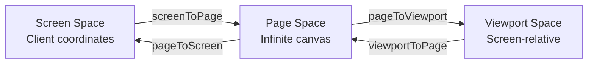
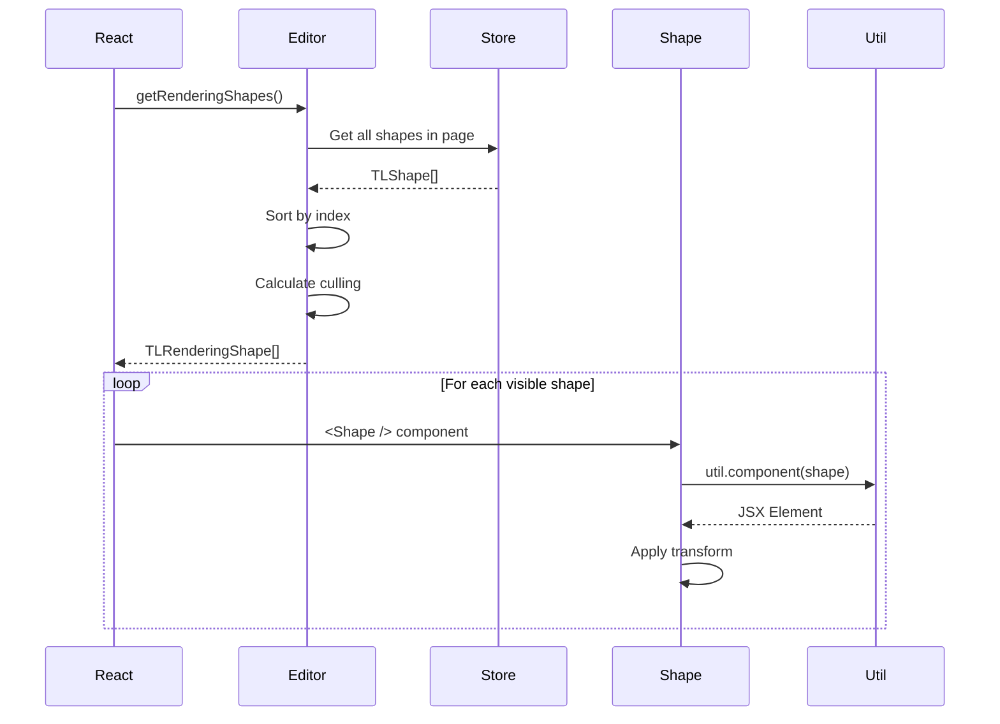
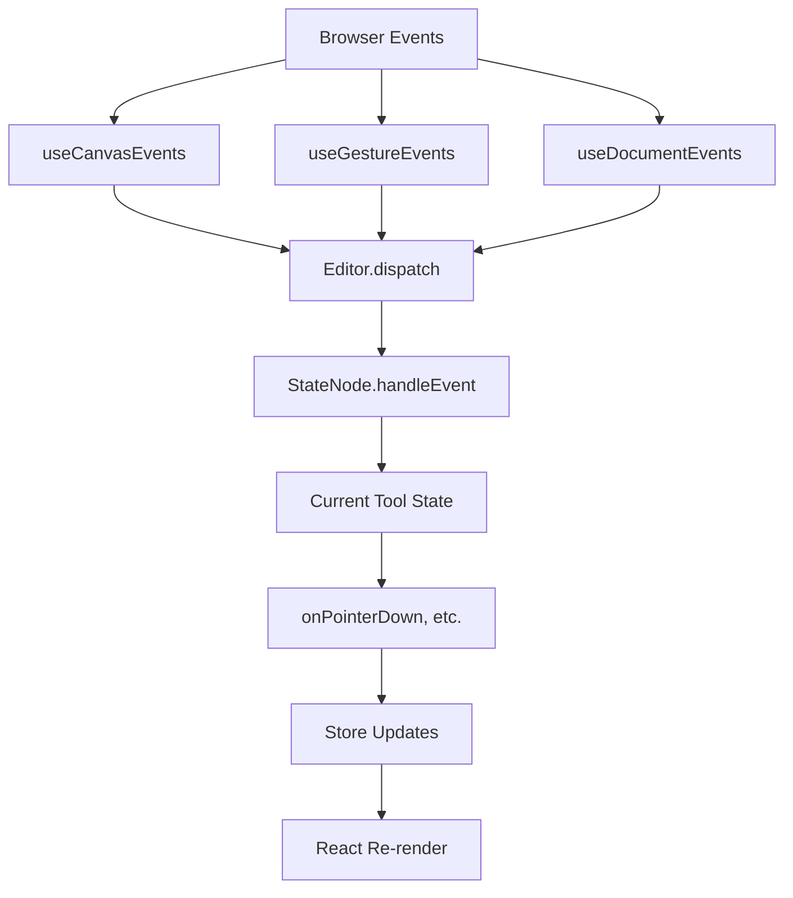
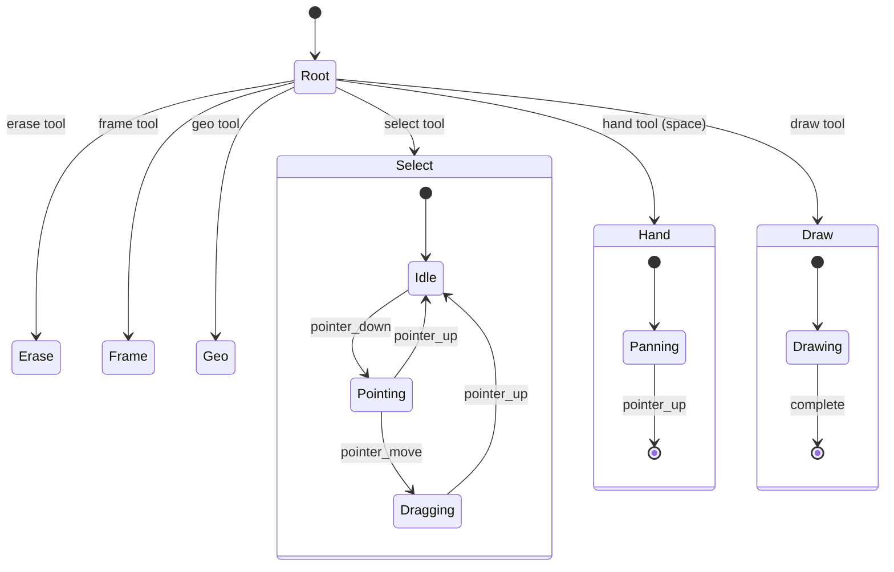
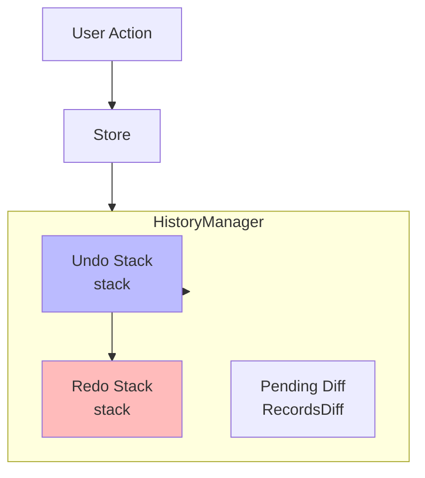

# tldraw Canvas Engine: Complete Deep-Dive

This document provides an exhaustive technical exploration of tldraw's Canvas Engine - the foundational layer that powers infinite canvas interactions, rendering, and tool management. This is the engine behind collaborative whiteboarding, diagramming, and design tools.

## Table of Contents

1. [Canvas Architecture](#1-canvas-architecture)
2. [Coordinate System](#2-coordinate-system)
3. [Rendering Pipeline](#3-rendering-pipeline)
4. [Camera System](#4-camera-system)
5. [Inputs and Events](#5-inputs-and-events)
6. [Tools System](#6-tools-system)
7. [Selection and Transform](#7-selection-and-transform)
8. [Undo/Redo](#8-undoredo)

---

## 1. Canvas Architecture

### 1.1 High-Level Architecture Overview

tldraw's canvas engine is built on a **dual-layer rendering system** combining SVG and HTML layers that move in unison via CSS transforms. This architecture enables:
- Vector-precision rendering for shapes (SVG)
- Interactive HTML elements for text inputs and overlays (HTML)
- performant infinite canvas navigation via CSS transforms

```mermaid
graph TB
    subgraph React["React Component Layer"]
        Tldraw[Tldraw Component]
        DefaultCanvas[DefaultCanvas Component]
    end

    subgraph Editor["@tldraw/editor Engine"]
        EditorClass[Editor Class]
        ShapeUtils[ShapeUtils]
        StateNodes[StateNodes Tools]
        Managers[Managers]
    end

    subgraph Store["@tldraw/store Reactive DB"]
        Atom[Atom]
        Computed[Computed]
        Store[Store]
    end

    subgraph Render["Rendering Layers"]
        SVGLayer[SVG Layer<br/>Vector Shapes]
        HTMLLayer1[HTML Layer 1<br/>Shape Containers]
        HTMLLayer2[HTML Layer 2<br/>Handles, Indicators]
        Overlays[Overlays Layer]
    end

    subgraph Primitives["Geometry Primitives"]
        Vec[Vec - 2D Vector]
        Mat[Mat - 2D Matrix]
        Box[Box - Bounds]
        Geometry2d[Geometry2d]
    end

    Tldraw --> DefaultCanvas
    DefaultCanvas --> EditorClass
    EditorClass --> ShapeUtils & StateNodes & Managers
    EditorClass --> Store
    DefaultCanvas --> Render
    EditorClass --> Primitives
    ShapeUtils --> Primitives
```

### 1.2 Tldraw Component Structure

The main `DefaultCanvas` component (`packages/editor/src/lib/components/default-components/DefaultCanvas.tsx`) orchestrates all rendering:

```typescript
// DefaultCanvas.tsx - Simplified structure
export function DefaultCanvas({ className }: TLCanvasComponentProps) {
  const editor = useEditor()
  const { SelectionBackground, Background, SvgDefs, ShapeIndicators } = useEditorComponents()

  const rCanvas = useRef<HTMLDivElement>(null)
  const rHtmlLayer = useRef<HTMLDivElement>(null)
  const rHtmlLayer2 = useRef<HTMLDivElement>(null)

  // Position layers when camera moves
  useQuickReactor('position layers', function positionLayersWhenCameraMoves() {
    const { x, y, z } = editor.getCamera()
    
    // Offset to align HTML and SVG layers precisely
    const offset = z >= 1
      ? modulate(z, [1, 8], [0.125, 0.5], true)
      : modulate(z, [0.1, 1], [-2, 0.125], true)

    const transform = `scale(${toDomPrecision(z)}) translate(${toDomPrecision(x + offset)}px,${toDomPrecision(y + offset)}px)`

    setStyleProperty(rHtmlLayer.current, 'transform', transform)
    setStyleProperty(rHtmlLayer2.current, 'transform', transform)
  }, [editor, container])

  return (
    <div ref={rCanvas} className="tl-canvas" {...useCanvasEvents()}>
      {/* SVG Context for definitions (cursors, patterns, etc.) */}
      <svg className="tl-svg-context">
        <defs>
          {shapeSvgDefs}
          <CursorDef />
          <CollaboratorHintDef />
          {SvgDefs && <SvgDefs />}
        </defs>
      </svg>

      {/* Background layer (grid, background color) */}
      {Background && <div className="tl-background__wrapper"><Background /></div>}
      <GridWrapper />

      {/* First HTML layer - Shape containers */}
      <div ref={rHtmlLayer} className="tl-html-layer tl-shapes">
        <OnTheCanvasWrapper />
        {SelectionBackground && <SelectionBackgroundWrapper />}
        {hideShapes ? null : debugSvg ? <ShapesWithSVGs /> : <ShapesToDisplay />}
      </div>

      {/* Overlays layer */}
      <div className="tl-overlays">
        <div ref={rHtmlLayer2} className="tl-html-layer">
          {debugGeometry ? <GeometryDebuggingView /> : null}
          <BrushWrapper />
          <ScribbleWrapper />
          <ZoomBrushWrapper />
          {ShapeIndicators && <ShapeIndicators />}
          <HintedShapeIndicator />
          <SnapIndicatorWrapper />
          <SelectionForegroundWrapper />
          <HandlesWrapper />
          <OverlaysWrapper />
          <LiveCollaborators />
        </div>
      </div>

      {/* Hit-test blocker during camera movement */}
      <MovingCameraHitTestBlocker />
    </div>
  )
}
```

### 1.3 Editor Class - The Core Engine

The `Editor` class (`packages/editor/src/lib/editor/Editor.ts`, 7000+ lines) is the central orchestrator:

```typescript
export class Editor extends EventEmitter<TLEventMap> {
  // Core State
  readonly store: TLStore                    // Reactive database
  readonly root: StateNode                   // Root of tool state machine
  readonly inputs: InputsManager             // Input state management
  readonly snaps: SnapManager                // Snapping logic
  readonly history: HistoryManager<TLRecord> // Undo/redo
  readonly shapeUtils: Record<string, ShapeUtil>
  readonly bindingUtils: Record<string, BindingUtil>

  // Camera
  @computed getCamera(): TLCamera { ... }
  setCamera(point: VecLike, opts?: TLCameraMoveOptions): this { ... }
  screenToPage(point: VecLike): Vec { ... }
  pageToScreen(point: VecLike): Vec { ... }

  // Selection
  @computed getSelectedShapeIds(): TLShapeId[] { ... }
  @computed getSelectionRotation(): number { ... }
  @computed getSelectionRotatedPageBounds(): Box | undefined { ... }

  // Shape Operations
  getShape(id: TLShapeId): TLShape | undefined { ... }
  getShapePageTransform(id: TLShapeId): Mat | null { ... }
  getShapePageBounds(id: TLShapeId): Box | null { ... }
  getShapeGeometry(shape: TLShape): Geometry2d { ... }

  // Rendering
  @computed getRenderingShapes(): TLRenderingShape[] { ... }
  @computed getCulledShapes(): Set<TLShapeId> { ... }

  // Event Dispatching
  dispatch(info: TLEventInfo): void { ... }
}
```

### 1.4 Layer System (SVG + HTML)

The canvas uses **two parallel HTML layers** that share the same transform:

```
Canvas Container (.tl-canvas)
├── svg.tl-svg-context          [SVG defs: cursors, patterns]
├── .tl-background__wrapper     [Grid, background color]
├── .tl-html-layer.tl-shapes    [Shape DOM containers]
│   └── Shape components        [Each with own transform]
├── .tl-overlays
│   └── .tl-html-layer          [Handles, indicators, collaborators]
└── .tl-hit-test-blocker        [Blocks input during camera moves]
```

**CSS z-index Layering:**

```css
/* From editor.css */
--tl-layer-canvas-background: 100;      /* Background */
--tl-layer-canvas-grid: 150;            /* Grid */
--tl-layer-canvas-shapes: 300;          /* Shape rendering */
--tl-layer-canvas-overlays: 500;        /* Selection, brushes */
--tl-layer-overlays-user-handles: 105;  /* Handles above selection */
--tl-layer-overlays-collaborator-cursor: 130;
--tl-layer-canvas-blocker: 10000;       /* Camera move blocker */
```

### 1.5 Camera System Architecture

The camera is stored as a `TLCamera` record:

```typescript
interface TLCamera {
  x: number  // Pan offset X
  y: number  // Pan offset Y  
  z: number  // Zoom level (1 = 100%)
}
```

**Camera transformation pipeline:**

```typescript
// DefaultCanvas.tsx - Layer positioning
const { x, y, z } = editor.getCamera()

// Offset for HTML/SVG alignment
const offset = z >= 1 
  ? modulate(z, [1, 8], [0.125, 0.5], true)
  : modulate(z, [0.1, 1], [-2, 0.125], true)

// CSS transform applied to both HTML layers
const transform = `scale(${z}) translate(${x + offset}px, ${y + offset}px)`
```

---

## 2. Coordinate System

### 2.1 Coordinate Spaces

tldraw uses four distinct coordinate spaces:



### 2.2 Coordinate Transformation Functions

**Screen to Page:**
```typescript
// Editor.ts
screenToPage(point: VecLike): Vec {
  const { screenBounds } = this.store.get(TLINSTANCE_ID)!
  const { x: cx, y: cy, z: cz = 1 } = this.getCamera()
  
  return new Vec(
    (point.x - screenBounds.x) / cz - cx,
    (point.y - screenBounds.y) / cz - cy,
    point.z ?? 0.5
  )
}
```

**Page to Screen:**
```typescript
pageToScreen(point: VecLike): Vec {
  const { screenBounds } = this.store.get(TLINSTANCE_ID)!
  const { x: cx, y: cy, z: cz = 1 } = this.getCamera()
  
  return new Vec(
    (point.x + cx) * cz + screenBounds.x,
    (point.y + cy) * cz + screenBounds.y,
    point.z ?? 0.5
  )
}
```

**Page to Viewport:**
```typescript
pageToViewport(point: VecLike): Vec {
  const { x: cx, y: cy, z: cz = 1 } = this.getCamera()
  
  return new Vec(
    (point.x + cx) * cz,
    (point.y + cy) * cz,
    point.z ?? 0.5
  )
}
```

### 2.3 Viewport and Page Bounds

```typescript
// Get viewport bounds in screen space
@computed getViewportScreenBounds(): Box {
  return this.screenBounds
}

// Get viewport bounds in page space
@computed getViewportPageBounds(): Box {
  const { w, h } = this.getViewportScreenBounds()
  const { x: cx, y: cy, z: cz } = this.getCamera()
  return new Box(-cx, -cy, w / cz, h / cz)
}
```

### 2.4 Zoom Level Calculations

```typescript
@computed getZoomLevel(): number {
  return this.getCamera().z
}

@computed getEfficientZoomLevel(): number {
  // For performance: debounce zoom when many shapes exist
  if (this.getCameraState() === 'idle') {
    return this.getZoomLevel()
  }
  const shapeCount = this.getCurrentPageShapes().length
  if (shapeCount > 300) {
    return this._debouncedZoomLevel.get()
  }
  return this.getZoomLevel()
}
```

### 2.5 Panning Implementation

```typescript
// Center camera on a page point
centerOnPoint(point: VecLike, opts?: TLCameraMoveOptions): this {
  const { width: pw, height: ph } = this.getViewportPageBounds()
  this.setCamera(
    new Vec(-(point.x - pw / 2), -(point.y - ph / 2), this.getCamera().z),
    opts
  )
  return this
}

// Set camera with constraints
private _setCamera(point: VecLike, opts?: TLCameraMoveOptions): this {
  const currentCamera = this.getCamera()
  const { x, y, z } = this.getConstrainedCamera(point, opts)

  if (currentCamera.x === x && currentCamera.y === y && currentCamera.z === z) {
    return this
  }

  transact(() => {
    const camera = { ...currentCamera, x, y, z }
    this.store.put([camera])
    
    // Dispatch pointer move since page position changed
    const currentScreenPoint = this.inputs.getCurrentScreenPoint()
    const currentPagePoint = this.inputs.getCurrentPagePoint()
    
    if (
      currentScreenPoint.x / z - x !== currentPagePoint.x ||
      currentScreenPoint.y / z - y !== currentPagePoint.y
    ) {
      this.updatePointer({ immediate: opts?.immediate })
    }
    
    this._tickCameraState()
  })

  return this
}
```

### 2.6 Coordinate Transformation Examples

```typescript
// Example: Click at screen position (500, 300) with camera at (-1000, -800, 1.5)
// screenToPage calculation:
const screenPoint = { x: 500, y: 300 }
const camera = { x: -1000, y: -800, z: 1.5 }
const screenBounds = { x: 0, y: 0 }  // Usually viewport offset

const pageX = (500 - 0) / 1.5 - (-1000) = 333.33 + 1000 = 1333.33
const pageY = (300 - 0) / 1.5 - (-800) = 200 + 800 = 1000

// Page position: (1333.33, 1000)

// Reverse: pageToScreen
const screenX = (1333.33 + (-1000)) * 1.5 + 0 = 500
const screenY = (1000 + (-800)) * 1.5 + 0 = 300
```

---

## 3. Rendering Pipeline

### 3.1 Rendering Shape Order



### 3.2 Shape Rendering Flow

```typescript
// Shape.tsx - Main shape wrapper component
export const Shape = memo(function Shape({
  id, shape, util, index, backgroundIndex, opacity
}) {
  const editor = useEditor()
  const containerRef = useRef<HTMLDivElement>(null)
  const bgContainerRef = useRef<HTMLDivElement>(null)

  // Load fonts for shape
  useEffect(() => {
    return react('load fonts', () => {
      const fonts = editor.fonts.getShapeFontFaces(id)
      editor.fonts.requestFonts(fonts)
    })
  }, [editor, id])

  // Update transform and dimensions
  useQuickReactor('set shape stuff', () => {
    const shape = editor.getShape(id)
    if (!shape) return

    // Clip path
    const clipPath = editor.getShapeClipPath(id) ?? 'none'
    setStyleProperty(containerRef.current, 'clip-path', clipPath)

    // Page transform (positions shape on canvas)
    const pageTransform = editor.getShapePageTransform(id)
    const transform = Mat.toCssString(pageTransform)
    setStyleProperty(containerRef.current, 'transform', transform)

    // Width/Height from geometry
    const bounds = editor.getShapeGeometry(shape).bounds
    setStyleProperty(containerRef.current, 'width', Math.max(bounds.width, 1) + 'px')
    setStyleProperty(containerRef.current, 'height', Math.max(bounds.height, 1) + 'px')
  }, [editor])

  // Culled shapes are hidden
  useQuickReactor('set display', () => {
    const culledShapes = editor.getCulledShapes()
    const isCulled = culledShapes.has(id)
    setStyleProperty(containerRef.current, 'display', isCulled ? 'none' : 'block')
  }, [editor])

  return (
    <>
      {util.backgroundComponent && (
        <ShapeWrapper ref={bgContainerRef}>
          <InnerShapeBackground shape={shape} util={util} />
        </ShapeWrapper>
      )}
      <ShapeWrapper ref={containerRef}>
        <InnerShape shape={shape} util={util} />
      </ShapeWrapper>
    </>
  )
})
```

### 3.3 SVG Rendering

SVG shapes are rendered within the HTML container's transform context:

```typescript
// ShapeUtil base class defines SVG rendering
abstract class ShapeUtil<T extends TLShape> {
  // SVG component returned by shape util
  component(shape: T): JSX.Element
  
  // Optional background component (rendered below other shapes)
  backgroundComponent?: (shape: T) => JSX.Element
  
  // Geometry for hit testing and bounds
  geometry(shape: T): Geometry2d
}

// Example: GeoShapeUtil renders a rectangle
class GeoShapeUtil extends BaseBoxShapeUtil<TLGeoShape> {
  static override type = 'geo' as const

  component(shape) {
    return (
      <svg width={shape.w} height={shape.h}>
        <rect 
          width={shape.w} 
          height={shape.h} 
          fill={shape.props.color}
          stroke={shape.props.stroke}
          strokeWidth={2}
        />
        {shape.props.text && (
          <text x={shape.w/2} y={shape.h/2} textAnchor="middle">
            {shape.props.text}
          </text>
        )}
      </svg>
    )
  }
}
```

### 3.4 HTML Overlays

Interactive overlays (handles, selection indicators) render in the second HTML layer:

```typescript
// Handles render in rHtmlLayer2 with selection transforms
function HandlesWrapperInner({ shapeId }: { shapeId: TLShapeId }) {
  const editor = useEditor()
  const zoomLevel = useValue('zoomLevel', () => editor.getEfficientZoomLevel(), [editor])
  
  const transform = useValue('handles transform', () => 
    editor.getShapePageTransform(shapeId), [editor, shapeId])
  
  const handles = useValue('handles', () => {
    const handles = editor.getShapeHandles(shapeId)
    if (!handles) return null
    return handles.filter(/* filter logic */).sort(/* vertex handles front */)
  }, [editor, zoomLevel, shapeId])

  if (!handles || !transform) return null

  return (
    <Handles>
      <g transform={Mat.toCssString(transform)}>
        {handles.map((handle) => (
          <HandleWrapper
            key={handle.id}
            shapeId={shapeId}
            handle={handle}
            zoom={zoomLevel}
          />
        ))}
      </g>
    </Handles>
  )
}
```

### 3.5 Performance Optimization

**Viewport Culling:**
```typescript
// Editor.ts - Returns shapes outside viewport
@computed getCulledShapes(): Set<TLShapeId> {
  const viewportPageBounds = this.getViewportPageBounds()
  const culledShapes = new Set<TLShapeId>()
  
  for (const shape of this.getCurrentPageShapes()) {
    const bounds = this.getShapePageBounds(shape.id)
    if (!bounds || !viewportPageBounds.intersects(bounds)) {
      culledShapes.add(shape.id)
    }
  }
  
  return culledShapes
}

// Shape.tsx - Hidden via display:none when culled
useQuickReactor('set display', () => {
  const culledShapes = editor.getCulledShapes()
  const isCulled = culledShapes.has(id)
  setStyleProperty(containerRef.current, 'display', isCulled ? 'none' : 'block')
})
```

**Lazy Rendering with Signals:**
```typescript
// InnerShape uses memo to prevent unnecessary re-renders
export const InnerShape = memo(
  function InnerShape<T extends TLShape>({ shape, util }) {
    return useStateTracking(
      'InnerShape:' + shape.type,
      () => util.component(util.editor.store.unsafeGetWithoutCapture(shape.id)),
      [util, shape.id]
    )
  },
  (prev, next) => areShapesContentEqual(prev.shape, next.shape)
)

// Signals automatically track dependencies
const camera = useValue('camera', () => editor.getCamera(), [editor])
```

**Debounced Zoom for Many Shapes:**
```typescript
@computed getEfficientZoomLevel(): number {
  if (this.getCameraState() === 'idle') {
    return this.getZoomLevel()
  }
  
  const shapeCount = this.getCurrentPageShapes().length
  if (shapeCount > 300) {
    // Use debounced zoom during movement to avoid expensive re-renders
    return this._debouncedZoomLevel.get()
  }
  
  return this.getZoomLevel()
}
```

---

## 4. Camera System

### 4.1 Camera State

```typescript
// Camera state machine
type TLCameraState = 'idle' | 'moving'

@computed getCameraState(): TLCameraState {
  // Camera is "moving" if it changed within the last ~200ms
  if (this._cameraStateTimeout !== null) {
    return 'moving'
  }
  return 'idle'
}

private _tickCameraState() {
  if (this._cameraStateTimeout !== null) {
    clearTimeout(this._cameraStateTimeout)
  }
  
  this._cameraStateTimeout = setTimeout(() => {
    this._cameraStateTimeout = null
    this._tickManager.requestTick()
  }, 200) // Camera considered "moving" for 200ms after last change
}
```

### 4.2 Viewport Calculation

```typescript
// Get camera that fits content
private getCameraFitBox(
  bounds: Box,
  targetZoom?: number,
  inset?: number
): { x: number; y: number; z: number } {
  const viewportScreenBounds = this.getViewportScreenBounds()
  const { zoomSteps } = this.getCameraOptions()
  const baseZoom = this.getBaseZoom()
  
  // Calculate zoom to fit
  const zx = (viewportScreenBounds.w - inset * 2) / bounds.w
  const zy = (viewportScreenBounds.h - inset * 2) / bounds.h
  
  let z = targetZoom ?? Math.min(zx, zy)
  
  // Snap to zoom steps if configured
  if (zoomSteps !== null) {
    z = this.getSnapedZoom(z, zoomSteps, baseZoom)
  }
  
  // Center camera on bounds
  const x = -bounds.x - bounds.w / 2 + (viewportScreenBounds.w / z) / 2
  const y = -bounds.y - bounds.h / 2 + (viewportScreenBounds.h / z) / 2
  
  return { x, y, z }
}
```

### 4.3 Zoom Animations

```typescript
setCamera(point: VecLike, opts?: TLCameraMoveOptions): this {
  const camera = this.getConstrainedCamera(point, opts)

  if (opts?.animation) {
    // Animate camera to target
    const { width, height } = this.getViewportScreenBounds()
    this._animateToViewport(
      new Box(-camera.x, -camera.y, width / camera.z, height / camera.z),
      opts
    )
  } else {
    this._setCamera(camera, opts)
  }
  
  return this
}

private _animateToViewport(targetViewport: Box, opts: TLCameraMoveOptions) {
  const startViewport = this.getViewportPageBounds()
  const startTime = Date.now()
  const duration = opts.animation.duration ?? 200
  const easing = opts.animation.easing ?? EASINGS.easeInOutCubic

  const animate = () => {
    const elapsed = Date.now() - startTime
    const t = clamp(elapsed / duration, 0, 1)
    const easedT = easing(t)

    if (t < 1) {
      const x = lerp(startViewport.x, targetViewport.x, easedT)
      const y = lerp(startViewport.y, targetViewport.y, easedT)
      const w = lerp(startViewport.w, targetViewport.w, easedT)
      const h = lerp(startViewport.h, targetViewport.h, easedT)

      this._setCamera(new Vec(-x, -y, this.getViewportScreenBounds().w / w))
      this.timers.requestAnimationFrame(animate)
    } else {
      // Animation complete
      this._setCamera(
        new Vec(-targetViewport.x, -targetViewport.y, 
                this.getViewportScreenBounds().w / targetViewport.w)
      )
    }
  }

  this.timers.requestAnimationFrame(animate)
}
```

### 4.4 Fit to Content

```typescript
zoomToFit(opts?: TLCameraMoveOptions): this {
  const ids = [...this.getCurrentPageShapeIds()]
  if (ids.length <= 0) return this
  
  // Get bounds of all shapes
  const pageBounds = Box.Common(
    compact(ids.map((id) => this.getShapePageBounds(id)))
  )
  
  this.zoomToBounds(pageBounds, opts)
  return this
}

zoomToBounds(
  bounds: BoxLike,
  opts?: { targetZoom?: number; inset?: number } & TLCameraMoveOptions
): this {
  const cameraOptions = this.getCameraOptions()
  if (cameraOptions.isLocked && !opts?.force) return this

  const viewportScreenBounds = this.getViewportScreenBounds()
  const inset = opts?.inset ?? Math.min(
    this.options.zoomToFitPadding, 
    viewportScreenBounds.width * 0.28
  )

  const camera = this.getCameraFitBox(bounds, opts?.targetZoom, inset)
  this.setCamera(camera, opts)
  return this
}
```

### 4.5 Center on Point

```typescript
centerOnPoint(point: VecLike, opts?: TLCameraMoveOptions): this {
  const { isLocked } = this.getCameraOptions()
  if (isLocked && !opts?.force) return this

  const { width: pw, height: ph } = this.getViewportPageBounds()
  
  // Calculate camera position to center the point
  this.setCamera(
    new Vec(-(point.x - pw / 2), -(point.y - ph / 2), this.getCamera().z),
    opts
  )
  
  return this
}
```

---

## 5. Inputs and Events

### 5.1 Event Flow Architecture



### 5.2 Pointer Events

```typescript
// useCanvasEvents.ts
function useCanvasEvents() {
  const editor = useEditor()

  const events = useMemo(() => {
    function onPointerDown(e: React.PointerEvent) {
      if (editor.wasEventAlreadyHandled(e)) return
      
      // Right click
      if (e.button === RIGHT_MOUSE_BUTTON) {
        editor.dispatch({
          type: 'pointer',
          target: 'canvas',
          name: 'right_click',
          ...getPointerInfo(editor, e),
        })
        return
      }

      // Left/middle click
      if (e.button !== 0 && e.button !== 1 && e.button !== 5) return

      setPointerCapture(e.currentTarget, e)

      editor.dispatch({
        type: 'pointer',
        target: 'canvas',
        name: 'pointer_down',
        ...getPointerInfo(editor, e),
      })
    }

    function onPointerUp(e: React.PointerEvent) {
      if (editor.wasEventAlreadyHandled(e)) return
      if (e.button !== 0 && e.button !== 1 && e.button !== 2 && e.button !== 5) return

      releasePointerCapture(e.currentTarget, e)

      editor.dispatch({
        type: 'pointer',
        target: 'canvas',
        name: 'pointer_up',
        ...getPointerInfo(editor, e),
      })
    }

    function onPointerMove(e: PointerEvent) {
      if (editor.wasEventAlreadyHandled(e)) return
      
      // Use coalesced events for high-fidelity input (drawing)
      const events = currentTool.useCoalescedEvents && e.getCoalescedEvents
        ? e.getCoalescedEvents()
        : [e]

      for (const singleEvent of events) {
        editor.dispatch({
          type: 'pointer',
          target: 'canvas',
          name: 'pointer_move',
          ...getPointerInfo(editor, singleEvent),
        })
      }
    }

    return { onPointerDown, onPointerUp, onPointerMove }
  }, [editor])

  // Attach pointer move to document for continuous tracking
  useEffect(() => {
    ownerDocument.body.addEventListener('pointermove', onPointerMove)
    return () => ownerDocument.body.removeEventListener('pointermove', onPointerMove)
  }, [editor])

  return events
}
```

### 5.3 Keyboard Events

```typescript
// StateNode.ts - Keyboard handling in tools
abstract class StateNode {
  onKeyDown(info: TLKeyboardEventInfo): void {
    // Override in subclasses
  }

  onKeyUp(info: TLKeyboardEventInfo): void {
    // Override in subclasses
  }

  onKeyRepeat(info: TLKeyboardEventInfo): void {
    // Override in subclasses
  }
}

// RootState.ts - Example: Z key for zoom tool
class RootState extends StateNode {
  override onKeyDown(info: TLKeyboardEventInfo) {
    switch (info.code) {
      case 'KeyZ': {
        if (!(info.shiftKey || info.ctrlKey)) {
          const currentTool = this.getCurrent()
          if (currentTool?.getCurrent()?.id === 'idle' && this.children!['zoom']) {
            this.editor.setCurrentTool('zoom', { 
              ...info, 
              onInteractionEnd: currentTool.id 
            })
          }
        }
        break
      }
    }
  }
}
```

### 5.4 Touch Events

```typescript
// Touch event handling in useCanvasEvents
function onTouchStart(e: React.TouchEvent) {
  if (editor.wasEventAlreadyHandled(e)) return
  editor.markEventAsHandled(e)
  preventDefault(e)  // Prevent browser scrolling
}

function onTouchEnd(e: React.TouchEvent) {
  if (editor.wasEventAlreadyHandled(e)) return
  editor.markEventAsHandled(e)
  
  // Prevent default unless target is inside editing shape
  const editingShapeId = editor.getEditingShape()?.id
  if (
    !(editingShapeId && e.target.closest(`[data-shape-id="${editingShapeId}"]`)) &&
    e.target.tagName !== 'A' &&
    e.target.tagName !== 'TEXTAREA' &&
    !e.target.isContentEditable
  ) {
    preventDefault(e)
  }
}
```

### 5.5 Gesture Handling (Pinch/Zoom)

```typescript
// useGestureEvents.ts - Pinch gesture state machine
function useGestureEvents(ref: React.RefObject<HTMLDivElement>) {
  const editor = useEditor()

  const events = useMemo(() => {
    let pinchState = 'not sure' as 'not sure' | 'zooming' | 'panning'

    // Wheel handling
    const onWheel = ({ event }) => {
      if (!editor.getInstanceState().isFocused) return
      
      pinchState = 'not sure'
      preventDefault(event)
      
      const delta = normalizeWheel(event)
      editor.dispatch({
        type: 'wheel',
        name: 'wheel',
        delta,
        point: new Vec(event.clientX, event.clientY),
        shiftKey: event.shiftKey,
        altKey: event.altKey,
        ctrlKey: event.metaKey || event.ctrlKey,
      })
    }

    // Pinch handling
    const onPinchStart = (gesture) => {
      pinchState = 'not sure'
      
      editor.dispatch({
        type: 'pinch',
        name: 'pinch_start',
        point: { x: gesture.origin[0], y: gesture.origin[1], z: editor.getZoomLevel() },
        delta: { x: 0, y: 0 },
      })
    }

    const onPinch = (gesture) => {
      const isSafariTrackpadPinch = gesture.type === 'gesturechange'
      
      // Update pinch state based on finger movement
      updatePinchState(isSafariTrackpadPinch)

      switch (pinchState) {
        case 'zooming': {
          const currZoom = gesture.offset[0] ** editor.getCameraOptions().zoomSpeed
          editor.dispatch({
            type: 'pinch',
            name: 'pinch',
            point: { x: gesture.origin[0], y: gesture.origin[1], z: currZoom },
            delta: { x: gesture.da[0], y: gesture.da[1] },
          })
          break
        }
        case 'panning': {
          editor.dispatch({
            type: 'pinch',
            name: 'pinch',
            point: { x: gesture.origin[0], y: gesture.origin[1], z: editor.getZoomLevel() },
            delta: { x: gesture.da[0], y: gesture.da[1] },
          })
          break
        }
      }
    }

    return { onWheel, onPinchStart, onPinch, onPinchEnd }
  }, [editor])

  useGesture(events, { target: ref, pinch: { /* config */ } })
}
```

### 5.6 Event Propagation

```typescript
// Editor.ts - Event dispatch chain
dispatch(info: TLEventInfo) {
  // 1. Check if event should be ignored
  if (this.inputs.shouldIgnoreEvent(info)) return

  // 2. Mark event as handled
  this.markEventAsHandled(info)

  // 3. Send to current tool state
  const currentState = this.root.getPath()
  this.root.handleEvent(info)

  // 4. Emit for external listeners
  this.emit(info.name, info)
}

// StateNode.ts - Hierarchical event handling
handleEvent(info: Exclude<TLEventInfo, TLPinchEventInfo>) {
  const cbName = EVENT_NAME_MAP[info.name]
  const currentActiveChild = this._current.__unsafe__getWithoutCapture()

  // Call handler on current state
  this[cbName]?.(info as any)
  
  // Propagate to child state if still active
  if (
    this._isActive.__unsafe__getWithoutCapture() &&
    currentActiveChild &&
    currentActiveChild === this._current.__unsafe__getWithoutCapture()
  ) {
    currentActiveChild.handleEvent(info)
  }
}
```

---

## 6. Tools System

### 6.1 Tool State Machine Architecture



### 6.2 StateNode Base Class

```typescript
// StateNode.ts - Base class for all tool states
abstract class StateNode implements Partial<TLEventHandlers> {
  static id: string
  static initial?: string
  static children?: () => TLStateNodeConstructor[]
  static isLockable = true
  static useCoalescedEvents = false

  id: string
  type: 'branch' | 'leaf' | 'root'
  parent: StateNode
  children?: Record<string, StateNode>
  
  // State tracking
  private _isActive: Atom<boolean>
  private _current: Atom<StateNode | undefined>
  private _path: Computed<string>

  constructor(public editor: Editor, parent?: StateNode) {
    const { id, children, initial } = this.constructor as TLStateNodeConstructor
    
    this.id = id
    this._isActive = atom('toolIsActive' + this.id, false)
    this._current = atom('toolState' + this.id, undefined)
    
    // Build child states
    if (children && initial) {
      this.type = 'branch'
      this.initial = initial
      this.children = Object.fromEntries(
        children().map((Ctor) => [Ctor.id, new Ctor(this.editor, this)])
      )
      this._current.set(this.children[this.initial])
    } else {
      this.type = 'leaf'
    }
  }

  // Get current active state path
  getPath(): string {
    return this._path.get()
  }

  getCurrent(): StateNode | undefined {
    return this._current.get()
  }

  getIsActive(): boolean {
    return this._isActive.get()
  }

  // Transition to child state
  transition(id: string, info: any = {}) {
    const path = id.split('.')
    let currState = this as StateNode

    for (const segmentId of path) {
      const prevChildState = currState.getCurrent()
      const nextChildState = currState.children?.[segmentId]

      if (!nextChildState) {
        throw Error(`${currState.id} - no child state with id ${segmentId}`)
      }

      if (prevChildState?.id !== nextChildState.id) {
        prevChildState?.exit(info, segmentId)
        currState._current.set(nextChildState)
        nextChildState.enter(info, prevChildState?.id || 'initial')
        if (!nextChildState.getIsActive()) break
      }

      currState = nextChildState
    }

    return this
  }

  // Event handlers (override in subclasses)
  onWheel?(info: TLWheelEventInfo): void
  onPointerDown?(info: TLPointerEventInfo): void
  onPointerMove?(info: TLPointerEventInfo): void
  onPointerUp?(info: TLPointerEventInfo): void
  onKeyDown?(info: TLKeyboardEventInfo): void
  onKeyUp?(info: TLKeyboardEventInfo): void
  onComplete?(info: TLCompleteEventInfo): void
  onCancel?(info: TLCancelEventInfo): void
  
  onEnter?(info: any, from: string): void
  onExit?(info: any, to: string): void
}
```

### 6.3 Tool Transitions

```typescript
// Setting a tool triggers state transitions
setCurrentTool(toolId: string, info: any = {}): this {
  const tool = this.root.children?.[toolId]
  if (!tool) {
    throw Error(`Tool "${toolId}" not found`)
  }

  // Exit current tool
  this.root.getCurrent()?.exit(info, toolId)
  
  // Enter new tool
  this.root._current.set(tool)
  tool.enter(info, this.root.getCurrent()?.id || 'initial')
  
  this.emit('change-current-tool', { toolId })
  return this
}

// Example: Select tool pointing state
class SelectTool extends StateNode {
  static override id = 'select'
  static override initial = 'idle'
  static override children = () => [Idle, Pointing, Dragging, Crop, Rotating]

  override onPointerDown = (info: TLPointerEventInfo) => {
    const shape = this.editor.getShapeAtPoint(info.point)
    
    if (shape) {
      // Shape clicked - transition to pointing
      this.transition('pointing', info)
    } else {
      // Canvas clicked - transition to brush
      this.transition('brushing', info)
    }
  }
}

class Pointing extends StateNode {
  static override id = 'pointing'

  override onEnter = (info: TLPointerEventInfo) => {
    // Store initial selection
    this.initialSelection = [...this.editor.getSelectedShapeIds()]
  }

  override onPointerUp = () => {
    // Complete selection
    this.parent.transition('idle')
  }

  override onPointerMove = (info: TLPointerEventInfo) => {
    if (Vec.Dist(info.point, this.info.point) > 3) {
      // Drag started
      this.parent.transition('dragging', info)
    }
  }
}
```

### 6.4 Default Tools

**Select Tool:**
```typescript
class SelectTool extends StateNode {
  static override id = 'select'
  static override initial = 'idle'
  static override children = () => [
    Idle, Pointing, DraggingHandle, Cropping, 
    Rotating, Resizing, Translating
  ]
}

class Idle extends StateNode {
  static override id = 'idle'

  override onPointerDown = (info: TLPointerEventInfo) => {
    const { hoveredShapeId } = this.editor.getInstanceState()
    
    if (hoveredShapeId) {
      // Clicking on shape
      this.parent.transition('pointing', info)
    } else {
      // Clicking on canvas - start selection brush
      this.parent.transition('brushing', info)
    }
  }
}
```

**Hand Tool (Pan):**
```typescript
class HandTool extends StateNode {
  static override id = 'hand'
  
  override onPointerDown = (info: TLPointerEventInfo) => {
    this._initialCamera = this.editor.getCamera()
    this._initialPoint = info.point
    this.parent.transition('panning', info)
  }
}

class Panning extends StateNode {
  static override id = 'panning'

  override onPointerMove = (info: TLPointerEventInfo) => {
    const delta = Vec.Sub(info.point, this._initialPoint)
    const camera = this._initialCamera
    
    this.editor.setCamera(
      new Vec(camera.x - delta.x, camera.y - delta.y, camera.z)
    )
  }

  override onPointerUp = () => {
    this.parent.transition('idle')
  }
}
```

**Draw Tool:**
```typescript
class DrawTool extends StateNode {
  static override id = 'draw'
  static override useCoalescedEvents = true  // High-fidelity input
  
  override onPointerDown = (info: TLPointerEventInfo) => {
    this._shapeId = createShapeId()
    
    this.editor.createShapes([{
      id: this._shapeId,
      type: 'draw',
      x: info.point.x,
      y: info.point.y,
      props: {
        segments: [],
        isComplete: false,
      },
    }])
    
    this.parent.transition('drawing', info)
  }
}

class Drawing extends StateNode {
  override onPointerMove = (info: TLPointerEventInfo) => {
    const points = this.editor.getCoalescedPointerPoints()
    
    this.editor.updateShapes([{
      id: this._shapeId,
      type: 'draw',
      props: {
        segments: [{
          type: 'free',
          points: points.map((p) => ({
            x: p.x,
            y: p.y,
            z: p.pressure ?? 0.5,
          })),
        }],
      },
    }])
  }

  override onPointerUp = () => {
    this.editor.completeShape(this._shapeId)
    this.parent.transition('idle')
  }
}
```

---

## 7. Selection and Transform

### 7.1 Selection State

```typescript
// Selection is stored in TLInstancePageState
interface TLInstancePageState {
  selectedShapeIds: TLShapeId[]
  hoveredShapeId: TLShapeId | null
  editingShapeId: TLShapeId | null
  hintingShapeIds: TLShapeId[]
  erasingShapeIds: TLShapeId[]
  focusedGroupId: TLShapeId | null
}

// Editor selection methods
@computed getSelectedShapeIds(): TLShapeId[] {
  return this.getCurrentPageState().selectedShapeIds
}

@computed getSelectedShapes(): TLShape[] {
  return compact(this.getSelectedShapeIds().map((id) => this.getShape(id)))
}

@computed getOnlySelectedShape(): TLShape | undefined {
  const ids = this.getSelectedShapeIds()
  return ids.length === 1 ? this.getShape(ids[0]) : undefined
}

select(...ids: (TLShapeId | TLShape | null)[]): this {
  const shapeIds = compact(ids).map((id) => 
    typeof id === 'string' ? id : id.id
  )
  
  return this.run(
    () => {
      this.store.update(this.getCurrentPageState().id, (s) => ({
        ...s,
        selectedShapeIds: shapeIds,
      }))
    },
    { history: 'record-preserveRedoStack' }
  )
}

selectNone(): this {
  return this.select()
}
```

### 7.2 Selection Bounds

```typescript
// Get unrotated bounds of selection
@computed getSelectionPageBounds(): Box | undefined {
  const ids = this.getSelectedShapeIds()
  if (ids.length === 0) return undefined
  
  const boundsArray = compact(ids.map((id) => this.getShapePageBounds(id)))
  if (boundsArray.length === 0) return undefined
  
  return Box.Common(boundsArray)
}

// Get rotated bounds (accounts for shape rotation)
@computed getSelectionRotatedPageBounds(): Box | undefined {
  return this.getShapesRotatedPageBounds(this.getSelectedShapeIds())
}

@computed getShapesRotatedPageBounds(shapeIds: TLShapeId[]): Box | undefined {
  if (shapeIds.length === 0) return undefined

  const selectionRotation = this.getShapesSharedRotation(shapeIds)
  
  if (selectionRotation === 0) {
    return this.getShapesPageBounds(shapeIds) ?? undefined
  }

  if (shapeIds.length === 1) {
    const bounds = this.getShapeGeometry(shapeIds[0]).bounds.clone()
    const pageTransform = this.getShapePageTransform(shapeIds[0])!
    bounds.point = pageTransform.applyToPoint(bounds.point)
    return bounds
  }

  // For multiple rotated shapes: rotate all corners back, find bounds, rotate forward
  const boxFromRotatedVertices = Box.FromPoints(
    shapeIds
      .flatMap((id) => {
        const pageTransform = this.getShapePageTransform(id)
        if (!pageTransform) return []
        return pageTransform.applyToPoints(
          this.getShapeGeometry(id).bounds.corners
        )
      })
      .map((p) => p.rot(-selectionRotation))
  )
  
  boxFromRotatedVertices.point = boxFromRotatedVertices.point.rot(selectionRotation)
  return boxFromRotatedVertices
}
```

### 7.3 Rotation

```typescript
// Get shared rotation of selected shapes
@computed getSelectionRotation(): number {
  return this.getShapesSharedRotation(this.getSelectedShapeIds())
}

getShapesSharedRotation(shapeIds: TLShapeId[]): number {
  let foundFirst = false
  let rotation = 0
  
  for (const id of shapeIds) {
    const pageTransform = this.getShapePageTransform(id)
    if (!pageTransform) continue
    
    if (foundFirst) {
      if (pageTransform.rotation() !== rotation) {
        return 0  // Different rotations, common rotation is 0
      }
    } else {
      foundFirst = true
      rotation = pageTransform.rotation()
    }
  }

  return rotation
}

// Rotate selection
rotateSelection(rotation: number, opts?: { initialRotation?: number }) {
  const selectedShapes = this.getSelectedShapes()
  if (selectedShapes.length === 0) return this

  const initialRotation = opts?.initialRotation ?? this.getSelectionRotation()
  const rotationDelta = rotation - initialRotation

  // Get selection center for rotation pivot
  const selectionBounds = this.getSelectionRotatedPageBounds()
  if (!selectionBounds) return this

  const center = selectionBounds.center

  return this.updateShapes(
    selectedShapes.map((shape) => {
      const util = this.getShapeUtil(shape)
      const pageTransform = this.getShapePageTransform(shape)!
      
      // Calculate new position after rotation
      const shapeCenter = pageTransform.applyToPoint(shape)
      const rotatedCenter = shapeCenter.rotWith(center, rotationDelta)
      const delta = Vec.Sub(rotatedCenter, shapeCenter)

      return {
        id: shape.id,
        x: shape.x + delta.x,
        y: shape.y + delta.y,
        rotation: (shape.rotation ?? 0) + rotationDelta,
      }
    })
  )
}
```

### 7.4 Scale Handles

Handle types defined in `Box.ts`:

```typescript
export type SelectionHandle = SelectionEdge | SelectionCorner
export type SelectionEdge = 'top' | 'right' | 'bottom' | 'left'
export type SelectionCorner = 'top_left' | 'top_right' | 'bottom_right' | 'bottom_left'
export type RotateCorner = 
  | 'top_left_rotate' | 'top_right_rotate' 
  | 'bottom_right_rotate' | 'bottom_left_rotate'
  | 'mobile_rotate'
```

**Handle positions:**

```typescript
// Get handles for selected shape
getShapeHandles(shape: TLShape): TLHandle[] | null {
  const util = this.getShapeUtil(shape)
  return util.getHandles?.(shape) ?? null
}

// Example: Box shape handles
class BaseBoxShapeUtil<T extends TLShape> extends ShapeUtil<T> {
  getHandles(shape: T): TLHandle[] {
    const { w, h } = shape

    return [
      // Resize handles at corners
      { id: 'top_left', type: 'vertex', x: 0, y: 0 },
      { id: 'top_right', type: 'vertex', x: w, y: 0 },
      { id: 'bottom_right', type: 'vertex', x: w, y: h },
      { id: 'bottom_left', type: 'vertex', x: 0, y: h },
      // Rotation handle above top edge
      { id: 'rotate', type: 'vertex', x: w / 2, y: -40 },
    ]
  }
}
```

### 7.5 Transform Operations

**Resize:**
```typescript
resizeSelection(
  scaleFactor: number,
  {
    initialShape,
    initialPageTransform,
    dragHandle,
    isAspectRatioLocked,
    mode,
  }: TLResizeShapeOptions
) {
  const selectedShapes = this.getSelectedShapes()
  if (selectedShapes.length === 0) return this

  const selectionBounds = initialShape 
    ? this.getShapePageBounds(initialShape.id)!
    : this.getSelectionPageBounds()!

  const selectionRotation = this.getSelectionRotation()

  return this.updateShapes(
    selectedShapes.map((shape) => {
      const util = this.getShapeUtil(shape)
      
      return util.onResize?.(
        shape,
        {
          bounds: selectionBounds,
          scaleFactor,
          initialPageTransform,
          dragHandle,
          isAspectRatioLocked,
          mode,
        },
        { resize: true }
      ) || shape
    })
  )
}
```

**Translate:**
```typescript
translateSelection(
  delta: VecLike,
  opts?: { initialShape?: TLShape; ignoreParent?: boolean }
) {
  const selectedShapes = this.getSelectedShapes()
  if (selectedShapes.length === 0) return this

  return this.updateShapes(
    selectedShapes.map((shape) => {
      // Account for parent transform if not ignoring
      let moveDelta = delta
      
      if (!opts?.ignoreParent) {
        const parentTransform = this.getShapeParentTransform(shape)
        if (parentTransform) {
          const inverted = parentTransform.clone().invert()
          moveDelta = inverted.applyToPoint(delta).sub(delta)
        }
      }

      return {
        id: shape.id,
        x: shape.x + moveDelta.x,
        y: shape.y + moveDelta.y,
      }
    })
  )
}
```

---

## 8. Undo/Redo

### 8.1 History Stack Architecture



### 8.2 HistoryManager Implementation

```typescript
// HistoryManager.ts
enum HistoryRecorderState {
  Recording = 'recording',
  RecordingPreserveRedoStack = 'recordingPreserveRedoStack',
  Paused = 'paused',
}

export class HistoryManager<R extends UnknownRecord> {
  private readonly store: Store<R>
  private state: HistoryRecorderState = HistoryRecorderState.Recording
  
  private stacks = atom('HistoryManager.stacks', {
    undos: stack<TLHistoryEntry<R>>(),
    redos: stack<TLHistoryEntry<R>>(),
  })

  private pendingDiff = new PendingDiff<R>()

  constructor(opts: { store: Store<R>; annotateError?(error: unknown): void }) {
    this.store = opts.store
    
    // Interceptor that captures all store changes
    this.disposables.add(
      this.store.addHistoryInterceptor((entry, source) => {
        if (source !== 'user') return  // Only track user-initiated changes

        switch (this.state) {
          case HistoryRecorderState.Recording:
            this.pendingDiff.apply(entry.changes)
            this.stacks.update(({ undos, redos }) => ({ undos, redos: stack() }))
            break
          case HistoryRecorderState.RecordingPreserveRedoStack:
            this.pendingDiff.apply(entry.changes)
            // Redo stack preserved
            break
          case HistoryRecorderState.Paused:
            // No tracking
            break
        }
      })
    )
  }

  private flushPendingDiff() {
    if (this.pendingDiff.isEmpty()) return

    const diff = this.pendingDiff.clear()
    this.stacks.update(({ undos, redos }) => ({
      undos: undos.push({ type: 'diff', diff }),
      redos,
    }))
  }

  undo() {
    this._undo({ pushToRedoStack: true })
    return this
  }

  redo() {
    this.flushPendingDiff()

    let { undos, redos } = this.stacks.get()
    if (redos.length === 0) return this

    const diffToRedo = createEmptyRecordsDiff<R>()

    while (redos.head) {
      const redo = redos.head
      undos = undos.push(redo)
      redos = redos.tail

      if (redo.type === 'diff') {
        squashRecordDiffsMutable(diffToRedo, [redo.diff])
      } else {
        break
      }
    }

    this.store.applyDiff(diffToRedo, { ignoreEphemeralKeys: true })
    this.stacks.set({ undos, redos })
    return this
  }

  private _undo({ pushToRedoStack, toMark }: { pushToRedoStack: boolean; toMark?: string }) {
    const previousState = this.state
    this.state = HistoryRecorderState.Paused
    
    try {
      let { undos, redos } = this.stacks.get()
      
      // Collect pending diff
      const pendingDiff = this.pendingDiff.clear()
      const diffToUndo = reverseRecordsDiff(pendingDiff)

      if (pushToRedoStack && !isRecordsDiffEmpty(pendingDiff)) {
        redos = redos.push({ type: 'diff', diff: pendingDiff })
      }

      // Accumulate diffs to undo
      loop: while (undos.head) {
        const undo = undos.head
        undos = undos.tail

        if (pushToRedoStack) {
          redos = redos.push(undo)
        }

        switch (undo.type) {
          case 'diff':
            squashRecordDiffsMutable(diffToUndo, [reverseRecordsDiff(undo.diff)])
            break
          case 'stop':
            if (!toMark) break loop
            if (undo.id === toMark) break loop
            break
        }
      }

      this.store.applyDiff(diffToUndo, { ignoreEphemeralKeys: true })
      this.stacks.set({ undos, redos })
    } finally {
      this.state = previousState
    }

    return this
  }

  // Mark a point in history (e.g., "create-shape")
  _mark(id: string) {
    transact(() => {
      this.flushPendingDiff()
      this.stacks.update(({ undos, redos }) => ({ 
        undos: undos.push({ type: 'stop', id }), 
        redos 
      }))
    })
  }

  bail() {
    // Undo without pushing to redo stack
    this._undo({ pushToRedoStack: false })
    return this
  }

  clear() {
    this.stacks.set({ undos: stack(), redos: stack() })
    this.pendingDiff.clear()
  }
}
```

### 8.3 Command Pattern

```typescript
// Editor.ts - Transaction batching
run(fn: () => void, opts?: { history?: 'record' | 'record-preserveRedoStack' | 'ignore' }) {
  this.history.batch(() => {
    fn()
  }, { history: opts?.history })
}

// Batch multiple operations into single undo step
batch(fn: () => void, opts?: TLHistoryBatchOptions) {
  return this.history.batch(fn, opts)
}

// Example: Creating a shape with undo support
createShapes<T extends TLShape>(partials: Partial<T>[]) {
  return this.run(
    () => {
      const shapes = partials.map((partial) => {
        const util = this.getShapeUtil(partial.type)
        const shape = util.create(partial as any)
        return shape as T
      })
      
      this.store.put(shapes)
    },
    { history: 'record' }  // This creates an undo mark
  )
}

// Example: Transaction with custom mark
deleteShapes(ids: TLShapeId[]) {
  return this.run(
    () => {
      // Delete shapes and associated bindings
      const shapesToKeep = new Set(this.getShapeAndDescendantIds([...ids]))
      const bindingsToDelete = this.getBindingsInvolvingShapes([...ids])
      
      this.store.remove([...ids])
      this.store.remove(bindingsToDelete.map((b) => b.id))
    },
    { history: 'record' }
  )
}
```

### 8.4 Transaction Grouping

```typescript
// History batch options
interface TLHistoryBatchOptions {
  history?: 'record' | 'record-preserveRedoStack' | 'ignore'
  stopOnComplete?: boolean  // Add mark when complete
  squashing?: boolean       // Squash with previous entry
}

// Example: Squashing multiple changes
editor.batch(() => {
  editor.updateShapes(shapeUpdates1)
  editor.updateShapes(shapeUpdates2)
  editor.updateShapes(shapeUpdates3)
}, { history: 'record', squashing: true })
// All three updates become single undo entry

// Example: Preserve redo stack (for tool preview changes)
editor.batch(() => {
  editor.updateShapes(previewUpdates)
}, { history: 'record-preserveRedoStack' })
// Redo stack not cleared - used for selection preview
```

### 8.5 History Limits

```typescript
// Undo stack is implemented as immutable linked list
export type Stack<T> = StackItem<T> | EmptyStackItem<T>

class StackItem<T> {
  constructor(
    public readonly head: T,
    public readonly tail: Stack<T>
  ) {
    this.length = tail.length + 1
  }
  
  push(head: T): Stack<T> {
    return new StackItem(head, this)
  }
}

// No explicit limit - stack grows until memory pressure
// Stack items are immutable and can be garbage collected when popped

// Clear history (e.g., when loading new document)
clearHistory() {
  this.history.clear()
  return this
}

// Get undo/redo counts
getNumUndos(): number {
  return this.history.getNumUndos()
}

getNumRedos(): number {
  return this.history.getNumRedos()
}
```

---

## Appendix A: Geometry Primitives

### Vec - 2D Vector

```typescript
class Vec {
  constructor(public x = 0, public y = 0, public z = 1) {}

  // Vector operations
  add(V: VecLike): Vec { this.x += V.x; this.y += V.y; return this }
  sub(V: VecLike): Vec { this.x -= V.x; this.y -= V.y; return this }
  mul(t: number): Vec { this.x *= t; this.y *= t; return this }
  div(t: number): Vec { this.x /= t; this.y /= t; return this }
  
  // Length and distance
  len(): number { return Vec.Len(this) }
  dist(V: VecLike): number { return Vec.Dist(this, V) }
  
  // Rotation
  rot(r: number): Vec { /* rotate around origin */ }
  rotWith(C: VecLike, r: number): Vec { /* rotate around point C */ }
  
  // Static helpers
  static Dist(A: VecLike, B: VecLike): number {
    return ((A.y - B.y) ** 2 + (A.x - B.x) ** 2) ** 0.5
  }
  
  static Lrp(A: VecLike, B: VecLike, t: number): Vec {
    return Vec.Sub(B, A).mul(t).add(A)
  }
  
  static Angle(A: VecLike, B: VecLike): number {
    return Math.atan2(B.y - A.y, B.x - A.x)
  }
}
```

### Mat - 2D Transformation Matrix

```typescript
class Mat {
  a = 1.0, b = 0.0, c = 0.0, d = 1.0, e = 0.0, f = 0.0

  // [a c e]
  // [b d f]
  // [0 0 1]

  multiply(m: Mat | MatModel) {
    const { a, b, c, d, e, f } = this
    this.a = a * m.a + c * m.b
    this.c = a * m.c + c * m.d
    this.e = a * m.e + c * m.f + e
    this.b = b * m.a + d * m.b
    this.d = b * m.c + d * m.d
    this.f = b * m.e + d * m.f + f
    return this
  }

  applyToPoint(point: VecLike): Vec {
    return new Vec(
      this.a * point.x + this.c * point.y + this.e,
      this.b * point.x + this.d * point.y + this.f
    )
  }

  // CSS output for transforms
  toCssString(): string {
    return `matrix(${this.a}, ${this.b}, ${this.c}, ${this.d}, ${this.e}, ${this.f})`
  }

  // Compose transformations
  static Compose(...matrices: MatLike[]): Mat {
    const matrix = Mat.Identity()
    for (const m of matrices) matrix.multiply(m)
    return matrix
  }

  static Translate(x: number, y: number): Mat {
    return new Mat(1.0, 0.0, 0.0, 1.0, x, y)
  }

  static Rotate(r: number): Mat {
    const cosAngle = Math.cos(r)
    const sinAngle = Math.sin(r)
    return new Mat(cosAngle, sinAngle, -sinAngle, cosAngle, 0.0, 0.0)
  }

  static Scale(x: number, y: number): Mat {
    return new Mat(x, 0, 0, y, 0, 0)
  }
}
```

### Box - Axis-Aligned Bounding Box

```typescript
class Box {
  constructor(public x = 0, public y = 0, public w = 0, public h = 0) {}

  // Getters
  get minX() { return this.x }
  get maxX() { return this.x + this.w }
  get minY() { return this.y }
  get maxY() { return this.y + this.h }
  get center() { return new Vec(this.x + this.w / 2, this.y + this.h / 2) }
  get corners() {
    return [
      new Vec(this.x, this.y),
      new Vec(this.x + this.w, this.y),
      new Vec(this.x + this.w, this.y + this.h),
      new Vec(this.x, this.y + this.h),
    ]
  }

  // Operations
  expandBy(n: number): Box {
    this.x -= n; this.y -= n
    this.w += n * 2; this.h += n * 2
    return this
  }

  translate(delta: VecLike): Box {
    this.x += delta.x; this.y += delta.y
    return this
  }

  containsPoint(point: VecLike): boolean {
    return (
      point.x >= this.minX && point.x <= this.maxX &&
      point.y >= this.minY && point.y <= this.maxY
    )
  }

  intersects(other: Box): boolean {
    return (
      this.maxX >= other.minX && this.minX <= other.maxX &&
      this.maxY >= other.minY && this.minY <= other.maxY
    )
  }

  static Common(boxes: Box[]): Box {
    // Find common bounding box of multiple boxes
    return boxes.reduce((acc, box) => acc.expand(box))
  }

  static FromPoints(points: VecLike[]): Box {
    // Find bounding box from points
    let minX = Infinity, minY = Infinity, maxX = -Infinity, maxY = -Infinity
    for (const p of points) {
      minX = Math.min(minX, p.x)
      minY = Math.min(minY, p.y)
      maxX = Math.max(maxX, p.x)
      maxY = Math.max(maxY, p.y)
    }
    return new Box(minX, minY, maxX - minX, maxY - minY)
  }
}
```

---

## Appendix B: Signals-Based Reactivity

tldraw uses a custom signals library (`@tldraw/state`) for fine-grained reactivity:

```typescript
// Atom - mutable reactive primitive
const zoomLevel = atom('zoom', 1)
zoomLevel.set(1.5)  // Triggers reactivity

// Computed - derived reactive value
const efficientZoom = computed('efficientZoom', () => {
  const shapeCount = editor.getCurrentPageShapes().length
  if (shapeCount > 300) {
    return debouncedZoom.get()
  }
  return zoomLevel.get()
})

// React integration
const camera = useValue('camera', () => editor.getCamera(), [editor])
// Component re-renders only when camera changes

// Quick reactor for non-React side effects
useQuickReactor('position layers', () => {
  const { x, y, z } = editor.getCamera()
  setStyleProperty(layerRef.current, 'transform', `scale(${z}) translate(${x}px, ${y}px)`)
}, [editor])
```

---

## Summary

tldraw's Canvas Engine is a sophisticated infinite canvas implementation built on:

1. **Dual-Layer Rendering**: SVG for vector shapes, HTML for interactive elements, unified by CSS transforms
2. **Matrix-Based Transforms**: All positioning uses 2D affine matrices for efficient composition
3. **Signals Reactivity**: Fine-grained automatic dependency tracking avoids unnecessary re-renders
4. **Hierarchical State Machines**: Tools are composable state machines with clean transitions
5. **Viewport Culling**: Shapes outside viewport are hidden for performance
6. **Command Pattern Undo/Redo**: Transaction-based history with mark grouping

This architecture enables smooth 60fps rendering even with thousands of shapes, collaborative multi-user editing, and a rich tool ecosystem.
