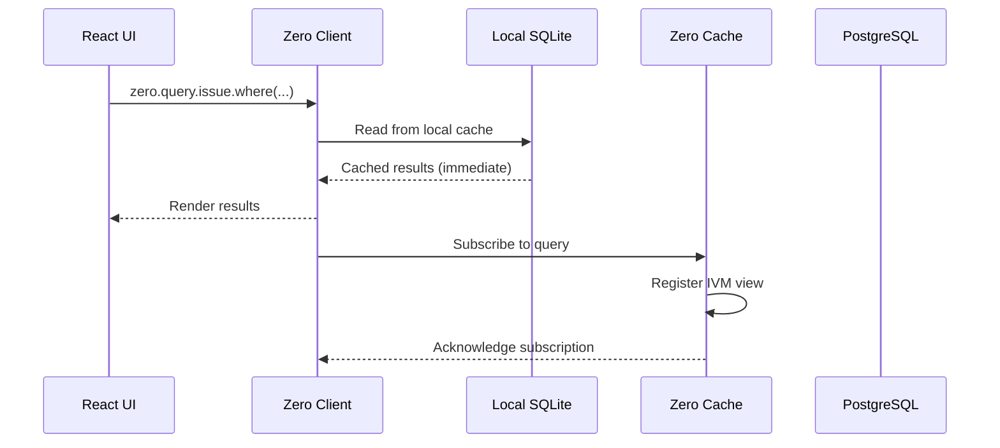
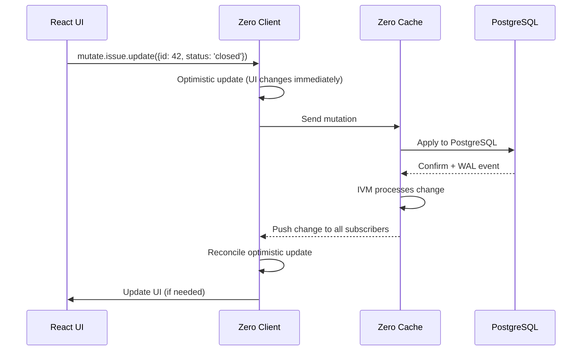
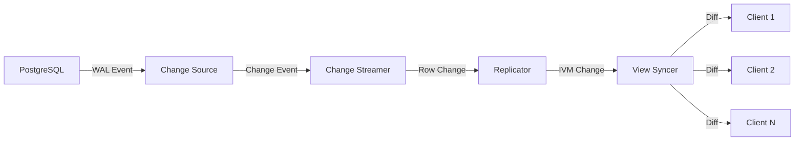

# Zero to Sync Engineer: First-Principles Guide

## Table of Contents

1. [What is Realtime Synchronization?](#1-what-is-realtime-synchronization)
2. [Client-Server Architecture](#2-client-server-architecture)
3. [Offline-First Design](#3-offline-first-design)
4. [IVM Fundamentals](#4-ivm-fundamentals)
5. [Change Propagation](#5-change-propagation)
6. [Zero's Architecture](#6-zeros-architecture)
7. [Valtron Executor Preview](#7-valtron-executor-preview)
8. [Your Learning Path](#8-your-learning-path)

---

## 1. What is Realtime Synchronization?

### 1.1 The Fundamental Problem

**What problem does sync solve?**

Multiple clients need to see the same data, and changes made by one client must appear on all others—quickly and reliably.

```
┌──────────┐         ┌──────────┐
│  Alice   │         │   Bob    │
│  (Web)   │         │ (Mobile) │
└────┬─────┘         └────┬─────┘
     │                    │
     │   "Issue #42       │
     │    status: open"   │
     │                    │
     ▼                    ▼
┌─────────────────────────────────┐
│         Server                  │
│     (Source of Truth)           │
└─────────────────────────────────┘
```

**Without sync:**
- Alice changes issue status to "closed"
- Bob still sees "open"
- Data inconsistency causes confusion

**With sync:**
- Alice changes status to "closed"
- Server broadcasts change
- Bob's UI updates automatically (< 100ms)

### 1.2 Sync Patterns

#### Polling (Bad)

```typescript
// Client checks for updates every 5 seconds
setInterval(async () => {
  const issues = await fetch('/api/issues');
  render(issues);
}, 5000);
```

**Problems:**
- Wasteful (most polls return no changes)
- High latency (up to 5 seconds behind)
- Server load scales with client count × poll frequency

#### Webhooks/Callbacks (Better)

```typescript
// Client subscribes to updates
socket.on('issue-updated', (issue) => {
  updateIssue(issue);
});
```

**Better but still has issues:**
- Must implement from scratch
- No offline support
- No conflict resolution

#### Zero's Approach (Best)

Zero provides:
1. **Automatic subscription** - Queries are automatically tracked
2. **Incremental updates** - Only changes sent, not full data
3. **Offline support** - Local cache works without network
4. **Conflict resolution** - Automatic merge of concurrent changes

### 1.3 Real-World Analogies

| Sync Concept | Real-World Analogy |
|--------------|-------------------|
| Client | Employee at a branch office |
| Server | Headquarters (source of truth) |
| Query | Report request ("show me open issues") |
| Subscription | Standing order ("send me updates") |
| Mutation | Change request ("update issue #42") |
| Offline cache | Local filing cabinet |
| Reconnection | Calling HQ after internet outage |

### 1.4 Sync Challenges

| Challenge | Description | Solution |
|-----------|-------------|----------|
| **Latency** | Network delays | Optimistic UI, local cache |
| **Offline** | No network connection | Local storage, queue mutations |
| **Conflicts** | Two clients change same data | Version vectors, last-write-wins |
| **Scale** | Many clients, many changes | IVM, batching, filtering |
| **Consistency** | Clients see different data | Ordered change streams |

---

## 2. Client-Server Architecture

### 2.1 Basic Architecture

```
┌─────────────────────────────────────────────────────────────┐
│                      Zero Architecture                       │
├─────────────────────────────────────────────────────────────┤
│                                                              │
│  ┌──────────────┐         ┌──────────────┐                 │
│  │   Client 1   │         │   Client 2   │                 │
│  │  (Browser)   │         │  (Mobile)    │                 │
│  │              │         │              │                 │
│  │  Local Cache │         │  Local Cache │                 │
│  │   (SQLite)   │         │   (SQLite)   │                 │
│  └──────┬───────┘         └──────┬───────┘                 │
│         │                        │                          │
│         └──────────┬─────────────┘                          │
│                    │                                        │
│                    ▼                                        │
│         ┌──────────────────┐                               │
│         │   Zero Cache     │                               │
│         │    (Server)      │                               │
│         │                  │                               │
│         │  IVM Engine      │                               │
│         │  View Syncer     │                               │
│         │  Mutagen         │                               │
│         └────────┬─────────┘                               │
│                  │                                          │
│                  ▼                                          │
│         ┌──────────────────┐                               │
│         │   PostgreSQL     │                               │
│         │  (Source Truth)  │                               │
│         └──────────────────┘                               │
│                                                             │
└─────────────────────────────────────────────────────────────┘
```

### 2.2 Data Flow

#### Read Path (Query)



#### Write Path (Mutation)



### 2.3 Connection States

Zero clients track connection status:

```typescript
enum ConnectionStatus {
  Connecting = 'connecting',    // Initial state, establishing connection
  Connected = 'connected',      // Fully synced, receiving updates
  Disconnected = 'disconnected', // Network error, will retry
  Reconnecting = 'reconnecting', // Attempting to reconnect
}

zero.connectionStatus.subscribe(status => {
  console.log('Connection:', status);
});
```

**State transitions:**

```
                 ┌──────────────┐
                 │              │
                 ▼              │
    ┌─────────┐     ┌─────────┐     ┌─────────────┐
    │         │────>│         │────>│             │
    │Connect- │     │Connect- │     │ Disconnected│
    │   ing   │     │   ed    │     │             │
    │         │<────│         │<────│             │
    └─────────┘     └─────────┘     └─────────────┘
         ▲                │                │
         │                │                │
         └────────────────┴────────────────┘
                  Retry logic
```

---

## 3. Offline-First Design

### 3.1 Why Offline-First?

**Reality of modern apps:**
- Mobile networks are unreliable
- Users expect apps to work everywhere
- Switching between WiFi/cellular causes blips
- Airplane mode, tunnels, elevators

**Offline-first means:**
- App works 100% without network
- Changes queue for later sync
- No "you're offline" error messages

### 3.2 Local Cache Architecture

```
┌─────────────────────────────────────────┐
│           Zero Client                    │
├─────────────────────────────────────────┤
│                                         │
│  ┌───────────────────────────────────┐ │
│  │         React Components          │ │
│  │     useQuery() hook calls         │ │
│  └──────────────┬────────────────────┘ │
│                 │                       │
│  ┌──────────────▼────────────────────┐ │
│  │         Query Layer               │ │
│  │   (ZQL queries, subscriptions)    │ │
│  └──────────────┬────────────────────┘ │
│                 │                       │
│  ┌──────────────▼────────────────────┐ │
│  │       SQLite Database             │ │
│  │  (Full relational cache)          │ │
│  │  - Issues table                   │ │
│  │  - Comments table                 │ │
│  │  - Users table                    │ │
│  └───────────────────────────────────┘ │
│                                         │
└─────────────────────────────────────────┘
```

### 3.3 Mutation Queue

When offline, mutations queue:

```typescript
// User makes a change while offline
zero.mutate().issue.update({
  id: '42',
  status: 'closed'
});

// Client stores mutation:
{
  mutationID: 'mut_abc123',
  type: 'update',
  table: 'issue',
  value: { id: '42', status: 'closed' },
  timestamp: 1711555200000,
  pending: true  // Not yet confirmed by server
}
```

**When reconnected:**
1. Client sends pending mutations in order
2. Server applies each mutation
3. Server confirms with mutation result
4. Client marks as complete

### 3.4 Optimistic UI

Zero uses optimistic updates:

```
Time  User Action           UI State          Server State
────  ──────────────────    ─────────────     ────────────
T0    Issue #42: open       "open"            "open"
T1    Click "Close"         "closed"          "open"
      (optimistic change)
T2    (network delay)       "closed"          processing...
T3    Server confirms       "closed"          "closed"
```

**If mutation fails:**

```
Time  User Action           UI State          Server State
────  ──────────────────    ─────────────     ────────────
T0    Issue #42: open       "open"            "open"
T1    Click "Close"         "closed"          "open"
T2    Server rejects        "open"            "open"
      (rollback)            (revert)          (unchanged)
```

---

## 4. IVM Fundamentals

### 4.1 What is IVM?

**IVM = Incremental View Maintenance**

Instead of re-running queries when data changes, IVM:
1. Tracks query structure as operators
2. Computes only the *difference* (delta)
3. Applies delta to cached results

**Example:**

```sql
-- Query: Get all open issues
SELECT * FROM issues WHERE status = 'open';
```

**Traditional approach:**
```
Before: [issue1-open, issue2-open, issue3-closed]
Change: issue2.status = 'closed'
After:  Re-run entire query
Result: [issue1-open]
Cost: O(n) where n = all issues
```

**IVM approach:**
```
Before: [issue1-open, issue2-open, issue3-closed]
Change: issue2.status = 'open' → 'closed'
IVM: issue2 no longer matches WHERE clause
Delta: REMOVE issue2
Result: [issue1-open]
Cost: O(1) - only process changed row
```

### 4.2 IVM Operators

Zero's IVM engine has operators for each query operation:

| Operator | Purpose | Change Handling |
|----------|---------|-----------------|
| **Scan** | Read from table | Forward row changes |
| **Filter** | WHERE clause | Pass/reject based on predicate |
| **Join** | Combine tables | Propagate to matched rows |
| **OrderBy** | Sort results | Reorder affected rows |
| **Limit** | Limit results | Adjust window |
| **Project** | Select columns | Transform row changes |

### 4.3 Change Types

Zero tracks four types of changes:

```typescript
type Change<Node> =
  | AddChange<Node>      // New row added to result
  | RemoveChange<Node>   // Row removed from result
  | EditChange<Node>     // Row modified in place
  | ChildChange<Node>;   // Nested row changed
```

**Add Change:**
```typescript
{
  type: 'add',
  node: {
    row: { id: '43', status: 'open', title: 'New bug' },
    relationships: { /* lazy-loaded joins */ }
  }
}
```

**Remove Change:**
```typescript
{
  type: 'remove',
  node: {
    row: { id: '42', status: 'closed', title: 'Old bug' },
    relationships: { }
  }
}
```

**Edit Change:**
```typescript
{
  type: 'edit',
  node: {
    row: { id: '42', status: 'in-progress', title: 'Old bug' }
  },
  oldNode: {
    row: { id: '42', status: 'open', title: 'Old bug' }
  }
}
```

**Child Change (for joins):**
```typescript
{
  type: 'child',
  node: { row: { id: '42', ... } },  // Parent issue
  child: {
    relationshipName: 'comments',
    change: { type: 'add', node: { row: { text: 'New comment' } } }
  }
}
```

### 4.4 IVM Pipeline Example

```
Query: SELECT issues.*, users.name as author_name
       FROM issues
       JOIN users ON issues.author_id = users.id
       WHERE issues.status = 'open'
       ORDER BY issues.created DESC
       LIMIT 10

Pipeline:
┌─────────┐    ┌─────────┐    ┌─────────┐    ┌─────────┐    ┌─────────┐
│  Scan   │───>│ Filter  │───>│  Join   │───>│ OrderBy │───>│  Limit  │
│ issues  │    │ status  │    │ users   │    │ created │    │   10    │
└─────────┘    └─────────┘    └─────────┘    └─────────┘    └─────────┘
     │              │              │              │              │
     │              │              │              │              │
     ▼              ▼              ▼              ▼              ▼
  Row added    Pass? Yes      Join finds     Reorder      Within limit?
  (id=45)                       author         results      Yes, emit


Change propagation when issue.status = 'open' → 'closed':

┌─────────┐    ┌─────────┐    ┌─────────┐    ┌─────────┐    ┌─────────┐
│  Scan   │───>│ Filter  │───>│  Join   │───>│ OrderBy │───>│  Limit  │
│  edit   │    │ FAILS   │    │   X     │    │   X     │    │   X     │
│  id=42  │    │ (closed)│    │         │    │         │    │         │
└─────────┘    └─────────┘
                    │
                    ▼
              REMOVE change
              emitted to client
```

---

## 5. Change Propagation

### 5.1 From Database to Client



### 5.2 PostgreSQL Logical Replication

Zero uses PostgreSQL's Write-Ahead Log (WAL):

```
┌─────────────────────────────────────────────┐
│            PostgreSQL                        │
├─────────────────────────────────────────────┤
│                                              │
│  Application                                 │
│  ┌─────────────────────────────────────┐    │
│  │  UPDATE issues SET status='closed'  │    │
│  │  WHERE id = 42;                     │    │
│  └─────────────────────────────────────┘    │
│                    │                        │
│                    ▼                        │
│  ┌─────────────────────────────────────┐    │
│  │         WAL (Write-Ahead Log)       │    │
│  │  - INSERT: table=issues, id=43...   │    │
│  │  - UPDATE: table=issues, id=42...   │    │
│  │  - DELETE: table=issues, id=41...   │    │
│  └─────────────────────────────────────┘    │
│                    │                        │
│                    ▼                        │
│  ┌─────────────────────────────────────┐    │
│  │    Logical Replication Slot         │    │
│  │  (Zero subscribes here)             │    │
│  └─────────────────────────────────────┘    │
│                                             │
└─────────────────────────────────────────────┘
```

**Benefits:**
- Zero impact on application queries
- Changes captured in commit order
- No polling required
- Works with existing PostgreSQL

### 5.3 Change Stream Format

```typescript
// Raw change from PostgreSQL
{
  type: 'update',
  table: 'issues',
  schema: 'public',
  old: { id: 42, status: 'open', title: 'Bug' },
  new: { id: 42, status: 'closed', title: 'Bug' }
}

// Transformed for IVM
{
  type: 'edit',
  relation: 'issues',
  key: { id: 42 },
  value: { id: 42, status: 'closed', title: 'Bug' },
  oldValue: { id: 42, status: 'open', title: 'Bug' }
}
```

### 5.4 fan-out to Clients

Zero efficiently broadcasts changes:

```
                  ┌──────────────┐
                  │  View Syncer │
                  └──────┬───────┘
                         │
         ┌───────────────┼───────────────┐
         │               │               │
         ▼               ▼               ▼
   ┌──────────┐   ┌──────────┐   ┌──────────┐
   │ Client A │   │ Client B │   │ Client C │
   │ Query:   │   │ Query:   │   │ Query:   │
   │ status=  │   │ status=  │   │ status=  │
   │  'open'  │   │ 'closed' │   │  'all'   │
   └──────────┘   └──────────┘   └──────────┘
```

When issue #42 changes to 'closed':
- **Client A:** REMOVE change (no longer matches)
- **Client B:** ADD/EDIT change (now matches)
- **Client C:** EDIT change (always matched)

---

## 6. Zero's Architecture

### 6.1 Package Structure

```
Zero/
├── zero-client/        # Client library
│   ├── src/
│   │   ├── client/
│   │   │   ├── zero.ts           # Main Zero class
│   │   │   ├── connection.ts     # Connection management
│   │   │   ├── connection-manager.ts
│   │   │   ├── crud.ts           # CRUD operations
│   │   │   ├── custom.ts         # Custom mutations
│   │   │   ├── options.ts        # Configuration
│   │   │   └── inspector/        # Debug UI
│   │   └── mod.ts                # Public API
│   └── test/
│
├── zero-cache/         # Server engine
│   ├── src/
│   │   ├── server/
│   │   │   ├── main.ts           # Entry point
│   │   │   ├── syncer.ts         # Sync coordinator
│   │   │   ├── replicator.ts     # Data replication
│   │   │   ├── mutator.ts        # Mutation handler
│   │   │   └── worker-*.ts       # Worker processes
│   │   └── services/
│   │       ├── change-source/    # PostgreSQL replication
│   │       ├── change-streamer/  # Change event streaming
│   │       ├── replicator/       # Client replication
│   │       ├── mutagen/          # Mutation processing
│   │       └── view-syncer/      # View synchronization
│   └── test/
│
├── zql/                # Query language + IVM
│   ├── src/
│   │   ├── ivm/        # IVM engine
│   │   │   ├── change.ts     # Change types
│   │   │   ├── data.ts       # Node/row types
│   │   │   ├── stream.ts     # Stream abstraction
│   │   │   ├── view.ts       # Materialized views
│   │   │   ├── join.ts       # Join operator
│   │   │   ├── filter.ts     # Filter operator
│   │   │   └── orderBy.ts    # Ordering operator
│   │   ├── query/      # Query API
│   │   └── mutate/     # Mutations
│   └── test/
│
├── zero-schema/        # Schema definition
├── zero-protocol/      # Wire protocol
└── zero-virtual/       # Virtual scrolling
```

### 6.2 Key Components

#### Zero Client (Main Class)

```typescript
class Zero {
  // Connection management
  connectionStatus: Observable<ConnectionStatus>;

  // Query API
  query: {
    issue: QueryBuilder<'issue'>;
    comment: QueryBuilder<'comment'>;
  };

  // Mutation API
  mutate(): {
    issue: TableMutator<'issue'>;
    comment: TableMutator<'comment'>;
  };

  // Transaction support
  transaction<T>(fn: (tx: Transaction) => T): Promise<T>;

  // Schema introspection
  schema: Schema;
}
```

#### Connection Manager

```typescript
class ConnectionManager {
  // Manages WebSocket connection to server
  connect(): Promise<void>;
  disconnect(): void;

  // Handles reconnection with backoff
  reconnect(): void;

  // Sends messages to server
  send(message: ClientMessage): void;

  // Receives messages from server
  onMessage(handler: (msg: ServerMessage) => void): void;
}
```

#### View Syncer (Server)

```typescript
class ViewSyncer {
  // Registers client query interest
  subscribe(clientID: string, query: AST): void;

  // Unregisters client
  unsubscribe(clientID: string, query: AST): void;

  // Pushes changes to subscribed clients
  pushChanges(changes: Change[]): void;
}
```

### 6.3 Service Architecture (Server)

```
┌─────────────────────────────────────────────────────────┐
│                    Zero Cache Server                     │
├─────────────────────────────────────────────────────────┤
│                                                          │
│  ┌─────────────────────────────────────────────────┐    │
│  │               Main Process                       │    │
│  │  - HTTP server (WebSocket upgrade)              │    │
│  │  - Worker dispatcher                            │    │
│  │  - OpenTelemetry integration                    │    │
│  └─────────────────────────────────────────────────┘    │
│                         │                                │
│         ┌───────────────┼───────────────┐               │
│         │               │               │               │
│         ▼               ▼               ▼               │
│  ┌─────────────┐ ┌─────────────┐ ┌─────────────┐       │
│  │   Worker 1  │ │   Worker 2  │ │   Worker N  │       │
│  │             │ │             │ │             │       │
│  │ ┌─────────┐ │ │ ┌─────────┐ │ │ ┌─────────┐ │       │
│  │ │ Change  │ │ │ │ Change  │ │ │ │ Change  │ │       │
│  │ │ Streamer│ │ │ │ Streamer│ │ │ │ Streamer│ │       │
│  │ └─────────┘ │ │ └─────────┘ │ │ └─────────┘ │       │
│  │ ┌─────────┐ │ │ ┌─────────┐ │ │ ┌─────────┐ │       │
│  │ │ Replica-│ │ │ │ Replica-│ │ │ │ Replica-│ │       │
│  │ │   tor   │ │ │ │   tor   │ │ │ │   tor   │ │       │
│  │ └─────────┘ │ │ └─────────┘ │ │ └─────────┘ │       │
│  │ ┌─────────┐ │ │ ┌─────────┐ │ │ ┌─────────┐ │       │
│  │ │  View   │ │ │ │  View   │ │ │ │  View   │ │       │
│  │ │ Syncer  │ │ │ │ Syncer  │ │ │ │ Syncer  │ │       │
│  │ └─────────┘ │ │ └─────────┘ │ │ └─────────┘ │       │
│  └─────────────┘ └─────────────┘ └─────────────┘       │
│                                                          │
│  ┌─────────────────────────────────────────────────┐    │
│  │              Shared Services                     │    │
│  │  - Change Source (PostgreSQL logical repl)     │    │
│  │  - Mutagen (mutation processor)                │    │
│  │  - Litestream (backup streaming)               │    │
│  └─────────────────────────────────────────────────┘    │
│                                                          │
└─────────────────────────────────────────────────────────┘
```

---

## 7. Valtron Executor Preview

### 7.1 Rust Async Without async/await

**Problem:** AWS Lambda doesn't support traditional async/await well for long-running connections.

**Solution:** Valtron uses an iterator-based pattern called `TaskIterator`.

### 7.2 TaskIterator Pattern

```rust
// TypeScript async (traditional)
async function fetchChanges(): Promise<Change[]> {
  const response = await fetch('/api/changes');
  return response.json();
}

// Rust valtron (iterator-based)
struct ChangeFetcher {
    url: String,
    state: FetchState,
}

enum FetchState {
    Pending,
    WaitingForResponse,
    Done(Vec<Change>),
}

impl TaskIterator for ChangeFetcher {
    type Ready = Vec<Change>;
    type Pending = ();
    type Spawner = NoSpawner;

    fn next(&mut self) -> Option<TaskStatus<Self::Ready, Self::Pending>> {
        match self.state {
            FetchState::Pending => {
                // Start the fetch
                self.state = FetchState::WaitingForResponse;
                Some(TaskStatus::Pending {
                    wakeup: Wakeup::Io(self.url.clone())
                })
            }
            FetchState::WaitingForResponse => {
                // Response is ready
                let changes = self.get_response();
                Some(TaskStatus::Ready(changes))
            }
            FetchState::Done(_) => None,
        }
    }
}
```

### 7.3 Why Valtron for Lambda

| Feature | Traditional async | Valtron |
|---------|------------------|---------|
| Cold start | Heavy runtime | Lightweight |
| Suspension | Hard (threads) | Easy (iterator state) |
| Serialization | Complex | Simple (struct fields) |
| Lambda pause | Loses state | State preserved in struct |

---

## 8. Your Learning Path

### 8.1 How to Use This Exploration

This document is part of a larger exploration:

```
Zero/
├── 00-zero-to-sync-engineer.md    ← You are here (foundations)
├── 01-zero-architecture-deep-dive.md
├── 02-zql-ivm-deep-dive.md
├── 03-client-deep-dive.md
├── 04-server-services-deep-dive.md
├── 05-zero-virtual-deep-dive.md
├── 06-fractional-indexing-deep-dive.md
├── rust-revision.md
├── production-grade.md
└── 05-valtron-integration.md
```

### 8.2 Recommended Reading Order

**For complete beginners:**

1. **This document (00-zero-to-sync-engineer.md)** - Sync foundations
2. **01-zero-architecture-deep-dive.md** - How Zero works internally
3. **02-zql-ivm-deep-dive.md** - IVM engine deep dive
4. **03-client-deep-dive.md** - Client implementation
5. **04-server-services-deep-dive.md** - Server services
6. **rust-revision.md** - Rust replication patterns

**For experienced TypeScript developers:**

1. Skim this document for context
2. Jump to 01-zero-architecture-deep-dive.md
3. Deep dive into specific areas of interest

### 8.3 Practice Exercises

**Exercise 1: Build a Simple Sync App**

```typescript
// Create a todo list with sync
const schema = createSchema({
  version: 1,
  tables: {
    todo: table('todo')
      .columns({
        id: 'string',
        text: 'string',
        done: 'boolean',
      })
      .primaryKey('id'),
  },
});

const zero = new Zero({
  userID: 'user123',
  schema,
  server: 'http://localhost:4848',
});

// Subscribe to todos
const view = zero.query.todo
  .orderBy('created', 'desc')
  .materialize(view => {
    view.addListener(changes => {
      render(changes);
    });
  });
```

**Exercise 2: Add Offline Support**

```typescript
// Toggle connection status to test offline
zero.connectionStatus.subscribe(status => {
  if (status === 'disconnected') {
    console.log('Working offline...');
    // Mutations will queue automatically
  }
});
```

**Exercise 3: Implement Fractional Indexing**

```typescript
import {generateKeyBetween} from 'fractional-indexing';

// Insert item between two others
const firstKey = generateKeyBetween(null, null);  // "a0"
const secondKey = generateKeyBetween(firstKey, null);  // "a1"
const middleKey = generateKeyBetween(firstKey, secondKey);  // "a0V"

// Use for ordered lists
const todo = {
  id: 'todo1',
  text: 'Buy milk',
  order: middleKey,  // Sort by this field
};
```

### 8.4 Next Steps After Completion

**After finishing this exploration:**

1. **Build a project:** Create a collaborative app (chat, todo, kanban)
2. **Read the papers:** Study IVM, CRDT, distributed systems
3. **Contribute:** Add a feature to Zero or build a plugin
4. **Translate to Rust:** Use the valtron patterns from rust-revision.md

### 8.5 Key Resources

| Resource | Purpose |
|----------|---------|
| [Zero Documentation](https://zero.rocicorp.dev/) | Official docs |
| [Zero Source](/home/darkvoid/Boxxed/@formulas/src.rust/src.Zero/mono/) | Full source code |
| [Replicache](https://replicache.dev/) | Underlying sync tech |
| [Valtron README](/home/darkvoid/Boxxed/@dev/ewe_platform/backends/foundation_core/src/valtron/README.md) | Rust executor patterns |
| [TaskIterator Spec](/home/darkvoid/Boxxed/@dev/ewe_platform/specifications/08-valtron-async-iterators/) | Iterator-based async |

---

## Appendix A: Sync Pattern Comparison

| Pattern | Latency | Offline | Conflicts | Complexity |
|---------|---------|---------|-----------|------------|
| Polling | High (5s+) | No | N/A | Low |
| Webhooks | Medium | No | Manual | Medium |
| Zero | Low (<100ms) | Yes | Automatic | Medium |
| CRDT | Low | Yes | Automatic | High |

## Appendix B: Change Type Quick Reference

```typescript
// Add: New row enters result set
{ type: 'add', node: Node }

// Remove: Row leaves result set
{ type: 'remove', node: Node }

// Edit: Row changes in place
{ type: 'edit', node: Node, oldNode: Node }

// Child: Nested row changed (joins)
{ type: 'child', node: Node, child: { relationshipName, change } }
```

## Appendix C: Zero Type Relationships

```
                    Zero (main class)
                       │
        ┌──────────────┼──────────────┐
        │              │              │
   Connection      Query          Mutation
   Manager         Layer            Layer
        │              │              │
        │         ┌────┴────┐        │
        │         │         │        │
        │    Local     Remote      CRUD
        │    Cache     Subscription
        │    (SQLite)  (WebSocket)
        │
   ┌──────┴──────┐
   │             │
Connecting   Connected
Disconnected Reconnecting
```

---

*This document is a living textbook. Revisit sections as concepts become clearer through implementation. Next: [01-zero-architecture-deep-dive.md](01-zero-architecture-deep-dive.md)*
