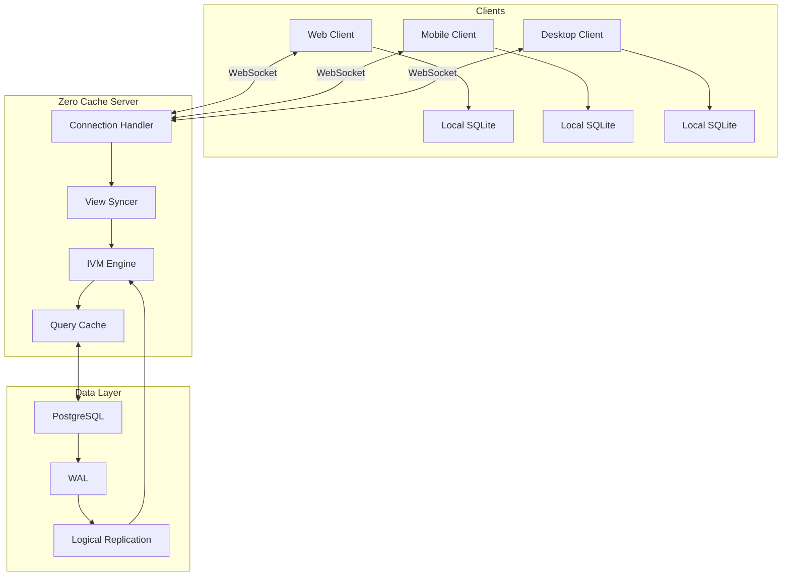
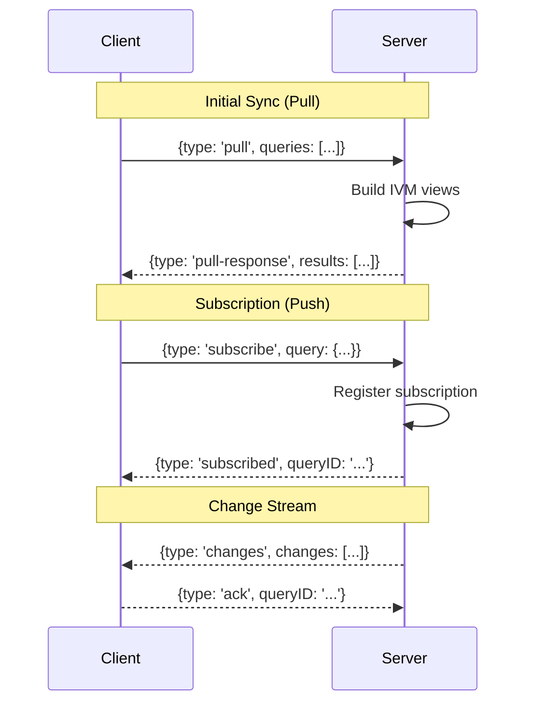
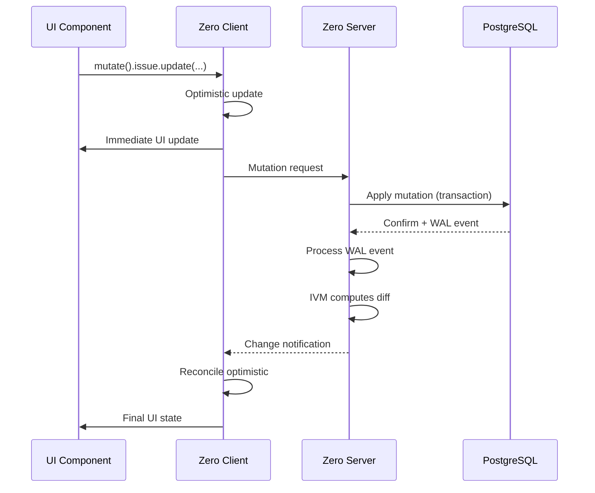

# Zero Architecture Deep Dive

## 1. Overview

This document provides a comprehensive deep dive into Zero's architecture, covering:

- Client-server topology
- Connection management
- Pull/push synchronization protocol
- Mutation flow
- Service architecture

## 2. High-Level Architecture



## 3. Client Architecture

### 3.1 Zero Client Class Structure

```typescript
class Zero {
  // Core properties
  private connectionManager: ConnectionManager;
  private queryCache: LocalSQLiteCache;
  private mutationQueue: MutationQueue;
  private schema: Schema;

  // Public API
  query: QueryAPI;           // Query builder
  mutate: () => MutationAPI; // Mutation factory
  connectionStatus: Observable<ConnectionStatus>;

  // Lifecycle
  constructor(options: ZeroOptions);
  connect(): Promise<void>;
  disconnect(): void;
}
```

### 3.2 Connection Manager

The ConnectionManager handles WebSocket communication:

```typescript
class ConnectionManager {
  private ws: WebSocket | null;
  private retryCount: number;
  private status: ConnectionStatus;

  async connect(): Promise<void> {
    this.ws = new WebSocket(this.serverURL);

    this.ws.onopen = () => {
      this.status = 'connected';
      this.retryCount = 0;
      this.sendSubscribeMessages();
    };

    this.ws.onclose = () => {
      this.status = 'disconnected';
      this.scheduleReconnect();
    };

    this.ws.onmessage = (event) => {
      this.handleServerMessage(JSON.parse(event.data));
    };
  }

  private scheduleReconnect(): void {
    const delay = Math.min(
      1000 * Math.pow(2, this.retryCount),
      30000 // Max 30 seconds
    );
    this.retryCount++;
    setTimeout(() => this.connect(), delay);
  }

  send(message: ClientMessage): void {
    this.ws?.send(JSON.stringify(message));
  }
}
```

### 3.3 Connection States

```
┌─────────────┐
│             │
│ Connecting  │──────┐
│             │      │
└─────────────┘      │
       │             │
       │ Success     │
       ▼             │
┌─────────────┐      │
│             │      │ Retry
│ Connected   │◄─────┘
│             │
└─────────────┘
       │
       │ Network error
       ▼
┌─────────────┐
│             │
│Disconnected │
│             │
└─────────────┘
```

### 3.4 Local SQLite Cache

Zero maintains a full SQLite database on the client:

```typescript
class LocalSQLiteCache {
  private db: SQLiteDB;

  async init(schema: Schema): Promise<void> {
    // Create tables based on schema
    for (const [name, table] of Object.entries(schema.tables)) {
      await this.db.exec(`
        CREATE TABLE IF NOT EXISTS ${name} (
          ${this.buildColumns(table.columns)},
          PRIMARY KEY (${table.primaryKey})
        )
      `);
    }
  }

  async applyChanges(changes: Change[]): Promise<void> {
    const tx = await this.db.begin();

    for (const change of changes) {
      switch (change.type) {
        case 'add':
          await tx.run(
            `INSERT INTO ${change.table} VALUES (...)`,
            change.row
          );
          break;
        case 'remove':
          await tx.run(
            `DELETE FROM ${change.table} WHERE id = ?`,
            change.row.id
          );
          break;
        case 'edit':
          await tx.run(
            `UPDATE ${change.table} SET ... WHERE id = ?`,
            change.row
          );
          break;
      }
    }

    await tx.commit();
  }
}
```

## 4. Server Architecture

### 4.1 Zero Cache Services

```
┌─────────────────────────────────────────────────────────┐
│                    Zero Cache Server                     │
├─────────────────────────────────────────────────────────┤
│                                                          │
│  ┌─────────────────────────────────────────────────┐    │
│  │              HTTP/WebSocket Server               │    │
│  │  - Handles client connections                   │    │
│  │  - Upgrades to WebSocket                        │    │
│  │  - Routes messages to workers                   │    │
│  └─────────────────────────────────────────────────┘    │
│                         │                                │
│         ┌───────────────┼───────────────┐               │
│         ▼               ▼               ▼               │
│  ┌─────────────┐ ┌─────────────┐ ┌─────────────┐       │
│  │  Worker 1   │ │  Worker 2   │ │  Worker N   │       │
│  │             │ │             │ │             │       │
│  │ - View      │ │ - View      │ │ - View      │       │
│  │   Syncer    │ │   Syncer    │ │   Syncer    │       │
│  │ - IVM       │ │ - IVM       │ │ - IVM       │       │
│  │   Pipeline  │ │   Pipeline  │ │   Pipeline  │       │
│  └─────────────┘ └─────────────┘ └─────────────┘       │
│                                                          │
│  ┌─────────────────────────────────────────────────┐    │
│  │              Shared Services                     │    │
│  │  ┌──────────────┐  ┌──────────────┐            │    │
│  │  │ Change Source│  │   Mutagen    │            │    │
│  │  │ (PostgreSQL) │  │ (Mutations)  │            │    │
│  │  └──────────────┘  └──────────────┘            │    │
│  └─────────────────────────────────────────────────┘    │
│                                                          │
└─────────────────────────────────────────────────────────┘
```

### 4.2 View Syncer

The ViewSyncer manages client subscriptions and pushes changes:

```typescript
class ViewSyncer {
  private subscriptions: Map<string, Set<QueryAST>>;
  private queryResults: Map<string, MaterializedView>;

  // Subscribe a client to a query
  subscribe(clientID: string, query: QueryAST): void {
    if (!this.subscriptions.has(clientID)) {
      this.subscriptions.set(clientID, new Set());
    }
    this.subscriptions.get(clientID)!.add(query);

    // Initialize view if needed
    if (!this.queryResults.has(query.id)) {
      this.queryResults.set(query.id, this.createView(query));
    }

    // Send initial results
    this.sendInitialResults(clientID, query);
  }

  // Push changes to subscribed clients
  pushChanges(changes: Change[]): void {
    for (const [clientID, queries] of this.subscriptions) {
      const relevantChanges: Change[] = [];

      for (const query of queries) {
        const view = this.queryResults.get(query.id)!;
        const filtered = view.applyChanges(changes);
        if (filtered.length > 0) {
          relevantChanges.push(...filtered);
        }
      }

      if (relevantChanges.length > 0) {
        this.sendToClient(clientID, relevantChanges);
      }
    }
  }
}
```

### 4.3 IVM Pipeline

Each query gets an IVM pipeline:

```typescript
class IVMPipeline {
  private operators: Operator[];

  constructor(query: QueryAST) {
    this.operators = this.buildPipeline(query);
  }

  private buildPipeline(query: QueryAST): Operator[] {
    const ops: Operator[] = [];

    // Scan operator (read from table)
    ops.push(new ScanOperator(query.table));

    // Filter operators (WHERE clauses)
    for (const filter of query.filters) {
      ops.push(new FilterOperator(filter));
    }

    // Join operators
    for (const join of query.joins) {
      ops.push(new JoinOperator(join));
    }

    // OrderBy operator
    if (query.orderBy) {
      ops.push(new OrderByOperator(query.orderBy));
    }

    // Limit operator
    if (query.limit) {
      ops.push(new LimitOperator(query.limit));
    }

    return ops;
  }

  // Process a change through the pipeline
  processChange(change: Change): Change[] {
    let changes = [change];

    for (const operator of this.operators) {
      const output: Change[] = [];
      for (const change of changes) {
        output.push(...operator.apply(change));
      }
      changes = output;
    }

    return changes;
  }
}
```

## 5. Synchronization Protocol

### 5.1 Pull/Push Protocol



### 5.2 Message Types

#### Client → Server

```typescript
type ClientMessage =
  | {
      type: 'pull';
      queries: QueryRequest[];
    }
  | {
      type: 'subscribe';
      query: QueryAST;
    }
  | {
      type: 'unsubscribe';
      queryID: string;
    }
  | {
      type: 'mutate';
      mutation: MutationRequest;
    }
  | {
      type: 'ack';
      queryID: string;
      changeIDs: string[];
    };
```

#### Server → Client

```typescript
type ServerMessage =
  | {
      type: 'pull-response';
      queryID: string;
      results: Row[];
    }
  | {
      type: 'subscribed';
      queryID: string;
    }
  | {
      type: 'changes';
      queryID: string;
      changes: Change[];
    }
  | {
      type: 'mutation-result';
      mutationID: string;
      success: boolean;
      error?: string;
    };
```

### 5.3 Change Batching

Server batches changes for efficiency:

```typescript
class ChangeBatcher {
  private batch: Change[] = [];
  private timer: NodeJS.Timeout | null = null;

  addChange(change: Change): void {
    this.batch.push(change);

    if (!this.timer) {
      this.timer = setTimeout(() => {
        this.flush();
      }, 100); // 100ms batching window
    }
  }

  flush(): void {
    if (this.batch.length > 0) {
      this.sendChanges(this.batch);
      this.batch = [];
    }
    this.timer = null;
  }
}
```

## 6. Mutation Flow

### 6.1 Mutation Lifecycle



### 6.2 Optimistic Update Handling

```typescript
class MutationQueue {
  private pending: Map<string, Mutation>;

  async enqueue(mutation: Mutation): Promise<void> {
    // Store with optimistic flag
    this.pending.set(mutation.id, {
      ...mutation,
      optimistic: true,
    });

    // Send to server
    try {
      await this.send(mutation);
    } catch (error) {
      // Keep queued for retry
      this.pending.set(mutation.id, {
        ...mutation,
        optimistic: false,
        error,
      });
    }
  }

  async confirm(mutationID: string): Promise<void> {
    const mutation = this.pending.get(mutationID);
    if (mutation) {
      mutation.optimistic = false;
      this.pending.delete(mutationID);
    }
  }

  async reject(mutationID: string, error: string): Promise<void> {
    const mutation = this.pending.get(mutationID);
    if (mutation) {
      // Rollback optimistic update
      await this.rollback(mutation);
      this.pending.delete(mutationID);
    }
  }
}
```

## 7. Worker Architecture

### 7.1 Worker Dispatching

```typescript
class WorkerDispatcher {
  private workers: WorkerInfo[] = [];
  private clientAssignments: Map<string, number> = new Map();

  constructor(workerCount: number) {
    for (let i = 0; i < workerCount; i++) {
      const worker = fork(require.resolve('./worker'));
      this.workers.push({ worker, load: 0 });
    }
  }

  assignClient(clientID: string): Worker {
    // Find worker with lowest load
    const workerIndex = this.workers.reduce(
      (minIdx, worker, idx) =>
        worker.load < this.workers[minIdx].load ? idx : minIdx,
      0
    );

    this.clientAssignments.set(clientID, workerIndex);
    this.workers[workerIndex].load++;

    return this.workers[workerIndex].worker;
  }

  routeMessage(clientID: string, message: any): void {
    const workerIndex = this.clientAssignments.get(clientID);
    if (workerIndex !== undefined) {
      this.workers[workerIndex].worker.send(message);
    }
  }
}
```

### 7.2 Change Source Service

The ChangeSource listens to PostgreSQL WAL:

```typescript
class ChangeSource {
  private client: PoolClient;
  private subscribers: Set<(change: Change) => void> = new Set();

  async connect(config: PostgreSQLConfig): Promise<void> {
    this.client = await pool.connect();

    // Create replication slot
    await this.client.query(`
      SELECT pg_create_logical_replication_slot('zero', 'pgoutput')
    `);

    // Start replication
    await this.client.query(`
      START_REPLICATION SLOT "zero" LOGICAL 0/0
      (proto_version '1', publication 'zero_publication')
    `);

    // Listen for WAL messages
    this.client.connection.on('copyData', (msg) => {
      const change = this.parseWALMessage(msg);
      this.notifySubscribers(change);
    });
  }

  subscribe(handler: (change: Change) => void): () => void {
    this.subscribers.add(handler);
    return () => this.subscribers.delete(handler);
  }

  private notifySubscribers(change: Change): void {
    for (const handler of this.subscribers) {
      handler(change);
    }
  }
}
```

## 8. Scaling Considerations

### 8.1 Horizontal Scaling

```
┌─────────────────────────────────────────────────────────┐
│                    Load Balancer                        │
└─────────────────────────────────────────────────────────┘
         │              │              │
         ▼              ▼              ▼
┌─────────────┐ ┌─────────────┐ ┌─────────────┐
│  Zero Cache │ │  Zero Cache │ │  Zero Cache │
│   Server 1  │ │   Server 2  │ │   Server 3  │
│             │ │             │ │             │
│ + PostgreSQL│ │ + PostgreSQL│ │ + PostgreSQL│
│   (replica) │ │   (replica) │ │   (replica) │
└─────────────┘ └─────────────┘ └─────────────┘
         │              │              │
         └──────────────┼──────────────┘
                        │
                        ▼
               ┌─────────────┐
               │  PostgreSQL │
               │   Primary   │
               └─────────────┘
```

### 8.2 Connection Limits

```typescript
class ConnectionLimiter {
  private maxConnections: number;
  private currentConnections: number = 0;

  async acquire(clientID: string): Promise<boolean> {
    if (this.currentConnections >= this.maxConnections) {
      return false; // Reject connection
    }
    this.currentConnections++;
    return true;
  }

  release(clientID: string): void {
    this.currentConnections--;
  }
}
```

---

*Next: [02-zql-ivm-deep-dive.md](02-zql-ivm-deep-dive.md)*
