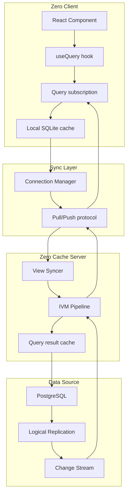

# Zero: Complete Exploration

## Overview

**Zero** is a realtime sync platform from Rocicorp that enables building collaborative applications with automatic data synchronization between clients and servers. The core innovation is the IVM (Incremental View Maintenance) engine in ZQL that efficiently computes and propagates only the changes to queries.

### Why This Exploration Exists

This is a **complete textbook** that takes you from zero realtime sync knowledge to understanding how to build and deploy production sync systems with Rust/valtron replication.

### Key Characteristics

| Aspect | Zero |
|--------|------|
| **Core Innovation** | IVM (Incremental View Maintenance) for efficient query diffing |
| **Dependencies** | Replicache (client sync), PostgreSQL (source of truth), SQLite (client cache) |
| **Lines of Code** | ~50,000+ (monorepo with client, server, ZQL, demos) |
| **Purpose** | Realtime data synchronization with offline-first support |
| **Architecture** | Client-server with change streams, IVM pipeline, mutagen for mutations |
| **Runtime** | Node.js server, Browser/React Native clients |
| **Rust Equivalent** | ewe_platform with valtron executor |

### Zero Ecosystem

Zero consists of multiple interconnected packages:

| Package | Purpose | Lines |
|---------|---------|-------|
| **zero-client** | Client library for React/React Native apps | ~8,000 |
| **zero-cache** | Server-side sync engine and change processor | ~15,000 |
| **zql** | Query language and IVM engine | ~12,000 |
| **zero-schema** | Schema definition and validation | ~2,000 |
| **zero-protocol** | Client-server protocol definitions | ~3,000 |
| **zero-virtual** | Virtual scrolling for large lists | ~800 |
| **fractional-indexing** | Ordering for realtime lists | ~400 |
| **zslack** | Demo Slack clone (Expo app) | ~5,000 |
| **ztunes** | Demo music app (Expo app) | ~4,000 |

---

## Complete Table of Contents

This exploration consists of multiple deep-dive documents. Read them in order for complete understanding:

### Part 1: Foundations
1. **[Zero to Sync Engineer](00-zero-to-sync-engineer.md)** - Start here if new to realtime sync
   - What is realtime synchronization?
   - Client-server sync patterns
   - Offline-first architecture
   - IVM fundamentals
   - Change propagation

### Part 2: Core Implementation
2. **[Zero Architecture](01-zero-architecture-deep-dive.md)**
   - Client-server topology
   - Connection management
   - Pull/push synchronization
   - Mutation flow
   - Service architecture

3. **[ZQL and IVM Engine](02-zql-ivm-deep-dive.md)**
   - Query representation (AST)
   - IVM operators (join, filter, orderBy)
   - Change types (add, remove, edit, child)
   - Stream processing
   - View materialization

4. **[Client Architecture](03-client-deep-dive.md)**
   - Connection manager
   - Query subscription
   - Local cache (SQLite)
   - Optimistic mutations
   - Connection status

5. **[Server Services](04-server-services-deep-dive.md)**
   - Change source (PostgreSQL logical replication)
   - Change streamer
   - Replicator
   - Mutagen (mutation processing)
   - View syncer

6. **[Zero Virtual](05-zero-virtual-deep-dive.md)**
   - Bidirectional infinite scrolling
   - Permalink support
   - State persistence
   - Tanstack Virtual integration

7. **[Fractional Indexing](06-fractional-indexing-deep-dive.md)**
   - Realtime list ordering
   - Key generation between positions
   - Collision avoidance
   - Multi-language implementations

### Part 3: Rust Replication
8. **[Rust Revision](rust-revision.md)**
   - Complete Rust translation
   - Type system design
   - Ownership and borrowing strategy
   - IVM implementation patterns
   - Code examples

9. **[Valtron Integration](05-valtron-integration.md)**
   - TaskIterator for async operations
   - Lambda deployment patterns
   - HTTP API compatibility
   - No async/await, no tokio

### Part 4: Production
10. **[Production-Grade Implementation](production-grade.md)**
    - Performance optimizations
    - Memory management
    - Batching and throughput
    - Serving infrastructure
    - Monitoring and observability

---

## Quick Reference: Zero Architecture

### High-Level Flow



### Component Summary

| Component | Lines | Purpose | Deep Dive |
|-----------|-------|---------|-----------|
| ZQL IVM Engine | 12,000 | Incremental view maintenance | [ZQL IVM](02-zql-ivm-deep-dive.md) |
| Client | 8,000 | Query subscription, local cache | [Client](03-client-deep-dive.md) |
| Server Services | 15,000 | Change processing, sync | [Server Services](04-server-services-deep-dive.md) |
| Protocol | 3,000 | Client-server messages | [Architecture](01-zero-architecture-deep-dive.md) |
| Zero Virtual | 800 | Virtual scrolling | [Zero Virtual](05-zero-virtual-deep-dive.md) |
| Fractional Indexing | 400 | List ordering | [Fractional Indexing](06-fractional-indexing-deep-dive.md) |

---

## File Structure

```
Zero/
├── mono/                           # Main monorepo
│   ├── packages/
│   │   ├── zero-client/            # Client library
│   │   │   ├── src/
│   │   │   │   ├── client/
│   │   │   │   │   ├── connection.ts      # Connection management
│   │   │   │   │   ├── connection-manager.ts
│   │   │   │   │   ├── zero.ts            # Main Zero class
│   │   │   │   │   ├── options.ts         # Configuration
│   │   │   │   │   ├── crud.ts            # CRUD operations
│   │   │   │   │   ├── custom.ts          # Custom mutations
│   │   │   │   │   ├── metrics.ts         # Observability
│   │   │   │   │   └── inspector/         # Debug UI
│   │   │   │   └── mod.ts                 # Public exports
│   │   │   └── test/
│   │   │
│   │   ├── zero-cache/             # Server sync engine
│   │   │   ├── src/
│   │   │   │   ├── server/
│   │   │   │   │   ├── main.ts              # Server entrypoint
│   │   │   │   │   ├── syncer.ts            # Main sync coordinator
│   │   │   │   │   ├── replicator.ts        # Data replication
│   │   │   │   │   ├── mutator.ts           # Mutation handling
│   │   │   │   │   ├── worker-dispatcher.ts # Worker management
│   │   │   │   │   └── runner/
│   │   │   │   │
│   │   │   │   └── services/
│   │   │   │       ├── change-source/       # PostgreSQL logical replication
│   │   │   │       ├── change-streamer/     # Change event streaming
│   │   │   │       ├── replicator/          # Client replication
│   │   │   │       ├── mutagen/             # Mutation processing
│   │   │   │       ├── view-syncer/         # View synchronization
│   │   │   │       ├── limiter/             # Rate limiting
│   │   │   │       └── litestream/          # Backup streaming
│   │   │   └── test/
│   │   │
│   │   ├── zql/                    # Query language + IVM
│   │   │   ├── src/
│   │   │   │   ├── builder/                 # Query builder
│   │   │   │   ├── ivm/                     # IVM engine
│   │   │   │   │   ├── change.ts            # Change types
│   │   │   │   │   ├── data.ts              # Node/row types
│   │   │   │   │   ├── stream.ts            # Stream abstraction
│   │   │   │   │   ├── view.ts              # Materialized views
│   │   │   │   │   ├── join.ts              # Join operator
│   │   │   │   │   ├── filter.ts            # Filter operator
│   │   │   │   │   ├── orderBy.ts           # Ordering operator
│   │   │   │   │   └── exists.ts            # Correlated subqueries
│   │   │   │   ├── query/                   # Query API
│   │   │   │   │   ├── query.ts             # Query type
│   │   │   │   │   ├── query-registry.ts    # Named queries
│   │   │   │   │   └── expression.ts        # Filter expressions
│   │   │   │   └── mutate/                  # Mutations
│   │   │   │       ├── mutator.ts           # Mutator definitions
│   │   │   │       └── crud.ts              # CRUD mutators
│   │   │   └── test/
│   │   │
│   │   ├── zero-schema/            # Schema definition
│   │   ├── zero-protocol/          # Wire protocol
│   │   ├── zero-types/             # Type utilities
│   │   └── shared/                 # Shared utilities
│   │
│   └── apps/
│       ├── zbugs/                  # Bug tracker demo
│       ├── zql-viz/                # Query visualizer
│       └── otel-proxy/             # OpenTelemetry proxy
│
├── zero-docs/                      # Documentation site (Next.js)
├── zero-virtual/                   # Virtual scrolling library
├── fractional-indexing/            # List ordering algorithm
├── zslack/                         # Slack clone demo (Expo)
├── ztunes/                         # Music app demo (Expo)
└── exploration.md                  # This file (index)
```

---

## Key Concepts

### 1. Incremental View Maintenance (IVM)

IVM is the core algorithm that makes Zero efficient. Instead of re-running entire queries when data changes, IVM:

1. Tracks the structure of each query as a pipeline of operators
2. When a row changes, pushes that change through the pipeline
3. Computes only the difference to query results
4. Sends minimal updates to clients

```typescript
// Change types in the IVM pipeline
type Change =
  | { type: 'add'; node: Node }      // New row added
  | { type: 'remove'; node: Node }   // Row removed
  | { type: 'edit'; node: Node; oldNode: Node }  // Row modified
  | { type: 'child'; node: Node; child: { relationshipName: string; change: Change } };
```

### 2. Client-Server Synchronization

Zero uses a bidirectional sync protocol:

```
Client                          Server
  │                               │
  │──── Pull request ────────────>│
  │                               │ (Query IVM cache)
  │<─── Query results ────────────│
  │                               │
  │──── Subscription ────────────>│
  │                               │ (Register interest)
  │                               │ (Wait for changes...)
  │<─── Change stream ────────────│ (Push incremental updates)
  │                               │
  │──── Mutation ────────────────>│
  │                               │ (Apply to PostgreSQL)
  │<─── Mutation result ──────────│
```

### 3. Offline-First Architecture

Clients maintain a local SQLite cache:

- Queries work offline (reads from local cache)
- Mutations are queued and applied when online
- Automatic conflict resolution via row-level versioning
- Seamless reconnection after network issues

### 4. Schema-Driven Development

Zero uses a centralized schema definition:

```typescript
import {createSchema, table} from '@rocicorp/zero';

const schema = createSchema({
  version: 1,
  tables: {
    issue: table('issue')
      .columns({
        id: 'string',
        title: 'string',
        status: 'string',
        created: 'number',
      })
      .primaryKey('id'),
  },
});
```

### 5. Named Queries with Parameters

```typescript
import {defineQuery} from 'zql';

const queries = defineQuery(({args: {projectId}}) =>
  zql.issue
    .where('projectId', projectId)
    .orderBy('created', 'desc')
    .limit(50)
);
```

---

## How to Use This Exploration

### For Complete Beginners (Zero Sync Experience)

1. Start with **[00-zero-to-sync-engineer.md](00-zero-to-sync-engineer.md)**
2. Read each section carefully, work through examples
3. Continue through all deep dives in order
4. Finish with production-grade and valtron integration

**Time estimate:** 30-60 hours for complete understanding

### For Experienced TypeScript Developers

1. Skim [00-zero-to-sync-engineer.md](00-zero-to-sync-engineer.md) for context
2. Deep dive into areas of interest (IVM, client, server)
3. Review [rust-revision.md](rust-revision.md) for Rust translation patterns
4. Check [production-grade.md](production-grade.md) for deployment considerations

### For Database/Sync Engineers

1. Review [ZQL source](mono/packages/zql/src/) directly
2. Study the IVM operators in [mono/packages/zql/src/ivm/]
3. Compare with other IVM implementations (Timely Dataflow, Differential Dataflow)
4. Extract insights for distributed systems

---

## Running Zero

### Quick Start with zslack Demo

```bash
# Navigate to zslack
cd /path/to/zero/zslack

# Install dependencies
bun install

# Start PostgreSQL (Docker)
bun run dev:db-up

# Start zero-cache server (terminal 2)
bun run dev:zero-cache

# Start API server (terminal 3)
bun run dev:api

# Start Expo app (terminal 4)
bun run dev:expo
```

### Using Zero in Your App

```typescript
import {Zero, createSchema, table} from '@rocicorp/zero';

// 1. Define schema
const schema = createSchema({
  version: 1,
  tables: {
    message: table('message')
      .columns({
        id: 'string',
        text: 'string',
        timestamp: 'number',
      })
      .primaryKey('id'),
  },
});

// 2. Create Zero client
const zero = new Zero({
  userID: 'user123',
  schema,
  server: 'http://localhost:4848',
});

// 3. Subscribe to queries
const query = zero.query.message.orderBy('timestamp', 'desc');
const view = query.materialize(view => {
  view.addListener(changes => {
    console.log('Changes:', changes);
  });
});
```

---

## Key Insights

### 1. IVM is More Efficient Than Re-querying

| Approach | Cost per Update |
|----------|-----------------|
| Re-run query | O(n) where n = table size |
| IVM | O(k) where k = changed rows |

For large tables with few changes, IVM is orders of magnitude faster.

### 2. Change Types Preserve Structure

```typescript
// Instead of just "data changed", Zero tracks:
{
  type: 'child',
  node: parentNode,
  child: {
    relationshipName: 'comments',
    change: { type: 'add', node: newComment }
  }
}
```

This enables efficient updates to nested queries.

### 3. PostgreSQL Logical Replication

Zero uses PostgreSQL's logical replication (WAL decoding) to capture changes:

- No polling required
- Changes captured in real-time
- Zero impact on application queries
- Works with existing PostgreSQL installations

### 4. Client Cache is SQLite

- Full SQL query capability on client
- ACID transactions locally
- Efficient storage on disk
- Works in React Native (expo-sqlite)

### 5. Valtron for Rust Replication

The Rust equivalent uses TaskIterator for async operations:

```rust
// Instead of async/await:
async fn fetch_changes() -> Vec<Change> { ... }

// Use TaskIterator:
struct ChangeFetcher { /* state */ }
impl TaskIterator for ChangeFetcher {
    type Ready = Vec<Change>;
    type Pending = ();

    fn next(&mut self) -> Option<TaskStatus<Self::Ready, Self::Pending>> {
        // Return Pending while waiting, Ready when complete
    }
}
```

---

## From Zero to Production Sync Systems

| Aspect | Zero | Production Sync Systems |
|--------|------|------------------------|
| Client | React/React Native | Web, mobile, desktop |
| Server | Node.js | Rust, Go, Java |
| Database | PostgreSQL | PostgreSQL, MySQL, DynamoDB |
| Sync Protocol | Custom | CRDT, OT, Operational |
| Scale | Single region | Multi-region, edge |

**Key takeaway:** The core patterns (IVM, change streams, local cache) scale to production with infrastructure changes, not algorithm changes.

---

## Your Path Forward

### To Build Realtime Sync Skills

1. **Build a simple sync app** (todo list with multiple users)
2. **Add offline support** (mutations queue, reconnection)
3. **Study the IVM operators** (join, filter, orderBy)
4. **Translate to Rust** (TaskIterator pattern)
5. **Study the papers** (IVM, CRDT, distributed systems)

### Recommended Resources

- [Zero Documentation](https://zero.rocicorp.dev/)
- [Replicache Paper](https://replicache.dev/)
- [Differential Dataflow](https://github.com/TimelyDataflow/differential-dataflow)
- [Valtron README](/home/darkvoid/Boxxed/@dev/ewe_platform/backends/foundation_core/src/valtron/README.md)
- [TaskIterator Specification](/home/darkvoid/Boxxed/@dev/ewe_platform/specifications/08-valtron-async-iterators/)

---

## Document History

| Date | Change |
|------|--------|
| 2026-03-27 | Initial exploration created |
| 2026-03-27 | Deep dives 00-06 outlined |
| 2026-03-27 | Rust revision and production-grade planned |

---

*This exploration is a living document. Revisit sections as concepts become clearer through implementation.*
