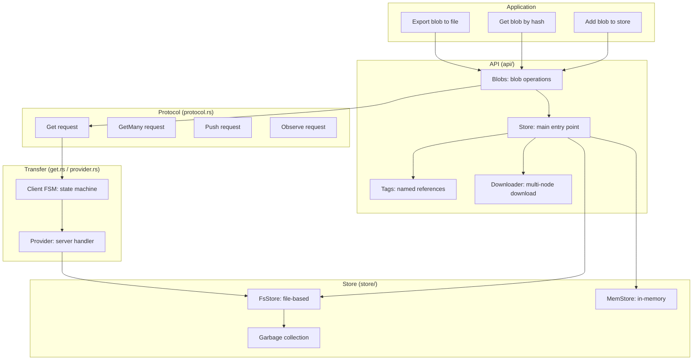

# Overview — What iroh-blobs Is and BLAKE3 Verified Streaming

Iroh-blobs implements BLAKE3-based content-addressed blob transfer over iroh connections, scaling from kilobytes to terabytes with verified streaming.

## The Core Concept: Content-Addressed Storage

Every blob is identified by its BLAKE3 hash. To fetch a blob, you only need its hash — the hash IS the address.

```
Blob content: "Hello, world!" (13 bytes)
         ↓
BLAKE3 hash: b4:4e38... (32 bytes)
         ↓
Hash: base32("b44e38...") = "b44e38..."
         ↓
BlobTicket: node_addr + hash + format
```

**Key insight:** BLAKE3 is a Merkle tree hash — it produces not just a root hash but a tree of intermediate hashes. This means you can verify ANY chunk of the blob independently against the root hash, enabling verified streaming where the receiver validates each chunk as it arrives.

Source: `iroh-blobs/src/hash.rs:1` — `Hash` is a 32-byte BLAKE3 digest.

## Verified Streaming with Bao

Bao is a verified streaming protocol built on BLAKE3's Merkle tree structure. The sender produces:

1. **Content** — the raw bytes
2. **Outboard** — the Merkle tree nodes (intermediate hashes)

The receiver uses the outboard to verify each chunk as it arrives:

```
Sender:                          Receiver:
┌──────────┐                     ┌──────────┐
│  Data    │──content + outboard─▶│  Verify  │
│  (100MB) │                     │  chunks  │
│          │                     │  one by  │
│ Outboard │──Merkle tree hashes─▶│  one    │
│ (small)  │                     │  against │
└──────────┘                     │  root    │
                                 │  hash    │
                                 └──────────┘
```

Source: `iroh-blobs/src/store/fs/bao_file.rs:1` — `BaoFileStorage` manages partial and complete storage with outboard verification.

## Architecture at a Glance



## Stores

| Store | Type | Use Case |
|-------|------|----------|
| **MemStore** | In-memory | Testing, ephemeral data |
| **FsStore** | File-based with redb metadata | Production, persistent storage |
| **ReadonlyMemStore** | Immutable in-memory | Pre-loaded data |

Source: `iroh-blobs/src/store/mod.rs:1` — Store module root.

## Blob Format

```rust
// iroh-blobs/src/hash.rs
pub enum BlobFormat {
    /// Raw blob: the hash identifies the raw bytes.
    Raw,
    /// Hash sequence: the hash identifies a sequence of child hashes.
    HashSeq,
}
```

Source: `iroh-blobs/src/hash.rs:1` — Two blob formats: raw bytes or a sequence of hashes (used for collections).

## Quick Start

```rust
// Add a blob to the store
let store = FsStore::load(path).await?;
let hash = store.add_bytes(b"Hello, world!").await?;

// Create a ticket for sharing
let ticket = BlobTicket::new(addr, hash, BlobFormat::Raw);

// Fetch a blob from remote
let downloader = Downloader::new(store, endpoint);
downloader.enqueue(hash).await?;
```

Source: `iroh-blobs/README.md:1`

## Feature Flags

| Feature | Default | Purpose |
|---------|---------|---------|
| `default` | ✅ | Standard features |
| `redb` | ✅ | redb metadata database |
| `tokio-io` | ✅ | Tokio async I/O |
| `test-utils` | — | Test utilities |

Source: `iroh-blobs/Cargo.toml:features`

## Dependencies

| Dependency | Version | Purpose |
|------------|---------|---------|
| `bao-tree` | 0.15 | BLAKE3 verified streaming |
| `iroh-base` | =1.0.0-rc.1 | PublicKey, NodeAddr types |
| `iroh` | =1.0.0-rc.1 | Networking |
| `postcard` | 1 | Serialization |
| `iroh-metrics` | =1.0.0-rc.0 | Metrics |
| `redb` | 2 | Metadata database (FsStore) |
| `blake3` | 1.8 | Hashing |

Source: `iroh-blobs/Cargo.toml:dependencies`

## Related Documents

- [Architecture](../markdown/01-architecture.md) — Full dependency graph
- [Hash and Bao](../markdown/02-hash-and-bao.md) — BLAKE3 hashing and bao outboards
- [Protocol](../markdown/03-protocol.md) — Wire format
