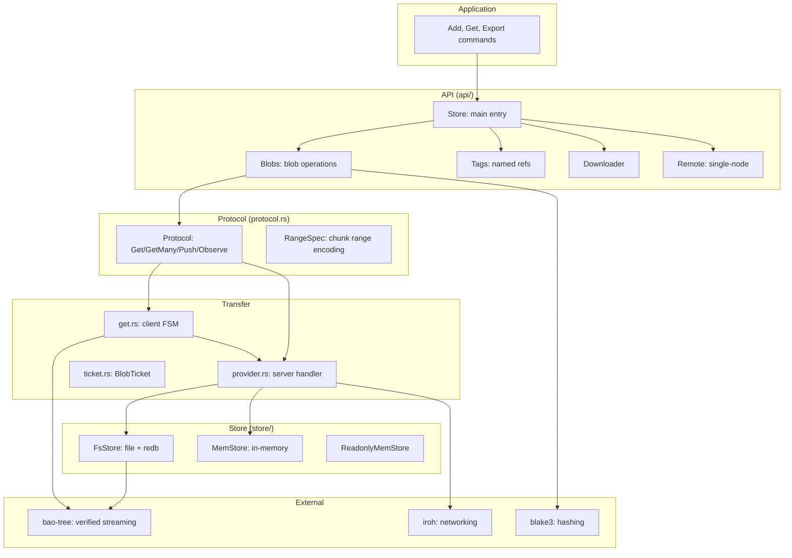

# Architecture — Layer Diagram, Module Map, and Dependency Graph

Iroh-blobs is organized as a layered architecture: API → protocol → transfer → store.

## Full Dependency Graph



## Layer Stack

```
┌───────────────────────────────────────────────────────┐
│  Application: Store.add_path(), get_blob(), export()  │
├───────────────────────────────────────────────────────┤
│  API (api/): Store, Blobs, Tags, Downloader, Remote   │
│  Progress reporting, temp tags, batch operations      │
├───────────────────────────────────────────────────────┤
│  Transfer (get.rs / provider.rs)                      │
│  Client FSM states, server handler, progress writers  │
├───────────────────────────────────────────────────────┤
│  Protocol (protocol.rs, format/)                      │
│  Get/GetMany/Push/Observe requests, RangeSpec         │
│  Collection format, HashSeq                           │
├───────────────────────────────────────────────────────┤
│  Store (store/): FsStore, MemStore, GC               │
│  redb metadata, partial/complete storage, bitfield    │
├───────────────────────────────────────────────────────┤
│  bao-tree: BLAKE3 verified streaming                  │
│  Merkle tree, outboard, chunk validation              │
├───────────────────────────────────────────────────────┤
│  blake3: cryptographic hashing                        │
└───────────────────────────────────────────────────────┘
```

**Aha:** The store layer uses a two-actor architecture (main actor + database actor) for the FsStore. The main actor handles live blob operations (imports, exports, reads) while the database actor manages redb transactions. Commands flow between them through channels, allowing reads to proceed without blocking on database writes.

Source: `iroh-blobs/src/store/fs/mod.rs:1` — Two-actor architecture.

## Module Map

### api/ — High-Level API

| Module | Purpose |
|--------|---------|
| `api.rs` | `Store` struct, RPC dispatch, error types |
| `api/blobs.rs` | `Blobs`: add_bytes, add_path, export, observe, import, reader |
| `api/blobs/reader.rs` | `BlobReader`: AsyncRead + AsyncSeek |
| `api/downloader.rs` | `Downloader`: multi-node download with `ContentDiscovery` |
| `api/proto.rs` | RPC protocol: Request, Command, Progress items |
| `api/proto/bitfield.rs` | `Bitfield`: validated chunk tracking |
| `api/remote.rs` | `Remote`: single-node download |
| `api/tags.rs` | `Tags`: list, get, set, delete, rename |

### protocol.rs — Wire Format

| Module | Purpose |
|--------|---------|
| `protocol.rs` | Request enum (Get/Observe/Push/GetMany), GetRequest, GetManyRequest |
| `protocol/range_spec.rs` | `ChunkRangesSeq`, `RangeSpec`: run-length encoded ranges |

### get.rs — Client FSM

| Module | Purpose |
|--------|---------|
| `get.rs` | Client FSM: AtInitial → AtConnected → AtStartRoot → AtBlobHeader → AtBlobContent → AtEndBlob → AtClosing |
| `get/error.rs` | `GetError`: NotFound, RemoteReset, NoncompliantNode, Io, BadRequest, LocalFailure |
| `get/request.rs` | `get_blob`, `get_verified_size`, `get_hash_seq_and_sizes` utilities |

### provider.rs — Server Handler

| Module | Purpose |
|--------|---------|
| `provider.rs` | `handle_connection`, `handle_get`, `handle_get_many`, `handle_push`, `handle_observe` |

### store/ — Storage Backends

| Module | Purpose |
|--------|---------|
| `store/mod.rs` | Store module root, `IROH_BLOCK_SIZE` (16 KiB) |
| `store/fs.rs` | `FsStore`: file-based store with redb metadata |
| `store/fs/bao_file.rs` | `BaoFileStorage`: partial/complete storage |
| `store/fs/entry_state.rs` | `EntryState`: Complete/Partial, DataLocation, OutboardLocation |
| `store/fs/gc.rs` | Mark-sweep garbage collection |
| `store/fs/import.rs` | Import pipeline: TempFile/External/Memory sources |
| `store/fs/meta.rs` | Metadata database actor with redb |
| `store/fs/meta/tables.rs` | redb table definitions |
| `store/fs/meta/proto.rs` | Command protocol: Get, Set, Update, Dump, Snapshot |
| `store/fs/delete_set.rs` | Safe file deletion with transactions |
| `store/fs/options.rs` | Configuration: InlineOptions, BatchOptions, GcConfig |
| `store/mem.rs` | `MemStore`: in-memory blob storage |
| `store/readonly_mem.rs` | `ReadonlyMemStore`: immutable store |
| `store/util.rs` | Utilities: Tag, RangeSetExt, BaoTreeSender |
| `store/util/sparse_mem_file.rs` | `SparseMemFile`: in-memory sparse file |
| `store/util/partial_mem_storage.rs` | `PartialMemStorage`: incomplete entry storage |
| `store/util/observer.rs` | `Combine` and `CombineInPlace` traits |
| `store/util/size_info.rs` | `SizeInfo`: tracks most precise known size |

### Other

| Module | Purpose |
|--------|---------|
| `hash.rs` | `Hash` (32-byte BLAKE3), `BlobFormat`, `HashAndFormat` |
| `hashseq.rs` | `HashSeq`: sequence of 32-byte hashes |
| `format.rs` + `format/collection.rs` | `Collection`: named blobs, metadata wire format |
| `net_protocol.rs` | `BlobsProtocol`: iroh ProtocolHandler implementation |
| `ticket.rs` | `BlobTicket`: serializable sharing ticket |
| `util/temp_tag.rs` | `TempTag`: ephemeral tag protecting content |
| `metrics.rs` | Prometheus metrics |

## Key Constants

```rust
// iroh-blobs/src/store/mod.rs
pub const IROH_BLOCK_SIZE: u32 = 16 * 1024; // 16 KiB chunks
```

Source: `iroh-blobs/src/store/mod.rs:1` — The default chunk size for bao verified streaming.

## Related Documents

- [Overview](../markdown/00-overview.md) — What iroh-blobs is
- [Hash and Bao](../markdown/02-hash-and-bao.md) — BLAKE3 and bao outboards
- [File Store](../markdown/04-store-fs.md) — FsStore architecture
