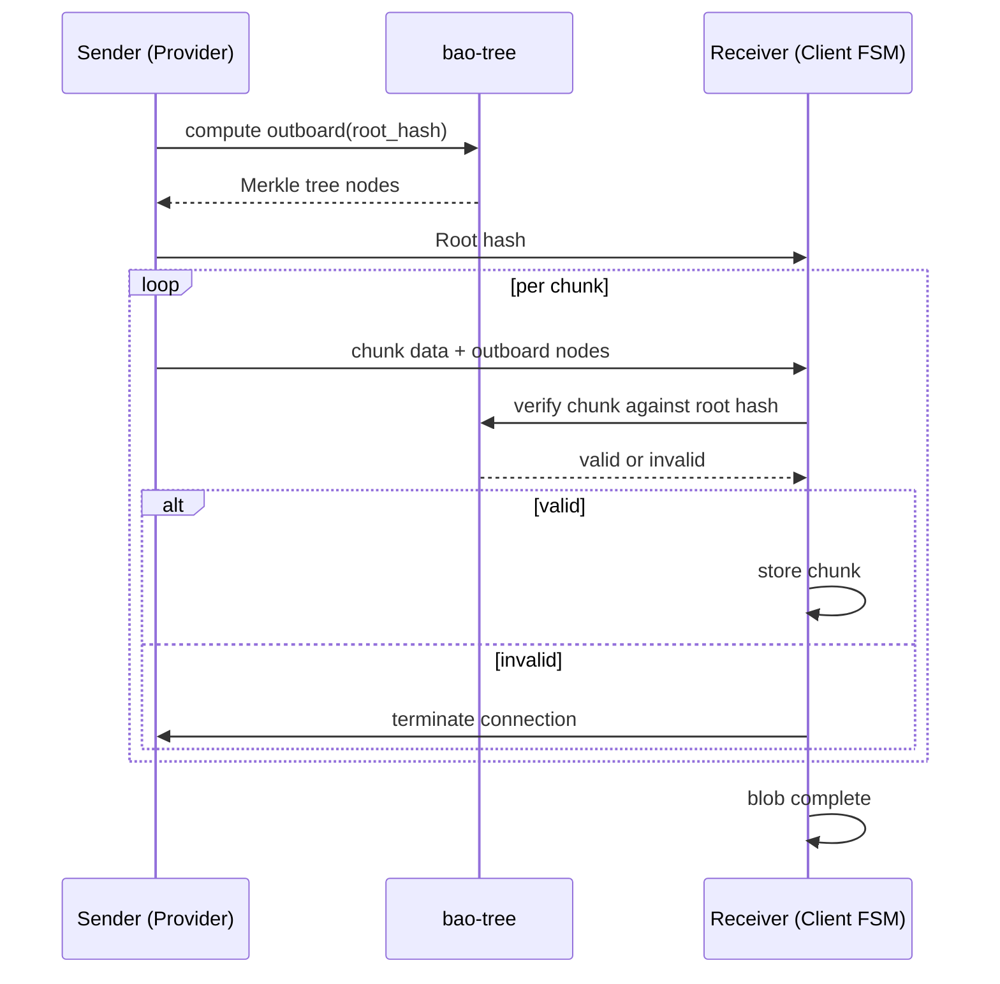

# Hash and Bao — BLAKE3 Hashing and Verified Streaming

Every blob in iroh-blobs is identified by a 32-byte BLAKE3 hash, and verified streaming uses bao outboards for chunk-level validation.

## The Hash Type

```rust
// iroh-blobs/src/hash.rs
#[derive(Clone, Copy, PartialEq, Eq, Hash)]
pub struct Hash([u8; 32]);
```

Source: `iroh-blobs/src/hash.rs:1` — `Hash` is a newtype around a 32-byte BLAKE3 digest.

### Hash Encoding

Hashes can be displayed in multiple formats:

| Format | Example | Use Case |
|--------|---------|----------|
| Hex | `b44e38...` | Debug output |
| Base32 | `b44e38...` (DNS-safe) | Tickets, URLs |

Source: `iroh-blobs/src/hash.rs:1` — `Display` and `FromStr` implementations.

### HashAndFormat

```rust
// iroh-blobs/src/hash.rs
pub struct HashAndFormat {
    pub hash: Hash,
    pub format: BlobFormat,
}

pub enum BlobFormat {
    /// Raw blob: the hash identifies the raw bytes.
    Raw,
    /// Hash sequence: the hash identifies a sequence of child hashes.
    HashSeq,
}
```

Source: `iroh-blobs/src/hash.rs:1` — `HashAndFormat` pairs a hash with its format type.

## Bao Outboards

Bao produces two outputs when hashing a blob:

1. **Root hash** — the 32-byte BLAKE3 Merkle root
2. **Outboard** — the intermediate Merkle tree nodes (a small file alongside the content)

```
Blob (100MB)                    Outboard (~312KB)
┌──────────────────┐            ┌──────────────────┐
│  Chunk 0 (16KB)  │──┐        │  Hash(0,1)        │
│  Chunk 1 (16KB)  │──┤        │  Hash(2,3)        │
│  Chunk 2 (16KB)  │──┤        │  ...              │
│  ...             │  │        │  Root hash        │
│  Chunk N (16KB)  │──┘        └──────────────────┘
└──────────────────┘
```

The outboard is approximately 1/320th of the content size (each BLAKE3 node covers 1024 bytes of content tree level).

**Aha:** Storing the outboard separately from content is the key design decision. It means you can verify a 1TB file by downloading just the ~3GB outboard first, then streaming content chunks on demand — you never need to hold the entire file in memory to verify it.

Source: `iroh-blobs/src/store/fs/bao_file.rs:1` — `BaoFileStorage` stores content and outboard separately.

## Chunk Size

```rust
// iroh-blobs/src/store/mod.rs
pub const IROH_BLOCK_SIZE: u32 = 16 * 1024; // 16 KiB
```

Source: `iroh-blobs/src/store/mod.rs:1` — Bao uses 16 KiB chunks. Each chunk is independently verifiable against the root hash via the outboard.

## Verified Streaming

The verified streaming process:

1. Receiver gets the root hash (from ticket, hash sequence, etc.)
2. Sender streams chunks + outboard nodes
3. Receiver validates each chunk against the outboard
4. If validation fails, the connection is terminated
5. When all chunks are verified, the receiver has the complete blob



## Size Information

Blobs can be partially transferred, so the receiver may not know the full size upfront. `SizeInfo` tracks the most precise known size:

```rust
// iroh-blobs/src/store/util/size_info.rs
pub struct SizeInfo {
    /// Most precise size known so far.
    size: Option<u64>,
    /// Offset into the blob.
    offset: u64,
}
```

Source: `iroh-blobs/src/store/util/size_info.rs:1` — `SizeInfo` tracks size with offset for partial blobs.

## HashSeq

```rust
// iroh-blobs/src/hashseq.rs
pub struct HashSeq(Bytes);
```

A `HashSeq` is a sequence of 32-byte hashes backed by a `Bytes` buffer. It's used for:
- Collections (groups of named blobs)
- Hash sequences (blob containing other blob hashes)
- Chunked large blobs (split into child hashes)

Source: `iroh-blobs/src/hashseq.rs:1` — `HashSeq` provides iteration and indexing over a sequence of hashes.

## Related Documents

- [Architecture](../markdown/01-architecture.md) — Module map
- [Protocol](../markdown/03-protocol.md) — How hashes are used in requests
- [File Store](../markdown/04-store-fs.md) — How outboards are stored on disk
