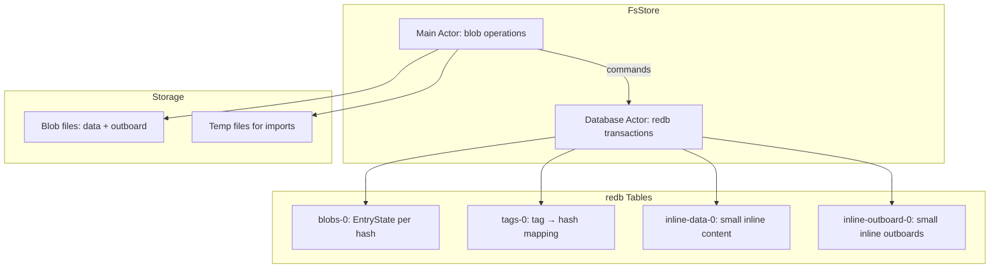

# File Store — FsStore with redb Metadata and Garbage Collection

The FsStore is the production file-based store using redb for metadata and a two-actor architecture for concurrent access.

## Architecture



Source: `iroh-blobs/src/store/fs.rs:1` — Two-actor architecture.

**Aha:** The two-actor design means the main actor can serve reads (blob content, outboard) directly from the filesystem without blocking on redb transactions. The database actor only handles metadata operations (create, update, delete entries). Commands flow through channels from main to database actor.

## EntryState

```rust
// iroh-blobs/src/store/fs/entry_state.rs
pub enum EntryState {
    /// Blob is completely stored.
    Complete {
        size: u64,
        data_location: DataLocation,
        outboard_location: OutboardLocation,
    },
    /// Blob is partially stored.
    Partial {
        size: Option<u64>,
    },
}
```

Source: `iroh-blobs/src/store/fs/entry_state.rs:1` — Each blob entry is either Complete or Partial.

## DataLocation

```rust
// iroh-blobs/src/store/fs/entry_state.rs
pub enum DataLocation {
    /// Data is inline in the redb database (small blobs).
    Inline,
    /// Data is in a separate file.
    Owned(BaoFilePart),
    /// Data is external (not managed by the store).
    External(PathBuf),
}
```

Source: `iroh-blobs/src/store/fs/entry_state.rs:1` — Three data locations: inline in redb, owned file, or external reference.

## BaoFileStorage

```rust
// iroh-blobs/src/store/fs/bao_file.rs
pub enum BaoFileStorage {
    /// Partial storage in memory (small blobs).
    PartialMem(PartialMemStorage),
    /// Partial storage on disk.
    Partial(PartialFileStorage),
    /// Complete storage on disk.
    Complete(CompleteStorage),
    /// Storage is poisoned (import failed).
    Poisoned,
}
```

Source: `iroh-blobs/src/store/fs/bao_file.rs:1` — `BaoFileStorage` tracks the state of a blob during and after import.

## Import Pipeline

```rust
// iroh-blobs/src/store/fs/import.rs
pub enum ImportSource {
    /// Import from a temporary file (content written to temp first).
    TempFile(PathBuf),
    /// Import from an external file (hardlink or copy).
    External(PathBuf),
    /// Import from memory (Bytes buffer).
    Memory(Bytes),
}
```

Source: `iroh-blobs/src/store/fs/import.rs:1` — Three import sources.

### Import Process

1. Content is written to a temp file or provided from memory/external path
2. BLAKE3 hash and outboard are computed
3. Content is moved to the blob directory
4. EntryState is written to redb

Source: `iroh-blobs/src/store/fs/import.rs:1` — `import_path`, `import_bytes`, `import_byte_stream`.

## Garbage Collection

```rust
// iroh-blobs/src/store/fs/gc.rs
pub fn gc_mark_task(...) -> MarkResult { ... }
pub fn gc_sweep_task(...) -> SweepResult { ... }
```

The GC uses mark-sweep:

1. **Mark**: Walk all tags and mark reachable blobs
2. **Sweep**: Delete unmarked blobs

Source: `iroh-blobs/src/store/fs/gc.rs:1` — `gc_mark_task` and `gc_sweep_task`.

## Metadata Database

```rust
// iroh-blobs/src/store/fs/meta/tables.rs
pub struct Tables<'db> {
    pub blobs: Table<'db, 'static, &'static Hash, EntryState>,
    pub tags: Table<'db, 'static, &'static Tag, Hash>,
    pub inline_data: Table<'db, 'static, &'static Hash, &'static [u8]>,
    pub inline_outboard: Table<'db, 'static, &'static Hash, &'static [u8]>,
}
```

Source: `iroh-blobs/src/store/fs/meta/tables.rs:1` — Four redb tables.

## Configuration

```rust
// iroh-blobs/src/store/fs/options.rs
pub struct Options {
    pub path: PathOptions,
    pub inline: InlineOptions,
    pub batch: BatchOptions,
    pub gc: GcConfig,
}

pub struct InlineOptions {
    /// Max size for inline data (default: 16 KiB).
    pub max_data_inlined: u64,
    /// Max size for inline outboard (default: 16 KiB).
    pub max_outboard_inlined: u64,
}
```

Source: `iroh-blobs/src/store/fs/options.rs:1` — Default inline threshold is 16 KiB (matching the blob chunk size).

## Safe Deletion

```rust
// iroh-blobs/src/store/fs/delete_set.rs
pub struct DeleteSet {
    /// Files pending deletion.
    pending: HashSet<BaoFilePart>,
}
```

Source: `iroh-blobs/src/store/fs/delete_set.rs:1` — `DeleteSet` batches file deletions safely using `FileTransaction` to avoid deleting files that are still in use.

## Related Documents

- [Architecture](../markdown/01-architecture.md) — Module map
- [Hash and Bao](../markdown/02-hash-and-bao.md) — Bao outboards
- [Memory Store](../markdown/05-store-mem.md) — In-memory alternative
