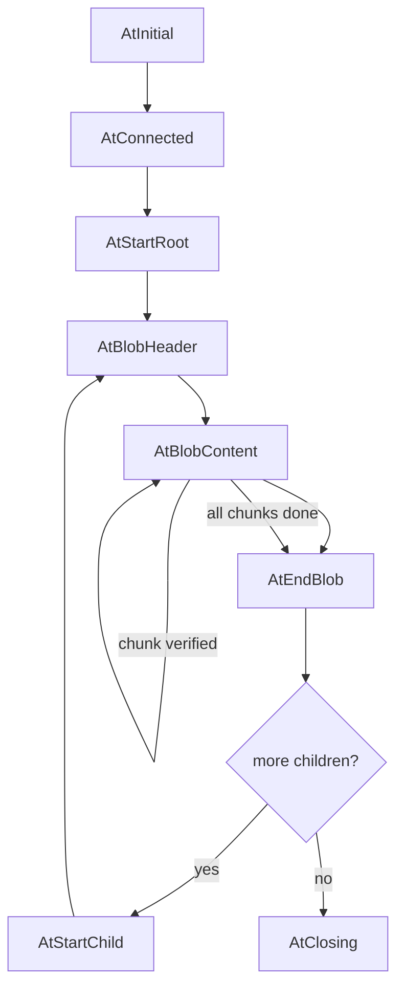

# Get Client — Client FSM States and Blob Retrieval

The client FSM manages the state machine for fetching blobs from a remote provider.

## FSM States

```rust
// iroh-blobs/src/get.rs
enum State {
    /// Initial state: before connecting.
    AtInitial,
    /// Connected to remote, waiting for response.
    AtConnected,
    /// Starting root blob transfer.
    AtStartRoot,
    /// Starting a child blob (for HashSeq).
    AtStartChild,
    /// Reading blob header (hash, size).
    AtBlobHeader,
    /// Reading blob content chunks.
    AtBlobContent,
    /// Finished a blob, moving to next.
    AtEndBlob,
    /// Closing the connection.
    AtClosing,
}
```

Source: `iroh-blobs/src/get.rs:1` — The client progresses through these states during a transfer.

## State Transitions



Source: `iroh-blobs/src/get.rs:1` — State transitions during blob transfer.

## BlobContentNext

```rust
// iroh-blobs/src/get.rs
pub enum BlobContentNext {
    /// More content available.
    More(Bytes),
    /// End of content.
    Done,
}
```

Source: `iroh-blobs/src/get.rs:1` — `BlobContentNext` represents the result of reading content chunks.

## Request Counters

```rust
// iroh-blobs/src/get.rs
pub struct RequestCounters {
    /// Bytes received.
    pub bytes_read: u64,
    /// Chunks received.
    pub chunks_read: u64,
}
```

Source: `iroh-blobs/src/get.rs:1` — Per-request transfer counters.

## Transfer Utilities

```rust
// iroh-blobs/src/get/request.rs
pub async fn get_blob(conn: &Connection, hash: Hash) -> Result<Bytes, GetError> { ... }
pub async fn get_unverified_size(conn: &Connection, hash: Hash) -> Result<u64, GetError> { ... }
pub async fn get_verified_size(conn: &Connection, hash: Hash) -> Result<u64, GetError> { ... }
pub async fn get_hash_seq_and_sizes(conn: &Connection, hash: Hash) -> Result<(HashSeq, Vec<u64>), GetError> { ... }
pub async fn get_chunk_probe(conn: &Connection, hash: Hash, ranges: ChunkRanges) -> Result<Bytes, GetError> { ... }
```

Source: `iroh-blobs/src/get/request.rs:1` — High-level utilities for common retrieval patterns.

## GetError

```rust
// iroh-blobs/src/get/error.rs
pub enum GetError {
    /// Blob not found on remote.
    NotFound,
    /// Connection reset by remote.
    RemoteReset,
    /// Remote sent invalid data.
    NoncompliantNode,
    /// I/O error.
    Io(std::io::Error),
    /// Malformed request.
    BadRequest,
    /// Local failure.
    LocalFailure,
}
```

Source: `iroh-blobs/src/get/error.rs:1` — Six error variants for transfer failures.

**Aha:** The `NoncompliantNode` error is critical — it means the remote sent data that failed BLAKE3 verification. This could indicate a corrupted blob on the remote, a buggy implementation, or a malicious peer. The client immediately terminates the connection on any verification failure.

## Decoding Blobs

The client decodes blobs by:

1. Reading the blob header (hash + size)
2. For each chunk:
   - Read chunk data + outboard nodes
   - Verify chunk against root hash using bao-tree
   - Store validated chunk
3. When all chunks received: blob complete

Source: `iroh-blobs/src/get.rs:1` — The `AtBlobContent` state handles chunk-by-chunk verification.

## Related Documents

- [Protocol](../markdown/03-protocol.md) — Request format
- [Provider](../markdown/08-provider.md) — Server-side handling
- [Data Flow](../markdown/09-data-flow.md) — Complete transfer sequence
