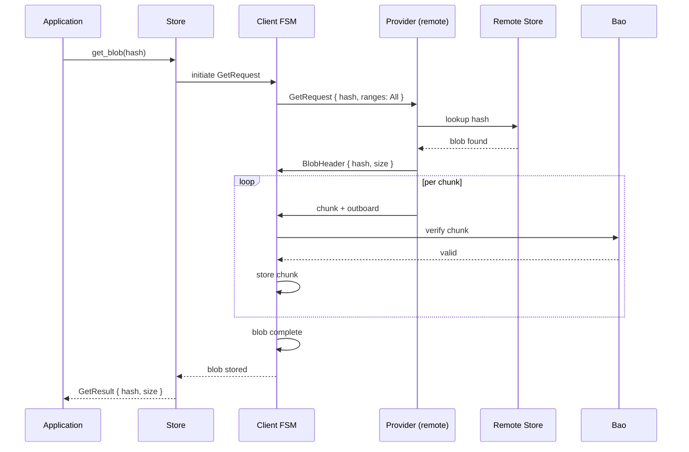
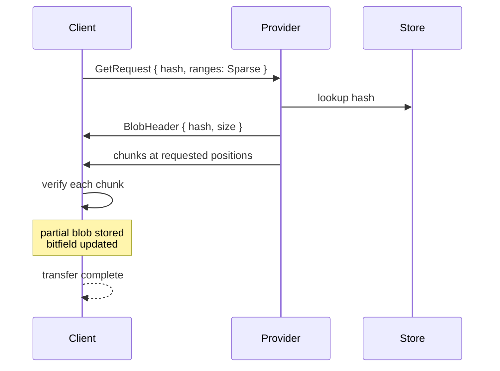
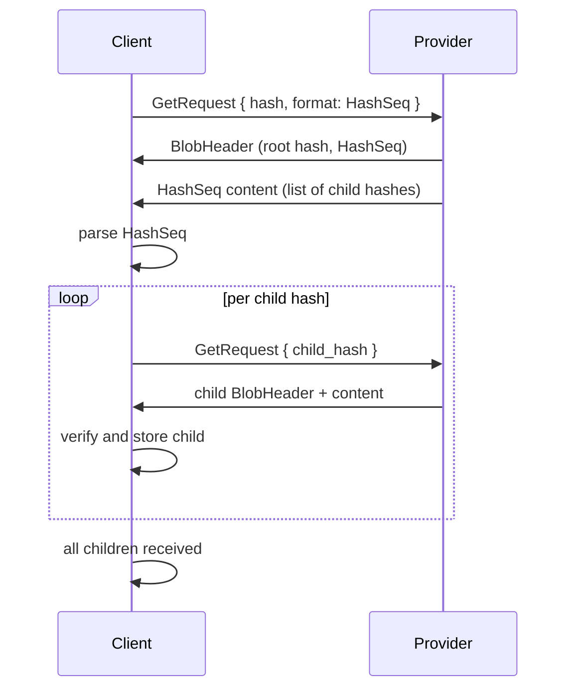
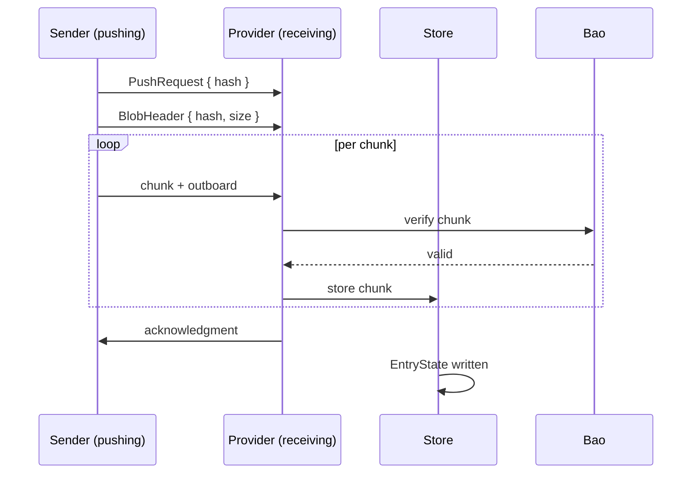

# Data Flow — End-to-End Blob Transfer Sequences

This document traces the complete data flow from blob addition to remote retrieval.

## Adding a Blob to the Store

```mermaid
sequenceDiagram
    participant App as Application
    participant Blobs as Blobs API
    participant Store as FsStore
    import Import as Import Pipeline
    participant Bao as bao-tree
    participant Db as Database Actor

    App->>Blobs: add_path("/file.txt")
    Blobs->>Import: import_path("/file.txt")
    Import->>Bao: compute BLAKE3 hash + outboard
    Bao-->>Import: (hash, outboard)
    Import->>Store: write content to blob dir
    Import->>Db: write EntryState (Complete)
    Db-->>Store: entry committed
    Store-->>Blobs: AddResult { hash, size }
    Blobs-->>App: AddResult
```

Source: `iroh-blobs/src/api/blobs.rs:1` (add_path), `iroh-blobs/src/store/fs/import.rs:1` (import_path).

## Getting a Blob from Remote



Source: `iroh-blobs/src/get.rs:1` (client FSM), `iroh-blobs/src/provider.rs:1` (provider).

## Partial Transfer with Range Request



Source: `iroh-blobs/src/protocol/range_spec.rs:1` (RangeSpec), `iroh-blobs/src/get.rs:1` (partial transfer).

## HashSeq (Collection) Transfer



Source: `iroh-blobs/src/hashseq.rs:1` (HashSeq), `iroh-blobs/src/get/request.rs:1` (get_hash_seq_and_sizes).

## Push (Reverse Transfer)



Source: `iroh-blobs/src/provider.rs:1` (handle_push).

## Related Documents

- [Get Client](../markdown/07-get-client.md) — Client FSM details
- [Provider](../markdown/08-provider.md) — Server-side handling
- [Protocol](../markdown/03-protocol.md) — Request format
