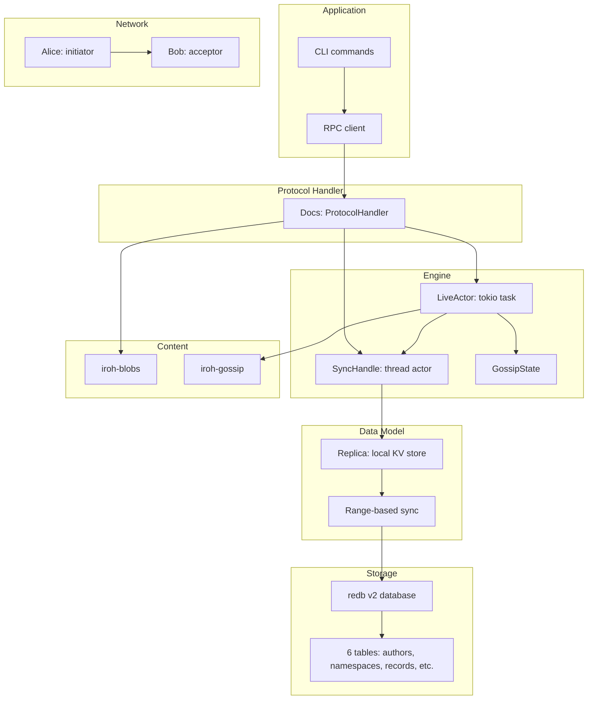

# Overview — What iroh-docs Is and Range-Based Set Reconciliation

iroh-docs provides multi-dimensional key-value documents with efficient P2P synchronization using range-based set reconciliation.

## The Data Model

```
Namespace (write capability)
├── Author (identity key)
│   ├── Key ("path/to/file.txt")
│   │   └── Entry → BLAKE3 hash → iroh-blobs content
│   └── Key ("other/path.md")
│       └── Entry → BLAKE3 hash → iroh-blobs content
└── Author (another identity)
    └── Key ("shared/notes.md")
        └── Entry → BLAKE3 hash → iroh-blobs content
```

Each entry is uniquely identified by the triple: `(NamespaceId, AuthorId, Key)`.

**Key insight:** Entry values are 32-byte BLAKE3 hashes, not the content itself. The content is stored separately via iroh-blobs. This means syncing metadata (entries) is cheap — you sync hashes first, then selectively download content via download policies.

Source: `iroh-docs/src/sync.rs:1` — `SignedEntry`, `Record`, `RecordIdentifier`.

## Dual Signing

Every entry is signed by TWO keys:

1. **Namespace key** — proves you have write capability for the namespace
2. **Author key** — proves who authored the entry

This separation means:
- The namespace secret key is the write capability token (whoever has it can write)
- The author key proves authorship (who wrote what, even in a shared namespace)

Source: `iroh-docs/src/sync.rs:1` — `EntrySignature` with dual validation.

## Architecture at a Glance



## Sync Algorithm: Range-Based Set Reconciliation

Based on [Aljoscha Meyer's paper](https://arxiv.org/abs/2212.13567):

```
Node A                        Node B
  │                             │
  │── fingerprint(range) ──────▶│
  │◀─ fingerprint(range) ──────│
  │                             │
  if fingerprints match: skip  │
  if fingerprints differ:      │
    split range in half        │
    recurse on each half       │
    exchange items in          │
    mismatched leaf ranges     │
```

**Aha:** The range-based approach avoids sending data both peers already have. By comparing XOR-hashes of ranges, the algorithm quickly identifies exactly which entries differ between peers, then only exchanges those entries. With configurable `split_factor` (default 2), it balances communication rounds against computation.

Source: `iroh-docs/src/ranger.rs:1` — `process_message()` implements the core sync algorithm.

## Quick Start

```rust
// Combine Docs with Blobs and Gossip via iroh's Router
let docs = Docs::builder()
    .storage(Storage::persistent("my-docs.redb").await?)
    .spawn(blobs.clone(), gossip.clone())
    .await?;

let router = iroh::protocol::Router::builder(endpoint)
    .accept(iroh_gossip::ALPN.to_vec(), gossip.clone())
    .accept(iroh_blobs::ALPN.to_vec(), blobs.clone())
    .accept(iroh_docs::ALPN.to_vec(), docs.clone())
    .spawn()
    .await?;
```

Source: `iroh-docs/README.md:1`

## Feature Flags

| Feature | Default | Purpose |
|---------|---------|---------|
| `net` | ✅ | Network protocol (Alice/Bob sync) |
| `metrics` | ✅ | Prometheus metrics |
| `engine` | ✅ | Live sync engine with gossip |
| `test-utils` | ✅ | Test utilities |
| `cli` | — | CLI commands |
| `rpc` | — | quic-rpc interface |

Source: `iroh-docs/Cargo.toml:features`

## Key Dependencies

| Dependency | Version | Purpose |
|------------|---------|---------|
| `iroh` | 0.90 | P2P networking |
| `iroh-blobs` | 0.91 | Content-addressed storage |
| `iroh-gossip` | 0.100 | Gossip protocol |
| `redb` | 2 | Persistent store |
| `redb_v1` | 1.5.1 | Migration from v1 to v2 |
| `quic-rpc` | 0.20 | RPC system |
| `ed25519-dalek` | =3.0.0-pre.7 | Signing keys |

Source: `iroh-docs/Cargo.toml:dependencies`

## Related Documents

- [Architecture](../markdown/01-architecture.md) — Full dependency graph
- [Replica](../markdown/02-replica.md) — Data model details
